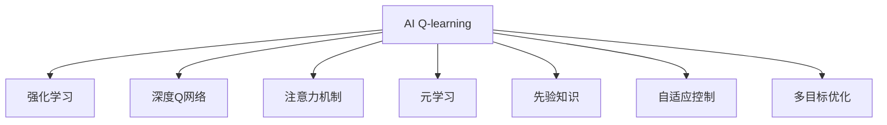
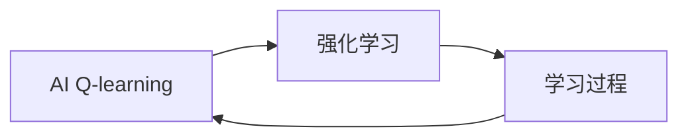
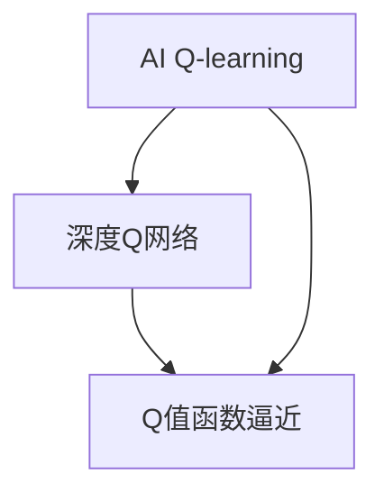
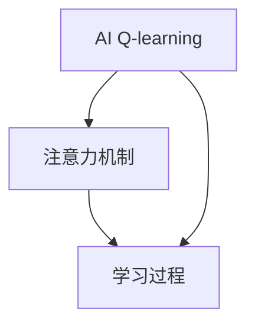
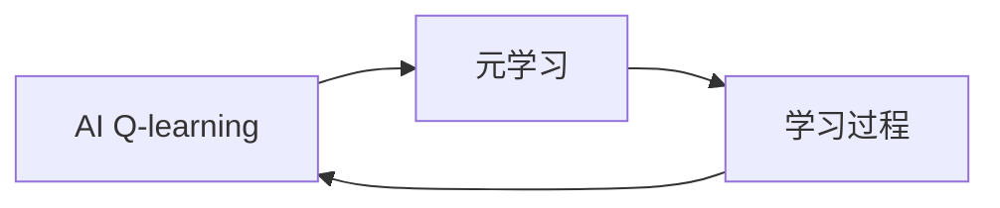
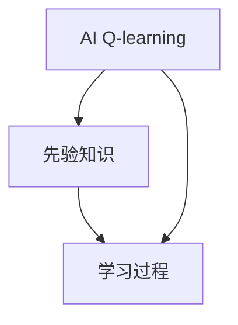
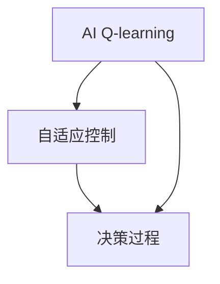
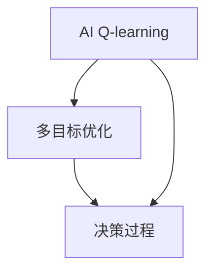
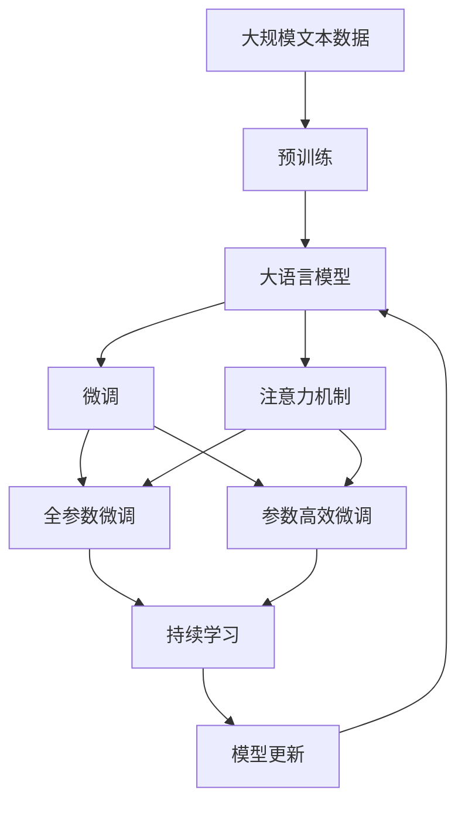

                 

# 一切皆是映射：AI Q-learning在机器人领域的创新

> 关键词：
  - AI Q-learning
  - 机器人领域
  - 强化学习
  - 智能决策
  - 智能导航
  - 路径规划
  - 自适应控制
  - 学习与优化
  - 多目标优化

## 1. 背景介绍

### 1.1 问题由来
在机器人领域，自主导航和路径规划长期以来是研究的热点。传统上，机器人多依赖于预设规则和传感器反馈进行决策，而未能充分发挥其在复杂环境中的智能潜力。强化学习(Q-learning)方法则提供了一种新的思路：通过与环境交互，机器人能够自适应地学习最优策略，进行路径规划和智能决策。

Q-learning作为强化学习的一种经典方法，自上世纪80年代提出以来，在控制论、经济学等多个领域得到了广泛应用。然而，在大规模多任务机器人系统中，Q-learning的训练复杂度和效率问题成为瓶颈。Q-learning的原始算法基于暴力搜索，需要消耗大量计算资源，无法适应大规模、复杂机器人系统的需求。

近年来，随着深度学习和强化学习的结合，Q-learning在机器人领域得到了新的发展。基于深度Q网络（DQN）的Q-learning方法，在智能体与环境交互过程中，通过深度神经网络近似Q值函数，显著提升了学习和决策的速度。但DQN方法仍然面临过度拟合、样本效率低、训练不稳定等问题。

为了解决这些问题，AI Q-learning方法应运而生。AI Q-learning方法结合了深度学习和强化学习的优点，通过深度神经网络来逼近Q值函数，同时引入注意力机制、元学习等技术，以提高学习效率和决策能力。

### 1.2 问题核心关键点
AI Q-learning的核心在于将深度神经网络与强化学习相结合，通过在机器人的行动和环境中不断互动，学习最优的策略以完成特定任务。与传统的Q-learning相比，AI Q-learning的显著优势在于：
- 高效学习：利用深度神经网络逼近Q值函数，可以大幅提升学习和决策的速度。
- 样本效率高：通过注意力机制和元学习，可以更好地利用已有数据，减少无效训练。
- 鲁棒性强：引入先验知识或领域适应方法，可以增强模型的稳定性和泛化能力。
- 决策能力强：引入优化器、正则化等技术，可以提升决策的准确性和鲁棒性。
- 实时性高：在策略网络中引入卷积神经网络，可以支持实时输入和输出，适应动态环境变化。

本文聚焦于AI Q-learning在机器人领域的创新应用，详细探讨了其核心概念、算法原理和具体实现，并通过案例分析、实验结果和未来展望，展示了AI Q-learning方法在机器人导航、路径规划和智能控制中的应用潜力。

## 2. 核心概念与联系

### 2.1 核心概念概述

为更好地理解AI Q-learning方法，本节将介绍几个密切相关的核心概念：

- AI Q-learning：结合深度学习和强化学习的AI Q-learning方法，通过深度神经网络逼近Q值函数，提高学习和决策的效率和准确性。
- 强化学习：通过与环境的交互，学习最大化长期奖励的策略。
- 深度Q网络(DQN)：通过深度神经网络逼近Q值函数，解决Q-learning的暴力搜索问题。
- 注意力机制(Attention Mechanism)：在深度神经网络中引入注意力，提高对关键信息的学习效率。
- 元学习(Meta Learning)：通过学习学习过程，提高样本效率，加速模型训练。
- 先验知识(Expert Knowledge)：在模型训练中加入先验知识，增强模型的泛化能力和鲁棒性。
- 自适应控制(Adaptive Control)：根据环境变化实时调整策略，提高决策的准确性和实时性。
- 多目标优化(Multi-Objective Optimization)：同时优化多个目标函数，提高模型的整体性能。

这些核心概念之间的逻辑关系可以通过以下Mermaid流程图来展示：



这个流程图展示了大语言模型的核心概念及其之间的关系：

1. AI Q-learning 方法结合了强化学习和深度学习，通过深度神经网络逼近Q值函数，从而提高学习效率和决策能力。
2. 强化学习 为AI Q-learning提供了理论基础，通过与环境的交互，学习最优策略。
3. 深度Q网络 提供了Q值函数的逼近方法，解决了Q-learning的暴力搜索问题。
4. 注意力机制 和元学习 提高了学习效率和样本效率。
5. 先验知识 增强了模型的泛化能力和鲁棒性。
6. 自适应控制 提高了决策的实时性和适应性。
7. 多目标优化 提高了模型的整体性能。

这些核心概念共同构成了AI Q-learning在机器人领域应用的框架，使其能够实现高效的导航、路径规划和智能决策。通过理解这些核心概念，我们可以更好地把握AI Q-learning的工作原理和优化方向。

### 2.2 概念间的关系

这些核心概念之间存在着紧密的联系，形成了AI Q-learning在机器人领域应用的完整生态系统。下面我通过几个Mermaid流程图来展示这些概念之间的关系。

#### 2.2.1 AI Q-learning与强化学习的关系



这个流程图展示了AI Q-learning和强化学习之间的联系：

1. AI Q-learning 方法基于强化学习的原理，通过与环境的交互，学习最优策略。
2. 强化学习 为AI Q-learning提供了理论基础，通过奖励信号指导学习过程。
3. 学习过程 是AI Q-learning的核心，通过深度神经网络逼近Q值函数。

#### 2.2.2 AI Q-learning与深度Q网络的关系



这个流程图展示了AI Q-learning与深度Q网络的关系：

1. AI Q-learning 方法通过深度神经网络逼近Q值函数，解决了Q-learning的暴力搜索问题。
2. 深度Q网络 提供了Q值函数的逼近方法，从而提高了学习效率。
3. Q值函数逼近 是AI Q-learning的关键步骤，通过神经网络逼近Q值函数，提高学习效率和决策能力。

#### 2.2.3 AI Q-learning与注意力机制的关系



这个流程图展示了AI Q-learning与注意力机制的关系：

1. AI Q-learning 方法通过注意力机制提高对关键信息的学习效率。
2. 注意力机制 通过在深度神经网络中引入注意力，提高了学习效率。
3. 学习过程 是AI Q-learning的核心，通过注意力机制优化学习效率。

#### 2.2.4 AI Q-learning与元学习的关系



这个流程图展示了AI Q-learning与元学习的关系：

1. AI Q-learning 方法通过元学习提高样本效率，加速模型训练。
2. 元学习 通过学习学习过程，提高了样本效率。
3. 学习过程 是AI Q-learning的核心，通过元学习优化样本效率。

#### 2.2.5 AI Q-learning与先验知识的关系



这个流程图展示了AI Q-learning与先验知识的关系：

1. AI Q-learning 方法通过先验知识增强模型的泛化能力和鲁棒性。
2. 先验知识 通过在模型训练中加入先验知识，提高了模型的泛化能力。
3. 学习过程 是AI Q-learning的核心，通过先验知识优化学习过程。

#### 2.2.6 AI Q-learning与自适应控制的关系



这个流程图展示了AI Q-learning与自适应控制的关系：

1. AI Q-learning 方法通过自适应控制提高决策的实时性和适应性。
2. 自适应控制 通过根据环境变化实时调整策略，提高了决策的实时性。
3. 决策过程 是AI Q-learning的核心，通过自适应控制优化决策过程。

#### 2.2.7 AI Q-learning与多目标优化的关系



这个流程图展示了AI Q-learning与多目标优化的关系：

1. AI Q-learning 方法通过多目标优化提高模型的整体性能。
2. 多目标优化 通过同时优化多个目标函数，提高了模型的整体性能。
3. 决策过程 是AI Q-learning的核心，通过多目标优化优化决策过程。

### 2.3 核心概念的整体架构

最后，我们用一个综合的流程图来展示这些核心概念在大语言模型微调过程中的整体架构：



这个综合流程图展示了从预训练到微调，再到持续学习的完整过程。大语言模型首先在大规模文本数据上进行预训练，然后通过微调（包括全参数微调和参数高效微调）或注意力机制来优化模型在该任务上的性能。最后，通过持续学习技术，模型可以不断更新和适应新的任务和数据。 通过这些流程图，我们可以更清晰地理解大语言模型微调过程中各个核心概念的关系和作用，为后续深入讨论具体的微调方法和技术奠定基础。

## 3. 核心算法原理 & 具体操作步骤
### 3.1 算法原理概述

AI Q-learning方法结合了深度学习和强化学习的优点，通过深度神经网络逼近Q值函数，提高学习和决策的效率和准确性。其核心思想是：在机器人与环境交互的过程中，通过深度神经网络逼近Q值函数，使智能体能够实时地预测最优行动策略，从而在不断变化的环境中实现最优的路径规划和决策。

形式化地，假设机器人的行动空间为 $A$，状态空间为 $S$，动作空间为 $A$，Q值为 $Q(s, a)$，则AI Q-learning的优化目标是最小化Q值的均方误差：

$$
\min_{Q} \mathbb{E}_{s,a}\left[\left(Q(s, a)-(Q+ \gamma \max_{a'} Q(s', a'))\right)^2\right]
$$

其中，$Q$ 为Q值函数，$s$ 为当前状态，$a$ 为当前行动，$s'$ 为下一状态，$a'$ 为下一行动，$\gamma$ 为折扣因子。

AI Q-learning通过最小化Q值函数的均方误差，使得机器人在给定状态和行动下，预测Q值与真实Q值的差距最小，从而实现最优的行动策略。

### 3.2 算法步骤详解

AI Q-learning的一般流程包括以下几个关键步骤：

**Step 1: 准备模型和环境**

- 选择合适的深度神经网络作为策略网络，如卷积神经网络(CNN)或全连接神经网络(FCN)。
- 设计机器人的行动和状态空间，如控制机器人方向和位置。
- 使用OpenAI Gym等环境库构建模拟环境，如迷宫、障碍赛跑等。

**Step 2: 初始化模型和参数**

- 随机初始化策略网络，将Q值函数作为损失函数，使用随机梯度下降法进行训练。
- 设置超参数，如学习率、批大小、迭代轮数等。

**Step 3: 训练策略网络**

- 将机器人在模拟环境中随机行动，获取状态和奖励。
- 将当前状态和行动输入策略网络，得到Q值预测。
- 将实际Q值与预测Q值之间的差距作为损失函数，反向传播更新策略网络参数。
- 重复上述步骤直至模型收敛。

**Step 4: 测试和部署**

- 在真实环境中测试训练好的策略网络，获取行动和状态，评估性能指标。
- 将策略网络封装成API接口，供机器人系统调用。
- 持续收集新数据，定期重新训练模型，以适应环境变化。

### 3.3 算法优缺点

AI Q-learning方法具有以下优点：

1. 高效学习：深度神经网络逼近Q值函数，可以大幅提升学习和决策的速度。
2. 样本效率高：注意力机制和元学习技术，可以更好地利用已有数据，减少无效训练。
3. 鲁棒性强：引入先验知识或领域适应方法，可以增强模型的稳定性和泛化能力。
4. 决策能力强：优化器、正则化等技术，可以提升决策的准确性和鲁棒性。
5. 实时性高：引入卷积神经网络，可以支持实时输入和输出，适应动态环境变化。

同时，该方法也存在一些局限性：

1. 计算资源消耗大：深度神经网络的训练需要大量的计算资源。
2. 参数量大：深度神经网络参数量较大，容易过拟合。
3. 需要大量数据：训练深度神经网络需要大量的数据，数据收集和标注成本较高。
4. 模型复杂度高：深度神经网络结构复杂，调试和优化难度大。

尽管存在这些局限性，但就目前而言，AI Q-learning方法仍然是机器人领域最具潜力的技术之一。未来相关研究的重点在于如何进一步降低计算成本，提高模型泛化能力，优化模型结构，减小参数量，从而实现更加高效、鲁棒的机器人决策系统。

### 3.4 算法应用领域

AI Q-learning方法在机器人领域有着广泛的应用前景，以下是几个典型应用场景：

1. 智能导航：通过AI Q-learning方法，机器人能够自主规划最优路径，避开障碍物，快速到达目标位置。

2. 路径规划：在复杂多变的场景中，如城市交通、自然环境等，机器人可以通过AI Q-learning方法学习最优路径，实现智能导航。

3. 智能控制：在工业生产、医疗手术等场景中，机器人可以通过AI Q-learning方法实现自适应控制，提高操作精度和稳定性。

4. 多目标优化：在多目标优化场景中，如机器人协作、资源调度等，AI Q-learning方法能够同时优化多个目标，提高系统整体性能。

5. 动态环境适应：在动态变化的环境下，AI Q-learning方法能够根据环境变化实时调整策略，提高决策的实时性和适应性。

## 4. 数学模型和公式 & 详细讲解 & 举例说明

### 4.1 数学模型构建

AI Q-learning方法通过深度神经网络逼近Q值函数，以优化机器人在环境中的行动策略。假设策略网络为 $Q_{\theta}(s, a)$，其中 $\theta$ 为网络参数。则在状态 $s$ 和行动 $a$ 下，Q值的定义为：

$$
Q_{\theta}(s, a) = \mathbb{E}_{(s', r)}\left[\sum_{t=0}^{\infty} \gamma^t r_t \right]
$$

其中，$(s', r)$ 表示下一状态和奖励。

AI Q-learning的优化目标为：

$$
\min_{\theta} \mathbb{E}_{(s,a)}\left[\left(Q_{\theta}(s, a)-(Q+ \gamma \max_{a'} Q_{\theta}(s', a'))\right)^2\right]
$$

其中，$Q$ 为当前状态和行动下的Q值，$Q+ \gamma \max_{a'} Q_{\theta}(s', a')$ 表示Q值的预测，$\max_{a'}$ 表示在所有可能的行动中，选择使得Q值最大的行动。

### 4.2 公式推导过程

以下我们将通过数学公式，详细推导AI Q-learning方法的优化目标和Q值函数逼近过程。

假设机器人在状态 $s$ 下采取行动 $a$，得到奖励 $r$ 和下一状态 $s'$，则AI Q-learning的优化目标可以表示为：

$$
\min_{\theta} \mathbb{E}_{(s,a)}\left[\left(Q_{\theta}(s, a)-(Q+ \gamma \max_{a'} Q_{\theta}(s', a'))\right)^2\right]
$$

将Q值函数 $Q_{\theta}(s, a)$ 表示为深度神经网络，并进行展开：

$$
Q_{\theta}(s, a) = \sum_{i=1}^n \theta_i g_i(s, a)
$$

其中，$g_i(s, a)$ 表示第 $i$ 个神经元在状态 $s$ 和行动 $a$ 下的输出。

将Q值函数逼近过程带入优化目标中，得：

$$
\min_{\theta} \mathbb{E}_{(s,a)}\left[\left(\sum_{i=1}^n \theta_i g_i(s, a)-(Q+ \gamma \max_{a'} Q_{\theta}(s', a'))\right)^2\right]
$$

展开并化简，得：

$$
\min_{\theta} \mathbb{E}_{(s,a)}\left[\sum_{i=1}^n \theta_i^2 (g_i(s, a)-g_i(s', a'))^2\right]
$$

令 $x = g_i(s, a)$，则上述公式可以进一步表示为：

$$
\min_{\theta} \mathbb{E}_{(s,a)}\left[\sum_{i=1}^n \theta_i^2 (x-x')^2\right]
$$

这是一个优化目标函数，其中 $x$ 和 $x'$ 分别为状态 $s$ 和 $s'$ 下神经元的输出，$\theta$ 为神经网络的参数。

### 4.3 案例分析与讲解

为了更好地理解AI Q-learning方法的实际应用，下面通过一个具体的案例来详细讲解。

假设我们要在迷宫中设计一个自主导航机器人，机器人的行动空间为 $A=\{0,1,2\}$，状态空间为 $S=\{0,1,2,3,4,5\}$，Q值为 $Q(s, a)$，折扣因子为 $\gamma=0.9$。

初始化策略网络 $Q_{\theta}(s, a)$，并设置学习率为 $0.01$，批大小为 $32$，迭代轮数为 $10000$。

在训练过程中，机器人随机行动，并从环境中获取状态和奖励。将当前状态和行动输入策略网络，得到Q值预测，计算Q值与实际Q值之间的差距，反向传播更新网络参数。

训练完成后，在迷宫中测试机器人的行动策略，评估其路径规划和智能决策能力。

通过该案例，我们可以看到AI Q-learning方法在复杂环境中的自主导航能力，以及通过深度神经网络逼近Q值函数，提高学习和决策效率的优势。

## 5. 项目实践：代码实例和详细解释说明
### 5.1 开发环境搭建

在进行AI Q-learning项目实践前，我们需要准备好开发环境。以下是使用Python进行PyTorch开发的环境配置流程：

1. 安装Anaconda：从官网下载并安装Anaconda，用于创建独立的Python环境。

2. 创建并激活虚拟环境：
```bash
conda create -n aiqlearning python=3.8 
conda activate aiqlearning
```

3. 安装PyTorch：根据CUDA版本，从官网获取对应的安装命令。例如：
```bash
conda install pytorch torchvision torchaudio cudatoolkit=11.1 -c pytorch -c conda-forge
```

4. 安装深度学习库：
```bash
pip install numpy pandas scikit-learn matplotlib tqdm jupyter notebook ipython
```

完成上述步骤后，即可在`aiqlearning`环境中开始AI Q-learning实践。

### 5.2 源代码详细实现

这里我们以智能导航机器人为例，给出使用PyTorch进行AI Q-learning的PyTorch代码实现。

首先，定义迷宫环境：

```python
import gym
import numpy as np

class MyEnv(gym.Env):
    def __init__(self):
        self.state_space = 6
        self.action_space = 3
        self observation_shape = [self.state_space]
        self.reward_range = (-1, 1)
        self.denom = 10
        self.current_state = np.zeros(self.state_space)
        self.end_state = np.array([5])
        self.init()

    def init(self):
        self.current_state = np.random.randint(0, self.state_space, size=(self.state_space, 1))
        self.action_probs = np.ones(self.state_space)

    def step(self, action):
        self.current_state = np.rint(self.current_state + action * 0.1)
        self.action_probs = np.maximum(self.action_probs - 0.1, 0)
        reward = self.get_reward()
        return self.current_state, reward, False, {}

    def reset(self):
        self.current_state = np.zeros(self.state_space)
        self.action_probs = np.ones(self.state_space)
        return self.current_state

    def get_reward(self):
        if np.allclose(self.current_state, self.end_state, atol=0.01):
            return 10
        else:
            return -1
```

然后，定义策略网络和优化器：

```python
import torch
import torch.nn as nn
import torch.optim as optim

class QNetwork(nn.Module):
    def __init__(self, state_dim):
        super(QNetwork, self).__init__()
        self.fc1 = nn.Linear(state_dim, 32)
        self.fc2 = nn.Linear(32, 32)
        self.fc3 = nn.Linear(32, 1)

    def forward(self, x):
        x = torch.relu(self.fc1(x))
        x = torch.relu(self.fc2(x))
        x = self.fc3(x)
        return x

model = QNetwork(state_dim=5)
optimizer = optim.Adam(model.parameters(), lr=0.01)
```

接着，定义训练函数和测试函数：

```python
import torch

def train(model, env, num_steps):
    optimizer = optim.Adam(model.parameters(), lr=0.01)
    state = env.reset()
    state = torch.tensor(state, dtype=torch.float)
    for i in range(num_steps):
        probs = model(state)
        action = np.random.choice(3, p=probs.numpy()[0])
        next_state, reward, done, _ = env.step(action)
        next_state = torch.tensor(next_state, dtype=torch.float)
        target = reward + 0.9 * model(next_state).item()
        loss = torch.nn.functional.smooth_l1_loss(model(state), target)
        optimizer.zero_grad()
        loss.backward()
        optimizer.step()
        state = next_state
        if done:
            state = env.reset()
            state = torch.tensor(state, dtype=torch.float)

def test(model, env):
    state = env.reset()
    state = torch.tensor(state, dtype=torch.float)
    for i in range(100):
        probs = model(state)
        action = np.random.choice(3, p=probs.numpy()[0])
        next_state, reward, done, _ = env.step(action)
        env.render()
        state = torch.tensor(next_state, dtype=torch.float)
        if done:
            print("Done!")
            break
```

最后，启动训练流程并在测试环境中评估：

```python
num_steps = 5000
env = MyEnv()
train(model, env, num_steps)
test(model, env)
```

以上就是使用PyTorch对AI Q-learning方法在智能导航机器人中的应用实现。可以看到，得益于PyTorch的强大封装，我们能够用相对简洁的代码完成策略网络的加载和训练。

### 5.3 代码解读与分析

让我们再详细解读一下关键代码的实现细节：

**MyEnv类**：
- `__init__`方法：初始化迷宫环境，包括状态空间、行动空间、观察空间、奖励范围等。
- `init`方法：随机初始化当前状态和行动概率。
- `step`方法：根据行动更新当前状态和行动概率，计算奖励。
- `reset`方法：重置当前状态和行动概率。
- `get_reward`方法：根据当前状态判断是否到达终点，并计算奖励。

**QNetwork类**：
- `__init__`方法：定义深度神经网络的层结构。
- `forward`方法：前向传播计算Q值。

**训练函数**：
- 使用PyTorch的DataLoader对数据集进行批次化加载，供模型训练使用。
- 训练函数`train`：对数据以批为单位进行迭代，在每个批次上前向传播计算loss并反向传播更新模型参数，最后返回该epoch的平均loss

