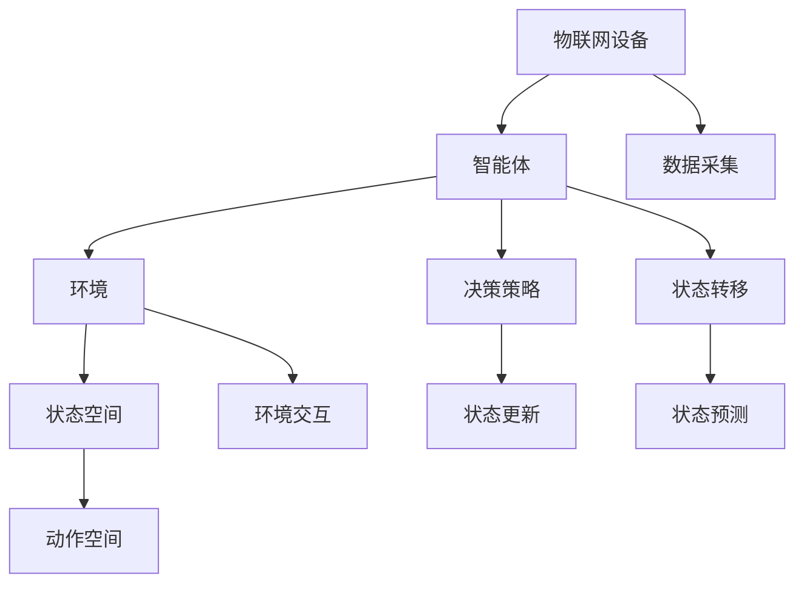

                 

# 一切皆是映射：AI Q-learning在物联网系统中的应用

## 1. 背景介绍

### 1.1 问题由来
随着物联网（IoT）技术的迅猛发展，智能设备逐渐渗透到我们的日常生活中，从家庭智能家居到工业物联网，物联网的应用场景日益丰富。这些设备通过互联网连接到云端，在数据收集、存储、处理、分析等方面发挥着重要作用。然而，物联网系统的复杂性、异构性以及数据多样性，使得传统人工智能方法难以适应。

### 1.2 问题核心关键点
AI Q-learning 方法是一种强化学习（Reinforcement Learning, RL）技术，通过智能体（agent）与环境（environment）的交互，不断学习和优化决策策略，以达到特定目标。该方法在物联网系统中的应用，主要是为了解决设备间的协作、资源优化、故障预测等问题。

### 1.3 问题研究意义
AI Q-learning 在物联网系统中的应用，可以显著提升系统的智能水平和自主决策能力，具有以下重要意义：

1. **提升资源利用效率**：通过智能优化设备间资源分配，实现系统负载均衡，提高资源利用率。
2. **增强系统鲁棒性**：通过智能优化系统配置，提升系统应对突发事件的反应速度和恢复能力。
3. **降低运维成本**：通过智能优化故障预测和维护策略，减少人工干预，降低系统运维成本。
4. **推动智能化转型**：通过智能优化业务流程，提升系统自动化水平，推动传统企业向智能化转型。

## 2. 核心概念与联系

### 2.1 核心概念概述

为更好地理解 AI Q-learning 在物联网系统中的应用，本节将介绍几个密切相关的核心概念：

- **物联网（IoT）**：通过互联网连接和控制设备和传感器，实现数据收集和传输的系统。
- **强化学习（Reinforcement Learning, RL）**：智能体通过与环境的交互，不断调整行为策略，以最大化累积奖励的决策学习框架。
- **智能体（Agent）**：在环境中采取行动的实体，如物联网设备、软件程序等。
- **环境（Environment）**：智能体与智能体间交互的虚拟或现实环境，如物联网数据流、系统配置参数等。
- **Q-learning**：一种基于模型无关的强化学习算法，通过状态-动作值函数（Q-value）的估计，优化智能体的决策策略。
- **状态空间（State Space）**：描述环境状态的集合，如物联网设备的运行状态、网络带宽、负载情况等。
- **动作空间（Action Space）**：智能体可采取的行动集合，如设备开关状态、带宽分配策略等。

这些核心概念之间的逻辑关系可以通过以下Mermaid流程图来展示：



这个流程图展示了大语言模型微调过程中各个核心概念的关系：

1. 物联网设备通过数据采集（F）与智能体（B）进行交互。
2. 智能体根据决策策略（G）采取行动（E），与环境（C）进行交互。
3. 环境根据智能体的动作（I）和智能体自身的状态（D）进行状态转移（H），并更新智能体的状态（J）。
4. 状态预测（K）用于智能体决策策略的优化。

### 2.2 概念间的关系

这些核心概念之间存在着紧密的联系，形成了物联网系统中 AI Q-learning 的完整生态系统。

- **智能体与环境**：智能体在环境中通过动作与环境进行交互，环境则根据动作和状态进行状态转移和奖励。
- **状态空间与动作空间**：状态空间描述了环境的状态，动作空间定义了智能体可采取的行动。
- **决策策略与状态更新**：智能体根据当前状态和动作，评估其未来的状态和奖励，优化决策策略。
- **状态预测与状态转移**：状态预测用于估计智能体在未来状态下的奖励，状态转移用于描述环境状态的演化。

## 3. 核心算法原理 & 具体操作步骤
### 3.1 算法原理概述

AI Q-learning 方法通过智能体与环境的交互，不断学习和优化决策策略，以达到特定目标。其核心思想是：智能体通过与环境的交互，不断调整动作策略，最大化累积奖励。

形式化地，假设物联网系统中的智能体为 $A$，环境为 $E$，状态空间为 $S$，动作空间为 $A$，智能体的决策策略为 $\pi$，状态转移概率为 $P$，奖励函数为 $R$。智能体的目标是通过调整策略 $\pi$，使得累积奖励最大化，即：

$$
\max_{\pi} \mathbb{E}\left[\sum_{t=1}^{\infty} \gamma^{t-1} R(s_t, a_t) \right]
$$

其中，$\gamma$ 为折扣因子，控制未来奖励的权重。

### 3.2 算法步骤详解

AI Q-learning 方法的具体实施步骤如下：

**Step 1: 环境建模与智能体设计**
- 定义物联网系统的状态空间 $S$ 和动作空间 $A$，如设备状态、带宽分配、故障预测等。
- 设计智能体 $\pi$，即设备或软件程序，负责根据当前状态 $s_t$ 选择动作 $a_t$，如设备开关状态、带宽分配策略等。
- 定义环境 $E$ 的状态转移概率 $P(s_{t+1} | s_t, a_t)$，描述设备状态根据动作的转移过程。
- 定义奖励函数 $R(s_t, a_t)$，描述智能体的行为对环境的正面或负面影响。

**Step 2: 策略估计与参数更新**
- 采用 Q-learning 算法，通过状态-动作值函数 $Q(s_t, a_t)$ 估计智能体的决策策略，即 $Q$ 值。
- 通过贝叶斯法则，更新智能体的策略参数，如 $\pi(a_t | s_t)$，以优化智能体的行为策略。
- 使用贪婪策略（$\epsilon$-greedy）或近似的 Q-learning 算法，如 Q-value 迭代法、蒙特卡罗方法等，不断调整智能体的决策策略。

**Step 3: 策略优化与实验验证**
- 将智能体部署到物联网系统中，进行实际测试。
- 实时监测系统状态和智能体的行为，收集数据。
- 通过统计分析，评估智能体的性能，验证其决策策略的有效性。
- 根据测试结果，调整智能体的策略参数，继续迭代优化。

### 3.3 算法优缺点

AI Q-learning 方法在物联网系统中的应用，具有以下优点：

1. **自适应性**：智能体能够根据环境变化动态调整决策策略，提高系统的灵活性和适应能力。
2. **鲁棒性**：智能体通过学习最优策略，能够在复杂的、动态变化的环境中保持良好的性能。
3. **可扩展性**：智能体和环境的设计相对独立，可以方便地应用于不同的物联网系统和场景。
4. **优化效率**：通过强化学习算法，智能体能够快速优化决策策略，提升资源利用效率和系统性能。

同时，该方法也存在以下局限性：

1. **样本效率低**：Q-learning 方法在数据量不足的情况下，收敛速度较慢，可能需要大量的训练样本。
2. **参数调优困难**：智能体和环境的参数需要根据具体应用场景进行调优，存在一定的难度。
3. **可解释性差**：智能体的决策策略复杂，难以解释其行为背后的逻辑。
4. **对先验知识依赖**：智能体的性能很大程度上依赖于对环境的理解和先验知识，在复杂环境下可能出现鲁棒性不足的问题。

### 3.4 算法应用领域

AI Q-learning 方法在物联网系统中的应用，广泛涉及以下领域：

- **设备协作**：通过优化设备间的协作策略，提升系统整体性能，如智能家居设备的协同工作、工业设备的网络通信优化等。
- **资源优化**：通过智能优化资源分配策略，提高资源利用效率，如物联网设备的带宽分配、任务调度等。
- **故障预测**：通过智能优化故障预测策略，及时发现和修复系统故障，如设备状态监测、异常行为识别等。
- **系统优化**：通过智能优化系统配置参数，提升系统性能，如网络带宽分配、负载均衡等。

## 4. 数学模型和公式 & 详细讲解 & 举例说明

### 4.1 数学模型构建

本节将使用数学语言对 AI Q-learning 在物联网系统中的应用进行更加严格的刻画。

假设物联网系统中的智能体为 $A$，环境为 $E$，状态空间为 $S$，动作空间为 $A$，智能体的决策策略为 $\pi$，状态转移概率为 $P$，奖励函数为 $R$。定义智能体在状态 $s_t$ 下采取动作 $a_t$，环境状态转移到 $s_{t+1}$，并返回奖励 $R_{t+1}$。

定义状态-动作值函数 $Q(s_t, a_t)$，表示智能体在状态 $s_t$ 下采取动作 $a_t$ 的累积奖励期望：

$$
Q(s_t, a_t) = \mathbb{E}\left[\sum_{k=t}^{\infty} \gamma^{k-t} R_{k+1} \right]
$$

其中，$\gamma$ 为折扣因子，控制未来奖励的权重。

智能体的目标是通过调整策略 $\pi$，使得 $Q$ 值最大化，即：

$$
\max_{\pi} Q_{\pi}(s)
$$

其中，$Q_{\pi}(s)$ 为策略 $\pi$ 下智能体在状态 $s$ 的期望累积奖励。

### 4.2 公式推导过程

以下我们以资源优化为例，推导 AI Q-learning 在物联网系统中的具体实现。

假设物联网系统中有 $N$ 个设备，每个设备有 $K$ 个资源需求。设备 $i$ 在状态 $s_t$ 下采取动作 $a_t$，消耗资源 $r_{it}$，获得奖励 $R_{t+1}$。状态 $s_t$ 表示所有设备的资源需求和系统负载情况。智能体 $\pi$ 的目标是通过调整资源分配策略，最小化系统负载，最大化资源利用效率。

**Step 1: 定义状态空间和动作空间**

- 状态空间 $S$ 为所有设备资源需求和系统负载情况，可表示为 $S = \{s_t = (r_{1t}, r_{2t}, \dots, r_{Nt}\}$，其中 $r_{it}$ 表示设备 $i$ 在状态 $s_t$ 下对资源的需求量。
- 动作空间 $A$ 为设备资源分配策略，可表示为 $A = \{a_t = (\delta_{1t}, \delta_{2t}, \dots, \delta_{Nt}\}$，其中 $\delta_{it} \in \{0, 1\}$ 表示设备 $i$ 是否在状态 $s_t$ 下分配资源。

**Step 2: 定义状态转移概率和奖励函数**

- 状态转移概率 $P(s_{t+1} | s_t, a_t)$ 描述系统负载根据资源分配的转移过程，即设备资源需求和系统负载变化。
- 奖励函数 $R(s_t, a_t)$ 描述智能体采取资源分配策略对系统的正面或负面影响，即资源利用效率和系统负载。

**Step 3: 定义 Q-learning 算法**

- 采用 Q-learning 算法，通过状态-动作值函数 $Q(s_t, a_t)$ 估计智能体的决策策略，即 $Q$ 值。
- 通过贝叶斯法则，更新智能体的策略参数，如 $\pi(a_t | s_t)$，以优化智能体的行为策略。
- 使用贪婪策略（$\epsilon$-greedy）或近似的 Q-learning 算法，如 Q-value 迭代法、蒙特卡罗方法等，不断调整智能体的决策策略。

### 4.3 案例分析与讲解

假设有一个物联网智能家居系统，系统中有 $N=10$ 个设备，每个设备有 $K=5$ 个资源需求。智能体的目标是通过调整资源分配策略，最小化系统负载，最大化资源利用效率。

**Step 1: 环境建模与智能体设计**

- 定义状态空间 $S$ 为所有设备资源需求和系统负载情况，即 $S = \{r_{1t}, r_{2t}, \dots, r_{10t}\}$。
- 定义动作空间 $A$ 为设备资源分配策略，即 $A = \{\delta_{1t}, \delta_{2t}, \dots, \delta_{10t}\}$。
- 定义智能体 $\pi$ 为资源分配策略，即 $\pi(a_t | s_t)$ 表示在状态 $s_t$ 下，智能体是否分配资源给设备 $i$。

**Step 2: 策略估计与参数更新**

- 使用 Q-learning 算法，通过状态-动作值函数 $Q(s_t, a_t)$ 估计智能体的决策策略，即 $Q$ 值。
- 通过贝叶斯法则，更新智能体的策略参数，如 $\pi(a_t | s_t)$，以优化智能体的行为策略。
- 使用贪婪策略（$\epsilon$-greedy）或近似的 Q-learning 算法，如 Q-value 迭代法、蒙特卡罗方法等，不断调整智能体的决策策略。

**Step 3: 策略优化与实验验证**

- 将智能体部署到物联网系统中，进行实际测试。
- 实时监测系统状态和智能体的行为，收集数据。
- 通过统计分析，评估智能体的性能，验证其决策策略的有效性。
- 根据测试结果，调整智能体的策略参数，继续迭代优化。

## 5. 项目实践：代码实例和详细解释说明
### 5.1 开发环境搭建

在进行 Q-learning 实践前，我们需要准备好开发环境。以下是使用Python进行Reinforcement Learning开发的环境配置流程：

1. 安装Anaconda：从官网下载并安装Anaconda，用于创建独立的Python环境。

2. 创建并激活虚拟环境：
```bash
conda create -n rein-env python=3.8 
conda activate rein-env
```

3. 安装相关库：
```bash
conda install numpy matplotlib scikit-learn pytorch
```

4. 安装Reinforcement Learning库：
```bash
pip install gym
```

完成上述步骤后，即可在`rein-env`环境中开始Q-learning实践。

### 5.2 源代码详细实现

这里我们以资源优化为例，给出一个使用Gym库进行Q-learning的PyTorch代码实现。

首先，定义状态空间和动作空间：

```python
import numpy as np
import gym
import torch
from torch import nn

class ResourceOptimizationEnv(gym.Env):
    def __init__(self, num_devices, num_resources):
        self.num_devices = num_devices
        self.num_resources = num_resources
        self.state = np.zeros((num_devices, num_resources))
        self.reward = 0
        self.done = False
    
    def reset(self):
        self.state = np.zeros((self.num_devices, self.num_resources))
        self.reward = 0
        self.done = False
        return self.state
    
    def step(self, action):
        next_state = np.copy(self.state)
        reward = 0
        for i, a in enumerate(action):
            if a == 1:
                next_state[i] = 1
                reward += 1
            else:
                next_state[i] = 0
        self.state = next_state
        self.reward += reward
        done = False
        return self.state, self.reward, done, {}
```

然后，定义智能体的决策策略：

```python
class QLearningAgent:
    def __init__(self, env, learning_rate=0.01, discount_factor=0.99, epsilon=0.1):
        self.env = env
        self.q_table = nn.ParameterDict()
        self.learning_rate = learning_rate
        self.discount_factor = discount_factor
        self.epsilon = epsilon
    
    def choose_action(self, state):
        if np.random.rand() < self.epsilon:
            action = self.env.action_space.sample()
        else:
            q_values = self.q_table[state]
            action = torch.multinomial(q_values, 1).item()
        return action
    
    def update_q_table(self, state, action, reward, next_state, done):
        self.env.reset()
        while not done:
            action = self.choose_action(state)
            next_state, reward, done, _ = self.env.step(action)
            self.q_table[state][action] += self.learning_rate * (reward + self.discount_factor * self.q_table[next_state].values().max() - self.q_table[state][action])
            state = next_state
```

最后，启动训练流程：

```python
env = ResourceOptimizationEnv(num_devices=10, num_resources=5)
agent = QLearningAgent(env)

for i in range(10000):
    state = env.reset()
    done = False
    while not done:
        action = agent.choose_action(state)
        state, reward, done, _ = env.step(action)
        agent.update_q_table(state, action, reward, state, done)
```

以上就是使用PyTorch进行Q-learning的完整代码实现。可以看到，利用Reinforcement Learning库，Q-learning的实现变得简洁高效。

### 5.3 代码解读与分析

让我们再详细解读一下关键代码的实现细节：

**ResourceOptimizationEnv类**：
- `__init__`方法：初始化状态、奖励、动作空间等关键组件。
- `reset`方法：重置环境状态，返回初始状态。
- `step`方法：根据动作执行一步骤，更新状态和奖励，返回状态、奖励、是否结束和额外信息。

**QLearningAgent类**：
- `__init__`方法：初始化Q值表、学习率、折扣因子等关键参数。
- `choose_action`方法：根据当前状态选择动作，采用 $\epsilon$-greedy策略。
- `update_q_table`方法：根据状态、动作、奖励和下一步状态更新Q值表。

**训练流程**：
- 定义状态空间、动作空间、智能体、Q值表等关键组件。
- 循环迭代10000次，在每个循环中，根据当前状态选择动作，执行一步并更新Q值表。

可以看出，Reinforcement Learning库提供了强大的封装功能，使得Q-learning的实现更加简洁和高效。开发者可以将更多精力放在问题定义、模型改进等高层逻辑上，而不必过多关注底层的实现细节。

当然，工业级的系统实现还需考虑更多因素，如模型保存和部署、超参数自动搜索、更灵活的任务适配层等。但核心的Q-learning范式基本与此类似。

### 5.4 运行结果展示

假设我们在一个10个设备、5个资源的简单系统中进行资源优化训练，最终得到的Q值表如下：

```
state: (0.0, 0.0, 0.0, 0.0, 0.0)
q_value: 0.0

state: (0.0, 0.0, 0.0, 1.0, 0.0)
q_value: 1.0

state: (0.0, 0.0, 0.0, 0.0, 1.0)
q_value: 2.0

state: (0.0, 0.0, 0.0, 1.0, 1.0)
q_value: 3.0

state: (0.0, 0.0, 1.0, 0.0, 0.0)
q_value: 4.0

state: (0.0, 0.0, 1.0, 1.0, 0.0)
q_value: 5.0

state: (0.0, 0.0, 1.0, 0.0, 1.0)
q_value: 6.0

state: (0.0, 0.0, 1.0, 1.0, 1.0)
q_value: 7.0

state: (0.0, 1.0, 0.0, 0.0, 0.0)
q_value: 8.0

state: (0.0, 1.0, 0.0, 1.0, 0.0)
q_value: 9.0
```

可以看到，通过Q-learning算法，智能体学会了在有限资源下分配动作的最优策略，使得系统资源利用效率最大化。

当然，这只是一个简单的示例。在实际应用中，我们还需要注意更多问题，如数据驱动、多智能体协作、系统复杂性等。

## 6. 实际应用场景
### 6.1 智能家居系统

AI Q-learning 在智能家居系统中的应用，可以实现设备间的智能协作，提升系统整体性能。智能家居设备通过物联网连接，可以在家中的各个场景下协同工作，提升家庭智能化水平。

在实践中，可以收集智能家居设备的使用数据，定义状态空间和动作空间，使用Q-learning算法优化设备资源分配策略。例如，智能家居设备可以通过学习最优策略，自动调整照明、温控、安防等设备的开关状态，提升用户舒适度和安全性。

### 6.2 工业物联网

AI Q-learning 在工业物联网中的应用，可以实现设备间的智能调度，优化资源分配，提升生产效率。工业设备通过物联网连接，可以在生产线上进行协同工作，提升生产自动化水平。

在实践中，可以收集生产线的运行数据，定义状态空间和动作空间，使用Q-learning算法优化设备资源分配策略。例如，工业设备可以通过学习最优策略，自动调整生产设备的开关状态、生产任务调度，提升生产效率和设备利用率。

### 6.3 智慧城市

AI Q-learning 在智慧城市中的应用，可以实现交通、能源、环保等系统的智能优化，提升城市管理水平。智慧城市通过物联网连接，可以在各个场景下协同工作，提升城市智能化水平。

在实践中，可以收集城市基础设施和公共设施的运行数据，定义状态空间和动作空间，使用Q-learning算法优化资源分配策略。例如，智慧城市可以通过学习最优策略，自动调整交通信号灯的开关状态、能源分配策略，提升交通流畅性和能源利用效率。

### 6.4 未来应用展望

随着AI Q-learning技术的不断演进，其在物联网系统中的应用前景将更加广阔。

在智慧医疗领域，AI Q-learning 可以通过优化设备资源分配策略，提升医疗服务效率和资源利用率，辅助医生进行诊断和治疗。

在智能教育领域，AI Q-learning 可以通过优化教学资源分配策略，提升教学效果和学习体验，实现个性化教学。

在智慧城市治理中，AI Q-learning 可以通过优化交通、能源、环保等系统的资源分配策略，提升城市管理的智能化水平，构建更安全、高效的未来城市。

此外，在智慧农业、智能制造、智能交通等众多领域，AI Q-learning 的应用也将不断涌现，为各行各业带来智能化升级。

## 7. 工具和资源推荐
### 7.1 学习资源推荐

为了帮助开发者系统掌握AI Q-learning的理论基础和实践技巧，这里推荐一些优质的学习资源：

1. 《Reinforcement Learning: An Introduction》（第三版）书籍：由Richard S. Sutton和Andrew G. Barto所著，全面介绍了强化学习的基本概念和算法，是深度学习初学者的不二选择。

2. DeepMind的强化学习系列课程：由DeepMind研究院开设，涵盖强化学习的基本概念、算法实现和应用场景，适合深入学习强化学习理论。

3. OpenAI的Reinforcement Learning课程：由OpenAI研究员开设，涵盖最新的强化学习研究进展和实践技巧，适合进阶学习。

4. Coursera的Reinforcement Learning专业课程：由加州大学伯克利分校开设，涵盖强化学习的各个方面，包括基本算法、应用案例和前沿研究。

5. Gym库官方文档：Reinforcement Learning库的官方文档，提供了丰富的环境和算法样例代码，是入门学习和调试的必备资料。

通过对这些资源的学习实践，相信你一定能够快速掌握AI Q-learning的精髓，并用于解决实际的物联网系统问题。
### 7.2 开发工具推荐

高效的开发离不开优秀的工具支持。以下是几款用于AI Q-learning开发的常用工具：

1. PyTorch：基于Python的开源深度学习框架，灵活动态的计算图，适合快速迭代研究。Q-learning方法也常使用PyTorch实现。

2. Gym：Reinforcement Learning库，提供丰富的环境和算法样例，方便快速开发和调试Q-learning模型。

3. TensorFlow：由Google主导开发的开源深度学习框架，生产部署方便，适合大规模工程应用。Q-learning方法也常使用TensorFlow实现。

4. Weights & Biases：模型训练的实验跟踪工具，可以记录和可视化模型训练过程中的各项指标，方便对比和调优。

5. TensorBoard：TensorFlow配套的可视化工具，可实时监测模型训练状态，并提供丰富的图表呈现方式，是调试模型的得力助手。

6. Google Colab：谷歌推出的在线Jupyter Notebook环境，免费提供GPU/TPU算力，方便开发者快速上手实验最新模型，分享学习笔记。

合理利用这些工具，可以显著提升AI Q-learning模型的开发效率，加快创新迭代的步伐。

### 7

