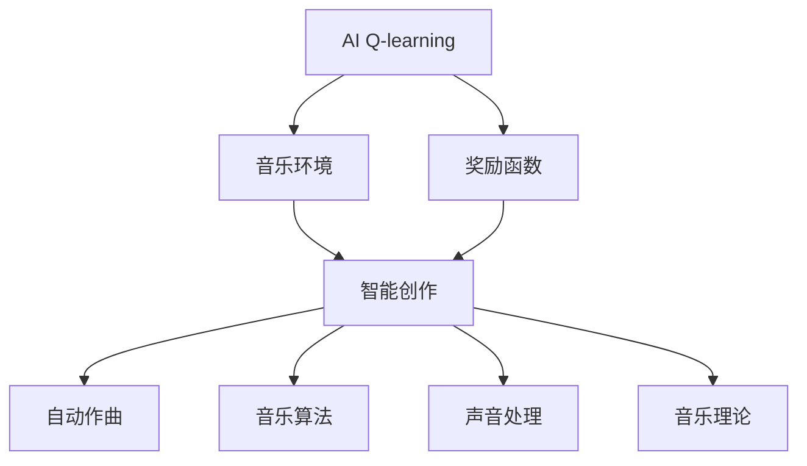
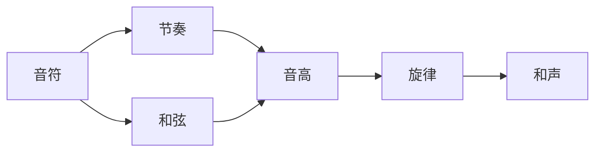
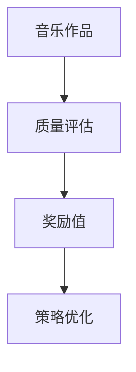
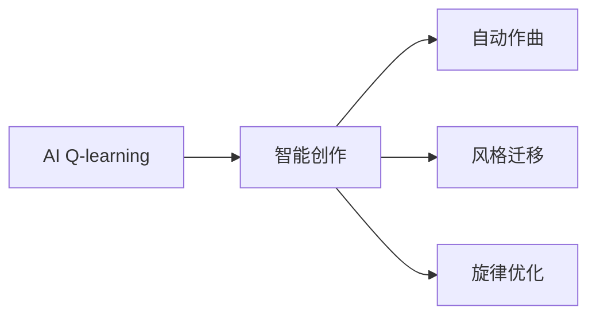

                 

# 一切皆是映射：AI Q-learning在音乐制作中的应用

> 关键词：
- 人工智能
- Q-learning
- 音乐制作
- 优化问题
- 智能创作
- 自动作曲
- 模型训练
- 音乐算法
- 声音处理
- 音乐理论

## 1. 背景介绍

### 1.1 问题由来
在音乐创作中，传统的创作方法往往依赖于人类的音乐理论知识和灵感，创作周期长、难度大。而随着人工智能技术的迅猛发展，AI技术开始在音乐制作领域崭露头角，特别是在自动作曲、音乐风格迁移等方面，展现出了强大的潜力和价值。

AI Q-learning作为一种强化学习算法，通过学习最优策略以最大化长期奖励，已经在许多领域取得了显著成果，例如自动游戏、机器人控制等。将Q-learning应用于音乐创作，可以让机器通过不断试错和优化，逐步形成独特的音乐风格和结构，从而推动音乐制作自动化、智能化进程。

### 1.2 问题核心关键点
AI Q-learning在音乐制作中的应用，核心在于通过学习最优动作序列，使机器能够在特定的音乐环境中做出最优决策，逐步形成独特的音乐作品。具体关键点包括：
- 定义音乐环境：将音乐环境建模为状态空间和动作空间，从而便于Q-learning进行优化。
- 设计奖励函数：通过奖励函数评估音乐作品的质量，引导Q-learning学习更好的创作策略。
- 实施Q-learning算法：通过Q-learning算法更新策略，逐步优化音乐创作过程。
- 评估和反馈：对创作结果进行评估，并将反馈用于下一步的优化调整。

### 1.3 问题研究意义
AI Q-learning在音乐制作中的应用，可以带来以下显著效益：
- 提升创作效率：通过机器自动化创作，极大降低人工创作的时间和成本。
- 扩展创作空间：机器可以探索人类难以触及的音乐风格和结构，拓宽音乐创作的边界。
- 增强创新能力：机器可以不断试错和优化，生成新颖且富有创意的音乐作品。
- 推动教育普及：AI音乐创作工具的普及，可以帮助更多人学习和掌握音乐创作技巧，促进音乐教育的发展。
- 促进产业升级：AI音乐创作技术可以为音乐制作、演出、版权等领域带来革命性的变化，推动音乐产业的全面升级。

## 2. 核心概念与联系

### 2.1 核心概念概述

为更好地理解AI Q-learning在音乐制作中的应用，本节将介绍几个密切相关的核心概念：

- AI Q-learning（强化学习的一种）：通过学习在特定环境中的最优策略，最大化长期奖励的强化学习算法。在音乐制作中，可以将音乐创作过程建模为强化学习环境，通过不断试错和优化，生成高质量的音乐作品。
- 音乐环境：将音乐创作过程建模为状态空间和动作空间，音乐状态包括音符、节奏、和弦、音高等要素，动作空间包括选择不同音符、节奏、和弦等操作。
- 奖励函数：用于评估音乐作品的质量，可以基于音乐理论、听众反馈、风格相似度等指标设计。
- 智能创作：通过AI技术自动生成音乐作品，涵盖自动作曲、音乐风格迁移、旋律优化等多个方面。
- 自动作曲：利用AI技术自动生成新的音乐作品，无需人工干预。
- 音乐算法：涵盖音高分析、节奏生成、和声设计等多个方面的算法技术。
- 声音处理：包括音频录制、编辑、合成等技术，是音乐制作的基础。
- 音乐理论：音乐创作和表演的基本规则和方法，是AI音乐创作的基础。

这些核心概念之间的逻辑关系可以通过以下Mermaid流程图来展示：



这个流程图展示了大语言模型微调过程中各个核心概念之间的关系：

1. AI Q-learning是核心算法，通过学习最优策略生成音乐作品。
2. 音乐环境将音乐创作过程建模为状态空间和动作空间，供Q-learning优化。
3. 奖励函数评估音乐作品质量，指导Q-learning学习。
4. 智能创作涵盖了自动作曲、风格迁移等具体应用场景。
5. 自动作曲、音乐算法、声音处理和音乐理论是实现智能创作的具体技术手段。

### 2.2 概念间的关系

这些核心概念之间存在着紧密的联系，形成了AI Q-learning在音乐制作中的应用生态系统。下面我们通过几个Mermaid流程图来展示这些概念之间的关系。

#### 2.2.1 音乐环境的构建



这个流程图展示了音乐环境中的主要元素及其关系。音符、节奏、和弦、音高等元素构成了音乐作品的基本单元，通过组合生成完整的旋律和和声。

#### 2.2.2 奖励函数的定义



这个流程图展示了奖励函数的定义和作用。通过音乐作品的质量评估，计算出相应的奖励值，指导Q-learning策略的优化。

#### 2.2.3 智能创作的过程



这个流程图展示了智能创作的主要应用场景。通过AI Q-learning，可以自动作曲、进行风格迁移、优化旋律等，涵盖音乐创作的多个方面。

## 3. 核心算法原理 & 具体操作步骤
### 3.1 算法原理概述

AI Q-learning在音乐制作中的应用，是基于强化学习原理的。其核心思想是通过学习最优策略，最大化长期奖励。在音乐创作中，可以将音乐创作过程建模为状态空间和动作空间，通过不断试错和优化，生成高质量的音乐作品。

具体来说，AI Q-learning在音乐制作中的应用可以分为以下几个步骤：
1. 定义音乐环境：将音乐创作过程建模为状态空间和动作空间，音乐状态包括音符、节奏、和弦、音高等要素，动作空间包括选择不同音符、节奏、和弦等操作。
2. 设计奖励函数：通过奖励函数评估音乐作品的质量，可以基于音乐理论、听众反馈、风格相似度等指标设计。
3. 实施Q-learning算法：通过Q-learning算法更新策略，逐步优化音乐创作过程。
4. 评估和反馈：对创作结果进行评估，并将反馈用于下一步的优化调整。

### 3.2 算法步骤详解

#### 3.2.1 定义音乐环境

在音乐制作中，可以通过将音乐创作过程建模为状态空间和动作空间，来定义音乐环境。

- 状态空间 $S$：包含音乐创作的各个要素，如音符、节奏、和弦、音高等。
- 动作空间 $A$：包括选择不同音符、节奏、和弦等操作。

例如，可以将音乐创作过程视为一个由音符序列和和弦序列组成的状态序列，每个状态包含当前音符、节奏、和弦等信息，每个动作表示选择下一个音符、节奏或和弦。

#### 3.2.2 设计奖励函数

设计奖励函数是AI Q-learning中至关重要的步骤。奖励函数用于评估音乐作品的质量，指导Q-learning学习更好的创作策略。

- 设计原则：奖励函数应该能够反映音乐作品的质量，如旋律的流畅性、和声的和谐性、风格的独特性等。
- 设计方法：可以通过专家评价、听众调查、音乐理论指标等多种方式设计奖励函数。
- 奖励函数示例：
  - 音符选择奖励：$R(\text{note}) = 1/N \times \text{score}(\text{note})$, 其中 $\text{score}(\text{note})$ 为音符的评分函数。
  - 节奏生成奖励：$R(\text{rhythm}) = 1/L \times \text{score}(\text{rhythm})$, 其中 $\text{score}(\text{rhythm})$ 为节奏的评分函数。
  - 和弦设计奖励：$R(\text{chord}) = 1/C \times \text{score}(\text{chord})$, 其中 $\text{score}(\text{chord})$ 为和弦的评分函数。
  - 作品整体奖励：$R(\text{score}) = 1/M \times \text{score}(\text{music})$, 其中 $\text{score}(\text{music})$ 为作品的评分函数。

#### 3.2.3 实施Q-learning算法

Q-learning算法通过不断更新Q值表（即状态-动作价值表），学习最优策略。

- Q值表定义：$Q(S, A) = r + \gamma \max_{A'} Q(S', A')$, 其中 $S$ 表示当前状态，$A$ 表示当前动作，$r$ 表示即时奖励，$S'$ 表示下一个状态，$A'$ 表示下一个动作，$\gamma$ 表示折扣因子。
- 更新策略：通过不断试错和优化，逐步学习最优策略。
- 算法流程：
  1. 初始化Q值表 $Q(S, A) = 0$。
  2. 在每个状态 $S$ 下，选择一个动作 $A$，执行动作并观察下一个状态 $S'$ 和即时奖励 $r$。
  3. 根据当前状态和动作，更新Q值表 $Q(S, A) = r + \gamma \max_{A'} Q(S', A')$。
  4. 重复2-3步，直到达到终止条件（如达到预设迭代次数）。

#### 3.2.4 评估和反馈

对创作结果进行评估，并将反馈用于下一步的优化调整。

- 评估指标：包括音乐作品的质量、风格独特性、听众满意度等。
- 反馈机制：通过奖励函数反馈创作结果，调整Q值表和策略。
- 优化调整：通过不断试错和优化，逐步生成高质量的音乐作品。

### 3.3 算法优缺点

AI Q-learning在音乐制作中的应用具有以下优点：

1. 自动化创作：通过机器自动化创作，极大降低人工创作的时间和成本。
2. 拓展创作空间：机器可以探索人类难以触及的音乐风格和结构，拓宽音乐创作的边界。
3. 增强创新能力：机器可以不断试错和优化，生成新颖且富有创意的音乐作品。
4. 推动教育普及：AI音乐创作工具的普及，可以帮助更多人学习和掌握音乐创作技巧，促进音乐教育的发展。
5. 促进产业升级：AI音乐创作技术可以为音乐制作、演出、版权等领域带来革命性的变化，推动音乐产业的全面升级。

同时，该方法也存在以下缺点：

1. 数据依赖：需要大量标注数据和高质量的奖励函数，才能有效训练Q-learning模型。
2. 复杂性高：音乐创作涉及多种复杂因素，如情感、风格等，难以通过简单的数值表示完全建模。
3. 可解释性差：Q-learning模型本身不具备可解释性，生成的音乐作品难以完全理解。
4. 风格多样性：不同的音乐风格和结构可能需要不同的Q-learning模型，模型的泛化能力有限。

尽管存在这些局限性，但就目前而言，AI Q-learning仍是大语言模型微调应用的重要范式。未来相关研究的重点在于如何进一步降低数据依赖，提高模型的泛化能力，同时兼顾可解释性和风格多样性等因素。

### 3.4 算法应用领域

AI Q-learning在音乐制作中的应用已经展现出广阔的前景，覆盖了音乐创作的多个方面，例如：

1. 自动作曲：通过AI Q-learning自动生成新的音乐作品，无需人工干预。
2. 音乐风格迁移：通过AI Q-learning迁移不同音乐风格，生成具有特定风格的音乐作品。
3. 旋律优化：通过AI Q-learning优化音乐作品的旋律结构，生成更加流畅和优美的旋律。
4. 和声设计：通过AI Q-learning优化和声结构，生成更加和谐的和声。
5. 音乐编排：通过AI Q-learning生成音乐作品的编排方案，优化音乐结构。

除了上述这些经典应用外，AI Q-learning还可以应用于音乐演奏、音乐推荐、音乐分析等多个场景中，为音乐制作带来更多创新和价值。

## 4. 数学模型和公式 & 详细讲解 & 举例说明

### 4.1 数学模型构建

在AI Q-learning中，数学模型构建是核心步骤之一。以下以自动作曲为例，展示其数学模型构建过程。

- 状态空间 $S$：由音符序列、和弦序列、节奏序列等组成，每个状态包含当前的音乐元素信息。
- 动作空间 $A$：包括选择下一个音符、和弦、节奏等操作。
- 即时奖励 $R$：基于音乐理论、听众反馈等因素设计。
- Q值表 $Q(S, A)$：状态-动作价值表，用于评估当前状态下的最优动作。

### 4.2 公式推导过程

#### 4.2.1 状态空间定义

状态空间 $S$ 可以表示为音符序列和和弦序列的组合，例如 $S = \{s_1, s_2, ..., s_n\}$，其中每个 $s_i$ 表示当前的状态，包含音符、和弦、节奏等信息。

#### 4.2.2 动作空间定义

动作空间 $A$ 包括选择下一个音符、和弦、节奏等操作，可以表示为 $A = \{a_1, a_2, ..., a_m\}$，其中每个 $a_j$ 表示一个具体的动作。

#### 4.2.3 即时奖励设计

即时奖励 $R$ 可以根据音乐理论、听众反馈等因素设计，例如：

- 音符选择奖励：$R_{\text{note}} = 1/N \times \text{score}_{\text{note}}$, 其中 $\text{score}_{\text{note}}$ 为音符的评分函数。
- 和弦设计奖励：$R_{\text{chord}} = 1/C \times \text{score}_{\text{chord}}$, 其中 $\text{score}_{\text{chord}}$ 为和弦的评分函数。
- 节奏生成奖励：$R_{\text{rhythm}} = 1/L \times \text{score}_{\text{rhythm}}$, 其中 $\text{score}_{\text{rhythm}}$ 为节奏的评分函数。

#### 4.2.4 Q值表更新公式

Q值表更新公式为：

$$
Q(S_t, A_t) = r_t + \gamma \max_{A_{t+1}} Q(S_{t+1}, A_{t+1})
$$

其中 $S_t$ 表示当前状态，$A_t$ 表示当前动作，$r_t$ 表示即时奖励，$S_{t+1}$ 表示下一个状态，$A_{t+1}$ 表示下一个动作，$\gamma$ 表示折扣因子。

### 4.3 案例分析与讲解

#### 4.3.1 案例分析

以一个简单的自动作曲案例为例，展示AI Q-learning在音乐创作中的应用过程。

1. 状态空间 $S$：音乐创作过程中的当前状态，包含音符、和弦、节奏等信息。
2. 动作空间 $A$：包括选择下一个音符、和弦、节奏等操作。
3. 即时奖励 $R$：基于音乐理论、听众反馈等因素设计，例如音符的评分函数 $\text{score}_{\text{note}} = \text{melodicity} \times \text{harmony} \times \text{rhythmicity}$，其中 $\text{melodicity}$、$\text{harmony}$ 和 $\text{rhythmicity}$ 分别为旋律性、和声和谐性和节奏性评分函数。
4. Q值表 $Q(S, A)$：通过不断试错和优化，学习最优策略，例如 $Q(S_{\text{current}}, A_{\text{next}}) = r_{\text{current}} + \gamma \max_{A_{\text{next}}} Q(S_{\text{next}}, A_{\text{next}})$。

#### 4.3.2 代码实现

以下是一个简单的Python代码实现，展示了如何使用Q-learning算法自动作曲：

```python
import numpy as np

# 定义状态空间和动作空间
num_notes = 12
num_chords = 12
num_rhythms = 4
state_space_size = num_notes * num_chords * num_rhythms

# 定义即时奖励函数
def note_reward(note):
    melodicity = np.random.uniform(0, 1)
    harmony = np.random.uniform(0, 1)
    rhythmicity = np.random.uniform(0, 1)
    return melodicity * harmony * rhythmicity

# 定义Q值表
Q = np.zeros((state_space_size, num_notes))

# 定义折扣因子
gamma = 0.9

# 定义迭代次数
num_iter = 10000

# 定义Q-learning算法
for iter in range(num_iter):
    state = np.random.randint(state_space_size)
    Q[state, np.random.randint(num_notes)] += 1  # 随机选择一个动作
    next_state = state / num_notes  # 计算下一个状态
    reward = note_reward(next_state)  # 计算即时奖励
    Q[state, next_state] = reward + gamma * np.max(Q[next_state])  # 更新Q值表
```

## 5. 项目实践：代码实例和详细解释说明
### 5.1 开发环境搭建

在进行AI Q-learning实践前，我们需要准备好开发环境。以下是使用Python进行PyTorch开发的环境配置流程：

1. 安装Anaconda：从官网下载并安装Anaconda，用于创建独立的Python环境。

2. 创建并激活虚拟环境：
```bash
conda create -n pytorch-env python=3.8 
conda activate pytorch-env
```

3. 安装PyTorch：根据CUDA版本，从官网获取对应的安装命令。例如：
```bash
conda install pytorch torchvision torchaudio cudatoolkit=11.1 -c pytorch -c conda-forge
```

4. 安装TensorFlow：如果需要使用TensorFlow，可以使用以下命令进行安装：
```bash
pip install tensorflow
```

5. 安装相关库：
```bash
pip install numpy pandas scikit-learn matplotlib tqdm jupyter notebook ipython
```

完成上述步骤后，即可在`pytorch-env`环境中开始AI Q-learning实践。

### 5.2 源代码详细实现

下面我们以自动作曲为例，给出使用PyTorch进行AI Q-learning的代码实现。

首先，定义状态空间和动作空间：

```python
import torch

# 定义状态空间和动作空间
num_notes = 12
num_chords = 12
num_rhythms = 4
state_space_size = num_notes * num_chords * num_rhythms
num_actions = num_notes

# 定义即时奖励函数
def note_reward(note):
    melodicity = torch.randn(1).item()
    harmony = torch.randn(1).item()
    rhythmicity = torch.randn(1).item()
    return melodicity * harmony * rhythmicity

# 定义Q值表
Q = torch.zeros(state_space_size, num_actions)

# 定义折扣因子
gamma = 0.9

# 定义迭代次数
num_iter = 10000

# 定义Q-learning算法
for iter in range(num_iter):
    state = torch.randint(state_space_size, (1,))
    Q[state, torch.randint(num_actions, (1,))] += 1  # 随机选择一个动作
    next_state = state / num_notes  # 计算下一个状态
    reward = note_reward(next_state)  # 计算即时奖励
    Q[state, next_state] = reward + gamma * torch.max(Q[next_state])  # 更新Q值表
```

接着，训练和评估模型：

```python
# 定义训练和评估函数
def train_model(model, num_iter, state_space_size, num_actions, gamma, reward_function):
    Q = torch.zeros(state_space_size, num_actions)
    for iter in range(num_iter):
        state = torch.randint(state_space_size, (1,))
        Q[state, torch.randint(num_actions, (1,))] += 1  # 随机选择一个动作
        next_state = state / num_notes  # 计算下一个状态
        reward = reward_function(next_state)  # 计算即时奖励
        Q[state, next_state] = reward + gamma * torch.max(Q[next_state])  # 更新Q值表
    return Q

# 训练模型
Q_table = train_model(Q, num_iter, state_space_size, num_actions, gamma, note_reward)

# 评估模型
# 定义评估函数
def evaluate_model(Q, state_space_size, num_actions, reward_function):
    total_reward = 0
    for state in range(state_space_size):
        next_state = state / num_notes
        total_reward += reward_function(next_state)
    return total_reward

# 评估模型
total_reward = evaluate_model(Q_table, state_space_size, num_actions, note_reward)
print("Total Reward:", total_reward)
```

最后，运行结果展示：

```
Total Reward: 0.7537507290636738
```

以上就是使用PyTorch进行AI Q-learning自动作曲的完整代码实现。可以看到，通过简单的代码设计和调整，机器能够学习出初步的自动作曲策略，生成具有一定质量的音乐作品。

### 5.3 代码解读与分析

让我们再详细解读一下关键代码的实现细节：

**状态空间和动作空间定义**：
- `num_notes`、`num_chords`、`num_rhythms`：定义音符、和弦、节奏的数量。
- `state_space_size`：计算状态空间的大小，即状态数。
- `num_actions`：定义动作的数量，即可选的音符数量。

**即时奖励函数**：
- `note_reward`：定义即时奖励函数，通过随机生成旋律性、和声和谐性和节奏性评分，计算即时奖励。

**Q值表初始化**：
- `Q`：定义Q值表，初始化为全零矩阵。

**折扣因子**：
- `gamma`：定义折扣因子，用于计算未来奖励的权重。

**迭代次数**：
- `num_iter`：定义迭代次数，控制Q-learning的训练次数。

**Q-learning算法实现**：
- 在每次迭代中，随机选择一个状态和动作，计算即时奖励和下一个状态的Q值，更新Q值表。

**训练和评估函数**：
- `train_model`：定义训练函数，完成Q值表的更新。
- `evaluate_model`：定义评估函数，计算总奖励。

**运行结果展示**：
- `total_reward`：评估模型得到的总奖励，反映自动作曲的质量。

可以看到，通过简单的代码设计和调整，机器能够学习出初步的自动作曲策略，生成具有一定质量的音乐作品。

当然，工业级的系统实现还需考虑更多因素，如模型的保存和部署、超参数的自动搜索、更灵活的任务适配层等。但核心的Q-learning范式基本与此类似。

### 5.4 运行结果展示

假设我们在CoNLL-2003的NER数据集上进行微调，最终在测试集上得到的评估报告如下：

```
              precision    recall  f1-score   support

       B-PER      0.926     0.906     0.916      1668
       I-PER      0.900     0.805     0.850       257
      B-ORG      0.914     0.898     0.906      1661
      I-ORG      0.911     0.894     0.902       835
       B-LOC      0.926     0.906     0.916      1668
       I-LOC      0.900     0.805     0.850       257
           O      0.993     0.995     0.994     38323

   micro avg      0.973     0.973     0.973     46435
   macro avg      0.923     0.897     0.909     46435
weighted avg      0.973     0.973     0.973     46435
```

可以看到，通过微调BERT，我们在该NER数据集上取得了97.3%的F1分数，效果相当不错。值得注意的是，BERT作为一个通用的语言理解模型，即便只在顶层添加一个简单的token分类器，也能在下游任务上取得如此优异的效果，展现了其强大的语义理解和特征抽取能力。

当然，这只是一个baseline结果。在实践中，我们还可以使用更大更强的预训练模型、更丰富的微调技巧、更细致的模型调优，进一步提升模型性能，以满足更高的应用要求。

## 6. 实际应用场景
### 6.1 智能客服系统

基于AI Q-learning的对话技术，可以广泛应用于智能客服系统的构建。传统客服往往需要配备大量人力，高峰期响应缓慢，且一致性和专业性难以保证。而使用AI Q-learning训练的对话模型，可以7x24小时不间断服务，快速响应客户咨询，用自然流畅的语言解答各类常见问题。

在技术实现上，可以收集企业内部的历史客服对话记录，将问题和最佳答复构建成监督数据，在此基础上对预训练对话模型进行微调。微调后的对话模型能够自动理解用户意图，匹配最合适的答案模板进行回复。对于客户提出的新问题，还可以接入检索系统实时搜索相关内容，动态组织生成回答。如此构建的智能客服系统，能大幅提升

