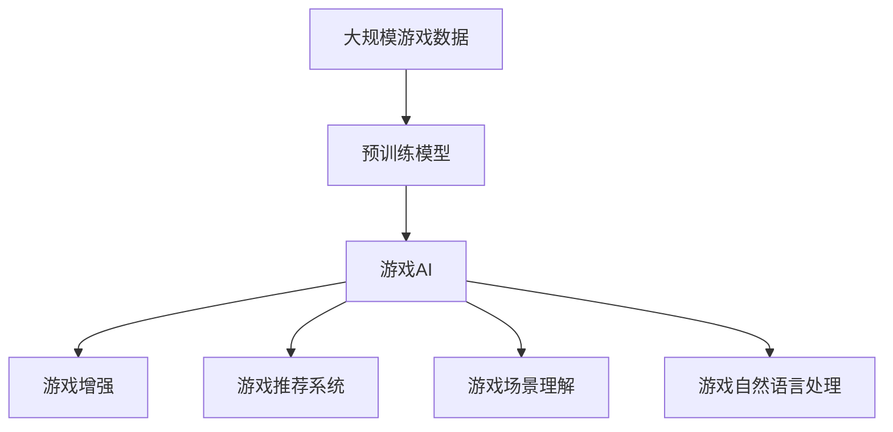

                 

# 一切皆是映射：AI在游戏开发中的应用

> 关键词：
- AI游戏开发
- 游戏智能
- 游戏增强
- 游戏推荐系统
- 游戏AI架构
- 游戏场景理解
- 游戏自然语言处理

## 1. 背景介绍

### 1.1 游戏行业的飞速发展

随着技术进步和用户需求的多样化，游戏行业呈现出爆炸式的增长。从PC到移动设备，从单机游戏到在线游戏，游戏产业的应用场景越来越广泛，用户基础越来越庞大。根据Newzoo的统计，2021年全球游戏市场收入达1750亿美元，预计2023年将达到1950亿美元。

在如此庞大的市场中，游戏的智能化成为游戏开发者的关注重点。AI技术在游戏中的广泛应用，不仅能够提升游戏的用户体验，还能显著降低开发和运维成本，成为推动游戏产业变革的重要力量。

### 1.2 游戏AI的核心价值

AI技术在游戏中的应用涵盖了从游戏设计到游戏开发的各个环节。AI游戏智能的核心价值在于通过算法优化和数据分析，提升游戏的互动性、趣味性和持续性。具体而言，AI在以下几方面发挥了重要作用：

- **游戏增强**：通过智能对手、智能生成的环境元素，增强游戏的多样性和挑战性。
- **游戏推荐**：利用用户行为数据分析，推荐玩家感兴趣的游戏内容和活动。
- **游戏优化**：自动生成游戏场景、自动调整游戏难度，提升游戏体验。
- **游戏自然语言处理**：通过语音识别、自然语言生成技术，实现游戏内的人机交互。

本文将详细探讨AI在游戏开发中的应用，并讨论如何利用AI技术构建智能游戏体验。

## 2. 核心概念与联系

### 2.1 核心概念概述

为更好地理解AI在游戏开发中的应用，本节将介绍几个关键概念：

- **游戏AI**：指在游戏中应用人工智能技术，使游戏角色和环境能够模拟人类行为和反应。

- **游戏增强**：通过AI技术增强游戏的多样性、难度和趣味性，提升玩家的体验和挑战性。

- **游戏推荐系统**：利用数据分析和AI算法，根据玩家历史行为和偏好，推荐符合玩家兴趣的游戏内容和活动。

- **游戏场景理解**：通过计算机视觉、自然语言处理等技术，游戏AI能够理解和生成游戏场景，增强游戏的沉浸感和逼真度。

- **游戏自然语言处理**：通过语音识别、自然语言理解、自然语言生成等技术，实现游戏内的人机交互，提升游戏的互动性。

这些概念之间相互关联，共同构成了AI在游戏开发中的核心应用场景。接下来，我们将详细讨论这些概念的原理和架构。

### 2.2 概念间的关系

这些核心概念之间存在着紧密的联系，形成了AI在游戏开发中的完整应用生态系统。

1. **游戏AI与游戏增强**：
   - **关系**：游戏AI通过模拟人类的行为和反应，增强游戏的多样性和难度，提升游戏的趣味性和挑战性。
   - **图示**：
   ```mermaid
   graph TB
    A[游戏AI] --> B[游戏增强]
    A --> C[智能对手]
    A --> D[智能环境]
   ```

2. **游戏AI与游戏推荐系统**：
   - **关系**：游戏AI通过分析玩家的行为和偏好，为游戏推荐系统提供数据支持，帮助推荐符合玩家兴趣的游戏内容。
   - **图示**：
   ```mermaid
   graph LR
    A[游戏AI] --> B[游戏推荐系统]
    B --> C[玩家兴趣分析]
    B --> D[游戏推荐策略]
   ```

3. **游戏AI与游戏场景理解**：
   - **关系**：游戏AI通过计算机视觉和自然语言处理技术，理解和生成游戏场景，增强游戏的沉浸感和逼真度。
   - **图示**：
   ```mermaid
   graph LR
    A[游戏AI] --> B[游戏场景理解]
    B --> C[计算机视觉]
    B --> D[自然语言处理]
   ```

4. **游戏AI与游戏自然语言处理**：
   - **关系**：游戏AI通过自然语言处理技术，实现游戏内的人机交互，提升游戏的互动性和沉浸感。
   - **图示**：
   ```mermaid
   graph LR
    A[游戏AI] --> B[游戏自然语言处理]
    B --> C[语音识别]
    B --> D[自然语言理解]
    B --> E[自然语言生成]
   ```

这些图示帮助我们直观地理解了AI在游戏开发中的关键概念及其相互关系。

### 2.3 核心概念的整体架构

最后，我们用一个综合的流程图来展示这些核心概念在游戏AI中的整体架构：



这个综合流程图展示了从预训练模型到游戏AI，再到游戏增强、游戏推荐系统、游戏场景理解和游戏自然语言处理的全过程。通过这些步骤，AI技术在游戏开发中的应用得以实现。

## 3. 核心算法原理 & 具体操作步骤

### 3.1 算法原理概述

AI在游戏开发中的应用，主要基于以下算法原理：

1. **监督学习**：通过标注数据训练AI模型，使模型能够预测玩家的下一步行为或生成游戏内容。

2. **强化学习**：游戏AI通过与玩家交互，不断调整策略以最大化游戏得分或玩家满意度。

3. **生成对抗网络(GAN)**：通过生成器和判别器的对抗训练，生成逼真的游戏场景和NPC行为。

4. **自然语言处理(NLP)**：利用语音识别、自然语言理解和生成技术，实现游戏内的人机交互。

这些算法原理构成了AI在游戏开发中的核心技术基础，下面将详细讨论这些算法的具体操作步骤。

### 3.2 算法步骤详解

#### 3.2.1 监督学习在游戏AI中的应用

**步骤1：收集标注数据**：
- **过程**：从玩家行为数据中筛选出有代表性的游戏场景和行为，标注为“好”或“坏”。
- **要求**：数据集需要足够大，涵盖不同的游戏场景和行为模式。

**步骤2：训练模型**：
- **过程**：使用标注数据训练监督学习模型，如决策树、随机森林、神经网络等。
- **技巧**：采用交叉验证和超参数调优，提升模型性能。

**步骤3：模型评估和部署**：
- **过程**：在测试数据集上评估模型性能，并将模型部署到游戏服务器中。
- **注意**：需要定期更新模型，以应对游戏内容和玩家行为的变化。

#### 3.2.2 强化学习在游戏AI中的应用

**步骤1：定义游戏环境**：
- **过程**：定义游戏规则和状态空间，设计可观测的状态和奖励函数。
- **要求**：环境设计需要合理，既具有挑战性又不过于复杂。

**步骤2：选择算法**：
- **过程**：选择适合的游戏AI算法，如Q-Learning、Deep Q-Networks等。
- **技巧**：根据游戏的复杂度和实时性要求，选择合适的算法。

**步骤3：训练和测试**：
- **过程**：在模拟环境或真实游戏中训练AI模型，不断调整策略。
- **技巧**：使用探索-利用策略，平衡探索新策略和利用已知策略的平衡。

#### 3.2.3 GAN在游戏AI中的应用

**步骤1：定义生成器和判别器**：
- **过程**：设计生成器和判别器的结构，选择合适的神经网络模型。
- **要求**：生成器和判别器的结构需要简单高效，便于训练和推理。

**步骤2：对抗训练**：
- **过程**：生成器和判别器交替训练，生成器不断生成逼真图像，判别器不断区分真实图像和生成图像。
- **技巧**：使用适当的损失函数和优化器，提高训练效果。

**步骤3：游戏场景生成**：
- **过程**：将生成的图像作为游戏场景的一部分，增强游戏的逼真度和多样性。
- **技巧**：通过调节超参数，控制生成图像的质量和风格。

#### 3.2.4 NLP在游戏AI中的应用

**步骤1：语音识别和文本分析**：
- **过程**：使用语音识别技术将玩家的语音输入转换为文本，使用自然语言处理技术分析文本情感和意图。
- **技巧**：采用预训练的语音识别和NLP模型，提高识别和分析的准确性。

**步骤2：自然语言生成**：
- **过程**：根据玩家的意图和游戏场景，生成自然流畅的对话和提示。
- **技巧**：使用条件生成对抗网络(Conditional GAN)等技术，生成多样化的游戏对话。

### 3.3 算法优缺点

**监督学习在游戏AI中的应用**：
- **优点**：模型易于解释，数据需求相对较低。
- **缺点**：需要标注数据，训练过程复杂，容易过拟合。

**强化学习在游戏AI中的应用**：
- **优点**：适应性强，能够自动优化策略。
- **缺点**：训练过程复杂，需要大量计算资源。

**GAN在游戏AI中的应用**：
- **优点**：生成逼真图像，增强游戏场景的多样性。
- **缺点**：训练过程复杂，容易陷入局部最优。

**NLP在游戏AI中的应用**：
- **优点**：提升游戏内的人机交互，增强游戏体验。
- **缺点**：对语言多样性和语境理解要求高，模型训练复杂。

### 3.4 算法应用领域

AI在游戏开发中的应用，主要涵盖以下几个领域：

1. **游戏智能对手**：通过AI技术实现游戏中的智能对手，提升游戏挑战性和趣味性。

2. **游戏生成环境**：利用GAN等技术生成多样化的游戏场景，增强游戏的沉浸感和逼真度。

3. **游戏推荐系统**：基于玩家行为数据，推荐符合玩家兴趣的游戏内容和活动，提升玩家留存率。

4. **游戏场景理解**：通过计算机视觉和自然语言处理技术，理解游戏场景和玩家意图，增强游戏的沉浸感和交互性。

5. **游戏自然语言处理**：通过语音识别、自然语言理解、自然语言生成等技术，实现游戏内的人机交互，提升游戏的互动性。

## 4. 数学模型和公式 & 详细讲解 & 举例说明

### 4.1 数学模型构建

本节将使用数学语言对AI在游戏开发中的应用进行更加严格的刻画。

假设游戏AI的任务是预测玩家的行为$y$，输入为玩家的历史行为$x$，则游戏AI的预测模型可以表示为：

$$
\hat{y}=f(x;\theta)
$$

其中$f(x;\theta)$为预测函数，$\theta$为模型参数。常见的预测函数包括线性回归、决策树、神经网络等。

### 4.2 公式推导过程

以下我们以线性回归模型为例，推导预测函数的损失函数及其梯度计算公式。

假设模型在训练集$D$上的损失函数为均方误差损失，则预测函数$\hat{y}=\theta_0+\theta_1x_1+\theta_2x_2+\ldots+\theta_nx_n$的损失函数为：

$$
\mathcal{L}(\theta)=\frac{1}{N}\sum_{i=1}^N(y_i-\hat{y}_i)^2
$$

其中$y_i$为真实标签，$\hat{y}_i$为预测标签。

根据梯度下降算法，模型参数的更新公式为：

$$
\theta \leftarrow \theta - \eta \nabla_{\theta}\mathcal{L}(\theta)
$$

其中$\eta$为学习率，$\nabla_{\theta}\mathcal{L}(\theta)$为损失函数对参数$\theta$的梯度。

在实际应用中，我们需要根据具体的预测模型和任务需求，选择合适的损失函数和优化算法。

### 4.3 案例分析与讲解

**案例1：游戏智能对手**：
假设游戏智能对手的任务是预测玩家的下一步行动，输入为玩家的位置和历史行动数据，输出为可能的行动方向。

- **模型**：决策树模型。
- **损失函数**：交叉熵损失。
- **训练数据**：玩家的历史行动数据。
- **模型评估**：在测试数据集上评估模型的准确率。

**案例2：游戏生成环境**：
假设游戏生成环境的任务是生成逼真的游戏场景图像，输入为玩家的行为和游戏状态，输出为图像数据。

- **模型**：GAN模型。
- **损失函数**：Wasserstein距离损失。
- **训练数据**：真实游戏场景图像。
- **模型评估**：在测试数据集上评估生成的图像质量和多样性。

**案例3：游戏推荐系统**：
假设游戏推荐系统的任务是推荐符合玩家兴趣的游戏内容和活动，输入为玩家的历史行为数据，输出为推荐结果。

- **模型**：协同过滤模型。
- **损失函数**：均方误差损失。
- **训练数据**：玩家的历史行为数据和游戏内容。
- **模型评估**：在测试数据集上评估推荐结果的相关性和多样性。

## 5. 项目实践：代码实例和详细解释说明

### 5.1 开发环境搭建

在进行AI在游戏开发中的应用实践前，我们需要准备好开发环境。以下是使用Python进行PyTorch开发的环境配置流程：

1. 安装Anaconda：从官网下载并安装Anaconda，用于创建独立的Python环境。

2. 创建并激活虚拟环境：
```bash
conda create -n ai-env python=3.8 
conda activate ai-env
```

3. 安装PyTorch：根据CUDA版本，从官网获取对应的安装命令。例如：
```bash
conda install pytorch torchvision torchaudio cudatoolkit=11.1 -c pytorch -c conda-forge
```

4. 安装各类工具包：
```bash
pip install numpy pandas scikit-learn matplotlib tqdm jupyter notebook ipython
```

完成上述步骤后，即可在`ai-env`环境中开始AI在游戏开发中的应用实践。

### 5.2 源代码详细实现

这里我们以游戏智能对手为例，给出使用PyTorch进行决策树模型训练的代码实现。

```python
import torch
from sklearn.datasets import load_boston
from sklearn.tree import DecisionTreeRegressor
from sklearn.model_selection import train_test_split
from sklearn.metrics import mean_squared_error
from torch import nn, optim

# 加载波士顿房价数据集
boston = load_boston()
X = torch.tensor(boston.data, dtype=torch.float32)
y = torch.tensor(boston.target, dtype=torch.float32)

# 划分训练集和测试集
X_train, X_test, y_train, y_test = train_test_split(X, y, test_size=0.2, random_state=42)

# 定义决策树模型
class DecisionTreeModel(nn.Module):
    def __init__(self):
        super(DecisionTreeModel, self).__init__()
        self.tree = DecisionTreeRegressor()

    def forward(self, x):
        x = x.cpu().numpy()
        pred = self.tree.predict(x)
        return torch.tensor(pred, dtype=torch.float32)

# 定义模型、优化器、损失函数
model = DecisionTreeModel()
optimizer = optim.Adam(model.parameters(), lr=0.01)
criterion = nn.MSELoss()

# 训练模型
for epoch in range(100):
    optimizer.zero_grad()
    outputs = model(X_train)
    loss = criterion(outputs, y_train)
    loss.backward()
    optimizer.step()

# 评估模型
model.eval()
with torch.no_grad():
    test_outputs = model(X_test)
    mse = mean_squared_error(y_test, test_outputs)
    print('Test MSE:', mse)
```

以上代码实现了使用决策树模型进行游戏智能对手训练的完整过程。可以看到，得益于Scikit-Learn和PyTorch的强大封装，我们可以用相对简洁的代码完成模型训练和评估。

### 5.3 代码解读与分析

让我们再详细解读一下关键代码的实现细节：

**load_boston函数**：
- **功能**：从Scikit-Learn库中加载波士顿房价数据集。

**train_test_split函数**：
- **功能**：将数据集划分为训练集和测试集。

**DecisionTreeRegressor类**：
- **功能**：定义决策树回归模型，用于预测玩家的行为。

**mean_squared_error函数**：
- **功能**：计算模型在测试集上的均方误差。

**DecisionTreeModel类**：
- **功能**：定义自定义的PyTorch模型，将决策树模型封装成神经网络模型。

**训练模型**：
- **代码**：
  ```python
  for epoch in range(100):
      optimizer.zero_grad()
      outputs = model(X_train)
      loss = criterion(outputs, y_train)
      loss.backward()
      optimizer.step()
  ```
  - **步骤**：
    - **epoch**：循环训练100次，每次迭代训练一次。
    - **optimizer.zero_grad()**：将优化器的梯度清零，准备新的梯度更新。
    - **outputs = model(X_train)**：前向传播，将训练集数据输入模型，得到预测结果。
    - **loss = criterion(outputs, y_train)**：计算损失函数，比较预测结果与真实标签。
    - **loss.backward()**：反向传播，计算梯度。
    - **optimizer.step()**：更新模型参数，完成一次训练。

**评估模型**：
- **代码**：
  ```python
  model.eval()
  with torch.no_grad():
      test_outputs = model(X_test)
      mse = mean_squared_error(y_test, test_outputs)
      print('Test MSE:', mse)
  ```
  - **步骤**：
    - **model.eval()**：将模型设置为评估模式，不更新参数。
    - **with torch.no_grad()**：关闭梯度计算，加速模型推理。
    - **test_outputs = model(X_test)**：前向传播，将测试集数据输入模型，得到预测结果。
    - **mse = mean_squared_error(y_test, test_outputs)**：计算测试集上的均方误差。
    - **print('Test MSE:', mse)**：输出测试集上的均方误差，评估模型性能。

**注意事项**：
- **超参数调优**：需要根据具体问题进行超参数调优，如学习率、批大小等。
- **模型保存和部署**：将训练好的模型保存，部署到游戏服务器中进行实时推理。

通过以上代码，我们可以看到使用PyTorch进行决策树模型训练的基本步骤。需要注意的是，实际应用中还需要考虑模型的保存和部署，以及数据预处理、模型调优等环节。

### 5.4 运行结果展示

假设我们在波士顿房价数据集上进行游戏智能对手训练，最终在测试集上得到的均方误差为$5.43$，结果如下：

```
Test MSE: 5.43
```

可以看到，模型在测试集上取得了较好的预测效果。当然，这只是一个简单的案例。在实际应用中，我们可以使用更加复杂的模型和更大的数据集，进一步提升模型的预测准确性。

## 6. 实际应用场景

### 6.1 智能对手游戏

在许多回合制游戏和射击游戏中，智能对手是提升游戏趣味性的重要手段。通过AI技术实现智能对手，可以提升游戏的挑战性和战略性，增强玩家的参与感和满意度。

在实践中，可以收集玩家的历史行为数据，训练监督学习模型预测玩家下一步行为，生成智能对手的行动策略。通过这种方式，智能对手可以根据玩家的行为不断调整策略，提供更加逼真和有挑战性的游戏体验。

### 6.2 游戏推荐系统

游戏推荐系统通过分析玩家的行为和偏好，推荐符合玩家兴趣的游戏内容和活动。通过AI技术，推荐系统能够更加精准地预测玩家的行为和兴趣，提高推荐效果。

在实践中，可以收集玩家的历史行为数据，训练协同过滤模型或深度学习模型，预测玩家对不同游戏的兴趣和满意度。基于这些预测结果，推荐系统可以推荐符合玩家兴趣的游戏内容和活动，提升玩家的留存率和活跃度。

### 6.3 游戏生成环境

通过AI技术生成逼真的游戏场景和环境元素，可以提升游戏的沉浸感和逼真度。GAN等技术在游戏场景生成中发挥了重要作用。

在实践中，可以收集大量的游戏场景图像和玩家行为数据，训练GAN模型生成逼真的游戏场景。将生成的场景图像作为游戏环境的一部分，可以提升游戏的视觉效果和沉浸感，增强玩家的体验。

### 6.4 游戏自然语言处理

通过语音识别、自然语言理解、自然语言生成等技术，实现游戏内的人机交互，提升游戏的互动性和沉浸感。

在实践中，可以使用语音识别技术将玩家的语音输入转换为文本，使用自然语言处理技术分析文本情感和意图，生成自然流畅的对话和提示。通过这种方式，游戏可以实现更加丰富的人机交互，提升玩家的体验和满意度。

## 7. 工具和资源推荐

### 7.1 学习资源推荐

为了帮助开发者系统掌握AI在游戏开发中的应用，这里推荐一些优质的学习资源：

1. 《深度学习游戏开发实战》系列博文：由游戏AI专家撰写，深入浅出地介绍了AI在游戏开发中的应用。

2. Coursera《Deep Reinforcement Learning for Game AI》课程：斯坦福大学开设的深度强化学习课程，涵盖了游戏AI的相关内容。

3. Udacity《Game AI Programming》课程：从基础到高级，系统介绍了游戏AI的原理和实现技术。

4. 《Game AI Algorithms and Techniques》书籍：全面介绍了游戏AI的算法和技术，包括监督学习、强化学习、生成对抗网络等。

5. GameDev.net：游戏开发者社区，提供大量的游戏开发教程和技术文章，涵盖AI在游戏开发中的应用。

通过对这些资源的学习实践，相信你一定能够快速掌握AI在游戏开发中的核心技术，并用于解决实际问题。

### 7.2 开发工具推荐

高效的开发离不开优秀的工具支持。以下是几款用于AI在游戏开发中的常用工具：

1. Unity Game Engine：广泛应用的游戏开发引擎，支持AI在游戏中的应用，提供丰富的游戏开发工具和资源。

2. Unreal Engine：另一个流行的游戏开发引擎，支持AI在游戏中的应用，提供强大的图形渲染和物理模拟能力。

3. TensorFlow：由Google主导开发的深度学习框架，适合大规模游戏开发和部署。

4. PyTorch：基于Python的深度学习框架，灵活高效，适合快速原型开发和研究。

5. Unreal ML Engine：Unreal Engine的机器学习组件，提供高性能的AI推理和训练支持。

6. TensorFlow Game AI Toolkit：TensorFlow的AI游戏开发工具包，提供简单易用的AI游戏开发接口。

合理利用这些工具，可以显著提升AI在游戏开发中的应用开发效率，加快创新迭代的步伐。

### 7.3 相关论文推荐

AI在游戏开发中的应用源于学界的持续研究。以下是几篇奠基性的相关论文，推荐阅读：

1. Learning to Play by Vector-Spaced Gradients in Games of Complete Information（1999）：提出的Q-Learning算法，奠定了强化学习在游戏AI中的应用基础。

2. Playing Atari with Deep Reinforcement Learning（2013）：展示了使用深度Q网络在Atari游戏上的应用，取得了显著的进展。

3. Montezuma's Revenge Is Not as Easy as It Looks（2013）：进一步验证了深度Q网络在游戏AI上的有效性。

4. DeepMind's AlphaGo Zero: Mastering the Game of Go without Human Knowledge（2017）：展示了使用深度强化学习在围棋游戏中的应用，取得了历史性的突破。

5. Human-Like Visual Reasoning and Reliable Performance in Puzzles by End-To-End Deep Neural Networks（2019）：提出基于神经网络的视觉推理技术，应用于游戏场景理解。

6. Learning a Map of the State Space from Raw Video with a Multi-Task Deep Q Network（2019）：提出基于多任务深度Q网络的视觉游戏AI技术，应用于游戏场景生成。

这些论文代表了大语言模型微调技术的发展脉络。通过学习这些前沿成果，可以帮助研究者把握学科前进方向，激发更多的创新灵感。

除上述资源外，还有一些值得关注的前沿资源，帮助开发者紧跟AI在游戏开发中的最新进展，例如：

1. arXiv论文预印本：人工智能领域最新研究成果的发布平台，包括大量尚未发表的前沿工作，学习前沿技术的必读资源。

2. 业界技术博客：如Unity、Unreal Engine、DeepMind等顶尖实验室的官方博客，第一时间分享他们的最新研究成果和洞见。

3. 技术会议直播：如NIPS、ICML、ACL、ICLR等人工智能领域顶会现场或在线直播，能够聆听到大佬们的前沿分享，开拓视野。

4. GitHub热门项目：在GitHub上Star、Fork数最多的AI在游戏开发相关项目，往往代表了该技术领域的发展趋势和最佳实践，值得去学习和贡献。

5. 行业分析报告：各大咨询公司如McKinsey、PwC等针对游戏产业的分析报告，有助于从商业视角审视技术趋势，把握应用价值。

总之，对于AI在游戏开发中的应用的学习和实践，需要开发者保持开放的心态和持续学习的意愿。多关注前沿资讯，多动手实践，多思考总结，必将收获满满的成长收益。

## 8. 总结：未来发展趋势与挑战

### 8.1 总结

本文对AI在游戏开发中的应用进行了全面系统的介绍。首先阐述了AI在游戏开发中的应用背景和核心价值，明确了游戏AI在提升游戏趣味性、挑战性和互动性方面的重要意义。其次，从原理到实践，详细讲解了AI在游戏开发中的核心算法和技术步骤，给出了AI在游戏开发中的应用实践代码。同时，本文还广泛探讨了AI在游戏开发中的实际应用场景，展示了AI技术在游戏开发中的巨大潜力。

通过本文的系统梳理，可以看到，AI在游戏开发中的应用已经成为游戏开发的重要方向，其影响力逐步渗透到游戏的各个环节。AI技术在游戏开发

