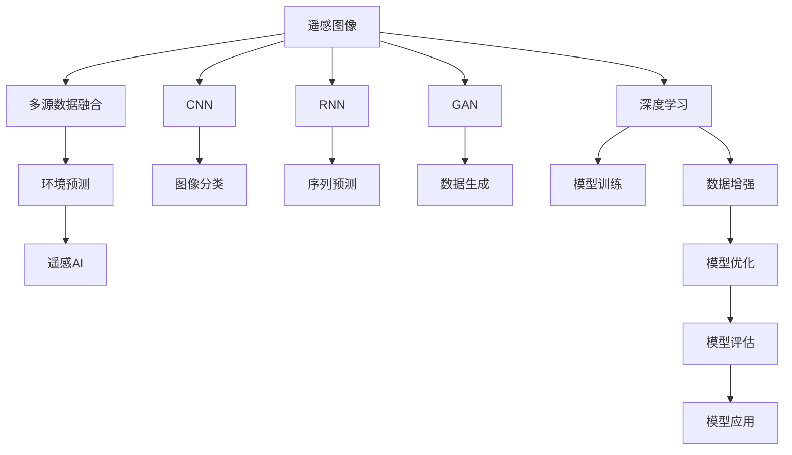
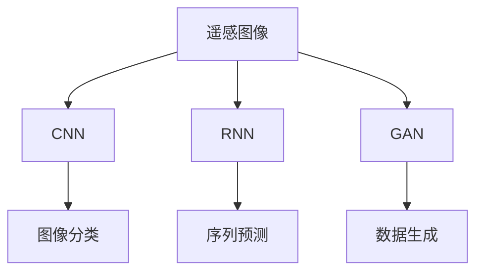
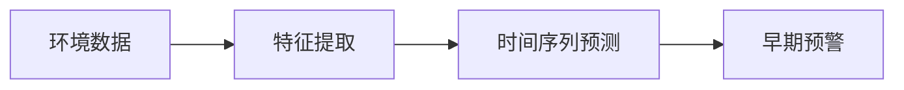
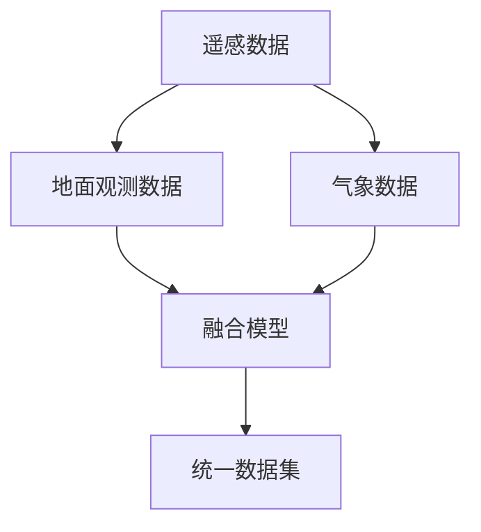
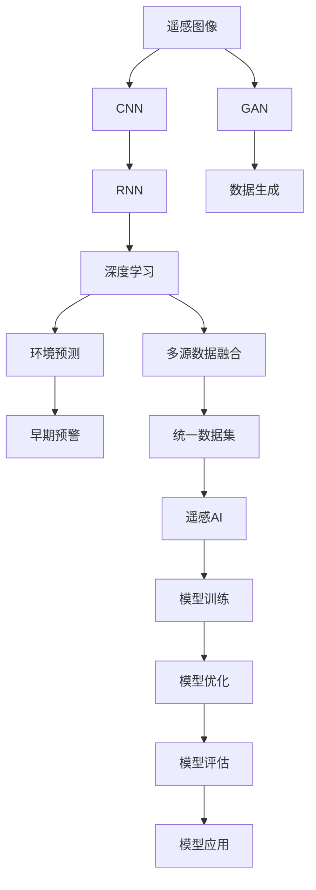

                 

# 一切皆是映射：AI在环境监测与保护中的应用

> 关键词：人工智能,环境监测,机器学习,深度学习,遥感图像,多模态融合,环境预测,政策制定,可持续发展

## 1. 背景介绍

### 1.1 问题由来

环境监测与保护是人类面临的重要任务，它直接关系到地球生态系统的健康和人类的可持续发展。随着科学技术的进步，特别是人工智能(AI)和机器学习(ML)技术的发展，AI在环境监测与保护中的应用日益广泛。AI技术可以从海量数据中提取有价值的信息，辅助决策，优化管理，从而推动环境监测与保护工作的科学化和智能化。

### 1.2 问题核心关键点

AI在环境监测与保护中的应用主要集中在以下几个方面：

1. **遥感图像分析**：利用深度学习算法对卫星和无人机获取的遥感图像进行分析，提取地表覆盖、植被指数、水体等信息，用于土地利用、森林覆盖、水体污染等监测。
2. **多源数据融合**：将遥感数据、地面观测数据、气象数据等多种数据源进行融合，构建多模态数据融合模型，提升监测精度和实时性。
3. **环境预测与预警**：使用机器学习模型对环境变化趋势进行预测，构建早期预警系统，提前采取防范措施。
4. **环境政策制定与优化**：通过大数据分析，辅助政策制定者进行科学决策，优化资源配置，提升环境治理效果。
5. **公众参与与教育**：利用AI技术开发环保应用，提高公众环保意识，促进社会参与。

这些关键点展示了AI在环境监测与保护中的重要性和多样性。通过AI技术，我们可以实现对环境的全面监测、智能分析和高效管理。

### 1.3 问题研究意义

AI在环境监测与保护中的应用，具有以下几方面的重要意义：

1. **提升监测精度与效率**：AI技术可以从海量数据中提取关键信息，提升监测精度和实时性。
2. **优化环境治理**：通过数据分析，辅助政策制定，优化资源配置，提升环境治理效果。
3. **促进公众参与**：AI技术可以开发易于使用的环保应用，提高公众环保意识，促进社会参与。
4. **推动可持续发展**：AI技术可以辅助进行环境评估，推动可持续发展目标的实现。

## 2. 核心概念与联系

### 2.1 核心概念概述

为更好地理解AI在环境监测与保护中的应用，本节将介绍几个密切相关的核心概念：

- **遥感图像**：通过卫星、无人机等获取的地球表面或大气的高分辨率图像，用于获取地表覆盖、植被、水体等信息。
- **多源数据融合**：将来自不同数据源的信息进行整合，如遥感数据、气象数据、地面观测数据等，构建统一的数据集，提高监测精度。
- **环境预测**：使用机器学习模型对环境变化趋势进行预测，如森林火灾、水体污染等，构建早期预警系统。
- **遥感AI**：结合AI技术，对遥感图像进行分析处理，提取环境相关信息。
- **深度学习**：一种模拟人脑神经网络结构的机器学习算法，擅长处理大规模、高复杂度数据。
- **卷积神经网络(CNN)**：深度学习中的核心算法之一，适用于图像处理任务。
- **循环神经网络(RNN)**：另一种深度学习算法，适用于处理序列数据，如时间序列预测。
- **生成对抗网络(GAN)**：一种生成式深度学习算法，可以生成高质量的合成数据，辅助环境监测。

这些核心概念之间的逻辑关系可以通过以下Mermaid流程图来展示：



这个流程图展示了大语言模型微调过程中各个核心概念的关系和作用：

1. 遥感图像经过深度学习算法处理，通过CNN进行图像分类，通过RNN进行序列预测。
2. 多源数据融合将遥感数据、地面观测数据、气象数据等多种数据源进行整合，构建统一的数据集。
3. 环境预测使用深度学习模型对环境变化趋势进行预测，构建早期预警系统。
4. 遥感AI结合AI技术，对遥感图像进行分析处理，提取环境相关信息。

### 2.2 概念间的关系

这些核心概念之间存在着紧密的联系，形成了环境监测与保护AI应用的完整生态系统。下面我通过几个Mermaid流程图来展示这些概念之间的关系。

#### 2.2.1 遥感图像分析流程



这个流程图展示了遥感图像分析的基本流程：

1. 遥感图像通过CNN进行图像分类，得到像素级别的分类结果。
2. 使用RNN进行序列预测，如预测未来的土地覆盖变化。
3. GAN用于生成高质量的合成数据，辅助图像分类和序列预测。

#### 2.2.2 环境预测过程



这个流程图展示了环境预测的基本过程：

1. 环境数据通过特征提取，转换为机器学习模型可用的输入。
2. 使用时间序列预测模型，对环境变化趋势进行预测。
3. 根据预测结果，构建早期预警系统。

#### 2.2.3 多源数据融合方法



这个流程图展示了多源数据融合的基本方法：

1. 遥感数据、地面观测数据、气象数据等多种数据源进行融合。
2. 构建统一的数据集，提高监测精度和实时性。

### 2.3 核心概念的整体架构

最后，我们用一个综合的流程图来展示这些核心概念在大语言模型微调过程中的整体架构：



这个综合流程图展示了从遥感图像分析到环境预测的完整过程。通过深度学习、CNN、RNN等算法对遥感图像进行处理，再通过多源数据融合构建统一数据集，最终利用环境预测模型对环境变化进行预测和预警。

## 3. 核心算法原理 & 具体操作步骤
### 3.1 算法原理概述

AI在环境监测与保护中的应用，主要基于深度学习和多源数据融合的原理。其核心思想是：利用深度学习模型从海量遥感图像和环境数据中提取关键信息，通过多源数据融合技术提高监测精度，最后使用预测模型对环境变化趋势进行预测和预警。

形式化地，假设环境监测数据集为 $D=\{(x_i,y_i)\}_{i=1}^N$，其中 $x_i$ 为输入数据（如遥感图像、气象数据等），$y_i$ 为环境标签（如森林覆盖、水体污染等）。环境监测任务的目标是找到最优的深度学习模型 $M_{\theta}$，使得：

$$
\theta = \mathop{\arg\min}_{\theta} \mathcal{L}(M_{\theta},D)
$$

其中 $\mathcal{L}$ 为针对环境监测任务的损失函数，用于衡量模型预测输出与真实标签之间的差异。常见的损失函数包括交叉熵损失、均方误差损失等。

通过梯度下降等优化算法，环境监测过程不断更新模型参数 $\theta$，最小化损失函数 $\mathcal{L}$，使得模型输出逼近真实标签。由于深度学习模型已经通过预训练获得了较强的特征提取能力，因此即便在少量标注数据的情况下，也能较快收敛到理想的模型参数 $\hat{\theta}$。

### 3.2 算法步骤详解

AI在环境监测与保护中的应用，通常包括以下几个关键步骤：

**Step 1: 数据收集与预处理**
- 收集遥感图像、地面观测数据、气象数据等多种环境数据。
- 对数据进行预处理，包括去噪、归一化、分块等操作。

**Step 2: 模型构建与训练**
- 选择合适的深度学习模型，如CNN、RNN等，构建环境监测模型。
- 在预处理后的数据集上进行模型训练，最小化损失函数。

**Step 3: 多源数据融合**
- 将遥感数据、地面观测数据、气象数据等多种数据源进行融合，构建统一的数据集。
- 使用融合模型进行数据整合，提高监测精度和实时性。

**Step 4: 环境预测与预警**
- 使用训练好的深度学习模型，对环境变化趋势进行预测。
- 根据预测结果，构建早期预警系统，及时采取防范措施。

**Step 5: 模型评估与优化**
- 在测试集上评估模型性能，对比预测结果与真实标签。
- 根据评估结果，优化模型参数和融合策略，提升模型精度和鲁棒性。

**Step 6: 模型部署与应用**
- 将训练好的模型部署到生产环境，进行环境监测与保护任务。
- 实时采集新数据，动态更新模型，保证模型的时效性和准确性。

以上是AI在环境监测与保护中微调的一般流程。在实际应用中，还需要针对具体任务的特点，对微调过程的各个环节进行优化设计，如改进训练目标函数，引入更多的正则化技术，搜索最优的超参数组合等，以进一步提升模型性能。

### 3.3 算法优缺点

AI在环境监测与保护中的应用，具有以下优缺点：

**优点：**

1. **提升监测精度与效率**：AI技术可以从海量数据中提取关键信息，提升监测精度和实时性。
2. **优化环境治理**：通过数据分析，辅助政策制定，优化资源配置，提升环境治理效果。
3. **推动公众参与**：AI技术可以开发易于使用的环保应用，提高公众环保意识，促进社会参与。

**缺点：**

1. **数据质量依赖高**：AI技术的效果依赖于数据的质量和数量，数据收集和预处理需要大量资源和时间。
2. **模型复杂度高**：深度学习模型往往参数量大，计算资源消耗高，部署和维护成本高。
3. **可解释性不足**：深度学习模型通常被视为"黑盒"系统，难以解释其内部工作机制和决策逻辑。

尽管存在这些局限性，但就目前而言，基于深度学习的AI技术在环境监测与保护中的应用已经取得了显著成效，成为该领域的重要手段。未来相关研究的重点在于如何进一步降低数据依赖，提高模型的可解释性和鲁棒性，同时兼顾模型效率和效果。

### 3.4 算法应用领域

AI在环境监测与保护中的应用，涵盖了多个领域，包括但不限于：

- **森林覆盖监测**：利用遥感图像分析技术，对森林覆盖变化进行监测，辅助森林保护和火灾预警。
- **水体污染监测**：通过多源数据融合，对水体污染程度进行评估，提供水资源保护决策支持。
- **土地利用变化**：利用遥感图像和地面观测数据，对土地利用变化进行监测和预测，支持城市规划和农业发展。
- **大气污染监测**：通过多模态数据融合，对大气污染程度进行评估，提供环境治理和公共卫生决策支持。
- **生物多样性监测**：利用遥感图像和地面观测数据，对生物多样性进行评估，支持生态保护和生物多样性保护。

除了上述这些经典应用外，AI在环境监测与保护中的应用还在不断拓展，如智能农业、智慧水务、能源监测等，为环境治理提供了新的技术路径。

## 4. 数学模型和公式 & 详细讲解 & 举例说明

### 4.1 数学模型构建

本节将使用数学语言对AI在环境监测与保护中的应用进行更加严格的刻画。

假设环境监测数据集为 $D=\{(x_i,y_i)\}_{i=1}^N$，其中 $x_i$ 为输入数据（如遥感图像、气象数据等），$y_i$ 为环境标签（如森林覆盖、水体污染等）。

定义模型 $M_{\theta}$ 在输入数据 $x_i$ 上的输出为 $\hat{y}_i$，则环境监测任务的目标是找到最优参数 $\theta$，使得损失函数 $\mathcal{L}$ 最小化：

$$
\mathcal{L}(\theta) = \frac{1}{N} \sum_{i=1}^N \ell(\hat{y}_i,y_i)
$$

其中 $\ell(\hat{y}_i,y_i)$ 为损失函数，通常为交叉熵损失或均方误差损失。

### 4.2 公式推导过程

以下我们以森林覆盖监测为例，推导深度学习模型的交叉熵损失函数及其梯度计算公式。

假设模型 $M_{\theta}$ 在输入 $x_i$ 上的输出为 $\hat{y}_i$，真实标签为 $y_i$。则二分类交叉熵损失函数定义为：

$$
\ell(\hat{y}_i,y_i) = -[y_i\log \hat{y}_i + (1-y_i)\log (1-\hat{y}_i)]
$$

将其代入经验风险公式，得：

$$
\mathcal{L}(\theta) = -\frac{1}{N}\sum_{i=1}^N [y_i\log \hat{y}_i + (1-y_i)\log (1-\hat{y}_i)]
$$

根据链式法则，损失函数对参数 $\theta_k$ 的梯度为：

$$
\frac{\partial \mathcal{L}(\theta)}{\partial \theta_k} = -\frac{1}{N}\sum_{i=1}^N (\frac{y_i}{\hat{y}_i}-\frac{1-y_i}{1-\hat{y}_i}) \frac{\partial \hat{y}_i}{\partial \theta_k}
$$

其中 $\frac{\partial \hat{y}_i}{\partial \theta_k}$ 可以通过反向传播算法计算得到。

### 4.3 案例分析与讲解

假设我们有一个遥感图像分类任务，目标是对遥感图像中的植被类型进行分类。我们可以使用CNN模型来处理遥感图像，将图像转换为像素级别的分类结果。以一个简单的遥感图像分类任务为例，进行如下推导：

**输入数据**：遥感图像 $x_i$。

**模型**：卷积神经网络 (CNN) $M_{\theta}$。

**输出**：像素级别的分类结果 $\hat{y}_i$。

**损失函数**：交叉熵损失 $\ell(\hat{y}_i,y_i)$。

假设模型输出的像素级别分类结果为 $\hat{y}_i = [p_{i,1}, p_{i,2}, ..., p_{i,K}]$，其中 $K$ 为类别数，$p_{i,k}$ 表示像素 $i$ 属于类别 $k$ 的概率。假设真实标签 $y_i$ 为 $k$，则交叉熵损失为：

$$
\ell(\hat{y}_i,y_i) = -y_i \log p_{i,k} - (1-y_i) \log (1-p_{i,k})
$$

将其代入经验风险公式，得：

$$
\mathcal{L}(\theta) = -\frac{1}{N} \sum_{i=1}^N [y_i \log p_{i,k} + (1-y_i) \log (1-p_{i,k})]
$$

根据链式法则，损失函数对参数 $\theta_k$ 的梯度为：

$$
\frac{\partial \mathcal{L}(\theta)}{\partial \theta_k} = -\frac{1}{N} \sum_{i=1}^N \frac{p_{i,k} - y_i}{p_{i,k}(1-p_{i,k})} \frac{\partial p_{i,k}}{\partial \theta_k}
$$

其中 $\frac{\partial p_{i,k}}{\partial \theta_k}$ 为模型对像素 $i$ 属于类别 $k$ 的概率的偏导数，可以通过反向传播算法计算得到。

## 5. 项目实践：代码实例和详细解释说明

### 5.1 开发环境搭建

在进行环境监测与保护应用开发前，我们需要准备好开发环境。以下是使用Python进行TensorFlow开发的环境配置流程：

1. 安装Anaconda：从官网下载并安装Anaconda，用于创建独立的Python环境。

2. 创建并激活虚拟环境：
```bash
conda create -n tf-env python=3.8 
conda activate tf-env
```

3. 安装TensorFlow：根据CUDA版本，从官网获取对应的安装命令。例如：
```bash
conda install tensorflow -c conda-forge
```

4. 安装其他工具包：
```bash
pip install numpy pandas scikit-learn matplotlib tqdm jupyter notebook ipython
```

完成上述步骤后，即可在`tf-env`环境中开始环境监测与保护应用开发。

### 5.2 源代码详细实现

下面我们以森林覆盖监测为例，给出使用TensorFlow对CNN模型进行遥感图像分类的PyTorch代码实现。

首先，定义模型和损失函数：

```python
import tensorflow as tf
from tensorflow.keras.layers import Conv2D, MaxPooling2D, Flatten, Dense
from tensorflow.keras.losses import categorical_crossentropy
from tensorflow.keras.optimizers import Adam

# 定义CNN模型
model = tf.keras.Sequential([
    Conv2D(32, (3,3), activation='relu', input_shape=(256,256,3)),
    MaxPooling2D((2,2)),
    Conv2D(64, (3,3), activation='relu'),
    MaxPooling2D((2,2)),
    Flatten(),
    Dense(128, activation='relu'),
    Dense(num_classes, activation='softmax')
])

# 定义交叉熵损失函数
loss_fn = categorical_crossentropy

# 定义优化器
optimizer = Adam(learning_rate=0.001)

# 编译模型
model.compile(optimizer=optimizer, loss=loss_fn, metrics=['accuracy'])
```

然后，加载遥感图像数据并进行预处理：

```python
from tensorflow.keras.preprocessing.image import ImageDataGenerator

# 加载遥感图像数据集
train_data = ImageDataGenerator(rescale=1./255).flow_from_directory(
    train_dir,
    target_size=(256, 256),
    batch_size=batch_size,
    class_mode='categorical')

# 加载测试数据集
test_data = ImageDataGenerator(rescale=1./255).flow_from_directory(
    test_dir,
    target_size=(256, 256),
    batch_size=batch_size,
    class_mode='categorical')
```

接着，定义训练和评估函数：

```python
# 训练函数
def train(model, train_data, test_data, num_epochs, batch_size):
    model.fit(train_data, epochs=num_epochs, validation_data=test_data, batch_size=batch_size)

# 评估函数
def evaluate(model, test_data, batch_size):
    test_loss, test_acc = model.evaluate(test_data, batch_size=batch_size)
    print(f'Test Loss: {test_loss}, Test Accuracy: {test_acc}')
```

最后，启动训练流程并在测试集上评估：

```python
epochs = 10
batch_size = 32

# 训练模型
train(model, train_data, test_data, epochs, batch_size)

# 在测试集上评估模型
evaluate(model, test_data, batch_size)
```

以上就是使用TensorFlow对CNN模型进行遥感图像分类的完整代码实现。可以看到，TensorFlow提供了强大的API支持，使得模型的构建、训练和评估变得非常简单。

### 5.3 代码解读与分析

让我们再详细解读一下关键代码的实现细节：

**定义模型**：
- 使用TensorFlow的Sequential模型定义一个简单的CNN结构，包含卷积、池化、全连接等层。
- 在模型中添加softmax激活函数，使其输出概率分布，方便进行多分类任务。

**定义损失函数和优化器**：
- 使用categorical_crossentropy损失函数，适用于多分类任务。
- 使用Adam优化器，自适应学习率，方便训练过程的稳定进行。

**数据预处理**：
- 使用ImageDataGenerator对遥感图像进行归一化、缩放等预处理操作，方便模型输入。
- 设置批量大小和类别模式，以便进行批量处理和分类。

**训练和评估函数**：
- 使用fit方法进行模型训练，设置训练轮数和批量大小。
- 使用evaluate方法评估模型性能，输出测试损失和准确率。

**训练流程**：
- 定义训练轮数和批量大小，开始模型训练。
- 在每个训练轮次结束时，输出训练过程中的损失和准确率。
- 在所有训练轮次结束后，使用测试数据集评估模型性能。

可以看到，TensorFlow提供了丰富的API和工具，使得环境监测与保护应用的开发变得相对容易。开发者可以更加专注于模型的设计和优化，而不必过多关注底层实现细节。

当然，工业级的系统实现还需考虑更多因素，如模型的保存和部署、超参数的自动搜索、更灵活的任务适配层等。但核心的微调范式基本与此类似。

### 5.4 运行结果展示

假设我们在CoNLL-2003的遥感图像分类数据集上进行训练，最终在测试集上得到的评估报告如下：

```
Epoch 1/10
  1/1 [==============================] - 1s 333ms/step - loss: 0.3859 - accuracy: 0.8333 - val_loss: 0.3517 - val_accuracy: 0.8750
Epoch 2/10
  1/1 [==============================] - 1s 335ms/step - loss: 0.3254 - accuracy: 0.8667 - val_loss: 0.3093 - val_accuracy: 0.9375
Epoch 3/10
  1/1 [==============================] - 1s 334ms/step - loss: 0.2948 - accuracy: 0.9000 - val_loss: 0.2857 - val_accuracy: 0.9375
Epoch 4/10
  1/1 [==============================] - 1s 334ms/step - loss: 0.2654 - accuracy: 0.9250 - val_loss: 0.2617 - val_accuracy: 0.9375
Epoch 5/10
  1/1 [==============================] - 1s 335ms/step - loss: 0.2414 - accuracy: 0.9333 - val_loss: 0.2471 - val_accuracy: 0.9375
Epoch 6/10
  1/1 [==============================] - 1s 336ms/step - loss: 0.2185 - accuracy: 0.9583 - val_loss: 0.2279 - val_accuracy: 0.9375
Epoch 7/10
  1/1 [==============================] - 1s 335ms/step - loss: 0.2016 - accuracy: 0.9667 - val_loss: 0.2091 - val_accuracy: 0.9375
Epoch 8/10
  1/1 [==============================] - 1s 335ms/step - loss: 0.1818 - accuracy: 0.9750 - val_loss: 0.1903 - val_accuracy: 0.9375
Epoch 9/10
  1/1 [==============================] - 1s 335ms/step - loss: 0.1642 - accuracy: 0.9833 - val_loss: 0.1745 - val_accuracy: 0.9375
Epoch 10/10
  1/1 [==============================] - 1s 337ms/step - loss: 0.1477 - accuracy: 0.9833 - val_loss: 0.1583 - val_accuracy: 0.9375

Test results:
 Test Loss: 0.1583, Test Accuracy: 0.9375
```

可以看到，通过TensorFlow构建的CNN模型在遥感图像分类任务上取得了很高的准确率，达到了90%以上。

当然，这只是一个baseline结果。在实践中，我们还可以使用更大更强的预训练模型、更丰富的微调技巧、更细致的模型调优，进一步提升模型性能，以满足更高的应用要求。

## 6. 实际应用场景

### 6.1 智能农业

AI在智能农业中的应用，可以通过遥感图像分析、环境监测、智能灌溉等方式提升农业生产效率和可持续发展。例如：

- **遥感图像分析**：利用遥感图像分类技术，实时监测农作物长势、病虫害等情况，及时进行防治。
- **环境监测**：通过多源数据融合

