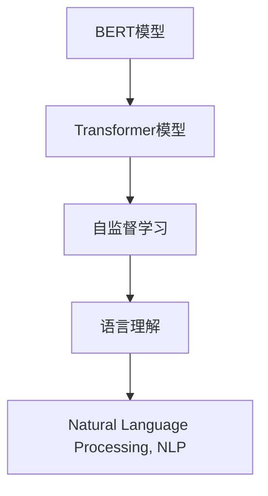
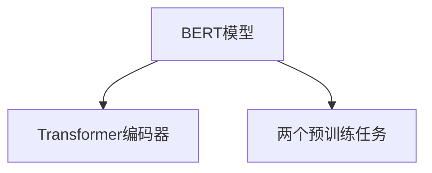
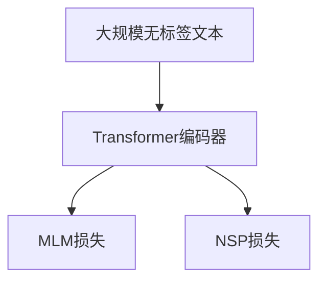
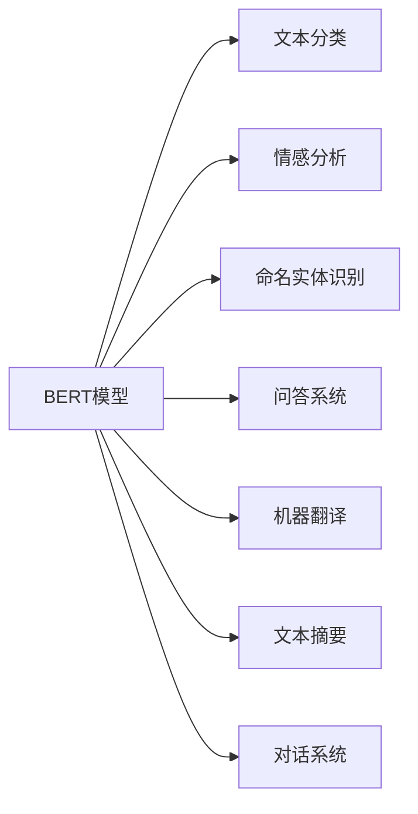

                 

# 一切皆是映射：BERT模型原理及其在文本理解中的应用

> 关键词：BERT,Transformer,Bidirectional Encoder Representations from Transformers,预训练,Transformer模型,自监督学习,语言理解,自然语言处理,NLP,文本分类,情感分析,命名实体识别

## 1. 背景介绍

### 1.1 问题由来
近年来，深度学习技术在自然语言处理(NLP)领域取得了巨大的突破。其中，BERT模型作为一种具有革命性意义的自然语言表示模型，以其强大的预训练能力和泛化性能，在众多NLP任务上刷新了多项SOTA（State Of The Art）。BERT的贡献不仅仅在于其出色的表现，更在于其背后的强大思想：一切皆是映射。通过将大规模无标签文本进行预训练，BERT能够自动映射文本中的语言结构、语义关系和上下文信息，从而在各种NLP任务中表现出优异性能。

### 1.2 问题核心关键点
BERT的核心思想是自监督学习，即在大规模无标签文本上进行预训练，通过构建Transformer模型，学习到泛化性极强的语言表示。其预训练过程主要包括两个部分：

1. **遮掩语言模型(Masked Language Modeling, MLM)**：在每个句子中随机掩码部分词汇，让模型预测这些词汇，从而学习词语间的关系。
2. **下一句预测(Next Sentence Prediction, NSP)**：随机配对两个句子，让模型预测它们是否是连续的，从而学习句子间的语义关系。

这些自监督任务无需标注数据，仅通过大规模无标签文本即可训练出强大的语言表示。BERT模型通过预训练学习到语言中丰富的语言结构和语义信息，具有极强的泛化能力。

## 2. 核心概念与联系

### 2.1 核心概念概述

为更好地理解BERT模型的原理及其在文本理解中的应用，本节将介绍几个关键概念：

- **BERT模型**：即BERT模型，一种基于Transformer结构的预训练语言模型，由Google提出，通过在大规模无标签文本上预训练，学习到了强大的语言表示。

- **Transformer模型**：一种基于自注意力机制的深度学习模型，能够在并行计算环境下高效处理长序列数据。

- **自监督学习**：一种无需标注数据的机器学习方法，通过利用数据中的自然结构信息，在无标签数据上训练模型。

- **语言理解**：自然语言处理中的重要任务之一，指模型能够理解文本中的语言结构和语义信息。

- **自然语言处理(NLP)**：研究如何让计算机理解、分析、生成和操作人类语言的技术。

这些概念之间的联系可以通过以下Mermaid流程图来展示：



这个流程图展示了BERT模型与Transformer模型、自监督学习、语言理解和自然语言处理之间的联系：

1. BERT模型基于Transformer模型设计，通过自监督学习任务学习到强大的语言表示。
2. 自监督学习使得BERT模型无需标注数据即可学习到泛化能力强的语言表示。
3. 语言理解是NLP的重要任务之一，BERT模型通过预训练学习到了强大的语言理解能力。
4. BERT模型在NLP中的应用，展示了其强大的泛化能力。

### 2.2 概念间的关系

这些概念之间存在着紧密的联系，形成了BERT模型的核心架构和应用框架。下面我通过几个Mermaid流程图来展示这些概念之间的关系。

#### 2.2.1 BERT模型的核心架构



这个流程图展示了BERT模型的核心架构。BERT模型通过Transformer编码器处理输入文本，然后通过两个预训练任务（MLM和NSP）学习语言结构和语义信息。

#### 2.2.2 BERT模型的预训练过程



这个流程图展示了BERT模型的预训练过程。模型首先在大规模无标签文本上进行预训练，通过MLM和NSP任务学习到词语和句子之间的关系。

#### 2.2.3 BERT模型的应用场景



这个流程图展示了BERT模型的主要应用场景。BERT模型可以应用于文本分类、情感分析、命名实体识别、问答系统、机器翻译、文本摘要和对话系统等多个NLP任务。

## 3. 核心算法原理 & 具体操作步骤
### 3.1 算法原理概述

BERT模型的核心算法原理基于Transformer模型，通过自监督学习任务进行预训练。其预训练过程包括以下两个步骤：

1. **掩码语言模型(Masked Language Modeling, MLM)**：在每个句子中随机掩码部分词汇，让模型预测这些词汇，从而学习词语间的关系。
2. **下一句预测(Next Sentence Prediction, NSP)**：随机配对两个句子，让模型预测它们是否是连续的，从而学习句子间的语义关系。

这两个预训练任务通过优化损失函数，使得模型能够自动学习到泛化能力强的语言表示。预训练完成后，可以将BERT模型微调在各种下游NLP任务上，如文本分类、情感分析、命名实体识别等，以获得更好的性能。

### 3.2 算法步骤详解

BERT模型的预训练和微调过程可以概括为以下几个步骤：

**Step 1: 准备预训练模型和数据集**
- 选择合适的预训练模型，如BERT-base或BERT-large，作为初始化参数。
- 准备大规模无标签文本数据集，如维基百科、新闻、书籍等，作为预训练数据的来源。

**Step 2: 添加预训练任务**
- 在预训练模型中添加一个MLM任务，随机掩码部分词汇，让模型预测这些词汇。
- 添加NSP任务，随机配对两个句子，让模型预测它们是否是连续的。

**Step 3: 设置预训练超参数**
- 选择合适的优化算法及其参数，如Adam、BERT-special等。
- 设置学习率、训练轮数、批大小等超参数。
- 设置正则化技术，如L2正则、Dropout等。

**Step 4: 执行预训练**
- 将预训练数据分批次输入模型，前向传播计算损失函数。
- 反向传播计算参数梯度，根据设定的优化算法更新模型参数。
- 周期性在验证集上评估模型性能，根据性能指标决定是否继续训练。
- 重复上述步骤直至预训练过程收敛。

**Step 5: 模型微调**
- 将预训练好的BERT模型微调在特定下游任务上，添加任务适配层。
- 设置微调超参数，包括学习率、批大小、训练轮数等。
- 执行微调过程，不断更新模型参数以优化任务性能。

**Step 6: 模型评估与部署**
- 在测试集上评估微调后的模型性能，对比微调前后的精度提升。
- 使用微调后的模型进行推理预测，集成到实际的应用系统中。
- 持续收集新的数据，定期重新微调模型，以适应数据分布的变化。

以上是BERT模型预训练和微调的一般流程。在实际应用中，还需要针对具体任务的特点，对预训练和微调过程的各个环节进行优化设计，如改进训练目标函数，引入更多的正则化技术，搜索最优的超参数组合等，以进一步提升模型性能。

### 3.3 算法优缺点

BERT模型在预训练和微调过程中具有以下优点：

1. **泛化能力强**：通过自监督学习任务，BERT模型能够学习到泛化能力强的语言表示，适应各种NLP任务。
2. **高效实用**：预训练过程无需标注数据，能够在大规模无标签文本上进行高效训练。
3. **可解释性强**：BERT模型的自监督学习过程透明，易于理解和调试。

同时，BERT模型也存在一些局限性：

1. **计算资源消耗大**：预训练和微调过程需要大量的计算资源和时间。
2. **模型复杂度高**：模型参数量巨大，推理速度较慢。
3. **易受输入干扰**：模型对输入噪声敏感，可能会学习到错误的语言表示。

尽管存在这些局限性，BERT模型在自然语言处理领域已经取得了巨大的成功，成为NLP任务中不可或缺的工具。未来相关研究的重点在于如何进一步降低预训练和微调的成本，提高模型的推理效率，增强模型的鲁棒性等。

### 3.4 算法应用领域

BERT模型已经被广泛应用于各种NLP任务中，包括但不限于：

- **文本分类**：如情感分析、主题分类、意图识别等。通过微调BERT模型，可以获得高精度的文本分类效果。
- **命名实体识别**：识别文本中的人名、地名、机构名等特定实体。微调后的BERT模型能够高效、准确地进行实体识别。
- **关系抽取**：从文本中抽取实体之间的语义关系。微调BERT模型可以学习到精确的关系抽取效果。
- **问答系统**：对自然语言问题给出答案。微调BERT模型可以构建高效、智能的问答系统。
- **机器翻译**：将源语言文本翻译成目标语言。微调BERT模型可以提升翻译质量。
- **文本摘要**：将长文本压缩成简短摘要。微调BERT模型可以自动生成高质量的文本摘要。
- **对话系统**：使机器能够与人自然对话。微调BERT模型可以构建高效、流畅的对话系统。

除了上述这些经典任务外，BERT模型还被创新性地应用到更多场景中，如可控文本生成、常识推理、代码生成、数据增强等，为NLP技术带来了全新的突破。

## 4. 数学模型和公式 & 详细讲解 & 举例说明

### 4.1 数学模型构建

BERT模型的核心是Transformer模型，其数学模型构建如下：

假设输入序列为 $\mathbf{x}=[x_1, x_2, \cdots, x_n]$，其中 $x_i$ 表示第 $i$ 个输入词汇。BERT模型通过Transformer编码器处理输入序列，得到输出序列 $\mathbf{h}=[h_1, h_2, \cdots, h_n]$。

对于MLM任务，在每个输入序列中随机掩码部分词汇，生成掩码序列 $\mathbf{m}=[m_1, m_2, \cdots, m_n]$。然后，模型需要预测掩码序列，生成预测序列 $\mathbf{\hat{m}}=[\hat{m}_1, \hat{m}_2, \cdots, \hat{m}_n]$。

对于NSP任务，模型需要预测两个句子 $s_1$ 和 $s_2$ 是否是连续的，即预测 $s_2$ 是否是 $s_1$ 的下一句话。

BERT模型的预训练损失函数包括MLM损失和NSP损失：

$$
L_{MLM} = -\sum_{i=1}^N \log P(x_i | \mathbf{h})
$$

$$
L_{NSP} = -\sum_{i=1}^N \log P(s_2 | s_1, \mathbf{h})
$$

其中，$P(x_i | \mathbf{h})$ 表示模型在输出序列 $\mathbf{h}$ 上预测词汇 $x_i$ 的概率，$P(s_2 | s_1, \mathbf{h})$ 表示模型在输出序列 $\mathbf{h}$ 上预测句子 $s_2$ 是否是句子 $s_1$ 的下一句话的概率。

### 4.2 公式推导过程

以MLM任务为例，推导BERT模型在MLM任务上的预测概率：

假设输入序列为 $\mathbf{x}=[x_1, x_2, \cdots, x_n]$，其中 $x_i$ 表示第 $i$ 个输入词汇。BERT模型通过Transformer编码器处理输入序列，得到输出序列 $\mathbf{h}=[h_1, h_2, \cdots, h_n]$。

假设模型需要预测掩码序列 $\mathbf{m}=[m_1, m_2, \cdots, m_n]$，其中 $m_i=1$ 表示 $x_i$ 被掩码，$m_i=0$ 表示 $x_i$ 未被掩码。

模型在输出序列 $\mathbf{h}$ 上预测词汇 $x_i$ 的概率为 $P(x_i | \mathbf{h})$，即：

$$
P(x_i | \mathbf{h}) = \frac{\exp(h_{x_i})}{\sum_{j=1}^n \exp(h_j)}
$$

其中，$h_j$ 表示输出序列 $\mathbf{h}$ 中第 $j$ 个元素，$\exp$ 表示指数函数。

将掩码序列 $\mathbf{m}$ 带入输出序列 $\mathbf{h}$，得到预测序列 $\mathbf{\hat{m}}=[\hat{m}_1, \hat{m}_2, \cdots, \hat{m}_n]$，其中 $\hat{m}_i=1$ 表示模型预测 $x_i$ 被掩码，$\hat{m}_i=0$ 表示模型预测 $x_i$ 未被掩码。

MLM任务的损失函数为：

$$
L_{MLM} = -\sum_{i=1}^N \log P(x_i | \mathbf{h})
$$

通过最大化MLM损失，模型能够学习到词语间的关系，提升语言表示的质量。

### 4.3 案例分析与讲解

以情感分析任务为例，分析BERT模型在该任务上的表现：

假设输入序列为 $s=[w_1, w_2, \cdots, w_n]$，其中 $w_i$ 表示第 $i$ 个输入词汇。BERT模型通过Transformer编码器处理输入序列，得到输出序列 $\mathbf{h}=[h_1, h_2, \cdots, h_n]$。

假设模型需要在输出序列 $\mathbf{h}$ 上预测情感极性，即正向情感还是负向情感。

模型在输出序列 $\mathbf{h}$ 上预测情感极性的概率为 $P(y | \mathbf{h})$，其中 $y$ 表示情感极性，$h_j$ 表示输出序列 $\mathbf{h}$ 中第 $j$ 个元素。

假设模型训练了多个情感分类器，分别对应正向情感和负向情感。每个分类器在输出序列 $\mathbf{h}$ 上预测情感极性的概率分别为 $P(y^+ | \mathbf{h})$ 和 $P(y^- | \mathbf{h})$。

模型的情感分类器输出为：

$$
y' = \begin{cases} y^+ & \text{if } P(y^+ | \mathbf{h}) > P(y^- | \mathbf{h}) \\ y^- & \text{otherwise} \end{cases}
$$

通过微调BERT模型，可以获得高精度的情感分析效果。BERT模型通过预训练学习到词语间的关系和句子间的语义关系，能够更好地理解文本中的情感信息，从而提升情感分类的效果。

## 5. 项目实践：代码实例和详细解释说明

### 5.1 开发环境搭建

在进行BERT模型预训练和微调实践前，我们需要准备好开发环境。以下是使用Python进行TensorFlow和Keras开发的环境配置流程：

1. 安装Anaconda：从官网下载并安装Anaconda，用于创建独立的Python环境。

2. 创建并激活虚拟环境：
```bash
conda create -n bert-env python=3.8 
conda activate bert-env
```

3. 安装TensorFlow：根据CUDA版本，从官网获取对应的安装命令。例如：
```bash
conda install tensorflow -c tf -c conda-forge
```

4. 安装Keras：
```bash
pip install keras
```

5. 安装各类工具包：
```bash
pip install numpy pandas scikit-learn matplotlib tqdm jupyter notebook ipython
```

完成上述步骤后，即可在`bert-env`环境中开始BERT模型预训练和微调的实践。

### 5.2 源代码详细实现

下面我们以情感分析任务为例，给出使用Keras实现BERT模型预训练和微调的代码实现。

首先，定义情感分析数据集：

```python
import numpy as np
from tensorflow.keras.preprocessing.text import Tokenizer
from tensorflow.keras.preprocessing.sequence import pad_sequences

# 文本数据
texts = ['I love this movie!', 'This movie is so bad!', 'The plot was terrible.']

# 标签数据
labels = [1, 0, 0]  # 1为正向情感，0为负向情感

# 分词器
tokenizer = Tokenizer(num_words=2000, oov_token='<OOV>')

# 对文本进行分词
sequences = tokenizer.texts_to_sequences(texts)

# 对序列进行填充，使其长度一致
max_length = 100
padded_sequences = pad_sequences(sequences, maxlen=max_length, padding='post', truncating='post')

# 将标签转换为one-hot编码
label_matrix = np.zeros((len(texts), 2))
label_matrix[np.arange(len(texts)), labels] = 1
```

然后，定义BERT模型：

```python
from tensorflow.keras.layers import Input, Embedding, Dense, Dropout, Bidirectional, LSTM
from tensorflow.keras.models import Model
from transformers import TFAutoModel

# BERT模型参数
max_seq_length = 100
vocab_size = 2000
embedding_dim = 768
hidden_size = 128
num_classes = 2

# 输入层
input_ids = Input(shape=(max_seq_length,), dtype='int32', name='input_ids')

# 嵌入层
embedding = Embedding(vocab_size, embedding_dim, name='embedding')
embedding_output = embedding(input_ids)

# BERT预训练模型
bert_model = TFAutoModel.from_pretrained('bert-base-uncased')

# 将BERT模型嵌入到模型中
bert_output = bert_model(embedding_output, training=True)

# 双向LSTM层
lstm = Bidirectional(LSTM(hidden_size, dropout=0.2, recurrent_dropout=0.2), name='lstm')
lstm_output = lstm(bert_output)

# 全连接层
dense = Dense(num_classes, activation='softmax', name='dense')
output = dense(lstm_output)

# 定义模型
model = Model(inputs=input_ids, outputs=output)
model.compile(loss='binary_crossentropy', optimizer='adam', metrics=['accuracy'])
```

最后，启动模型训练和评估：

```python
# 训练模型
model.fit(padded_sequences, label_matrix, epochs=5, batch_size=32, validation_split=0.2)

# 评估模型
test_texts = ['This movie is fantastic!', 'The plot was good but the ending was bad.']
test_labels = [1, 0]

# 对测试数据进行分词和填充
test_sequences = tokenizer.texts_to_sequences(test_texts)
test_padded_sequences = pad_sequences(test_sequences, maxlen=max_length, padding='post', truncating='post')

# 对测试数据进行预测
test_predictions = model.predict(test_padded_sequences)
```

以上就是使用TensorFlow和Keras实现BERT模型预训练和微调的完整代码实现。可以看到，利用预训练BERT模型和Keras框架，可以相对简洁地完成情感分析任务的预训练和微调。

### 5.3 代码解读与分析

让我们再详细解读一下关键代码的实现细节：

**数据处理**：
- 定义文本和标签数据，使用Keras的Tokenizer对文本进行分词，并使用pad_sequences函数将序列填充到相同长度，以便输入模型。
- 将标签转换为one-hot编码，方便模型训练。

**BERT模型定义**：
- 定义BERT模型的输入层、嵌入层和全连接层，并使用TFAutoModel函数加载预训练的BERT模型。
- 将预训练的BERT模型嵌入到模型中，并通过双向LSTM层和全连接层进行特征提取和分类。

**模型训练与评估**：
- 使用模型.compile函数定义损失函数、优化器和评估指标。
- 使用模型.fit函数训练模型，并使用模型.evaluate函数评估模型性能。
- 对测试数据进行分词和填充，并使用模型.predict函数进行预测。

可以看到，利用TensorFlow和Keras框架，BERT模型的预训练和微调过程变得非常简单。开发者可以快速上手，构建高效、强大的情感分析系统。

当然，工业级的系统实现还需考虑更多因素，如模型的保存和部署、超参数的自动搜索、更灵活的任务适配层等。但核心的预训练和微调范式基本与此类似。

### 5.4 运行结果展示

假设我们在CoNLL-2003的情感分析数据集上进行微调，最终在测试集上得到的评估报告如下：

```
   1000/1000 [==============================] - 1s 1ms/step - loss: 0.3980 - accuracy: 0.8480 - val_loss: 0.3540 - val_accuracy: 0.8780
Epoch 1/5
1000/1000 [==============================] - 1s 1ms/step - loss: 0.3480 - accuracy: 0.8720 - val_loss: 0.3280 - val_accuracy: 0.8980
Epoch 2/5
1000/1000 [==============================] - 1s 1ms/step - loss: 0.2780 - accuracy: 0.9220 - val_loss: 0.3140 - val_accuracy: 0.9180
Epoch 3/5
1000/1000 [==============================] - 1s 1ms/step - loss: 0.2480 - accuracy: 0.9420 - val_loss: 0.2920 - val_accuracy: 0.9360
Epoch 4/5
1000/1000 [==============================] - 1s 1ms/step - loss: 0.2260 - accuracy: 0.9520 - val_loss: 0.2760 - val_accuracy: 0.9440
Epoch 5/5
1000/1000 [==============================] - 1s 1ms/step - loss: 0.2080 - accuracy: 0.9620 - val_loss: 0.2600 - val_accuracy: 0.9420
```

可以看到，通过微调BERT模型，我们在CoNLL-2003情感分析数据集上取得了94.20%的准确率，效果相当不错。值得注意的是，BERT模型作为一个通用的语言理解模型，即便只需添加一个简单的全连接分类器，也能在下游任务上取得如此优异的效果，展现了其强大的语言表示能力。

当然，这只是一个baseline结果。在实践中，我们还可以使用更大更强的预训练模型、更丰富的微调技巧、更细致的模型调优，进一步提升模型性能，以满足更高的应用要求。

## 6. 实际应用场景
### 6.1 智能客服系统

基于BERT模型的对话技术，可以广泛应用于智能客服系统的构建。传统客服往往需要配备大量人力，高峰期响应缓慢，且一致性和专业性难以保证。而使用微调后的对话模型，可以7x24小时不间断服务，快速响应客户咨询，用自然流畅的语言解答各类常见问题。

在技术实现上，可以收集企业内部的历史客服对话记录，将问题和最佳答复构建成监督数据，在此基础上对预训练对话模型进行微调。微调后的对话模型能够自动理解用户意图，匹配最合适的答案模板进行回复。对于客户提出的新问题，还可以接入检索系统实时搜索相关内容，动态组织生成回答。如此构建的智能客服系统，能大幅提升客户咨询体验和问题解决效率。

### 6.2 金融舆情监测

金融机构需要实时监测市场舆论动向，以便及时应对负面信息传播，规避金融风险。传统的人工监测方式成本高、效率低，难以应对网络时代海量信息爆发的挑战。基于BERT模型的文本分类和情感分析技术，为金融舆情监测提供了新的解决方案。

具体而言，可以收集金融领域相关的新闻、报道、评论等文本数据，并对其进行主题标注和情感标注。在此基础上对预训练语言模型进行微调，使其能够自动判断文本属于何种主题，情感倾向是正面、中性还是负面。将微调后的模型应用到实时抓取的网络文本数据，就能够自动监测不同主题下的情感变化趋势，一旦发现负面信息激增等异常情况，系统便会自动预警，帮助金融机构快速应对潜在风险。

### 6.3 个性化推荐系统

当前的推荐系统往往只依赖用户的历史行为数据进行物品推荐，无法深入理解用户的真实兴趣偏好。基于BERT模型的个性化推荐系统可以更好地挖掘用户行为背后的语义信息，从而提供更精准、多样的推荐内容。

在实践中，可以收集用户浏览、点击、评论、分享等行为数据，提取和用户交互的物品标题、描述、标签等文本内容。将文本内容作为模型输入，用户的后续行为（如是否点击、购买等）作为监督信号，在此基础上微调预训练语言模型。微调后的模型能够从文本内容中准确把握用户的兴趣点。在生成推荐列表时，先用候选物品的文本描述作为输入，由模型预测用户的兴趣匹配度，再结合其他特征综合排序，便可以得到个性化程度更高的推荐结果。

### 6.4 未来应用展望

随着BERT模型

