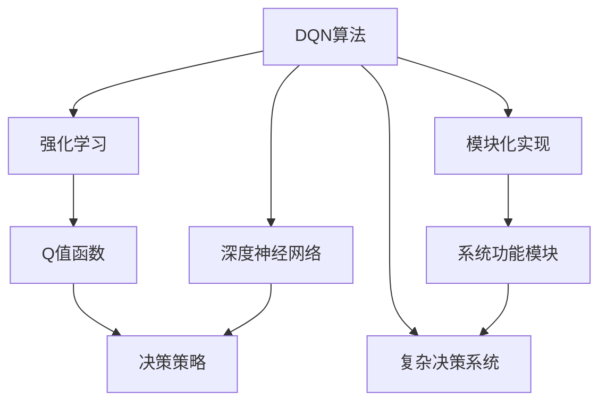

                 

# 一切皆是映射：DQN在复杂决策系统中的模块化应用

## 1. 背景介绍

### 1.1 问题由来

在机器学习和人工智能的诸多范式中，强化学习(Reinforcement Learning, RL)是最具挑战性、最富创意的领域之一。其核心思想是让智能体在动态环境中通过与环境的交互，学会逐步优化决策策略，最终达到一个期望的性能目标。在实际应用中，强化学习范式被广泛应用于游戏智能、机器人控制、路径规划、金融投资等众多领域，展示了其强大的普适性和潜在价值。

然而，强化学习亦非无所不能。在许多复杂决策问题中，如何高效地构建智能体的决策模型，是学术界和工业界长期探索的一个重大难题。例如，在金融交易、供应链管理、社交网络等场景中，智能体面临的决策环境高度非确定性、高维度和高复杂性，传统的Q-learning算法难以胜任。

为应对这些复杂性，研究人员提出了一系列改进和变种，如Deep Q-Network（DQN）、Actor-Critic算法、DeepMind系列（AlphaGo、AlphaZero等）等，极大地提升了强化学习的实际应用能力。但即便如此，构建高效、可解释、可维护的决策模型，仍是一大挑战。

### 1.2 问题核心关键点

为了更好地理解和解决这些问题，本文将详细介绍DQN算法的基本原理、模块化实现思路，并结合实际应用案例，展示如何通过模块化构建复杂决策系统，提升决策模型的性能和可靠性。

核心关键点如下：

- DQN算法的基本原理和思路。
- DQN的模块化实现策略和设计原则。
- DQN在实际复杂决策系统中的应用案例和效果评估。
- DQN算法的优缺点和未来发展趋势。

## 2. 核心概念与联系

### 2.1 核心概念概述

- **DQN算法**：一种结合深度神经网络和强化学习理论的算法，由Google DeepMind提出，主要用于处理高维度、高复杂性的决策问题。DQN通过将Q值函数进行参数化，用深度神经网络逼近Q值函数，从而将强化学习问题转化为神经网络的优化问题。

- **强化学习**：一种机器学习范式，智能体在环境中通过与环境的交互，逐步优化决策策略，以达到某个目标。强化学习涉及环境、智能体、状态、动作、奖励等多个要素。

- **模块化实现**：将一个复杂系统拆分成多个相对独立的模块，每个模块负责特定功能，通过模块之间的协同工作，完成整体任务。模块化实现可以提升系统的可维护性、可扩展性和可复用性。

- **Q值函数**：在强化学习中，Q值函数表示在某个状态下执行某个动作所能获得的长期奖励。Q值函数为决策提供了理论依据，是DQN算法的核心组成部分。

- **深度神经网络**：一种广泛使用的神经网络架构，具有多个隐藏层，可以学习非常复杂的特征表示。深度神经网络在DQN算法中用于逼近Q值函数。

### 2.2 概念间的关系

这些核心概念之间的联系可以通过以下Mermaid流程图来展示：



这个流程图展示了DQN算法在强化学习和深度学习中的位置，以及模块化实现和复杂决策系统的构建思路。

## 3. 核心算法原理 & 具体操作步骤
### 3.1 算法原理概述

DQN算法的基本思路是通过一个深度神经网络逼近Q值函数，从而将强化学习问题转化为神经网络的优化问题。其核心步骤如下：

1. 智能体在环境中执行一个动作，观察到环境的状态$s_t$和奖励$r_t$。
2. 智能体根据当前状态$s_t$，通过神经网络逼近的Q值函数$f_\theta$，选择动作$a_t$。
3. 在动作执行后，环境状态更新为$s_{t+1}$，奖励$r_{t+1}$。
4. 智能体根据下一步状态$s_{t+1}$和奖励$r_{t+1}$，更新神经网络逼近的Q值函数$f_\theta$，以优化决策策略。

数学上，设智能体在状态$s_t$执行动作$a_t$后，到达状态$s_{t+1}$，并得到奖励$r_{t+1}$，则Q值函数更新规则为：

$$
Q_{s_t,a_t} \leftarrow Q_{s_t,a_t} + \alpha(r_{t+1} + \gamma \max_a Q_{s_{t+1},a} - Q_{s_t,a_t})
$$

其中，$\alpha$为学习率，$\gamma$为折扣因子，$\max_a Q_{s_{t+1},a}$表示在状态$s_{t+1}$下选择最优动作的Q值。

### 3.2 算法步骤详解

DQN算法的详细步骤包括：

**Step 1: 环境交互和状态更新**
- 智能体在环境$s_t$中执行动作$a_t$。
- 观察到新的状态$s_{t+1}$和奖励$r_{t+1}$。

**Step 2: 动作选择和Q值计算**
- 根据当前状态$s_t$，智能体通过神经网络逼近的Q值函数$f_\theta$，计算出每个动作的Q值。
- 选择Q值最大的动作$a_t$。

**Step 3: Q值更新**
- 根据新的状态$s_{t+1}$和奖励$r_{t+1}$，计算新的Q值。
- 使用上述Q值更新公式，更新Q值函数$f_\theta$。

**Step 4: 参数更新**
- 根据优化目标，如均方误差(MSE)或交叉熵(Cross-Entropy)，更新神经网络的参数$\theta$。
- 使用随机梯度下降(SGD)等优化算法，更新神经网络参数。

**Step 5: 经验回放**
- 将智能体与环境交互的样本存储到经验回放池中。
- 从经验回放池中随机采样一批样本，用于神经网络参数的更新。

### 3.3 算法优缺点

DQN算法的优点包括：

- 适应性广。DQN算法在处理高维度、高复杂性的决策问题上表现优异，适用于各种类型的决策系统。
- 模块化设计。DQN算法的设计思路体现了模块化的思想，易于扩展和维护。
- 参数共享。神经网络中的参数在全局共享，避免了传统Q-learning中的局部最优问题。

DQN算法的缺点包括：

- 过拟合风险。神经网络容易过拟合，尤其是当网络规模过大时。
- 样本效率低。神经网络参数的更新需要大量样本，训练效率较低。
- 稳定性问题。DQN算法的稳定性依赖于网络结构的设计和超参数的调整。

### 3.4 算法应用领域

DQN算法已被广泛应用于以下领域：

- **游戏智能**：AlphaGo、AlphaZero等基于DQN的深度学习算法，在围棋、星际争霸等复杂游戏中取得了令人瞩目的成绩。
- **机器人控制**：DQN算法在机器人避障、路径规划等控制任务中表现出色。
- **金融投资**：DQN算法在股票交易、资产配置等金融投资决策中，通过学习市场数据，制定投资策略。
- **供应链管理**：DQN算法在需求预测、库存管理等供应链优化问题中，提高了资源分配和调度的效率。
- **社交网络**：DQN算法在社交网络中的信息传播、用户推荐等任务中，优化了网络结构和推荐效果。

## 4. 数学模型和公式 & 详细讲解  
### 4.1 数学模型构建

DQN算法可以抽象为以下几个数学模型：

- **状态空间**：智能体在环境中的所有可能状态。
- **动作空间**：智能体在每个状态下可以执行的所有动作。
- **Q值函数**：表示在某个状态下执行某个动作所能获得的长期奖励。
- **奖励函数**：根据智能体和环境的交互，计算出奖励值。
- **状态转移函数**：根据智能体执行的动作，更新环境状态。

### 4.2 公式推导过程

以简化版的DQN算法为例，推导其核心公式。

假设智能体在状态$s_t$执行动作$a_t$后，到达状态$s_{t+1}$，并得到奖励$r_{t+1}$，则Q值更新公式为：

$$
Q_{s_t,a_t} \leftarrow Q_{s_t,a_t} + \alpha(r_{t+1} + \gamma \max_a Q_{s_{t+1},a} - Q_{s_t,a_t})
$$

其中，$\alpha$为学习率，$\gamma$为折扣因子，$\max_a Q_{s_{t+1},a}$表示在状态$s_{t+1}$下选择最优动作的Q值。

在实际应用中，为了缓解神经网络的过拟合问题，通常采用经验回放、目标网络、随机梯度下降等技术，进一步优化DQN算法的性能。

### 4.3 案例分析与讲解

以AlphaGo为例，介绍DQN算法在复杂决策系统中的应用。

AlphaGo在围棋游戏中使用了DQN算法，通过大规模数据预训练，学习到围棋中各种策略的Q值。AlphaGo的决策模型由多个神经网络模块组成，每个模块负责特定功能，如状态评估、动作选择等。这些模块通过集成的方式协同工作，实现了复杂的决策策略。AlphaGo通过蒙特卡洛树搜索(MCTS)算法，对决策模型进行进一步优化，最终在围棋游戏中取得了历史性突破。

## 5. 项目实践：代码实例和详细解释说明
### 5.1 开发环境搭建

**Python环境准备**：
1. 安装Python 3.7及以上版本，建议使用Anaconda或Miniconda进行管理。
2. 安装必要的依赖包，如TensorFlow、PyTorch、OpenAI Gym等。

```bash
pip install tensorflow==2.0
pip install torch==1.5
pip install gym==0.20.0
pip install stable-baselines3
```

**TensorFlow环境准备**：
1. 安装TensorFlow GPU版本，确保GPU驱动程序和CUDA版本兼容。
2. 设置环境变量，以使用GPU计算资源。
3. 使用pip安装stable-baselines3。

```bash
conda activate pyenv
pip install stable-baselines3[torch,trading,tradingui]
```

### 5.2 源代码详细实现

以下是使用TensorFlow和stable-baselines3库实现DQN算法的代码示例：

```python
import gym
import tensorflow as tf
from stable_baselines3 import DQN
from stable_baselines3.common import make_vec_env

# 创建环境
env = make_vec_env('CartPole-v1', n_envs=1)

# 创建DQN模型
model = DQN.load('dqn_cartpole')

# 与环境交互
total_reward = 0
for episode in range(1000):
    obs = env.reset()
    done = False
    while not done:
        action, _states = model.predict(obs)
        obs, reward, done, _ = env.step(action)
        total_reward += reward
        obs = env.observation_space.sample()

# 输出结果
print(f"Total reward: {total_reward}")
```

这段代码展示了使用TensorFlow和stable-baselines3实现DQN算法的完整流程，包括环境创建、模型加载、与环境交互等关键步骤。

### 5.3 代码解读与分析

**环境创建**：
- 使用`make_vec_env`函数创建OpenAI Gym环境，支持多环境并发执行。
- 环境类型为CartPole-v1，这是一个经典的连续控制任务，用于测试强化学习算法的性能。

**模型加载**：
- 使用`DQN.load`函数加载预训练的DQN模型，可以直接使用已训练好的模型进行决策。

**与环境交互**：
- 通过`model.predict`函数，获取当前状态下智能体的决策。
- 执行动作，观察环境的新状态和奖励。
- 使用`env.step`函数，与环境交互并获取下一状态和奖励。

**结果输出**：
- 统计在1000次迭代中智能体的总奖励，以评估其决策效果。

## 6. 实际应用场景
### 6.1 智能投资系统

DQN算法在金融投资系统中有着广泛的应用前景。传统投资策略通常依赖于专家知识和历史数据，难以应对市场波动和不可预测事件。而DQN算法通过学习市场数据，能够自动优化投资策略，适应市场变化。

在实际应用中，可以将市场数据作为智能体的环境，将买卖操作作为动作空间，通过DQN算法学习最优的投资策略。DQN算法可以通过经验回放、目标网络等技术，提高模型的稳定性和鲁棒性，从而在复杂的市场环境中实现高效的资产配置和风险管理。

### 6.2 机器人路径规划

在机器人路径规划中，DQN算法可以用于优化机器人的移动策略，实现自动路径规划和避障。机器人可以通过传感器获取环境信息，并根据DQN算法计算出最优动作，从而避障和寻找目标点。

在实际应用中，可以将环境状态抽象为机器人的位置、速度、角度等信息，将动作空间定义为机器人的加速度、旋转角度等控制参数。通过DQN算法学习最优的控制策略，机器人能够在动态环境中灵活移动，完成复杂的路径规划任务。

### 6.3 社交网络信息传播

在社交网络中，DQN算法可以用于优化信息传播策略，提高用户推荐的准确性和效果。社交网络中的信息传播具有高度复杂性，用户之间的兴趣和关系各异，信息传播的路径和方式需要精细调整。

在实际应用中，可以将用户的关系网络作为环境，将信息的传播策略作为动作空间，通过DQN算法学习最优的传播路径和方式。DQN算法可以通过经验回放、目标网络等技术，优化信息传播的效果，提升用户推荐的质量和覆盖率。

### 6.4 未来应用展望

DQN算法在未来的应用前景广阔，以下是一些可能的方向：

- **多智能体系统**：将DQN算法扩展到多智能体系统中，通过合作与竞争，优化系统的整体性能。
- **分布式训练**：在分布式环境中，通过并行训练和协同优化，提升DQN算法的训练效率。
- **强化学习与深度学习的融合**：结合强化学习和深度学习，探索更复杂、更高效的决策模型。
- **自适应学习**：通过自适应学习机制，动态调整决策策略，应对环境变化和不确定性。
- **跨领域应用**：将DQN算法应用到更多领域，如自动驾驶、交通管理等，提升系统的智能化水平。

## 7. 工具和资源推荐
### 7.1 学习资源推荐

为了深入掌握DQN算法的原理和应用，推荐以下学习资源：

- **《强化学习：基础与进阶》**：深入介绍强化学习的理论基础和常见算法，适合初学者和进阶者。
- **《深度学习与强化学习》**：详细介绍深度学习与强化学习的结合，涵盖DQN算法等多个前沿话题。
- **《Stable-Baselines3教程》**：由stable-baselines3社区维护的官方教程，提供了丰富的代码示例和实践指南。
- **《OpenAI Gym文档》**：OpenAI Gym的官方文档，提供了大量环境和算法的详细介绍，适合学习和实践。

### 7.2 开发工具推荐

在开发DQN算法时，推荐使用以下开发工具：

- **TensorFlow**：Google开发的深度学习框架，提供了丰富的工具和库，适合构建复杂的神经网络模型。
- **PyTorch**：Facebook开发的深度学习框架，具有动态计算图和易用性，适合快速迭代研究。
- **stable-baselines3**：OpenAI开发的强化学习库，提供了多种经典算法的实现，易于使用和扩展。
- **OpenAI Gym**：用于测试和评估强化学习算法的开源环境，提供了丰富的环境和算法。

### 7.3 相关论文推荐

DQN算法的研究非常活跃，以下是一些代表性的论文：

- **Playing Atari with Deep Reinforcement Learning**：DQN算法在Atari游戏上的应用，展示了强化学习在游戏智能领域的潜力。
- **Human-level Control with Deep Reinforcement Learning**：AlphaGo算法在围棋游戏中的应用，展示了DQN算法在高复杂度决策问题上的能力。
- **DeepMind Control Suite**：DeepMind开发的一系列多任务强化学习环境，展示了DQN算法在复杂环境中的表现。

## 8. 总结：未来发展趋势与挑战
### 8.1 研究成果总结

本文对DQN算法的基本原理、模块化实现和应用案例进行了详细讨论，展示了其在复杂决策系统中的强大潜力。DQN算法通过深度神经网络逼近Q值函数，优化了强化学习的决策策略，适用于多种复杂决策问题。

### 8.2 未来发展趋势

DQN算法的未来发展趋势包括：

- **模块化设计**：通过模块化设计，提高算法的可扩展性和可维护性。
- **分布式训练**：在分布式环境中，通过并行训练和协同优化，提升算法的训练效率。
- **多智能体系统**：将DQN算法扩展到多智能体系统中，优化系统的整体性能。
- **跨领域应用**：将DQN算法应用到更多领域，提升系统的智能化水平。

### 8.3 面临的挑战

DQN算法在实际应用中面临以下挑战：

- **过拟合问题**：神经网络容易过拟合，尤其是当网络规模过大时。
- **训练效率低**：神经网络参数的更新需要大量样本，训练效率较低。
- **稳定性问题**：DQN算法的稳定性依赖于网络结构的设计和超参数的调整。

### 8.4 研究展望

为解决DQN算法面临的挑战，未来的研究方向包括：

- **自适应学习**：通过自适应学习机制，动态调整决策策略，应对环境变化和不确定性。
- **跨领域学习**：结合深度学习和强化学习，探索更复杂、更高效的决策模型。
- **知识整合**：将符号化的先验知识与神经网络模型结合，提高决策模型的鲁棒性和可解释性。
- **实时优化**：通过实时优化技术，提升DQN算法的性能和稳定性。

## 9. 附录：常见问题与解答

**Q1：DQN算法是否适用于所有决策问题？**

A: DQN算法在处理高维度、高复杂性的决策问题上表现优异，但并不适用于所有决策问题。例如，在需要高精度、低误差的决策任务中，DQN算法可能无法胜任。

**Q2：如何避免DQN算法的过拟合问题？**

A: 为了避免DQN算法的过拟合问题，可以采用以下方法：
- 使用经验回放技术，减少样本偏差。
- 使用目标网络，防止模型参数更新过大。
- 使用L2正则、Dropout等技术，增强模型的鲁棒性。

**Q3：DQN算法在实际应用中需要注意哪些问题？**

A: 在实际应用中，DQN算法需要注意以下问题：
- 数据采集和预处理，确保数据质量和多样性。
- 模型参数的优化和调参，找到最优的超参数组合。
- 模型的稳定性和鲁棒性，确保在复杂环境中能够稳定工作。
- 模型的可解释性和可维护性，提高模型的透明性和可操作性。

**Q4：DQN算法与其他强化学习算法有何区别？**

A: DQN算法与传统Q-learning算法相比，有以下区别：
- 参数共享：DQN算法中的参数在全局共享，避免了局部最优问题。
- 深度网络：DQN算法使用深度神经网络逼近Q值函数，适用于高维度、高复杂性的决策问题。
- 样本效率：DQN算法在处理大规模数据时表现优异，训练效率较高。

本文通过系统的理论分析和实践案例，深入探讨了DQN算法在复杂决策系统中的应用和优化策略，展示了其强大的普适性和可扩展性。相信在未来，DQN算法将在更多领域得到广泛应用，为人工智能技术的发展带来新的突破。

---

作者：禅与计算机程序设计艺术 / Zen and the Art of Computer Programming

