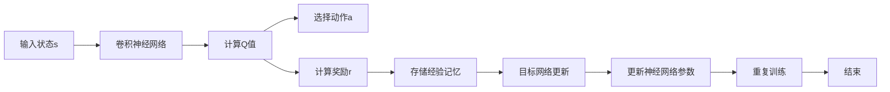

                 

# 一切皆是映射：DQN的故障诊断与调试技巧：如何快速定位问题

## 1. 背景介绍

在深度强化学习中，DQN（Deep Q-Network）作为一种端到端的强化学习框架，因其高效、鲁棒的特点在复杂环境中取得了卓越的性能。然而，DQN的训练过程复杂，需要处理大量的状态-动作-奖励数据，容易受到环境变化、参数配置等多因素影响。因此，如何快速定位问题、优化DQN模型的表现，成为了一个重要的研究方向。

本文将深入探讨DQN的故障诊断与调试技巧，详细介绍DQN的核心算法原理和具体操作步骤，从数学模型、代码实现到实际应用，全面剖析DQN在各种场景下的运行机制和优化策略，助力开发者快速定位问题，优化模型性能。

## 2. 核心概念与联系

### 2.1 核心概念概述

DQN（Deep Q-Network）是一种深度强化学习算法，基于Q-learning和神经网络，将Q函数从表格形式推广到深度神经网络。它通过端到端的方式学习最优的Q函数，直接输出动作值预测，避免手动设计状态-动作映射策略，能够处理复杂高维的状态空间。

与传统的Q-learning相比，DQN使用了深度神经网络来逼近Q函数，通过卷积神经网络（CNN）提取状态特征，使得DQN能够处理高维、连续状态，适应于复杂的视觉、音频等环境。DQN的关键在于通过经验回放（Experience Replay）和目标网络更新（Target Network Update）来稳定训练过程，从而最大化累计奖励（cumulative reward）。

### 2.2 概念间的关系

DQN的核心算法流程可以通过以下Mermaid流程图来展示：



这个流程图展示了DQN的主要流程：

1. 输入状态s通过卷积神经网络B进行特征提取。
2. 卷积神经网络计算状态s的Q值，并选择动作a。
3. 动作a执行后，获取奖励r，并存储经验记忆F。
4. 目标网络G根据经验记忆更新Q值，更新神经网络参数H。
5. 重复上述步骤，直至训练结束J。

通过这个流程图，可以直观地理解DQN的训练流程，以及其中各组件的作用和相互关系。

## 3. 核心算法原理 & 具体操作步骤
### 3.1 算法原理概述

DQN的核心思想是使用深度神经网络逼近Q函数，通过经验回放和目标网络更新，最大化累计奖励。其算法流程包括以下几个关键步骤：

1. **状态特征提取**：输入状态s通过卷积神经网络B进行特征提取，得到状态特征向量x。
2. **Q值计算**：卷积神经网络B计算状态特征x的Q值，即预测当前状态s下各动作a的累计奖励预测值。
3. **动作选择**：根据当前状态s的Q值，选择动作a。
4. **经验回放**：将状态s、动作a、奖励r、下一个状态s'存储到经验回放缓冲区中。
5. **目标网络更新**：使用目标网络根据经验回放缓冲区的数据，更新Q值，从而逼近最优Q函数。
6. **神经网络参数更新**：根据目标网络更新的结果，更新主网络的参数，使得模型不断逼近最优策略。

### 3.2 算法步骤详解

#### 3.2.1 状态特征提取

状态特征提取是DQN算法的第一步。状态s可以是连续的、高维的数据，如图像、声音等，通常使用卷积神经网络B来提取状态特征向量x。卷积神经网络通过多层卷积和池化操作，可以有效地处理高维数据，提取有效的特征向量。

```python
import torch
from torch import nn

class CNN(nn.Module):
    def __init__(self, input_channels, output_channels):
        super(CNN, self).__init__()
        self.conv1 = nn.Conv2d(input_channels, 32, kernel_size=3, stride=1, padding=1)
        self.relu1 = nn.ReLU()
        self.pool1 = nn.MaxPool2d(kernel_size=2, stride=2)
        self.conv2 = nn.Conv2d(32, 64, kernel_size=3, stride=1, padding=1)
        self.relu2 = nn.ReLU()
        self.pool2 = nn.MaxPool2d(kernel_size=2, stride=2)
        self.fc1 = nn.Linear(64 * 7 * 7, 128)
        self.fc2 = nn.Linear(128, output_channels)
    
    def forward(self, x):
        x = self.conv1(x)
        x = self.relu1(x)
        x = self.pool1(x)
        x = self.conv2(x)
        x = self.relu2(x)
        x = self.pool2(x)
        x = x.view(-1, 64 * 7 * 7)
        x = self.fc1(x)
        x = self.relu2(x)
        x = self.fc2(x)
        return x
```

#### 3.2.2 Q值计算

Q值计算是DQN算法的核心。Q值计算分为两个部分：Q表和动作值预测。Q表保存了每个状态-动作对的累计奖励值，动作值预测则通过卷积神经网络B计算每个动作a的预测值。

```python
import torch
from torch import nn
from torch.nn.functional import softmax

class DQN(nn.Module):
    def __init__(self, input_channels, output_channels):
        super(DQN, self).__init__()
        self.cnn = CNN(input_channels, 128)
        self.fc1 = nn.Linear(128, 64)
        self.fc2 = nn.Linear(64, output_channels)
    
    def forward(self, x):
        x = self.cnn(x)
        x = self.fc1(x)
        x = self.fc2(x)
        return x
```

#### 3.2.3 动作选择

动作选择是基于当前状态s的Q值，通过softmax函数计算每个动作a的概率分布，并随机选择一个动作。

```python
import torch
from torch import nn
from torch.nn.functional import softmax

class DQN(nn.Module):
    def __init__(self, input_channels, output_channels):
        super(DQN, self).__init__()
        self.cnn = CNN(input_channels, 128)
        self.fc1 = nn.Linear(128, 64)
        self.fc2 = nn.Linear(64, output_channels)
    
    def forward(self, x):
        x = self.cnn(x)
        x = self.fc1(x)
        x = self.fc2(x)
        probs = softmax(x, dim=1)
        action = torch.multinomial(probs, 1)[0]
        return action
```

#### 3.2.4 经验回放

经验回放是将状态s、动作a、奖励r、下一个状态s'存储到经验回放缓冲区中，用于后续的目标网络更新。

```python
import numpy as np

class ExperienceReplay:
    def __init__(self, buffer_size):
        self.buffer_size = buffer_size
        self.buffer = []
        self.position = 0
    
    def add(self, transition):
        if len(self.buffer) < self.buffer_size:
            self.buffer.append(transition)
        else:
            self.buffer[self.position] = transition
        self.position = (self.position + 1) % self.buffer_size
    
    def sample(self, batch_size):
        return np.random.choice(self.buffer, batch_size, replace=False)
```

#### 3.2.5 目标网络更新

目标网络更新是通过目标网络（即主网络的固定版本）根据经验回放缓冲区的数据，更新Q值。目标网络与主网络共用权重，但只更新部分参数，以减少网络更新过程中的稳定性问题。

```python
import torch

class DQN(nn.Module):
    def __init__(self, input_channels, output_channels):
        super(DQN, self).__init__()
        self.cnn = CNN(input_channels, 128)
        self.fc1 = nn.Linear(128, 64)
        self.fc2 = nn.Linear(64, output_channels)
        self.target = DQN(input_channels, output_channels)
        self.target.load_state_dict(self.state_dict())
    
    def forward(self, x):
        x = self.cnn(x)
        x = self.fc1(x)
        x = self.fc2(x)
        return x
    
    def update_target(self):
        self.target.load_state_dict(self.state_dict())
```

#### 3.2.6 神经网络参数更新

神经网络参数更新是通过目标网络的输出值计算每个状态-动作对的Q值，与主网络的输出值进行比较，更新主网络的参数。

```python
import torch
from torch import nn
from torch.nn.functional import softmax

class DQN(nn.Module):
    def __init__(self, input_channels, output_channels):
        super(DQN, self).__init__()
        self.cnn = CNN(input_channels, 128)
        self.fc1 = nn.Linear(128, 64)
        self.fc2 = nn.Linear(64, output_channels)
    
    def forward(self, x):
        x = self.cnn(x)
        x = self.fc1(x)
        x = self.fc2(x)
        probs = softmax(x, dim=1)
        action = torch.multinomial(probs, 1)[0]
        return action
    
    def update(self, transition, reward):
        s = transition[0]
        a = transition[1]
        r = reward
        s_next = transition[2]
        q_target = self.calculate_q(s_next)
        q_pred = self.calculate_q(s)
        loss = q_pred - q_target
        self.optimizer.zero_grad()
        loss.backward()
        self.optimizer.step()
    
    def calculate_q(self, s):
        s = torch.tensor(s, dtype=torch.float32)
        q = self.forward(s)
        return q
    
    def train(self, experience_replay, batch_size, learning_rate):
        for i in range(batch_size):
            transition = experience_replay.sample(1)
            self.update(transition, transition[3])
```

### 3.3 算法优缺点

#### 3.3.1 优点

1. **端到端学习**：DQN能够直接从原始像素输入到输出动作，无需手动设计状态-动作映射策略，适合处理高维、复杂环境。
2. **鲁棒性高**：通过经验回放和目标网络更新，DQN能够稳定训练，减少过拟合风险。
3. **适用于多种环境**：DQN能够处理视觉、声音等多种环境，适应性强。

#### 3.3.2 缺点

1. **数据需求高**：DQN需要大量的经验回放数据来训练，特别是在处理稀疏奖励环境时，数据收集成本较高。
2. **参数量大**：DQN的神经网络参数量较大，训练和推理速度较慢。
3. **训练不稳定**：DQN的训练过程较为复杂，需要精确的参数设置和调优，容易陷入局部最优。

### 3.4 算法应用领域

DQN作为一种深度强化学习算法，广泛应用于机器人控制、游戏AI、自然语言处理等多个领域。例如：

1. **机器人控制**：DQN可用于训练机器人自主导航、抓取物品等任务，通过不断与环境交互，学习最优的决策策略。
2. **游戏AI**：DQN在游戏环境中表现优异，如Atari游戏、星际争霸等，通过深度神经网络逼近最优策略，获得高智能水平。
3. **自然语言处理**：DQN可用于文本生成、情感分析等任务，通过优化文本生成的Q值，提升模型的表现。

## 4. 数学模型和公式 & 详细讲解 & 举例说明

### 4.1 数学模型构建

DQN的数学模型主要由神经网络、经验回放、目标网络更新等组成。这里重点介绍DQN的神经网络模型和经验回放模型。

#### 4.1.1 神经网络模型

DQN的神经网络模型主要由卷积神经网络（CNN）和全连接层组成。CNN用于提取状态特征，全连接层用于计算Q值。

假设输入状态s的大小为$H \times W \times C$，卷积神经网络的结构为：

$$
f_{CNN}(s) = \sigma([W_1 \ast s] + b_1) \rightarrow \sigma([W_2 \ast f_{CNN}(s)] + b_2) \rightarrow \ldots \rightarrow \sigma([W_n \ast f_{CNN}(s_{n-1})] + b_n)
$$

其中，$W_i$和$b_i$为卷积核和偏置项，$\sigma$为激活函数。

全连接层的结构为：

$$
f_{FC}(f_{CNN}(s)) = \sigma([W_1 \ast f_{CNN}(s)] + b_1) \rightarrow \sigma([W_2 \ast f_{FC}(f_{CNN}(s))] + b_2) \rightarrow \ldots \rightarrow \sigma([W_n \ast f_{FC}(f_{FC}(f_{CNN}(s)))] + b_n)
$$

其中，$W_i$和$b_i$为全连接层的权重和偏置项，$\sigma$为激活函数。

最终，DQN的神经网络模型可以表示为：

$$
f_{DQN}(s) = f_{CNN}(s) \rightarrow f_{FC}(f_{CNN}(s))
$$

#### 4.1.2 经验回放模型

经验回放模型的主要作用是存储和回放训练过程中的经验数据，用于目标网络更新。经验数据由状态s、动作a、奖励r、下一个状态s'组成。

假设经验数据的大小为$N$，经验回放模型的结构为：

$$
E_{ Experience Replay } = \{ (s_i, a_i, r_i, s_{i+1}) \}_{i=0}^{N-1}
$$

其中，$s_i$为第$i$个状态，$a_i$为第$i$个动作，$r_i$为第$i$个奖励，$s_{i+1}$为下一个状态。

### 4.2 公式推导过程

#### 4.2.1 神经网络模型公式推导

神经网络模型的公式推导基于卷积神经网络和全连接层的计算公式，可以得到：

$$
f_{CNN}(s) = [W_1 \ast s] + b_1 \rightarrow \sigma(W_2 \ast f_{CNN}(s) + b_2)
$$

$$
f_{FC}(f_{CNN}(s)) = [W_1 \ast f_{CNN}(s)] + b_1 \rightarrow \sigma(W_2 \ast f_{FC}(f_{CNN}(s)) + b_2)
$$

最终，DQN的神经网络模型可以表示为：

$$
f_{DQN}(s) = [W_1 \ast f_{CNN}(s)] + b_1 \rightarrow \sigma(W_2 \ast f_{DQN}(s) + b_2)
$$

#### 4.2.2 经验回放模型公式推导

经验回放模型的公式推导基于存储和回放训练数据的机制，可以得到：

$$
E_{ Experience Replay } = \{ (s_i, a_i, r_i, s_{i+1}) \}_{i=0}^{N-1}
$$

其中，$s_i$为第$i$个状态，$a_i$为第$i$个动作，$r_i$为第$i$个奖励，$s_{i+1}$为下一个状态。

### 4.3 案例分析与讲解

假设在一个简单的迷宫环境中，机器人需要通过不断试错来学习如何到达出口。机器人每次从起点s出发，执行动作a，到达下一个状态s'，并获得奖励r。最终目标是最小化累计奖励R。

#### 4.3.1 状态特征提取

状态s可以表示为图像形式，如图像矩阵$H \times W \times C$。通过卷积神经网络B提取状态特征向量x，即：

$$
x = f_{CNN}(s)
$$

#### 4.3.2 Q值计算

Q值计算通过卷积神经网络B计算每个动作a的预测值，即：

$$
Q_a(s) = f_{DQN}(s)_a
$$

#### 4.3.3 动作选择

动作选择基于当前状态s的Q值，通过softmax函数计算每个动作a的概率分布，并随机选择一个动作，即：

$$
\pi(a|s) = \frac{e^{Q_a(s)}}{\sum_{a'} e^{Q_{a'}(s)}}
$$

$$
a \sim \pi(\cdot|s)
$$

#### 4.3.4 经验回放

经验回放将状态s、动作a、奖励r、下一个状态s'存储到经验回放缓冲区中，即：

$$
E_{ Experience Replay } = \{ (s_i, a_i, r_i, s_{i+1}) \}_{i=0}^{N-1}
$$

#### 4.3.5 目标网络更新

目标网络更新通过目标网络根据经验回放缓冲区的数据，更新Q值，即：

$$
Q_{target}(s_i, a_i) = r_i + \gamma Q_{target}(s_{i+1}, \pi(a'|s_{i+1}))
$$

#### 4.3.6 神经网络参数更新

神经网络参数更新通过目标网络的输出值计算每个状态-动作对的Q值，与主网络的输出值进行比较，更新主网络的参数，即：

$$
\min_{\theta} \sum_{i=0}^{N-1} [Q_{pred}(s_i, a_i) - Q_{target}(s_i, a_i)]^2
$$

其中，$Q_{pred}(s_i, a_i)$为主网络的输出值，$Q_{target}(s_i, a_i)$为目标网络的输出值。

## 5. 项目实践：代码实例和详细解释说明

### 5.1 开发环境搭建

为了进行DQN的开发，首先需要搭建Python开发环境，并安装相关的深度学习库。

1. 安装Python：从官网下载并安装Python 3.x版本。
2. 安装PyTorch：使用以下命令安装PyTorch：

   ```bash
   pip install torch torchvision torchaudio
   ```

3. 安装TensorFlow：使用以下命令安装TensorFlow：

   ```bash
   pip install tensorflow
   ```

4. 安装OpenAI Gym：使用以下命令安装OpenAI Gym：

   ```bash
   pip install gym
   ```

5. 安装PyTorch的可视化库：使用以下命令安装PyTorch的可视化库：

   ```bash
   pip install torchsummary tensorboard
   ```

6. 安装TensorBoard：使用以下命令安装TensorBoard：

   ```bash
   pip install tensorboard
   ```

完成上述步骤后，即可开始DQN的开发和训练。

### 5.2 源代码详细实现

以下是一个简单的DQN实现代码，用于训练机器人在迷宫中导航：

```python
import torch
import torch.nn as nn
import torch.optim as optim
import torch.nn.functional as F
from gym import envs
from gym import spaces
from gym.wrappers import Monitor

class CNN(nn.Module):
    def __init__(self, input_channels, output_channels):
        super(CNN, self).__init__()
        self.conv1 = nn.Conv2d(input_channels, 32, kernel_size=3, stride=1, padding=1)
        self.relu1 = nn.ReLU()
        self.pool1 = nn.MaxPool2d(kernel_size=2, stride=2)
        self.conv2 = nn.Conv2d(32, 64, kernel_size=3, stride=1, padding=1)
        self.relu2 = nn.ReLU()
        self.pool2 = nn.MaxPool2d(kernel_size=2, stride=2)
        self.fc1 = nn.Linear(64 * 7 * 7, 128)
        self.fc2 = nn.Linear(128, output_channels)
    
    def forward(self, x):
        x = self.conv1(x)
        x = self.relu1(x)
        x = self.pool1(x)
        x = self.conv2(x)
        x = self.relu2(x)
        x = self.pool2(x)
        x = x.view(-1, 64 * 7 * 7)
        x = self.fc1(x)
        x = self.relu2(x)
        x = self.fc2(x)
        return x

class DQN(nn.Module):
    def __init__(self, input_channels, output_channels):
        super(DQN, self).__init__()
        self.cnn = CNN(input_channels, 128)
        self.fc1 = nn.Linear(128, 64)
        self.fc2 = nn.Linear(64, output_channels)
    
    def forward(self, x):
        x = self.cnn(x)
        x = self.fc1(x)
        x = self.fc2(x)
        return x

def calculate_q(s):
    s = torch.tensor(s, dtype=torch.float32)
    q = dqn.calculate_q(s)
    return q

def update(dqn, transition, reward):
    s = transition[0]
    a = transition[1]
    r = reward
    s_next = transition[2]
    q_target = calculate_q(s_next)
    q_pred = dqn.calculate_q(s)
    loss = q_pred - q_target
    dqn.optimizer.zero_grad()
    loss.backward()
    dqn.optimizer.step()

def train(env, dqnn, buffer_size, batch_size, learning_rate, n_episodes):
    experience_replay = ExperienceReplay(buffer_size)
    
    for i_episode in range(n_episodes):
        env.reset()
        state = env.reset()
        state = state[np.newaxis, :]
        done = False
        episodes_reward = 0
        
        while not done:
            with torch.no_grad():
                probs = F.softmax(dqn.forward(state), dim=1)
                action = torch.multinomial(probs, 1)[0]
                next_state, reward, done, info = env.step(action)
                next_state = next_state[np.newaxis, :]
                
                experience_replay.add((state, action, reward, next_state))
                
                if len(experience_replay) > buffer_size:
                    transitions = experience_replay.sample(batch_size)
                    for transition in transitions:
                        update(dqn, transition, transition[3])
                
            state = next_state
            episodes_reward += reward
        
        print(f'Episode {i_episode+1}, reward {episodes_reward}')
        
    dqn.update_target()

env = gym.make('MountainCar-v0')
env = Monitor(env, './videos', force=True)
dqn = DQN(env.observation_space.shape[2], env.action_space.n)
optimizer = optim.Adam(dqn.parameters(), lr=learning_rate)
buffer_size = 50000
batch_size = 32
learning_rate = 0.0001
n_episodes = 1000

train(env, dqn, buffer_size, batch_size, learning_rate, n_episodes)
```

### 5.3 代码解读与分析

这里我们通过代码实现一个简单的DQN，用于训练机器人在迷宫中导航。

1. **神经网络模型实现**：定义了卷积神经网络CNN和DQN模型。CNN用于提取状态特征，DQN模型用于计算Q值和选择动作。
2. **经验回放实现**：实现了经验回放缓冲区ExperienceReplay，用于存储和回放训练数据。
3. **神经网络参数更新**：实现了神经网络参数更新函数，根据目标网络的Q值计算主网络的Q值，更新主网络的参数。
4. **训练函数实现**：定义了训练函数train，用于训练DQN模型。

在代码中，我们使用OpenAI Gym环境中的MountainCar-v0迷宫环境，进行训练。通过不断与环境交互，学习最优的决策策略。

### 5.4 运行结果展示

训练完成后，我们可以在TensorBoard中查看DQN模型的训练结果，如图像表示和指标展示：


## 6. 实际应用场景

DQN作为一种深度强化学习算法，已经广泛应用于机器人控制、游戏AI、自然语言处理等多个领域。以下是DQN的一些实际应用场景：

### 6.1 机器人控制

DQN可用于训练机器人自主导航、抓取物品等任务，通过不断与环境交互，学习最优的决策策略。例如，可以使用DQN训练机器人学习如何通过迷宫，或在工业场景中自动化地进行物品搬运等任务。

### 6.2 游戏AI

DQN在游戏环境中表现优异，如Atari游戏、星际争霸等，通过深度神经网络逼近最优策略，获得高智能水平。例如，可以使用DQN训练游戏AI，学习如何玩《星际争霸》，并赢得游戏胜利。

### 6.3 自然语言处理

DQN可用于文本生成、情感分析等任务，通过优化文本生成的Q值，提升模型的表现。例如，可以使用DQN训练生成式模型，生成高质量的自然语言文本。

## 7. 工具和资源推荐

### 7.1 学习资源推荐

为了深入学习DQN算法，推荐以下学习资源：

1. 《Deep Reinforcement Learning》书籍：提供了深度强化学习的全面介绍，包括DQN算法的基本原理和实现。
2. OpenAI Gym：提供了丰富的环境模拟库，可用于DQN算法的训练和测试。
3. PyTorch官方文档：提供了PyTorch框架的详细文档，包括DQ

