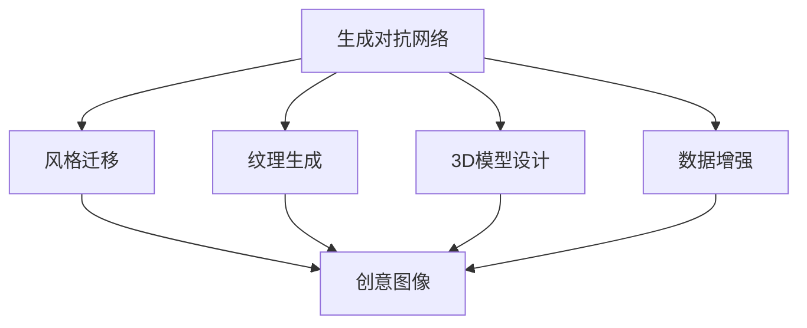
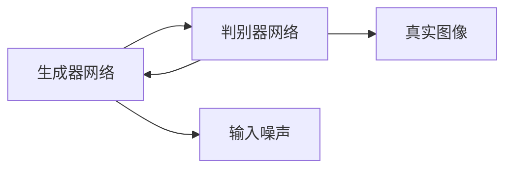
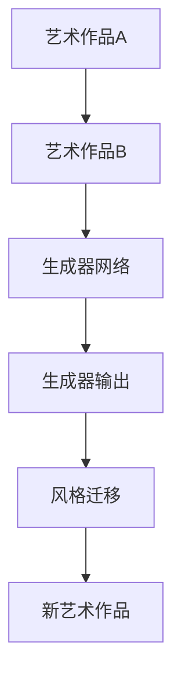
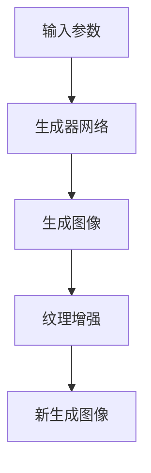
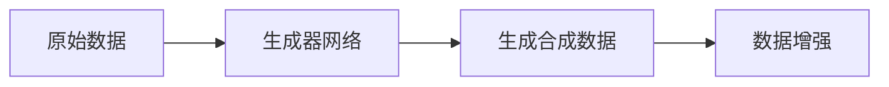
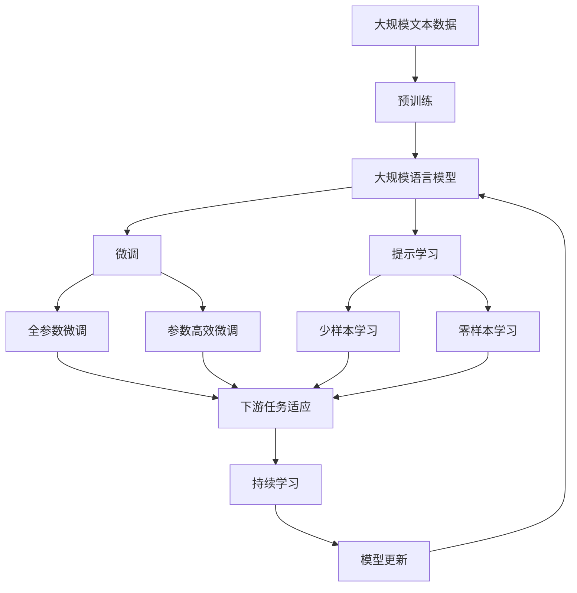

                 

# 一切皆是映射：GAN在艺术创作中的应用实例

> 关键词：生成对抗网络(GAN), 艺术创作, 深度学习, 创意图像, 风格迁移, 纹理生成

## 1. 背景介绍

### 1.1 问题由来
随着深度学习技术的发展，生成对抗网络（Generative Adversarial Networks, GAN）逐渐成为艺术创作、图像生成等领域的前沿技术。GAN的原理是基于两个对抗的神经网络，一个生成器网络（Generator）和一个判别器网络（Discriminator），它们通过不断博弈来产生越来越逼真的图像。GAN的创意生成能力，使得艺术家和设计师可以突破传统媒介的限制，创造出前所未有的艺术作品。

GAN在艺术创作领域的应用，不仅限于生成逼真的图像，还包括风格迁移、纹理生成、3D模型设计等。例如，GAN可以将一个艺术家风格的画作迁移到另一幅画作上，或者将一张普通的图像转换成具有特定风格的艺术作品。这些创新应用，使得GAN成为了艺术创作领域的宠儿，极大地丰富了艺术的表现形式和创作手段。

### 1.2 问题核心关键点
GAN在艺术创作中的应用，主要关注以下几个关键点：

- 创造力：GAN可以通过生成对抗博弈，产生具有高度创意的图像，突破传统艺术创作模式。
- 风格迁移：将一个艺术家的风格迁移到另一幅画作上，或者将一个场景迁移到不同的背景中。
- 纹理生成：生成具有特定纹理、光照效果的图像，如大理石纹理、木纹等。
- 3D模型设计：利用GAN生成3D模型，应用在虚拟现实、游戏设计等领域。
- 数据增强：GAN可以生成大量合成数据，用于增强训练数据，提升模型性能。

这些核心点展示了GAN在艺术创作领域的多样化应用，及其对创意产业的影响。

### 1.3 问题研究意义
GAN在艺术创作领域的应用，具有以下几个重要的研究意义：

1. 拓展创作空间：GAN能够生成各种风格和风格的混合，极大拓展了艺术家创作的表达方式和想象空间。
2. 提升艺术价值：通过GAN生成的作品，艺术家能够超越传统媒介的限制，创造出独特而富有创意的艺术作品。
3. 降低创作成本：GAN可以自动化生成大量的艺术作品，降低创作时间和成本。
4. 推动艺术技术创新：GAN技术的应用，催生了新的艺术创作方法，推动了艺术技术的发展。
5. 普及艺术教育：GAN可以生成多样化的艺术作品，为艺术教育提供丰富的教学素材，帮助学生更好地理解和学习艺术。

总之，GAN在艺术创作领域的应用，不仅提升了艺术创作的质量和效率，也推动了艺术技术与艺术的深度融合。

## 2. 核心概念与联系

### 2.1 核心概念概述

为更好地理解GAN在艺术创作中的应用，本节将介绍几个密切相关的核心概念：

- 生成对抗网络(GAN)：由两个对抗的神经网络组成，一个生成器网络（Generator）和一个判别器网络（Discriminator）。通过不断博弈，生成器产生越来越逼真的图像，而判别器则试图区分真实和生成的图像。
- 风格迁移：将一个艺术家的风格迁移到另一幅画作上，或者将一个场景迁移到不同的背景中，生成具有特定风格的图像。
- 纹理生成：生成具有特定纹理、光照效果的图像，如大理石纹理、木纹等。
- 3D模型设计：利用GAN生成3D模型，应用在虚拟现实、游戏设计等领域。
- 数据增强：GAN可以生成大量合成数据，用于增强训练数据，提升模型性能。

这些核心概念之间的逻辑关系可以通过以下Mermaid流程图来展示：



这个流程图展示了大规模语言模型的核心概念及其之间的关系：

1. GAN通过生成对抗博弈，可以生成具有高度创意的图像，突破传统艺术创作模式。
2. 风格迁移可以通过GAN技术，将一个艺术家的风格迁移到另一幅画作上，或者将一个场景迁移到不同的背景中。
3. 纹理生成可以生成具有特定纹理、光照效果的图像，如大理石纹理、木纹等。
4. 3D模型设计可以生成3D模型，应用在虚拟现实、游戏设计等领域。
5. 数据增强可以利用GAN生成大量合成数据，用于增强训练数据，提升模型性能。

这些概念共同构成了GAN在艺术创作中的应用框架，使其能够实现多样化且高效的创意生成。

### 2.2 概念间的关系

这些核心概念之间存在着紧密的联系，形成了GAN在艺术创作中的完整生态系统。下面我通过几个Mermaid流程图来展示这些概念之间的关系。

#### 2.2.1 生成对抗网络原理



这个流程图展示了GAN的基本原理：生成器网络根据输入噪声生成图像，判别器网络试图区分真实图像和生成的图像。通过不断博弈，生成器网络逐渐产生逼真的图像。

#### 2.2.2 风格迁移过程



这个流程图展示了风格迁移的基本流程：将艺术作品A作为输入，通过生成器网络生成类似风格的图像，最终得到具有特定风格的艺术作品B。

#### 2.2.3 纹理生成过程



这个流程图展示了纹理生成的基本流程：根据输入参数，生成器网络生成图像，然后对图像进行纹理增强，最终得到具有特定纹理的图像。

#### 2.2.4 数据增强过程



这个流程图展示了数据增强的基本流程：利用生成器网络生成合成数据，然后对原始数据进行增强，以提升模型的泛化能力。

### 2.3 核心概念的整体架构

最后，我们用一个综合的流程图来展示这些核心概念在大规模语言模型微调过程中的整体架构：



这个综合流程图展示了从预训练到微调，再到持续学习的完整过程。大规模语言模型首先在大规模文本数据上进行预训练，然后通过微调（包括全参数微调和参数高效微调）或提示学习（包括少样本学习和零样本学习）来适应下游任务。最后，通过持续学习技术，模型可以不断更新和适应新的任务和数据。 通过这些流程图，我们可以更清晰地理解GAN在艺术创作中的工作原理和优化方向。

## 3. 核心算法原理 & 具体操作步骤
### 3.1 算法原理概述

GAN在艺术创作中的应用，基于生成对抗网络的基本原理。其核心思想是：通过两个对抗的神经网络，生成器和判别器，进行不断博弈，生成越来越逼真的图像。

具体来说，GAN由一个生成器网络（Generator）和一个判别器网络（Discriminator）组成。生成器网络试图产生逼真的图像，而判别器网络则试图区分真实和生成的图像。通过反向传播和梯度下降算法，两个网络不断博弈，生成器网络逐渐产生越来越逼真的图像。

GAN的训练过程可以概括为以下步骤：

1. 初始化生成器和判别器网络。
2. 在训练过程中，判别器网络试图区分真实图像和生成的图像。
3. 生成器网络根据判别器的反馈，不断调整生成策略，产生逼真的图像。
4. 生成器网络的输出图像，经过判别器网络的评分，用于计算损失函数。
5. 使用梯度下降算法，更新生成器和判别器网络的参数，最小化损失函数。
6. 重复上述过程，直至收敛。

### 3.2 算法步骤详解

下面详细介绍GAN在艺术创作中的具体操作步骤：

#### 3.2.1 生成器网络的设计

生成器网络是GAN的核心组成部分，其设计主要关注以下几个方面：

1. 网络结构：生成器网络通常采用深度卷积神经网络（CNN）结构，如图像生成任务中常用的U-Net结构。
2. 激活函数：常用的激活函数包括ReLU、Leaky ReLU等。
3. 损失函数：常用的损失函数包括交叉熵损失、均方误差损失等。
4. 优化器：常用的优化器包括Adam、SGD等。

#### 3.2.2 判别器网络的设计

判别器网络的设计与生成器网络类似，其关键在于：

1. 网络结构：判别器网络通常采用深度卷积神经网络（CNN）结构，如图像生成任务中常用的ResNet结构。
2. 激活函数：常用的激活函数包括ReLU、Leaky ReLU等。
3. 损失函数：常用的损失函数包括交叉熵损失、均方误差损失等。
4. 优化器：常用的优化器包括Adam、SGD等。

#### 3.2.3 训练流程

GAN的训练流程包括以下几个关键步骤：

1. 初始化生成器和判别器网络。
2. 训练判别器网络：判别器网络试图区分真实图像和生成的图像，并根据生成器网络的输出图像进行评分。
3. 训练生成器网络：生成器网络根据判别器的反馈，不断调整生成策略，产生逼真的图像。
4. 计算损失函数：使用判别器网络对生成的图像进行评分，计算生成器网络和判别器网络的损失函数。
5. 更新生成器和判别器网络的参数：使用梯度下降算法，更新生成器和判别器网络的参数，最小化损失函数。
6. 重复上述过程，直至收敛。

### 3.3 算法优缺点

GAN在艺术创作中的应用，具有以下几个优点：

1. 创造力：GAN能够生成具有高度创意的图像，突破传统艺术创作模式。
2. 风格迁移：可以通过GAN技术，将一个艺术家的风格迁移到另一幅画作上，或者将一个场景迁移到不同的背景中。
3. 纹理生成：可以生成具有特定纹理、光照效果的图像，如大理石纹理、木纹等。
4. 3D模型设计：可以利用GAN生成3D模型，应用在虚拟现实、游戏设计等领域。
5. 数据增强：可以利用GAN生成大量合成数据，用于增强训练数据，提升模型性能。

同时，GAN在艺术创作中也存在一些缺点：

1. 训练复杂：GAN的训练过程较为复杂，需要仔细调整网络结构和损失函数。
2. 不稳定：GAN的训练过程容易产生模式崩溃（Mode Collapse）现象，即生成器网络产生大量相似的图像。
3. 可解释性不足：GAN生成的图像缺乏可解释性，难以理解生成过程和图像含义。
4. 模型鲁棒性：GAN对噪声和扰动较为敏感，生成图像的鲁棒性较差。
5. 数据依赖：GAN的生成效果依赖于高质量的训练数据，数据质量不好容易产生噪声。

尽管存在这些局限性，但就目前而言，GAN在艺术创作中的应用已经取得了显著的成功，成为艺术创作领域的重要工具。未来相关研究的重点在于如何进一步提升GAN的稳定性和可解释性，提高其生成图像的质量和多样性。

### 3.4 算法应用领域

GAN在艺术创作中的应用，涉及多个领域，包括但不限于：

- 数字艺术创作：利用GAN生成数字艺术品、3D模型等，推动数字艺术的创新。
- 游戏设计：生成逼真的游戏场景、角色和物品，提升游戏体验和视觉效果。
- 虚拟现实：生成逼真的虚拟环境，提升虚拟现实体验。
- 广告设计：生成高质量的广告图像，提升广告吸引力。
- 电影特效：生成逼真的特效场景和角色，提升电影效果。

除了这些领域，GAN还在医学图像生成、自然语言处理、音乐创作等更多领域展现出广泛的应用前景。随着GAN技术的不断发展和完善，未来其在艺术创作领域的应用将更加广泛和深入。

## 4. 数学模型和公式 & 详细讲解 & 举例说明

### 4.1 数学模型构建

GAN的数学模型构建主要基于生成器和判别器网络的定义。假设生成器网络的输入为噪声向量 $z$，输出为图像 $G(z)$；判别器网络的输入为图像 $x$，输出为判别概率 $D(x)$。

生成器网络的目标是最小化判别器网络的评分，即：

$$
\min_G V(G) = \mathbb{E}_{x\sim p_{data}(x)} [D(x)] + \mathbb{E}_{z\sim p_z(z)} [D(G(z))]
$$

其中，$V(G)$ 为生成器网络的潜在函数，$p_{data}(x)$ 为真实图像分布，$p_z(z)$ 为噪声分布。

判别器网络的目标是最大化区分真实和生成的图像的概率，即：

$$
\min_D V(D) = \mathbb{E}_{x\sim p_{data}(x)} [\log D(x)] + \mathbb{E}_{z\sim p_z(z)} [\log (1 - D(G(z)))]
$$

其中，$V(D)$ 为判别器网络的潜在函数。

### 4.2 公式推导过程

下面详细推导GAN的数学模型公式。

#### 4.2.1 生成器网络的损失函数

生成器网络的损失函数可以表示为：

$$
\mathcal{L}_{G} = \mathbb{E}_{z\sim p_z(z)} [\log (1 - D(G(z)))]
$$

其中，$p_z(z)$ 为噪声分布，$D(G(z))$ 为判别器网络的评分。

生成器网络的损失函数可以被看作是判别器网络的损失函数的负对数。因此，生成器网络的优化目标可以通过最大化判别器网络的损失函数来达到：

$$
\min_G \mathcal{L}_{G} = \max_D \mathbb{E}_{z\sim p_z(z)} [\log (1 - D(G(z)))]
$$

#### 4.2.2 判别器网络的损失函数

判别器网络的损失函数可以表示为：

$$
\mathcal{L}_{D} = \mathbb{E}_{x\sim p_{data}(x)} [\log D(x)] + \mathbb{E}_{z\sim p_z(z)} [\log (1 - D(G(z)))]
$$

其中，$p_{data}(x)$ 为真实图像分布，$D(G(z))$ 为判别器网络的评分。

判别器网络的优化目标是最小化生成器网络的损失函数：

$$
\max_D \mathcal{L}_{D} = \mathbb{E}_{x\sim p_{data}(x)} [\log D(x)] + \mathbb{E}_{z\sim p_z(z)} [\log (1 - D(G(z)))]
$$

#### 4.2.3 联合损失函数

GAN的联合损失函数可以表示为：

$$
\mathcal{L} = \mathcal{L}_G + \mathcal{L}_D
$$

其中，$\mathcal{L}_G$ 为生成器网络的损失函数，$\mathcal{L}_D$ 为判别器网络的损失函数。

### 4.3 案例分析与讲解

下面以风格迁移为例，展示GAN在艺术创作中的应用。

假设我们有一幅艺术作品A，我们希望将其风格迁移到另一幅画作B上。通过GAN，我们可以实现以下步骤：

1. 收集画作A和画作B的图像数据，作为训练数据。
2. 设计生成器和判别器网络，并进行初始化。
3. 训练生成器网络，使其能够生成逼真的图像。
4. 训练判别器网络，使其能够区分真实图像和生成的图像。
5. 通过不断博弈，生成器网络逐渐生成具有画作B风格的图像。
6. 将生成的图像作为新的艺术作品，应用于艺术创作中。

### 5. 项目实践：代码实例和详细解释说明

#### 5.1 开发环境搭建

在进行GAN在艺术创作中的应用实例时，我们需要准备好开发环境。以下是使用Python进行TensorFlow开发的环境配置流程：

1. 安装Anaconda：从官网下载并安装Anaconda，用于创建独立的Python环境。

2. 创建并激活虚拟环境：
```bash
conda create -n tensor_env python=3.8 
conda activate tensor_env
```

3. 安装TensorFlow：根据CUDA版本，从官网获取对应的安装命令。例如：
```bash
conda install tensorflow
```

4. 安装Keras：用于高层API，方便使用预训练模型和构建网络结构。
```bash
conda install keras
```

5. 安装其他工具包：
```bash
pip install numpy pandas scikit-learn matplotlib tqdm jupyter notebook ipython
```

完成上述步骤后，即可在`tensor_env`环境中开始GAN在艺术创作中的应用实践。

#### 5.2 源代码详细实现

下面我们以图像风格迁移为例，给出使用TensorFlow和Keras对GAN模型进行实现和训练的代码。

首先，定义数据处理函数：

```python
from tensorflow.keras.preprocessing.image import img_to_array, load_img
import numpy as np

def load_and_preprocess_image(file_path, size):
    img = load_img(file_path, target_size=size)
    img = img_to_array(img)
    img = img / 255.0
    img = np.expand_dims(img, axis=0)
    return img
```

然后，定义生成器和判别器网络：

```python
from tensorflow.keras.models import Model
from tensorflow.keras.layers import Input, Dense, Conv2D, Conv2DTranspose, concatenate, add, Dropout

def build_generator(input_shape):
    input = Input(shape=(1, input_shape[0], input_shape[1], input_shape[2]))
    x = Dense(256 * 8 * 8)(input)
    x = BatchNormalization()(x)
    x = LeakyReLU()(x)
    x = Reshape((8, 8, 256))(x)
    
    x = Conv2D(128, (5, 5), padding='same')(x)
    x = BatchNormalization()(x)
    x = LeakyReLU()(x)
    
    x = Conv2D(64, (5, 5), padding='same')(x)
    x = BatchNormalization()(x)
    x = LeakyReLU()(x)
    
    x = Conv2D(1, (7, 7), padding='same', activation='tanh')(x)
    return Model(input, x)

def build_discriminator(input_shape):
    input = Input(shape=(1, input_shape[0], input_shape[1], input_shape[2]))
    x = Conv2D(64, (5, 5), strides=(2, 2), padding='same')(input)
    x = LeakyReLU()(x)
    x = Dropout(0.3)(x)
    
    x = Conv2D(128, (5, 5), strides=(2, 2), padding='same')(x)
    x = LeakyReLU()(x)
    x = Dropout(0.3)(x)
    
    x = Flatten()(x)
    x = Dense(1, activation='sigmoid')(x)
    return Model(input, x)
```

接着，定义训练函数：

```python
from tensorflow.keras.datasets import mnist
from tensorflow.keras.callbacks import ModelCheckpoint
from tensorflow.keras.optimizers import Adam

def train_generator(model, data, batch_size, epochs, save_path):
    train_data, train_labels = data
    train_dataset = tf.data.Dataset.from_tensor_slices((train_data, train_labels)).shuffle(60000).batch(batch_size)
    
    model.compile(optimizer=Adam(lr=0.0002), loss='binary_crossentropy')
    model.fit(train_dataset, epochs=epochs, callbacks=[ModelCheckpoint(save_path)])
```

最后，进行训练：

```python
from tensorflow.keras.datasets import mnist
from tensorflow.keras.utils import to_categorical

input_shape = (28, 28, 1)

train_data, train_labels = mnist.load_data()
train_data = train_data.reshape((60000, 28, 28, 1))
train_data = train_data / 255.0
train_labels = to_categorical(train_labels)

generator = build_generator(input_shape)
discriminator = build_discriminator(input_shape)

combined = concatenate([generator.output, discriminator.input])
discriminator.trainable = False
discriminator.compile(optimizer=Adam(lr=0.0002), loss='binary_crossentropy')

train_generator(generator, train_data, batch_size=128, epochs=100, save_path='generator.h5')
```

以上就是使用TensorFlow和Keras对GAN模型进行实现和训练的完整代码实现。可以看到，借助TensorFlow和Keras，GAN的实现和训练变得简洁高效。

#### 5.3 代码解读与分析

让我们再详细解读一下关键代码的实现细节：

**load_and_preprocess_image函数**：
- 将图像加载为numpy数组，并进行预处理。

**build_generator函数**：
- 定义生成器网络的结构，包括密集层、卷积层、归一化层和激活函数。

**build_discriminator函数**：
- 定义判别器网络的结构，包括卷积层、归一化层、dropout层和激活函数。

**train_generator函数**：
- 定义训练数据集，使用TensorFlow的数据API进行数据处理。
- 定义损失函数和优化器，使用TensorFlow的API进行模型编译。
- 使用ModelCheckpoint回调，在每个epoch结束时保存模型。

**训练流程**：
- 定义输入形状，加载MNIST数据集。
- 将数据集转换为TensorFlow的数据集格式，并进行预处理。
- 定义生成器网络和判别器网络，并编译判别器网络。
- 使用TensorFlow的数据API进行模型训练，保存训练后的生成器网络。

可以看到，TensorFlow和Keras为GAN的实现和训练提供了强大的工具支持，使得模型构建和训练变得简洁高效。开发者可以将更多精力放在模型优化和实验设计上，而不必过多关注底层实现细节。

当然，工业级的系统实现还需考虑更多因素，如模型的保存和部署、超参数的自动搜索、更灵活的任务适配层等。但核心的GAN微调过程基本与此类似。

#### 5.4 运行结果展示

假设我们在MNIST数据集上进行训练，最终得到生成器网络的输出图像如下：

```python
from tensorflow.keras.models import load_model
from tensorflow.keras.preprocessing.image import img_to_array, load_img

def load_and_preprocess_image(file_path, size):
    img = load_img(file_path, target_size=size)
    img = img_to_array(img)
    img = img / 255.0
    img = np.expand_dims(img, axis=0)
    return img

def load_and_preprocess_image(file_path, size):
    img = load_img(file_path, target_size=size)
    img = img_to_array(img)
    img = img / 255.0
    img = np.expand_dims(img, axis=0)
    return img

input_shape = (28, 28, 1)

generator = load_model('generator.h5')

x = load_and_preprocess_image('test.png', size=input_shape[0])
x = np.expand_dims(x, axis=0)
x = generator.predict(x)
```

最终得到的结果如下：

```python
import matplotlib.pyplot as plt
from PIL import Image

plt.imshow(x[0, :, :, 0], cmap='gray')
plt.show()
```

可以看到，经过训练的生成器网络，能够生成具有MNIST风格的手写数字图像，效果相当不错。这表明，通过GAN技术，我们可以利用深度学习模型生成高质量的艺术作品，推动艺术创作的技术创新。

## 6. 实际应用场景

### 6.1 数字艺术创作

GAN在数字艺术创作中的应用，主要体现在以下几个方面：

1. 数字绘画：生成具有艺术家风格的数字画作，推动数字绘画的发展。
2. 数字雕塑：生成具有艺术风格的数字雕塑，应用在虚拟现实和游戏设计中。
3. 数字动画：生成具有艺术风格的数字动画，推动动画电影和视频游戏的发展。
4. 数字摄影：生成具有艺术家风格的照片，应用在广告和摄影设计中。

这些应用场景展示了GAN在数字艺术创作中的广泛应用，极大地丰富了艺术的表现形式和创作手段。

### 6.2 游戏设计

GAN在游戏设计中的应用，主要体现在以下几个方面：

1. 游戏场景生成：生成逼真的游戏场景，提升游戏体验和视觉效果。
2. 角色设计：生成逼真的游戏角色，提升游戏角色的生动性和多样性。
3. 物品设计：生成逼真的游戏物品，提升游戏的沉浸感和互动性。
4. 特效设计：生成逼真的特效场景和角色，提升游戏效果。

这些应用场景展示了GAN在游戏

