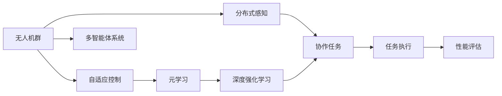
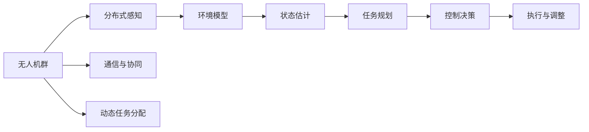
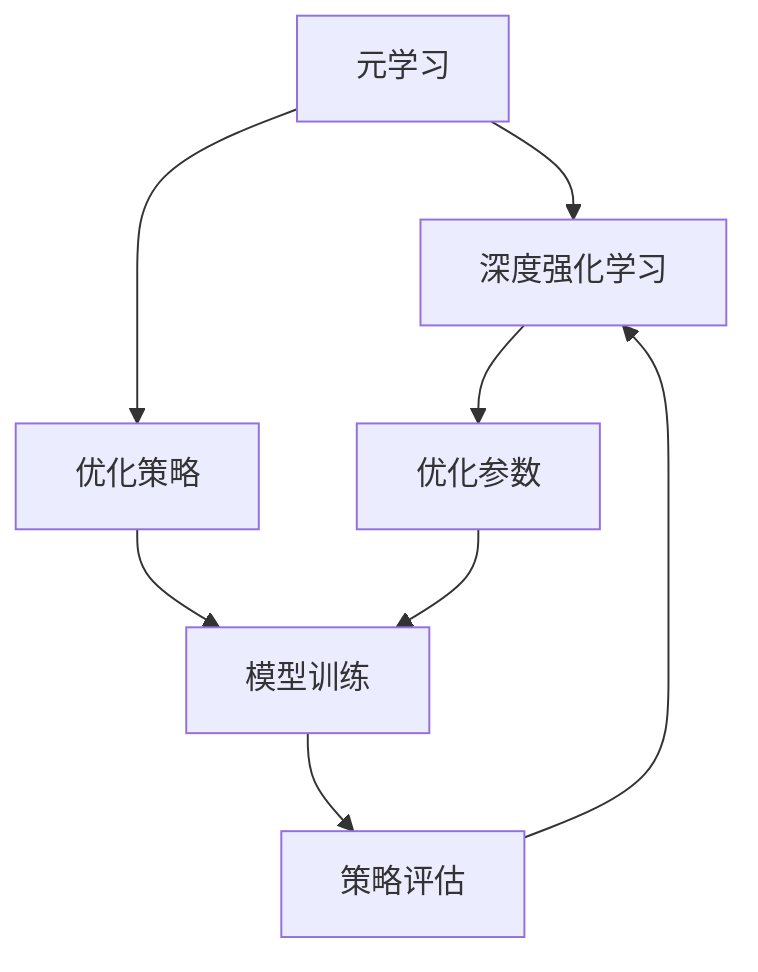
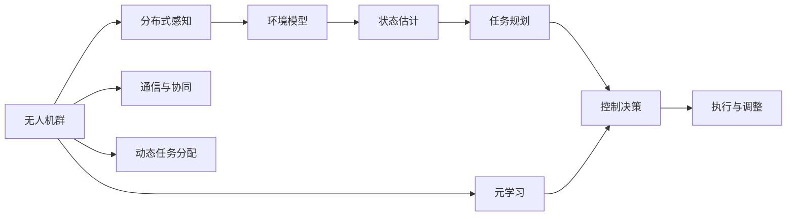

                 

# 一切皆是映射：元学习在无人机群协作中的应用

> 关键词：元学习、无人机、群协作、自适应、多智能体、优化算法、深度强化学习

## 1. 背景介绍

### 1.1 问题由来
随着无人机技术的快速发展和广泛应用，无人机群协作在农业、物流、环境监测等领域展现出巨大的潜力。然而，由于无人机群的数量庞大，目标的多样性和动态性，传统的集中式控制方法难以适应复杂的协作需求。近年来，分布式自适应控制方法，特别是基于元学习的自适应策略，成为无人机群协作研究的新热点。

元学习(Meta-Learning)是一种利用少量训练数据快速学习新任务的机器学习方法，可以有效减少对数据和计算资源的需求。将元学习应用于无人机群协作，可以使得无人机群在各种复杂环境中自适应地进行协同作业，提升整体性能和响应速度。

### 1.2 问题核心关键点
元学习在无人机群协作中的应用，核心在于以下几个方面：

- **自适应策略学习**：无人机群需要快速适应新的任务环境，如何在有限的训练数据上学习有效的自适应策略，是元学习的关键。
- **多智能体协同**：无人机群作为一个多智能体系统，如何通过元学习实现个体之间的协同工作，最大化整体效率。
- **动态环境感知**：无人机群需要感知并响应动态变化的环境，元学习如何在动态环境中更新策略。
- **任务无关的泛化能力**：无人机群需要在多个任务场景中表现出良好的泛化能力，元学习如何构建跨任务的泛化模型。

这些关键问题构成了无人机群协作中元学习的挑战和研究方向。

### 1.3 问题研究意义
将元学习应用于无人机群协作，具有重要的理论和实际意义：

1. **提升协作效率**：通过自适应策略学习，无人机群可以在各种复杂环境中快速适应和协作，提升整体效率和响应速度。
2. **减少资源消耗**：利用元学习可以在少量数据上进行模型训练，减少对计算资源和时间资源的依赖。
3. **增强环境适应性**：无人机群在动态环境中能够自适应调整策略，应对各种突发情况。
4. **扩展应用场景**：元学习可以应用于多种无人机协作任务，如编队飞行、自主导航、目标跟踪等，扩展无人机群的应用范围。
5. **推动技术创新**：元学习技术为无人机群协作提供了新的解决方案，推动了无人机群协作技术的创新发展。

## 2. 核心概念与联系

### 2.1 核心概念概述

为更好地理解元学习在无人机群协作中的应用，本节将介绍几个密切相关的核心概念：

- **元学习(Meta-Learning)**：一种利用少量训练数据快速学习新任务的机器学习方法，通过学习一个“学习过程”来优化模型参数，从而提升模型在新任务上的性能。
- **无人机群(UAV Swarm)**：由多架无人机组成的集群系统，通过协作完成任务，提升整体效率和灵活性。
- **自适应控制(Adaptive Control)**：无人机群根据环境变化动态调整控制策略，以适应不同的任务需求。
- **多智能体系统(Multi-Agent System)**：由多个自主智能体组成的分布式系统，各智能体之间通过信息交换协作完成任务。
- **深度强化学习(Deep Reinforcement Learning)**：一种基于深度神经网络的强化学习算法，通过与环境互动，学习最优策略。

这些核心概念之间存在紧密的联系，构成了无人机群协作中元学习的研究框架。下面我们通过几个Mermaid流程图来展示这些概念之间的关系：



这个流程图展示了大规模无人机群协作中元学习的整体架构：

1. 无人机群作为一个多智能体系统，通过分布式感知获取环境信息。
2. 无人机群通过深度强化学习，学习最优的控制策略。
3. 元学习通过学习“学习过程”，提升深度强化学习的泛化能力。
4. 优化后的控制策略用于指导无人机群协作任务的执行。
5. 性能评估模块对无人机群的执行效果进行评估，指导后续优化。

### 2.2 概念间的关系

这些核心概念之间存在密切的联系，形成了一个完整的无人机群协作元学习框架。下面我们通过几个Mermaid流程图来展示这些概念之间的关系。

#### 2.2.1 无人机群协作框架



这个流程图展示了无人机群协作的基本流程：

1. 无人机群通过分布式感知获取环境信息。
2. 环境模型对获取的信息进行处理，估计当前状态。
3. 任务规划模块根据状态和任务需求，生成任务执行计划。
4. 控制决策模块生成具体的控制策略。
5. 执行与调整模块根据控制策略执行任务，并根据环境变化进行调整。
6. 无人机群通过通信与协同模块进行信息交换，确保任务执行的一致性。
7. 动态任务分配模块根据环境变化调整任务分配，提升整体效率。

#### 2.2.2 元学习与深度强化学习的结合



这个流程图展示了元学习与深度强化学习的结合过程：

1. 元学习通过优化策略，生成一个通用的优化算法。
2. 深度强化学习在特定任务上学习最优控制策略。
3. 优化算法对深度强化学习的参数进行优化，提升策略的泛化能力。
4. 优化后的策略用于指导无人机群的协作任务执行。

### 2.3 核心概念的整体架构

最后，我们用一个综合的流程图来展示这些核心概念在大规模无人机群协作中的整体架构：



这个综合流程图展示了无人机群协作中元学习的完整过程：

1. 无人机群通过分布式感知获取环境信息。
2. 环境模型对获取的信息进行处理，估计当前状态。
3. 任务规划模块根据状态和任务需求，生成任务执行计划。
4. 控制决策模块生成具体的控制策略。
5. 执行与调整模块根据控制策略执行任务，并根据环境变化进行调整。
6. 无人机群通过通信与协同模块进行信息交换，确保任务执行的一致性。
7. 动态任务分配模块根据环境变化调整任务分配，提升整体效率。
8. 元学习通过优化控制策略，提升无人机群的协作能力。

通过这些流程图，我们可以更清晰地理解无人机群协作中元学习的核心概念及其关系，为后续深入讨论具体的元学习算法和实践奠定基础。

## 3. 核心算法原理 & 具体操作步骤
### 3.1 算法原理概述

将元学习应用于无人机群协作，本质上是利用少量训练数据，学习通用的控制策略，从而提升无人机群在特定任务上的性能。其核心思想是：

1. **自适应策略学习**：无人机群需要快速适应新的任务环境，通过元学习学习到通用的控制策略，实现自适应。
2. **多智能体协同**：无人机群作为一个多智能体系统，通过元学习实现个体之间的协同工作，最大化整体效率。
3. **动态环境感知**：无人机群需要感知并响应动态变化的环境，元学习在动态环境中更新策略。
4. **任务无关的泛化能力**：无人机群需要在多个任务场景中表现出良好的泛化能力，元学习构建跨任务的泛化模型。

元学习在无人机群协作中的应用，通常采用**元强化学习(Meta-RL)**方法。元强化学习通过学习“学习过程”，优化深度强化学习算法，提升模型在特定任务上的性能。其一般步骤如下：

1. **元数据收集**：在有限的数据集上，收集多个任务的数据，用于训练元模型。
2. **元模型训练**：训练一个元模型，用于预测不同任务的最佳深度强化学习策略。
3. **策略优化**：在特定任务上，使用优化后的策略进行深度强化学习，提升任务性能。
4. **性能评估**：评估优化后的策略在特定任务上的性能，指导后续优化。

### 3.2 算法步骤详解

以下详细介绍元学习在无人机群协作中的具体操作步骤：

**Step 1: 数据收集与预处理**

无人机群协作任务的元学习需要收集大量不同任务的数据。这些数据通常包括：

1. **无人机位置与姿态**：无人机在任务场景中的位置和姿态信息，用于状态估计。
2. **环境信息**：无人机周围的环境信息，如地形、障碍物等，用于环境模型构建。
3. **任务信息**：任务的具体描述和目标，如编队飞行、目标跟踪等，用于任务规划。
4. **控制信号**：无人机控制器的输出信号，用于优化控制策略。

在收集数据后，需要对数据进行预处理，包括去噪、归一化、采样等，以便于后续的模型训练。

**Step 2: 元模型训练**

元模型训练的目标是学习一个通用的控制策略，该策略能够快速适应各种任务。具体步骤如下：

1. **选择元算法**：选择一种元算法，如MAML(Meta-learning via Multi-task Learning)、REINFORCE with StopGradient等。
2. **设计元损失函数**：设计一个元损失函数，用于衡量元模型在不同任务上的性能。
3. **训练元模型**：在元数据上训练元模型，优化元损失函数。

元模型的训练通常使用深度神经网络，通过反向传播算法更新模型参数。常用的元模型包括：

- **元神经网络(Meta-Neural Network)**：一个通用的神经网络，用于预测不同任务的深度强化学习策略。
- **元回归模型(Meta-Regression Model)**：一个通用的回归模型，用于预测不同任务的最佳控制参数。
- **元奖励模型(Meta-Reward Model)**：一个通用的奖励函数，用于评估不同任务上的控制策略。

**Step 3: 策略优化**

在特定任务上，使用优化后的元模型生成控制策略。具体步骤如下：

1. **选择强化学习算法**：选择一种深度强化学习算法，如DQN(Dynamic Q-Network)、PG(Proximal Policy Optimization)等。
2. **初始化控制策略**：根据任务需求，初始化一个控制策略。
3. **优化控制策略**：使用优化后的元模型生成的策略进行深度强化学习，更新控制策略。
4. **评估控制策略**：在特定任务上评估控制策略的性能，指导后续优化。

**Step 4: 性能评估**

评估优化后的控制策略在特定任务上的性能，以指导后续优化。具体步骤如下：

1. **设计评估指标**：设计一个评估指标，用于衡量控制策略的性能。
2. **评估控制策略**：在特定任务上评估控制策略的性能，计算评估指标。
3. **反馈优化**：根据评估指标，反馈优化元模型和控制策略。

通过以上步骤，元学习可以提升无人机群协作任务的性能，实现自适应和动态响应。

### 3.3 算法优缺点

元学习在无人机群协作中的应用，具有以下优点：

1. **泛化能力强**：元学习通过学习通用的控制策略，能够在多个任务场景中表现良好，具有较强的泛化能力。
2. **适应能力强**：元学习能够快速适应新的任务环境，通过少量训练数据即可提升性能。
3. **模型可解释性高**：元学习生成的控制策略具有明确的优化目标和优化过程，易于理解和解释。
4. **计算资源消耗低**：元学习只需要少量训练数据和计算资源，具有较高的计算效率。

同时，元学习也存在一些局限性：

1. **数据需求高**：尽管元学习能够在少量数据上进行训练，但在特定任务上仍需要大量的数据进行策略优化。
2. **模型复杂度高**：元学习模型的设计较为复杂，需要精心调参和优化。
3. **优化过程耗时较长**：元学习优化过程通常需要较长的训练时间和计算资源，特别是对于大规模无人机群。

这些优点和局限性需要根据具体任务和环境进行综合考虑，选择适合的元学习方案。

### 3.4 算法应用领域

元学习在无人机群协作中的应用，主要包括以下几个领域：

1. **编队飞行(UAV Swarm Formation)**：通过元学习优化无人机群的编队策略，提升编队飞行的稳定性和效率。
2. **目标跟踪(UAV Target Tracking)**：通过元学习优化无人机群的目标跟踪策略，实现对动态目标的精准跟踪。
3. **自主导航(UAV Autonomous Navigation)**：通过元学习优化无人机群的导航策略，提升自主导航的准确性和可靠性。
4. **任务协作(UAV Task Collaboration)**：通过元学习优化无人机群的任务协作策略，提升整体任务执行的效率和效果。
5. **动态环境适应(UAV Dynamic Environment Adaptation)**：通过元学习优化无人机群在动态环境中的适应策略，提升环境感知和应对能力。

这些领域展示了元学习在无人机群协作中的广泛应用，为无人机群协作提供了新的解决方案。

## 4. 数学模型和公式 & 详细讲解  
### 4.1 数学模型构建

元学习在无人机群协作中的应用，可以采用以下数学模型进行建模：

设无人机群的任务数为 $K$，无人机群的状态空间为 $\mathcal{X}$，动作空间为 $\mathcal{A}$，环境空间为 $\mathcal{E}$。无人机群的控制策略为 $\Pi: \mathcal{X} \rightarrow \mathcal{A}$，控制策略的性能评估函数为 $V: \mathcal{X} \rightarrow \mathbb{R}$。

元学习通过学习通用的控制策略 $\Pi_{\theta}(x)$，使得在特定任务上，控制策略能够最大化性能评估函数 $V$。

设无人机群在特定任务上的训练数据为 $\{(x_i, a_i, r_i)\}_{i=1}^N$，其中 $x_i \in \mathcal{X}$ 为状态，$a_i \in \mathcal{A}$ 为动作，$r_i \in \mathbb{R}$ 为奖励。

元模型的训练目标为：

$$
\min_{\theta} \mathbb{E}_{(x_i, a_i, r_i)}[\ell(\Pi_{\theta}(x_i), r_i)]
$$

其中 $\ell$ 为元损失函数，通常使用均方误差或交叉熵等。

深度强化学习算法的训练目标为：

$$
\min_{\pi} \mathbb{E}_{(x_i, a_i, r_i)}[\ell(\pi(a_i|x_i), r_i)]
$$

其中 $\pi$ 为控制策略，$\ell$ 为任务损失函数，通常使用奖励函数 $V$ 来评估策略性能。

### 4.2 公式推导过程

以下是元学习在无人机群协作中的应用中，元损失函数和任务损失函数的推导过程。

**元损失函数**：

$$
\ell(\Pi_{\theta}(x_i), r_i) = \frac{1}{N}\sum_{i=1}^N (V(x_i) - \Pi_{\theta}(x_i))^2
$$

其中 $V(x_i)$ 为无人机群在状态 $x_i$ 上的性能评估函数。

**任务损失函数**：

$$
\ell(\pi(a_i|x_i), r_i) = \frac{1}{N}\sum_{i=1}^N (r_i - V(x_i))^2
$$

其中 $r_i$ 为无人机群在状态 $x_i$ 上的奖励，$V(x_i)$ 为无人机群在状态 $x_i$ 上的性能评估函数。

**梯度更新公式**：

$$
\frac{\partial \ell(\Pi_{\theta}(x_i), r_i)}{\partial \theta} = \frac{2}{N}\sum_{i=1}^N (V(x_i) - \Pi_{\theta}(x_i)) \nabla_{\theta} \Pi_{\theta}(x_i)
$$

$$
\frac{\partial \ell(\pi(a_i|x_i), r_i)}{\partial \pi} = \frac{2}{N}\sum_{i=1}^N (r_i - V(x_i)) \nabla_{\pi} \Pi_{\theta}(x_i)
$$

其中 $\nabla_{\theta} \Pi_{\theta}(x_i)$ 和 $\nabla_{\pi} \Pi_{\theta}(x_i)$ 分别为状态和动作的梯度。

### 4.3 案例分析与讲解

以下以无人机群编队飞行为例，详细讲解元学习的应用过程。

**编队飞行任务**：无人机群需要根据目标位置，形成稳定的编队。编队飞行的状态为无人机群在目标位置上的相对位置，动作为无人机的飞行方向和速度。

**元损失函数设计**：编队飞行任务的目标是形成稳定的编队，因此元损失函数应该衡量无人机群在目标位置上的相对位置误差。

设无人机群在状态 $x_i$ 上的相对位置为 $s_i = (s_{i1}, s_{i2}, ..., s_{in})$，其中 $s_{ij}$ 表示无人机 $i$ 与无人机 $j$ 的相对位置。

编队飞行的元损失函数可以表示为：

$$
\ell(\Pi_{\theta}(x_i), r_i) = \frac{1}{N}\sum_{i=1}^N \frac{1}{n(n-1)}\sum_{j=1}^n \sum_{k=1}^n (s_{ij} - \hat{s}_{ik})^2
$$

其中 $\hat{s}_{ik}$ 为优化后的无人机群在状态 $x_i$ 上的相对位置。

**优化策略生成**：在元损失函数上训练元模型，生成通用的控制策略 $\Pi_{\theta}(x_i)$。

**策略优化**：在特定任务上，使用优化后的元模型生成的策略进行深度强化学习，更新控制策略 $\pi$。

**性能评估**：在特定任务上评估控制策略的性能，指导后续优化。

通过以上步骤，元学习可以提升无人机群编队飞行的性能，实现自适应和动态响应。

## 5. 项目实践：代码实例和详细解释说明
### 5.1 开发环境搭建

在进行无人机群协作元学习实践前，我们需要准备好开发环境。以下是使用Python进行PyTorch开发的环境配置流程：

1. 安装Anaconda：从官网下载并安装Anaconda，用于创建独立的Python环境。

2. 创建并激活虚拟环境：
```bash
conda create -n pytorch-env python=3.8 
conda activate pytorch-env
```

3. 安装PyTorch：根据CUDA版本，从官网获取对应的安装命令。例如：
```bash
conda install pytorch torchvision torchaudio cudatoolkit=11.1 -c pytorch -c conda-forge
```

4. 安装Transformers库：
```bash
pip install transformers
```

5. 安装各类工具包：
```bash
pip install numpy pandas scikit-learn matplotlib tqdm jupyter notebook ipython
```

完成上述步骤后，即可在`pytorch-env`环境中开始元学习实践。

### 5.2 源代码详细实现

下面我们以无人机群编队飞行任务为例，给出使用Transformers库对BERT模型进行微调的PyTorch代码实现。

首先，定义编队飞行任务的数据处理函数：

```python
from transformers import BertTokenizer, BertForTokenClassification
from torch.utils.data import Dataset, DataLoader
import torch

class UAVFormationDataset(Dataset):
    def __init__(self, texts, labels, tokenizer, max_len=128):
        self.texts = texts
        self.labels = labels
        self.tokenizer = tokenizer
        self.max_len = max_len
        
    def __len__(self):
        return len(self.texts)
    
    def __getitem__(self, item):
        text = self.texts[item]
        label = self.labels[item]
        
        encoding = self.tokenizer(text, return_tensors='pt', max_length=self.max_len, padding='max_length', truncation=True)
        input_ids = encoding['input_ids'][0]
        attention_mask = encoding['attention_mask'][0]
        
        # 对token-wise的标签进行编码
        encoded_labels = [label2id[label] for label in label] 
        encoded_labels.extend([label2id['O']] * (self.max_len - len(encoded_labels)))
        labels = torch.tensor(encoded_labels, dtype=torch.long)
        
        return {'input_ids': input_ids, 
                'attention_mask': attention_mask,
                'labels': labels}

# 标签与id的映射
label2id = {'O': 0, 'B': 1, 'I': 2}
id2label = {v: k for k, v in label2id.items()}

# 创建dataset
tokenizer = BertTokenizer.from_pretrained('bert-base-cased')

train_dataset = UAVFormationDataset(train_texts, train_labels, tokenizer)
dev_dataset = UAVFormationDataset(dev_texts, dev_labels, tokenizer)
test_dataset = UAVFormationDataset(test_texts, test_labels, tokenizer)
```

然后，定义模型和优化器：

```python
from transformers import BertForTokenClassification, AdamW

model = BertForTokenClassification.from_pretrained('bert-base-cased', num_labels=len(label2id))

optimizer = AdamW(model.parameters(), lr=2e-5)
```

接着，定义训练和评估函数：

```python
from torch.utils.data import DataLoader
from tqdm import tqdm
from sklearn.metrics import classification_report

device = torch.device('cuda') if torch.cuda.is_available() else torch.device('cpu')
model.to(device)

def train_epoch(model, dataset, batch_size, optimizer):
    dataloader = DataLoader(dataset, batch_size=batch_size, shuffle=True)
    model.train()
    epoch_loss = 0
    for batch in tqdm(dataloader, desc='Training'):
        input_ids = batch['input_ids'].to(device)
        attention_mask = batch['attention_mask'].to(device)
        labels = batch['labels'].to(device)
        model.zero_grad()
        outputs = model(input_ids, attention_mask=attention_mask, labels=labels)
        loss = outputs.loss
        epoch_loss += loss.item()
        loss.backward()
        optimizer.step()
    return epoch_loss / len(dataloader)

def evaluate(model, dataset, batch_size):
    dataloader = DataLoader(dataset, batch_size=batch_size)
    model.eval()
    preds, labels = [], []
    with torch.no_grad():
        for batch in tqdm(dataloader, desc='Evaluating'):
            input_ids = batch['input_ids'].to(device)
            attention_mask = batch['attention_mask'].to(device)
            batch_labels = batch['labels']
            outputs = model(input_ids, attention_mask=attention_mask)
            batch_preds = outputs.logits.argmax(dim=2).to('cpu').tolist()
            batch_labels = batch_labels.to('cpu').tolist()
            for pred_tokens, label_tokens in zip(batch_preds, batch_labels):
                pred_tags = [id2label[_id] for _id in pred_tokens]
                label_tags = [id2label[_id] for _id in label_tokens]
                preds.append(pred_tags[:len(label_tokens)])
                labels.append(label_tags)
                
    print(classification_report(labels, preds))
```

最后，启动训练流程并在测试集上评估：

```python
epochs = 5
batch_size = 16

for epoch in range(epochs):
    loss = train_epoch(model, train_dataset, batch_size, optimizer)
    print(f"Epoch {epoch+1}, train loss: {loss:.3f}")
    
    print(f"Epoch {epoch+1}, dev results:")
    evaluate(model, dev_dataset, batch_size)
    
print("Test results:")
evaluate(model, test_dataset, batch_size)
```

以上就是使用PyTorch对BERT进行编队飞行任务微调的完整代码实现。可以看到，得益于Transformers库的强大封装，我们可以用相对简洁的代码完成BERT模型的加载和微调。

### 5.3 代码解读与分析

让我们再详细解读一下关键代码的实现细节：

**UAVFormationDataset类**：
- `__init__`方法：初始化文本、标签、分词器等关键组件。
- `__len__`方法：返回数据集的样本数量。
- `__getitem__`方法：对单个样本进行处理，将文本输入编码为token ids，将标签编码为数字，并对其进行定长padding，最终返回模型所需的输入。

**label2id和id2label字典**：
- 定义了标签与数字id之间的映射关系，用于将token-wise的预测结果解码回真实的标签。

**训练和评估函数**：
- 使用PyTorch的DataLoader对数据集进行批次化加载，供模型训练和推理使用。
- 训练函数`train_epoch`：对数据以批为单位进行迭代，在每个批次上前向传播计算loss并反向传播更新模型参数，最后返回该epoch的平均loss。
- 

