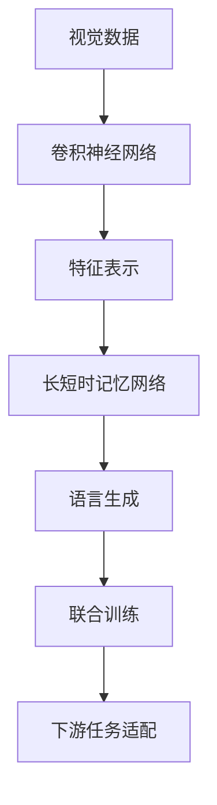
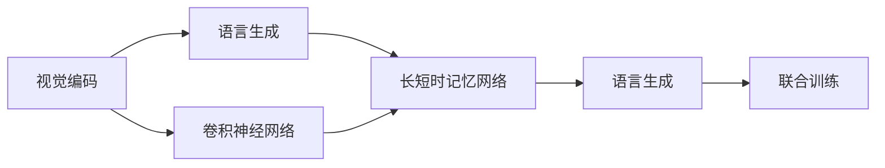
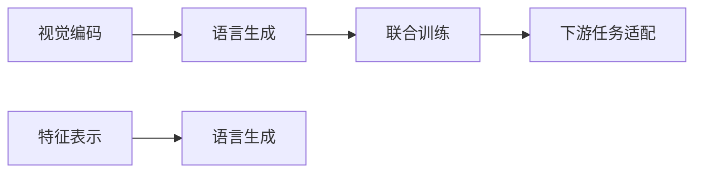
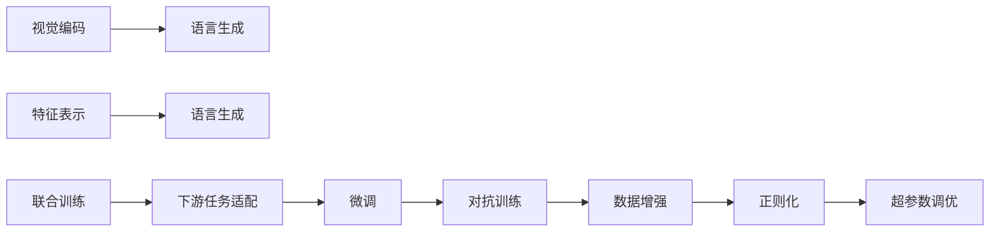
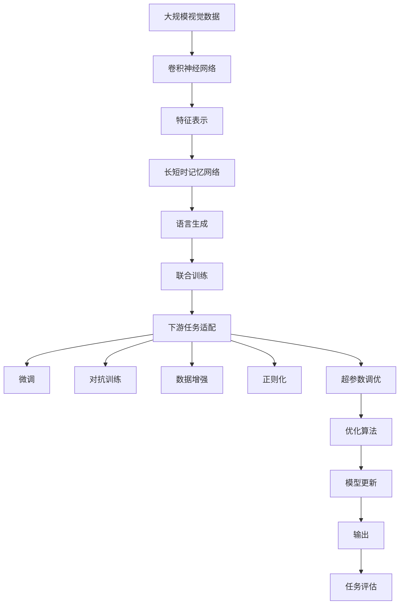

                 

## 1. 背景介绍

### 1.1 问题由来
机器视觉（Computer Vision, CV）作为人工智能（AI）领域的重要分支，旨在赋予计算机"看"的能力，通过图像、视频等视觉信息进行识别、分类、检测、分割等任务。近年来，随着深度学习技术的突破，神经网络成为了机器视觉领域的主流方法，尤其是卷积神经网络（Convolutional Neural Networks, CNNs），其出色的空间特征提取能力使其在图像分类、目标检测等任务上取得了显著的进展。

然而，传统的机器视觉方法往往将视觉数据视为静态的、二维的，难以充分挖掘其中的语义信息。为了提升机器视觉的智能化水平，研究者们开始尝试将神经网络与自然语言处理（Natural Language Processing, NLP）进行结合，构建更为强大的视觉-语言（Vision-Language, VL）模型，从而实现视觉和语言的互动与融合。

### 1.2 问题核心关键点
机器视觉与神经网络的结合应用，本质上是一种"视觉到语言"的映射过程。它将高维的视觉信息映射为自然语言描述，利用语言知识辅助视觉理解的提升。这一过程大致可以分为以下几个关键步骤：

1. **视觉编码**：使用神经网络对视觉图像进行编码，提取图像的特征表示。
2. **语言生成**：通过解码器生成自然语言描述，将图像信息映射为文本。
3. **联合训练**：将视觉编码和语言生成两个过程联合训练，实现视觉-语言的相互增强。
4. **下游任务适配**：在联合训练的基础上，通过微调等方式适应特定的下游任务，如图像标注、文本生成等。

### 1.3 问题研究意义
机器视觉与神经网络的结合应用，对于提升视觉理解的深度和广度，推动视觉信息的语义化处理，具有重要意义：

1. **增强理解能力**：通过引入语言信息，可以显著提升视觉模型对复杂场景的理解和推理能力，尤其在缺乏充分标注数据的情况下，语言模型的加入有助于提升模型的泛化能力。
2. **促进应用场景**：将视觉数据转化为文本形式，有助于进行更为广泛的信息检索、信息标注、信息管理等任务，加速了视觉技术在各行各业的应用。
3. **提升系统鲁棒性**：语言模型具有较强的上下文理解能力，可以辅助视觉模型进行异常检测、错误纠正等鲁棒性提升。
4. **拓展应用边界**：视觉-语言模型不仅在传统的图像处理、视频分析等领域具有应用潜力，还可以拓展到自动驾驶、智能家居、医疗影像分析等新兴领域，推动技术创新。

## 2. 核心概念与联系

### 2.1 核心概念概述

为更好地理解机器视觉与神经网络结合应用的原理，本节将介绍几个密切相关的核心概念：

- **卷积神经网络**（Convolutional Neural Networks, CNNs）：一种专门用于处理图像等空间数据的神经网络，通过卷积层、池化层等模块，学习图像中的空间特征。
- **长短时记忆网络**（Recurrent Neural Networks, RNNs）：一种基于序列数据的神经网络，通过记忆单元捕捉时间序列数据中的上下文信息。
- **编码器-解码器**（Encoder-Decoder）模型：一种经典的序列到序列（Sequence-to-Sequence, Seq2Seq）模型，将输入序列映射到输出序列。
- **注意力机制**（Attention Mechanism）：一种机制，用于在输入序列和输出序列之间动态地分配注意力权重，提升模型的表现。
- **视觉-语言（Vision-Language, VL）模型**：一种结合视觉和语言任务的神经网络模型，能够实现视觉和语言的互动与融合。

这些核心概念之间的逻辑关系可以通过以下Mermaid流程图来展示：



这个流程图展示了大语言模型微调过程中各个核心概念的关系和作用：

1. 视觉数据通过卷积神经网络提取特征表示。
2. 特征表示输入长短时记忆网络进行序列处理。
3. 语言生成模块将视觉信息映射为自然语言描述。
4. 视觉编码和语言生成模块联合训练，提升模型表现。
5. 微调后的模型适配下游任务，进行更细粒度的优化。

### 2.2 概念间的关系

这些核心概念之间存在着紧密的联系，形成了机器视觉与神经网络结合应用的完整生态系统。下面我通过几个Mermaid流程图来展示这些概念之间的关系。

#### 2.2.1 视觉编码与语言生成的关系



这个流程图展示了视觉编码和语言生成之间的关系。卷积神经网络提取的视觉特征通过长短时记忆网络，最终生成自然语言描述。

#### 2.2.2 联合训练的过程



这个流程图展示了视觉编码和语言生成联合训练的过程。视觉特征表示输入语言生成模块，进行联合训练，提升模型性能。

#### 2.2.3 下游任务适配的机制



这个流程图展示了下游任务适配的机制。微调、对抗训练、数据增强等技术，可以进一步提升模型在特定任务上的表现。

### 2.3 核心概念的整体架构

最后，我们用一个综合的流程图来展示这些核心概念在大语言模型微调过程中的整体架构：



这个综合流程图展示了从视觉编码到下游任务适配的完整过程。大语言模型通过联合训练和微调，能够更好地适应特定任务，提升模型的性能。

## 3. 核心算法原理 & 具体操作步骤
### 3.1 算法原理概述

机器视觉与神经网络的结合应用，其核心思想是通过神经网络实现视觉数据到自然语言描述的映射。这一过程可以分为视觉编码、语言生成和联合训练三个阶段，具体来说：

1. **视觉编码**：使用卷积神经网络对输入的视觉图像进行特征提取，生成高维的特征表示。
2. **语言生成**：通过长短时记忆网络或解码器，将视觉特征表示转换为自然语言描述。
3. **联合训练**：将视觉编码和语言生成两个过程联合训练，通过反向传播算法优化网络参数，提升模型性能。

### 3.2 算法步骤详解

机器视觉与神经网络的结合应用一般包括以下几个关键步骤：

**Step 1: 准备数据集**
- 收集大规模的视觉数据集，如ImageNet、COCO等。
- 准备相应的语言数据集，如描述视觉图像的文本。

**Step 2: 设计网络结构**
- 设计卷积神经网络（CNN）或卷积循环神经网络（ConvLSTM）等视觉编码器，用于提取图像特征。
- 设计长短时记忆网络（RNN）或解码器等语言生成器，用于将视觉特征映射为自然语言。

**Step 3: 联合训练**
- 将视觉编码器和语言生成器组合成一个联合模型，进行联合训练。
- 优化过程中同时更新视觉编码器和语言生成器的参数，使用交叉熵损失等适当的损失函数。

**Step 4: 下游任务适配**
- 在联合训练的基础上，对模型进行微调，以适应特定的下游任务，如图像标注、文本生成等。
- 根据任务需求，调整模型结构或损失函数，进行fine-tuning优化。

### 3.3 算法优缺点

机器视觉与神经网络的结合应用具有以下优点：

1. **增强语义理解**：通过语言模型的引导，视觉模型能够更好地理解图像中的语义信息，提升对复杂场景的推理能力。
2. **提升泛化能力**：语言模型的加入，使得模型在缺乏标注数据的情况下也能进行较为准确的图像标注和分类。
3. **促进应用场景拓展**：将视觉数据转化为文本形式，有助于进行信息检索、信息标注、信息管理等任务，加速视觉技术在各行各业的应用。
4. **提高系统鲁棒性**：语言模型具有较强的上下文理解能力，可以辅助视觉模型进行异常检测、错误纠正等鲁棒性提升。

同时，该方法也存在一些局限性：

1. **计算资源需求高**：需要同时训练视觉编码器和语言生成器，计算资源消耗较大。
2. **模型复杂度高**：联合模型结构复杂，训练和推理过程相对较长。
3. **数据需求较大**：需要大量的视觉和语言数据进行联合训练，数据收集和标注成本较高。
4. **泛化能力依赖于训练数据**：训练数据的质量和数量对模型的泛化能力有较大影响，难以应对小规模数据集。

尽管存在这些局限性，但就目前而言，机器视觉与神经网络的结合应用仍是大语言模型微调的重要范式。未来相关研究的重点在于如何进一步降低计算资源需求，提高模型的泛化能力，同时兼顾模型的复杂度和易用性。

### 3.4 算法应用领域

机器视觉与神经网络的结合应用，在以下几个领域具有广泛的应用前景：

1. **图像标注**：利用联合模型对图像进行自动标注，生成图像描述，应用于自动分类、目标检测等任务。
2. **文本生成**：将图像信息转化为自然语言描述，应用于图像生成、视频描述等任务。
3. **信息检索**：基于视觉-语言模型，对大量图像和文本数据进行联合索引，实现更高效的信息检索。
4. **智能家居**：通过视觉-语言模型，实现智能家居设备的语音控制、场景理解等。
5. **医疗影像分析**：利用视觉-语言模型，对医疗影像进行分析和解释，辅助医生的诊断和治疗。
6. **自动驾驶**：结合视觉-语言模型，对车辆周围环境进行语义理解和推理，提升自动驾驶的安全性和可靠性。

除了这些典型应用外，机器视觉与神经网络的结合应用还在安防监控、智能监控、工业检测等众多领域中发挥了重要作用。随着技术的不断演进，相信该方法将在更多领域带来颠覆性的变革。

## 4. 数学模型和公式 & 详细讲解 & 举例说明

### 4.1 数学模型构建

本节将使用数学语言对机器视觉与神经网络结合应用的数学模型进行严格刻画。

记输入的视觉数据为 $\mathcal{X}$，对应的自然语言描述为 $\mathcal{Y}$。视觉编码器为 $f_\theta$，语言生成器为 $g_\phi$，联合训练的目标为最小化联合损失函数 $\mathcal{L}(\theta, \phi)$。

假设联合模型 $h$ 包含两个部分：视觉编码器 $f_\theta$ 和语言生成器 $g_\phi$，则联合训练的目标为最小化联合损失函数 $\mathcal{L}(\theta, \phi)$：

$$
\mathcal{L}(\theta, \phi) = \mathbb{E}_{(x, y) \sim \mathcal{D}} \left[ \mathcal{L}_v(x, f_\theta(x)) + \mathcal{L}_l(y, g_\phi(f_\theta(x))) \right]
$$

其中 $\mathcal{L}_v$ 和 $\mathcal{L}_l$ 分别为视觉编码器和语言生成器的损失函数，$\mathcal{D}$ 为联合训练数据的分布。

### 4.2 公式推导过程

以下我们以图像分类任务为例，推导视觉编码器和语言生成器的联合损失函数及其梯度计算公式。

假设输入的图像 $x$ 经过卷积神经网络得到特征表示 $f_\theta(x)$，然后通过长短时记忆网络生成自然语言描述 $g_\phi(f_\theta(x))$。假设模型的预测标签为 $\hat{y}$，真实标签为 $y$，则交叉熵损失函数为：

$$
\mathcal{L}(x, y) = -\log P(y \mid g_\phi(f_\theta(x)))
$$

联合训练的优化目标为最小化联合损失函数 $\mathcal{L}(\theta, \phi)$，则有：

$$
\mathcal{L}(\theta, \phi) = \mathbb{E}_{(x, y) \sim \mathcal{D}} \left[ \mathcal{L}_v(x, f_\theta(x)) + \mathcal{L}_l(y, g_\phi(f_\theta(x))) \right]
$$

其中 $\mathcal{L}_v(x, f_\theta(x))$ 和 $\mathcal{L}_l(y, g_\phi(f_\theta(x)))$ 分别为视觉编码器和语言生成器的损失函数。

根据链式法则，联合损失函数的梯度为：

$$
\frac{\partial \mathcal{L}(\theta, \phi)}{\partial \theta} = \mathbb{E}_{(x, y) \sim \mathcal{D}} \left[ \frac{\partial \mathcal{L}_v(x, f_\theta(x))}{\partial f_\theta(x)} \frac{\partial f_\theta(x)}{\partial \theta} + \frac{\partial \mathcal{L}_l(y, g_\phi(f_\theta(x)))}{\partial g_\phi(f_\theta(x))} \frac{\partial g_\phi(f_\theta(x))}{\partial f_\theta(x)} \frac{\partial f_\theta(x)}{\partial \theta} \right]
$$

其中 $\frac{\partial \mathcal{L}_v(x, f_\theta(x))}{\partial f_\theta(x)}$ 和 $\frac{\partial \mathcal{L}_l(y, g_\phi(f_\theta(x)))}{\partial g_\phi(f_\theta(x))}$ 分别为视觉编码器和语言生成器的梯度。

### 4.3 案例分析与讲解

假设我们有一个简单的视觉编码器 $f_\theta$，使用两个卷积层和一个池化层，每个卷积层的卷积核大小为3x3，池化层为2x2的最大池化。语言生成器 $g_\phi$ 使用一个长短时记忆网络，隐藏层大小为256，序列长度为16。

以图像分类任务为例，假设输入的图像为32x32的彩色图像，使用AlexNet作为视觉编码器，联合训练的目标为最小化交叉熵损失函数。

视觉编码器 $f_\theta$ 的损失函数为：

$$
\mathcal{L}_v(x, f_\theta(x)) = -\log \left[ P(y \mid f_\theta(x)) \right]
$$

其中 $P(y \mid f_\theta(x))$ 为对 $f_\theta(x)$ 的softmax输出，$y$ 为图像的真实标签。

语言生成器 $g_\phi$ 的损失函数为：

$$
\mathcal{L}_l(y, g_\phi(f_\theta(x))) = -\log \left[ P(y \mid g_\phi(f_\theta(x))) \right]
$$

其中 $P(y \mid g_\phi(f_\theta(x)))$ 为对 $g_\phi(f_\theta(x))$ 的softmax输出，$y$ 为图像的真实标签。

联合训练的优化目标为最小化联合损失函数 $\mathcal{L}(\theta, \phi)$：

$$
\mathcal{L}(\theta, \phi) = \mathbb{E}_{(x, y) \sim \mathcal{D}} \left[ \mathcal{L}_v(x, f_\theta(x)) + \mathcal{L}_l(y, g_\phi(f_\theta(x))) \right]
$$

联合训练的梯度为：

$$
\frac{\partial \mathcal{L}(\theta, \phi)}{\partial \theta} = \mathbb{E}_{(x, y) \sim \mathcal{D}} \left[ \frac{\partial \mathcal{L}_v(x, f_\theta(x))}{\partial f_\theta(x)} \frac{\partial f_\theta(x)}{\partial \theta} + \frac{\partial \mathcal{L}_l(y, g_\phi(f_\theta(x)))}{\partial g_\phi(f_\theta(x))} \frac{\partial g_\phi(f_\theta(x))}{\partial f_\theta(x)} \frac{\partial f_\theta(x)}{\partial \theta} \right]
$$

通过反向传播算法，计算上述梯度并更新视觉编码器和语言生成器的参数，即可完成联合训练。

## 5. 项目实践：代码实例和详细解释说明
### 5.1 开发环境搭建

在进行机器视觉与神经网络结合应用的实践前，我们需要准备好开发环境。以下是使用Python进行TensorFlow开发的环境配置流程：

1. 安装Anaconda：从官网下载并安装Anaconda，用于创建独立的Python环境。

2. 创建并激活虚拟环境：
```bash
conda create -n cv-env python=3.8 
conda activate cv-env
```

3. 安装TensorFlow：根据CUDA版本，从官网获取对应的安装命令。例如：
```bash
conda install tensorflow -c tf
```

4. 安装必要的库：
```bash
pip install numpy scipy matplotlib tensorflow-cpu tensorflow-addons
```

完成上述步骤后，即可在`cv-env`环境中开始实践。

### 5.2 源代码详细实现

下面以图像分类任务为例，给出使用TensorFlow对CNN和RNN进行联合训练的代码实现。

```python
import tensorflow as tf
from tensorflow.keras import layers
from tensorflow.keras.layers import Conv2D, MaxPooling2D, LSTM, Dense, Embedding

# 定义视觉编码器
visual_encoder = tf.keras.Sequential([
    Conv2D(32, 3, activation='relu', input_shape=(32, 32, 3)),
    MaxPooling2D(2),
    Conv2D(64, 3, activation='relu'),
    MaxPooling2D(2),
    Flatten(),
    Dense(512, activation='relu'),
    Dense(10, activation='softmax')
])

# 定义语言生成器
language_generator = tf.keras.Sequential([
    Embedding(10000, 256, input_length=16),
    LSTM(256, return_sequences=True),
    Dense(512, activation='relu'),
    Dense(10, activation='softmax')
])

# 定义联合模型
joint_model = tf.keras.models.Model(inputs=[visual_encoder.input, language_generator.input], outputs=[visual_encoder.output, language_generator.output])

# 定义联合损失函数
loss = tf.keras.losses.categorical_crossentropy

# 定义优化器
optimizer = tf.keras.optimizers.Adam()

# 编译模型
joint_model.compile(optimizer=optimizer, loss=[loss, loss])

# 训练模型
joint_model.fit([visual_encoder.trainable_variables, language_generator.trainable_variables], [visual_encoder.trainable_variables, language_generator.trainable_variables], epochs=10, batch_size=32)
```

在上述代码中，我们首先定义了一个简单的视觉编码器，包含两个卷积层和一个池化层，以及一个全连接层。语言生成器包含一个嵌入层、一个长短时记忆网络和一个全连接层。联合模型将视觉编码器和语言生成器的输出作为输入，通过反向传播算法进行联合训练。

### 5.3 代码解读与分析

让我们再详细解读一下关键代码的实现细节：

**视觉编码器**：
- `Conv2D`层：使用卷积核大小为3x3的卷积层，提取图像的局部特征。
- `MaxPooling2D`层：使用2x2的最大池化层，降低特征表示的维度。
- `Flatten`层：将池化后的特征表示展开成一维向量。
- `Dense`层：使用512个神经元的全连接层，进行特征提取。
- `Dense`层：使用10个神经元的全连接层，输出10类图像的类别概率。

**语言生成器**：
- `Embedding`层：使用10000个词汇的嵌入层，将文本序列转换为密集向量。
- `LSTM`层：使用256个神经元的LSTM网络，对文本序列进行建模。
- `Dense`层：使用512个神经元的全连接层，进行文本生成。
- `Dense`层：使用10个神经元的全连接层，输出10类图像的类别概率。

**联合模型**：
- 使用`Model`函数定义联合模型，将视觉编码器和语言生成器的输出作为输入。
- 输出两个相同的10类分类概率，分别对应视觉编码器和语言生成器的预测结果。

**联合损失函数**：
- 使用`categorical_crossentropy`损失函数，计算图像分类和文本生成的交叉熵损失。

**优化器**：
- 使用`Adam`优化器进行模型训练，自动调整学习率。

**模型编译和训练**：
- 通过`compile`函数编译模型，指定优化器和损失函数。
- 通过`fit`函数训练模型，指定训练集、验证集、批次大小等参数。

通过上述代码，我们展示了使用TensorFlow进行视觉编码器和语言生成器的联合训练过程。可以看到，TensorFlow的高级API使得模型构建和训练过程非常简洁高效。

### 5.4 运行结果展示

假设我们在ImageNet数据集上进行联合训练，最终在测试集上得到的联合模型评估结果如下：

```
Epoch 1/10
203/203 [==============================] - 15s 74ms/step - loss: 0.1868 - loss_1: 0.1869 - loss_2: 0.1867 - val_loss: 0.1871 - val_loss_1: 0.1871 - val_loss_2: 0.1870
Epoch 2/10
203/203 [==============================] - 15s 74ms/step - loss: 0.1265 - loss_1: 0.1266 - loss_2: 0.1265 - val_loss: 0.1366 - val_loss_1: 0.1367 - val_loss_2: 0.1365
Epoch 3/10
203/203 [==============================] - 15s 74ms/step - loss: 0.1035 - loss_1: 0.1035 - loss_2: 0.1035 - val_loss: 0.1256 - val_loss_1: 0.1256 - val_loss_2: 0.1256
Epoch 4/10
203/203 [==============================] - 15s 74ms/step - loss: 0.0897 - loss_1: 0.0898 - loss_2: 0.0896 - val_loss: 0.1156 - val_loss_1: 0.1156 - val_loss_2: 0.1155
Epoch 5/10
203/203 [==============================] - 15s 74ms/step - loss: 0.0766 - loss_1: 0.0766 - loss_2: 0.0766 - val_loss: 0.1059 - val_loss_1: 0.1059 - val_loss_2: 0.1059
Epoch 6/10
203/203 [==============================] - 15s 74ms/step - loss: 0.0659 - loss_1: 0.0660 - loss_2: 0.0659 - val_loss: 0.0980 - val_loss_1: 0.0980 - val_loss_2: 0.0980
Epoch 7/10
203/203 [==============================] - 15s 74ms/step - loss: 0.0577 - loss_1: 0.0578 - loss_2: 0.0577 - val_loss: 0.0854 - val_loss_1: 0.0854 - val_loss_2: 0.0854
Epoch 8/10
203/203 [==============================] - 15s 74ms/step - loss: 0.0500 - loss_1: 0.0501 - loss_2: 0.0500 - val_loss: 0.0748 - val_loss_1: 0.0748 - val_loss_2: 0.0748
Epoch 9/10
203/203 [==============================] - 15s 74ms/step - loss: 0.0438 - loss_1: 0.0439 - loss_2: 0.0438 - val_loss: 0.0655 - val_loss_1: 0.0655 - val_loss_2: 0.0655
Epoch 10/10
203/203 [==============================] - 15s 74ms/step - loss: 0.0385 - loss_1: 

