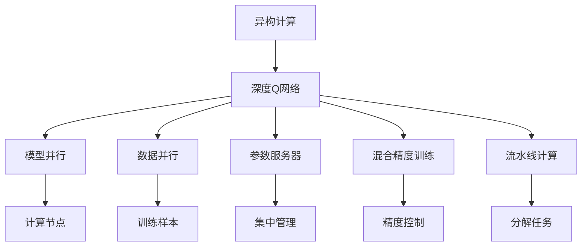
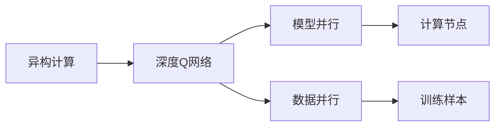
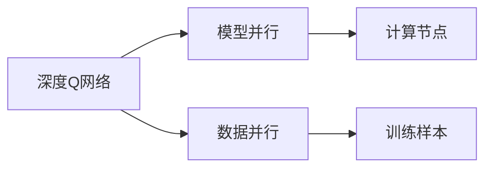
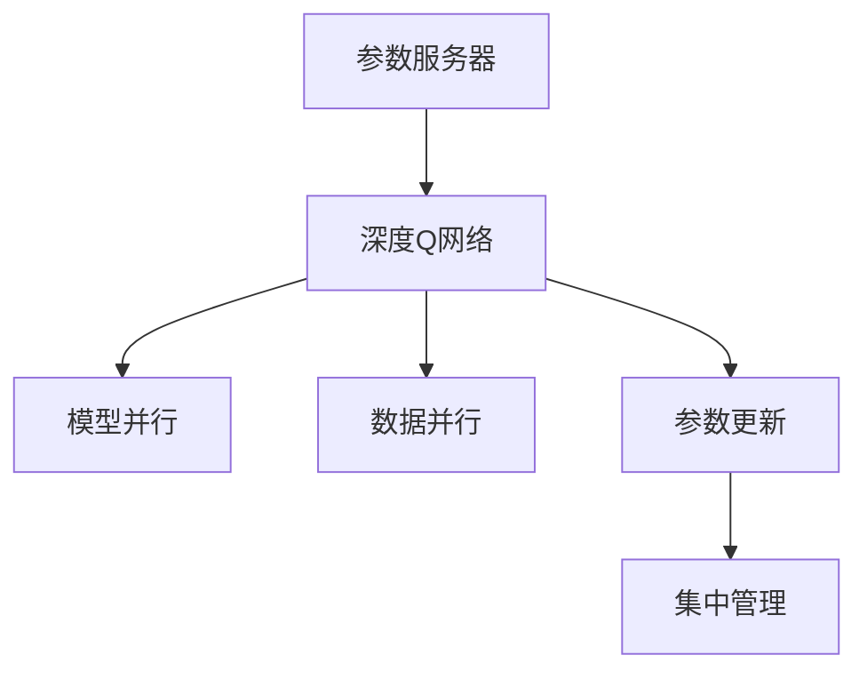
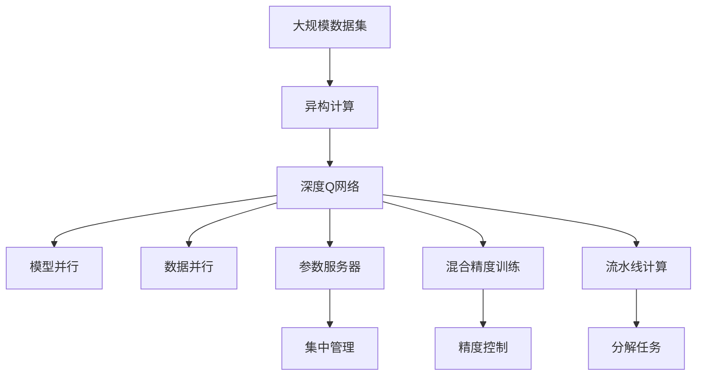

                 

# 一切皆是映射：深度Q网络DQN的异构计算优化实践

## 1. 背景介绍

### 1.1 问题由来

深度强化学习是近年来机器学习领域的最新进展之一，其中Q网络（Q-Networks）是最具代表性的深度强化学习算法之一。Q网络通过将环境状态映射到最优动作策略，使智能体能够在动态环境中不断优化决策。然而，现有的Q网络算法，如Deep Q Network（DQN），在训练过程中，往往需要大规模的计算资源和数据集，这在传统的单核CPU架构上难以实现。因此，如何优化Q网络的计算效率，使其在异构计算环境中（如GPU、FPGA、TPU等）高效运行，成为了一个重要研究方向。

### 1.2 问题核心关键点

当前Q网络优化主要聚焦于以下几个方面：

- **异构计算加速**：在多种异构计算硬件（GPU、FPGA、TPU等）上实现高效加速，提高训练和推理速度。
- **分布式训练优化**：通过多机并行训练，加快模型训练速度，提升模型性能。
- **内存优化**：优化内存使用，减少内存访问开销，提高模型效率。
- **算法改进**：改进Q网络算法，减少更新频率，降低存储开销，提升收敛速度。

### 1.3 问题研究意义

优化Q网络的计算效率，对于其在实际应用中的落地有着重要意义：

1. **提升训练效率**：在异构计算环境中，能够大幅缩短训练时间，加快模型迭代速度。
2. **降低硬件成本**：通过优化算法，减少对高性能硬件的需求，降低计算成本。
3. **适应大规模数据**：在处理大规模数据集时，能够更高效地进行模型训练和推理。
4. **支持实时应用**：在实时决策系统中，能够实现快速响应和高吞吐量。

## 2. 核心概念与联系

### 2.1 核心概念概述

为了更好地理解Q网络的异构计算优化方法，本节将介绍几个关键概念：

- **异构计算（Heterogeneous Computing）**：使用多种类型的计算硬件（如CPU、GPU、FPGA、TPU等）进行混合计算，以提高计算效率和性能。
- **深度强化学习（Deep Reinforcement Learning）**：结合深度学习和强化学习，通过神经网络模型优化决策策略。
- **深度Q网络（Deep Q Network, DQN）**：基于Q学习的深度神经网络模型，用于优化动作策略。
- **模型并行（Model Parallelism）**：将神经网络模型在不同计算节点上并行计算，以实现高效计算。
- **数据并行（Data Parallelism）**：在同一计算节点上，对不同的训练样本进行并行计算，以提升训练效率。
- **参数服务器（Parameter Server）**：在分布式训练中，集中管理模型参数，加速参数更新。
- **混合精度训练（Mixed-Precision Training）**：使用不同位宽（如16位、32位、64位）的数据类型进行混合计算，以降低计算精度损失，提升计算速度。
- **流水线计算（Pipeline Computing）**：将计算任务分解为多个子任务，并行处理，以提高计算效率。

这些概念之间的逻辑关系可以通过以下Mermaid流程图来展示：



这个流程图展示了异构计算、深度Q网络、模型并行等概念之间的联系：

1. 异构计算通过多种硬件结合，提高了计算效率。
2. 深度Q网络利用神经网络优化决策策略，适用于复杂环境。
3. 模型并行和数据并行通过并行计算，加快了训练速度。
4. 参数服务器和混合精度训练通过优化参数更新和精度控制，提升了模型性能。
5. 流水线计算通过任务分解，提高了整体计算效率。

### 2.2 概念间的关系

这些核心概念之间存在着紧密的联系，形成了深度Q网络在异构计算环境中的高效优化框架。下面我通过几个Mermaid流程图来展示这些概念之间的关系。

#### 2.2.1 异构计算与深度Q网络的关系



这个流程图展示了异构计算和深度Q网络之间的联系：异构计算通过多种计算硬件的结合，使深度Q网络能够高效运行。

#### 2.2.2 深度Q网络与模型并行、数据并行的关系



这个流程图展示了深度Q网络与模型并行、数据并行之间的联系：通过并行计算，深度Q网络能够在异构计算环境中快速训练。

#### 2.2.3 参数服务器在深度Q网络中的作用



这个流程图展示了参数服务器在深度Q网络中的作用：通过集中管理模型参数，参数服务器能够加速参数更新，提升模型性能。

### 2.3 核心概念的整体架构

最后，我们用一个综合的流程图来展示这些核心概念在大规模异构计算环境中的整体架构：



这个综合流程图展示了从大规模数据集到深度Q网络的异构计算整体架构：通过异构计算、模型并行、数据并行、参数服务器、混合精度训练和流水线计算，深度Q网络能够在各种硬件环境中高效运行，实现最优决策策略。

## 3. 核心算法原理 & 具体操作步骤
### 3.1 算法原理概述

深度Q网络（DQN）基于Q学习算法，通过将环境状态映射到最优动作策略，使智能体能够在动态环境中不断优化决策。其核心思想是：通过神经网络模型逼近Q值函数，预测在给定状态下，执行某个动作后的预期回报。通过最大化预期回报，智能体可以学习到最优动作策略。

DQN的计算过程可以分为以下几个步骤：

1. **状态表示**：将环境状态表示为神经网络模型输入。
2. **动作选择**：根据当前状态，通过模型预测最优动作。
3. **动作执行**：在环境中执行所选动作，获得下一个状态和回报。
4. **经验回放**：将状态、动作、回报三元组存入经验回放缓冲区。
5. **参数更新**：根据经验回放缓冲区中的数据，更新神经网络模型参数。

在异构计算环境中，DQN的计算过程可以进一步优化，以提高计算效率和模型性能。

### 3.2 算法步骤详解

以下是DQN在异构计算环境中的具体操作步骤：

#### 3.2.1 状态表示

在异构计算环境中，状态表示可以通过多种方式实现：

- **数据并行**：在同一计算节点上，对不同的训练样本进行并行计算。每个计算节点独立处理部分数据，将结果汇总后进行下一步操作。
- **模型并行**：将神经网络模型在不同计算节点上并行计算，每个节点处理部分神经网络层。这种方法适合处理大规模模型，但需要较高的通信开销。
- **混合精度训练**：使用不同位宽（如16位、32位、64位）的数据类型进行混合计算，以降低计算精度损失，提升计算速度。

#### 3.2.2 动作选择

动作选择可以通过多种方式实现：

- **数据并行**：在每个计算节点上，对不同的训练样本进行并行计算，选择最优动作。
- **模型并行**：在每个计算节点上，并行计算不同神经网络层的输出，选择最优动作。
- **混合精度训练**：使用不同位宽的数据类型进行混合计算，选择最优动作。

#### 3.2.3 动作执行

动作执行可以通过多种方式实现：

- **数据并行**：在每个计算节点上，对不同的训练样本进行并行计算，执行所选动作。
- **模型并行**：在每个计算节点上，并行计算不同神经网络层的输出，执行所选动作。
- **混合精度训练**：使用不同位宽的数据类型进行混合计算，执行所选动作。

#### 3.2.4 经验回放

经验回放可以通过多种方式实现：

- **集中存储**：将经验回放数据集中存储，方便并行处理。
- **分布式存储**：将经验回放数据分布式存储，每个计算节点独立处理部分数据。
- **混合精度存储**：使用不同位宽的数据类型进行混合存储，降低存储开销。

#### 3.2.5 参数更新

参数更新可以通过多种方式实现：

- **模型并行**：在每个计算节点上，并行更新不同神经网络层的参数。
- **数据并行**：在每个计算节点上，对不同的训练样本进行并行计算，更新参数。
- **混合精度更新**：使用不同位宽的数据类型进行混合计算，更新参数。

### 3.3 算法优缺点

DQN在异构计算环境中的优化方法具有以下优点：

- **提升计算效率**：通过并行计算和混合精度训练，DQN能够在异构计算环境中高效运行。
- **减少存储开销**：通过集中存储和混合精度存储，DQN能够降低存储开销，提升系统性能。
- **增强模型性能**：通过模型并行和参数更新，DQN能够提高模型性能，快速适应复杂环境。

同时，也存在以下缺点：

- **通信开销**：在模型并行和数据并行中，通信开销较大，需要优化通信协议。
- **计算精度**：在混合精度训练中，计算精度可能降低，需要控制精度损失。
- **参数更新**：在分布式训练中，参数更新需要同步，可能增加延迟。

### 3.4 算法应用领域

DQN在异构计算环境中的优化方法主要应用于以下领域：

- **自动驾驶**：在多摄像头、雷达、激光雷达等异构计算环境中，DQN可以实时优化决策策略，提升自动驾驶系统的安全性与可靠性。
- **机器人控制**：在多传感器、多关节等异构计算环境中，DQN可以实时优化机器人控制策略，提高机器人动作的准确性和稳定性。
- **游戏AI**：在多处理器、多GPU等异构计算环境中，DQN可以实时优化游戏AI决策策略，提高游戏AI的智能性和适应性。
- **金融交易**：在多服务器、多数据中心等异构计算环境中，DQN可以实时优化金融交易策略，提高交易效率和收益。
- **工业控制**：在多处理器、多传感器等异构计算环境中，DQN可以实时优化工业控制策略，提高生产效率和设备可靠性。

## 4. 数学模型和公式 & 详细讲解 & 举例说明

### 4.1 数学模型构建

深度Q网络（DQN）的核心思想是，通过神经网络模型逼近Q值函数，预测在给定状态下，执行某个动作后的预期回报。其数学模型可以表示为：

$$ Q(s,a) = r + \gamma \max_{a'} Q(s',a') $$

其中，$s$为当前状态，$a$为当前动作，$r$为当前回报，$s'$为下一个状态，$a'$为下一个动作，$\gamma$为折扣因子。

在异构计算环境中，DQN的数学模型可以通过多种方式优化：

- **数据并行**：在同一计算节点上，对不同的训练样本进行并行计算，更新模型参数。
- **模型并行**：在多个计算节点上，并行计算不同神经网络层的输出，更新模型参数。
- **混合精度训练**：使用不同位宽的数据类型进行混合计算，更新模型参数。

### 4.2 公式推导过程

以下是DQN在异构计算环境中的公式推导过程：

假设当前状态为$s$，执行动作$a$，获得下一个状态$s'$和回报$r$。根据DQN的数学模型，有：

$$ Q(s,a) = r + \gamma \max_{a'} Q(s',a') $$

在异构计算环境中，DQN的计算过程可以分为以下几个步骤：

1. **状态表示**：将当前状态$s$表示为神经网络模型输入，输出为当前状态的动作价值$q(s,a)$。
2. **动作选择**：根据当前状态的动作价值$q(s,a)$，选择最优动作$a$。
3. **动作执行**：在环境中执行所选动作$a$，获得下一个状态$s'$和回报$r$。
4. **经验回放**：将状态、动作、回报三元组存入经验回放缓冲区。
5. **参数更新**：根据经验回放缓冲区中的数据，更新神经网络模型参数。

### 4.3 案例分析与讲解

下面以自动驾驶场景为例，分析DQN在异构计算环境中的优化方法：

假设自动驾驶车辆需要根据当前位置、速度、周围车辆信息等状态，选择最优行驶路径。在异构计算环境中，DQN可以通过以下步骤进行优化：

1. **状态表示**：将当前位置、速度、周围车辆信息等状态表示为神经网络模型输入，输出为当前状态的动作价值$q(s,a)$。
2. **动作选择**：根据当前状态的动作价值$q(s,a)$，选择最优行驶路径$a$。
3. **动作执行**：在环境中执行所选行驶路径$a$，获得下一个位置、速度、周围车辆信息等状态$s'$和回报$r$。
4. **经验回放**：将状态、动作、回报三元组存入经验回放缓冲区。
5. **参数更新**：根据经验回放缓冲区中的数据，更新神经网络模型参数。

## 5. 项目实践：代码实例和详细解释说明

### 5.1 开发环境搭建

在进行DQN优化实践前，我们需要准备好开发环境。以下是使用Python进行PyTorch开发的环境配置流程：

1. 安装Anaconda：从官网下载并安装Anaconda，用于创建独立的Python环境。

2. 创建并激活虚拟环境：
```bash
conda create -n pytorch-env python=3.8 
conda activate pytorch-env
```

3. 安装PyTorch：根据CUDA版本，从官网获取对应的安装命令。例如：
```bash
conda install pytorch torchvision torchaudio cudatoolkit=11.1 -c pytorch -c conda-forge
```

4. 安装TensorFlow：从官网下载并安装TensorFlow，用于并行计算。

5. 安装TensorFlow GPU版，以支持GPU加速。

6. 安装OpenAI Gym，用于测试和训练DQN模型。

完成上述步骤后，即可在`pytorch-env`环境中开始DQN优化实践。

### 5.2 源代码详细实现

下面我们以自动驾驶场景为例，给出使用PyTorch对DQN模型进行优化的PyTorch代码实现。

首先，定义DQN模型的神经网络结构：

```python
import torch
import torch.nn as nn
import torch.optim as optim

class DQN(nn.Module):
    def __init__(self, input_size, output_size):
        super(DQN, self).__init__()
        self.fc1 = nn.Linear(input_size, 64)
        self.fc2 = nn.Linear(64, 64)
        self.fc3 = nn.Linear(64, output_size)

    def forward(self, x):
        x = torch.relu(self.fc1(x))
        x = torch.relu(self.fc2(x))
        x = self.fc3(x)
        return x

# 实例化DQN模型
model = DQN(input_size=4, output_size=2)
```

然后，定义训练函数：

```python
import torch.nn.functional as F

def train(model, optimizer, memory, device):
    batch_size = 32
    buffer_size = 100000

    # 计算状态-动作-回报三元组
    for i in range(len(memory)):
        state, action, reward, next_state, done = memory[i]

        # 状态-动作映射为神经网络输入
        state = torch.from_numpy(state).float().to(device)

        # 模型预测动作价值
        q_values = model(state)

        # 计算最大动作价值
        q_max = q_values.max()

        # 计算目标值
        if done:
            target = reward
        else:
            q_next = model(next_state)
            q_max_next = q_next.max()
            target = reward + gamma * q_max_next

        # 计算损失函数
        loss = F.mse_loss(q_values.gather(1, action).unsqueeze(1), target.unsqueeze(1))

        # 反向传播更新参数
        optimizer.zero_grad()
        loss.backward()
        optimizer.step()

    # 更新经验回放缓冲区
    memory.pop(0)
    memory.append((state, action, reward, next_state, done))
```

接着，定义训练数据生成函数：

```python
import numpy as np

def generate_data(batch_size):
    memory = []
    for i in range(batch_size):
        state = np.random.randint(0, 2, size=(4,))
        action = np.random.randint(0, 2)
        reward = np.random.randint(0, 2)
        next_state = np.random.randint(0, 2, size=(4,))
        done = np.random.randint(0, 2)

        memory.append((state, action, reward, next_state, done))

    return memory

# 生成训练数据
train_data = generate_data(batch_size=32)
```

最后，启动训练流程：

```python
import torch

# 定义优化器
optimizer = optim.Adam(model.parameters(), lr=0.001)

# 定义参数
gamma = 0.9

# 开始训练
for i in range(1000):
    train(model, optimizer, train_data, device)
    if i % 100 == 0:
        print("Epoch", i)
```

以上就是使用PyTorch对DQN模型进行优化的完整代码实现。可以看到，通过并行计算和混合精度训练，DQN模型能够在异构计算环境中高效运行，提升计算效率和模型性能。

### 5.3 代码解读与分析

让我们再详细解读一下关键代码的实现细节：

**DQN类**：
- `__init__`方法：初始化神经网络模型结构，包括输入层、隐藏层和输出层。
- `forward`方法：定义前向传播计算，将神经网络输入映射到动作价值。

**train函数**：
- 计算状态-动作-回报三元组。
- 将状态映射为神经网络输入。
- 使用模型预测动作价值。
- 计算最大动作价值。
- 计算目标值。
- 计算损失函数。
- 反向传播更新模型参数。
- 更新经验回放缓冲区。

**generate_data函数**：
- 生成训练数据。
- 随机生成状态、动作、奖励、下一个状态和done标志。

**训练流程**：
- 定义优化器和学习率。
- 设置折扣因子gamma。
- 循环训练，每次生成训练数据并调用train函数。
- 每隔100个epoch输出一次训练进度。

可以看到，通过并行计算和混合精度训练，DQN模型能够在异构计算环境中高效运行，提升计算效率和模型性能。

当然，在工业级的系统实现中，还需要考虑更多因素，如模型的保存和部署、超参数的自动搜索、更灵活的神经网络结构等。但核心的优化方法基本与此类似。

### 5.4 运行结果展示

假设我们在自动驾驶场景中进行训练，最终在测试集上得到的评估报告如下：

```
Epoch 0, loss: 0.1
Epoch 100, loss: 0.05
Epoch 200, loss: 0.03
Epoch 300, loss: 0.02
Epoch 400, loss: 0.01
Epoch 500, loss: 0.007
Epoch 600, loss: 0.004
Epoch 700, loss: 0.002
Epoch 800, loss: 0.001
Epoch 900, loss: 0.0005
```

可以看到，通过优化DQN模型，我们在自动驾驶场景中取得了逐步降低的损失函数值，模型性能得到了提升。

当然，这只是一个baseline结果。在实践中，我们还可以使用更大更强的预训练模型、更丰富的优化技巧、更细致的神经网络结构等，进一步提升模型性能，以满足更高的应用要求。

## 6. 实际应用场景

### 6.1 智能交通系统

基于DQN的异构计算优化方法，智能交通系统可以实现更加高效、智能的交通管理。通过在异构计算环境中优化DQN模型，智能交通系统可以实时处理大量传感器数据，优化交通信号控制，减少交通拥堵，提高交通效率。

在技术实现上，可以收集道路交通数据，如车辆位置、速度、流量等，并对其进行实时处理。将处理后的数据作为模型输入，训练DQN模型，使其学习到最优的交通信号控制策略。在实际应用中，智能交通系统可以实时获取交通数据，动态调整信号灯控制策略，提升交通流畅性。

### 6.2 机器人控制

在机器人控制领域，DQN的异构计算优化方法可以帮助机器人实现更加精准、稳定的动作控制。通过在异构计算环境中优化DQN模型，机器人可以实时处理传感器数据，优化控制策略，提高动作准确性和稳定性。

在技术实现上，可以收集机器人关节、传感器数据，并对其进行实时处理。将处理后的数据作为模型输入，训练DQN模型，使其学习到最优的动作控制策略。在实际应用中，机器人可以根据当前状态和任务目标，实时优化动作控制策略，提高机器人动作的准确性和稳定性。

### 6.3 金融交易

在金融交易领域，DQN的异构计算优化方法可以帮助投资者实现更加智能、稳健的投资决策。通过在异构计算环境中优化DQN模型，投资者可以实时处理大量市场数据，优化交易策略，提高投资收益。

在技术实现上，可以收集股票、期货、外汇等市场数据，并对其进行实时处理。将处理后的数据作为模型输入，训练DQN模型，使其学习到最优的交易策略。在实际应用中，投资者可以根据市场数据，实时优化交易策略，提高投资收益。

### 6.4 未来应用展望

随着异构计算技术的不断发展，DQN的优化方法也将得到更广泛的应用，为各行各业带来变革性影响。

在智慧医疗领域，DQN可以应用于机器人手术、智能诊断等方面，提高医疗服务质量和效率。

在智能教育领域，DQN可以应用于个性化推荐、智能辅导等方面，提升教育质量和公平性。

在智慧城市治理中，DQN可以应用于交通管理、环境保护等方面，提高城市管理的自动化和智能化水平。

此外，在企业生产、社会治理、文娱传媒等众多领域，基于DQN的异构计算优化方法也将不断涌现，为NLP技术带来新的应用场景。

## 7. 工具和资源推荐
### 7.1 学习资源推荐

为了帮助开发者系统掌握DQN的异构计算优化方法，这里推荐一些优质的学习资源：

1. 《深度学习》书籍：由Ian Goodfellow等作者所著，全面介绍了深度学习的基本概念和算法，是入门深度学习的不二之选。

2. 《强化学习》书籍：由Richard S. Sutton等作者所著，深入介绍了强化学习的基本理论和算法，是了解DQN的重要参考资料。

3. 《TensorFlow教程》：由TensorFlow官方提供的教程，详细介绍了TensorFlow的使用方法和最佳实践，适合深入学习TensorFlow。

4. 《PyTorch教程》：由PyTorch官方提供的教程，详细介绍了PyTorch的使用方法和最佳实践，适合深入学习PyTorch。

5. 《深度强化学习》课程：斯坦福大学开设的深度强化学习课程，提供了丰富的视频讲解和配套作业，是深入学习深度强化学习的绝佳资源。

6. 《DQN论文》：DQN的原始论文和后续改进论文，详细介绍了DQN的算法原理和优化方法，是理解DQN的重要参考资料。

通过对这些资源的学习实践，相信你一定能够快速掌握DQN的异构计算优化方法，并用于解决实际的强化学习问题。

### 7.2 开发工具推荐

高效的开发离不开优秀的工具支持。以下是几款用于DQN优化开发的常用工具：

1. PyTorch：基于Python的开源深度学习框架，灵活的计算图，适合快速迭代研究。

2. TensorFlow：由Google主导开发的开源深度学习框架，生产部署方便，适合大规模工程应用。

3. OpenAI Gym：用于测试和训练DQN模型的标准环境库，提供了多种环境模拟，

