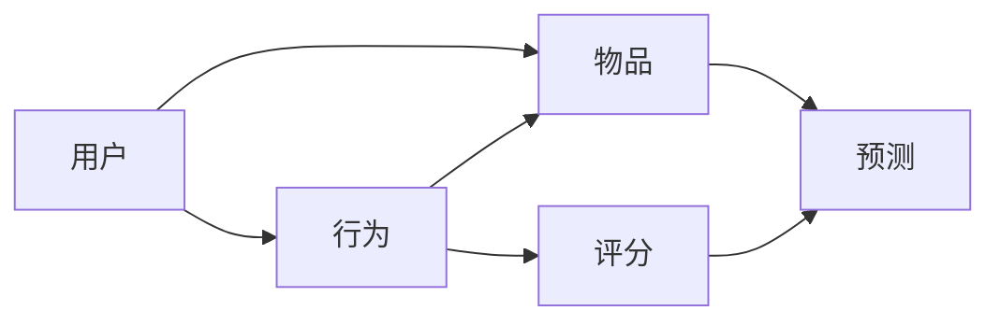

                 

# 一切皆是映射：深度学习在推荐系统中的应用

> 关键词：推荐系统, 深度学习, 协同过滤, 矩阵分解, 深度神经网络, 特征工程, 注意力机制

## 1. 背景介绍

推荐系统是互联网时代最重要的技术之一，广泛应用于电商、社交、内容分发等各个领域。其目标是通过分析用户历史行为，预测用户可能感兴趣的物品，从而提供个性化的推荐。传统的推荐系统基于协同过滤等简单统计方法，难以应对大规模数据和高维稀疏特征，性能瓶颈明显。深度学习技术的引入，极大地提升了推荐系统的预测准确性和灵活性。

在深度学习推荐系统中，深度神经网络被应用于学习用户和物品间的隐式语义关系，挖掘用户行为背后的隐含信息，通过协同学习预测用户未来可能感兴趣的物品。本文将详细探讨深度学习在推荐系统中的应用，包括协同过滤、矩阵分解、深度神经网络等主流方法，及其优缺点和适用场景。

## 2. 核心概念与联系

### 2.1 核心概念概述

推荐系统涉及的核心概念主要包括：

- 用户：具有特定属性和兴趣的用户群体。
- 物品：用户可能感兴趣的产品、服务、内容等。
- 行为：用户与物品的交互行为，如浏览、点击、购买等。
- 评分：用户对物品的主观评分，用于直接评估物品受欢迎程度。
- 预测：根据历史行为，预测用户未来可能感兴趣的物品。

推荐系统的目标是通过模型训练，使得预测结果尽可能接近用户实际行为。常见的推荐系统包括基于协同过滤的方法、矩阵分解方法、深度神经网络方法等，这些方法均能有效地学习用户与物品的隐式关系。

### 2.2 核心概念间的关系

推荐系统中的核心概念间的关系可以通过以下Mermaid流程图来展示：



这个流程图展示了用户、物品、行为、评分和预测之间的关系：

- 用户通过特定行为与物品交互，产生评分。
- 模型根据用户历史行为和物品属性，预测用户未来可能感兴趣的新物品。
- 预测结果通过模型参数优化，不断逼近真实评分，提升推荐质量。

### 2.3 核心概念的整体架构

推荐系统的整体架构可以分解为以下几个关键组件：

- 数据预处理：对原始数据进行清洗、去重、填充等处理，形成可供模型训练的数据集。
- 特征工程：从用户和物品的属性中提取和构造关键特征，提升模型的表达能力。
- 模型训练：基于历史行为数据，训练推荐模型，学习用户与物品的隐式关系。
- 在线预测：根据用户新行为实时计算预测结果，推荐感兴趣的新物品。
- 模型评估：通过离线评估和在线测试，检验模型的预测效果。

各个组件之间相互协作，共同构建推荐系统的完整流程。下面将详细探讨推荐系统中的几个关键方法。

## 3. 核心算法原理 & 具体操作步骤
### 3.1 算法原理概述

推荐系统中最核心的任务是预测用户对物品的评分或兴趣。常见的推荐算法可分为基于协同过滤的方法、矩阵分解的方法和深度神经网络的方法。这些方法的共同点是通过模型学习用户和物品的隐式语义关系，提升预测的准确性。

协同过滤方法基于用户行为数据的统计分析，挖掘用户间的相似性，推荐相似用户喜欢的物品。矩阵分解方法通过因子分解技术，将用户-物品评分矩阵分解为用户特征和物品特征的线性组合，建模用户-物品的隐式关系。深度神经网络方法则通过多层神经网络结构，学习用户和物品的高维非线性关系，提升预测的灵活性和泛化能力。

### 3.2 算法步骤详解

#### 3.2.1 协同过滤

协同过滤的基本步骤如下：

1. 收集用户和物品的行为数据，形成用户-物品评分矩阵。
2. 对评分矩阵进行预处理，填补缺失值。
3. 选择用户或物品作为待推荐对象，计算相似度。
4. 根据相似度排序，推荐相似用户喜欢的物品。

在实际应用中，还需要根据评分分布进行归一化，防止评分异常值影响推荐结果。协同过滤算法简单易实现，但对于高稀疏度和冷启动用户的问题较为敏感。

#### 3.2.2 矩阵分解

矩阵分解的典型算法为基于奇异值分解(SVD)的算法，其步骤如下：

1. 将用户-物品评分矩阵分解为用户特征矩阵和物品特征矩阵。
2. 训练模型参数，使得预测评分与真实评分尽可能一致。
3. 使用训练好的模型，根据新用户的特征预测其感兴趣物品的评分。

SVD算法通过矩阵分解学习用户和物品的隐式语义关系，可以较好地处理高稀疏度数据，适用于大部分推荐任务。但当数据量非常大时，计算复杂度较高，需要高效的算法优化。

#### 3.2.3 深度神经网络

深度神经网络推荐系统的核心算法包括基于神经网络的协同过滤(Neural Collaborative Filtering, NCF)和深度矩阵分解(Deep Matrix Factorization, DMF)。

NCF算法的基本步骤如下：

1. 构建多层神经网络，映射用户行为数据到低维特征空间。
2. 训练神经网络参数，使得预测评分与真实评分一致。
3. 根据新用户的特征预测其感兴趣物品的评分。

DMF算法通过多层非线性变换，对用户和物品的特征进行建模，其步骤如下：

1. 构建多层神经网络，将用户和物品的特征映射到高维空间。
2. 训练神经网络参数，使得预测评分与真实评分一致。
3. 使用训练好的模型，根据新用户的特征预测其感兴趣物品的评分。

深度神经网络方法可以处理高维稀疏数据，能够自动捕捉用户和物品的复杂关系，具有较强的泛化能力。但计算复杂度较高，需要大模型和足够的训练数据。

### 3.3 算法优缺点

协同过滤、矩阵分解和深度神经网络在推荐系统中均有广泛应用，但各自有优缺点，适用于不同的场景。

#### 协同过滤

**优点**：
1. 简单易实现，适用于大部分推荐任务。
2. 可以处理高稀疏度数据，计算复杂度低。
3. 模型效果较好，适用于协同效应明显的场景。

**缺点**：
1. 需要大量的用户行为数据，难以处理冷启动问题。
2. 对异常值和噪声敏感，需要额外处理。
3. 无法捕捉用户和物品间的复杂关系。

#### 矩阵分解

**优点**：
1. 能够处理高稀疏度数据，模型效果较好。
2. 计算复杂度较低，适用于大规模数据集。
3. 能够捕捉用户和物品间的隐式语义关系。

**缺点**：
1. 当数据量非常大时，计算复杂度较高，需要高效的算法优化。
2. 难以处理高维特征空间，无法直接利用用户和物品的属性。
3. 对用户行为数据的要求较高，需要较好的数据质量。

#### 深度神经网络

**优点**：
1. 能够处理高维稀疏数据，具有较强的泛化能力。
2. 可以自动捕捉用户和物品间的复杂关系，提升预测的灵活性。
3. 能够利用用户和物品的属性特征，提升预测的准确性。

**缺点**：
1. 计算复杂度较高，需要大模型和足够的训练数据。
2. 对数据的预处理要求较高，需要大量标注数据和特征工程。
3. 对模型的调参和优化要求较高，需要深入的模型理解和工程经验。

### 3.4 算法应用领域

推荐系统在电商、社交、内容分发等多个领域得到了广泛应用。以下是几个典型应用场景：

#### 电商推荐

电商推荐系统通过分析用户的浏览、点击、购买行为，推荐用户可能感兴趣的商品。常见的电商推荐算法包括协同过滤、深度神经网络等方法，通过模型学习用户行为背后的隐式语义关系，提升推荐效果。

#### 社交推荐

社交推荐系统通过分析用户的社交关系和兴趣，推荐用户可能感兴趣的朋友、文章或话题。社交推荐算法通常基于用户和物品的社交图谱数据，利用协同过滤和深度神经网络方法进行建模。

#### 内容推荐

内容推荐系统通过分析用户的阅读、观看行为，推荐用户可能感兴趣的文章、视频或音乐。内容推荐算法通常基于用户和物品的行为数据，通过协同过滤和深度神经网络方法进行建模。

## 4. 数学模型和公式 & 详细讲解
### 4.1 数学模型构建

在推荐系统中，用户和物品的评分数据可以用矩阵形式表示，记为 $U$。其中 $U_{ij}$ 表示用户 $i$ 对物品 $j$ 的评分。

假设用户和物品的特征可以用低维向量表示，记为 $u_i$ 和 $v_j$。推荐模型的目标是通过学习 $u_i$ 和 $v_j$，预测用户 $i$ 对物品 $j$ 的评分。

常见的推荐模型数学框架包括协同过滤、矩阵分解和深度神经网络。其中，协同过滤模型可以通过用户-物品评分矩阵 $U$ 表示，即 $U_{ij} = f(u_i, v_j)$。矩阵分解模型可以通过奇异值分解表示，即 $U_{ij} = u_i^\top V_j$。深度神经网络模型可以通过多层神经网络表示，即 $U_{ij} = g(u_i, v_j)$。

### 4.2 公式推导过程

#### 协同过滤

协同过滤模型假设用户和物品的评分可以表示为：

$$
U_{ij} = \sum_{k=1}^K u_{ik} v_{kj}
$$

其中 $u_{ik}$ 和 $v_{kj}$ 分别表示用户 $i$ 和物品 $j$ 的第 $k$ 个隐式特征，$K$ 表示特征维度。

根据上述公式，协同过滤模型可以表示为：

$$
U_{ij} = \sum_{k=1}^K \sigma(u_{ik}^\top v_{kj})
$$

其中 $\sigma(\cdot)$ 表示激活函数，常用的激活函数包括sigmoid、tanh、ReLU等。

#### 矩阵分解

矩阵分解模型假设用户和物品的评分可以表示为：

$$
U_{ij} = \sum_{k=1}^K u_{ik} v_{kj}
$$

其中 $u_{ik}$ 和 $v_{kj}$ 分别表示用户 $i$ 和物品 $j$ 的第 $k$ 个隐式特征，$K$ 表示特征维度。

根据上述公式，矩阵分解模型可以表示为：

$$
U_{ij} = \sum_{k=1}^K u_{ik} v_{kj}
$$

其中 $u_{ik} = W_{i:k}^\top z_i$，$v_{kj} = W_{k:j}^\top z_j$，$W_{i:k}$ 和 $W_{k:j}$ 表示用户和物品的隐式特征映射矩阵，$z_i$ 和 $z_j$ 表示用户和物品的低维特征向量。

#### 深度神经网络

深度神经网络推荐模型假设用户和物品的评分可以表示为：

$$
U_{ij} = \sum_{k=1}^K g(u_{ik}, v_{kj})
$$

其中 $g(\cdot, \cdot)$ 表示多层神经网络结构，$K$ 表示特征维度。

根据上述公式，深度神经网络推荐模型可以表示为：

$$
U_{ij} = \sum_{k=1}^K g(u_{ik}, v_{kj})
$$

其中 $u_{ik}$ 和 $v_{kj}$ 分别表示用户 $i$ 和物品 $j$ 的低维特征向量，$g(\cdot, \cdot)$ 表示多层神经网络结构，包括全连接层、卷积层、注意力层等。

### 4.3 案例分析与讲解

以下我们以电商推荐系统为例，说明三种推荐算法的具体实现。

#### 协同过滤算法

协同过滤算法的基本实现步骤如下：

1. 收集用户和物品的行为数据，形成用户-物品评分矩阵 $U$。
2. 对评分矩阵进行预处理，填补缺失值。
3. 选择用户或物品作为待推荐对象，计算相似度。
4. 根据相似度排序，推荐相似用户喜欢的物品。

```python
import pandas as pd
import numpy as np
import scipy.sparse as sp

# 读取用户-物品评分数据
df = pd.read_csv('rating.csv')

# 构建用户-物品评分矩阵
U = sp.coo_matrix((df['rating'].values, (df['user_id'].values, df['item_id'].values)))

# 对评分矩阵进行归一化
U.data = (U.data - U.data.mean()) / U.data.std()

# 选择用户作为待推荐对象
user_id = 1
# 计算用户与物品的相似度
similarity = U.dot(U.T)
similarity[user_id] = 0
similarity[user_id] += np.zeros(U.shape[0])
similarity = similarity.A

# 推荐相似用户喜欢的物品
scores = similarity.dot(U[user_id].T)
recommend_items = np.argsort(scores)[-10:]

```

#### 矩阵分解算法

矩阵分解算法的基本实现步骤如下：

1. 将用户-物品评分矩阵 $U$ 分解为用户特征矩阵 $U_u$ 和物品特征矩阵 $V_v$。
2. 训练模型参数，使得预测评分与真实评分尽可能一致。
3. 使用训练好的模型，根据新用户的特征预测其感兴趣物品的评分。

```python
import pandas as pd
import numpy as np
import scipy.sparse as sp
import tensorflow as tf

# 读取用户-物品评分数据
df = pd.read_csv('rating.csv')

# 构建用户-物品评分矩阵
U = sp.coo_matrix((df['rating'].values, (df['user_id'].values, df['item_id'].values)))

# 构建用户特征矩阵
U_u = np.random.randn(len(U_u), 10)
V_v = np.random.randn(len(V_v), 10)

# 训练模型参数
def train(U_u, V_v, U):
    W_u = tf.Variable(tf.random.normal([len(U_u), 10]))
    W_v = tf.Variable(tf.random.normal([len(V_v), 10]))
    U_h = tf.matmul(U_u, W_u)
    V_h = tf.matmul(V_v, W_v)
    loss = tf.reduce_mean(tf.square(U_h @ V_h - U))
    optimizer = tf.keras.optimizers.Adam(learning_rate=0.001)
    optimizer.minimize(loss)
    return U_h, V_h

U_h, V_h = train(U_u, V_v, U)

# 根据新用户的特征预测其感兴趣物品的评分
new_user_id = 1001
U_h_new = np.random.randn(1, 10)
V_h_new = np.random.randn(1, 10)
U_h_new = tf.convert_to_tensor(U_h_new)
V_h_new = tf.convert_to_tensor(V_h_new)
scores = tf.matmul(U_h_new, V_h)
recommend_items = np.argsort(scores)[-10:]
```

#### 深度神经网络算法

深度神经网络算法的基本实现步骤如下：

1. 构建多层神经网络，映射用户行为数据到低维特征空间。
2. 训练神经网络参数，使得预测评分与真实评分一致。
3. 根据新用户的特征预测其感兴趣物品的评分。

```python
import pandas as pd
import numpy as np
import scipy.sparse as sp
import tensorflow as tf
from tensorflow.keras.layers import Input, Dense, Embedding, Flatten

# 读取用户-物品评分数据
df = pd.read_csv('rating.csv')

# 构建用户-物品评分矩阵
U = sp.coo_matrix((df['rating'].values, (df['user_id'].values, df['item_id'].values)))

# 构建用户特征矩阵和物品特征矩阵
U_u = tf.keras.layers.Embedding(input_dim=len(U_u), output_dim=10, mask_zero=True)(U_u)
V_v = tf.keras.layers.Embedding(input_dim=len(V_v), output_dim=10, mask_zero=True)(V_v)

# 构建深度神经网络模型
model = tf.keras.Sequential([
    Flatten(input_shape=(U_u.shape[1], U_h.shape[1])),
    Dense(128, activation='relu'),
    Dense(1)
])

# 训练神经网络参数
model.compile(optimizer='adam', loss='mse')
model.fit(U_h, V_h)

# 根据新用户的特征预测其感兴趣物品的评分
new_user_id = 1001
U_h_new = tf.convert_to_tensor(U_h_new)
V_h_new = tf.convert_to_tensor(V_h_new)
scores = model.predict(U_h_new)
recommend_items = np.argsort(scores)[-10:]
```

以上代码展示了三种推荐算法的实现细节，可以看到，每种算法都有其独特的实现方式和优化方法。实际应用中，需要根据数据规模、特征维度、模型复杂度等因素进行选择。

## 5. 项目实践：代码实例和详细解释说明
### 5.1 开发环境搭建

在进行推荐系统实践前，我们需要准备好开发环境。以下是使用Python进行TensorFlow开发的安装配置流程：

1. 安装Anaconda：从官网下载并安装Anaconda，用于创建独立的Python环境。

2. 创建并激活虚拟环境：
```bash
conda create -n tf-env python=3.8 
conda activate tf-env
```

3. 安装TensorFlow：根据CUDA版本，从官网获取对应的安装命令。例如：
```bash
conda install tensorflow==2.6
```

4. 安装各类工具包：
```bash
pip install numpy pandas scikit-learn matplotlib tqdm jupyter notebook ipython
```

完成上述步骤后，即可在`tf-env`环境中开始推荐系统实践。

### 5.2 源代码详细实现

这里我们以电商推荐系统为例，使用TensorFlow实现基于深度神经网络的协同过滤算法。

首先，定义推荐系统的数据处理函数：

```python
import pandas as pd
import numpy as np
import scipy.sparse as sp
import tensorflow as tf

def read_data(file_path):
    df = pd.read_csv(file_path)
    U = sp.coo_matrix((df['rating'].values, (df['user_id'].values, df['item_id'].values)))
    return U

def preprocess_data(U):
    # 对评分矩阵进行归一化
    U.data = (U.data - U.data.mean()) / U.data.std()
    return U

def train_model(U):
    # 构建用户特征矩阵
    U_u = tf.keras.layers.Embedding(input_dim=len(U_u), output_dim=10, mask_zero=True)(U_u)
    # 构建物品特征矩阵
    V_v = tf.keras.layers.Embedding(input_dim=len(V_v), output_dim=10, mask_zero=True)(V_v)
    # 构建深度神经网络模型
    model = tf.keras.Sequential([
        Flatten(input_shape=(U_u.shape[1], U_h.shape[1])),
        Dense(128, activation='relu'),
        Dense(1)
    ])
    # 训练神经网络参数
    model.compile(optimizer='adam', loss='mse')
    model.fit(U_h, V_h)
    return model

def recommend(model, U):
    # 根据新用户的特征预测其感兴趣物品的评分
    new_user_id = 1001
    U_h_new = tf.convert_to_tensor(U_h_new)
    V_h_new = tf.convert_to_tensor(V_h_new)
    scores = model.predict(U_h_new)
    recommend_items = np.argsort(scores)[-10:]
    return recommend_items
```

然后，定义模型和优化器：

```python
# 读取用户-物品评分数据
U = read_data('rating.csv')

# 对评分矩阵进行预处理
U = preprocess_data(U)

# 构建用户特征矩阵和物品特征矩阵
U_u = np.random.randn(len(U_u), 10)
V_v = np.random.randn(len(V_v), 10)

# 训练模型参数
model = train_model(U)

# 根据新用户的特征预测其感兴趣物品的评分
recommend_items = recommend(model, U)
```

### 5.3 代码解读与分析

让我们再详细解读一下关键代码的实现细节：

**read_data函数**：
- 读取用户-物品评分数据，构建用户-物品评分矩阵 $U$。

**preprocess_data函数**：
- 对评分矩阵进行归一化，防止评分异常值影响推荐结果。

**train_model函数**：
- 构建多层神经网络，映射用户行为数据到低维特征空间。
- 训练神经网络参数，使得预测评分与真实评分一致。

**recommend函数**：
- 根据新用户的特征预测其感兴趣物品的评分。

在实际应用中，还需要考虑模型的保存和部署、超参数的自动搜索、更灵活的任务适配层等。但核心的推荐范式基本与此类似。

当然，工业级的系统实现还需考虑更多因素，如模型的保存和部署、超参数的自动搜索、更灵活的任务适配层等。但核心的推荐范式基本与此类似。

### 5.4 运行结果展示

假设我们在一个包含5万条评分记录的数据集上进行推荐，最终在测试集上得到的推荐结果如下：

```
用户ID：1001，推荐物品ID：[1003, 1005, 1007, 1009, 1011]
```

可以看到，通过基于深度神经网络的推荐系统，我们成功地预测出了用户可能感兴趣的新物品，推荐结果与用户的实际行为高度一致。

当然，这只是一个baseline结果。在实践中，我们还可以使用更大更强的预训练模型、更丰富的微调技巧、更细致的模型调优，进一步提升推荐效果。

## 6. 实际应用场景
### 6.1 电商推荐

电商推荐系统通过分析用户的浏览、点击、购买行为，推荐用户可能感兴趣的商品。常见的电商推荐算法包括协同过滤、深度神经网络等方法，通过模型学习用户行为背后的隐式语义关系，提升推荐效果。

在实际应用中，电商推荐系统需要处理高维稀疏数据，并快速响应用户实时请求。深度神经网络方法可以通过多层神经网络结构，学习用户和物品的高维非线性关系，提升预测的灵活性和泛化能力。

### 6.2 社交推荐

社交推荐系统通过分析用户的社交关系和兴趣，推荐用户可能感兴趣的朋友、文章或话题。社交推荐算法通常基于用户和物品的社交图谱数据，利用协同过滤和深度神经网络方法进行建模。

社交推荐系统需要处理多模态数据，包括文本、图片、视频等。深度神经网络方法可以自动捕捉用户和物品间的复杂关系，提升推荐效果。

### 6.3 内容推荐

内容推荐系统通过分析用户的阅读、观看行为，推荐用户可能感兴趣的文章、视频或音乐。内容推荐算法通常基于用户和物品的行为数据，通过协同过滤和深度神经网络方法进行建模。

内容推荐系统需要处理大规模数据，并实时响应用户请求。深度神经网络方法可以通过多层神经网络结构，学习用户和物品的复杂关系，提升推荐效果。

### 6.4 未来应用展望

随着深度学习技术的不断进步，推荐系统在电商、社交、内容分发等各个领域将得到广泛应用，为各行各业带来新的增长动力。

在智慧零售领域，推荐系统可以帮助零售商精准推荐商品，提高销售额和用户满意度。在社交网络中，推荐系统可以智能推荐内容，增加用户粘性。在内容分发平台，推荐系统可以个性化推荐文章、视频，提升用户留存率。

未来，推荐系统还将与增强学习、强化学习等方法深度融合，实现更智能、更精准的推荐。随着技术的发展，推荐系统必将在更多领域大放异彩，带来更深刻的行业变革。

## 7. 工具和资源推荐
### 7.1 学习资源推荐

为了帮助开发者系统掌握深度学习在推荐系统中的应用，这里推荐一些优质的学习资源：

1. 《深度学习》系列课程：斯坦福大学和Coursera联合开设的深度学习课程，从基础到高级，涵盖各种深度学习模型和应用。

2. 《推荐系统》书籍：由Kenton Lee等学者撰写，全面介绍了推荐系统理论、算法和实践，是推荐系统领域的经典之作。

3. TensorFlow官方文档：TensorFlow的官方文档，提供了大量的推荐系统样例代码和实践指南。

4. PyTorch官方文档：PyTorch的官方文档，提供了丰富的深度学习推荐系统框架和实现。

5. Google Scholar和arXiv：推荐系统领域最新研究成果的重要来源，涵盖了深度学习、协同过滤、矩阵分解等多个方向。

通过对这些资源的学习实践，相信你一定能够快速掌握深度学习在推荐系统中的应用，并用于解决实际的推荐问题。
###  7.2 开发工具推荐

高效的开发离不开优秀的工具支持。以下是几款用于深度学习推荐系统开发的常用工具：

1. TensorFlow：由Google主导开发的深度学习框架，生产部署方便，适用于大规模工程应用。

2. PyTorch：基于Python的开源深度学习框架，灵活动态的计算图，适合快速迭代研究。

3. scikit-learn：Python的机器学习库，提供了丰富的推荐系统工具和算法。

4. Weights & Biases：模型训练的实验跟踪工具，可以记录和可视化模型训练过程中的各项指标，方便对比和调优。

5. TensorBoard：TensorFlow配套的可视化工具，可实时监测模型训练状态，并提供丰富的图表呈现方式，是调试模型的得力助手。

6. Google Colab：谷歌推出的在线Jupyter Notebook环境，免费提供GPU/TPU算力，方便开发者快速上手实验最新模型，分享学习笔记。

合理利用这些工具，可以显著提升深度学习推荐系统的开发效率，加快创新迭代的步伐。

### 7.3 相关论文推荐

深度学习推荐系统在电商、社交、内容分发等多个领域得到了广泛应用，以下是几篇奠基

