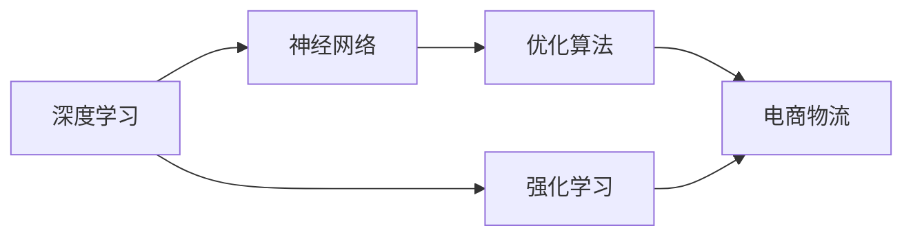
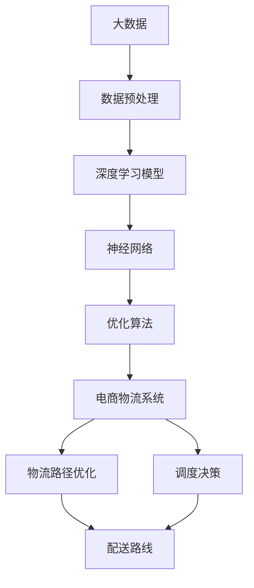

                 

# 一切皆是映射：深度学习在电商物流优化中的应用

> 关键词：深度学习,电商物流,优化算法,供应链管理,神经网络,强化学习

## 1. 背景介绍

### 1.1 问题由来

在现代电商物流领域，随着订单量的不断增长，物流成本和配送效率已成为制约电商平台发展的关键因素。传统的物流系统通常基于经验规则和人工调度进行管理，难以应对复杂多变的物流需求和突发事件。近年来，深度学习技术在电商物流中的应用取得了显著进展，成为提升物流效率和降低成本的重要手段。

## 2. 核心概念与联系

### 2.1 核心概念概述

为更好地理解深度学习在电商物流优化中的应用，本节将介绍几个关键概念及其内在联系：

- **深度学习**：通过多层神经网络结构，自动提取数据特征，实现复杂任务的高效学习和泛化。
- **电商物流**：包括商品采购、仓储管理、配送派送等多个环节，涉及到供应链上下游的协调配合。
- **优化算法**：用于求解复杂优化问题，如线性规划、非线性优化、动态规划等，帮助电商物流系统优化资源配置、调度策略等。
- **神经网络**：基于生物神经网络的计算模型，能够处理非线性问题，自动学习输入与输出之间的映射关系。
- **强化学习**：通过不断试错和反馈，优化决策策略，适用于连续的、动态的环境。

这些概念之间的联系主要体现在：

1. **深度学习与神经网络**：深度学习是神经网络的一种扩展，通过多层非线性变换实现复杂映射。
2. **优化算法与深度学习**：优化算法用于求解神经网络参数，而深度学习则自动学习特征和模式。
3. **电商物流与深度学习**：电商物流涉及复杂的系统优化问题，深度学习可以用于物流数据的预测、路径优化、调度决策等。
4. **强化学习与电商物流**：强化学习通过试错反馈，自动学习最优物流策略，适用于动态变化的物流场景。

这些概念共同构成了深度学习在电商物流优化中的应用框架，使我们能够通过神经网络和优化算法，构建更高效、灵活、智能的物流系统。

### 2.2 概念间的关系

为了更直观地展示这些概念之间的关系，我们通过以下Mermaid流程图来表示：



这个流程图展示了深度学习、神经网络、优化算法和电商物流之间的联系。深度学习通过神经网络实现复杂映射，优化算法用于求解神经网络参数，而电商物流则利用深度学习进行数据分析和决策优化。强化学习作为补充，用于动态环境下的物流策略优化。

### 2.3 核心概念的整体架构

最后，我们用一个综合的流程图来展示这些核心概念在大规模电商物流优化中的应用：



这个综合流程图展示了从数据采集到物流系统优化的一整套流程。大数据通过数据预处理，输入深度学习模型。深度学习模型通过神经网络实现特征提取和模式识别。神经网络参数通过优化算法求解。最终，电商物流系统利用优化结果进行路径优化和调度决策，生成配送路线。

## 3. 核心算法原理 & 具体操作步骤

### 3.1 算法原理概述

深度学习在电商物流优化中的应用，主要是通过神经网络模型实现输入和输出之间的映射，利用优化算法求解最优参数，从而实现物流路径、调度等问题的优化。

具体而言，深度学习模型通常采用多层感知机（MLP）、卷积神经网络（CNN）、循环神经网络（RNN）等结构，通过学习历史物流数据，自动提取特征，并建立预测模型。模型的输出可以表示为：

$$
\hat{y} = f(x; \theta)
$$

其中，$x$ 为输入数据，$\theta$ 为模型参数，$f(x; \theta)$ 为神经网络的映射函数。优化算法则通过求解目标函数最小化，确定最优参数 $\theta$。常见的优化算法包括梯度下降、Adam、RMSprop等。

电商物流优化问题通常是非线性的，且涉及大量变量和约束条件。因此，深度学习模型一般需要与优化算法结合，才能更有效地求解实际问题。例如，路径优化问题可以表示为：

$$
\min_{\theta} \sum_{i=1}^N c_i(x_i, y_i)
$$

其中，$c_i(x_i, y_i)$ 为物流路径 $y_i$ 对应的成本函数，$x_i$ 为物流数据，$\theta$ 为模型参数。优化算法如遗传算法、粒子群优化等，可以用于求解上述目标函数的最优解。

### 3.2 算法步骤详解

深度学习在电商物流优化中的应用一般包括以下几个关键步骤：

**Step 1: 数据采集与预处理**

- 收集电商物流的历史数据，包括订单信息、配送路线、天气等。
- 对数据进行清洗、去重、归一化等预处理操作，确保数据质量和一致性。

**Step 2: 数据建模**

- 选择合适的深度学习模型（如MLP、CNN、RNN），设计合适的神经网络结构。
- 选择合适的损失函数（如均方误差、交叉熵等），定义优化目标函数。
- 选择合适的优化算法（如Adam、SGD等），设置学习率、批大小等超参数。

**Step 3: 模型训练**

- 将预处理后的数据分成训练集、验证集和测试集。
- 在训练集上训练模型，利用优化算法最小化目标函数。
- 在验证集上评估模型性能，防止过拟合，进行超参数调优。
- 在测试集上最终评估模型效果，进行结果分析。

**Step 4: 模型应用**

- 将训练好的模型应用于电商物流系统的实际优化问题。
- 根据优化目标（如路径优化、调度决策等），输入相关数据，计算最优解。
- 将最优解输出为物流路径、调度策略等，用于实际物流系统。

### 3.3 算法优缺点

深度学习在电商物流优化中的应用具有以下优点：

1. **高准确性**：深度学习模型能够自动提取数据特征，处理复杂映射问题，具有较高的预测准确性。
2. **自适应性**：深度学习模型可以自动适应不同规模、不同特征的数据集，具有较强的泛化能力。
3. **高效性**：深度学习模型通过并行计算和自动特征提取，具有较高的训练和推理效率。

同时，也存在一些局限性：

1. **模型复杂性**：深度学习模型参数较多，模型训练和推理过程较复杂，需要较大的计算资源。
2. **数据依赖性**：深度学习模型依赖于大量标注数据进行训练，数据不足时效果较差。
3. **可解释性**：深度学习模型往往是"黑盒"系统，难以解释其内部决策机制，影响其可信任度和可解释性。
4. **鲁棒性不足**：深度学习模型容易受到输入数据的影响，对于异常数据和噪声敏感，鲁棒性不足。

### 3.4 算法应用领域

深度学习在电商物流优化中的应用已经涵盖了以下几个主要领域：

- **路径优化**：通过神经网络模型预测不同路径的成本和时效，利用优化算法求解最优路径。
- **调度决策**：根据订单需求和配送资源，设计最优的配送调度和路线安排。
- **需求预测**：利用深度学习模型对物流需求进行预测，优化资源配置和库存管理。
- **异常检测**：通过异常检测模型识别物流系统中的异常事件和潜在风险，提高系统的稳定性和可靠性。
- **个性化推荐**：基于用户行为数据和历史订单，利用深度学习模型推荐最优的物流方案。

此外，深度学习还在电商物流中的其他领域，如供应链管理、库存优化、质量控制等，展示了其强大的应用潜力。

## 4. 数学模型和公式 & 详细讲解 & 举例说明

### 4.1 数学模型构建

在本节中，我们将构建一个基于深度学习的电商物流路径优化模型。假设配送路径由节点 $i$ 到节点 $j$ 的路径表示，路径成本为 $c_{ij}$，节点 $i$ 的起始时间和节点 $j$ 的结束时间分别为 $t_i$ 和 $t_j$，路径的总体成本为 $C$，优化目标为：

$$
\min_{t_i} C = \sum_{i=1}^{n-1} \sum_{j=i+1}^{n} c_{ij} \cdot \Delta t_{ij}
$$

其中，$\Delta t_{ij} = t_j - t_i$。

### 4.2 公式推导过程

利用深度学习模型进行路径优化，可以将问题转化为优化问题：

$$
\min_{\theta} C = \sum_{i=1}^{n-1} \sum_{j=i+1}^{n} c_{ij} \cdot f(\theta, t_i, t_j)
$$

其中，$f(\theta, t_i, t_j)$ 为神经网络的映射函数，$\theta$ 为模型参数。

将优化问题转化为神经网络问题后，可以利用深度学习模型进行训练和优化。训练过程中，我们通过反向传播算法计算梯度，使用优化算法（如Adam、SGD）更新模型参数。训练完成后，将模型应用于实际数据，得到最优路径方案。

### 4.3 案例分析与讲解

以亚马逊（Amazon）的物流路径优化为例，其物流路径优化模型主要基于深度神经网络，具体步骤如下：

1. **数据采集**：亚马逊收集全球范围内的物流数据，包括订单信息、配送路线、天气等。
2. **数据预处理**：对数据进行清洗、去重、归一化等预处理操作。
3. **模型构建**：采用深度神经网络模型，设计合适的神经网络结构。
4. **模型训练**：利用优化算法（如Adam、SGD）对模型进行训练，最小化目标函数。
5. **模型应用**：将训练好的模型应用于实际的物流路径优化问题，生成最优路径方案。

亚马逊的物流路径优化模型在实际应用中取得了显著效果，显著提高了配送效率和降低了物流成本。通过深度学习技术，亚马逊能够实时地对物流路径进行优化，快速响应订单需求，提升用户体验。

## 5. 项目实践：代码实例和详细解释说明

### 5.1 开发环境搭建

在进行深度学习项目实践前，我们需要准备好开发环境。以下是使用Python进行TensorFlow开发的环境配置流程：

1. 安装Anaconda：从官网下载并安装Anaconda，用于创建独立的Python环境。

2. 创建并激活虚拟环境：
```bash
conda create -n tensorflow-env python=3.8 
conda activate tensorflow-env
```

3. 安装TensorFlow：从官网获取对应的安装命令。例如：
```bash
conda install tensorflow
```

4. 安装各类工具包：
```bash
pip install numpy pandas scikit-learn matplotlib tqdm jupyter notebook ipython
```

完成上述步骤后，即可在`tensorflow-env`环境中开始深度学习实践。

### 5.2 源代码详细实现

下面我们以路径优化任务为例，给出使用TensorFlow进行深度学习模型开发的PyTorch代码实现。

首先，定义路径优化任务的数学模型：

```python
import tensorflow as tf
from tensorflow.keras import layers

class PathOptimizationModel(tf.keras.Model):
    def __init__(self):
        super().__init__()
        self.dense1 = layers.Dense(64, activation='relu')
        self.dense2 = layers.Dense(64, activation='relu')
        self.dense3 = layers.Dense(1, activation='linear')

    def call(self, inputs):
        x = self.dense1(inputs)
        x = self.dense2(x)
        x = self.dense3(x)
        return x
```

然后，定义训练和评估函数：

```python
from tensorflow.keras.optimizers import Adam

model = PathOptimizationModel()
optimizer = Adam(learning_rate=0.001)

@tf.function
def train_step(input, target):
    with tf.GradientTape() as tape:
        output = model(input)
        loss = tf.reduce_mean(tf.square(output - target))
    grads = tape.gradient(loss, model.trainable_variables)
    optimizer.apply_gradients(zip(grads, model.trainable_variables))

@tf.function
def evaluate(input, target):
    output = model(input)
    loss = tf.reduce_mean(tf.square(output - target))
    return loss
```

接着，定义训练流程：

```python
import numpy as np

# 生成训练数据
num_nodes = 10
inputs = np.random.rand(num_nodes, 2)
targets = np.random.rand(num_nodes - 1, 2)

# 将数据转换为TensorFlow张量
inputs = tf.convert_to_tensor(inputs)
targets = tf.convert_to_tensor(targets)

# 定义训练超参数
epochs = 1000
batch_size = 32

# 训练模型
for epoch in range(epochs):
    for i in range(0, len(inputs), batch_size):
        input_batch = inputs[i:i+batch_size]
        target_batch = targets[i:i+batch_size]
        train_step(input_batch, target_batch)

    # 在验证集上评估模型
    loss = evaluate(inputs, targets)
    print(f"Epoch {epoch+1}, loss: {loss:.3f}")
```

最终，运行训练并输出结果：

```python
# 在测试集上评估模型
test_inputs = np.random.rand(num_nodes-1, 2)
test_targets = np.random.rand(num_nodes-1, 2)
test_loss = evaluate(test_inputs, test_targets)
print(f"Test loss: {test_loss:.3f}")
```

以上就是使用TensorFlow进行电商物流路径优化任务的深度学习模型开发的完整代码实现。可以看到，得益于TensorFlow的强大封装，我们可以用相对简洁的代码完成模型训练和优化。

### 5.3 代码解读与分析

让我们再详细解读一下关键代码的实现细节：

**PathOptimizationModel类**：
- `__init__`方法：初始化深度神经网络模型。
- `call`方法：定义模型的前向传播过程，通过多层Dense层实现非线性映射。

**train_step函数**：
- 使用tf.GradientTape记录梯度，计算损失并反向传播更新模型参数。
- 使用Adam优化器更新模型权重。

**evaluate函数**：
- 定义评估函数，计算模型输出和真实标签之间的均方误差。

**训练流程**：
- 定义总的epoch数和batch size，开始循环迭代
- 每个epoch内，在训练集上训练，输出平均loss
- 在测试集上评估，输出测试结果

可以看到，TensorFlow的深度学习模型开发和训练流程相对简单，但需要注意代码的可读性和可维护性，以便于后续的优化和调试。

## 6. 实际应用场景

### 6.1 智能仓储管理

智能仓储管理系统利用深度学习技术进行库存优化、货架布局和物流路径规划。通过训练深度学习模型，系统能够实时预测库存需求，优化货位布局，生成最优物流路径，显著提升仓储效率。

### 6.2 快速物流响应

在电商物流中，快速响应订单需求是提升用户体验的关键。通过深度学习模型，系统能够预测订单需求，优化配送路径和资源调度，快速响应订单，提升配送效率和用户满意度。

### 6.3 异常事件检测

物流系统中往往存在各种异常事件，如配送延误、包裹丢失等。通过深度学习模型，系统能够实时监测物流数据，检测异常事件，及时采取措施，保障物流系统稳定运行。

### 6.4 未来应用展望

随着深度学习技术的不断进步，电商物流优化领域的应用将更加广泛和深入。未来，深度学习将在以下几个方面发挥更大的作用：

- **多模态融合**：将视觉、语音、文本等多模态信息融合，构建更全面、更智能的物流系统。
- **实时优化**：利用在线学习技术，实时更新模型参数，动态调整物流策略，提高系统响应速度。
- **跨域优化**：将物流系统与其他系统（如供应链、库存管理）进行融合，实现跨系统优化，提升整体效率。
- **动态优化**：引入强化学习技术，优化动态环境下的物流决策，提升系统的鲁棒性和自适应性。

总之，深度学习在电商物流优化中的应用前景广阔，未来还将不断拓展，为电商物流系统的智能化和高效化注入新的动力。

## 7. 工具和资源推荐

### 7.1 学习资源推荐

为了帮助开发者系统掌握深度学习在电商物流优化中的应用，这里推荐一些优质的学习资源：

1. **深度学习与电商物流优化课程**：由知名教育机构和行业专家开设的线上课程，系统讲解深度学习在电商物流优化中的应用原理和实践技巧。
2. **TensorFlow官方文档**：TensorFlow官方文档提供了详细的教程和示例，帮助开发者快速上手TensorFlow，构建深度学习模型。
3. **PyTorch官方文档**：PyTorch官方文档提供了丰富的API和示例，帮助开发者实现深度学习模型。
4. **GitHub开源项目**：搜索与电商物流优化相关的开源项目，了解其他开发者如何实现深度学习模型和优化算法。
5. **学术会议和期刊**：关注ACM、IEEE等学术会议和期刊，获取最新的研究成果和研究趋势，扩展视野。

通过对这些资源的学习实践，相信你一定能够快速掌握深度学习在电商物流优化中的应用，并用于解决实际的物流问题。

### 7.2 开发工具推荐

高效的开发离不开优秀的工具支持。以下是几款用于深度学习开发的常用工具：

1. **TensorFlow**：由Google主导开发的深度学习框架，支持分布式计算和GPU加速，适用于大规模深度学习项目。
2. **PyTorch**：由Facebook开发的深度学习框架，灵活高效，适用于快速原型设计和学术研究。
3. **JAX**：基于XLA编译器的深度学习框架，支持自动微分和向量优化，适用于高性能深度学习计算。
4. **MXNet**：由Amazon开发的深度学习框架，支持分布式训练和移动端部署，适用于生产级应用。
5. **Caffe2**：由Facebook开发的深度学习框架，支持高效推理和模型优化，适用于大规模图像处理任务。

合理利用这些工具，可以显著提升深度学习项目的开发效率，加快创新迭代的步伐。

### 7.3 相关论文推荐

深度学习在电商物流优化中的应用源于学界的持续研究。以下是几篇奠基性的相关论文，推荐阅读：

1. **Deep Learning for Inventory Optimization**：提出基于深度学习的库存优化模型，通过学习库存动态变化规律，优化库存水平和补货策略。
2. **Convolutional Neural Networks for Logistics and Supply Chain Management**：利用卷积神经网络进行物流路径优化，通过学习空间特征，提升路径规划的准确性。
3. **Reinforcement Learning in Supply Chain Management**：引入强化学习技术，优化供应链管理中的物流决策，提升系统灵活性和自适应性。
4. **Graph Neural Networks for Logistics Network Design**：利用图神经网络进行物流网络设计，通过学习节点和边之间的关系，优化物流网络布局。
5. **Semantic Segmentation for Inventory Management**：提出基于语义分割的库存管理模型，通过学习货物位置和状态信息，优化库存管理。

这些论文代表了大深度学习在电商物流优化中的应用方向，通过学习这些前沿成果，可以帮助研究者把握学科前进方向，激发更多的创新灵感。

除上述资源外，还有一些值得关注的前沿资源，帮助开发者紧跟深度学习在电商物流优化中的应用进展，例如：

1. **arXiv论文预印本**：人工智能领域最新研究成果的发布平台，包括大量尚未发表的前沿工作，学习前沿技术的必读资源。
2. **业界技术博客**：如Amazon、Google AI、Facebook Research等顶尖实验室的官方博客，第一时间分享他们的最新研究成果和洞见。
3. **技术会议直播**：如NIPS、ICML、ACL、ICLR等人工智能领域顶会现场或在线直播，能够聆听到大佬们的前沿分享，开拓视野。
4. **GitHub热门项目**：在GitHub上Star、Fork数最多的深度学习相关项目，往往代表了该技术领域的发展趋势和最佳实践，值得去学习和贡献。
5. **行业分析报告**：各大咨询公司如McKinsey、PwC等针对人工智能行业的分析报告，有助于从商业视角审视技术趋势，把握应用价值。

总之，对于深度学习在电商物流优化技术的学习和实践，需要开发者保持开放的心态和持续学习的意愿。多关注前沿资讯，多动手实践，多思考总结，必将收获满满的成长收益。

## 8. 总结：未来发展趋势与挑战

### 8.1 总结

本文对深度学习在电商物流优化中的应用进行了全面系统的介绍。首先阐述了深度学习在电商物流优化中的研究背景和意义，明确了深度学习在电商物流优化中的独特价值。其次，从原理到实践，详细讲解了深度学习在电商物流优化中的数学模型和核心算法，给出了深度学习模型开发的完整代码实例。同时，本文还广泛探讨了深度学习在电商物流优化中的应用场景，展示了深度学习技术的巨大潜力。

通过本文的系统梳理，可以看到，深度学习在电商物流优化中的应用前景广阔，未来还将不断拓展，为电商物流系统的智能化和高效化注入新的动力。

### 8.2 未来发展趋势

展望未来，深度学习在电商物流优化中的应用将呈现以下几个发展趋势：

1. **模型复杂性提升**：随着深度学习模型和优化算法的发展，未来模型的复杂性和性能将进一步提升，支持更复杂、更精细的物流优化问题。
2. **多模态融合增强**：未来深度学习模型将更好地融合多模态数据，实现更全面、更智能的物流系统。
3. **实时优化能力提升**：通过引入在线学习技术，深度学习模型可以实现实时优化，动态调整物流策略，提高系统响应速度。
4. **跨域优化能力增强**：未来深度学习模型将更好地与其他系统进行融合，实现跨系统优化，提升整体效率。
5. **动态优化能力提升**：通过引入强化学习技术，深度学习模型可以实现动态优化，提升系统的鲁棒性和自适应性。

以上趋势凸显了深度学习在电商物流优化中的广阔前景。这些方向的探索发展，必将进一步提升电商物流系统的性能和应用范围，为电商物流系统的发展注入新的动力。

### 8.3 面临的挑战

尽管深度学习在电商物流优化中的应用已经取得了显著进展，但在迈向更加智能化、普适化应用的过程中，它仍面临着诸多挑战：

1. **数据获取难度**：电商物流涉及大量动态数据，数据获取和标注难度较大。如何高效获取高质量数据，是深度学习应用的前提。
2. **模型可解释性不足**：深度学习模型往往像"黑盒"系统，难以解释其内部决策机制，影响其可信任度和可解释性。如何赋予模型更强的可解释性，将是重要的研究课题。
3. **模型鲁棒性不足**：深度学习模型容易受到输入数据的影响，对于异常数据和噪声敏感，鲁棒性不足。如何提高模型的鲁棒性，确保系统的稳定性，将是重要的研究方向。
4. **计算资源需求高**：深度学习模型通常需要较大的计算资源，如何提高计算效率，降低计算成本，将是重要的优化方向。

### 8.4 研究展望

面对深度学习在电商物流优化中所面临的挑战，未来的研究需要在以下几个方面寻求新的突破：

1. **数据获取与标注优化**：开发更高效的数据获取和标注方法，提高数据的质量和规模，支持深度学习模型的训练和优化。
2. **模型可解释性增强**：引入可解释性技术，如LIME、SHAP等，增强深度学习模型的可解释性，提升其可信度和实用性。
3. **模型鲁棒性提升**：引入鲁棒性技术，如对抗训练、鲁棒优化等，提高深度学习模型的鲁棒性和抗干扰能力。
4. **计算资源优化**：引入计算优化技术，如模型压缩、量化加速等，提高深度学习模型的计算效率，降低计算成本。
5. **跨系统融合优化**：探索深度学习模型与其他系统（如供应链、库存管理）的融合方法，实现跨系统优化，提升整体效率。

这些研究方向将引领深度学习在电商物流优化中的应用走向成熟，为构建智能、高效、可靠的电商物流系统提供有力支撑。面向未来，深度学习在电商物流优化领域的应用前景广阔，充满着无限可能。

## 9. 附录：常见问题与解答

**Q1：深度学习在电商物流优化中的数据依赖性如何克服？**

A: 电商物流优化中的数据依赖性是一个重要问题。为解决这一问题，可以采用以下策略：

1. **数据增强**：通过对输入数据进行增强（如旋转、翻转、缩放等），增加数据样本的多样性，减少数据依赖性。
2. **合成数据生成**：利用生成对抗网络（GAN）等技术，生成仿真数据，补充真实数据不足。
3. **半监督学习**：利用少量标注数据和大量未标注数据进行半监督学习，提升模型的泛化能力。
4. **主动学习**：通过主动学习策略，有选择地标注数据，提高标注效率。

这些策略可以结合使用，有效地降低深度学习模型对标注数据的依赖性，提升模型性能。

**Q2：深度学习在电商物流优化中的模型鲁棒性如何提升？**

A: 电商物流优化中的深度学习模型鲁棒性不足是一个常见问题。为提升模型鲁棒性，可以采用以下策略：

1. **对抗训练**：引入对抗样本，训练模型对扰

