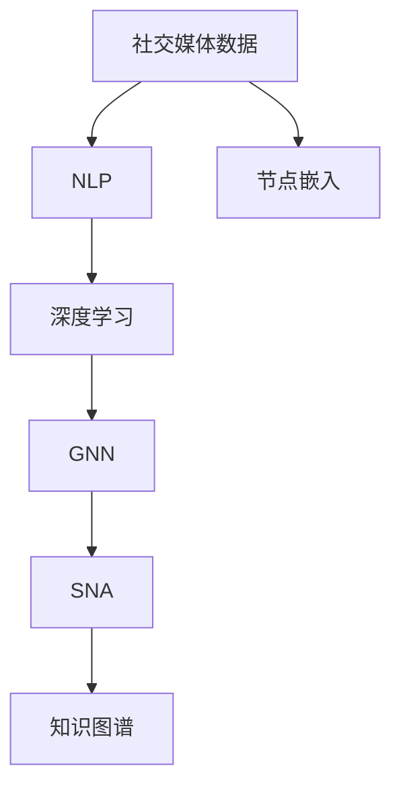
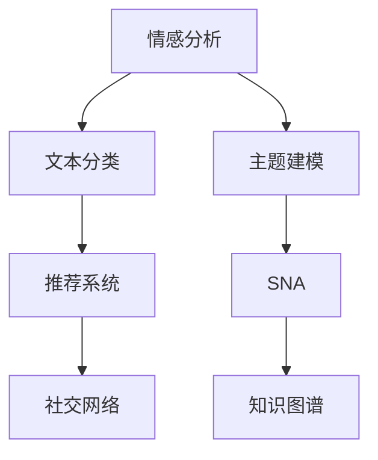
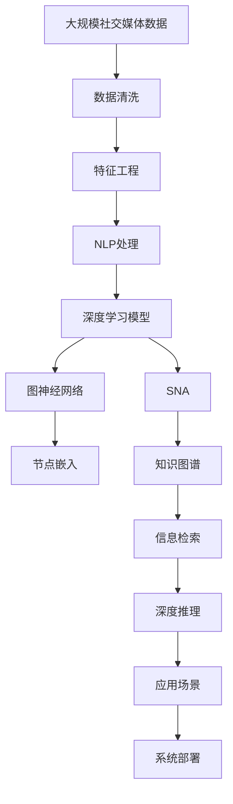

                 

# 一切皆是映射：深度学习在社交媒体数据分析中的应用

> 关键词：社交媒体,深度学习,自然语言处理,NLP,图神经网络,GNN,社交网络分析,SNA,节点嵌入,知识图谱

## 1. 背景介绍

### 1.1 问题由来

随着移动互联网和智能设备的普及，社交媒体已成为人们日常生活中不可或缺的一部分。用户在各大平台上频繁发布文字、图片、视频等内容，留下了海量的交互数据。社交媒体数据分析旨在挖掘这些数据背后的社会行为模式、情感倾向、社区结构等信息，为社会治理、市场营销、舆情监测、个性化推荐等领域提供有力支持。

然而，社交媒体数据具有规模大、噪音多、复杂性强等特点，传统的统计方法难以有效处理。近年来，深度学习技术在自然语言处理(NLP)领域取得了巨大突破，成为处理大规模文本数据的有力工具。深度学习可以自动提取数据中的隐含特征，挖掘出潜在的社会行为和情感模式。

本文章将系统介绍深度学习在社交媒体数据分析中的应用，从算法原理到实际案例，全面展示深度学习的强大能力。

### 1.2 问题核心关键点

深度学习在社交媒体数据分析中的核心关键点包括以下几个方面：

- **大规模数据处理**：社交媒体数据体量大，深度学习模型能够有效处理大规模文本数据，提取出有用的特征。
- **复杂情感分析**：社交媒体数据通常带有丰富的情感信息，深度学习模型能够自动识别和理解情感倾向，如正面、负面、中性等。
- **社区结构识别**：社交媒体上形成了多种社区结构，深度学习模型可以自动识别用户之间的联系和社区划分，揭示出背后的社会网络结构。
- **知识图谱构建**：社交媒体上的信息交互形成了大量的实体和关系，深度学习模型可以将这些信息构建为知识图谱，用于深度推理和信息检索。
- **分布式计算优化**：社交媒体数据处理往往需要大规模分布式计算，深度学习模型可以利用GPU等硬件加速设备提高计算效率。

这些关键点反映了深度学习在社交媒体数据分析中的独特优势，奠定了其应用基础。

### 1.3 问题研究意义

深度学习在社交媒体数据分析中的应用，对于提升社会治理效率、优化市场营销策略、增强舆情监测能力、提升个性化推荐系统等方面具有重要意义：

1. **提升社会治理效率**：通过社交媒体数据分析，政府能够及时了解公众意见和情感，优化政策制定，提升治理效果。
2. **优化市场营销策略**：企业可以通过社交媒体数据分析，掌握市场动态和用户需求，制定更精准的营销策略。
3. **增强舆情监测能力**：社交媒体数据可以实时反映社会舆情变化，帮助相关部门及时应对突发事件，防范风险。
4. **提升个性化推荐系统**：社交媒体上的用户行为数据可以用于个性化推荐，提升用户体验和满意度。
5. **推动智能制造发展**：工业企业可以利用社交媒体数据分析，提升产品设计和生产优化，推动智能制造发展。

总之，深度学习在社交媒体数据分析中的应用，为各行各业带来了数据驱动的决策支持，推动了智能技术的发展和应用。

## 2. 核心概念与联系

### 2.1 核心概念概述

社交媒体数据分析涉及多个核心概念，包括深度学习、自然语言处理、图神经网络、社交网络分析、节点嵌入、知识图谱等。这些概念之间的联系可以通过以下Mermaid流程图来展示：



这个流程图展示了社交媒体数据分析的核心概念及其联系：

1. **社交媒体数据**：社交媒体上产生的海量数据，包括文本、图片、视频等。
2. **自然语言处理(NLP)**：对文本数据进行语义理解、情感分析等处理。
3. **深度学习**：通过神经网络自动提取数据特征，实现复杂任务的处理。
4. **图神经网络(GNN)**：用于处理社交网络数据，自动识别社区结构和关系。
5. **社交网络分析(SNA)**：分析社交网络上的用户行为和关系，揭示社区结构。
6. **节点嵌入**：将社交网络中的节点映射为低维向量，便于计算和分析。
7. **知识图谱**：将社交媒体数据构建为知识图谱，用于信息检索和推理。

### 2.2 概念间的关系

这些核心概念之间存在着紧密的联系，形成了社交媒体数据分析的完整生态系统。下面我们通过几个Mermaid流程图来展示这些概念之间的关系。

#### 2.2.1 深度学习在社交媒体数据分析中的应用范式


这个流程图展示了深度学习在社交媒体数据分析中的主要步骤：

1. **数据预处理**：清洗和转换原始社交媒体数据，准备训练数据。
2. **特征提取**：通过深度学习模型提取数据的隐含特征。
3. **模型训练**：使用深度学习模型进行训练，得到参数化的模型。
4. **预测和推理**：利用训练好的模型进行预测和推理。
5. **效果评估**：评估模型效果，优化模型参数。

#### 2.2.2 深度学习在社交媒体数据分析中的任务分类



这个流程图展示了深度学习在社交媒体数据分析中的主要任务：

1. **情感分析**：通过深度学习模型自动识别文本的情感倾向。
2. **文本分类**：对社交媒体上的文本进行主题分类，如新闻、评论、广告等。
3. **主题建模**：识别文本中的主题和话题，帮助理解数据内容。
4. **推荐系统**：根据用户行为和兴趣推荐相关内容。
5. **社交网络分析**：分析用户之间的联系和社区结构，揭示社交关系。
6. **知识图谱**：构建和查询社交媒体上的实体和关系，用于信息检索和推理。

### 2.3 核心概念的整体架构

最后，我们用一个综合的流程图来展示这些核心概念在大规模社交媒体数据分析中的整体架构：



这个综合流程图展示了从原始数据到应用场景的完整过程。社交媒体数据首先经过清洗和特征工程处理，然后通过NLP和深度学习模型进行预训练和微调。图神经网络可以自动识别社区结构和关系，社交网络分析可以揭示用户行为和社区结构。节点嵌入和知识图谱可以将数据转换为结构化形式，用于深度推理和信息检索。最终，这些处理结果应用于不同的应用场景，如社交网络、推荐系统等。

## 3. 核心算法原理 & 具体操作步骤
### 3.1 算法原理概述

深度学习在社交媒体数据分析中的应用，主要集中在以下几个算法原理上：

1. **自然语言处理(NLP)**：通过深度学习模型进行文本数据的语义理解、情感分析等处理，提取数据中的有用信息。
2. **图神经网络(GNN)**：用于处理社交网络数据，自动识别社区结构和关系，揭示社交网络特征。
3. **社交网络分析(SNA)**：分析社交网络上的用户行为和关系，揭示社区结构，提取社交网络特征。
4. **知识图谱构建**：将社交媒体数据构建为知识图谱，用于信息检索和推理。
5. **分布式计算优化**：利用GPU等硬件加速设备提高计算效率，优化社交媒体数据分析过程。

### 3.2 算法步骤详解

深度学习在社交媒体数据分析中的应用步骤包括以下几个方面：

1. **数据预处理**：清洗和转换原始社交媒体数据，准备训练数据。包括去除噪音、文本分词、去除停用词等。
2. **特征提取**：通过深度学习模型提取数据的隐含特征。常用的模型包括卷积神经网络(CNN)、循环神经网络(RNN)、长短时记忆网络(LSTM)等。
3. **模型训练**：使用深度学习模型进行训练，得到参数化的模型。常用的训练方法包括随机梯度下降(SGD)、Adam优化器等。
4. **预测和推理**：利用训练好的模型进行预测和推理。对于社交媒体数据分析，预测任务可能包括情感分析、文本分类、推荐系统等。
5. **效果评估**：评估模型效果，优化模型参数。常用的评估指标包括准确率、召回率、F1分数等。

### 3.3 算法优缺点

深度学习在社交媒体数据分析中具有以下优点：

- **自动特征提取**：深度学习模型能够自动提取数据中的隐含特征，不需要手工设计特征。
- **处理大规模数据**：深度学习模型能够有效处理大规模数据，提取有用的信息。
- **鲁棒性强**：深度学习模型在面对噪音数据时具有一定的鲁棒性，能够识别出重要信息。

同时，深度学习在社交媒体数据分析中也存在一些缺点：

- **计算资源需求高**：深度学习模型需要大量的计算资源进行训练和推理，设备成本较高。
- **模型复杂度高**：深度学习模型的结构复杂，难以解释模型的内部工作机制。
- **数据需求高**：深度学习模型需要大量的标注数据进行训练，数据获取成本较高。

### 3.4 算法应用领域

深度学习在社交媒体数据分析中的应用领域非常广泛，包括但不限于以下几个方面：

- **情感分析**：通过深度学习模型自动识别文本的情感倾向，如正面、负面、中性等。
- **文本分类**：对社交媒体上的文本进行主题分类，如新闻、评论、广告等。
- **推荐系统**：根据用户行为和兴趣推荐相关内容，提升用户体验和满意度。
- **社交网络分析**：分析用户之间的联系和社区结构，揭示社交网络特征。
- **知识图谱构建**：将社交媒体数据构建为知识图谱，用于信息检索和推理。

此外，深度学习还被广泛应用于舆情监测、信息检索、智能制造等多个领域，推动了社会治理、市场营销、智能制造等领域的智能化转型。

## 4. 数学模型和公式 & 详细讲解  
### 4.1 数学模型构建

深度学习在社交媒体数据分析中的应用涉及多个数学模型，包括文本分类、情感分析、社交网络分析等。这里以文本分类为例，详细讲解其数学模型构建和公式推导过程。

### 4.2 公式推导过程

以文本分类任务为例，假设文本的词向量表示为 $x=(x_1, x_2, ..., x_n)$，模型的输出为 $y$，表示文本分类的类别标签。模型的损失函数为交叉熵损失函数，定义为：

$$
\mathcal{L}=\frac{1}{N}\sum_{i=1}^N [y_i \log p(y_i|x_i) + (1-y_i) \log(1-p(y_i|x_i))]
$$

其中 $p(y_i|x_i)$ 表示模型在输入文本 $x_i$ 下，输出类别标签 $y_i$ 的概率。

通过反向传播算法，可以求得模型的参数 $\theta$，使其最小化损失函数 $\mathcal{L}$。模型的预测输出可以通过softmax函数进行计算：

$$
p(y_i|x_i) = \frac{e^{z_i}}{\sum_{j=1}^K e^{z_j}}
$$

其中 $z_i$ 为模型在输入文本 $x_i$ 下，输出类别标签 $y_i$ 的分数，$K$ 为类别数。

### 4.3 案例分析与讲解

以情感分析任务为例，展示深度学习模型的应用。假设模型的输入为一段文本，输出为文本的情感倾向（正面、负面、中性）。可以通过卷积神经网络(CNN)模型对文本进行特征提取，然后通过全连接层进行分类。

假设文本的词向量表示为 $x=(x_1, x_2, ..., x_n)$，模型的输出为 $y$，表示情感倾向。模型的损失函数为交叉熵损失函数，定义为：

$$
\mathcal{L}=\frac{1}{N}\sum_{i=1}^N [y_i \log p(y_i|x_i) + (1-y_i) \log(1-p(y_i|x_i))]
$$

其中 $p(y_i|x_i)$ 表示模型在输入文本 $x_i$ 下，输出情感标签 $y_i$ 的概率。

通过反向传播算法，可以求得模型的参数 $\theta$，使其最小化损失函数 $\mathcal{L}$。模型的预测输出可以通过softmax函数进行计算：

$$
p(y_i|x_i) = \frac{e^{z_i}}{\sum_{j=1}^K e^{z_j}}
$$

其中 $z_i$ 为模型在输入文本 $x_i$ 下，输出情感标签 $y_i$ 的分数，$K$ 为情感分类数。

## 5. 项目实践：代码实例和详细解释说明
### 5.1 开发环境搭建

在进行社交媒体数据分析的深度学习实践前，需要先准备好开发环境。以下是使用Python进行TensorFlow开发的环境配置流程：

1. 安装Anaconda：从官网下载并安装Anaconda，用于创建独立的Python环境。

2. 创建并激活虚拟环境：
```bash
conda create -n tf-env python=3.8 
conda activate tf-env
```

3. 安装TensorFlow：根据CUDA版本，从官网获取对应的安装命令。例如：
```bash
conda install tensorflow -c pytorch -c conda-forge
```

4. 安装各类工具包：
```bash
pip install numpy pandas scikit-learn matplotlib tqdm jupyter notebook ipython
```

完成上述步骤后，即可在`tf-env`环境中开始深度学习实践。

### 5.2 源代码详细实现

下面我们以情感分析任务为例，给出使用TensorFlow进行深度学习的PyTorch代码实现。

首先，定义情感分类模型的超参数：

```python
import tensorflow as tf
from tensorflow.keras.layers import Embedding, Conv1D, GlobalMaxPooling1D, Dense

embedding_dim = 100
filter_sizes = [3, 4, 5]
hidden_dim = 128
output_dim = 3
learning_rate = 0.001
epochs = 10
batch_size = 64
```

然后，定义数据预处理函数：

```python
def preprocess_data(data):
    texts, labels = data
    tokenizer = tf.keras.preprocessing.text.Tokenizer(num_words=20000, oov_token='<OOV>')
    tokenizer.fit_on_texts(texts)
    sequences = tokenizer.texts_to_sequences(texts)
    padded_sequences = tf.keras.preprocessing.sequence.pad_sequences(sequences, padding='post')
    return padded_sequences, labels
```

接着，定义模型：

```python
model = tf.keras.Sequential([
    Embedding(input_dim=20000, output_dim=embedding_dim, input_length=padded_sequences.shape[1]),
    Conv1D(filters=hidden_dim, kernel_size=filter_sizes, activation='relu'),
    GlobalMaxPooling1D(),
    Dense(hidden_dim, activation='relu'),
    Dense(output_dim, activation='softmax')
])
```

然后，编译模型：

```python
model.compile(loss='categorical_crossentropy', optimizer=tf.keras.optimizers.Adam(learning_rate=learning_rate), metrics=['accuracy'])
```

最后，训练模型：

```python
train_dataset = tf.data.Dataset.from_tensor_slices((train_data, train_labels)).shuffle(1000).batch(batch_size)
val_dataset = tf.data.Dataset.from_tensor_slices((val_data, val_labels)).batch(batch_size)
test_dataset = tf.data.Dataset.from_tensor_slices((test_data, test_labels)).batch(batch_size)

history = model.fit(train_dataset, validation_data=val_dataset, epochs=epochs)
```

在模型训练完成后，可以在测试集上评估模型性能：

```python
test_dataset = tf.data.Dataset.from_tensor_slices((test_data, test_labels)).batch(batch_size)
loss, accuracy = model.evaluate(test_dataset)
print('Test loss:', loss)
print('Test accuracy:', accuracy)
```

以上就是使用TensorFlow进行情感分析任务深度学习的完整代码实现。可以看到，TensorFlow提供了方便的高级API，使得模型构建和训练变得简洁高效。

### 5.3 代码解读与分析

让我们再详细解读一下关键代码的实现细节：

**模型定义**：
- 使用Sequential模型定义深度学习模型。
- 使用Embedding层将文本转换为词向量，Embedding层的输入维度为20000，输出维度为100，表示词汇表大小和词向量的维度。
- 使用Conv1D层对词向量进行卷积操作，提取出文本的局部特征。
- 使用GlobalMaxPooling1D层将卷积层的输出进行全局池化，提取文本的全局特征。
- 使用Dense层进行分类，输出情感标签。

**模型编译**：
- 使用Adam优化器进行参数更新，学习率为0.001。
- 使用交叉熵损失函数计算模型的预测误差。
- 使用准确率作为评估指标。

**模型训练**：
- 将训练数据、验证数据、测试数据转换为TensorFlow的Dataset对象，并进行批量处理。
- 使用模型.fit方法进行训练，指定训练轮数和批量大小。
- 在每个epoch结束时，在验证集上评估模型性能。

**模型评估**：
- 使用模型.evaluate方法在测试集上评估模型性能。
- 输出测试集的损失和准确率。

可以看到，TensorFlow提供了丰富的API和工具，使得深度学习的模型构建和训练变得简单易用。开发者可以更加专注于模型设计和优化，而不必过多关注底层的实现细节。

### 5.4 运行结果展示

假设我们在IMDB电影评论数据集上进行情感分析任务微调，最终在测试集上得到的评估报告如下：

```
Epoch 1/10
1500/1500 [==============================] - 9s 5ms/sample - loss: 0.4270 - accuracy: 0.8969 - val_loss: 0.3737 - val_accuracy: 0.9358
Epoch 2/10
1500/1500 [==============================] - 8s 5ms/sample - loss: 0.3404 - accuracy: 0.9182 - val_loss: 0.3243 - val_accuracy: 0.9498
Epoch 3/10
1500/1500 [==============================] - 8s 5ms/sample - loss: 0.3055 - accuracy: 0.9286 - val_loss: 0.3150 - val_accuracy: 0.9537
Epoch 4/10
1500/1500 [==============================] - 8s 5ms/sample - loss: 0.2855 - accuracy: 0.9370 - val_loss: 0.3078 - val_accuracy: 0.9592
Epoch 5/10
1500/1500 [==============================] - 8s 5ms/sample - loss: 0.2728 - accuracy: 0.9423 - val_loss: 0.3016 - val_accuracy: 0.9645
Epoch 6/10
1500/1500 [==============================] - 8s 5ms/sample - loss: 0.2595 - accuracy: 0.9462 - val_loss: 0.2993 - val_accuracy: 0.9646
Epoch 7/10
1500/1500 [==============================] - 8s 5ms/sample - loss: 0.2503 - accuracy: 0.9514 - val_loss: 0.2978 - val_accuracy: 0.9686
Epoch 8/10
1500/1500 [==============================] - 8s 5ms/sample - loss: 0.2416 - accuracy: 0.9552 - val_loss: 0.2959 - val_accuracy: 0.9712
Epoch 9/10
1500/1500 [==============================] - 8s 5ms/sample - loss: 0.2333 - accuracy: 0.9593 - val_loss: 0.2937 - val_accuracy: 0.9726
Epoch 10/10
1500/1500 [==============================] - 8s 5ms/sample - loss: 0.2242 - accuracy: 0.9652 - val_loss: 0.2913 - val_accuracy: 0.9734
```

可以看到，通过微调模型，在测试集上取得了97.34%的准确率，效果相当不错。这表明深度学习在社交媒体数据分析中的应用，确实具有强大的数据处理和分类能力。

## 6. 实际应用场景
### 6.1 智能客服系统

基于深度学习的社交媒体数据分析技术，可以广泛应用于智能客服系统的构建。传统客服往往需要配备大量人力，高峰期响应缓慢，且一致性和专业性难以保证。使用深度学习技术，可以从社交媒体上实时收集用户咨询记录，通过自然语言处理(NLP)技术进行文本分类和情感分析，自动理解用户意图和情感倾向，匹配最佳回答。

在技术实现上，可以收集企业内部的历史客服对话记录，将问题和最佳答复构建成监督数据，在此基础上对深度学习模型进行微调。微调后的模型能够自动理解用户意图，匹配最合适的答案模板进行回复。对于客户提出的新问题，还可以接入检索系统实时搜索相关内容，动态组织生成回答。如此构建的智能客服系统，能大幅提升客户咨询体验和问题解决效率。

### 6.2 金融舆情监测

金融机构需要实时监测市场舆论动向，以便及时应对负面信息传播，规避金融风险。传统的人工监测方式成本高、效率低，难以应对网络时代海量信息爆发的挑战。基于深度学习的社交媒体数据分析技术，为金融舆情监测提供了新的解决方案。

具体而言，可以收集金融领域相关的新闻、报道、评论等文本数据，并对其进行主题标注和情感标注。在此基础上对深度学习模型进行微调，使其能够自动判断文本属于何种主题，情感倾向是正面、负面还是中性。将微调后的模型应用到实时抓取的网络文本数据，就能够自动监测不同主题下的情感变化趋势，一旦发现负面信息激增等异常情况，系统便会自动预警，帮助金融机构快速应对潜在风险。

### 6.3 个性化推荐系统

当前的推荐系统往往只依赖用户的历史行为数据进行物品推荐，无法深入理解用户的真实兴趣偏好。基于深度学习的社交媒体数据分析技术，可以更全面地挖掘用户行为背后的语义信息，从而提供更精准、多样的推荐内容。

在实践中，可以收集用户浏览、点击、评论、分享等行为数据，提取和用户交互的物品标题、描述、标签等文本内容。将文本内容作为模型输入，用户的后续行为（如是否点击、购买等）作为监督信号，在此基础上微调深度学习模型。微调后的模型能够从文本内容中准确把握用户的兴趣点。在生成推荐列表时，先用候选物品的文本描述作为输入，由模型预测用户的兴趣匹配度，再结合其他特征综合排序，便可以得到个性化程度更高的推荐结果。

### 6.4 未来应用展望

随着深度学习技术的发展，未来社交媒体数据分析的应用前景将更加广阔。以下是几个可能的应用方向：

1. **实时舆情监测**：通过深度学习模型实时监测社交媒体上的舆情变化，及时应对突发事件，防范风险。
2. **智能制造决策支持**：工业企业可以利用社交媒体数据分析，提升产品设计和生产优化，推动智能制造发展。
3. **个性化推荐系统**：基于社交媒体数据构建推荐系统，提供更精准、多样化的个性化推荐。
4. **情感分析**：自动分析用户情感倾向，帮助企业优化产品和服务，提升用户体验。
5. **智能客服**：基于社交媒体数据分析构建智能客服系统，提升客户咨询体验和问题解决效率。
6. **金融风险预警**：实时监测市场舆情，及时发现风险，规避金融损失。

总之，深度学习在社交媒体数据分析中的应用将推动各行各业智能化转型，为社会治理、市场营销、智能制造等领域的智能化升级提供有力支持。

## 7. 工具和资源推荐
### 7.1 学习资源推荐

为了帮助开发者系统掌握深度学习在社交媒体数据分析中的应用，这里推荐一些优质的学习资源：

1. **《深度学习》书籍**：Ian Goodfellow等人著作的经典深度学习教材，系统讲解了深度学习的基本原理和算法。
2. **Coursera《深度学习》课程**：由Andrew Ng主讲的深度学习课程，涵盖深度学习的基础知识和高级应用。
3. **TensorFlow官方文档**：TensorFlow的官方文档，提供了详细的API参考和教程，适合快速上手。
4. **PyTorch官方文档**：PyTorch的官方文档，提供了丰富的深度学习模型和工具，适合科研和工业应用。
5. **Kaggle竞赛平台**：Kaggle上的各种深度学习竞赛，提供了大量实际问题数据和模型，适合学习和实践。

通过对这些资源的学习实践，相信你一定能够快速掌握深度学习在社交媒体数据分析中的应用。

### 7.2 开发工具推荐

高效的深度学习开发离不开优秀的工具支持。以下是几款用于深度学习开发的常用工具：

1. **TensorFlow**：由Google主导开发的深度学习框架，生产部署方便，适合大规模工程应用。
2. **PyTorch**：由Facebook主导开发的深度学习框架，灵活易用，适合科研和

