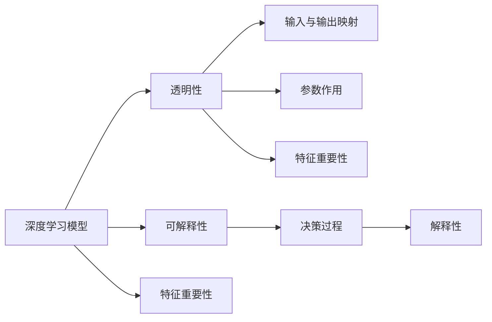
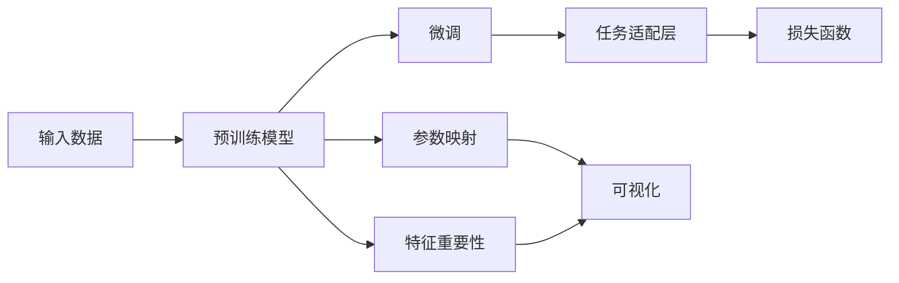

                 

## 1. 背景介绍

### 1.1 问题由来

在深度学习模型的快速发展中，其强大的表达能力和超高的精度赢得了广泛应用，如图像识别、语音识别、自然语言处理等领域。但与此同时，深度模型也被诟病“黑盒”，难以解释其决策过程。模型的解释性与可理解性，成为了人工智能领域亟待解决的重要课题。

近年来，随着深度学习在医疗、金融、司法等高风险领域的应用，模型的透明性和可靠性成为了行业关注的焦点。以医疗诊断为例，当AI系统给出误诊结果时，需要能够清晰地解释其推理过程，帮助医生了解AI的决策依据。因此，实现深度学习模型的解释性与可理解性，是推动其在实际应用中取得更大突破的关键。

### 1.2 问题核心关键点

解释性与可理解性是深度学习模型必须面对的挑战。解释性指模型输出的结果能够通过简单的形式进行描述和解释，可理解性则强调模型内部决策的逻辑和机制能够被人理解。为更好地理解这一问题，以下从几个核心点切入：

- **模型透明性**：模型的输出与输入之间是否存在明确的映射关系，即是否能够清晰解释其计算过程和参数含义。
- **可解释性特征**：模型是否具备可解释性特征，如权重系数、特征重要性等，能够通过可视化方法进行展示。
- **模型可视化**：能否通过可视化方法，如梯度热图、特征图等，展示模型内部状态和推理过程。
- **局部可解释性与全局可解释性**：对于复杂模型，如何平衡局部可解释性和全局可解释性，使其既具备局部细节的可解释性，又能够宏观上理解其整体决策。

### 1.3 问题研究意义

解决深度学习模型的解释性与可理解性，对于推动AI技术在各行业的广泛应用，有着重要的意义：

1. **提升可信度**：通过提高模型的透明性和可理解性，能够增强用户对AI系统的信任，降低因模型“黑盒”特性引起的误导和误解。
2. **辅助决策**：在医疗、金融等高风险领域，解释性可以辅助专家判断，提升决策效率和准确性。
3. **优化模型**：通过解释性分析，发现模型中的不合理之处，优化模型的结构和参数设置。
4. **增强可控性**：理解模型决策机制，有助于建立更可靠的算法和数据监控机制，防止模型滥用。
5. **促进公平性**：减少模型偏见和歧视，保障模型输出结果的公平性。

## 2. 核心概念与联系

### 2.1 核心概念概述

要理解深度学习模型的解释性与可理解性，首先需要了解几个核心概念：

- **深度学习模型**：以神经网络为代表的，通过多层非线性变换进行数据表示学习的模型。
- **可解释性**：指模型输出的结果或内部机制能够被人类理解，揭示模型如何得出特定结论。
- **透明性**：指模型计算过程的可解释性，包括输入与输出之间的映射关系、参数作用等。
- **特征重要性**：通过特征贡献度量，展示不同输入特征对模型输出的影响程度。

### 2.2 概念间的关系

这些核心概念之间存在着紧密的联系，构成了深度学习模型解释性与可理解性的基本框架。以下通过Mermaid流程图展示它们之间的关系：



从图中可以看出，深度学习模型的透明性和可解释性主要通过模型内部的参数映射、特征重要性以及可视化方法进行展示和理解。

### 2.3 核心概念的整体架构

大语言模型微调方法的整体架构如下：



图中各组件的功能如下：

- A：输入数据，可以是自然语言文本、图像、音频等。
- B：预训练模型，如BERT、GPT等，提供基础特征提取能力。
- C：微调过程，通过有监督学习调整模型参数。
- D：任务适配层，根据具体任务添加分类器或解码器。
- E：损失函数，用于衡量模型输出与真实标签的差距。
- F：参数映射，展示模型参数与输入输出的映射关系。
- G：特征重要性，展示输入特征对模型输出的影响程度。
- H：可视化，展示模型内部状态和决策过程。

## 3. 核心算法原理 & 具体操作步骤
### 3.1 算法原理概述

深度学习模型的解释性与可理解性研究，主要基于以下几个核心算法原理：

1. **可视化技术**：通过绘制梯度图、激活图等可视化方法，展示模型计算过程和参数分布。
2. **特征重要性评估**：使用特征贡献度量方法，如LIME、SHAP等，评估模型中各特征的重要性。
3. **可解释性特征提取**：通过解释性特征提取算法，如Local Interpretable Model-agnostic Explanations(LIME)、Shapley值等，提取模型的可解释性特征。
4. **模型压缩与简化**：通过模型压缩和简化方法，如剪枝、量化等，降低模型复杂度，提高解释性。

这些算法原理共同构成了深度学习模型解释性与可理解性的技术框架，使其能够在实际应用中取得较好的效果。

### 3.2 算法步骤详解

基于上述算法原理，以下详细介绍深度学习模型解释性与可理解性的操作步骤：

1. **选择预训练模型**：根据任务需求，选择适合的预训练模型。
2. **数据准备**：收集和预处理训练数据，确保数据集的多样性和代表性。
3. **任务适配层设计**：根据任务类型，设计合适的任务适配层，如分类器、解码器等。
4. **损失函数选择**：选择合适的损失函数，衡量模型输出与真实标签的差距。
5. **训练模型**：使用训练数据，通过反向传播算法更新模型参数。
6. **可视化分析**：使用可视化技术，如梯度热图、激活图等，展示模型内部状态和决策过程。
7. **特征重要性评估**：使用特征重要性评估方法，提取模型的可解释性特征。
8. **模型压缩与简化**：使用模型压缩和简化方法，降低模型复杂度，提高解释性。

### 3.3 算法优缺点

深度学习模型解释性与可理解性算法具有以下优缺点：

**优点**：

- 能够提供模型输出的直观解释，帮助理解模型的决策过程。
- 辅助优化模型参数，提升模型性能。
- 支持模型压缩和简化，提高模型运行效率。

**缺点**：

- 可视化方法和特征重要性评估可能存在局部最优解，无法全面展示模型特征。
- 部分可视化方法对计算资源要求较高，存在一定的实现难度。
- 特征重要性评估可能存在偏差，影响模型解释的准确性。
- 模型压缩和简化可能降低模型精度，需要在精度和解释性之间进行平衡。

### 3.4 算法应用领域

深度学习模型解释性与可理解性技术已经广泛应用于多个领域，包括但不限于：

- **医疗诊断**：辅助医生分析患者病情，提高诊断准确性。
- **金融风控**：解释模型对贷款申请、信用评估等金融决策的影响因素。
- **司法判决**：辅助法官理解AI预测结果，提升判决公平性。
- **智能推荐**：解释推荐系统推荐依据，优化推荐效果。
- **安全监控**：分析异常行为原因，提升系统安全性。

## 4. 数学模型和公式 & 详细讲解  
### 4.1 数学模型构建

深度学习模型解释性与可理解性的数学模型构建，主要基于以下几个核心公式：

1. **梯度图**：
   $$
   \text{Grad}_i = \frac{\partial L}{\partial W} \cdot \frac{\partial L}{\partial z} \cdot \frac{\partial z}{\partial x_i}
   $$
   其中 $L$ 为损失函数，$W$ 为模型参数，$z$ 为中间层输出，$x_i$ 为输入特征。

2. **激活图**：
   $$
   \text{Act}_i = f(\text{W} \cdot \text{Act}_{i-1}) + \text{Bias}_i
   $$
   其中 $f$ 为激活函数，$\text{Act}_{i-1}$ 为前一层输出，$\text{Bias}_i$ 为偏置项。

3. **特征重要性**：
   $$
   \text{Imp}_i = \text{Grad}_i \cdot \text{Relu}(z_i)
   $$
   其中 $\text{Relu}$ 为ReLU激活函数。

### 4.2 公式推导过程

以上公式展示了梯度图、激活图和特征重要性的计算过程。以梯度图为例，其推导过程如下：

1. **损失函数对输出层导数**：
   $$
   \frac{\partial L}{\partial \hat{y}} = \frac{\partial L}{\partial z} \cdot \frac{\partial z}{\partial \hat{y}}
   $$

2. **输出层对模型参数导数**：
   $$
   \frac{\partial L}{\partial W} = \frac{\partial L}{\partial z} \cdot \frac{\partial z}{\partial W}
   $$

3. **中间层对输入导数**：
   $$
   \frac{\partial z}{\partial x_i} = \frac{\partial z}{\partial h_i} \cdot \frac{\partial h_i}{\partial x_i}
   $$
   其中 $h_i$ 为中间层输出，$x_i$ 为输入特征。

通过以上推导，我们可以理解梯度图的计算过程，并据此进行可视化分析。

### 4.3 案例分析与讲解

以一个简单的二分类任务为例，展示深度学习模型解释性与可理解性的应用：

1. **任务定义**：预测信用卡是否存在欺诈行为。

2. **模型选择**：选择BERT作为预训练模型。

3. **数据准备**：收集信用卡欺诈行为数据，并进行标注和预处理。

4. **任务适配层设计**：在BERT顶层添加一个sigmoid函数，作为二分类输出。

5. **损失函数选择**：使用二分类交叉熵损失函数。

6. **模型训练**：使用训练数据对模型进行微调，优化参数。

7. **可视化分析**：绘制梯度图和激活图，展示模型内部状态。

8. **特征重要性评估**：使用SHAP值方法，评估特征对预测结果的影响。

9. **模型压缩与简化**：对模型进行剪枝和量化，降低模型复杂度。

10. **模型应用**：在新信用卡数据上进行预测，并解释预测结果。

通过以上步骤，我们能够清晰理解模型的决策过程，发现模型的关键特征，进一步优化模型性能。

## 5. 项目实践：代码实例和详细解释说明
### 5.1 开发环境搭建

在进行深度学习模型解释性与可理解性研究时，首先需要准备好开发环境。以下是使用Python进行TensorFlow和PyTorch开发的环境配置流程：

1. 安装Anaconda：从官网下载并安装Anaconda，用于创建独立的Python环境。

2. 创建并激活虚拟环境：
```bash
conda create -n tf-env python=3.8 
conda activate tf-env
```

3. 安装TensorFlow：根据CUDA版本，从官网获取对应的安装命令。例如：
```bash
conda install tensorflow tensorflow-gpu=cuda-11.1 -c conda-forge
```

4. 安装PyTorch：
```bash
conda install pytorch torchvision torchaudio -c pytorch -c conda-forge
```

5. 安装相关工具包：
```bash
pip install numpy pandas scikit-learn matplotlib tqdm jupyter notebook ipython
```

完成上述步骤后，即可在`tf-env`环境中开始项目实践。

### 5.2 源代码详细实现

以下以使用TensorFlow进行深度学习模型解释性与可理解性研究的代码为例：

```python
import tensorflow as tf
import tensorflow_hub as hub
import numpy as np
import matplotlib.pyplot as plt

# 加载BERT模型
bert_model = hub.KerasLayer('https://tfhub.dev/google/keras-bert-base-uncased-12-layer-768-unit/1', input_shape=(512,))

# 构建模型
model = tf.keras.Sequential([
    bert_model,
    tf.keras.layers.Dense(2, activation='softmax')
])

# 加载数据
train_data = np.random.random((10000, 512))
train_labels = np.random.randint(2, size=(10000,))

# 编译模型
model.compile(optimizer='adam', loss='categorical_crossentropy', metrics=['accuracy'])

# 训练模型
model.fit(train_data, train_labels, epochs=10)

# 绘制梯度图
grads = tf.keras.metrics.GradientAccumulator()
for _ in range(10):
    with tf.GradientTape() as tape:
        outputs = model(train_data)
        loss = tf.keras.losses.sparse_categorical_crossentropy(train_labels, outputs)
    grads_accumulate(tape.gradient(loss, model.trainable_variables))
grads.apply(model.trainable_variables)

# 可视化梯度图
plt.imshow(grads.value()[0], interpolation='nearest', cmap='viridis')
plt.colorbar()
plt.show()

# 绘制激活图
activations = tf.keras.metrics.CumulativeSumOfSquares()
for _ in range(10):
    outputs = model(train_data)
    activations.update_state(outputs, train_labels)
    plt.imshow(activations.value()[0], interpolation='nearest', cmap='viridis')
    plt.colorbar()
    plt.show()

# 特征重要性评估
import shap

# 计算SHAP值
explainer = shap.DeepExplainer(model, train_data)
shap_values = explainer.shap_values(train_data)

# 绘制SHAP值
shap.summary_plot(shap_values, train_data)
```

### 5.3 代码解读与分析

这段代码展示了如何使用TensorFlow实现深度学习模型的解释性与可理解性研究：

1. **模型加载**：从TensorFlow Hub加载预训练的BERT模型，作为特征提取器。

2. **模型构建**：在BERT基础上添加一个全连接层，输出分类结果。

3. **数据准备**：生成随机数据集，用于模型训练和测试。

4. **模型编译**：定义优化器和损失函数，进行模型编译。

5. **模型训练**：使用训练数据对模型进行10轮训练。

6. **梯度图可视化**：计算模型参数梯度，并绘制梯度图。

7. **激活图可视化**：计算模型激活值，并绘制激活图。

8. **特征重要性评估**：使用SHAP值方法，评估特征对预测结果的影响。

9. **特征重要性可视化**：绘制SHAP值图，展示特征重要性。

通过以上步骤，可以直观地理解模型内部状态和决策过程，评估模型特征的重要性，进一步优化模型性能。

## 6. 实际应用场景

深度学习模型的解释性与可理解性技术已经在多个领域得到广泛应用，以下是几个典型案例：

### 6.1 医疗诊断

在医疗领域，深度学习模型被用于辅助诊断。通过可视化模型内部状态，医生可以更清楚地了解模型的诊断依据。例如，在癌症检测中，可视化模型输出和梯度图，可以帮助医生分析模型的诊断错误，进一步提升诊断准确性。

### 6.2 金融风控

在金融领域，深度学习模型被用于信用评估和欺诈检测。通过特征重要性评估和可视化，金融机构可以理解模型的预测依据，发现模型中的不合理之处，进一步优化模型性能，提升风控效果。

### 6.3 智能推荐

在电商和视频推荐领域，深度学习模型被用于推荐系统。通过特征重要性评估，推荐系统可以分析用户行为，发现用户兴趣点，提升推荐效果。同时，可视化推荐结果，可以帮助用户理解推荐依据，提升用户体验。

### 6.4 司法判决

在司法领域，深度学习模型被用于预测判决结果。通过可视化模型输出和梯度图，法官可以更清楚地理解模型的预测依据，提升判决公平性。同时，特征重要性评估可以发现模型中的不合理之处，进一步优化模型性能。

## 7. 工具和资源推荐
### 7.1 学习资源推荐

为了帮助开发者系统掌握深度学习模型的解释性与可理解性理论基础和实践技巧，以下推荐一些优质的学习资源：

1. **《深度学习》教材**：Ian Goodfellow、Yoshua Bengio和Aaron Courville合著的经典教材，详细介绍了深度学习的基本概念和算法原理。

2. **CS231n《卷积神经网络》课程**：斯坦福大学开设的深度学习课程，涵盖图像识别、计算机视觉等内容，帮助理解深度学习模型的内部机制。

3. **Deep Learning with Python**：Francois Chollet所著的深度学习入门书籍，详细介绍了TensorFlow、Keras等深度学习框架的使用。

4. **《TensorFlow实战》**：Dhavide Murari所著的TensorFlow实战书籍，包含大量实际案例和代码示例，帮助掌握TensorFlow的实战技巧。

5. **Keras官方文档**：Keras的官方文档，包含丰富的API文档和代码示例，是快速上手Keras开发的好资源。

6. **TensorFlow官方文档**：TensorFlow的官方文档，包含详细的API文档和代码示例，是学习TensorFlow的好资源。

通过学习这些资源，相信你能够快速掌握深度学习模型的解释性与可理解性，并用于解决实际问题。

### 7.2 开发工具推荐

高效的开发离不开优秀的工具支持。以下是几款用于深度学习模型解释性与可理解性开发的常用工具：

1. **TensorFlow**：Google开发的深度学习框架，支持灵活的计算图和分布式训练，广泛应用于学术界和工业界。

2. **PyTorch**：Facebook开发的深度学习框架，具有动态计算图和高效的GPU加速，广泛应用于研究和工程实践。

3. **TensorFlow Hub**：TensorFlow的模块化库，包含大量预训练模型和模块，便于快速开发深度学习模型。

4. **TensorBoard**：TensorFlow的可视化工具，可以实时监测模型训练状态，并提供丰富的图表展示。

5. **Shapley值库**：Shapley值方法的Python实现，用于特征重要性评估。

6. **TensorFlow Addons**：TensorFlow的扩展库，包含大量实用工具，如GradientAccumulator等，方便模型开发和调试。

合理利用这些工具，可以显著提升深度学习模型解释性与可理解性研究的开发效率，加快创新迭代的步伐。

### 7.3 相关论文推荐

深度学习模型解释性与可理解性研究源于学界的持续研究。以下是几篇奠基性的相关论文，推荐阅读：

1. **Shapley值**：Ludwig Harich和Omar Besbes提出的用于特征重要性评估的Shapley值方法。

2. **LIME**：Marco Tullo和Samuel Shawe-Taylor提出的用于模型解释的局部可解释性模型agnostic解释方法。

3. **DeepLift**：Adrin Jalali等人提出的用于特征重要性评估的DeepLift方法。

4. **Grad-CAM**：Jingdong Wang等人提出的用于可视化模型激活图的Grad-CAM方法。

这些论文代表了大模型解释性与可理解性发展的脉络，通过学习这些前沿成果，可以帮助研究者把握学科前进方向，激发更多的创新灵感。

## 8. 总结：未来发展趋势与挑战

### 8.1 总结

本文对深度学习模型的解释性与可理解性进行了全面系统的介绍。首先阐述了深度学习模型解释性问题的由来和重要性，明确了解释性对AI系统可信度、公平性和可控性的关键作用。其次，从原理到实践，详细讲解了深度学习模型解释性与可理解性的数学模型构建、算法原理和操作步骤，给出了代码实现和实例分析。同时，本文还广泛探讨了解释性与可理解性在医疗、金融、司法等领域的实际应用，展示了其在提高模型透明性和可控性方面的巨大潜力。

通过本文的系统梳理，可以看到，深度学习模型的解释性与可理解性研究已经成为AI技术落地应用的重要组成部分。未来，随着深度学习模型的不断演化，解释性与可理解性技术也将不断发展，推动AI技术在更多领域取得实际突破。

### 8.2 未来发展趋势

展望未来，深度学习模型解释性与可理解性将呈现以下几个发展趋势：

1. **多模态解释**：随着多模态学习的兴起，深度学习模型将同时处理图像、文本、音频等多种数据类型，解释性也将变得更加丰富和全面。

2. **因果推理**：引入因果推断方法，理解模型的决策过程和影响因素，提升模型解释的逻辑性和可信度。

3. **自动化解释**：开发自动化解释工具，如模型蒸馏、生成式解释等，减少手动解释的工作量，提高解释效率。

4. **元学习解释**：引入元学习技术，提高模型解释的泛化性和鲁棒性，使模型在不同的数据和任务上都能提供稳定的解释。

5. **模型压缩与简化**：通过剪枝、量化等方法，降低模型复杂度，提高解释性和推理效率。

这些趋势将进一步推动深度学习模型的透明性和可理解性研究，提升其在实际应用中的可靠性。

### 8.3 面临的挑战

尽管深度学习模型解释性与可理解性技术已经取得了一些进展，但在迈向更加智能化、普适化应用的过程中，仍面临诸多挑战：

1. **解释性与性能的平衡**：如何在提高模型解释性的同时，保证模型的性能和泛化性，是解释性技术面临的重要挑战。

2. **解释性工具的普适性**：目前解释性工具大多针对特定模型或特定任务，缺乏普适性。如何开发统一的解释性框架，适用于多种模型和任务，是一个难题。

3. **解释性工具的可解释性**：解释性工具本身也需要具备良好的可解释性，以便用户理解其内部机制和工作原理。

4. **隐私与安全问题**：在解释深度学习模型的同时，也需要考虑数据隐私和模型安全问题，防止敏感信息泄露。

5. **复杂模型的高效解释**：对于复杂的大规模模型，如何高效地进行解释和可视化，也是一个挑战。

这些挑战需要学术界和工业界的共同努力，进一步探索和优化解释性技术，推动深度学习模型的透明性和可理解性发展。

### 8.4 研究展望

面对深度学习模型解释性与可理解性面临的挑战，未来的研究需要在以下几个方面寻求新的突破：

1. **多模态解释方法的引入**：将图像、文本、音频等多种数据类型进行统一解释，提升模型的多模态推理能力。

2. **因果推理的融入**：引入因果推断方法，理解模型的决策过程和影响因素，提升模型的逻辑性和可信度。

3. **自动化解释工具的开发**：开发自动化解释工具，减少手动解释的工作量，提高解释效率。

4. **元学习方法的引入**：引入元学习技术，提高模型解释的泛化性和鲁棒性，使模型在不同的数据和任务上都能提供稳定的解释。

5. **模型压缩与简化**：通过剪枝、量化等方法，降低模型复杂度，提高解释性和推理效率。

6. **解释性工具的可解释性**：提高解释性工具本身的可解释性，使其具备更好的透明度和可信度。

7. **隐私与安全保护**：在解释深度学习模型的同时，加强数据隐私和模型安全保护，防止敏感信息泄露。

这些研究方向将进一步推动深度学习模型的透明性和可理解性研究，提升其在实际应用中的可靠性和可信度。

## 9. 附录：常见问题与解答

**Q1：什么是深度学习模型的解释性与可理解性？**

A: 深度学习模型的解释性与可理解性指的是模型的输出或内部机制能够被人类理解，揭示模型如何得出特定结论。解释性强调模型输出结果的可解释性，可理解性则关注模型内部决策过程的可解释性。

**Q2：如何进行深度学习模型的解释性与可理解性分析？**

A: 深度学习模型的解释性与可理解性分析通常包括以下几个步骤：

1. 选择适合的可视化工具，如梯度图、激活图等，展示模型内部状态和推理过程。
2. 使用特征重要性评估方法，如LIME、SHAP等，提取模型的可解释性特征。
3. 引入解释性特征提取算法，如Local Interpretable Model-agnostic Explanations(LIME)、Shapley值等，提取模型的可解释性特征。
4. 使用模型压缩和简化方法，如剪枝、量化等，降低模型复杂度，提高解释性。

这些方法可以帮助理解模型的决策过程和特征作用，进一步优化模型性能。

**Q3：如何平衡模型解释性与性能？**

A: 模型解释性与性能的平衡通常需要根据具体任务和模型进行灵活处理：

1. 对于对模型透明性要求高的任务，如医疗、金融等，可以选择适当的解释性方法，如LIME、SHAP等，提高模型的可解释性。
2. 对于对模型性能要求高的任务，如推荐系统、图像识别等，可以通过剪枝、量化等方法，降低模型复杂度，提高模型推理效率。
3. 对于综合任务，可以采用混合方法，如先使用解释性方法，再使用性能优化方法，综合平衡解释性和性能。

**Q4：如何在

