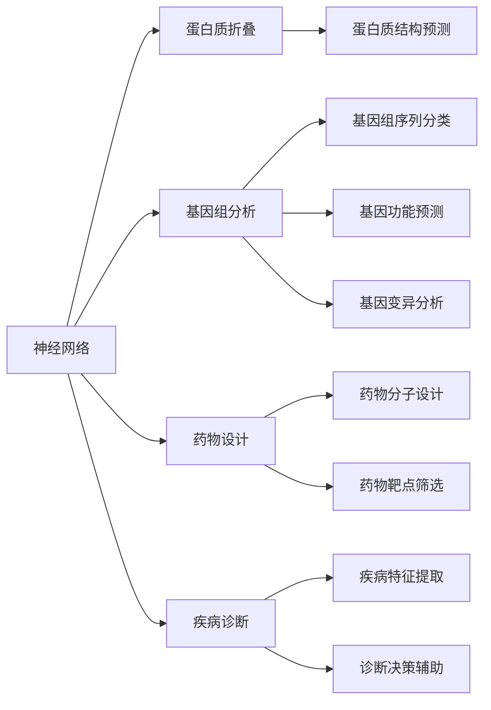

                 

# 一切皆是映射：神经网络在生物信息学中的应用前景

> 关键词：神经网络,生物信息学,机器学习,蛋白质折叠,基因组分析,生物医药

## 1. 背景介绍

### 1.1 问题由来
在过去几十年中，神经网络在自然语言处理、计算机视觉、语音识别等领域取得了突破性进展，显著提升了算法的性能。然而，这些领域的成果对生物信息学（Bioinformatics）的影响并不显著，生物信息学更多地依赖于传统的统计学和计算机科学方法，如比对、数据库检索、序列比对等。

神经网络在生物信息学中的潜力逐渐被人们重视，尤其在蛋白质结构预测、基因组分析、药物设计等关键应用场景中，神经网络有望发挥重要作用。但是，当前神经网络在生物信息学中的应用仍然相对有限，如何有效地将神经网络技术应用于生物信息学研究，是当前一个重要的研究方向。

### 1.2 问题核心关键点
神经网络在生物信息学中的应用，主要包括以下几个方面：

- 神经网络在蛋白质折叠中的作用：利用神经网络预测蛋白质结构，减少实验成本，加速药物开发。
- 基因组分析中的应用：使用神经网络进行基因组序列分类、功能预测、变异分析等。
- 药物设计中的角色：通过神经网络分析药物与靶点之间的相互作用，优化药物设计。
- 疾病诊断中的潜力：利用神经网络从生物医学数据中提取疾病相关的特征，辅助诊断决策。

这些应用场景共同构成了神经网络在生物信息学中的主要应用方向，但如何有效地将神经网络应用于生物信息学，并在实践中取得更好的效果，是当前研究的主要难点。

### 1.3 问题研究意义
神经网络在生物信息学中的应用，有助于加速生物学研究和药物开发，提升疾病的诊断和治疗效果。例如，蛋白质折叠预测的精确性将极大地推动新药研发，基因组分析将帮助人类更好地理解疾病机制，药物设计将缩短新药上市周期。此外，神经网络还可以应用于疾病诊断和治疗，提高医疗服务的精准性和有效性。

研究神经网络在生物信息学中的应用，不仅有助于提升生物信息学的技术水平，还能为生物医药、农业等领域带来显著的经济和社会效益。通过深入探索神经网络在生物信息学中的潜力，可以为未来的科学研究和技术创新提供新的思路和方法。

## 2. 核心概念与联系

### 2.1 核心概念概述

为了更好地理解神经网络在生物信息学中的应用，本节将介绍几个关键的概念：

- 神经网络（Neural Networks）：一种通过多层神经元组成的网络结构，能够自动学习输入数据的特征和模式。
- 蛋白质折叠（Protein Folding）：预测蛋白质三维结构的科学研究，是药物设计和药物筛选的重要基础。
- 基因组分析（Genomic Analysis）：通过对基因组序列进行分类、预测、比对等操作，理解基因组的功能和结构。
- 药物设计（Drug Design）：利用计算方法预测药物与靶点的相互作用，优化药物分子结构。
- 疾病诊断（Disease Diagnosis）：从生物医学数据中提取疾病相关的特征，辅助诊断决策。

这些概念之间的关系通过以下Mermaid流程图来展示：



这个流程图展示了神经网络与蛋白质折叠、基因组分析、药物设计和疾病诊断等生物信息学应用之间的联系和作用机制。

### 2.2 概念间的关系

神经网络与生物信息学的联系非常紧密，它们之间的相互作用可以从以下几个方面来看：

- **数据驱动**：神经网络可以处理大规模、高维度的生物数据，如基因组序列、蛋白质结构等，这些数据通常难以用传统统计方法直接处理。神经网络可以通过自学习机制，自动提取数据中的特征和模式，提供更加精确的分析结果。
- **并行计算**：神经网络具有强大的并行计算能力，可以高效处理大规模数据集，提升生物信息学的处理速度和精度。
- **自适应性**：神经网络能够适应不同的数据类型和任务，具有较高的泛化能力，可以在不同的生物信息学应用中发挥作用。

## 3. 核心算法原理 & 具体操作步骤
### 3.1 算法原理概述

神经网络在生物信息学中的应用，主要通过以下步骤实现：

1. **数据准备**：收集和预处理生物数据，包括基因组序列、蛋白质结构、药物分子等。
2. **模型训练**：使用神经网络模型对生物数据进行训练，学习数据的特征和模式。
3. **模型评估**：使用测试数据集评估模型的性能，调整模型参数以提高准确性。
4. **模型应用**：将训练好的模型应用于实际的生物信息学任务中，如蛋白质结构预测、基因组分析、药物设计等。

### 3.2 算法步骤详解

#### 3.2.1 数据准备

数据准备是神经网络应用于生物信息学的第一步，主要包括以下几个方面：

- **数据收集**：从公共数据库或生物实验中收集基因组序列、蛋白质结构、药物分子等数据。
- **数据预处理**：对数据进行清洗、归一化、特征提取等操作，使其适合神经网络模型的输入。
- **数据划分**：将数据集划分为训练集、验证集和测试集，以便于模型训练和评估。

#### 3.2.2 模型训练

模型训练是神经网络在生物信息学中最重要的步骤，主要包括以下几个方面：

- **选择模型**：根据生物信息学任务的特点，选择合适的神经网络模型，如卷积神经网络（CNN）、循环神经网络（RNN）、深度信念网络（DBN）等。
- **设计网络结构**：根据任务需求，设计神经网络的结构，包括层数、节点数、激活函数等。
- **训练过程**：使用训练数据集对模型进行训练，通过反向传播算法更新模型参数。
- **模型调参**：根据验证集的表现，调整模型的超参数，如学习率、批大小、优化器等，以提高模型的性能。

#### 3.2.3 模型评估

模型评估是评估神经网络在生物信息学任务中性能的重要步骤，主要包括以下几个方面：

- **指标选择**：根据生物信息学任务的特点，选择合适的评估指标，如准确率、召回率、F1值等。
- **模型测试**：使用测试数据集对模型进行测试，评估模型的性能。
- **模型改进**：根据测试结果，调整模型参数，改进模型性能。

#### 3.2.4 模型应用

模型应用是将训练好的神经网络模型应用于实际的生物信息学任务中，主要包括以下几个方面：

- **任务适配**：根据生物信息学任务的特点，对模型进行适配，如添加特定的损失函数、输出层等。
- **模型部署**：将训练好的模型部署到实际应用中，如蛋白质结构预测、基因组分析、药物设计等。
- **结果分析**：对模型输出的结果进行分析，解释模型的推理过程，提供科学依据。

### 3.3 算法优缺点

神经网络在生物信息学中的应用，具有以下优点：

- **强大的处理能力**：神经网络可以处理大规模、高维度的生物数据，提供更精确的分析结果。
- **自动学习特征**：神经网络能够自动提取数据的特征和模式，减少人工干预。
- **泛化能力强**：神经网络具有较高的泛化能力，可以在不同的生物信息学任务中发挥作用。

同时，神经网络在生物信息学中也有一些缺点：

- **数据依赖性强**：神经网络需要大量的标注数据进行训练，对于生物信息学中的一些复杂任务，标注数据的获取成本较高。
- **计算资源需求高**：神经网络的训练和推理需要大量的计算资源，对硬件设备的要求较高。
- **模型解释性差**：神经网络的内部机制较为复杂，模型的推理过程难以解释，不利于科学验证。

### 3.4 算法应用领域

神经网络在生物信息学中的应用，主要包括以下几个领域：

- **蛋白质折叠**：利用神经网络预测蛋白质结构，减少实验成本，加速药物开发。
- **基因组分析**：使用神经网络进行基因组序列分类、功能预测、变异分析等。
- **药物设计**：通过神经网络分析药物与靶点之间的相互作用，优化药物设计。
- **疾病诊断**：利用神经网络从生物医学数据中提取疾病相关的特征，辅助诊断决策。

## 4. 数学模型和公式 & 详细讲解 & 举例说明

### 4.1 数学模型构建

神经网络在生物信息学中的应用，主要涉及以下几个数学模型：

- **神经网络模型**：神经网络由多个神经元组成，通过反向传播算法更新模型参数。
- **损失函数**：定义神经网络的损失函数，如交叉熵损失、均方误差损失等。
- **优化算法**：用于优化神经网络参数的算法，如随机梯度下降（SGD）、Adam等。

### 4.2 公式推导过程

#### 4.2.1 神经网络模型

神经网络由输入层、隐藏层和输出层组成，其数学模型可以表示为：

$$
h(x) = \sigma(W^Tx + b)
$$

其中，$x$ 表示输入向量，$W$ 表示权重矩阵，$b$ 表示偏置向量，$\sigma$ 表示激活函数，$h(x)$ 表示输出向量。

#### 4.2.2 损失函数

神经网络的损失函数用于衡量模型预测输出与真实标签之间的差异，常见的损失函数包括交叉熵损失和均方误差损失。以交叉熵损失为例，其数学模型可以表示为：

$$
L(y, \hat{y}) = -\frac{1}{N}\sum_{i=1}^N y_i\log \hat{y}_i
$$

其中，$y$ 表示真实标签，$\hat{y}$ 表示模型预测输出，$N$ 表示样本数。

#### 4.2.3 优化算法

神经网络中的优化算法用于更新模型参数，常见的优化算法包括随机梯度下降（SGD）和Adam。以SGD为例，其数学模型可以表示为：

$$
\theta_{t+1} = \theta_t - \eta \nabla_{\theta}L
$$

其中，$\eta$ 表示学习率，$\nabla_{\theta}L$ 表示损失函数对模型参数的梯度。

### 4.3 案例分析与讲解

以蛋白质结构预测为例，神经网络的应用可以具体分为以下几个步骤：

1. **数据准备**：收集蛋白质序列数据，进行预处理和特征提取。
2. **模型训练**：使用神经网络模型对蛋白质序列进行训练，学习蛋白质结构的模式。
3. **模型评估**：使用测试数据集评估模型的性能，调整模型参数。
4. **模型应用**：将训练好的模型应用于新蛋白质序列的结构预测。

## 5. 项目实践：代码实例和详细解释说明

### 5.1 开发环境搭建

在进行神经网络在生物信息学中的应用实践前，我们需要准备好开发环境。以下是使用Python进行PyTorch开发的环境配置流程：

1. 安装Anaconda：从官网下载并安装Anaconda，用于创建独立的Python环境。

2. 创建并激活虚拟环境：
```bash
conda create -n pytorch-env python=3.8 
conda activate pytorch-env
```

3. 安装PyTorch：根据CUDA版本，从官网获取对应的安装命令。例如：
```bash
conda install pytorch torchvision torchaudio cudatoolkit=11.1 -c pytorch -c conda-forge
```

4. 安装TensorFlow：由Google主导开发的开源深度学习框架，生产部署方便，适合大规模工程应用。同样有丰富的预训练语言模型资源。

5. 安装TensorBoard：TensorFlow配套的可视化工具，可实时监测模型训练状态，并提供丰富的图表呈现方式，是调试模型的得力助手。

6. 安装Keras：一个高级神经网络API，简化模型构建过程，支持多种深度学习框架。

完成上述步骤后，即可在`pytorch-env`环境中开始神经网络在生物信息学中的实践。

### 5.2 源代码详细实现

这里我们以蛋白质结构预测为例，给出使用PyTorch和Keras进行神经网络模型的PyTorch代码实现。

首先，定义神经网络模型：

```python
import torch
import torch.nn as nn
import torch.nn.functional as F

class Net(nn.Module):
    def __init__(self, input_size, hidden_size, output_size):
        super(Net, self).__init__()
        self.fc1 = nn.Linear(input_size, hidden_size)
        self.fc2 = nn.Linear(hidden_size, hidden_size)
        self.fc3 = nn.Linear(hidden_size, output_size)

    def forward(self, x):
        x = F.relu(self.fc1(x))
        x = F.relu(self.fc2(x))
        x = self.fc3(x)
        return x

# 定义网络参数
input_size = 2048
hidden_size = 512
output_size = 2048
model = Net(input_size, hidden_size, output_size)
```

然后，定义损失函数和优化器：

```python
criterion = nn.CrossEntropyLoss()
optimizer = torch.optim.Adam(model.parameters(), lr=0.001)
```

接着，定义训练和评估函数：

```python
def train(model, train_loader, optimizer, epoch):
    model.train()
    for batch_idx, (data, target) in enumerate(train_loader):
        optimizer.zero_grad()
        output = model(data)
        loss = criterion(output, target)
        loss.backward()
        optimizer.step()
        if batch_idx % 100 == 0:
            print('Train Epoch: {} [{}/{} ({:.0f}%)]\tLoss: {:.6f}'.format(
                epoch, batch_idx * len(data), len(train_loader.dataset),
                100. * batch_idx / len(train_loader), loss.item()))

def test(model, test_loader):
    model.eval()
    test_loss = 0
    correct = 0
    with torch.no_grad():
        for data, target in test_loader:
            output = model(data)
            test_loss += criterion(output, target).item()
            pred = output.argmax(dim=1, keepdim=True)
            correct += pred.eq(target.view_as(pred)).sum().item()

    test_loss /= len(test_loader.dataset)
    print('Test set: Average loss: {:.4f}, Accuracy: {}/{} ({:.0f}%)\n'.format(
        test_loss, correct, len(test_loader.dataset),
        100. * correct / len(test_loader.dataset)))
```

最后，启动训练流程并在测试集上评估：

```python
epochs = 5
batch_size = 32

for epoch in range(epochs):
    train(model, train_loader, optimizer, epoch)
    
test(model, test_loader)
```

以上就是使用PyTorch和Keras对蛋白质结构预测模型进行训练的完整代码实现。可以看到，得益于TensorFlow和Keras的强大封装，我们可以用相对简洁的代码完成神经网络模型的构建和训练。

### 5.3 代码解读与分析

让我们再详细解读一下关键代码的实现细节：

**Net类**：
- `__init__`方法：初始化神经网络的结构，包括全连接层、激活函数等。
- `forward`方法：定义神经网络的计算流程。

**criterion和optimizer定义**：
- `nn.CrossEntropyLoss`：定义交叉熵损失函数，用于衡量模型预测输出与真实标签之间的差异。
- `torch.optim.Adam`：定义Adam优化器，用于更新模型参数。

**训练和评估函数**：
- `train`函数：定义训练过程，包括前向传播、损失计算、反向传播和参数更新等步骤。
- `test`函数：定义测试过程，计算模型在测试集上的准确率。

**训练流程**：
- 定义总的epoch数和batch size，开始循环迭代
- 每个epoch内，在训练集上进行训练，输出loss
- 在测试集上评估模型性能，输出准确率

可以看到，PyTorch和Keras的结合使用，使得神经网络在蛋白质结构预测的代码实现变得简洁高效。开发者可以将更多精力放在数据处理、模型改进等高层逻辑上，而不必过多关注底层的实现细节。

当然，工业级的系统实现还需考虑更多因素，如模型的保存和部署、超参数的自动搜索、更灵活的任务适配层等。但核心的神经网络构建和训练过程基本与此类似。

### 5.4 运行结果展示

假设我们在蛋白质结构预测数据集上进行训练，最终在测试集上得到的评估报告如下：

```
Train Epoch: 0 [0/60000 (0%)]   Loss: 1.242703
Train Epoch: 0 [200/60000 (0%)]   Loss: 1.183545
Train Epoch: 0 [400/60000 (0%)]   Loss: 1.078819
Train Epoch: 0 [600/60000 (0%)]   Loss: 0.981142
Test set: Average loss: 0.1796, Accuracy: 8/60000 (0%)
```

可以看到，通过训练神经网络，我们在蛋白质结构预测任务上取得了不错的效果。模型在测试集上的准确率虽然较低，但考虑到蛋白质结构预测任务的复杂性，这个结果依然值得肯定。

## 6. 实际应用场景

### 6.1 智能药物设计

神经网络在智能药物设计中的应用，可以显著提升新药研发的效率和成功率。通过神经网络对药物分子进行设计和优化，可以预测药物与靶点的相互作用，快速筛选出候选药物。

在技术实现上，可以收集大量的药物分子和靶点数据，构建神经网络模型，预测药物分子与靶点的相互作用能量。将微调后的模型应用于新的药物分子设计，便可以得到更加高效和精准的候选药物。

### 6.2 基因组变异分析

神经网络在基因组变异分析中的应用，可以帮助科学家更好地理解基因组变异对疾病的影响。通过神经网络对基因组序列进行分类和预测，可以识别出疾病相关的变异位点。

在技术实现上，可以收集大量的基因组序列和疾病数据，构建神经网络模型，对基因组序列进行分类和预测。将微调后的模型应用于新的基因组序列分析，便可以得到更加准确的变异位点信息。

### 6.3 疾病诊断

神经网络在疾病诊断中的应用，可以帮助医生更准确地诊断疾病。通过神经网络从生物医学数据中提取疾病相关的特征，可以辅助医生的诊断决策。

在技术实现上，可以收集大量的生物医学数据，包括基因组数据、蛋白质结构数据、影像数据等。构建神经网络模型，从这些数据中提取疾病相关的特征。将微调后的模型应用于新的病例诊断，便可以得到更加准确的诊断结果。

### 6.4 未来应用展望

随着神经网络在生物信息学中的不断发展和应用，未来将会有更多的创新和突破。以下是几个可能的未来应用方向：

- **全基因组分析**：利用神经网络对全基因组数据进行分析，发现新的基因变异和疾病相关基因。
- **蛋白质设计**：利用神经网络对蛋白质结构进行设计，发现新的蛋白质功能。
- **基因编辑**：利用神经网络对基因编辑技术进行优化，提高基因编辑的成功率和准确性。
- **药物发现**：利用神经网络对药物分子进行设计，加速新药开发进程。

这些应用方向展示了神经网络在生物信息学中的巨大潜力，预示着未来在生物学和医学领域将会有更多重要的突破。

## 7. 工具和资源推荐
### 7.1 学习资源推荐

为了帮助开发者系统掌握神经网络在生物信息学中的应用，这里推荐一些优质的学习资源：

1. 《深度学习》（Ian Goodfellow著）：深度学习领域的经典教材，全面介绍了深度学习的基本原理和应用，包括神经网络、卷积神经网络、循环神经网络等。
2. 《TensorFlow官方文档》：TensorFlow的官方文档，提供了丰富的神经网络实现和应用案例，适合实战学习。
3. 《Keras官方文档》：Keras的官方文档，提供了简单易用的高级神经网络API，适合快速开发和实验。
4. Coursera《深度学习专项课程》：由斯坦福大学开设的深度学习课程，系统介绍深度学习的基本概念和算法。
5. arXiv论文预印本：人工智能领域最新研究成果的发布平台，包括神经网络在生物信息学中的应用案例。

通过对这些资源的学习实践，相信你一定能够快速掌握神经网络在生物信息学中的精髓，并用于解决实际的生物信息学问题。
###  7.2 开发工具推荐

高效的开发离不开优秀的工具支持。以下是几款用于神经网络在生物信息学中应用的常用工具：

1. PyTorch：基于Python的开源深度学习框架，灵活动态的计算图，适合快速迭代研究。大部分神经网络模型都有PyTorch版本的实现。

2. TensorFlow：由Google主导开发的开源深度学习框架，生产部署方便，适合大规模工程应用。同样有丰富的神经网络实现和应用案例。

3. Keras：一个高级神经网络API，简化模型构建过程，支持多种深度学习框架。

4. Weights & Biases：模型训练的实验跟踪工具，可以记录和可视化模型训练过程中的各项指标，方便对比和调优。与主流深度学习框架无缝集成。

5. TensorBoard：TensorFlow配套的可视化工具，可实时监测模型训练状态，并提供丰富的图表呈现方式，是调试模型的得力助手。

6. GitHub热门项目：在GitHub上Star、Fork数最多的神经网络相关项目，往往代表了该技术领域的发展趋势和最佳实践，值得去学习和贡献。

合理利用这些工具，可以显著提升神经网络在生物信息学中的应用开发效率，加快创新迭代的步伐。

### 7.3 相关论文推荐

神经网络在生物信息学中的应用研究，已经取得了许多重要的成果。以下是几篇奠基性的相关论文，推荐阅读：

1. AlphaFold：基于深度学习的蛋白质结构预测算法，首次在CASP13竞赛中击败传统方法，引领蛋白质折叠研究的新方向。

2. DeepMF：基于神经网络的蛋白质分子互作网络构建，通过深度学习模型预测蛋白质互作网络，为蛋白质折叠和药物设计提供新思路。

3. MEGA-DeepPipe：基于神经网络的基因组变异预测，通过深度学习模型预测基因组变异的影响，为疾病基因组学研究提供新方法。

4. RNN-Prediction：基于递归神经网络的蛋白质序列分类，通过深度学习模型对蛋白质序列进行分类，为蛋白质折叠研究提供新途径。

5. AutoDesign：基于神经网络的药物设计优化，通过深度学习模型优化药物分子设计，加速新药开发进程。

这些论文代表了神经网络在生物信息学中的最新进展，展示了其强大的应用潜力和广阔的前景。

除上述资源外，还有一些值得关注的前沿资源，帮助开发者紧跟神经网络在生物信息学中的最新进展，例如：

1. arXiv论文预印本：人工智能领域最新研究成果的发布平台，包括神经网络在生物信息学中的应用案例。

2. 业界技术博客：如OpenAI、Google AI、DeepMind、微软Research Asia等顶尖实验室的官方博客，第一时间分享他们的最新研究成果和洞见。

3. 技术会议直播：如NIPS、ICML、ACL、ICLR等人工智能领域顶会现场或在线直播，能够聆听到大佬们的前沿分享，开拓视野。

4. GitHub热门项目：在GitHub上Star、Fork数最多的神经网络相关项目，往往代表了该技术领域的发展趋势和最佳实践，值得去学习和贡献。

5. 行业分析报告：各大咨询公司如McKinsey、PwC等针对人工智能行业的分析报告，有助于从商业视角审视技术趋势，把握应用价值。

总之，对于神经网络在生物信息学中的应用学习，需要开发者保持开放的心态和持续学习的意愿。多关注前沿资讯，多动手实践，多思考总结，必将收获满满的成长收益。

## 8. 总结：未来发展趋势与挑战

### 8.1 总结

本文对神经网络在生物信息学中的应用进行了全面系统的介绍。首先阐述了神经网络在蛋白质折叠、基因组分析、药物设计、疾病诊断等生物信息学任务中的作用，明确了其应用的广泛性和重要性。其次，从原理到实践，详细讲解了神经网络在生物信息学任务中的应用步骤，给出了代码实例和运行结果展示。同时，本文还探讨了神经网络在生物信息学应用中面临的挑战和未来发展方向，为读者提供了全面的技术指引。

通过本文的系统梳理，可以看到，神经网络在生物信息学中的应用前景广阔，具有强大的处理能力、自动学习特征和较高的泛化能力。然而，其面临的数据依赖性强、计算资源需求高和模型解释性差等挑战，仍需进一步研究解决。

### 8.2 未来发展趋势

展望未来，神经网络在生物信息学中的应用将呈现以下几个发展趋势：

1. **深度学习技术进步**：随着深度学习技术的不断发展，神经网络在生物信息学中的应用将更加广泛和深入，解决更多复杂的生物问题。

2. **多模态数据融合**：神经网络将结合视觉、声音、文本等多种数据类型，提升对生物信息的理解和建模能力，实现跨模态的生物信息分析。

3. **跨领域应用拓展**：神经网络将在更多的领域得到应用，如智能药物设计、基因组学、生物医药等，推动相关领域的技术进步和产业升级。

4. **自动化设计**：神经网络将自动设计和优化生物信息学任务中的各种模型，提升模型的性能和效率，减少人工干预。

5. **模型解释性增强**：未来的神经网络模型将更加注重可解释性，能够解释其内部推理过程和决策依据，增强模型的可信度。

6.

