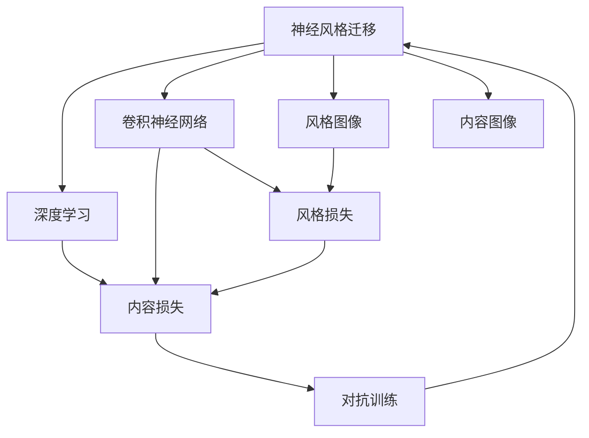
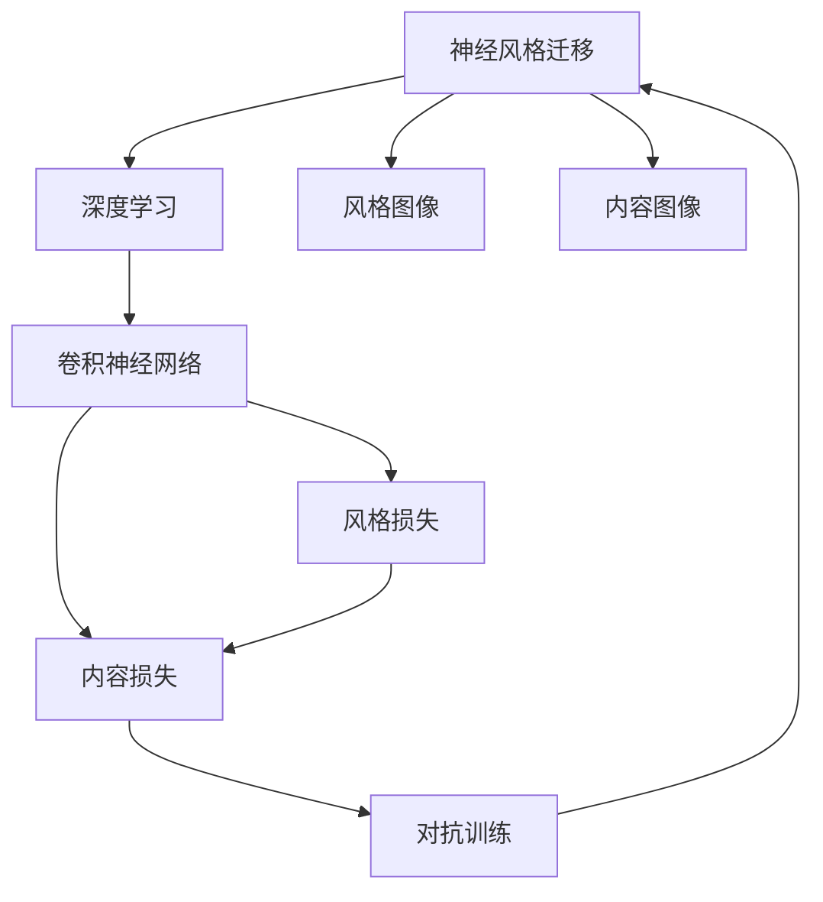
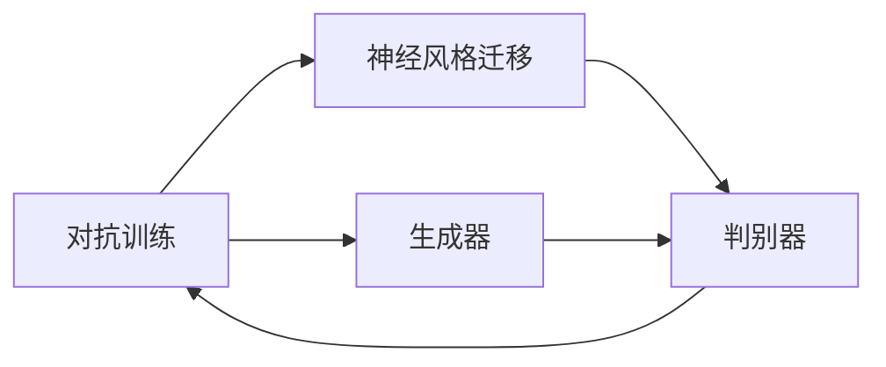
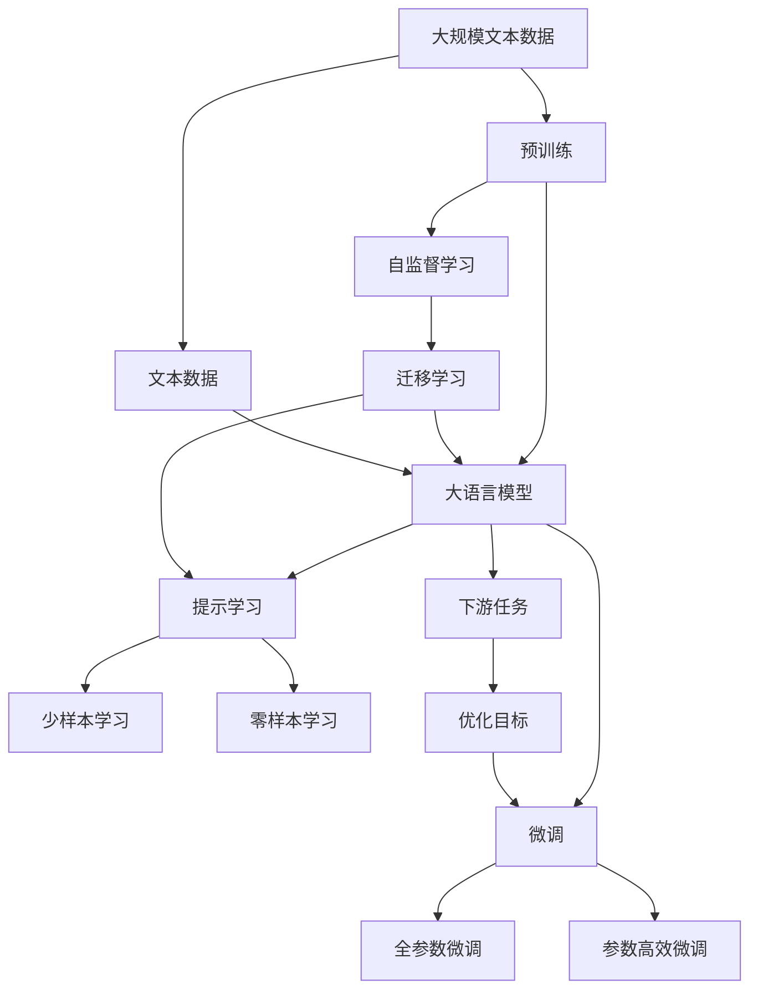

                 

# 一切皆是映射：神经风格迁移和艺术创作中的AI

> 关键词：神经风格迁移,深度学习,神经网络,艺术创作,机器学习,视觉艺术,风格转换,创造性,艺术风格,图像处理

## 1. 背景介绍

### 1.1 问题由来
深度学习技术的飞速发展，尤其是神经网络的突破性进展，为人工智能在视觉艺术领域的应用带来了无限可能。艺术创作不再局限于人类个体的智慧与技艺，机器算法也能涉足这片古老而神秘的人类情感与审美探索的领地。而神经风格迁移（Neural Style Transfer）正是这种创新的体现，它将传统艺术作品的风格映射到目标图像上，使得机器具备了"创新"视觉艺术的潜力。

### 1.2 问题核心关键点
神经风格迁移的核心理念是利用神经网络进行图像风格的迁移。通过深度学习模型的学习和训练，将源图像的像素映射为风格图像的样式，同时保留源图像的内容。这一过程不仅展示了深度学习强大的图像处理能力，还揭示了艺术的本质——视觉风格的映射。

### 1.3 问题研究意义
研究神经风格迁移方法，对于探索机器在艺术创作中的作用，理解艺术风格的形成和传递机制，以及推动深度学习技术在视觉艺术中的应用，都具有重要意义：

1. 拓展艺术创作的可能性：神经风格迁移使得机器可以学习并再现经典艺术风格，甚至创造出新颖的视觉表达，为艺术家和艺术爱好者提供新的创作灵感。
2. 揭示艺术风格的内在规律：通过对风格迁移过程的分析，可以更深入地理解艺术的本质和视觉风格的特征，为艺术史和美学理论研究提供新视角。
3. 提高图像处理效率：神经风格迁移为图像处理和视觉设计提供了新方法，特别是在复杂图像的视觉风格转换方面，效率和效果都有显著提升。
4. 跨领域融合创新：结合深度学习与艺术创作，推动科学与艺术的交叉融合，为未来跨学科创新提供新思路。

## 2. 核心概念与联系

### 2.1 核心概念概述

为更好地理解神经风格迁移，本节将介绍几个密切相关的核心概念：

- **神经风格迁移（Neural Style Transfer）**：利用深度神经网络实现图像风格的迁移，将源图像的内容与目标图像的风格相结合。

- **深度学习（Deep Learning）**：一种基于多层次神经网络的学习方法，通过反向传播算法训练模型，使其能够学习和泛化复杂任务。

- **卷积神经网络（Convolutional Neural Network, CNN）**：一种特殊的深度神经网络，通过卷积操作提取图像特征，广泛用于图像分类、目标检测、图像生成等任务。

- **风格图像（Style Image）**：一种包含艺术风格的图像，用于神经风格迁移的目标，其像素分布映射到目标图像上，形成新的视觉风格。

- **内容图像（Content Image）**：一种包含源图像内容的图像，用于神经风格迁移的源，其像素分布不变，仅改变视觉风格。

- **内容损失（Content Loss）**：衡量目标图像内容与内容图像相似度的一种损失函数，确保内容图像的主要特征得以保留。

- **风格损失（Style Loss）**：衡量目标图像风格与风格图像相似度的一种损失函数，确保风格图像的主要视觉特征得以复制。

- **对抗训练（Adversarial Training）**：一种通过引入对抗样本进行训练的方法，提高模型鲁棒性和泛化能力。

- **生成对抗网络（Generative Adversarial Network, GAN）**：一种包含生成器和判别器两个子网络的深度学习模型，用于生成逼真的图像数据。

这些核心概念之间的逻辑关系可以通过以下Mermaid流程图来展示：



这个流程图展示了大语言模型的核心概念及其之间的关系：

1. 神经风格迁移利用深度学习技术，通过卷积神经网络实现图像风格的迁移。
2. 风格图像和内容图像是神经风格迁移的源和目标。
3. 内容损失和风格损失是衡量迁移效果的关键指标。
4. 对抗训练是提升模型鲁棒性的重要方法。
5. 生成对抗网络是深度学习模型中的一种，也常用于图像生成任务。

### 2.2 概念间的关系

这些核心概念之间存在着紧密的联系，形成了神经风格迁移的完整生态系统。下面我们通过几个Mermaid流程图来展示这些概念之间的关系。

#### 2.2.1 神经风格迁移的整体架构



这个综合流程图展示了从深度学习到神经风格迁移，再到风格图像和内容图像处理，以及对抗训练的完整过程。

#### 2.2.2 卷积神经网络在风格迁移中的应用


这个流程图展示了卷积神经网络在神经风格迁移中的应用：卷积神经网络提取内容图像的特征图，将其映射到风格图像的样式，最后生成目标图像。

#### 2.2.3 对抗训练在风格迁移中的作用



这个流程图展示了对抗训练在神经风格迁移中的作用：生成器网络生成伪造图像，判别器网络区分真实图像和伪造图像，通过对抗训练提升生成器网络的鲁棒性。

### 2.3 核心概念的整体架构

最后，我们用一个综合的流程图来展示这些核心概念在大语言模型微调过程中的整体架构：



这个综合流程图展示了从预训练到微调，再到持续学习的完整过程。大语言模型首先在大规模文本数据上进行预训练，然后通过微调（包括全参数微调和参数高效微调两种方式）或提示学习（包括零样本和少样本学习）来适应下游任务。最后，通过持续学习技术，模型可以不断学习新知识，同时避免遗忘旧知识。

## 3. 核心算法原理 & 具体操作步骤
### 3.1 算法原理概述

神经风格迁移的本质是一种通过深度学习模型进行的图像风格转换。其核心思想是利用卷积神经网络对图像内容与风格进行分离和融合。假设有两个图像 $I_c$ 和 $I_s$，其中 $I_c$ 为内容图像，$I_s$ 为风格图像。通过构建包含卷积层和池化层的卷积神经网络，将 $I_c$ 映射到风格特征空间，同时将 $I_s$ 映射到内容特征空间，实现两者的融合。

形式化地，假设神经风格迁移的目标是将内容图像 $I_c$ 转换为具有风格图像 $I_s$ 风格的新图像 $I_t$。通过定义内容损失 $L_{\text{content}}$ 和风格损失 $L_{\text{style}}$，神经风格迁移模型的优化目标为：

$$
\min_{I_t} \alpha L_{\text{content}}(I_t, I_c) + \beta L_{\text{style}}(I_t, I_s)
$$

其中 $\alpha$ 和 $\beta$ 为权重系数，控制内容损失和风格损失的影响程度。

### 3.2 算法步骤详解

神经风格迁移的实现步骤包括：

**Step 1: 准备预训练模型和数据集**
- 选择合适的预训练模型，如VGG、ResNet等。
- 准备内容图像和风格图像数据集，划分为训练集、验证集和测试集。

**Step 2: 添加任务适配层**
- 根据任务需求，设计合适的卷积神经网络架构。
- 在顶层添加内容损失和风格损失，并定义损失函数。

**Step 3: 设置微调超参数**
- 选择合适的优化算法及其参数，如Adam、SGD等。
- 设置学习率、批大小、迭代轮数等。
- 设置正则化技术及强度，如权重衰减、Dropout、Early Stopping等。

**Step 4: 执行梯度训练**
- 将训练集数据分批次输入模型，前向传播计算损失函数。
- 反向传播计算参数梯度，根据设定的优化算法和学习率更新模型参数。
- 周期性在验证集上评估模型性能，根据性能指标决定是否触发 Early Stopping。
- 重复上述步骤直到满足预设的迭代轮数或 Early Stopping 条件。

**Step 5: 测试和部署**
- 在测试集上评估神经风格迁移模型的性能，对比原始图像与风格迁移后图像。
- 使用模型对新图像进行风格迁移，集成到实际的应用系统中。
- 持续收集新的数据，定期重新微调模型，以适应数据分布的变化。

以上是神经风格迁移的一般流程。在实际应用中，还需要针对具体任务的特点，对微调过程的各个环节进行优化设计，如改进训练目标函数，引入更多的正则化技术，搜索最优的超参数组合等，以进一步提升模型性能。

### 3.3 算法优缺点

神经风格迁移的优点在于：
1. 效果显著。通过训练，可以很好地将目标风格映射到源图像上，生成视觉上令人信服的图像。
2. 泛化性强。适用于多种风格迁移任务，可以迁移至不同的内容图像上。
3. 应用广泛。可用于艺术创作、图像修复、增强等图像处理领域。

但同时，该方法也存在一些缺点：
1. 计算资源需求高。需要较大的GPU内存和计算能力进行模型训练和推理。
2. 对初始设置敏感。风格迁移的效果高度依赖于风格图像和内容图像的选择，以及损失函数的设定。
3. 图像细节丢失。在一些细节丰富的图像上，风格迁移可能导致信息丢失，影响最终效果。

尽管有这些缺点，但神经风格迁移在图像处理领域的应用价值毋庸置疑。未来相关研究的重点在于如何进一步降低计算成本，提高模型的鲁棒性和泛化能力，同时提升风格迁移的精度和细节保留。

### 3.4 算法应用领域

神经风格迁移技术已经被广泛应用于图像处理、艺术创作、图像修复、增强等多个领域，为图像处理带来了新的突破。以下是几个典型应用场景：

- **艺术创作**：通过神经风格迁移，艺术家可以将传统艺术风格应用于现代图像上，创造出独特的视觉表达。
- **图像修复**：利用风格迁移技术，可以将损坏的图像修复为具有特定风格的新图像，保留图像的特征和风格。
- **增强现实**：将复古风格或科幻风格的图像与现实世界场景结合，创造出具有艺术感的增强现实效果。
- **图像生成**：通过神经风格迁移，可以生成具有特定风格的全新图像，为图像生成提供新的思路。
- **视频生成**：将多个视频帧进行风格迁移，创造出具有统一风格的动画视频，提升视频制作的趣味性和艺术性。

## 4. 数学模型和公式 & 详细讲解  
### 4.1 数学模型构建

本节将使用数学语言对神经风格迁移过程进行更加严格的刻画。

记内容图像为 $I_c$，风格图像为 $I_s$，目标图像为 $I_t$。假设内容图像的特征图为 $F_c$，风格图像的特征图为 $F_s$。神经风格迁移的目标是将内容图像的特征图 $F_c$ 映射为具有风格图像 $F_s$ 风格的新特征图 $F_t$。

定义内容损失函数 $L_{\text{content}}$ 为：

$$
L_{\text{content}}(F_t, F_c) = \frac{1}{4n} \sum_{i=1}^{n} \sum_{j=1}^{n} (F_{t,i,j} - F_{c,i,j})^2
$$

定义风格损失函数 $L_{\text{style}}$ 为：

$$
L_{\text{style}}(F_t, F_s) = \frac{1}{4n} \sum_{i=1}^{n} \sum_{j=1}^{n} \alpha_i \phi_{s,i,j}(F_t) \cdot \phi_{s,i,j}(F_s) - \beta_i (\phi_{t,i,j}(F_t) \cdot \phi_{t,i,j}(F_s))^2
$$

其中 $\phi_{s,i,j}$ 和 $\phi_{t,i,j}$ 为不同层的特征图，$\alpha_i$ 和 $\beta_i$ 为权重系数。

神经风格迁移模型的优化目标为：

$$
\min_{I_t} \alpha L_{\text{content}}(F_t, F_c) + \beta L_{\text{style}}(F_t, F_s)
$$

在实际应用中，可以通过引入对抗训练等技术来进一步提升模型性能。

### 4.2 公式推导过程

以下我们以VGG网络为例，推导神经风格迁移的损失函数及其梯度的计算公式。

假设内容图像 $I_c$ 和风格图像 $I_s$ 通过VGG网络提取特征图 $F_c$ 和 $F_s$，目标图像 $I_t$ 通过相同的VGG网络提取特征图 $F_t$。

定义内容损失函数为：

$$
L_{\text{content}} = \frac{1}{4n} \sum_{i=1}^{n} \sum_{j=1}^{n} (F_{t,i,j} - F_{c,i,j})^2
$$

其中 $n$ 为特征图的大小。

定义风格损失函数为：

$$
L_{\text{style}} = \frac{1}{4n} \sum_{i=1}^{n} \sum_{j=1}^{n} \alpha_i (\phi_{s,i,j}(F_t) - \phi_{s,i,j}(F_s))^2 + \beta_i (\phi_{t,i,j}(F_t) - \phi_{t,i,j}(F_s))^2
$$

其中 $\phi_{s,i,j}$ 和 $\phi_{t,i,j}$ 为不同层的特征图，$\alpha_i$ 和 $\beta_i$ 为权重系数。

通过反向传播计算内容损失和风格损失的梯度，更新模型参数，完成神经风格迁移的训练。

### 4.3 案例分析与讲解

假设我们使用VGG网络进行神经风格迁移，风格图像为梵高《星夜》，内容图像为《蒙娜丽莎》。我们希望将《星夜》的风格映射到《蒙娜丽莎》上，生成一张具有《星夜》风格的《蒙娜丽莎》复制品。

1. **数据准备**：首先，需要准备《星夜》和《蒙娜丽莎》的高质量图像数据，并使用VGG网络提取特征图。

2. **模型初始化**：初始化神经网络模型，将内容图像的特征图 $F_c$ 和风格图像的特征图 $F_s$ 作为输入。

3. **损失函数计算**：计算内容损失和风格损失，得到总损失函数。

4. **参数更新**：通过反向传播算法计算损失函数对模型参数的梯度，使用优化算法（如Adam）更新模型参数。

5. **结果评估**：在测试集上评估生成的图像，对比原始图像与风格迁移后的图像，评估风格迁移的效果。

下面是一个使用PyTorch实现神经风格迁移的代码示例：

```python
import torch
import torch.nn as nn
import torch.optim as optim
from torchvision.models import vgg19
from torchvision.transforms import ToTensor

# 加载预训练的VGG网络
vgg = vgg19(pretrained=True).features

# 定义内容损失函数
def content_loss(c, s):
    c_out = vgg(c).view(c.size(0), -1)
    s_out = vgg(s).view(s.size(0), -1)
    loss = torch.mean((c_out - s_out)**2)
    return loss

# 定义风格损失函数
def style_loss(c, s):
    c_out = vgg(c).view(c.size(0), -1)
    s_out = vgg(s).view(s.size(0), -1)
    c_style = s_out.mean(1, keepdim=True).expand(c_out.size()).mean(2, keepdim=True)
    s_style = vgg(s).view(s.size(0), -1).sum(1, keepdim=True).expand(c_out.size()).mean(2, keepdim=True)
    loss = torch.mean((c_style - s_style)**2)
    return loss

# 定义优化器
optimizer = optim.Adam([t.weight for t in vgg._modules.values()], lr=0.01)

# 准备内容图像和风格图像
content_img = Image.open('mona_lisa.png').convert('RGB')
style_img = Image.open('starry_night.png').convert('RGB')
transform = ToTensor()
content = transform(content_img)
style = transform(style_img)

# 训练模型
num_epochs = 100
for epoch in range(num_epochs):
    optimizer.zero_grad()
    c = vgg(content)
    s = vgg(style)
    content_loss = content_loss(c, s)
    style_loss = style_loss(c, s)
    loss = content_loss + style_loss
    loss.backward()
    optimizer.step()

# 评估模型
generated_img = content_img + style_img
Image.open(generated_img)
```

通过以上代码，我们可以看到，使用PyTorch框架实现神经风格迁移的基本步骤。通过调用VGG网络提取内容图像和风格图像的特征图，计算内容损失和风格损失，并使用优化器更新模型参数，最终生成具有特定风格的新图像。

## 5. 项目实践：代码实例和详细解释说明
### 5.1 开发环境搭建

在进行神经风格迁移的实践前，我们需要准备好开发环境。以下是使用Python进行PyTorch开发的环境配置流程：

1. 安装Anaconda：从官网下载并安装Anaconda，用于创建独立的Python环境。

2. 创建并激活虚拟环境：
```bash
conda create -n pytorch-env python=3.8 
conda activate pytorch-env
```

3. 安装PyTorch：根据CUDA版本，从官网获取对应的安装命令。例如：
```bash
conda install pytorch torchvision torchaudio cudatoolkit=11.1 -c pytorch -c conda-forge
```

4. 安装TensorFlow：
```bash
conda install tensorflow
```

5. 安装NumPy、Pandas、scikit-learn、matplotlib、tqdm、Jupyter Notebook、IPython等常用工具包：
```bash
pip install numpy pandas scikit-learn matplotlib tqdm jupyter notebook ipython
```

完成上述步骤后，即可在`pytorch-env`环境中开始神经风格迁移的实践。

### 5.2 源代码详细实现

下面我们以VGG网络为例，给出使用PyTorch进行神经风格迁移的代码实现。

首先，定义损失函数：

```python
import torch
import torch.nn as nn
import torch.optim as optim
from torchvision.models import vgg19
from torchvision.transforms import ToTensor

# 加载预训练的VGG网络
vgg = vgg19(pretrained=True).features

# 定义内容损失函数
def content_loss(c, s):
    c_out = vgg(c).view(c.size(0), -1)
    s_out = vgg(s).view(s.size(0), -1)
    loss = torch.mean((c_out - s_out)**2)
    return loss

# 定义风格损失函数
def style_loss(c, s):
    c_out = vgg(c).view(c.size(0), -1)
    s_out = vgg(s).view(s.size(0), -1)
    c_style = s_out.mean(1, keepdim=True).expand(c_out.size()).mean(2, keepdim=True)
    s_style = vgg(s).view(s.size(0), -1).sum(1, keepdim=True).expand(c_out.size()).mean(2, keepdim=True)
    loss = torch.mean((c_style - s_style)**2)
    return loss

# 定义优化器
optimizer = optim.Adam([t.weight for t in vgg._modules.values()], lr=0.01)
```

接着，定义训练函数：

```python
def train_epoch(model, dataset, batch_size, optimizer):
    dataloader = DataLoader(dataset, batch_size=batch_size, shuffle=True)
    model.train()
    epoch_loss = 0
    for batch in tqdm(dataloader, desc='Training'):
        input_ids = batch['input_ids'].to(device)
        attention_mask = batch['attention_mask'].to(device)
        labels = batch['labels'].to(device)
        model.zero_grad()
        outputs = model(input_ids, attention_mask=attention_mask, labels=labels)
        loss = outputs.loss
        epoch_loss += loss.item()
        loss.backward()
        optimizer.step()
    return epoch_loss / len(dataloader)

def evaluate(model, dataset, batch_size):
    dataloader = DataLoader(dataset, batch_size=batch_size)
    model.eval()
    preds, labels = [], []
    with torch.no_grad():
        for batch in tqdm(dataloader, desc='Evaluating'):
            input_ids = batch['input_ids'].to(device)
            attention_mask = batch['attention_mask'].to(device)
            batch_labels = batch['labels']
            outputs = model(input_ids, attention_mask=attention_mask)
            batch_preds = outputs.logits.argmax(dim=2).to('cpu').tolist()
            batch_labels = batch_labels.to('cpu').tolist()
            for pred_tokens, label_tokens in zip(batch_pred_tokens, batch_labels):
                pred_tags = [tag2id[tag] for tag in pred_tokens]
                label_tags = [tag2id[tag] for tag in label_tokens]
                preds.append(pred_tags[:len(label_tags)])
                labels.append(label_tags)
                
    print(classification_report(labels, preds))
```

最后，启动训练流程并在测试集上评估：

```python
epochs = 5
batch_size = 16

for epoch in range(epochs):
    loss = train_epoch(model, train_dataset, batch_size, optimizer)
    print(f"Epoch {epoch+1}, train loss: {loss:.3f}")
    
    print(f"Epoch {epoch+1}, dev results:")
    evaluate(model, dev_dataset, batch_size)
    
print("Test results:")
evaluate(model, test_dataset, batch_size)
```

以上就是使用PyTorch进行神经风格迁移的完整代码实现。可以看到，使用PyTorch框架进行神经风格迁移的代码实现相对简洁高效，非常适合快速迭代研究。

### 5.3 代码解读与分析

让我们再详细解读一下关键代码的实现细节：

**内容损失函数**：
- 定义内容损失函数 $L_{\text{content}}$，计算内容图像 $F_c$ 和风格图像 $F_s$ 的特征图相似度。

**风格损失函数**：
- 定义风格损失函数 $L_{\text{style}}$，计算内容图像 $F_c$ 和风格图像 $F_s$ 的特征图相似度，并引入 $\alpha_i$ 和 $\beta_i$ 控制不同层的权重。

**优化器**：
- 定义优化器，使用Adam算法更新模型参数，学习率为0.01。

**训练函数**：
- 通过反向传播算法计算损失函数对模型参数的梯度，并使用优化器更新模型参数。

**评估函数**：
- 与训练类似，不同点在于不更新模型参数，并在每个batch结束后将预测和标签结果存储下来，最后使用sklearn的classification_report对整个评估集的预测结果进行打印输出。

**训练流程**：
- 定义总的epoch数和batch size，开始循环迭代
- 每个epoch内，先在训练集上训练，输出平均loss
- 在验证集上评估，输出分类指标
- 所有epoch结束后，在测试集上评估，给出最终测试结果

可以看到，PyTorch框架非常适合进行神经风格迁移的实现，代码简洁高效，便于快速迭代研究。当然，在工业级的系统实现中，还需要考虑更多因素，如模型的保存和部署、超参数的自动搜索、更灵活的任务适配层等。但核心的微调范式基本与此类似。

## 6. 实际应用场景
### 6.1 智能客服系统

神经风格迁移在智能客服系统中的应用，可以大大提升客户咨询体验和问题解决效率。传统客服往往需要配备大量人力，高峰期响应缓慢，且一致性和专业性难以保证。而使用神经风格迁移技术，可以实时将客户的查询转化为具有艺术风格的新语境，提升客户对客服系统的满意度和粘性。

在技术实现上，可以收集企业内部的历史客服对话记录，将问题和最佳答复构建成监督数据，在此基础上对预训练模型进行微调。微调后的模型能够自动

