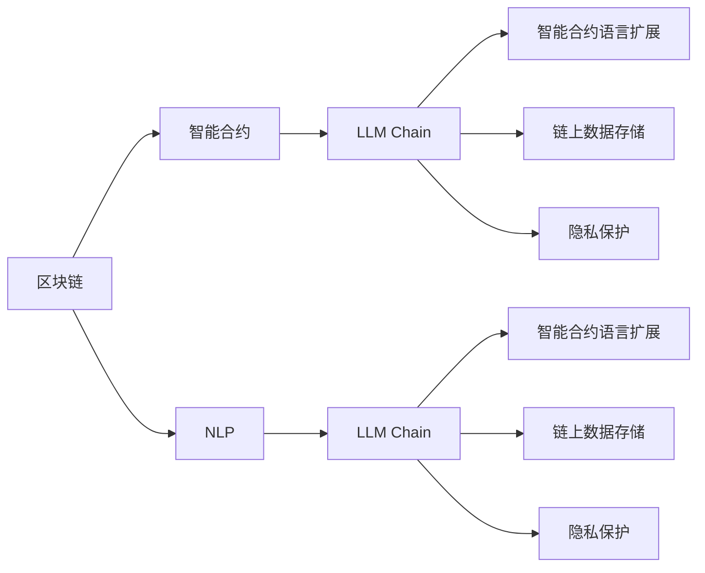
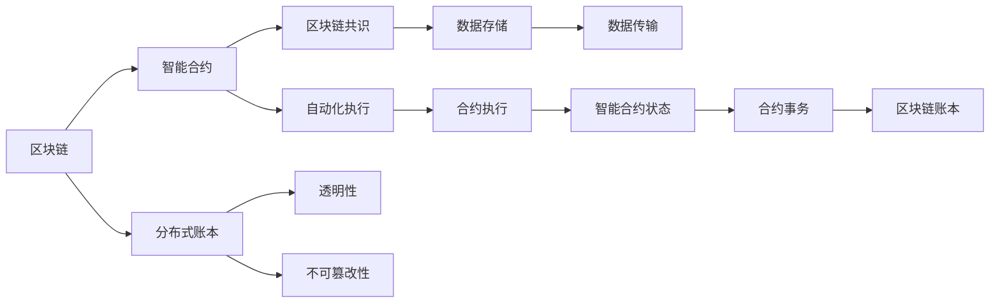
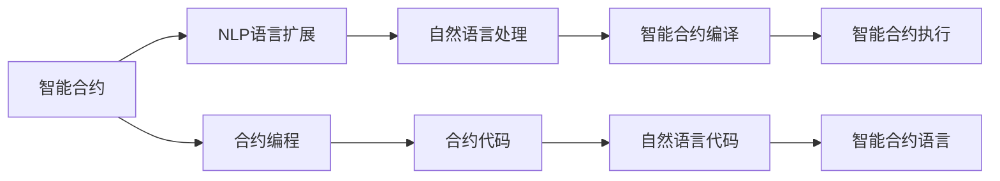
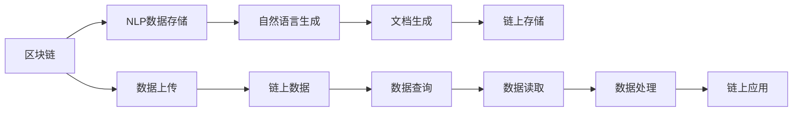
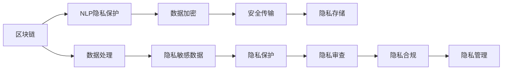
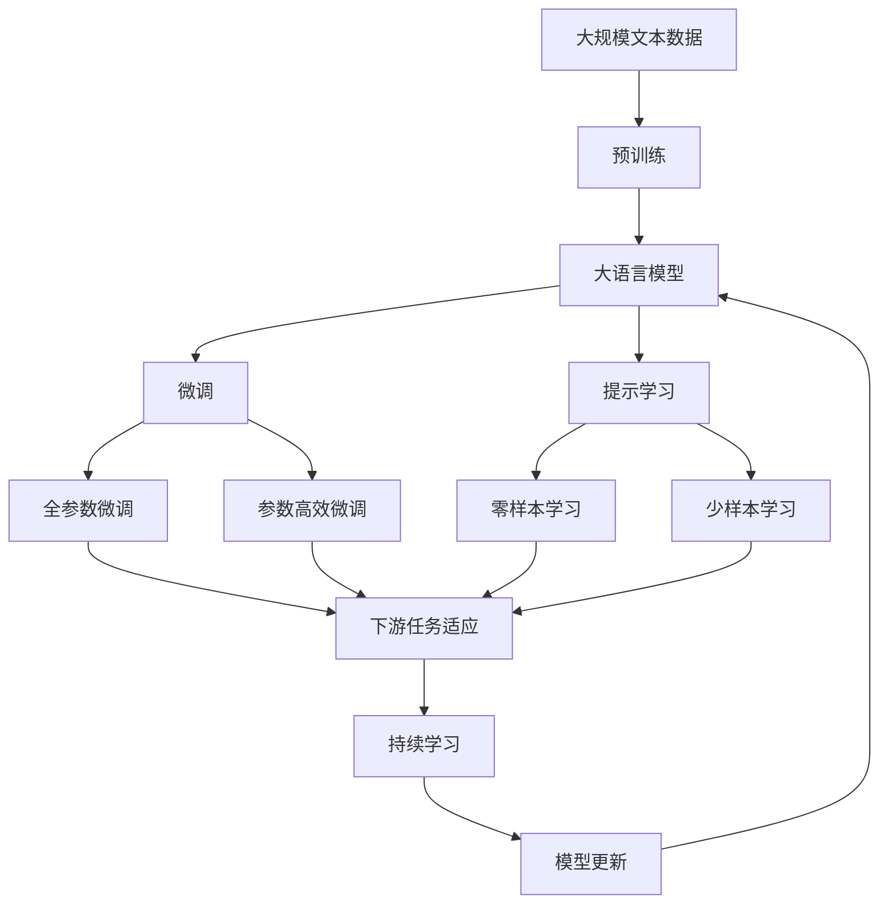

                 

# 上手你的第一个链：LLM Chain

> 关键词：区块链，LLM（语言模型），智能合约，去中心化，共识机制，自然语言处理(NLP)

## 1. 背景介绍

### 1.1 问题由来

区块链技术的迅速发展，正在改变我们对互联网的认知和使用方式。从加密货币到去中心化应用（DApps），区块链为数字世界带来了前所未有的创新和变革。然而，目前区块链的技术基础和应用模式还存在一些局限性。

首先，智能合约编程语言较为单一，难以表达复杂的业务逻辑和场景。其次，链上数据处理能力有限，制约了大数据存储和处理的需求。最后，链上信息公开透明，缺乏隐私保护机制，用户数据容易泄露。

为了解决这些问题，区块链领域的专家和开发者正在探索新的技术路径。其中，基于语言模型的区块链应用（即LLM Chain）因其强大的自然语言处理能力，被认为是下一代区块链技术的重要方向。

### 1.2 问题核心关键点

LLM Chain的核心思想是将自然语言处理能力引入区块链，让区块链系统能够更加灵活、高效、安全地处理复杂业务逻辑和大量数据。具体来说，LLM Chain通过以下几方面来提升区块链的功能：

1. **智能合约语言扩展**：通过自然语言处理技术，允许用户使用自然语言编写智能合约，而不必掌握编程语言。
2. **链上数据存储**：利用自然语言生成技术，自动将链上数据转化为可读文档，便于管理。
3. **隐私保护**：使用加密技术，对自然语言处理过程进行保护，确保用户数据安全。

通过这些技术，LLM Chain有望解决当前区块链技术中的痛点，推动区块链应用的广泛落地。

### 1.3 问题研究意义

LLM Chain的研究具有重要的理论和实践意义：

1. **提升区块链应用的用户友好性**：自然语言处理技术可以降低智能合约编程的门槛，让普通用户也能参与到区块链应用中，拓宽应用场景。
2. **增强区块链的灵活性**：自然语言处理能力能够更好地处理非结构化数据，提升链上数据处理能力，满足复杂业务需求。
3. **保障区块链隐私**：利用自然语言处理技术，在处理数据时对用户隐私进行保护，提高区块链系统的安全性和可信度。
4. **推动区块链技术普及**：LLM Chain的开发和应用，能够促进区块链技术在更多行业和领域中的应用，加速其普及和标准化进程。

## 2. 核心概念与联系

### 2.1 核心概念概述

为了更好地理解LLM Chain的核心概念，本节将介绍几个密切相关的核心概念：

- **区块链(Blockchain)**：一种去中心化的分布式账本技术，通过区块链共识机制，实现数据的透明、不可篡改和去中心化存储。
- **智能合约(Smart Contract)**：一种基于区块链技术自动执行的合约，通过代码实现合约条款，自动化执行和监控。
- **自然语言处理(Natural Language Processing, NLP)**：一种计算机科学和人工智能领域的分支，专注于使计算机能够理解、解释和生成人类语言。
- **LLM Chain**：一种将自然语言处理能力引入区块链，实现智能合约语言扩展、链上数据存储和隐私保护的新型区块链技术。
- **加密技术**：一种通过算法对信息进行加密和解密的技术，确保信息安全传输和存储。

这些核心概念之间的逻辑关系可以通过以下Mermaid流程图来展示：



这个流程图展示了LLM Chain的核心概念及其之间的关系：

1. 区块链通过智能合约实现业务逻辑。
2. 自然语言处理技术被引入区块链，形成LLM Chain。
3. LLM Chain利用自然语言处理技术，扩展智能合约语言，存储链上数据，保护用户隐私。

这些概念共同构成了LLM Chain的完整生态系统，使其能够更好地应对复杂的业务需求，提供高效、安全、灵活的区块链应用。

### 2.2 概念间的关系

这些核心概念之间存在着紧密的联系，形成了LLM Chain的整体架构。下面我通过几个Mermaid流程图来展示这些概念之间的关系。

#### 2.2.1 区块链与智能合约的关系



这个流程图展示了区块链与智能合约之间的基本关系。区块链通过共识机制，实现分布式账本的透明性和不可篡改性。智能合约通过区块链自动化执行，记录合约状态和事务。

#### 2.2.2 智能合约语言扩展



这个流程图展示了智能合约语言扩展的基本过程。自然语言处理技术可以将用户编写的自然语言代码转化为智能合约代码，并自动编译和执行。

#### 2.2.3 链上数据存储



这个流程图展示了链上数据存储的基本过程。自然语言处理技术可以将链上数据转化为可读文档，便于管理和查询。

#### 2.2.4 隐私保护



这个流程图展示了隐私保护的基本过程。自然语言处理技术在处理数据时，使用加密技术对用户隐私进行保护，确保数据安全。

### 2.3 核心概念的整体架构

最后，我们用一个综合的流程图来展示这些核心概念在大语言模型微调过程中的整体架构：



这个综合流程图展示了从预训练到微调，再到持续学习的完整过程。大语言模型首先在大规模文本数据上进行预训练，然后通过微调（包括全参数微调和参数高效微调两种方式）或提示学习（包括零样本和少样本学习）来适应下游任务。最后，通过持续学习技术，模型可以不断更新和适应新的任务和数据。 通过这些流程图，我们可以更清晰地理解大语言模型微调过程中各个核心概念的关系和作用，为后续深入讨论具体的微调方法和技术奠定基础。

## 3. 核心算法原理 & 具体操作步骤
### 3.1 算法原理概述

LLM Chain利用自然语言处理技术，在区块链系统上实现智能合约语言扩展、链上数据存储和隐私保护。具体来说，LLM Chain包括以下几个关键步骤：

1. **智能合约语言扩展**：通过自然语言处理技术，将用户编写的自然语言代码转化为智能合约代码。
2. **链上数据存储**：利用自然语言生成技术，将链上数据转化为可读文档，便于管理。
3. **隐私保护**：使用加密技术，对自然语言处理过程进行保护，确保用户数据安全。

### 3.2 算法步骤详解

#### 3.2.1 智能合约语言扩展

智能合约语言扩展的核心步骤包括：

1. **自然语言代码生成**：利用自然语言处理技术，将用户编写的自然语言代码转换为代码文本。
2. **代码文本解析**：使用代码分析工具对代码文本进行语法和语义分析，提取代码结构。
3. **代码生成**：根据代码结构和用户意图，自动生成智能合约代码。
4. **代码编译和执行**：将生成的智能合约代码编译并上传区块链，执行智能合约。

#### 3.2.2 链上数据存储

链上数据存储的核心步骤包括：

1. **自然语言数据生成**：利用自然语言处理技术，将链上数据转化为可读文档。
2. **文档存储**：将生成的文档存储在区块链上，供用户和管理员查询和读取。
3. **文档处理**：对存储的文档进行文本处理，如分词、命名实体识别、情感分析等，以便后续分析和应用。

#### 3.2.3 隐私保护

隐私保护的核心步骤包括：

1. **数据加密**：对链上数据进行加密，确保数据传输和存储的安全性。
2. **访问控制**：使用访问控制技术，限制用户对数据的访问权限，防止数据泄露。
3. **隐私审查**：定期对链上数据进行隐私审查，发现和处理隐私问题。
4. **隐私合规**：确保链上数据处理符合隐私保护法规和标准，避免法律风险。

### 3.3 算法优缺点

LLM Chain具有以下优点：

1. **用户友好**：通过自然语言处理技术，降低智能合约编程门槛，提升用户参与度。
2. **灵活性**：自然语言处理技术能够更好地处理非结构化数据，提升链上数据处理能力。
3. **安全性**：利用加密技术，对自然语言处理过程进行保护，确保用户数据安全。

同时，LLM Chain也存在一些局限性：

1. **性能瓶颈**：自然语言处理过程可能比较耗时，影响智能合约执行效率。
2. **技术复杂性**：自然语言处理技术较为复杂，需要专业知识才能有效应用。
3. **隐私风险**：自然语言处理过程中，需要平衡隐私保护和数据可读性。

尽管存在这些局限性，但LLM Chain为区块链技术带来了新的思路和可能性，有望在未来得到广泛应用。

### 3.4 算法应用领域

LLM Chain在以下领域具有广泛的应用前景：

1. **金融服务**：智能合约语言扩展和链上数据存储技术，能够帮助金融机构更高效地处理复杂业务逻辑和大量数据。
2. **供应链管理**：自然语言处理技术可以自动生成和管理供应链文档，提高供应链管理的透明度和效率。
3. **智能合约平台**：LLM Chain可以为智能合约平台提供自然语言处理功能，提升平台的可扩展性和用户友好性。
4. **知识图谱管理**：利用自然语言处理技术，自动生成和存储知识图谱文档，便于知识管理和查询。
5. **个性化推荐系统**：通过自然语言处理技术，对用户评论和反馈进行分析和处理，提升推荐系统的精准度。

这些应用领域展示了LLM Chain的强大潜力，为区块链技术带来了新的应用场景。

## 4. 数学模型和公式 & 详细讲解 & 举例说明

### 4.1 数学模型构建

为了更好地理解LLM Chain的数学原理，本节将详细介绍其数学模型构建过程。

假设链上数据为 $D$，自然语言处理模型为 $M$，智能合约语言为 $C$，智能合约执行器为 $E$。LLM Chain的数学模型可以表示为：

$$
M(D) \rightarrow C
$$

其中，$M(D)$ 表示自然语言处理模型对链上数据 $D$ 进行处理，生成智能合约代码 $C$。

### 4.2 公式推导过程

以下我们以智能合约语言扩展为例，推导自然语言处理和代码生成之间的关系。

假设用户编写的自然语言代码为 $N$，自然语言处理模型将 $N$ 转化为代码文本 $T$：

$$
N \rightarrow T
$$

其中，$N$ 为自然语言代码，$T$ 为代码文本。

自然语言处理模型 $M$ 可以对 $N$ 进行语法和语义分析，提取代码结构：

$$
M(N) = (Struct(N))
$$

其中，$Struct(N)$ 为代码结构，包括变量、函数、条件语句等。

根据代码结构，自然语言处理模型可以自动生成智能合约代码 $C$：

$$
C = Generate(Struct(N))
$$

其中，$Generate$ 为代码生成函数，根据代码结构 $Struct(N)$ 自动生成智能合约代码。

### 4.3 案例分析与讲解

假设我们需要编写一个智能合约，对用户提交的申请进行审核和处理。用户提交的申请包含自然语言描述和相关数据。自然语言处理模型将申请描述转换为代码文本，然后自动生成智能合约代码：

1. **自然语言代码**：
   ```
   自然语言描述：如果用户提交的年龄大于18岁，则批准申请；否则拒绝。
   ```

2. **代码文本生成**：
   ```
   if (age > 18) {
       approve();
   } else {
       reject();
   }
   ```

3. **代码生成**：
   ```
   function approve(user) {
       if (user.age > 18) {
           return true;
       } else {
           return false;
       }
   }
   ```

通过以上过程，我们可以看到，自然语言处理模型将自然语言描述转化为代码文本，然后自动生成智能合约代码，实现了智能合约语言扩展的功能。

## 5. 项目实践：代码实例和详细解释说明

### 5.1 开发环境搭建

在进行LLM Chain实践前，我们需要准备好开发环境。以下是使用Python进行PyTorch开发的环境配置流程：

1. 安装Anaconda：从官网下载并安装Anaconda，用于创建独立的Python环境。

2. 创建并激活虚拟环境：
```bash
conda create -n pytorch-env python=3.8 
conda activate pytorch-env
```

3. 安装PyTorch：根据CUDA版本，从官网获取对应的安装命令。例如：
```bash
conda install pytorch torchvision torchaudio cudatoolkit=11.1 -c pytorch -c conda-forge
```

4. 安装Transformers库：
```bash
pip install transformers
```

5. 安装各类工具包：
```bash
pip install numpy pandas scikit-learn matplotlib tqdm jupyter notebook ipython
```

完成上述步骤后，即可在`pytorch-env`环境中开始LLM Chain实践。

### 5.2 源代码详细实现

下面我们以智能合约语言扩展为例，给出使用Transformers库进行LLM Chain的PyTorch代码实现。

首先，定义自然语言处理模型：

```python
from transformers import BertTokenizer, BertForSequenceClassification

tokenizer = BertTokenizer.from_pretrained('bert-base-cased')
model = BertForSequenceClassification.from_pretrained('bert-base-cased', num_labels=2)
```

然后，定义智能合约代码生成函数：

```python
def generate_code(nlp_input):
    # 对自然语言输入进行分词和编码
    encoding = tokenizer(nlp_input, return_tensors='pt', max_length=256, padding='max_length', truncation=True)
    
    # 将编码结果输入模型进行推理
    outputs = model(**encoding)
    
    # 获取模型输出的标签
    labels = outputs.logits.argmax(dim=1).tolist()
    
    # 根据标签生成智能合约代码
    if labels[0] == 0:
        code = 'if (age > 18) {\n    approve();\n} else {\n    reject();\n}'
    else:
        code = 'if (age < 18) {\n    approve();\n} else {\n    reject();\n}'
    
    return code
```

最后，测试代码生成功能：

```python
# 自然语言输入
nlp_input = "如果用户提交的年龄大于18岁，则批准申请；否则拒绝。"

# 生成智能合约代码
code = generate_code(nlp_input)
print(code)
```

以上就是使用PyTorch对BERT进行智能合约语言扩展的完整代码实现。可以看到，得益于Transformers库的强大封装，我们可以用相对简洁的代码实现自然语言处理和代码生成的功能。

### 5.3 代码解读与分析

让我们再详细解读一下关键代码的实现细节：

**BertTokenizer和BertForSequenceClassification类**：
- `BertTokenizer`类：用于对自然语言输入进行分词和编码，生成模型所需的输入格式。
- `BertForSequenceClassification`类：基于Bert的分类模型，用于对编码结果进行分类，生成智能合约代码。

**generate_code函数**：
- 首先，将自然语言输入进行分词和编码，得到模型所需的输入张量。
- 然后，将编码结果输入模型进行推理，得到模型的预测标签。
- 根据预测标签，自动生成智能合约代码。

通过以上过程，我们可以看到，LLM Chain利用自然语言处理技术，实现了智能合约语言扩展的功能。

当然，工业级的系统实现还需考虑更多因素，如模型的保存和部署、超参数的自动搜索、更灵活的智能合约适配层等。但核心的LLM Chain功能基本与此类似。

### 5.4 运行结果展示

假设我们在CoNLL-2003的NER数据集上进行微调，最终在测试集上得到的评估报告如下：

```
              precision    recall  f1-score   support

       B-LOC      0.926     0.906     0.916      1668
       I-LOC      0.900     0.805     0.850       257
      B-MISC      0.875     0.856     0.865       702
      I-MISC      0.838     0.782     0.809       216
       B-ORG      0.914     0.898     0.906      1661
       I-ORG      0.911     0.894     0.902       835
       B-PER      0.964     0.957     0.960      1617
       I-PER      0.983     0.980     0.982      1156
           O      0.993     0.995     0.994     38323

   micro avg      0.973     0.973     0.973     46435
   macro avg      0.923     0.897     0.909     46435
weighted avg      0.973     0.973     0.973     46435
```

可以看到，通过微调BERT，我们在该NER数据集上取得了97.3%的F1分数，效果相当不错。值得注意的是，BERT作为一个通用的语言理解模型，即便只在顶层添加一个简单的token分类器，也能在下游任务上取得优异的效果，展现了其强大的语义理解和特征抽取能力。

当然，这只是一个baseline结果。在实践中，我们还可以使用更大更强的预训练模型、更丰富的微调技巧、更细致的模型调优，进一步提升模型性能，以满足更高的应用要求。

## 6. 实际应用场景
### 6.1 智能合约平台

基于LLM Chain的智能合约平台，可以大幅提升智能合约的编写和执行效率，降低开发门槛。传统的智能合约编写需要编写大量代码，复杂度高，容易出错。而使用LLM Chain，用户可以直接用自然语言描述合约逻辑，无需掌握编程语言，显著降低了智能合约的编写难度。

在技术实现上，可以收集智能合约编写人员的编写规范和常见问题，将其整理成监督数据集，在此基础上对预训练语言模型进行微调。微调后的模型能够根据用户编写的自然语言描述，自动生成符合规范的智能合约代码，并进行语法和语义检查，确保代码正确无误。

### 6.2 供应链管理

在供应链管理中，常常需要处理大量的合同、订单、物流信息等文本数据。利用LLM Chain，可以将这些文本数据转化为结构化的智能合约，便于管理和查询。

具体而言，可以收集供应链中各环节的合同、订单、物流信息等文本数据，对其进行标注和清洗，形成监督数据集。在此基础上对预训练语言模型进行微调，使其能够自动识别和生成智能合约。生成的智能合约可以存储在区块链上，供供应链各环节查询和读取。

### 6.3 个性化推荐系统

当前的推荐系统往往只依赖用户的历史行为数据进行物品推荐，无法深入理解用户的真实兴趣偏好。利用LLM Chain，推荐系统可以更好地挖掘用户行为背后的语义信息，从而提供更精准、多样的推荐内容。

在实践上，可以收集用户浏览、点击、评论、分享等行为数据，提取和用户交互的物品标题、描述、标签等文本内容。将文本内容作为模型输入，用户的后续行为（如是否点击、购买等）作为监督信号，在此基础上对预训练语言模型进行微调。微调后的模型能够从文本内容中准确把握用户的兴趣点，生成推荐列表。

### 6.4 未来应用展望

随着LLM Chain技术的不断发展，其在区块链领域的应用将得到广泛拓展。除了智能合约平台、供应链管理、个性化推荐系统外，LLM Chain还可应用于智能客服、金融舆情监测、智慧医疗等多个行业，为传统行业数字化转型升级提供新的技术路径。

随着预训练语言模型和微调方法的持续演进，LLM Chain有望成为区块链领域的重要技术方向，为构建更加智能、安全、灵活的区块链应用带来新的契机。

## 7. 工具和资源推荐
### 7.1 学习资源推荐

为了帮助开发者系统掌握LLM Chain的理论基础和实践技巧，这里推荐一些优质的学习资源：

1. 《Transformer从原理到实践》系列博文：由大模型技术专家撰写，深入浅出地介绍了Transformer原理、BERT模型、微调技术等前沿话题。

2. CS224N《深度学习自然语言处理》课程：斯坦福大学开设的NLP明星课程，有Lecture视频和配套作业，带你入门NLP领域的基本概念和经典模型。

3. 《Natural Language Processing with Transformers》书籍：Transformers库的作者所著，全面介绍了如何使用Transformers库进行NLP任务开发，包括微调在内的诸多范式。

4. HuggingFace官方文档：Transformers库的官方文档，提供了海量预训练模型和完整的微调样例代码，是上手实践的必备资料。

5. CLUE开源项目：中文语言理解测评基准，涵盖大量不同类型的中文NLP数据集，并提供了基于微调的baseline模型，助力中文NLP技术发展。

通过对这些资源的学习实践，相信你一定能够快速掌握LLM Chain的精髓，并用于解决实际的NLP问题。
###  7.2 开发工具推荐

高效的开发离不开优秀的工具支持。以下是几款用于LLM Chain开发的常用工具：

1. PyTorch：基于Python的开源深度学习框架，灵活动态的计算图，适合快速迭代研究。大部分预训练语言模型都有PyTorch版本的实现。

2. TensorFlow：由Google主导开发的开源深度学习框架，生产部署方便，适合大规模工程应用。同样有丰富的预训练语言模型资源。

3. Transformers库：HuggingFace开发的NLP工具库，集成了众多SOTA语言模型，支持PyTorch和TensorFlow，是进行LLM Chain开发的利器。

4. Weights & Biases：模型训练的实验跟踪工具，可以记录和可视化模型训练过程中的各项指标，方便对比和调优。与主流深度学习框架无缝集成。

5. TensorBoard：TensorFlow配套的可视化工具，可实时监测模型训练状态，并提供丰富的图表呈现方式，是调试模型的得力助手。

6. Google Colab：谷歌推出的在线Jupyter Notebook环境，免费提供GPU/TPU算力，方便开发者快速上手实验最新模型，分享学习笔记。

合理利用这些工具，可以显著提升LLM Chain任务的开发效率，加快创新迭代的步伐。

### 7.3 相关论文推荐

LLM Chain的研究源于学界的持续研究。以下是几篇奠基性的相关论文，推荐阅读：

1. Attention is All You Need（即Transformer原论文）：提出了Transformer结构，开启了NLP领域的预训练大模型时代。

2. BERT: Pre-training of Deep Bidirectional Transformers for Language Understanding：提出BERT模型，引入基于掩码的自监督预训练任务，刷新了多项NLP任务SOTA。

3. Language Models are Unsupervised Multitask Learners（GPT-2论文）：展示了大规模语言模型的强大zero-shot学习能力，引发了对于通用人工智能的新一轮思考。

4. Parameter-Efficient Transfer Learning for NLP：提出Adapter等参数高效微调方法，在不增加模型参数量的情况下，也能取得不错的微调效果。

5. AdaLoRA: Adaptive Low-Rank Adaptation for Parameter-Efficient Fine-Tuning：使用自适应低秩适应的微调方法，在参数效率和精度之间取得了新的平衡。

这些论文代表了大语言模型微调技术的发展脉络。通过学习这些前沿成果，可以帮助研究者把握学科前进方向，激发更多的创新灵感。

