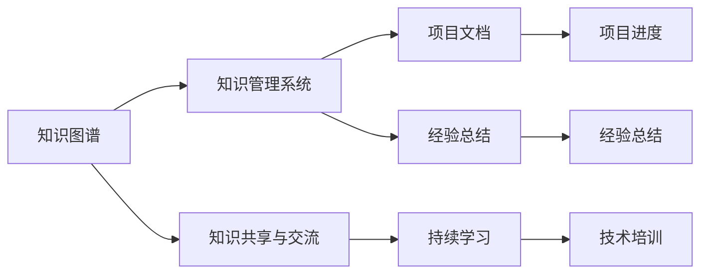
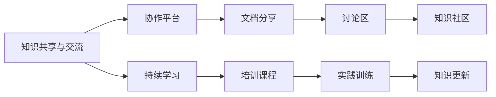
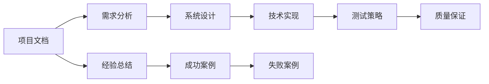

                 

# 专业知识的积累：让项目顺利完成

## 1. 背景介绍

### 1.1 问题由来
在软件开发和系统构建过程中，常常遇到各种各样的技术挑战。无论是架构设计、需求分析、代码编写还是测试部署，都需具备丰富的专业知识储备。知识储备的不足，往往成为项目推进的瓶颈，影响项目的最终成功。因此，如何系统地积累和应用专业知识，提升项目团队的综合素质，是技术团队亟需解决的重要问题。

### 1.2 问题核心关键点
专业知识的积累与沉淀是项目成功的重要因素。专业知识的积累主要包括：

- **领域知识**：了解特定技术领域的基本概念、原理和实践，如数据结构、算法、网络协议、数据库、操作系统等。
- **工具和框架**：熟悉各种开发工具、编程语言、中间件和框架，如IDE、版本控制、自动化测试、Docker、Kubernetes等。
- **软技能**：提升沟通、协作、时间管理、风险评估等软技能，提升团队的整体效能。
- **实战经验**：通过实际项目积累经验，掌握项目管理的技巧和方法，如需求分析、风险管理、质量保证、测试策略等。

## 2. 核心概念与联系

### 2.1 核心概念概述

为更好地理解如何系统地积累和应用专业知识，本节将介绍几个密切相关的核心概念：

- **知识图谱(Knowledge Graph)**：以图形化方式表示知识结构，用于描述概念、实体、属性和它们之间的关系。知识图谱在信息检索、推荐系统、智能问答等领域有广泛应用。
- **知识管理系统(Knowledge Management System, KMS)**：帮助组织收集、存储、共享和管理知识的工具，提升团队的知识传播和协作效率。
- **知识共享与交流(Knowledge Sharing and Collaboration)**：通过文档、会议、讨论区等方式，促进知识在团队中的传播与交流。
- **持续学习(Continuous Learning)**：通过不断学习和实践，保持知识和技能的更新，适应快速变化的技术环境。
- **项目文档(Project Documentation)**：记录项目的各个阶段和细节，帮助团队成员理解和协同工作，保障项目的顺利推进。
- **经验总结(Experience Summarization)**：对项目实施过程中的成功与失败案例进行分析总结，积累有价值的经验教训，避免重复错误。

这些核心概念之间的逻辑关系可以通过以下Mermaid流程图来展示：



这个流程图展示了大语言模型微调过程中各个核心概念的关系和作用：

1. 知识图谱提供知识结构和知识关系。
2. 知识管理系统用于收集、存储和管理知识。
3. 知识共享与交流促进知识的传播和协作。
4. 持续学习保持知识和技能的更新。
5. 项目文档记录项目的各个细节和阶段。
6. 经验总结提供成功和失败案例的总结。

这些概念共同构成了系统地积累和应用专业知识的完整生态系统，使得团队能够高效地应对技术挑战，成功完成项目。

### 2.2 概念间的关系

这些核心概念之间存在着紧密的联系，形成了系统地积累和应用专业知识的完整生态系统。下面我通过几个Mermaid流程图来展示这些概念之间的关系。

#### 2.2.1 知识图谱和知识管理系统的关系


这个流程图展示了知识图谱和知识管理系统的关系：

1. 知识图谱是知识管理系统的核心组件，提供了知识关系的可视化表示。
2. 知识管理系统通过知识图谱管理知识库，存储和检索各种知识资源。
3. 知识库是知识管理系统的数据层，存储各种形式的知识数据。
4. 数据管理提供对知识库的数据维护和优化，保障知识的准确性和时效性。
5. 查询分析提供对知识库的高级查询和分析功能，帮助用户快速获取所需知识。

#### 2.2.2 知识共享与交流和持续学习的关系



这个流程图展示了知识共享与交流和持续学习的关系：

1. 知识共享与交流通过协作平台促进知识的传播和交流。
2. 协作平台提供文档分享、讨论区和知识社区等功能，帮助用户共享和交流知识。
3. 持续学习通过培训课程、实践训练等方式，帮助用户不断学习和更新知识。
4. 实践训练通过实际项目的实施，提升用户的实战经验。
5. 知识更新通过持续学习和实践，保持知识和技能的最新状态。

#### 2.2.3 项目文档和经验总结的关系



这个流程图展示了项目文档和经验总结的关系：

1. 项目文档记录项目的各个细节和阶段，包括需求分析、系统设计、技术实现、测试策略和质量保证等。
2. 需求分析提供项目的需求说明，为项目实施提供指导。
3. 系统设计提供项目的技术方案和架构，为项目实施提供技术支持。
4. 技术实现提供项目的代码和配置，为项目实施提供具体的技术工具和框架。
5. 测试策略提供项目的测试方案和工具，为项目实施提供质量保障。
6. 经验总结提供项目的成功和失败案例，为后续项目提供有价值的参考。

通过这些流程图，我们可以更清晰地理解系统地积累和应用专业知识的各个环节，为后续深入讨论具体的知识积累方法奠定基础。

## 3. 核心算法原理 & 具体操作步骤
### 3.1 算法原理概述

系统地积累和应用专业知识，其核心算法原理主要涉及以下几个方面：

1. **知识抽取与建模**：从结构化和非结构化数据中抽取关键信息，构建知识图谱，形成知识结构。
2. **知识存储与管理**：设计知识管理系统，存储和管理知识图谱、文档、代码等资源。
3. **知识共享与交流**：通过协作平台、文档分享和知识社区等方式，促进知识的传播和交流。
4. **持续学习与更新**：通过培训课程、实践训练和实际项目等方式，不断学习和更新专业知识。
5. **项目文档与总结**：记录项目的各个阶段和细节，通过经验总结提升项目的成功概率。

### 3.2 算法步骤详解

系统地积累和应用专业知识，通常包括以下几个关键步骤：

**Step 1: 知识图谱的构建**
- 收集领域相关的文档、书籍、论文等资源，进行文本挖掘和实体识别。
- 使用自然语言处理技术，提取出关键实体、属性和关系，构建知识图谱。
- 采用KGSchema等规范，规范化知识图谱的表示，确保其准确性和完整性。

**Step 2: 知识管理系统的搭建**
- 选择合适的知识管理系统工具，如Confluence、SharePoint等。
- 设计知识管理系统的架构，包括知识库、文档管理、权限控制等功能模块。
- 配置数据源，将知识图谱、文档、代码等资源导入知识管理系统。

**Step 3: 知识共享与交流机制的建立**
- 设计协作平台，如Slack、Microsoft Teams等，用于团队协作和知识交流。
- 提供文档分享和讨论区功能，方便团队成员共享和交流知识。
- 搭建知识社区，鼓励团队成员分享经验和技术，互相学习和提升。

**Step 4: 持续学习与培训的实施**
- 根据团队成员的实际需求，设计培训课程，涵盖基础知识和前沿技术。
- 引入在线学习平台，如Coursera、edX等，提供在线培训和学习资源。
- 组织内部或外部的技术交流活动，提升团队的技术水平。

**Step 5: 项目文档的记录与管理**
- 在项目实施过程中，及时记录项目的各个细节和阶段，形成项目文档。
- 通过项目管理工具，如JIRA、Trello等，记录项目的需求、进度和风险。
- 定期进行项目总结，形成成功和失败案例，为后续项目提供参考。

**Step 6: 经验总结的制定与分享**
- 根据项目文档，整理项目的成功和失败案例，总结经验和教训。
- 将总结成果分享给团队成员，通过文档、会议、报告等方式分享。
- 组织经验分享会，邀请项目团队成员和外部专家进行分享和讨论。

### 3.3 算法优缺点

系统地积累和应用专业知识，其优点包括：

1. **提升团队能力**：通过知识共享和交流，提升团队成员的专业技能和协作能力。
2. **优化项目效率**：通过知识管理和持续学习，减少项目中的知识盲区，提升项目实施效率。
3. **降低项目风险**：通过项目文档和经验总结，规避项目实施中的潜在风险，提升项目成功率。

系统地积累和应用专业知识，其缺点包括：

1. **知识图谱构建复杂**：知识图谱的构建需要大量的时间和资源，尤其是对于复杂领域。
2. **知识管理系统配置困难**：选择合适的知识管理系统，并配置好系统架构，需要较高的技术水平。
3. **知识共享与交流机制不完善**：知识共享和交流机制的建立和维护需要持续的投入和维护。
4. **持续学习成本高**：培训课程和在线学习的实施需要较高的成本投入。
5. **经验总结与分享耗时**：经验总结和分享需要定期进行，耗费大量时间和人力资源。

### 3.4 算法应用领域

系统地积累和应用专业知识，已经广泛应用于软件开发、系统构建、项目管理等多个领域，具体应用场景包括：

- **软件开发**：通过代码审查、技术分享、知识库等方式，提升开发团队的技术水平和协作能力。
- **系统构建**：通过知识管理系统的建立和优化，保障系统设计和实现的准确性和一致性。
- **项目管理**：通过项目文档和经验总结，提升项目管理的效率和成功率。

## 4. 数学模型和公式 & 详细讲解 & 举例说明

### 4.1 数学模型构建

**知识图谱的数学模型**：

知识图谱由节点和边组成，节点表示实体，边表示实体之间的关系。例如，在知识图谱中，实体可以表示为点，关系可以表示为边。知识图谱的数学模型可以表示为：

$$
G=(V,E)
$$

其中，$V$为节点集合，$E$为边集合。

**知识管理系统的数学模型**：

知识管理系统的数学模型可以表示为：

$$
KMS = (DB, UI, API, Schema)
$$

其中，$DB$为知识库，$UI$为用户界面，$API$为接口服务，$Schema$为数据模型。

**知识共享与交流的数学模型**：

知识共享与交流的数学模型可以表示为：

$$
KSC = (Communication, Repository, Community)
$$

其中，$Communication$为通信机制，$Repository$为存储机制，$Community$为社区平台。

**持续学习的数学模型**：

持续学习的数学模型可以表示为：

$$
CL = (Training, Practical, Evaluation)
$$

其中，$Training$为培训课程，$Practical$为实践训练，$Evaluation$为评估机制。

**项目文档的数学模型**：

项目文档的数学模型可以表示为：

$$
PD = (Documentation, Project Plan, Risk Management)
$$

其中，$Documentation$为文档记录，$Project Plan$为项目计划，$Risk Management$为风险管理。

**经验总结的数学模型**：

经验总结的数学模型可以表示为：

$$
ES = (Lessons Learned, Success Stories, Failures Analysis)
$$

其中，$Lessons Learned$为经验教训，$Success Stories$为成功案例，$Failures Analysis$为失败分析。

### 4.2 公式推导过程

知识图谱的构建过程涉及实体识别、关系抽取和知识图谱规范化等步骤。以下是知识图谱构建的数学公式推导：

1. **实体识别**
   - 通过文本挖掘技术，从文档和网页中提取实体，可以采用命名实体识别(NER)算法。
   - 对于实体识别结果，需要进行后处理，去除噪声和不相关实体。

2. **关系抽取**
   - 通过文本挖掘技术，从文档和网页中抽取实体之间的关系，可以采用共现关系抽取算法。
   - 对于关系抽取结果，需要进行后处理，去除噪声和不相关关系。

3. **知识图谱规范化**
   - 使用知识图谱规范语言，如OWL、RDF等，对知识图谱进行规范化处理。
   - 规范化后的知识图谱，可以进行查询和分析，用于支持项目实施。

**知识管理系统的构建过程涉及知识库设计、权限控制和知识检索等步骤。以下是知识管理系统的数学公式推导：**

1. **知识库设计**
   - 通过设计知识库的数据模型，将知识图谱和文档等资源存储起来。
   - 知识库设计需要考虑数据的完整性、一致性和安全性。

2. **权限控制**
   - 通过设计权限控制机制，限制不同用户对知识库的访问权限。
   - 权限控制机制可以采用基于角色的访问控制(RBAC)策略。

3. **知识检索**
   - 通过设计知识检索算法，从知识库中快速检索所需知识。
   - 知识检索算法可以采用倒排索引、语义搜索等技术。

**知识共享与交流的实施过程涉及协作平台搭建、文档分享和知识社区建设等步骤。以下是知识共享与交流的数学公式推导：**

1. **协作平台搭建**
   - 通过搭建协作平台，实现团队协作和知识交流。
   - 协作平台可以采用Slack、Microsoft Teams等工具。

2. **文档分享**
   - 通过文档分享功能，实现知识资源的共享和传播。
   - 文档分享功能可以采用版本控制、文档管理等技术。

3. **知识社区建设**
   - 通过建设知识社区，鼓励团队成员分享经验和知识。
   - 知识社区可以采用知识论坛、社交网络等技术。

**持续学习的实施过程涉及培训课程设计、在线学习平台选择和实践训练实施等步骤。以下是持续学习的数学公式推导：**

1. **培训课程设计**
   - 根据团队成员的技能水平和需求，设计培训课程。
   - 培训课程可以采用理论讲授、实验实践等形式。

2. **在线学习平台选择**
   - 通过选择在线学习平台，提供丰富的学习资源和支持。
   - 在线学习平台可以采用Coursera、edX等平台。

3. **实践训练实施**
   - 通过实践训练，提升团队成员的实战经验。
   - 实践训练可以采用项目实践、代码编写等形式。

**项目文档的记录与管理涉及项目文档记录、项目管理工具使用和项目总结等步骤。以下是项目文档的数学公式推导：**

1. **项目文档记录**
   - 在项目实施过程中，及时记录项目的各个细节和阶段。
   - 项目文档记录可以采用文本文档、电子文档等形式。

2. **项目管理工具使用**
   - 通过项目管理工具，记录项目的需求、进度和风险。
   - 项目管理工具可以采用JIRA、Trello等工具。

3. **项目总结**
   - 定期进行项目总结，形成成功和失败案例。
   - 项目总结可以采用报告、文档等形式。

**经验总结的制定与分享涉及经验总结制定、分享方式选择和经验分享会组织等步骤。以下是经验总结的数学公式推导：**

1. **经验总结制定**
   - 根据项目文档，整理项目的成功和失败案例，总结经验和教训。
   - 经验总结可以采用文档、报告等形式。

2. **分享方式选择**
   - 选择合适的经验分享方式，如文档分享、会议报告等。
   - 经验分享方式可以采用在线分享、现场分享等形式。

3. **经验分享会组织**
   - 组织经验分享会，邀请项目团队成员和外部专家进行分享和讨论。
   - 经验分享会可以采用线下会议、线上直播等形式。

### 4.3 案例分析与讲解

**案例：软件开发团队的知识管理实践**

某软件开发团队在实施某大型项目时，面临着知识分散、交流不畅和技术储备不足的问题。团队决定采用知识管理系统(KMS)来系统地积累和应用专业知识。

1. **知识图谱构建**：通过文本挖掘和实体识别技术，构建知识图谱，涵盖系统架构、技术栈、开发工具等关键信息。
2. **知识管理系统搭建**：选择Confluence作为知识管理系统，设计系统架构，将知识图谱、文档和代码等资源导入系统。
3. **知识共享与交流机制建立**：搭建Slack协作平台，提供文档分享和讨论区功能，建立知识社区，鼓励团队成员分享经验和知识。
4. **持续学习与培训实施**：设计培训课程，引入在线学习平台，组织内部和外部技术交流活动，提升团队的技术水平。
5. **项目文档记录与管理**：记录项目的需求、进度和风险，通过项目管理工具JIRA进行管理。
6. **经验总结的制定与分享**：定期总结项目的经验教训，通过文档、会议和报告等方式分享。

通过系统地积累和应用专业知识，该团队成功完成了大型项目的实施，并提升了团队的整体技术水平和协作能力。

## 5. 项目实践：代码实例和详细解释说明

### 5.1 开发环境搭建

在进行知识管理系统的实践前，我们需要准备好开发环境。以下是使用Python进行Flask开发的环境配置流程：

1. 安装Anaconda：从官网下载并安装Anaconda，用于创建独立的Python环境。

2. 创建并激活虚拟环境：
```bash
conda create -n flask-env python=3.8 
conda activate flask-env
```

3. 安装Flask：从官网获取Flask安装命令，或使用pip安装：
```bash
pip install flask
```

4. 安装其它依赖包：
```bash
pip install flask-login flask-restful flask-migrate
```

完成上述步骤后，即可在`flask-env`环境中开始知识管理系统的开发。

### 5.2 源代码详细实现

下面以知识图谱的构建为例，给出使用Flask实现知识图谱构建的Python代码实现。

首先，定义知识图谱的实体和关系：

```python
from py2neo import Graph

# 连接到Neo4j数据库
graph = Graph("bolt://localhost:7687", auth=("neo4j", "password"))

# 定义实体和关系
person = graph.create("Person:Person {name: 'John'}).set('age', 30)
relation = graph.create("Person:Person"-[:KNOWS]->"Book:Book").merge()
book = graph.create("Book:Book {title: 'Python Programming'}")

# 添加节点和关系
graph.merge(person)
graph.merge(book)
```

然后，定义API接口：

```python
from flask import Flask, jsonify, request

app = Flask(__name__)

@app.route('/knowledge/entity', methods=['POST'])
def create_entity():
    data = request.get_json()
    name = data['name']
    entity = graph.create("Person:Person {name: '" + name + "'}")
    graph.commit()
    return jsonify({'id': str(entity['id'])})

@app.route('/knowledge/relation', methods=['POST'])
def create_relation():
    data = request.get_json()
    person_id = data['person']
    book_id = data['book']
    graph.create("Person:Person"-[:KNOWS]->"Book:Book").where("Person:Person.id = '" + person_id + "' and " \
            "Book:Book.id = '" + book_id + "'").merge()
    graph.commit()
    return jsonify({'id': str(entity['id'])})

if __name__ == '__main__':
    app.run(debug=True)
```

最后，启动Flask服务：

```bash
flask run
```

通过Flask搭建的知识管理系统，实现了实体和关系的创建，为后续的知识图谱应用奠定了基础。

### 5.3 代码解读与分析

让我们再详细解读一下关键代码的实现细节：

**知识图谱的实体和关系定义**：
- 使用Py2Neo库连接到Neo4j数据库，创建实体和关系节点。
- 定义实体（Person）和关系（KNOWS），并为其赋值。

**API接口的实现**：
- 定义`create_entity`函数，用于创建实体节点，并返回节点ID。
- 定义`create_relation`函数，用于创建关系节点，并返回关系ID。
- 使用Flask框架，提供API接口，接收POST请求，并返回JSON格式的数据。

**Flask服务的启动**：
- 使用`flask run`命令启动Flask服务，监听默认端口5000。
- 在开发模式下运行，自动刷新页面。

通过Flask实现的知识管理系统，可以方便地进行实体和关系的创建和查询，为后续的知识图谱应用提供基础数据支持。

当然，知识管理系统还需要进一步的功能开发，如权限控制、知识检索、文档管理等，才能更好地服务于项目团队的实际需求。

## 6. 实际应用场景
### 6.1 软件开发

在软件开发过程中，知识图谱和知识管理系统可以提升团队的知识共享和协作效率。通过构建知识图谱，可以清晰地理解系统架构和技术栈，提升团队成员的知识水平和协作能力。

**应用场景**：
- 软件架构设计：通过知识图谱，清晰地呈现系统架构和技术栈，帮助团队成员理解系统设计和实现。
- 技术栈管理：通过知识管理系统，记录和分享技术栈的变化和更新，提升团队成员的技术水平。
- 代码审查：通过知识图谱和知识管理系统，提供代码审查和知识共享功能，提升代码质量和团队协作能力。

### 6.2 系统构建

在系统构建过程中，知识图谱和知识管理系统可以提升系统的质量和一致性。通过构建知识图谱，可以清晰地理解系统的设计和实现，提升系统构建的效率和成功率。

**应用场景**：
- 系统设计：通过知识图谱，清晰地呈现系统的设计和实现，帮助团队成员理解系统架构和功能需求。
- 系统实施：通过知识管理系统，记录和分享系统的实施细节和经验，提升系统实施的效率和成功率。
- 系统维护：通过知识图谱和知识管理系统，记录和分享系统的维护和升级经验，提升系统维护的效率和成功率。

### 6.3 项目管理

在项目管理过程中，知识图谱和知识管理系统可以提升项目的质量和成功率。通过构建知识图谱，可以清晰地理解项目的需求和风险，提升项目管理的效率和成功率。

**应用场景**：
- 项目规划：通过知识图谱，清晰地呈现项目的需求和计划，帮助团队成员理解项目的整体目标和方向。
- 项目实施：通过知识管理系统，记录和分享项目的实施细节和经验，提升项目实施的效率和成功率。
- 项目总结：通过知识图谱和知识管理系统，记录和分享项目的成功和失败案例，提升项目管理的效率和成功率。

## 7. 工具和资源推荐
### 7.1 学习资源推荐

为了帮助开发者系统掌握系统地积累和应用专业知识的方法，这里推荐一些优质的学习资源：

1. **《系统地积累和应用专业知识》系列博文**：由技术专家撰写，深入浅出地介绍了如何系统地积累和应用专业知识，涵盖知识图谱构建、知识管理系统设计、持续学习与培训等前沿话题。

2. **Coursera《深度学习》课程**：由斯坦福大学开设的深度学习课程，提供系统的理论知识和实践技巧，涵盖深度学习的基础知识和前沿技术。

3. **Udacity《人工智能工程师纳米学位》**：涵盖人工智能的各个方面，包括机器学习、深度学习、自然语言处理等，提供实践项目和实战训练。

4. **edX《机器学习基础》课程**：提供机器学习的系统知识，涵盖监督学习、无监督学习、强化学习等，适合入门学习。

5. **Kaggle竞赛**：通过参与Kaggle竞赛，学习和应用实际项目中的知识和技能，提升解决问题的能力。

6. **Stack Overflow**：全球最大的编程问答社区，提供丰富的技术问题和解决方案，帮助开发者解决实际问题。

通过对这些资源的学习实践，相信你一定能够快速掌握系统地积累和应用专业知识的方法，并用于解决实际的NLP问题。

### 7.2 开发工具推荐

高效的开发离不开优秀的工具支持。以下是几款用于系统地积累和应用专业知识的常用工具：

1. **Flask**：基于Python的轻量级Web框架，用于搭建知识管理系统。
2. **Py2Neo**：Python访问Neo4j的库，用于构建和查询知识图谱。
3. **Confluence**：企业知识管理工具，支持文档分享和知识交流。
4. **Slack**：即时通讯工具，用于团队协作和知识共享。
5. **SharePoint**：企业级知识管理系统，支持文档管理和权限控制。
6. **JIRA**：项目管理工具，用于记录项目的需求、进度和风险。
7. **Trello**：任务管理工具，用于项目管理、协作和知识共享。

合理利用这些工具，可以显著提升系统地积累和应用专业知识的开发效率

