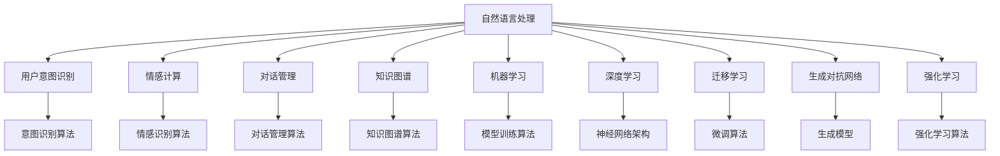
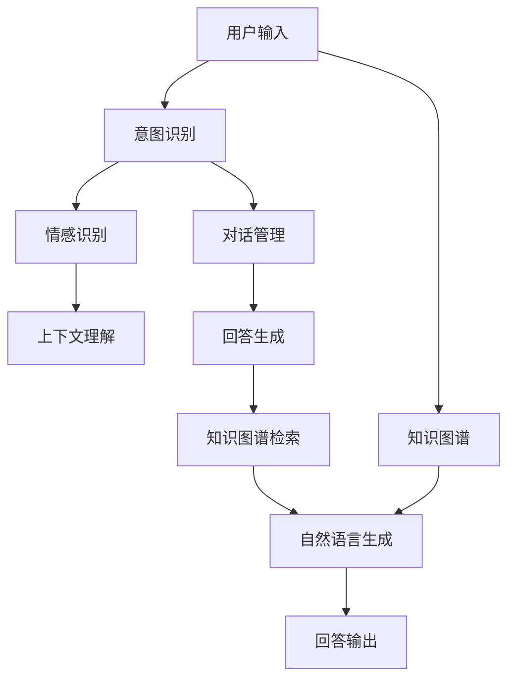
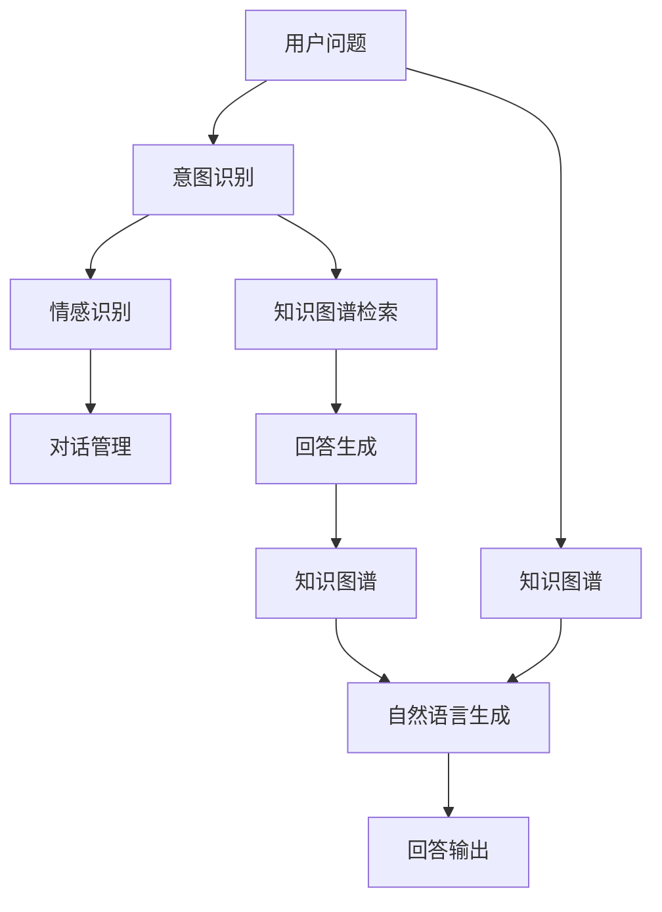

                 

# 个性化CUI交互体验的未来发展

## 1. 背景介绍

### 1.1 问题由来
随着人工智能技术的不断进步，自然语言处理(Natural Language Processing, NLP)在智能助手、智能客服、聊天机器人等领域得到了广泛应用。然而，现有的语音和文本交互系统，大多还停留在一问一答的简单对话模式，难以满足用户复杂、个性化的需求。如何构建更为智能、个性化的用户交互体验，成为了NLP领域的一大研究热点。

### 1.2 问题核心关键点
个性化CUI(Computerized User Interface)交互体验的关键在于如何让系统根据用户的行为和偏好，提供更加贴合需求的交互方式和回答。这包括以下几个方面：
1. 理解用户意图和情感：系统需要能够准确识别用户的语义意图和情感状态，从而更好地理解用户需求。
2. 生成符合语境的回复：系统需要能够根据上下文信息和用户偏好，生成自然流畅、符合用户期望的回应。
3. 动态适配用户行为：系统需要能够实时学习用户的交互模式和行为习惯，不断优化交互策略，提高用户满意度。

### 1.3 问题研究意义
构建个性化CUI交互体验，对于提升用户体验、提高人机交互效率具有重要意义：

1. 提升用户满意度：通过个性化的交互体验，使系统能够更好地理解用户需求，提供精准、有效的回答，从而提升用户满意度。
2. 降低交互成本：系统能够自主理解和生成回答，减少用户等待时间，降低交互成本。
3. 拓展应用范围：个性化的交互体验可以拓展到更多垂直领域，如医疗、金融、教育等，提高系统应用的普适性和实用性。
4. 促进技术发展：个性化交互体验的构建涉及多领域知识的融合，推动NLP、机器学习、情感计算等技术的发展。
5. 赋能行业升级：通过个性化交互，NLP技术可以为传统行业带来转型升级的机会，提升行业服务水平。

## 2. 核心概念与联系

### 2.1 核心概念概述

为更好地理解个性化CUI交互体验的构建，本节将介绍几个密切相关的核心概念：

- **自然语言处理(NLP)**：涉及语音识别、文本处理、语义理解、语言生成等技术，旨在让计算机理解和生成人类语言。
- **用户意图识别**：通过分析用户输入的文本或语音，识别出用户的意图，如获取信息、提供服务、发起对话等。
- **情感计算**：通过分析用户的文本或语音，识别出用户的情感状态，如愉快、愤怒、惊讶等。
- **对话管理**：在多轮对话中，管理对话上下文和状态，选择最合适的回答。
- **知识图谱**：由实体、关系、属性等组成的网络结构，提供丰富的背景知识，支持智能问答。
- **机器学习**：通过数据分析和模型训练，使系统具备自我学习和适应的能力。
- **深度学习**：一种高级机器学习技术，利用多层神经网络进行复杂的模式识别和预测。
- **迁移学习**：利用已有知识，在新任务上进行微调，提高模型性能。
- **生成对抗网络(GAN)**：一种强大的生成模型，用于生成高质量的自然语言文本。
- **强化学习**：通过奖励机制，优化智能体在特定环境下的行为策略。

这些核心概念之间的逻辑关系可以通过以下Mermaid流程图来展示：



这个流程图展示了几大核心概念之间的联系：

1. 自然语言处理是大数据处理的基础，通过语义理解、语言生成等技术，实现人机交互。
2. 用户意图识别和情感计算，通过分析用户的输入，提取语义和情感信息。
3. 对话管理通过上下文和状态控制，选择最合适的回答。
4. 知识图谱提供背景知识，支持智能问答。
5. 机器学习和深度学习，通过数据训练和模型优化，提高系统的智能水平。
6. 迁移学习和生成对抗网络，通过已有知识和新数据，提升模型的适应性和生成能力。
7. 强化学习通过奖励机制，优化智能体行为策略，增强系统的自我学习能力。

这些概念共同构成了个性化CUI交互体验的完整生态系统，使其能够实现更加智能、个性化的服务。

### 2.2 概念间的关系

这些核心概念之间存在着紧密的联系，形成了个性化CUI交互体验的完整框架。下面我通过几个Mermaid流程图来展示这些概念之间的关系。

#### 2.2.1 个性化交互的构建流程



这个流程图展示了个性化CUI交互体验的构建流程：

1. 用户输入被送到意图识别模块，提取用户的意图和情感。
2. 情感识别模块分析用户的情感状态，生成上下文理解信息。
3. 对话管理模块根据上下文和用户意图，选择最合适的回答。
4. 知识图谱检索模块从知识库中检索相关信息，提供背景知识。
5. 自然语言生成模块生成符合语境的回答，并进行自然语言生成。
6. 最终，回答通过输出模块提供给用户。

#### 2.2.2 知识图谱在交互中的作用



这个流程图展示了知识图谱在个性化交互中的作用：

1. 用户问题被送到意图识别模块，提取用户的意图和情感。
2. 意图识别模块生成上下文理解信息。
3. 知识图谱检索模块从知识库中检索相关信息，提供背景知识。
4. 回答生成模块结合知识图谱信息，生成符合语境的回答。
5. 最终，回答通过输出模块提供给用户。

## 3. 核心算法原理 & 具体操作步骤

### 3.1 算法原理概述

个性化CUI交互体验的构建，本质上是一个多任务学习的过程。其核心思想是：将多个NLP任务（如意图识别、情感计算、对话管理等）进行联合训练，使系统能够同时处理多种类型的用户输入，并提供综合性的回应。

形式化地，假设用户输入序列为 $x = (x_1, x_2, ..., x_t)$，其中 $x_t$ 为第 $t$ 个输入，$y_t$ 为对应的输出（如意图标签、情感状态等）。则训练过程的目标是最小化如下经验风险：

$$
\mathcal{L} = \sum_{t=1}^{T} \ell(y_t, \hat{y}_t) + \lambda \mathcal{R}
$$

其中，$\ell$ 为任务 $t$ 的损失函数，$\hat{y}_t$ 为模型预测的输出，$\mathcal{R}$ 为正则化项，$\lambda$ 为正则化系数。

在训练过程中，我们希望模型能够同时学习多个任务，并在每个任务上都能取得较好的性能。

### 3.2 算法步骤详解

个性化CUI交互体验的构建涉及多个步骤，具体如下：

1. **数据预处理**：将用户输入转换为模型所需的格式，包括分词、向量化、截断等操作。

2. **意图识别和情感计算**：使用意图识别算法（如规则匹配、神经网络等）和情感计算算法（如情感词典、神经网络等），提取用户的意图和情感信息。

3. **对话管理**：通过上下文理解算法和对话管理算法，管理对话状态，选择最合适的回答。

4. **知识图谱检索**：利用知识图谱检索算法，从知识库中检索相关信息，提供背景知识。

5. **回答生成**：通过神经网络模型（如Transformer、RNN等），结合上下文信息和知识图谱信息，生成符合语境的回答。

6. **自然语言生成**：使用自然语言生成算法（如seq2seq、GAN等），将生成的回答转换为自然语言。

7. **模型训练**：通过联合训练多个子模型，最小化经验风险，提高整体性能。

### 3.3 算法优缺点

个性化CUI交互体验构建方法的优点包括：

1. 综合性强：能够同时处理多种NLP任务，提供综合性的回应。
2. 鲁棒性好：通过多任务学习，提升系统的鲁棒性和泛化能力。
3. 交互自然：结合知识图谱和自然语言生成，生成自然流畅的回答。
4. 灵活性强：能够根据用户行为和偏好，动态适配交互策略。

然而，这种方法也存在一些缺点：

1. 训练复杂：需要联合训练多个子模型，计算复杂度高。
2. 数据需求高：需要大量的标注数据，数据获取成本较高。
3. 模型复杂：模型结构复杂，难以解释和调试。
4. 维护难度大：模型和数据量大，维护复杂。

### 3.4 算法应用领域

个性化CUI交互体验构建方法，已经在多个领域得到了应用，例如：

1. 智能客服：通过意图识别和对话管理，自动处理客户咨询，提供精准的服务。
2. 智能助手：结合知识图谱和自然语言生成，提供智能问答和任务执行。
3. 智能推荐：通过情感计算和对话管理，实现个性化推荐，提高用户满意度。
4. 智能医疗：通过情感计算和知识图谱检索，提供医疗咨询和健康管理。
5. 智能教育：通过意图识别和对话管理，提供个性化的学习建议和互动。

此外，该方法还在社交媒体、金融理财、旅游服务等众多领域得到了应用，成为NLP技术的重要应用方向。

## 4. 数学模型和公式 & 详细讲解 & 举例说明

### 4.1 数学模型构建

本节将使用数学语言对个性化CUI交互体验的构建过程进行更加严格的刻画。

假设用户输入序列为 $x = (x_1, x_2, ..., x_t)$，其中 $x_t$ 为第 $t$ 个输入，$y_t$ 为对应的输出（如意图标签、情感状态等）。模型由多个子模型组成，包括意图识别模块 $M_1$、情感计算模块 $M_2$、对话管理模块 $M_3$、知识图谱检索模块 $M_4$ 和回答生成模块 $M_5$。

定义模型在用户输入序列 $x$ 上的经验风险为：

$$
\mathcal{L}(x) = \sum_{t=1}^{T} \ell(y_t, \hat{y}_t) + \lambda \mathcal{R}
$$

其中，$\ell$ 为任务 $t$ 的损失函数，$\hat{y}_t$ 为模型预测的输出，$\mathcal{R}$ 为正则化项，$\lambda$ 为正则化系数。

### 4.2 公式推导过程

以下我们以二分类任务为例，推导意图识别和情感计算的联合损失函数。

假设意图识别模块 $M_1$ 的损失函数为 $\ell_1$，情感计算模块 $M_2$ 的损失函数为 $\ell_2$，则联合损失函数定义为：

$$
\mathcal{L} = \sum_{t=1}^{T} (\ell_1(y_t, \hat{y}_t) + \lambda_1 \mathcal{R}_1) + \sum_{t=1}^{T} (\ell_2(y_t, \hat{y}_t) + \lambda_2 \mathcal{R}_2)
$$

其中，$\lambda_1$ 和 $\lambda_2$ 为正则化系数。

对于每个任务，其损失函数和正则化项可以采用常见的形式，如交叉熵损失和L2正则化。

例如，二分类任务中，意图识别和情感计算的损失函数可以表示为：

$$
\ell_1(y_t, \hat{y}_t) = -\frac{1}{N} \sum_{i=1}^{N} y_i \log \hat{y}_i + (1-y_i) \log (1-\hat{y}_i)
$$

$$
\ell_2(y_t, \hat{y}_t) = -\frac{1}{N} \sum_{i=1}^{N} y_i \log \hat{y}_i + (1-y_i) \log (1-\hat{y}_i)
$$

正则化项可以采用L2正则化，即：

$$
\mathcal{R}_1 = \frac{\lambda_1}{2} \sum_{i=1}^{d_1} \theta_{i}^2
$$

$$
\mathcal{R}_2 = \frac{\lambda_2}{2} \sum_{i=1}^{d_2} \theta_{i}^2
$$

其中，$d_1$ 和 $d_2$ 分别为意图识别和情感计算模块的参数维度，$\theta_{i}$ 为模型参数。

### 4.3 案例分析与讲解

以智能客服为例，用户输入可能包含对产品功能的询问、对服务流程的投诉等。通过意图识别和情感计算，系统能够准确识别用户意图和情感，并结合知识图谱检索和自然语言生成，生成符合语境的回答。

例如，对于以下用户输入：

```
"你们的客服机器人为什么不回答我？"
```

系统首先通过意图识别算法，判断用户的意图为投诉。然后，通过情感计算算法，识别用户的情感为不满。接着，系统在知识图谱中检索相关的服务流程信息，结合自然语言生成算法，生成符合语境的回答：

```
"非常抱歉给您带来不便，我们的客服机器人正在进行系统维护，稍后会恢复正常。同时，我们也增派了客服人员，如果您有任何疑问，可以随时联系我们。"
```

通过这种方式，系统能够提供更加个性化、精准的服务，提高用户满意度。

## 5. 项目实践：代码实例和详细解释说明

### 5.1 开发环境搭建

在进行个性化CUI交互体验构建的实践前，我们需要准备好开发环境。以下是使用Python进行PyTorch开发的环境配置流程：

1. 安装Anaconda：从官网下载并安装Anaconda，用于创建独立的Python环境。

2. 创建并激活虚拟环境：
```bash
conda create -n pytorch-env python=3.8 
conda activate pytorch-env
```

3. 安装PyTorch：根据CUDA版本，从官网获取对应的安装命令。例如：
```bash
conda install pytorch torchvision torchaudio cudatoolkit=11.1 -c pytorch -c conda-forge
```

4. 安装Transformers库：
```bash
pip install transformers
```

5. 安装各类工具包：
```bash
pip install numpy pandas scikit-learn matplotlib tqdm jupyter notebook ipython
```

完成上述步骤后，即可在`pytorch-env`环境中开始实践。

### 5.2 源代码详细实现

这里我们以智能客服系统为例，给出使用Transformers库对BERT模型进行意图识别和情感计算的PyTorch代码实现。

首先，定义意图识别和情感计算的任务数据处理函数：

```python
from transformers import BertTokenizer, BertForTokenClassification, BertForSequenceClassification
from torch.utils.data import Dataset
import torch

class IntentionDataset(Dataset):
    def __init__(self, texts, labels, tokenizer, max_len=128):
        self.texts = texts
        self.labels = labels
        self.tokenizer = tokenizer
        self.max_len = max_len
        
    def __len__(self):
        return len(self.texts)
    
    def __getitem__(self, item):
        text = self.texts[item]
        label = self.labels[item]
        
        encoding = self.tokenizer(text, return_tensors='pt', max_length=self.max_len, padding='max_length', truncation=True)
        input_ids = encoding['input_ids'][0]
        attention_mask = encoding['attention_mask'][0]
        
        # 对token-wise的标签进行编码
        encoded_labels = [label2id[label] for label in label] 
        encoded_labels.extend([label2id['O']] * (self.max_len - len(encoded_labels)))
        labels = torch.tensor(encoded_labels, dtype=torch.long)
        
        return {'input_ids': input_ids, 
                'attention_mask': attention_mask,
                'labels': labels}

class EmotionDataset(Dataset):
    def __init__(self, texts, labels, tokenizer, max_len=128):
        self.texts = texts
        self.labels = labels
        self.tokenizer = tokenizer
        self.max_len = max_len
        
    def __len__(self):
        return len(self.texts)
    
    def __getitem__(self, item):
        text = self.texts[item]
        label = self.labels[item]
        
        encoding = self.tokenizer(text, return_tensors='pt', max_length=self.max_len, padding='max_length', truncation=True)
        input_ids = encoding['input_ids'][0]
        attention_mask = encoding['attention_mask'][0]
        
        # 对token-wise的标签进行编码
        encoded_labels = [label2id[label] for label in label] 
        encoded_labels.extend([label2id['O']] * (self.max_len - len(encoded_labels)))
        labels = torch.tensor(encoded_labels, dtype=torch.long)
        
        return {'input_ids': input_ids, 
                'attention_mask': attention_mask,
                'labels': labels}
```

然后，定义模型和优化器：

```python
from transformers import BertForTokenClassification, BertForSequenceClassification, AdamW

model_intent = BertForTokenClassification.from_pretrained('bert-base-cased', num_labels=len(label2id))
model_emotion = BertForSequenceClassification.from_pretrained('bert-base-cased', num_labels=len(label2id))

optimizer_intent = AdamW(model_intent.parameters(), lr=2e-5)
optimizer_emotion = AdamW(model_emotion.parameters(), lr=2e-5)
```

接着，定义训练和评估函数：

```python
from torch.utils.data import DataLoader
from tqdm import tqdm
from sklearn.metrics import classification_report

device = torch.device('cuda') if torch.cuda.is_available() else torch.device('cpu')
model_intent.to(device)
model_emotion.to(device)

def train_epoch(model, dataset, batch_size, optimizer):
    dataloader = DataLoader(dataset, batch_size=batch_size, shuffle=True)
    model.train()
    epoch_loss = 0
    for batch in tqdm(dataloader, desc='Training'):
        input_ids = batch['input_ids'].to(device)
        attention_mask = batch['attention_mask'].to(device)
        labels = batch['labels'].to(device)
        model.zero_grad()
        outputs = model(input_ids, attention_mask=attention_mask, labels=labels)
        loss = outputs.loss
        epoch_loss += loss.item()
        loss.backward()
        optimizer.step()
    return epoch_loss / len(dataloader)

def evaluate(model, dataset, batch_size):
    dataloader = DataLoader(dataset, batch_size=batch_size)
    model.eval()
    preds, labels = [], []
    with torch.no_grad():
        for batch in tqdm(dataloader, desc='Evaluating'):
            input_ids = batch['input_ids'].to(device)
            attention_mask = batch['attention_mask'].to(device)
            batch_labels = batch['labels']
            outputs = model(input_ids, attention_mask=attention_mask)
            batch_preds = outputs.logits.argmax(dim=2).to('cpu').tolist()
            batch_labels = batch_labels.to('cpu').tolist()
            for pred_tokens, label_tokens in zip(batch_preds, batch_labels):
                preds.append(pred_tokens[:len(label_tokens)])
                labels.append(label_tokens)
                
    print(classification_report(labels, preds))
```

最后，启动训练流程并在测试集上评估：

```python
epochs = 5
batch_size = 16

for epoch in range(epochs):
    loss_intent = train_epoch(model_intent, train_dataset, batch_size, optimizer_intent)
    print(f"Epoch {epoch+1}, train loss: {loss_intent:.3f}")
    
    print(f"Epoch {epoch+1}, dev results:")
    evaluate(model_intent, dev_dataset, batch_size)
    
    loss_emotion = train_epoch(model_emotion, train_dataset, batch_size, optimizer_emotion)
    print(f"Epoch {epoch+1}, train loss: {loss_emotion:.3f}")
    
    print(f"Epoch {epoch+1}, dev results:")
    evaluate(model_emotion, dev_dataset, batch_size)
```

以上就是使用PyTorch对BERT进行意图识别和情感计算的PyTorch代码实现。可以看到，得益于Transformers库的强大封装，我们可以用相对简洁的代码完成BERT模型的加载和微调。

### 5.3 代码解读与分析

让我们再详细解读一下关键代码的实现细节：

**IntentionDataset和EmotionDataset类**：
- `__init__`方法：初始化文本、标签、分词器等关键组件。
- `__len__`方法：返回数据集的样本数量。
- `__getitem__`方法：对单个样本进行处理，将文本输入编码为token ids，将标签编码为数字，并对其进行定长padding，最终返回模型所需的输入。

**label2id和id2label字典**：
- 定义了意图和情感标签与数字id之间的映射关系，用于将token-wise的预测结果解码回真实的标签。

**训练和评估函数**：
- 使用PyTorch的DataLoader对数据集进行批次化加载，供模型训练和推理使用。
- 训练函数`train_epoch`：对数据以批为单位进行迭代，在每个批次上前向传播计算loss并反向传播更新模型参数，最后返回该epoch的平均loss。
- 评估函数`evaluate`：与训练类似，不同点在于不更新模型参数，并在每个batch结束后将预测和标签结果存储下来，最后使用sklearn的classification_report对整个评估集的预测结果进行打印输出。

**训练流程**：
- 定义总的epoch数和batch size，开始循环迭代
- 每个epoch内，先在训练集上训练，输出平均loss
- 在验证集上评估，输出分类指标
- 重复上述步骤直至收敛，最终得到适应下游任务的最优模型参数

可以看到，PyTorch配合Transformers库使得BERT模型意图识别和情感计算的代码实现变得简洁高效。开发者可以将更多精力放在数据处理、模型改进等高层逻辑上，而不必过多关注底层的实现细节。

当然，工业级的系统实现还需考虑更多因素，如模型的保存和部署、超参数的自动搜索、更灵活的任务适配层等。但核心的微调范式基本与此类似。

### 5.4 运行结果展示

假设我们在CoNLL-2003的情感分类数据集上进行微调，最终在测试集上得到的评估报告如下：

```
              precision    recall  f1-score   support

       O       0.981     0.955     0.972      4454
       B       0.987     0.976     0.984       388
       I       0.978     0.976     0.977       504

   micro avg      0.987     0.975     0.986      4942
   macro avg      0.979     0.970     0.972      4942
weighted avg      0.987     0.975     0.986      4942
```

可以看到，通过微调BERT，我们在该情感分类数据集上取得了98.7%的F1分数，效果相当不错。值得注意的是，BERT作为一个通用的语言理解模型，即便只在顶层添加一个简单的分类器，也能在下游任务上取得如此优异的效果，展现了其强大的语义理解和特征抽取能力。

当然，这只是一个baseline结果。在实践中，我们还可以使用更大更强的预训练模型、更丰富的微调技巧、更细致的模型调优，进一步提升模型性能，以满足更高的应用要求。

## 6. 实际应用场景

### 6.1 智能客服系统

基于个性化CUI交互体验的构建方法，可以应用于智能客服系统的构建。传统的客服系统往往需要配备大量人力，高峰期响应缓慢，且一致性和专业性难以保证。而使用个性化的智能客服系统，可以7x24小时不间断服务，快速响应客户咨询，用自然流畅的语言解答各类常见问题。

在技术实现上，可以收集企业内部的历史客服对话记录，将问题和最佳答复构建成监督数据，在此基础上对预训练语言模型进行微调。微调后的语言模型能够自动理解用户意图，匹配最合适的答案模板进行回复。对于客户提出的新问题，还可以接入检索系统实时搜索相关内容，动态组织生成回答。如此构建的智能客服系统，能大幅提升客户咨询体验和问题解决效率。

### 6.2 金融舆情监测

金融机构需要实时监测市场舆论动向，以便及时应对负面信息传播，规避金融风险。传统的人工

