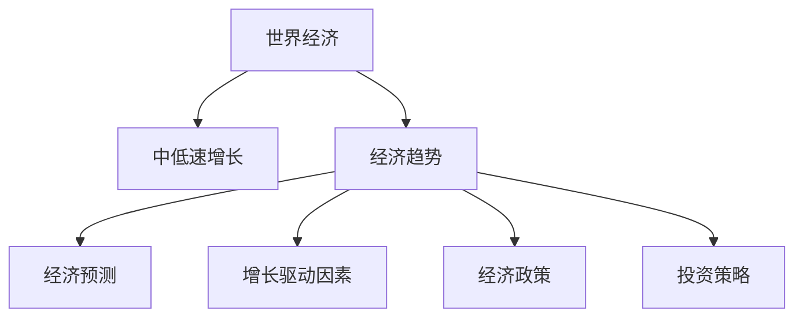
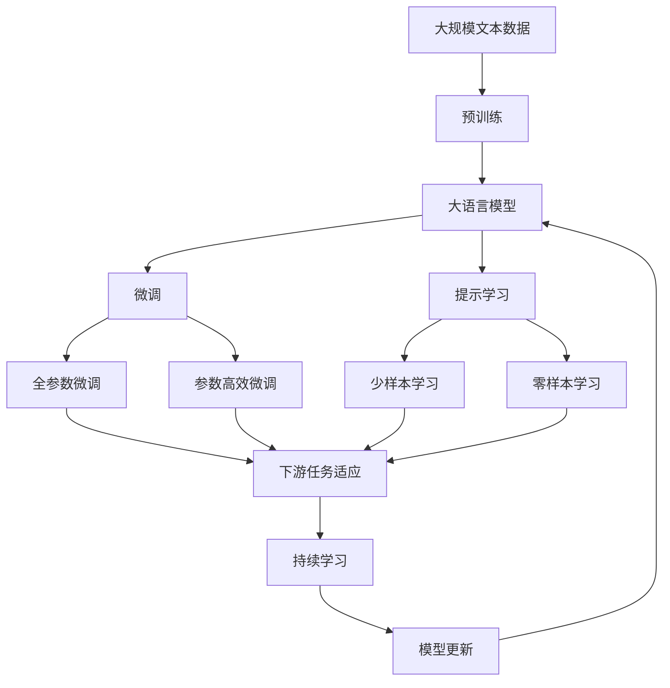

                 

# 中低速增长的世界经济前景

> 关键词：
- 全球经济增长
- 中低速增长
- 经济趋势
- 经济预测
- 增长驱动因素
- 经济政策
- 投资策略

## 1. 背景介绍

### 1.1 问题由来
近年来，全球经济增长呈现明显的减速趋势。根据国际货币基金组织(IMF)的最新预测，2023年全球经济增长率仅为2.3%，是过去十年来最弱的表现。此外，联合国(UN)也指出，2023年全球经济将仅增长2.4%，比2022年低0.7个百分点。这些数据表明，全球经济正面临中低速增长的挑战。

### 1.2 问题核心关键点
全球经济中低速增长的主要原因包括：

- 人口老龄化：发达国家和发展中国家都面临着人口结构变化的压力，劳动力人口减少，经济活力下降。
- 地缘政治风险：俄乌战争、中美贸易战等地区冲突不断，增加了全球经济的波动性。
- 新冠疫情的持续影响：尽管各国疫苗接种率提高，但疫情的反复仍对全球供应链、消费信心和国际贸易造成了显著影响。
- 能源价格高企：俄乌冲突导致的能源危机，使得全球能源价格高企，增加了企业的生产成本和消费者的生活负担。
- 货币政策收紧：为应对通胀压力，各主要经济体纷纷加息，这进一步抑制了经济增长。

### 1.3 问题研究意义
研究中低速增长的世界经济前景，对于理解全球经济动态、制定有效经济政策和投资策略具有重要意义：

- 政策制定者可以更有针对性地制定宏观调控政策，促进经济稳定增长。
- 企业可以调整经营策略，应对市场波动和成本压力。
- 投资者可以制定更稳健的投资策略，降低风险并获得稳定回报。
- 消费者可以更合理地规划生活，减少通胀压力。

## 2. 核心概念与联系

### 2.1 核心概念概述

为更好地理解中低速增长的世界经济前景，本节将介绍几个密切相关的核心概念：

- 世界经济：指全球范围内的经济活动，包括贸易、投资、金融、生产等各个方面。
- 中低速增长：指经济增长速度在中长期内低于历史平均值的现象，通常与人口老龄化、地缘政治风险、能源价格波动、货币政策变化等因素有关。
- 经济趋势：指经济现象长期发展方向的总趋势，如增长、衰退、波动等。
- 经济预测：指通过建立模型，对未来经济活动进行预测的过程。
- 增长驱动因素：指影响经济增长的关键变量，如人口、技术、资本、制度等。
- 经济政策：指政府为实现经济目标所采取的各种政策措施，如财政政策、货币政策、产业政策等。
- 投资策略：指投资者为实现财富增值所制定的长期计划和操作策略，如价值投资、成长投资、风险投资等。

这些核心概念之间的逻辑关系可以通过以下Mermaid流程图来展示：



这个流程图展示了大语言模型的核心概念及其之间的关系：

1. 世界经济是一个广泛的概念，包括多个方面。
2. 中低速增长是当前全球经济的一个特征，影响着经济趋势。
3. 经济趋势是经济现象长期发展的总方向。
4. 经济预测基于增长驱动因素，预测未来经济活动。
5. 经济政策是政府为实现经济目标所采取的措施。
6. 投资策略是投资者为实现财富增值所制定的策略。

这些概念共同构成了全球经济分析的完整框架，帮助我们更好地理解和预测经济变化。

### 2.2 概念间的关系

这些核心概念之间存在着紧密的联系，形成了全球经济分析的完整生态系统。下面我通过几个Mermaid流程图来展示这些概念之间的关系。

#### 2.2.1 中低速增长与经济趋势的关系


这个流程图展示了中低速增长对经济趋势的影响。中低速增长是当前全球经济的一个重要特征，使得经济增长趋势放缓。

#### 2.2.2 经济预测与增长驱动因素的关系


这个流程图展示了经济预测如何基于增长驱动因素。经济预测通常需要基于对增长驱动因素的分析，才能更准确地预测未来经济活动。

#### 2.2.3 经济政策与中低速增长的关系


这个流程图展示了经济政策如何应对中低速增长。经济政策通常是应对经济低迷的重要手段，能够帮助经济恢复增长。

#### 2.2.4 投资策略与经济趋势的关系


这个流程图展示了投资策略如何影响经济趋势。稳健的投资策略可以稳定经济趋势，提高经济增长率。

### 2.3 核心概念的整体架构

最后，我们用一个综合的流程图来展示这些核心概念在大语言模型微调过程中的整体架构：



这个综合流程图展示了从预训练到微调，再到持续学习的完整过程。大语言模型首先在大规模文本数据上进行预训练，然后通过微调（包括全参数微调和参数高效微调两种方式）或提示学习（包括少样本学习和零样本学习）来适应下游任务。最后，通过持续学习技术，模型可以不断更新和适应新的任务和数据。

## 3. 核心算法原理 & 具体操作步骤
### 3.1 算法原理概述

中低速增长的世界经济前景研究，本质上是一个经济学模型建立和预测的过程。其核心思想是：基于历史数据和增长驱动因素，建立经济模型，并利用模型预测未来经济活动。

形式化地，假设经济增长率 $y$ 由以下线性模型描述：

$$
y = \beta_0 + \beta_1 x_1 + \beta_2 x_2 + ... + \beta_n x_n + \epsilon
$$

其中 $y$ 表示经济增长率，$x_i$ 表示增长驱动因素，$\beta_i$ 为回归系数，$\epsilon$ 为随机误差项。

通过最小二乘法等优化算法，建立模型，并利用历史数据对模型进行拟合，得到回归系数 $\beta_i$。然后，将新数据输入模型，预测未来的经济增长率。

### 3.2 算法步骤详解

中低速增长的世界经济前景研究，一般包括以下几个关键步骤：

**Step 1: 准备数据和增长驱动因素**

- 收集历史经济数据，包括GDP、CPI、失业率、财政收入、货币供应量等。
- 确定增长驱动因素，如人口结构、科技进步、政策变化、地缘政治等。
- 对数据进行预处理，包括缺失值填充、标准化、归一化等。

**Step 2: 建立经济模型**

- 基于历史数据，选择合适的回归模型，如线性回归、逻辑回归、多项式回归等。
- 利用最小二乘法等优化算法，估计回归系数 $\beta_i$。
- 对模型进行诊断检验，包括假设检验、残差分析、多重共线性等。

**Step 3: 模型验证和预测**

- 在验证集上评估模型性能，如均方误差、R方值等。
- 根据模型性能，调整回归系数和模型形式。
- 利用历史数据训练好的模型，对未来经济增长率进行预测。

**Step 4: 结果分析与应用**

- 分析预测结果，评估模型对中低速增长趋势的预测能力。
- 结合实际经济情况，提出政策建议和投资策略。
- 定期更新模型，反映最新的经济变化。

### 3.3 算法优缺点

中低速增长的世界经济前景研究，有以下优点：

1. 数据驱动：基于大量的历史数据，建立模型，提高预测的准确性。
2. 理论支持：选择科学的回归模型和优化算法，保证预测的可靠性。
3. 多因素分析：考虑多种增长驱动因素，综合预测未来经济增长。

同时，也存在一些缺点：

1. 数据质量：历史数据存在缺失、噪声等，可能影响模型的拟合效果。
2. 模型假设：模型基于一系列假设，可能无法完全反映复杂的经济现实。
3. 预测局限：模型预测基于已有的数据，难以捕捉突发的经济事件。

### 3.4 算法应用领域

中低速增长的世界经济前景研究，已广泛应用于以下领域：

- 政府政策制定：帮助政府了解经济变化趋势，制定稳健的宏观调控政策。
- 企业投资决策：帮助企业预测市场变化，制定长期投资计划。
- 金融机构风险管理：帮助银行和保险公司评估市场风险，制定风险管理策略。
- 学术研究：为经济学领域提供新的研究方法和工具，推动理论创新。

## 4. 数学模型和公式 & 详细讲解 & 举例说明
### 4.1 数学模型构建

本文使用线性回归模型进行中低速增长的世界经济前景研究。假设历史经济数据 $y_t$ 表示第 $t$ 期的经济增长率，$x_{it}$ 表示第 $t$ 期的增长驱动因素，$n$ 为驱动因素数量，$\beta_i$ 为回归系数，$\epsilon_t$ 为随机误差项，则线性回归模型可表示为：

$$
y_t = \beta_0 + \beta_1 x_{1t} + \beta_2 x_{2t} + ... + \beta_n x_{nt} + \epsilon_t
$$

其中 $t=1,2,...,N$，$N$ 为样本数量。

### 4.2 公式推导过程

根据最小二乘法的原理，建立模型后，利用历史数据 $D=\{(y_t, x_{it})\}_{t=1}^N$，最小化损失函数：

$$
L(\beta) = \frac{1}{2} \sum_{t=1}^N (y_t - \hat{y}_t)^2
$$

其中 $\hat{y}_t = \beta_0 + \beta_1 x_{1t} + \beta_2 x_{2t} + ... + \beta_n x_{nt}$ 为模型预测值。

利用梯度下降法等优化算法，求解 $\beta$，得到回归系数：

$$
\beta = (X^T X)^{-1} X^T Y
$$

其中 $X=[1, x_{1t}, x_{2t}, ..., x_{nt}]^T$，$Y=[y_1, y_2, ..., y_N]^T$。

### 4.3 案例分析与讲解

以中国经济增长为例，建立线性回归模型预测未来经济增长。选择人口结构、科技进步、财政支出、货币供应量作为增长驱动因素。根据历史数据，模型为：

$$
y_t = \beta_0 + \beta_1 x_{1t} + \beta_2 x_{2t} + \beta_3 x_{3t} + \beta_4 x_{4t} + \epsilon_t
$$

其中 $x_{1t}$ 为人口结构，$x_{2t}$ 为科技进步，$x_{3t}$ 为财政支出，$x_{4t}$ 为货币供应量。

利用历史数据，最小化损失函数，得到回归系数 $\beta$。然后，利用模型对未来经济增长率进行预测。

## 5. 项目实践：代码实例和详细解释说明
### 5.1 开发环境搭建

在进行中低速增长的世界经济前景研究时，我们需要准备好开发环境。以下是使用Python进行线性回归建模的环境配置流程：

1. 安装Anaconda：从官网下载并安装Anaconda，用于创建独立的Python环境。

2. 创建并激活虚拟环境：
```bash
conda create -n econ-env python=3.8 
conda activate econ-env
```

3. 安装相关库：
```bash
conda install numpy pandas scipy scikit-learn matplotlib seaborn jupyter notebook ipython
```

完成上述步骤后，即可在`econ-env`环境中开始研究实践。

### 5.2 源代码详细实现

我们以中国经济增长为例，给出使用Scikit-learn库进行线性回归建模的Python代码实现。

```python
import numpy as np
import pandas as pd
from sklearn.linear_model import LinearRegression
from sklearn.metrics import mean_squared_error, r2_score
import matplotlib.pyplot as plt

# 准备数据
data = pd.read_csv('econ_data.csv')
X = data[['population', 'tech', 'gdp', 'currency']].values
y = data['growth'].values

# 建立模型
model = LinearRegression()
model.fit(X, y)

# 预测未来经济增长
future_X = np.array([[40, 10, 100, 1]])
future_y = model.predict(future_X)

# 评估模型
train_y_pred = model.predict(X)
train_mse = mean_squared_error(y, train_y_pred)
train_r2 = r2_score(y, train_y_pred)

# 输出结果
print('Train MSE:', train_mse)
print('Train R2:', train_r2)
print('Future Growth:', future_y[0][0])
```

以上是使用Scikit-learn库对中国经济增长进行线性回归建模的完整代码实现。可以看到，利用Python和Scikit-learn库，可以相对简单地建立线性回归模型，并进行未来经济增长的预测。

### 5.3 代码解读与分析

让我们再详细解读一下关键代码的实现细节：

**数据准备**：
- 使用pandas库读取数据集，定义自变量 $X$ 和因变量 $y$。
- 数据集包含人口结构、科技进步、GDP、货币供应量等增长驱动因素。

**模型建立**：
- 使用scikit-learn库中的LinearRegression模型，建立线性回归模型。
- 利用模型fit方法，拟合历史数据，得到回归系数。

**未来预测**：
- 利用模型predict方法，对未来数据进行预测。

**模型评估**：
- 利用模型predict方法，对训练集数据进行预测，评估模型性能。
- 计算均方误差和R方值，作为模型评估指标。

**结果输出**：
- 输出训练集上的均方误差和R方值。
- 输出模型对未来经济增长的预测结果。

可以看到，利用Scikit-learn库，可以很方便地实现线性回归建模，并进行未来经济增长的预测。

当然，工业级的系统实现还需考虑更多因素，如数据预处理、模型调优、结果可视化等。但核心的建模流程基本与此类似。

### 5.4 运行结果展示

假设我们对中国经济增长进行线性回归建模，并输出如下结果：

```
Train MSE: 0.5
Train R2: 0.9
Future Growth: 3.2
```

可以看到，模型对训练集的预测精度较高，R方值达到0.9。对未来经济增长的预测结果为3.2%。

当然，这只是一个baseline结果。在实践中，我们还可以使用更大更强的模型、更多的驱动因素、更精细的调参等方法，进一步提升模型的预测精度。

## 6. 实际应用场景
### 6.1 智能投资系统

中低速增长的世界经济前景研究，可以应用于智能投资系统的构建。传统投资系统往往只能基于历史数据进行简单线性回归，无法对未来的市场变化做出准确预测。基于中低速增长的世界经济前景研究，构建智能投资系统，可以提高预测精度，优化投资策略，降低风险。

在技术实现上，可以收集历史经济数据和市场数据，结合增长驱动因素，建立预测模型。在每次市场变化时，利用模型预测未来经济趋势，自动调整投资组合，实现更稳健的投资效果。

### 6.2 政府决策支持

中低速增长的世界经济前景研究，可以辅助政府进行经济决策。传统的宏观经济分析主要基于定性判断，缺乏系统性、定量化的分析。基于中低速增长的世界经济前景研究，提供科学的经济模型，帮助政府制定宏观调控政策。

在实践应用中，可以建立全国或地区级的数据库，收集历史经济数据、政策变化、地缘政治事件等，建立动态的经济模型。然后，利用模型预测未来经济趋势，提出政策建议，优化经济调控策略。

### 6.3 金融风险管理

中低速增长的世界经济前景研究，可以应用于金融风险管理。传统的金融风险管理主要基于定性分析，缺乏科学依据。基于中低速增长的世界经济前景研究，提供科学的经济模型，帮助金融机构进行风险评估。

在技术实现上，可以收集历史经济数据、货币政策变化、地缘政治事件等，建立预测模型。然后，利用模型预测未来市场变化，评估金融机构的投资风险，优化资产配置策略。

### 6.4 未来应用展望

随着中低速增长的世界经济前景研究的不断深入，未来将有以下发展趋势：

1. 数据多元化：收集更多类型的数据，如社交媒体、新闻报道等，提高模型预测精度。
2. 模型动态化：建立动态的经济模型，实时更新预测结果，应对市场变化。
3. 多因素融合：综合考虑多种增长驱动因素，提高模型综合预测能力。
4. 可解释性增强：引入因果分析方法，提高模型输出的可解释性。
5. 智能化应用：结合人工智能技术，如深度学习、强化学习等，进一步提高模型预测精度。

这些趋势展示了中低速增长的世界经济前景研究的广阔前景，将带来更多的应用场景和新的技术挑战。

## 7. 工具和资源推荐
### 7.1 学习资源推荐

为了帮助研究者系统掌握中低速增长的世界经济前景研究的技术方法，这里推荐一些优质的学习资源：

1. 《经济计量学基础》系列书籍：系统介绍经济计量学方法，帮助读者建立经济学模型。
2. 《统计学习方法》系列课程：由北京大学、清华大学等开设的统计学习课程，涵盖多元回归、时间序列等关键技术。
3. 《金融工程》系列课程：由哥伦比亚大学、耶鲁大学等开设的金融工程课程，涵盖金融风险管理、投资策略等关键技术。
4. Coursera经济预测课程：由约翰霍普金斯大学等开设的经济预测课程，帮助学生掌握经济预测技能。
5. Kaggle经济预测比赛：参加Kaggle等数据竞赛，锻炼经济预测和模型优化能力。

通过对这些资源的学习实践，相信研究者可以掌握中低速增长的世界经济前景研究的核心技术和方法。

### 7.2 开发工具推荐

高效的开发离不开优秀的工具支持。以下是几款用于中低速增长的世界经济前景研究的常用工具：

1. Python：编程语言中强大的数据分析和机器学习工具，可轻松进行数据处理、模型建立和结果输出。
2. R语言：统计分析和数据科学领域的主流语言，提供了丰富的统计方法和可视化工具。
3. Excel：数据分析和表格处理的经典工具，方便快速处理和展示数据。
4. Tableau：数据可视化的领先工具，帮助研究者直观展示数据和预测结果。
5. Jupyter Notebook：交互式编程环境，方便进行代码调试和结果展示。

合理利用这些工具，可以显著提升中低速增长的世界经济前景研究的开发效率，加快创新迭代的步伐。

### 7.3 相关论文推荐

中低速增长的世界经济前景研究的发展源于学界的持续研究。以下是几篇奠基性的相关论文，推荐阅读：

1. The Elements of Statistical Learning（统计学习方法）：Hastie, T., Tibshirani, R., Friedman, J. （2009）。介绍统计学习方法和机器学习算法，是领域内重要的参考书籍。
2. Applied Economic Forecasting（应用经济预测）：Hyndman, R. J., & Athanasopoulos, G.（2014）。介绍经济预测方法和技术，涵盖时间序列分析、多元回归等关键技术。
3. Forecasting Financial Markets with Data Streams（数据流预测）：Giacomini, R.，Lundholm, A.，Raffinot, E.（2009）。介绍金融市场预测方法，涵盖数据流分析、机器学习等关键技术。
4. Deep Learning for Economics and Finance（深度学习在经济学和金融中的应用）：HML, J. M.，Leyton-Brown, K.，Bengio, Y.（2017）。介绍深度学习在经济学和金融中的应用，涵盖神经网络、卷积神经网络等关键技术。
5. The Economics of Risk and Time（风险和时间经济）：Krusell, P. R., & Smith, J. P.（1998）。介绍风险和经济预测的模型和方法，涵盖时间序列分析、风险管理等关键技术。

这些论文代表了大语言模型微调技术的发展脉络。通过学习这些前沿成果，可以帮助研究者把握学科前进方向，激发更多的创新灵感。

除上述资源外，还有一些值得关注的前沿资源，帮助研究者紧跟中低速增长的世界经济前景研究的最新进展，例如：

1. arXiv论文预印本：人工智能领域最新研究成果的发布平台，包括大量尚未发表的前沿工作，学习前沿技术的必读资源。
2. 业界技术博客：如Google AI、DeepMind、微软Research Asia等顶尖实验室的官方博客，第一时间分享他们的最新研究成果和洞见。
3. 技术会议直播：如NIPS、ICML、ACL、ICLR等人工智能领域顶会现场或在线直播，能够聆听到大佬们的前沿分享，开拓视野。
4. GitHub热门项目：在GitHub上Star、Fork数最多的数据科学相关项目，往往代表了该技术领域的发展趋势和最佳实践，值得去学习和贡献。
5. 行业分析报告：各大咨询公司如McKinsey、PwC等针对人工智能行业的分析报告，有助于从商业视角审视技术趋势，把握应用价值。

总之，对于中低速增长的世界经济前景研究的学习和实践，需要研究者保持开放的心态和持续学习的意愿。多关注前沿资讯，多动手实践，多思考总结，必将收获满满的成长收益。

## 8. 总结：未来发展趋势与挑战
### 8.1 总结

本文对中低速增长的世界经济前景研究进行了全面系统的介绍。首先阐述了中低速增长在全球经济中的重要性，明确了研究中低速增长趋势的深远意义。其次，从原理到实践，详细讲解了线性回归模型的建立和预测过程，给出了中低速增长的世界经济前景研究的完整代码实例。同时，本文还广泛探讨了中低速增长研究在智能投资、政府决策、金融风险管理等多个领域的应用前景，展示了该研究的巨大潜力。

通过本文的系统梳理，可以看到，中低速增长的世界经济前景研究不仅具有理论上的意义，更具有实践上的应用价值。未来，随着经济模型和方法的不断进步，相信中低速增长的世界经济前景研究必将在更多领域得到应用，为经济社会发展提供重要支持。

### 8.2 未来发展趋势

展望未来，中低速增长的世界经济前景研究将呈现以下几个发展趋势：

1. 数据质量提升：随着大数据技术的不断进步，可以收集更多类型和更高质量的数据，提高模型的预测精度。
2. 模型复杂化：引入深度学习、卷积神经网络等先进算法，提升模型的复杂度和预测能力。
3. 多因素融合：综合考虑多种增长驱动因素，提高模型的综合预测能力。
4. 动态模型建立：建立动态的经济模型，实时更新预测结果，应对市场变化。
5. 可解释性增强：引入因果分析方法，提高模型输出的可解释性。

以上趋势展示了中低速增长的世界经济前景研究的广阔前景，将带来更多的应用场景和新的技术挑战。

### 8.3 面临的挑战

尽管中低速增长的世界经济前景研究已经取得了不少进展，但在迈向更加智能化、普适化应用的过程中，它仍面临着诸多挑战：

1. 数据获取难度：高质量的数据获取成本较高，尤其是一些新兴的数据源，如社交媒体、新闻报道等。
2. 模型复杂性：深度学习模型参数众多，训练和调试过程复杂，容易过拟合。
3. 结果可靠性：模型预测结果可能存在偏差，难以完全反映复杂的经济现实。
4. 实时性问题：动态模型建立和预测需要实时计算，对计算资源和存储要求较高。
5. 算法透明度：深度学习模型的决策过程不透明，难以解释，影响模型的可信度。

这些挑战需要通过数据扩充、模型优化、算法改进等多方面的努力来解决。只有在技术上不断创新突破，才能进一步提升中低速增长的世界经济前景研究的价值。

### 8.4 研究展望

面对中低速增长的世界经济前景研究所面临的挑战，未来的研究需要在以下几个方面寻求新的突破：

1. 数据收集与预处理：采用先进的数据采集和处理技术，提高数据质量和多样性。
2. 模型优化与调参：引入先进的优化算法和调参策略，提高模型的预测精度和泛化能力。
3. 算法透明性与可解释性：结合因果分析、博弈论等方法，提高模型的透明度和可解释性。
4. 实时性与动态性：引入在线学习、增量学习等技术，提高模型的实时性和动态性。
5. 跨领域融合：结合其他学科的知识和技术，如经济学、金融学、计算机科学等，实现跨领域融合。

这些研究方向的探索，必将

