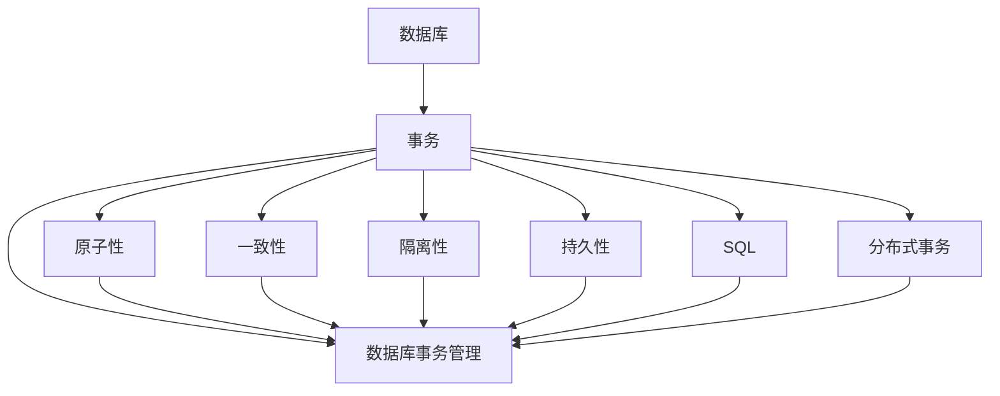
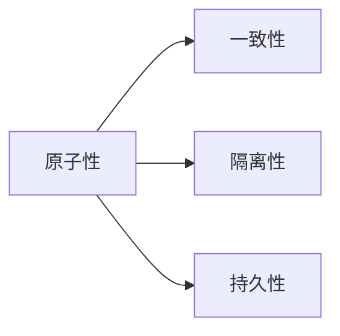
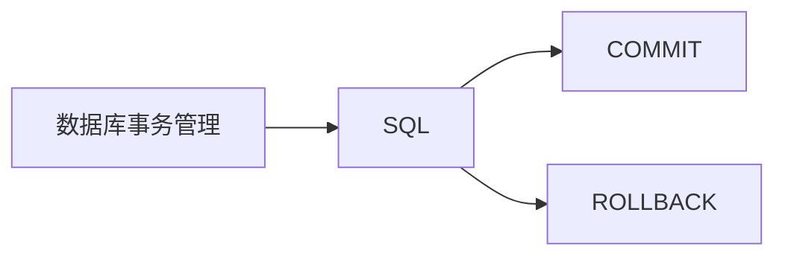
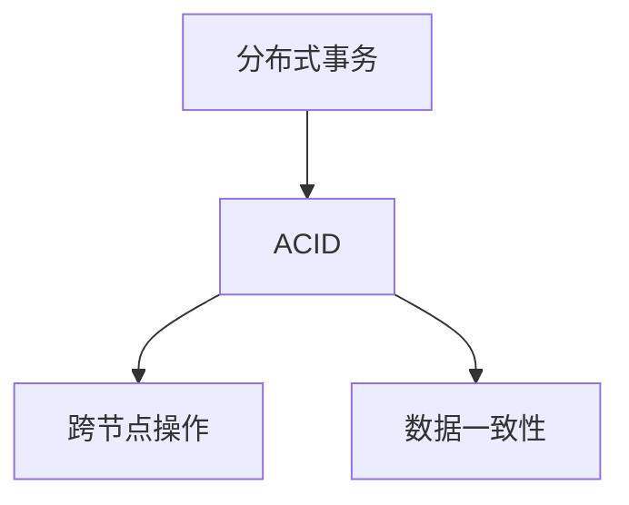
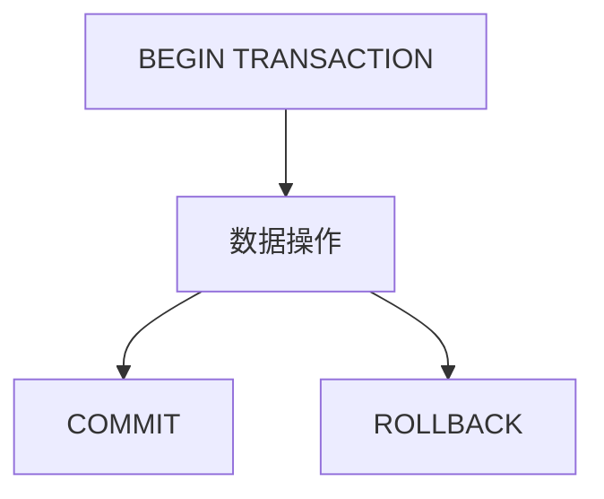

                 

# 事务 原理与代码实例讲解

> 关键词：事务, ACID, 数据库, SQL, 分布式事务, 代码实例, 数据库事务管理, 事务隔离级别

## 1. 背景介绍

### 1.1 问题由来
在分布式系统中，随着业务规模的扩大，单个数据库的事务处理能力受到限制，难以满足系统的复杂需求。为了保证数据的一致性和可靠性，数据库系统引入了事务机制，通过ACID原则确保数据操作的原子性、一致性、隔离性和持久性。然而，如何高效地管理和调度分布式事务，是一个复杂的系统性问题，需要从原理到实践，进行深入理解和优化。

## 2. 核心概念与联系

### 2.1 核心概念概述

为了更好地理解事务原理和代码实例，本节将介绍几个密切相关的核心概念：

- 事务(Transaction)：指一组数据库操作，这些操作要么全部执行，要么全部不执行。事务是数据库操作的基本单位，保证数据的一致性。
- ACID：指数据库事务的四项基本特性，即原子性(Atomicity)、一致性(Consistency)、隔离性(Isolation)和持久性(Durability)。
- 数据库(Database)：存储和管理数据的软件系统，是事务的基本操作对象。
- SQL：结构化查询语言，用于数据库的操作和查询。
- 分布式事务(Distributed Transaction)：指在多个数据库之间进行的事务处理，需要跨越多个节点进行数据操作。
- 数据库事务管理：指如何通过程序实现数据库事务的创建、提交和回滚，保证事务的正确性。

这些核心概念之间的逻辑关系可以通过以下Mermaid流程图来展示：



这个流程图展示了大事务的基本概念及其之间的关系：

1. 数据库是事务的基本操作对象。
2. 事务是数据库操作的基本单位，通过ACID特性保证数据一致性。
3. SQL用于数据库的操作和查询。
4. 分布式事务指在多个数据库之间进行的事务处理。
5. 数据库事务管理是实现事务的基本手段。
6. ACID特性和SQL语言是数据库事务管理的基础。

### 2.2 概念间的关系

这些核心概念之间存在着紧密的联系，形成了事务处理的基础框架。下面我们通过几个Mermaid流程图来展示这些概念之间的关系。

#### 2.2.1 事务的ACID特性



这个流程图展示了事务的四个特性：

1. 原子性指事务是一个不可分割的操作单元，要么全部执行，要么全部不执行。
2. 一致性指事务执行前后，数据库状态保持一致。
3. 隔离性指事务之间互相隔离，互不干扰。
4. 持久性指事务提交后，数据被永久保存。

#### 2.2.2 数据库事务管理与SQL



这个流程图展示了SQL语言在数据库事务管理中的作用：

1. 数据库事务管理通过COMMIT和ROLLBACK命令，保证事务的正确性。
2. SQL语言提供了COMMIT和ROLLBACK语句，用于提交和回滚事务。
3. 事务管理通过SQL语句进行事务的创建、提交和回滚。

#### 2.2.3 分布式事务与ACID



这个流程图展示了分布式事务与ACID的关系：

1. 分布式事务指在多个数据库之间进行的事务处理。
2. 分布式事务通过ACID特性保证数据的一致性。
3. 跨节点操作需要保证ACID特性，确保数据一致性。

## 3. 核心算法原理 & 具体操作步骤

### 3.1 算法原理概述

事务的原理建立在ACID特性的基础上，通过一组SQL语句的操作，实现数据的原子性、一致性、隔离性和持久性。具体来说，事务的实现过程包括以下几个步骤：

1. 事务开始：通过BEGIN TRANSACTION命令，启动一个事务。
2. 数据操作：在事务中执行一系列SQL语句，对数据库进行更新、插入、删除等操作。
3. 事务提交：通过COMMIT命令，提交事务，将修改写入数据库。
4. 事务回滚：通过ROLLBACK命令，回滚事务，撤销所有修改。

事务的实现原理可以通过以下流程图来展示：



### 3.2 算法步骤详解

下面以一个简单的转账事务为例，详细介绍事务的创建、提交和回滚过程。

#### 3.2.1 事务创建

首先，通过BEGIN TRANSACTION命令创建一个事务：

```sql
BEGIN TRANSACTION;
```

这表示事务的开始，所有后续的SQL语句都将作为该事务的一部分执行。

#### 3.2.2 数据操作

在事务中，执行一系列SQL语句，对数据库进行操作。例如，从一个账户A向另一个账户B转账100元：

```sql
UPDATE account SET balance = balance - 100 WHERE id = 1;
UPDATE account SET balance = balance + 100 WHERE id = 2;
```

这表示将账户A的余额减少100元，同时将账户B的余额增加100元。

#### 3.2.3 事务提交

事务执行完毕后，通过COMMIT命令提交事务，将修改写入数据库：

```sql
COMMIT;
```

这表示事务的所有修改都已成功写入数据库，事务执行完毕。

#### 3.2.4 事务回滚

如果在事务执行过程中发生了错误，可以通过ROLLBACK命令回滚事务，撤销所有修改：

```sql
ROLLBACK;
```

这表示事务执行失败，所有修改都被撤销，数据库恢复到了事务开始前的状态。

### 3.3 算法优缺点

事务的实现具有以下优点：

1. 保证数据一致性：通过ACID特性，确保数据库操作的一致性。
2. 隔离操作：事务之间互不干扰，保证数据的隔离性。
3. 提交和回滚：通过COMMIT和ROLLBACK命令，保证事务的正确性。

同时，事务的实现也存在以下缺点：

1. 性能开销：事务的实现需要额外的控制和开销，影响性能。
2. 复杂性：事务的实现需要复杂的控制和调试，增加了开发难度。
3. 数据锁：事务的隔离性通过数据锁实现，可能会影响并发性能。

### 3.4 算法应用领域

事务的实现广泛应用在各种数据库系统中，特别是金融、电商、医疗等行业。例如：

- 银行转账：通过事务保证资金的准确性和安全性。
- 电商订单：通过事务保证订单的完整性和一致性。
- 医院账单：通过事务保证账单的准确性和一致性。

## 4. 数学模型和公式 & 详细讲解 & 举例说明

### 4.1 数学模型构建

事务的数学模型可以表示为：

$$
T = (X, Y, Z)
$$

其中，$X$为事务的起始状态，$Y$为事务执行的SQL语句，$Z$为事务的结束状态。

### 4.2 公式推导过程

通过事务的数学模型，可以推导出事务的执行过程。假设事务$T$从状态$X$开始，执行$Y$后到达状态$Z$，则有：

$$
Z = f(X, Y)
$$

其中，$f$为SQL语句的执行函数，将起始状态$X$和执行SQL语句$Y$映射到结束状态$Z$。

### 4.3 案例分析与讲解

以一个简单的转账事务为例，进行详细分析：

- 起始状态$X$为账户A的余额为1000元，账户B的余额为0元。
- 执行SQL语句$Y$后，账户A的余额变为900元，账户B的余额变为100元。
- 结束状态$Z$为账户A的余额为900元，账户B的余额为100元。

事务的执行过程可以表示为：

$$
f(X, Y) = Z
$$

即：

$$
f(\{A=1000, B=0\}, \{A=B-100, B=A+100\}) = \{A=900, B=100\}
$$

这表示事务执行成功后，数据库的状态从$X$变为了$Z$。

## 5. 项目实践：代码实例和详细解释说明

### 5.1 开发环境搭建

在进行事务的代码实践前，我们需要准备好开发环境。以下是使用MySQL进行事务实践的环境配置流程：

1. 安装MySQL：从官网下载并安装MySQL Community Server。
2. 安装MySQL Workbench：从官网下载并安装MySQL Workbench。
3. 创建数据库：在MySQL Workbench中创建一个新的数据库，如testdb。
4. 创建表：在testdb中创建一个名为accounts的表，用于存储账户信息。

### 5.2 源代码详细实现

下面我们以一个简单的转账事务为例，给出使用MySQL进行事务的代码实现。

#### 5.2.1 创建表

```sql
CREATE TABLE accounts (
    id INT PRIMARY KEY,
    name VARCHAR(50),
    balance DECIMAL(10,2)
);
```

#### 5.2.2 插入数据

```sql
INSERT INTO accounts (id, name, balance) VALUES (1, 'Alice', 1000.00);
INSERT INTO accounts (id, name, balance) VALUES (2, 'Bob', 0.00);
```

#### 5.2.3 事务开始

```sql
START TRANSACTION;
```

#### 5.2.4 数据操作

```sql
UPDATE accounts SET balance = balance - 100 WHERE id = 1;
UPDATE accounts SET balance = balance + 100 WHERE id = 2;
```

#### 5.2.5 事务提交

```sql
COMMIT;
```

#### 5.2.6 事务回滚

```sql
ROLLBACK;
```

### 5.3 代码解读与分析

让我们再详细解读一下关键代码的实现细节：

#### 5.3.1 创建表

```sql
CREATE TABLE accounts (
    id INT PRIMARY KEY,
    name VARCHAR(50),
    balance DECIMAL(10,2)
);
```

这表示创建一个名为accounts的表，包含id、name和balance三个字段。其中，id为整数类型的主键，name为字符串类型，balance为十进制类型，精度为10，小数点后保留两位。

#### 5.3.2 插入数据

```sql
INSERT INTO accounts (id, name, balance) VALUES (1, 'Alice', 1000.00);
INSERT INTO accounts (id, name, balance) VALUES (2, 'Bob', 0.00);
```

这表示向accounts表中插入两条记录，id分别为1和2，name分别为'Alice'和'Bob'，balance分别为1000.00和0.00。

#### 5.3.3 事务开始

```sql
START TRANSACTION;
```

这表示启动一个事务，所有后续的SQL语句都将作为该事务的一部分执行。

#### 5.3.4 数据操作

```sql
UPDATE accounts SET balance = balance - 100 WHERE id = 1;
UPDATE accounts SET balance = balance + 100 WHERE id = 2;
```

这表示将账户A的余额减少100元，同时将账户B的余额增加100元。

#### 5.3.5 事务提交

```sql
COMMIT;
```

这表示事务的所有修改都已成功写入数据库，事务执行完毕。

#### 5.3.6 事务回滚

```sql
ROLLBACK;
```

这表示事务执行失败，所有修改都被撤销，数据库恢复到了事务开始前的状态。

### 5.4 运行结果展示

假设我们在accounts表中插入两条记录，分别为Alice和Bob，初始余额分别为1000.00和0.00。通过上述事务操作，最终状态为Alice的余额为900.00，Bob的余额为100.00。如果执行事务回滚，则Alice和Bob的余额恢复为初始状态。

## 6. 实际应用场景

### 6.1 银行转账

银行转账是事务的一个经典应用场景，通过事务保证资金的准确性和安全性。

在银行转账中，用户发起转账请求，银行系统接收到请求后，启动一个事务。首先查询账户A的余额，判断是否充足，不足则回滚事务。如果余额充足，则更新账户A和B的余额，最后提交事务。

如果转账过程中发生网络异常或系统故障，事务未能提交，则回滚事务，保证资金的安全性。

### 6.2 电商订单

电商订单也是事务的重要应用场景，通过事务保证订单的完整性和一致性。

在电商订单中，用户下单后，系统接收到订单信息，启动一个事务。首先查询库存是否充足，不足则回滚事务。如果库存充足，则更新订单状态为已下单，同时减少库存，最后提交事务。

如果订单过程中发生网络异常或系统故障，事务未能提交，则回滚事务，保证订单的完整性和一致性。

### 6.3 医院账单

医院账单也是事务的重要应用场景，通过事务保证账单的准确性和一致性。

在医院账单中，医生开处方后，系统接收到处方信息，启动一个事务。首先查询药品库存是否充足，不足则回滚事务。如果库存充足，则更新处方状态为已开处方，同时减少库存，最后提交事务。

如果账单过程中发生网络异常或系统故障，事务未能提交，则回滚事务，保证账单的准确性和一致性。

### 6.4 未来应用展望

随着数据库系统的发展，分布式事务也逐渐成为一种常见的事务处理方式。以下是在分布式事务场景下，事务的应用展望：

- 分布式事务：指在多个数据库之间进行的事务处理。通过分布式事务，可以保证多个数据库之间的数据一致性。
- 跨数据库事务：指跨多个数据库的事务处理。通过跨数据库事务，可以保证跨多个系统的数据一致性。
- 分布式事务管理：指如何通过程序实现分布式事务的创建、提交和回滚，保证分布式事务的正确性。

## 7. 工具和资源推荐

### 7.1 学习资源推荐

为了帮助开发者系统掌握事务原理和实践技巧，这里推荐一些优质的学习资源：

1. 《数据库系统概论》：一本经典的数据库教材，全面介绍了数据库系统的基本原理和事务管理。
2. 《SQL必知必会》：一本实用的SQL教程，介绍了SQL的基本语法和事务操作。
3. 《MySQL官方文档》：MySQL官方提供的文档，包括数据库的事务管理和SQL语法。
4. 《Oracle官方文档》：Oracle官方提供的文档，包括数据库的事务管理和SQL语法。
5. 《PostgreSQL官方文档》：PostgreSQL官方提供的文档，包括数据库的事务管理和SQL语法。

通过对这些资源的学习实践，相信你一定能够快速掌握事务的精髓，并用于解决实际的SQL问题。

### 7.2 开发工具推荐

高效的开发离不开优秀的工具支持。以下是几款用于事务开发的常用工具：

1. MySQL Workbench：MySQL官方提供的开发工具，支持事务管理、SQL开发和数据库管理。
2. Oracle SQL Developer：Oracle官方提供的开发工具，支持事务管理、SQL开发和数据库管理。
3. PostgreSQL pgAdmin：PostgreSQL官方提供的开发工具，支持事务管理、SQL开发和数据库管理。
4. Hibernate：一个Java持久层框架，支持事务管理和数据库操作。
5. JPA：Java持久层API，支持事务管理和数据库操作。
6. JDBCTemplate：Java事务模板，提供便捷的事务管理和SQL操作。

合理利用这些工具，可以显著提升事务开发的效率，加快创新迭代的步伐。

### 7.3 相关论文推荐

事务的实现源于学界的持续研究。以下是几篇奠基性的相关论文，推荐阅读：

1. ACID Transactions: Maintaining Consistency in a Multi-Client Database Machine（ACID论文）：提出了ACID事务的基本原理和实现方法，奠定了事务理论的基础。
2. Database Management System (DBMS)（数据库管理系统）：介绍了数据库管理系统的事务管理机制和实现方式。
3. A Beginner’s Guide to SQL（SQL入门指南）：介绍了SQL的基本语法和事务操作。
4. Distributed Transactions: Concepts and Approaches（分布式事务）：介绍了分布式事务的基本概念和实现方法。
5. Concurrency: Concepts and Design Principles（并发控制）：介绍了并发控制的基本概念和实现方法。

这些论文代表了大事务的发展脉络。通过学习这些前沿成果，可以帮助研究者把握学科前进方向，激发更多的创新灵感。

除上述资源外，还有一些值得关注的前沿资源，帮助开发者紧跟事务技术的最新进展，例如：

1. arXiv论文预印本：人工智能领域最新研究成果的发布平台，包括大量尚未发表的前沿工作，学习前沿技术的必读资源。
2. 业界技术博客：如MySQL、Oracle、PostgreSQL等顶尖实验室的官方博客，第一时间分享他们的最新研究成果和洞见。
3. 技术会议直播：如ACM Symposium on Principles of Database Systems (PODS)、IEEE International Conference on Data Engineering (ICDE)等数据库领域顶会现场或在线直播，能够聆听到大佬们的前沿分享，开拓视野。
4. GitHub热门项目：在GitHub上Star、Fork数最多的数据库相关项目，往往代表了该技术领域的发展趋势和最佳实践，值得去学习和贡献。
5. 行业分析报告：各大咨询公司如McKinsey、PwC等针对数据库行业的分析报告，有助于从商业视角审视技术趋势，把握应用价值。

总之，对于事务技术的学习和实践，需要开发者保持开放的心态和持续学习的意愿。多关注前沿资讯，多动手实践，多思考总结，必将收获满满的成长收益。

## 8. 总结：未来发展趋势与挑战

### 8.1 总结

本文对数据库事务的原理和代码实例进行了全面系统的介绍。首先阐述了事务的基本概念和ACID特性，明确了事务在数据库系统中的核心地位。其次，从原理到实践，详细讲解了事务的创建、提交和回滚过程，给出了事务任务开发的完整代码实例。同时，本文还广泛探讨了事务在银行转账、电商订单、医院账单等实际场景中的应用前景，展示了事务范式的广泛应用价值。最后，本文精选了事务技术的各类学习资源，力求为读者提供全方位的技术指引。

通过本文的系统梳理，可以看到，事务技术在大数据时代发挥着不可替代的作用，保证数据的完整性和一致性。未来，伴随数据库系统的不断发展，事务技术将不断优化和创新，满足更加复杂和多样化的应用需求。

### 8.2 未来发展趋势

展望未来，事务技术将呈现以下几个发展趋势：

1. 分布式事务：随着分布式系统的普及，分布式事务将变得更加常见。如何在跨多个数据库之间实现事务的一致性，将是未来的重要研究方向。
2. 跨数据库事务：跨多个系统的数据一致性将成为新的挑战。如何在不同数据库之间实现跨数据库事务，保证数据的完整性，将是未来的重要研究方向。
3. 事务隔离级别：未来的数据库将支持更细粒度的隔离级别，如可串行化(Serializable)、读未提交(Read Uncommitted)等，保证更高的数据一致性。
4. 事务与NoSQL：随着NoSQL数据库的普及，事务技术也将向NoSQL数据库扩展，支持数据的完整性和一致性。
5. 事务与微服务：未来的微服务架构将更加复杂，事务技术需要支持更复杂的事务场景，保证数据的一致性。

以上趋势凸显了事务技术的广阔前景。这些方向的探索发展，必将进一步提升数据库系统的性能和可靠性，为数字化转型提供坚实的基础。

### 8.3 面临的挑战

尽管事务技术已经取得了显著成果，但在迈向更加智能化、普适化应用的过程中，它仍面临着诸多挑战：

1. 性能开销：事务的实现需要额外的控制和开销，影响性能。如何在保证事务一致性的同时，提升系统的性能，将是未来的重要研究方向。
2. 复杂性：事务的实现需要复杂的控制和调试，增加了开发难度。如何简化事务的实现，降低开发难度，将是未来的重要研究方向。
3. 数据锁：事务的隔离性通过数据锁实现，可能会影响并发性能。如何在保证数据一致性的同时，提升并发性能，将是未来的重要研究方向。
4. 跨数据库事务：跨多个系统的数据一致性将成为新的挑战。如何在不同数据库之间实现跨数据库事务，保证数据的完整性，将是未来的重要研究方向。
5. 分布式事务：分布式事务的实现需要考虑网络延迟、节点故障等问题，保证数据的一致性。如何高效地管理分布式事务，将是未来的重要研究方向。

### 8.4 研究展望

面对事务面临的这些挑战，未来的研究需要在以下几个方面寻求新的突破：

1. 优化事务管理机制：优化事务的实现机制，减少额外的控制和开销，提升性能。
2. 简化事务开发难度：简化事务的实现方式，降低开发难度，提高开发效率。
3. 提升并发性能：优化数据锁机制，提升并发性能，保证系统的可靠性。
4. 支持跨数据库事务：支持跨多个系统的数据一致性，保证数据的完整性。
5. 支持分布式事务：支持分布式系统的数据一致性，保证数据的一致性。

这些研究方向的探索，必将引领事务技术迈向更高的台阶，为构建可靠、高效、智能化的数据库系统铺平道路。面向未来，事务技术还需要与其他数据库技术进行更深入的融合，如NoSQL、分布式数据库等，多路径协同发力，共同推动数据库系统的进步。只有勇于创新、敢于突破，才能不断拓展事务技术的边界，让智能技术更好地造福人类社会。

## 9. 附录：常见问题与解答

**Q1：什么是数据库事务？**

A: 数据库事务是指一组数据库操作，这些操作要么全部执行，要么全部不执行。事务是数据库操作的基本单位，保证数据的一致性。

**Q2：事务的ACID特性是什么？**

A: ACID是数据库事务的四项基本特性，即原子性(Atomicity)、一致性(Consistency)、隔离性(Isolation)和持久性(Durability)。原子性指事务是一个不可分割的操作单元，要么全部执行，要么全部不执行。一致性指事务执行前后，数据库状态保持一致。隔离性指事务之间互相隔离，互不干扰。持久性指事务提交后，数据被永久保存。

**Q3：事务的实现过程是什么？**

A: 事务的实现过程包括以下几个步骤：
1. 事务开始：通过BEGIN TRANSACTION命令，启动一个事务。
2. 数据操作：在事务中执行一系列SQL语句，对数据库进行更新、插入、删除等操作。
3. 事务提交：通过COMMIT命令，提交事务，将修改写入数据库。
4. 事务回滚：通过ROLLBACK命令，回滚事务，撤销所有修改。

**Q4：事务的实现有哪些优缺点？**

A: 事务的实现具有以下优点：
1. 保证数据一致性：通过ACID特性，确保数据库操作的一致性。
2. 隔离操作：事务之间互不干扰，保证数据的隔离性。
3. 提交和回滚：通过COMMIT和ROLLBACK命令，保证事务的正确性。

同时，事务的实现也存在以下缺点：
1. 性能开销：事务的实现需要额外的控制和开销，影响性能。
2. 复杂性：事务的实现需要复杂的控制和调试，增加了开发难度。
3. 数据锁：事务的隔离性通过数据锁实现，可能会影响并发性能。

**Q5：事务的实现有哪些应用场景？**

A: 事务的实现广泛应用在各种数据库系统中，特别是金融、电商、医疗等行业。例如：
1. 银行转账：通过事务保证资金的准确性和安全性。
2. 电商订单：通过事务保证订单的完整性和一致性。
3. 医院账单：通过事务保证账单的准确性和一致性。

总之，事务技术在数据库系统中发挥着不可替代的作用，保证数据的完整性和一致性。未来，伴随数据库系统的不断发展，事务技术将不断优化和创新，满足更加复杂和多样化的应用需求。

---

作者：禅与计算机程序设计艺术 / Zen and the Art of Computer Programming

