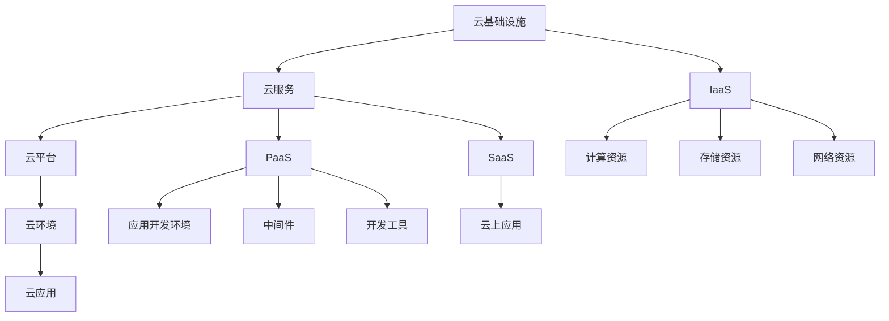
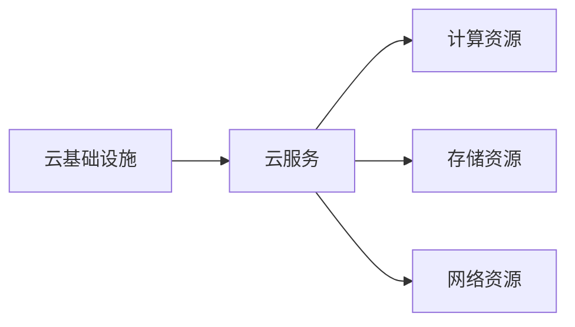
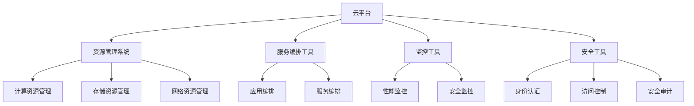
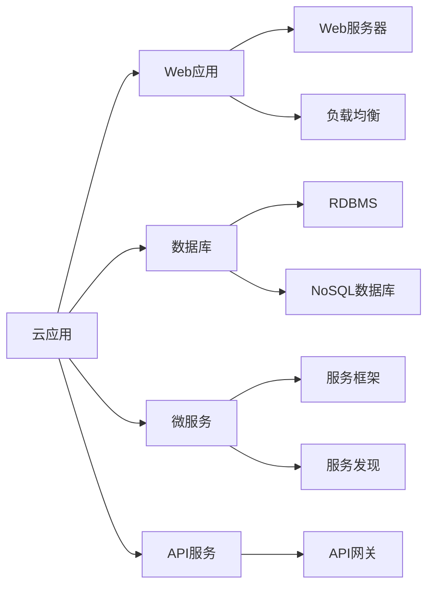
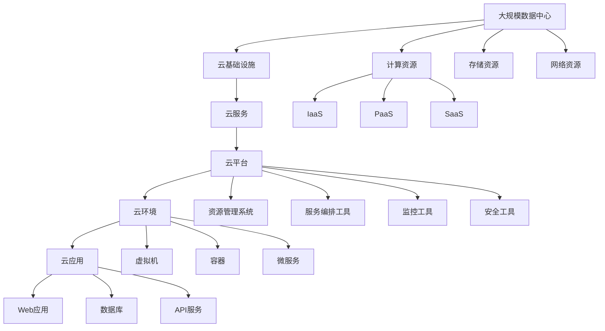

                 

# 云计算 (Cloud Computing)

## 1. 背景介绍

### 1.1 问题由来
云计算（Cloud Computing）是近年来信息技术领域的一项重大创新，它以“按需服务、按量付费”为核心思想，通过互联网提供高效、灵活、可扩展的计算资源，已经成为企业信息化建设的重要方向。云计算的发展深刻改变了信息技术的应用模式，使得各类企业能够更加专注于自身核心业务的创新和发展。

### 1.2 问题核心关键点
云计算的核心关键点包括：
1. **分布式计算资源**：将计算资源分布在全球各地的数据中心，利用互联网进行远程访问和管理。
2. **弹性伸缩**：根据业务需求动态调整资源规模，实现高效利用和成本控制。
3. **多租户架构**：同一物理基础设施上同时为多个租户提供服务，通过隔离和封装保障安全性。
4. **服务级协议（SLA）**：通过明确的性能、可用性和服务质量指标，保障云服务提供商的责任和义务。
5. **安全性与隐私保护**：确保数据和应用的安全，防止信息泄露和未授权访问。

这些关键点共同构成了云计算的基础框架，推动了云技术在各行各业的广泛应用。

### 1.3 问题研究意义
研究云计算技术，对于推动企业数字化转型、优化资源配置、降低IT成本、提升服务质量和安全性具有重要意义：

1. **降低IT成本**：通过按需计费，企业可以避免巨额的前期硬件投资和维护成本。
2. **优化资源配置**：根据业务需求灵活调整资源，避免资源浪费和闲置。
3. **提升服务质量**：云计算服务提供商通常具备更先进的硬件和网络设施，可以提供更高效、稳定的服务。
4. **增强安全性与隐私保护**：通过多租户架构和严格的安全管控，保护用户数据和应用的安全。
5. **加速数字化转型**：云计算使得企业能够快速部署和扩展应用，加速业务创新和市场响应。

总之，云计算已经成为推动企业信息化建设的重要技术手段，对于提升企业的市场竞争力具有重要价值。

## 2. 核心概念与联系

### 2.1 核心概念概述

为了更好地理解云计算的基本原理和架构，本节将介绍几个关键概念及其相互联系：

- **云基础设施（Cloud Infrastructure）**：包括计算资源（如CPU、内存、存储）、网络资源（如带宽、路由器）、数据中心（如物理服务器、虚拟机）等。
- **云服务（Cloud Services）**：基于云基础设施提供的一组服务，如基础设施即服务（IaaS）、平台即服务（PaaS）、软件即服务（SaaS）等。
- **云平台（Cloud Platform）**：云服务提供商搭建的云环境，包括资源管理系统、服务编排工具、监控和安全工具等。
- **云环境（Cloud Environment）**：云服务的运行环境，包括虚拟机、容器、微服务等。
- **云应用（Cloud Application）**：在云平台上部署和运行的应用程序，如Web应用、数据库、API服务等。

这些概念之间的关系可以通过以下Mermaid流程图来展示：



这个流程图展示了云基础设施、云服务、云平台、云环境、云应用之间的联系。

### 2.2 概念间的关系

这些核心概念之间存在着紧密的联系，形成了云计算的基本架构。下面我通过几个Mermaid流程图来展示这些概念之间的关系。

#### 2.2.1 云基础设施与云服务的交互



这个流程图展示了云基础设施如何为云服务提供计算、存储和网络资源，从而支持各种云服务的实现。

#### 2.2.2 云平台与云环境的关系



这个流程图展示了云平台如何通过资源管理系统和服务编排工具，对计算、存储和网络资源进行管理和编排，同时提供监控和安全工具，保障云环境的稳定和安全性。

#### 2.2.3 云应用与云环境的关系



这个流程图展示了云应用如何基于云环境部署和运行各种类型的应用，如Web应用、数据库、微服务和API服务等。

### 2.3 核心概念的整体架构

最后，我用一个综合的流程图来展示这些核心概念在大规模云计算架构中的整体架构：



这个综合流程图展示了从大规模数据中心到云应用部署的完整过程。云基础设施通过多种形式的服务，为云平台提供计算、存储和网络资源，云平台通过资源管理系统、服务编排工具、监控和安全工具，对云环境进行管理和调度，最终部署和运行各种云应用。

## 3. 核心算法原理 & 具体操作步骤
### 3.1 算法原理概述

云计算的核心算法原理包括：

1. **资源调度与编排**：通过动态调整资源配置，最大化利用计算资源，同时保障应用服务的稳定性和可用性。
2. **弹性伸缩**：根据业务需求自动调整资源规模，实现灵活的资源扩展和缩减。
3. **服务质量管理**：通过服务级别协议（SLA），保障云服务提供商和租户之间的责任和义务。
4. **安全性与隐私保护**：通过多租户隔离和数据加密等措施，确保云应用的安全性和隐私保护。

这些核心算法原理共同构成了云计算的基本框架，确保了云服务的可靠性、可扩展性和安全性。

### 3.2 算法步骤详解

云计算的核心算法实现包括以下几个关键步骤：

**Step 1: 资源规划与分配**

1. **需求分析**：根据业务需求，确定所需的计算资源规模和类型。
2. **资源规划**：在云平台中进行资源规划，包括计算资源、存储资源和网络资源。
3. **资源分配**：根据需求和资源规划，分配计算、存储和网络资源，建立虚拟机、容器或微服务环境。

**Step 2: 资源调度与编排**

1. **资源监控**：实时监控计算资源的使用情况，包括CPU、内存、存储等。
2. **负载均衡**：根据监控数据，动态调整资源配置，实现负载均衡。
3. **资源编排**：通过服务编排工具，实现不同服务的组合和编排，建立完整的云应用体系。

**Step 3: 服务质量管理**

1. **SLA制定**：根据业务需求和服务特点，制定服务级别协议（SLA），明确性能、可用性和服务质量指标。
2. **性能优化**：通过性能监控和优化工具，实时调整资源配置，优化服务性能。
3. **故障处理**：建立故障处理机制，保障服务的稳定性和可用性。

**Step 4: 安全性与隐私保护**

1. **多租户隔离**：通过虚拟化技术，实现不同租户之间的隔离和封装。
2. **数据加密**：对存储和传输数据进行加密，防止数据泄露和未授权访问。
3. **访问控制**：建立严格的访问控制机制，保障云应用的安全性。

**Step 5: 监控与审计**

1. **实时监控**：通过监控工具，实时采集和分析云应用的性能、可用性和安全性数据。
2. **审计记录**：建立审计机制，记录云应用的操作和访问记录，保障数据和操作的安全。

**Step 6: 自动化与优化**

1. **自动化部署**：通过自动化工具，实现云应用的快速部署和扩展。
2. **优化策略**：建立优化策略，根据业务需求和资源使用情况，动态调整资源配置。

以上是云计算核心算法的详细步骤，每一步都涉及到复杂的计算和调度。这些算法原理和操作步骤确保了云服务的高效性、稳定性和安全性。

### 3.3 算法优缺点

云计算算法的优点包括：

1. **高效性**：通过动态调整资源配置，实现高效的资源利用。
2. **灵活性**：根据业务需求灵活调整资源规模，实现弹性伸缩。
3. **安全性**：通过多租户隔离和数据加密等措施，保障云应用的安全性和隐私保护。
4. **可扩展性**：通过服务编排工具，实现灵活的资源组合和编排。

然而，云计算算法也存在一些缺点：

1. **复杂性**：云计算算法的实现过程复杂，涉及资源规划、调度、编排、监控、审计等多个环节。
2. **成本**：云计算服务的成本较高，特别是大规模计算资源的使用成本。
3. **性能**：在复杂场景下，云计算算法的性能和稳定性可能受到限制。
4. **可控性**：云计算算法的可控性较差，用户对底层资源的控制较少。

尽管存在这些缺点，云计算算法仍是目前最主流的云服务实现方式，广泛应用于企业信息化建设中。

### 3.4 算法应用领域

云计算算法在各个领域都有广泛的应用，包括但不限于：

- **企业信息化**：通过云计算平台，实现企业数据的集中存储和管理，提升企业的信息化水平。
- **大数据处理**：通过云基础设施，提供高效的大数据处理和分析服务，支持数据分析、数据挖掘等应用。
- **应用开发**：通过云平台，提供应用开发和部署环境，支持Web应用、数据库、微服务等各类应用。
- **移动应用**：通过云服务，提供高效、安全的移动应用开发和部署环境，支持移动应用的快速迭代和扩展。
- **人工智能**：通过云平台，提供高效的AI算法和模型训练环境，支持AI应用的开发和部署。
- **物联网（IoT）**：通过云平台，提供物联网设备的连接和数据管理服务，支持IoT应用的开发和部署。

## 4. 数学模型和公式 & 详细讲解 & 举例说明

### 4.1 数学模型构建

云计算中的数学模型通常涉及以下几个关键方面：

- **资源分配模型**：描述资源如何分配给不同的租户和服务。
- **性能优化模型**：描述如何通过监控和优化工具，提升服务性能和可用性。
- **安全性与隐私保护模型**：描述如何通过多租户隔离和数据加密等措施，保障数据和应用的安全性。

### 4.2 公式推导过程

以下是云计算中常用的数学模型和公式：

1. **资源分配模型**

假设云计算平台上有N个计算资源，每个资源的服务水平SLA为T，资源利用率为U，系统平均响应时间为RT。根据这些参数，可以建立资源分配模型，如下所示：

$$
U = \frac{N}{RT}
$$

其中，$U$表示资源利用率，$N$表示计算资源的数量，$RT$表示系统平均响应时间。

2. **性能优化模型**

假设云计算平台上有M个用户，每个用户的服务请求响应时间为RT，系统平均响应时间为RT0。根据这些参数，可以建立性能优化模型，如下所示：

$$
RT = RT0 - \frac{RT0}{M}(M - 1)
$$

其中，$RT$表示系统平均响应时间，$RT0$表示用户服务请求响应时间，$M$表示用户数量。

3. **安全性与隐私保护模型**

假设云计算平台上有K个租户，每个租户的服务请求频率为F，数据传输速率率为R。根据这些参数，可以建立安全性与隐私保护模型，如下所示：

$$
R = \frac{F}{K}
$$

其中，$R$表示数据传输速率率，$F$表示服务请求频率，$K$表示租户数量。

### 4.3 案例分析与讲解

下面以IaaS为例，展示云计算算法的实际应用：

假设某云计算平台有100个计算资源，每个资源的服务水平SLA为T，资源利用率为U，系统平均响应时间为RT。通过建立资源分配模型，可以计算出资源利用率：

$$
U = \frac{100}{RT} = 2
$$

假设每个计算资源的服务水平SLA为T=1小时，则系统平均响应时间为RT=30分钟。此时，可以计算出资源利用率为U=2。

## 5. 项目实践：代码实例和详细解释说明

### 5.1 开发环境搭建

在进行云计算项目实践前，需要先搭建好开发环境。以下是Python开发环境搭建步骤：

1. 安装Python：从官网下载并安装Python 3.8。
2. 创建虚拟环境：使用venv命令创建虚拟环境，执行命令：`python -m venv cloud-env`。
3. 激活虚拟环境：执行命令`source cloud-env/bin/activate`。
4. 安装依赖包：使用pip安装依赖包，例如：`pip install boto3`。

### 5.2 源代码详细实现

以下是使用AWS SDK实现云计算算法的Python代码示例：

```python
import boto3

def create_instance():
    ec2 = boto3.resource('ec2')
    instance = ec2.create_instances(
        ImageId='ami-0c94885fa95c574c8',
        MinCount=1,
        MaxCount=1,
        InstanceType='t2.micro',
        KeyName='my-key-pair',
        SecurityGroupIds=['sg-0a1234567890abcde'],
        UserData='#!/bin/bash\necho Hello, World!'
    )
    return instance[0].id

def delete_instance(instance_id):
    ec2 = boto3.resource('ec2')
    instance = ec2.Instance(instance_id)
    instance.terminate()
    instance.wait_until_terminated()

instance_id = create_instance()
print('Instance ID:', instance_id)

delete_instance(instance_id)
```

这个代码示例展示了如何使用AWS SDK创建和删除AWS实例，通过实例ID管理云资源。

### 5.3 代码解读与分析

这个代码示例展示了AWS SDK的基本用法，包括创建实例、管理实例和删除实例等操作。代码中使用了AWS的EC2资源，通过指定镜像ID、实例类型、安全组等参数，创建了一个AWS实例，并输出了实例ID。通过调用`delete_instance`函数，可以删除该实例，释放资源。

## 6. 实际应用场景

### 6.1 云存储与大数据

云存储和大数据处理是云计算的重要应用场景。通过云存储，企业可以集中管理和备份数据，提升数据安全和可用性。同时，云存储还提供了高效的数据处理和分析服务，支持大数据处理、数据挖掘等应用。

### 6.2 应用开发与部署

云计算平台提供了高效的应用开发和部署环境，支持Web应用、数据库、微服务等各类应用的开发和部署。企业可以基于云计算平台快速搭建应用，实现高效、可靠的服务交付。

### 6.3 移动应用开发

云计算平台提供了高效的移动应用开发和部署环境，支持移动应用的快速迭代和扩展。通过云平台，企业可以快速部署和更新移动应用，提升用户体验和服务质量。

### 6.4 人工智能应用

云计算平台提供了高效的AI算法和模型训练环境，支持AI应用的开发和部署。企业可以利用云计算平台的强大计算能力，加速AI模型训练和应用落地，提升智能化水平。

## 7. 工具和资源推荐

### 7.1 学习资源推荐

为了帮助开发者系统掌握云计算技术的理论基础和实践技巧，这里推荐一些优质的学习资源：

1. 《云计算基础》课程：介绍云计算的基本概念、架构和实现原理，适合初学者入门。
2. 《云架构师认证》课程：由AWS等云服务商提供的官方认证课程，涵盖云计算技术、架构和实践。
3. 《云原生架构》课程：介绍云原生架构的核心概念和实践方法，涵盖微服务、DevOps等技术。
4. 《云平台设计与开发》书籍：介绍云平台的搭建和优化方法，涵盖AWS、Azure、Google Cloud等主流云平台。
5. 《云安全与隐私保护》书籍：介绍云安全与隐私保护的核心技术，涵盖数据加密、访问控制等方法。

### 7.2 开发工具推荐

云计算开发的常用工具包括：

1. AWS CLI：AWS官方命令行工具，支持资源的创建、管理和监控等操作。
2. Azure CLI：Azure官方命令行工具，支持资源的创建、管理和监控等操作。
3. Google Cloud SDK：Google Cloud官方命令行工具，支持资源的创建、管理和监控等操作。
4. Docker：容器化工具，支持应用的快速部署和扩展。
5. Kubernetes：容器编排工具，支持分布式应用的自动化管理和调度。

### 7.3 相关论文推荐

云计算技术的快速发展离不开学界的持续研究。以下是几篇奠基性的相关论文，推荐阅读：

1. 《云计算：定义、应用与未来发展》：对云计算的基本概念、应用和未来发展进行了综述。
2. 《云计算架构设计与实现》：介绍云计算架构的设计和实现方法，涵盖资源分配、调度、编排等技术。
3. 《云平台的安全性与隐私保护》：介绍云计算平台的安全性和隐私保护技术，涵盖数据加密、访问控制等方法。
4. 《云原生架构设计与实践》：介绍云原生架构的核心概念和实践方法，涵盖微服务、DevOps等技术。
5. 《云计算性能优化与监控》：介绍云计算性能优化和监控的技术和方法，涵盖性能监控、负载均衡等技术。

这些论文代表了大规模云计算技术的发展脉络，对云计算技术的理解和实践有着重要的参考价值。

## 8. 总结：未来发展趋势与挑战

### 8.1 总结

本文对云计算技术进行了全面系统的介绍，包括云计算的基本概念、核心算法原理和具体操作步骤，以及云计算在各个领域的应用。通过本文的系统梳理，可以看到云计算技术的广泛应用前景和重要价值。

### 8.2 未来发展趋势

展望未来，云计算技术将呈现以下几个发展趋势：

1. **多云融合**：云计算平台将逐步打破单一云服务商的壁垒，实现多云融合，提供更灵活、更高效的资源管理和调度。
2. **边缘计算**：云计算平台将逐步向边缘扩展，实现数据本地化处理和存储，提升应用性能和响应速度。
3. **人工智能**：云计算平台将进一步融合人工智能技术，提供更智能化的服务和应用。
4. **安全性与隐私保护**：云计算平台将加强数据安全和隐私保护，提供更可靠、更安全的云应用。
5. **可控性与自动化**：云计算平台将提升用户对资源的可控性，通过自动化工具，提升资源管理效率。

这些趋势凸显了云计算技术的广阔前景，云计算将继续成为推动企业信息化建设的重要技术手段。

### 8.3 面临的挑战

尽管云计算技术已经取得了显著进展，但在迈向更加智能化、普适化应用的过程中，它仍面临着诸多挑战：

1. **成本问题**：云计算服务的成本较高，特别是大规模计算资源的使用成本。
2. **性能与可靠性**：在复杂场景下，云计算算法的性能和可靠性可能受到限制。
3. **安全与隐私**：云计算平台的数据安全和隐私保护仍存在挑战，用户需要更多保障措施。
4. **标准化与互操作性**：不同云平台之间的标准化和互操作性问题，需要进一步解决。
5. **资源管理与调度**：云计算平台的资源管理与调度算法，需要不断优化和改进。

尽管存在这些挑战，云计算技术仍是最主流的云服务实现方式，广泛应用于企业信息化建设中。相信随着技术的发展和优化，云计算将进一步提升企业的信息化水平，加速业务创新和市场响应。

### 8.4 研究展望

未来，云计算技术还需要在以下几个方面进行深入研究：

1. **多云融合与分布式计算**：探索如何实现多云融合，提升资源管理和调度的灵活性和效率。
2. **边缘计算与本地化处理**：研究如何在边缘计算环境中，实现高效的数据处理和存储。
3. **人工智能与智能应用**：探索如何将人工智能技术与云计算平台深度融合，提升智能化水平。
4. **安全性与隐私保护**：研究如何在云计算平台中加强数据安全和隐私保护，提供更可靠、更安全的云应用。
5. **可控性与自动化**：探索如何提升用户对资源的可控性，通过自动化工具，提升资源管理效率。

这些研究方向将进一步推动云计算技术的发展，使其更好地服务于企业信息化建设。

## 9. 附录：常见问题与解答

**Q1：云计算是否适用于所有企业？**

A: 云计算适用于大多数企业，特别是中小型企业。它能够帮助企业降低IT成本，提升资源利用效率，加速业务创新。但对于某些高度依赖内部数据和安全性要求极高的企业，可能需要自行搭建私有云或混合云环境。

**Q2：云计算是否影响企业的业务决策？**

A: 云计算在一定程度上可以影响企业的业务决策。例如，选择不同的云服务商和云平台，将影响企业的计算资源和数据管理方式。企业需要根据自身业务需求和场景，选择合适的云计算方案。

**Q3：云计算是否会影响企业的安全性与隐私保护？**

A: 云计算平台通常提供强大的安全措施，如多租户隔离、数据加密等。但企业仍需自行管理好数据安全，特别是对于敏感数据的存储和传输。企业需要评估云平台的隐私保护措施，并制定相应的安全策略。

**Q4：云计算是否适合所有类型的应用？**

A: 云计算适合大多数类型的应用，特别是需要高效、灵活、可扩展的计算资源的应用。但对于某些对数据处理和计算性能要求极高的应用，可能需要自行搭建高性能计算环境。

**Q5：云计算是否需要专业知识？**

A: 云计算需要一定的专业知识，特别是云平台搭建、资源管理、故障排查等。企业可以自行培养云技术团队，或通过外包或咨询公司进行云平台搭建和运维。

总之，云计算是一种高效、灵活的计算资源管理方式，但企业需要根据自身需求和场景，选择合适的云计算方案，并进行相应的管理和运维。云计算将继续成为推动企业信息化建设的重要技术手段，推动企业的数字化转型和智能化升级。

---

作者：禅与计算机程序设计艺术 / Zen and the Art of Computer Programming

