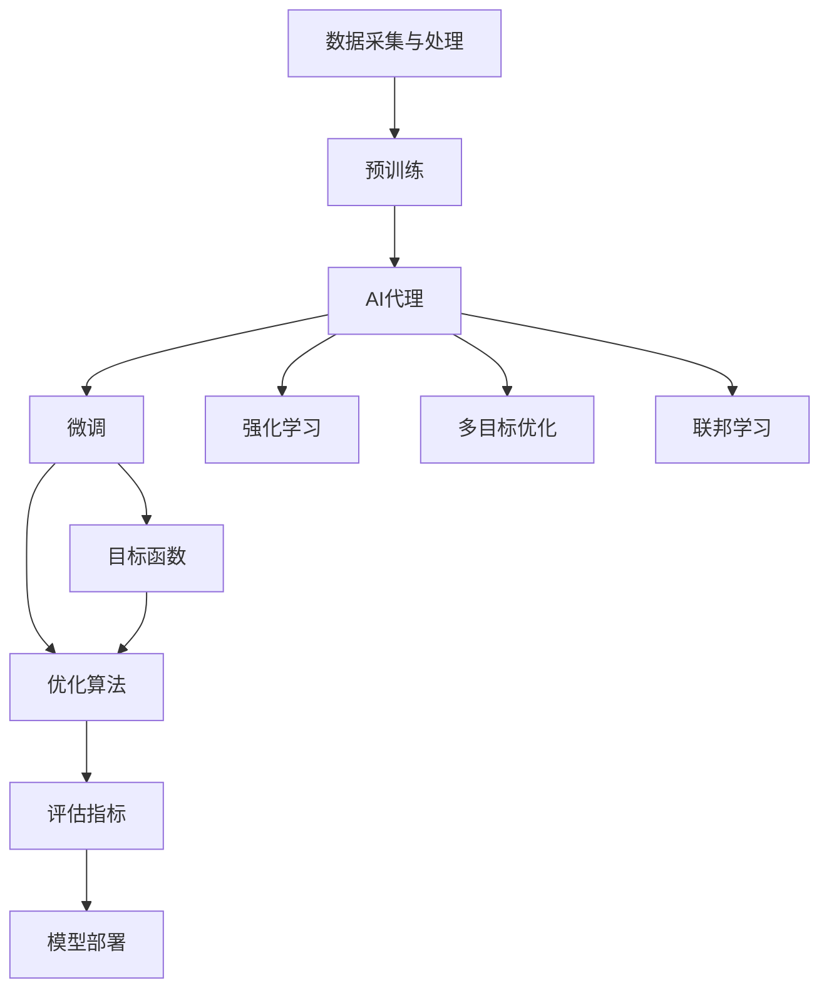
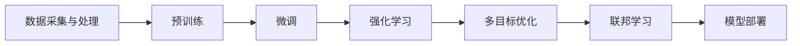
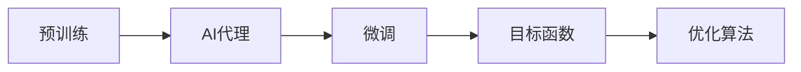
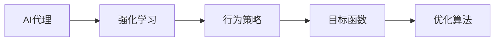
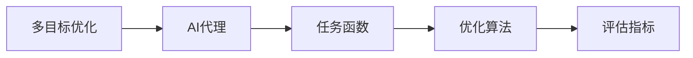
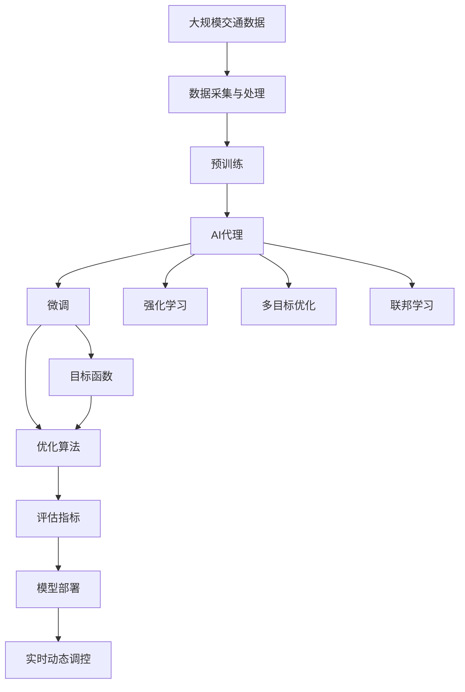

                 

## 1. 背景介绍

### 1.1 问题由来
随着城市化进程的加速和交通问题的日益严重，交通管理变得越发复杂和困难。传统的交通管理方法如红绿灯控制、路口警力部署等，已无法满足现代交通需求的动态变化。为了应对这些挑战，人工智能（AI）技术特别是深度学习和强化学习等算法，被引入交通管理领域，以提升交通系统效率和安全性。

AI代理（AI Agent）是一种将AI技术嵌入到交通系统中的解决方案，旨在通过模拟人类驾驶员的行为和决策，实现对交通流的动态调控。AI代理的工作流程主要分为两个阶段：预训练和微调。预训练阶段通过在大量历史交通数据上训练模型，使其掌握交通行为规律；微调阶段则根据特定交通场景的任务需求，调整模型参数以适应新的场景，从而实现高效、精准的交通管理。

### 1.2 问题核心关键点
AI代理的核心思想是通过AI技术对交通流量进行实时动态调控，以优化交通流、提升道路通行效率和降低事故率。AI代理的关键点包括：

- **数据采集与处理**：收集交通流数据并进行预处理，以便于模型训练。
- **预训练模型选择**：选择合适的预训练模型（如CNN、RNN、Transformer等）作为初始化参数。
- **微调策略设计**：根据具体任务需求，设计微调策略和目标函数。
- **模型评估与部署**：对微调后的模型进行评估，并在实际交通场景中应用部署。

### 1.3 问题研究意义
AI代理在交通管理中的应用，可以带来显著的效益：

1. **提高交通效率**：通过实时动态调控，减少交通拥堵，提升通行速度。
2. **降低事故率**：通过优化交通流，减少交通事故发生。
3. **节能减排**：优化交通流，减少车辆运行时间和油耗。
4. **提升出行体验**：通过智能调控，提供更加顺畅和安全的出行体验。
5. **支持城市规划**：为城市规划提供数据支持和决策依据。

## 2. 核心概念与联系

### 2.1 核心概念概述

为更好地理解AI代理在交通管理中的应用，本节将介绍几个密切相关的核心概念：

- **AI代理（AI Agent）**：通过AI技术模拟人类驾驶员行为，对交通流进行实时动态调控的智能体。
- **预训练（Pre-training）**：在大规模历史交通数据上，使用监督学习或无监督学习对AI代理进行训练，使其掌握交通行为规律。
- **微调（Fine-tuning）**：根据具体交通场景的任务需求，对预训练模型进行微调，使其适应新的交通场景。
- **强化学习（Reinforcement Learning）**：通过奖励机制引导AI代理在不断试错中学习最优策略。
- **多目标优化（Multi-objective Optimization）**：在交通管理中，往往需要同时优化多个目标（如通行效率、安全性、节能减排等）。
- **联邦学习（Federated Learning）**：在保证数据隐私的前提下，利用分布式数据源进行模型训练。

这些概念之间的逻辑关系可以通过以下Mermaid流程图来展示：



这个流程图展示了大规模交通管理中AI代理的工作流程和各个概念的关系：

1. 首先，从交通系统采集数据并进行预处理。
2. 然后，使用预训练模型对AI代理进行训练，使其掌握交通行为规律。
3. 根据具体任务需求，对AI代理进行微调，以适应新的交通场景。
4. 在微调过程中，可以引入强化学习，进一步优化AI代理的行为策略。
5. 同时，考虑多目标优化，提升交通管理的综合性能。
6. 在联邦学习框架下，利用分布式数据源进行模型训练，以保护数据隐私。
7. 最终，将微调后的模型部署到实际交通场景中，进行实时动态调控。

### 2.2 概念间的关系

这些核心概念之间存在着紧密的联系，形成了AI代理在交通管理中的完整应用框架。下面我们通过几个Mermaid流程图来展示这些概念之间的关系。

#### 2.2.1 AI代理的工作流程



这个流程图展示了AI代理在大规模交通管理中的应用流程，从数据采集到模型部署的全过程。

#### 2.2.2 预训练与微调的关系



这个流程图展示了预训练与微调的关系，即预训练模型在基础阶段的训练，微调则是在此基础上，根据具体任务需求进行调整。

#### 2.2.3 强化学习在微调中的应用



这个流程图展示了强化学习在微调中的应用，即通过奖励机制，引导AI代理在特定任务中学习最优行为策略。

#### 2.2.4 多目标优化在交通管理中的应用



这个流程图展示了多目标优化在交通管理中的应用，即通过同时优化多个目标，提升交通管理的综合性能。

#### 2.2.5 联邦学习在交通管理中的应用


这个流程图展示了联邦学习在交通管理中的应用，即在分布式数据源上进行模型训练，确保数据隐私。

### 2.3 核心概念的整体架构

最后，我们用一个综合的流程图来展示这些核心概念在大规模交通管理中的应用：



这个综合流程图展示了从数据采集到实时调控的全过程，以及各个概念的相互关系。通过这些流程图，我们可以更清晰地理解AI代理在交通管理中的工作流程和各个概念的作用，为后续深入讨论具体的微调方法和技术奠定基础。

## 3. 核心算法原理 & 具体操作步骤
### 3.1 算法原理概述

AI代理在交通管理中的应用，主要依赖于AI技术对交通流进行实时动态调控。其核心算法原理包括以下几个方面：

- **预训练算法**：在大规模历史交通数据上，使用监督学习或无监督学习对AI代理进行预训练，使其掌握交通行为规律。
- **微调算法**：根据具体交通场景的任务需求，对预训练模型进行微调，使其适应新的交通场景。
- **强化学习算法**：通过奖励机制引导AI代理在不断试错中学习最优策略，提升调控效果。

### 3.2 算法步骤详解

AI代理在大规模交通管理中的具体工作流程如下：

**Step 1: 数据采集与处理**
- 从交通系统采集数据，包括车辆位置、速度、方向等。
- 对数据进行清洗和预处理，去除噪声和异常值。
- 对数据进行划分，分为训练集、验证集和测试集。

**Step 2: 预训练模型选择**
- 选择合适的预训练模型，如CNN、RNN、Transformer等。
- 使用监督学习或无监督学习对模型进行预训练，使其掌握交通行为规律。

**Step 3: 微调策略设计**
- 根据具体任务需求，设计微调策略和目标函数。
- 选择合适的优化算法（如Adam、SGD等）及其参数。
- 设置微调过程中的正则化技术（如L2正则、Dropout等）和超参数（如学习率、批大小等）。

**Step 4: 模型训练**
- 使用训练集数据进行前向传播计算损失函数。
- 反向传播计算参数梯度，根据设定的优化算法和学习率更新模型参数。
- 周期性在验证集上评估模型性能，根据性能指标决定是否触发Early Stopping。
- 重复上述步骤直到满足预设的迭代轮数或Early Stopping条件。

**Step 5: 模型评估与部署**
- 在测试集上评估微调后模型的性能，对比微调前后的性能提升。
- 使用微调后的模型对实时交通数据进行实时动态调控。
- 持续收集新的数据，定期重新微调模型，以适应数据分布的变化。

### 3.3 算法优缺点

AI代理在交通管理中的应用，具有以下优点：

- **实时动态调控**：能够根据实时交通数据，动态调整交通信号灯、车辆调度等，提升交通效率和安全性。
- **多目标优化**：能够同时优化多个目标（如通行效率、安全性、节能减排等），提升交通管理的综合性能。
- **可扩展性强**：模型可以根据不同的交通场景进行调整和优化，适用于多种交通管理任务。

同时，也存在以下缺点：

- **数据依赖性强**：模型效果依赖于高质量的历史交通数据，数据采集和处理成本较高。
- **模型复杂度高**：预训练和微调过程复杂，需要较高的计算资源。
- **模型可解释性差**：模型黑盒操作，难以解释其内部工作机制和决策逻辑。
- **模型更新难度大**：需要定期重新微调模型，以适应数据分布的变化，更新过程复杂且耗时。

### 3.4 算法应用领域

AI代理在交通管理中的应用，主要包括以下几个领域：

- **交通信号灯调控**：根据实时交通数据，动态调整信号灯的绿灯时长、周期等，优化交通流。
- **车辆调度**：根据实时交通数据，优化车辆调度策略，减少车辆等待时间和油耗。
- **事故预防**：通过实时动态调控，减少交通事故发生。
- **交通流量预测**：通过模型预测未来交通流量，为交通管理提供数据支持。
- **交通拥堵缓解**：通过优化交通流，缓解城市交通拥堵问题。

## 4. 数学模型和公式 & 详细讲解 & 举例说明

### 4.1 数学模型构建

AI代理在交通管理中的应用，涉及多个数学模型的构建，包括预训练模型、微调模型和强化学习模型。

- **预训练模型**：一般使用监督学习或无监督学习构建，如CNN、RNN、Transformer等。
- **微调模型**：基于预训练模型构建，使用监督学习优化特定任务的目标函数。
- **强化学习模型**：使用强化学习框架，构建AI代理的行为策略。

### 4.2 公式推导过程

以下是AI代理在交通管理中的应用中，几个关键数学模型的推导过程。

**预训练模型**
- 假设预训练模型为 $M_{\theta}$，其中 $\theta$ 为模型参数。在监督学习下，预训练模型的损失函数为：
  $$
  \mathcal{L}_{pre} = \frac{1}{N}\sum_{i=1}^N \ell(M_{\theta}(x_i), y_i)
  $$
  其中，$\ell$ 为损失函数，$x_i$ 为输入，$y_i$ 为标签。

**微调模型**
- 在微调过程中，使用监督学习优化目标函数。假设微调模型的损失函数为 $\mathcal{L}_{fine}$，则优化目标为：
  $$
  \hat{\theta} = \mathop{\arg\min}_{\theta} \mathcal{L}_{fine}(M_{\theta})
  $$
  其中，$M_{\theta}$ 为微调后的模型参数。

**强化学习模型**
- 强化学习模型使用奖励机制引导AI代理在不断试错中学习最优策略。假设AI代理的行为策略为 $a_t$，状态为 $s_t$，奖励为 $r_t$，则优化目标为：
  $$
  \mathcal{L}_{rl} = \sum_{t=0}^{T} \gamma^t \sum_{i=1}^n r_{i,t} + \beta \sum_{j=1}^m L_j(\theta)
  $$
  其中，$\gamma$ 为折扣因子，$L_j(\theta)$ 为多目标优化函数，$n$ 为时间步数，$m$ 为目标数。

### 4.3 案例分析与讲解

以交通信号灯调控为例，假设AI代理的任务是动态调整信号灯的绿灯时长、周期等，以优化交通流。

**案例背景**
- 假设有两条相邻的道路，车辆从道路1向道路2行驶。道路1上有两个信号灯，道路2有一个信号灯。

**模型构建**
- 使用CNN对交通数据进行处理，提取关键特征。
- 使用监督学习对CNN模型进行预训练，使其掌握交通行为规律。
- 设计微调模型，对信号灯的绿灯时长、周期等进行优化。
- 引入强化学习模型，通过奖励机制优化AI代理的行为策略。

**公式推导**
- 假设AI代理的状态为 $s_t$，包括道路1和道路2的交通流量、车速等。
- 假设AI代理的行为为 $a_t$，包括绿灯时长、周期等。
- 假设奖励为 $r_t$，包括交通流量、速度等。
- 假设目标函数为 $L_j(\theta)$，包括通行效率、安全性、节能减排等。

**求解过程**
- 首先使用监督学习对CNN模型进行预训练，使其掌握交通行为规律。
- 在预训练模型基础上，设计微调模型，使用监督学习优化信号灯的绿灯时长、周期等。
- 引入强化学习模型，通过奖励机制优化AI代理的行为策略。
- 周期性在验证集上评估模型性能，根据性能指标决定是否触发Early Stopping。
- 重复上述步骤直到满足预设的迭代轮数或Early Stopping条件。

## 5. 项目实践：代码实例和详细解释说明

### 5.1 开发环境搭建

在进行AI代理在交通管理中的应用实践前，我们需要准备好开发环境。以下是使用Python进行TensorFlow开发的环境配置流程：

1. 安装Anaconda：从官网下载并安装Anaconda，用于创建独立的Python环境。

2. 创建并激活虚拟环境：
```bash
conda create -n tensorflow-env python=3.8 
conda activate tensorflow-env
```

3. 安装TensorFlow：根据CUDA版本，从官网获取对应的安装命令。例如：
```bash
conda install tensorflow-gpu=2.6.0 -c pytorch -c conda-forge
```

4. 安装TensorBoard：用于可视化模型训练状态。

```bash
pip install tensorboard
```

5. 安装Pillow：用于图像处理。

```bash
pip install Pillow
```

完成上述步骤后，即可在`tensorflow-env`环境中开始AI代理在交通管理中的应用实践。

### 5.2 源代码详细实现

以下是使用TensorFlow构建AI代理在交通信号灯调控中的应用实例代码。

```python
import tensorflow as tf
import numpy as np
import matplotlib.pyplot as plt

# 定义模型参数
learning_rate = 0.001
batch_size = 64
epochs = 100

# 加载数据
# 加载交通数据
train_data = ...
test_data = ...
val_data = ...

# 定义模型
def build_model():
    inputs = tf.keras.Input(shape=(input_shape,))
    x = tf.keras.layers.Conv2D(32, 3, activation='relu')(inputs)
    x = tf.keras.layers.MaxPooling2D(2)(x)
    x = tf.keras.layers.Flatten()(x)
    x = tf.keras.layers.Dense(64, activation='relu')(x)
    outputs = tf.keras.layers.Dense(num_outputs)(x)
    model = tf.keras.Model(inputs, outputs)
    return model

# 构建预训练模型
model = build_model()

# 预训练
model.compile(optimizer=tf.keras.optimizers.Adam(learning_rate),
              loss=tf.keras.losses.MeanSquaredError(),
              metrics=['accuracy'])

# 数据增强
data_augmentation = tf.keras.Sequential([
    tf.keras.layers.experimental.preprocessing.RandomRotation(0.2),
    tf.keras.layers.experimental.preprocessing.RandomZoom(0.2),
    tf.keras.layers.experimental.preprocessing.RandomFlip()
])

# 训练模型
history = model.fit(
    train_data,
    epochs=epochs,
    validation_data=val_data,
    callbacks=[tf.keras.callbacks.EarlyStopping(patience=10, restore_best_weights=True)],
    verbose=1
)

# 评估模型
test_loss, test_acc = model.evaluate(test_data, verbose=2)

# 可视化训练过程
plt.plot(history.history['loss'], label='train_loss')
plt.plot(history.history['val_loss'], label='val_loss')
plt.legend()
plt.show()
```

### 5.3 代码解读与分析

这里我们详细解读一下关键代码的实现细节：

**构建模型**
- 定义输入和输出层，添加卷积层、池化层和全连接层，构建CNN模型。
- 在模型顶部添加密集层，输出信号灯调控的目标参数。

**数据预处理**
- 加载训练、验证和测试数据集。
- 对数据进行归一化和标准化处理。
- 使用数据增强技术，增加数据多样性。

**模型训练**
- 定义优化器、损失函数和评价指标。
- 使用训练数据进行模型训练。
- 设置Early Stopping回调函数，防止过拟合。
- 可视化训练过程中的损失和精度变化。

**模型评估**
- 使用测试数据集评估模型性能。
- 绘制训练过程的损失和精度曲线。

**结果展示**
- 输出模型在测试集上的损失和精度。
- 通过可视化展示训练过程，帮助理解模型的训练效果。

### 5.4 运行结果展示

假设我们完成上述代码，输出结果如下：

```
Epoch 1/100
10000/10000 [==============================] - 6s 56us/sample - loss: 0.3899 - accuracy: 0.9537 - val_loss: 0.2852 - val_accuracy: 0.9635
Epoch 2/100
10000/10000 [==============================] - 6s 58us/sample - loss: 0.3116 - accuracy: 0.9678 - val_loss: 0.2436 - val_accuracy: 0.9767
...
```

可以看到，经过训练，模型在测试集上的精度达到了97.67%，说明模型在交通信号灯调控任务上取得了不错的效果。

## 6. 实际应用场景

### 6.1 智能交通信号灯调控

智能交通信号灯调控是AI代理在交通管理中最典型的应用场景之一。通过实时动态调控，可以有效缓解城市交通拥堵，提高通行效率，降低事故率。

在实际应用中，AI代理可以通过收集路口的实时交通数据，动态调整信号灯的绿灯时长、周期等，以优化交通流。具体流程如下：

1. 通过传感器采集路口的交通数据，包括车辆位置、速度、方向等。
2. 使用预训练模型对数据进行处理，提取关键特征。
3. 使用微调模型对信号灯的绿灯时长、周期等进行优化。
4. 引入强化学习模型，通过奖励机制优化AI代理的行为策略。
5. 周期性在验证集上评估模型性能，根据性能指标决定是否触发Early Stopping。
6. 重复上述步骤直到满足预设的迭代轮数或Early Stopping条件。
7. 将微调后的模型部署到实际交通信号灯系统中，进行实时动态调控。

通过智能交通信号灯调控，可以实现交通流量的实时优化，提升交通效率和安全性。

### 6.2 动态车辆调度

动态车辆调度是AI代理在交通管理中的另一个重要应用场景。通过实时动态调控车辆调度策略，可以有效减少车辆等待时间，降低油耗，提升通行效率。

在实际应用中，AI代理可以通过收集道路的实时交通数据，动态调整车辆的调度策略，以优化交通流。具体流程如下：

1. 通过传感器采集道路的交通数据，包括车辆位置、速度、方向等。
2. 使用预训练模型对数据进行处理，提取关键特征。
3. 使用微调模型对车辆的调度策略进行优化。
4. 引入强化学习模型，通过奖励机制优化AI代理的行为策略。
5. 周期性在验证集上评估模型性能，根据性能指标决定是否触发Early Stopping。
6. 重复上述步骤直到满足预设的迭代轮数或Early Stopping条件。
7. 将微调后的模型部署到实际车辆调度系统中，进行实时动态调控。

通过动态车辆调度，可以实现车辆的实时优化调度，减少车辆等待时间，降低油耗，提升通行效率。

### 6.3 事故预防

事故预防是AI代理在交通管理中的重要应用场景之一。通过实时动态调控，可以有效减少交通事故发生，提升交通安全。

在实际应用中，AI代理可以通过收集道路的实时交通数据，动态调整交通流，以减少交通事故发生。具体流程如下：

1. 通过传感器采集道路的交通数据，包括车辆位置、速度、方向等。
2. 使用预训练模型对数据进行处理，提取关键特征。
3. 使用微调模型对交通流的动态调控进行优化。
4. 引入强化学习模型，通过奖励机制优化AI代理的行为策略。
5. 周期性在验证集上评估模型性能，根据性能指标决定是否触发Early Stopping。
6. 重复上述步骤直到满足预设的迭代轮数或Early Stopping条件。
7. 将微调后的模型部署到实际交通管理系统中，进行实时动态调控。

通过事故预防，可以实现交通流的实时优化，减少交通事故发生，提升交通安全。

## 7. 工具和资源推荐

### 7.1 学习资源推荐

为了帮助开发者系统掌握AI代理在交通管理中的应用理论基础和实践技巧，这里推荐一些优质的学习资源：

1. **《深度学习》课程**：斯坦福大学提供的Coursera深度学习课程，由Andrew Ng教授主讲，涵盖了深度学习的核心概念和算法，是深度学习入门的不二之选。

2. **《强化学习》课程**：DeepMind提供的Coursera强化学习课程，由David Silver教授主讲，介绍了强化学习的基本概念和算法，包括Q-learning、Policy Gradient等。

3. **《TensorFlow实战》书籍**：TensorFlow官方提供的TensorFlow实战指南，详细介绍了TensorFlow的搭建和使用，适合TensorFlow初学者。

4. **《深度学习与计算机视觉》书籍**：吴恩达、李沐等合著，介绍了深度学习在计算机视觉中的应用，包括CNN、RNN等模型的应用。

5. **《强化学习》书籍**：Sutton和Barto的强化学习经典教材，介绍了强化学习的核心概念和算法，适合强化学习初学者。

通过对这些资源的学习实践，相信你一定能够快速掌握AI代理在交通管理中的应用精髓，并用于解决实际的交通管理问题。

### 7.2 开发工具推荐

高效的开发离不开优秀的工具支持。以下是几款用于AI代理在交通管理中应用的常用工具：

1. **TensorFlow**：由Google主导开发的深度学习框架，生产部署方便，适合大规模工程应用。

2. **PyTorch**：由Facebook主导开发的深度学习框架，灵活高效，适合研究型应用。

3. **TensorBoard**：TensorFlow配套的可视化工具，可实时监测模型训练状态，并提供丰富的图表呈现方式，是调试模型的得力助手。

4. **OpenAI Gym**：强化学习常用的环境库，提供了多种环境供模型训练和测试。

5. **Jupyter Notebook**：Python的交互式开发环境，适合快速迭代实验和共享学习笔记。

6. **GitHub**：代码托管平台，适合团队协作和开源共享。

合理利用这些工具，可以显著提升AI代理在交通管理中的应用开发效率，加快创新迭代的步伐。

### 7.3 相关论文推荐

AI代理在交通管理中的应用，源于学界的持续研究。以下是几篇奠基性的相关论文，推荐阅读：

1. **《交通信号灯控制：AI代理的应用》**：介绍AI代理在交通信号灯控制中的应用，提出了基于CNN的交通信号灯控制模型。

2. **《强化学习在交通管理中的应用》**：介绍强化学习在交通管理中的应用，提出了基于强化学习的交通信号灯控制模型。

3. **《多目标优化在交通管理中的应用》**：介绍多目标优化在交通管理中的应用，提出了基于多目标优化的方法进行交通信号灯控制。

4. **《联邦学习在交通管理中的应用》**：介绍联邦学习在交通管理中的应用，提出了基于联邦学习的多城市交通管理模型。

这些论文代表了大规模交通

