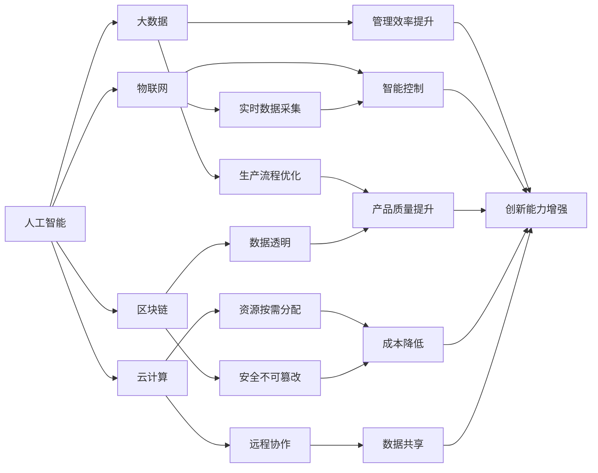

                 

# 产业转型升级的新质生产力

> 关键词：产业转型、数字经济、新质生产力、人工智能、大数据、云计算

## 1. 背景介绍

### 1.1 问题由来

随着科技的迅猛发展和全球经济环境的不断变化，各行各业都面临着前所未有的挑战和机遇。尤其是在数字化、网络化、智能化深入发展的背景下，传统产业亟需转型升级，以适应新的经济形态和市场需求。

产业转型升级的核心在于提升产业的竞争力，实现高质量发展。这一过程中，新质生产力的发挥尤为关键。新质生产力不仅包括传统的劳动力、土地、资本等要素，更涵盖了数据、知识、技术等新型生产要素。在数字化、智能化驱动下，新质生产力逐步成为产业发展的新动力。

### 1.2 问题核心关键点

新质生产力的关键点在于数字化、智能化、网络化的应用和集成。人工智能、大数据、云计算等技术的深度应用，已经成为推动新质生产力发展的重要引擎。通过数字化手段，企业能够实现生产流程的优化、管理效率的提升和产品服务的创新，从而提高竞争力。

### 1.3 问题研究意义

研究和理解新质生产力的本质和应用，对于推动产业转型升级、实现经济高质量发展具有重要意义：

1. **提高产业竞争力**：新质生产力能够优化生产流程，提升管理效率，降低成本，提高产品质量和创新能力，从而增强企业的市场竞争力。
2. **促进创新驱动**：新质生产力通过技术创新和模式创新，推动产业结构优化升级，激发新的经济增长点。
3. **保障就业稳定**：通过智能化、自动化手段，新质生产力可以创造新的就业机会，推动产业升级和就业结构调整。
4. **提升产业生态**：新质生产力通过技术驱动，能够促进产业链上下游协同发展，构建更完善的产业生态系统。
5. **促进绿色发展**：新质生产力通过智能化、精准化的管理手段，有助于实现节能减排和环境保护，推动可持续发展。

## 2. 核心概念与联系

### 2.1 核心概念概述

理解新质生产力的关键在于把握数字化、智能化、网络化的应用和集成。以下是几个核心概念：

- **人工智能(AI)**：通过机器学习、深度学习、自然语言处理等技术，使机器能够模拟人类智能行为，解决复杂问题。
- **大数据(Big Data)**：通过收集、存储、处理海量数据，从中挖掘有价值的信息，支持决策和创新。
- **云计算(Cloud Computing)**：通过网络平台，提供按需计算资源和服务，支持远程协作和数据共享。
- **物联网(IoT)**：通过互联网将物理世界中的设备和系统连接起来，实现实时数据采集和智能控制。
- **区块链(Blockchain)**：通过分布式账本技术，确保数据透明、安全、不可篡改，促进信任和协作。

这些技术相互融合，共同构建了新质生产力的生态系统，推动产业转型升级。

### 2.2 概念间的关系

这些核心概念之间的关系可以通过以下Mermaid流程图来展示：



这个流程图展示了各个技术如何共同作用于新质生产力，推动产业转型升级。

## 3. 核心算法原理 & 具体操作步骤
### 3.1 算法原理概述

新质生产力的实现依赖于多种技术的深度融合和应用。核心算法原理包括：

- **数据挖掘与分析**：通过大数据技术，从海量数据中挖掘出有用的信息和模式，支持决策和创新。
- **机器学习与深度学习**：利用人工智能技术，训练模型解决复杂问题，优化生产流程和提升管理效率。
- **智能控制与优化**：通过物联网技术，实现实时监控和智能控制，提高生产自动化和智能化水平。
- **区块链技术**：保障数据透明、安全、不可篡改，构建信任机制，推动供应链协同发展。

### 3.2 算法步骤详解

新质生产力的实现步骤主要包括：

1. **数据收集与预处理**：收集生产、管理、市场等各个环节的原始数据，进行清洗和标准化处理，确保数据质量和一致性。
2. **数据存储与管理**：使用大数据技术，将数据存储在云平台，支持数据的实时访问和分析。
3. **模型训练与优化**：通过机器学习、深度学习算法，训练和优化模型，提升生产流程和管理效率。
4. **智能控制与执行**：利用物联网技术，实现生产设备的智能化控制和优化，提高生产效率和质量。
5. **区块链与协同**：通过区块链技术，构建透明、安全的供应链协作机制，保障数据的安全和可靠。

### 3.3 算法优缺点

新质生产力在推动产业转型升级方面具有以下优势：

- **提升效率和质量**：通过数字化、智能化手段，优化生产流程和管理效率，降低成本，提高产品质量和创新能力。
- **促进协同与创新**：通过数据共享和协同机制，推动产业链上下游协同发展，促进技术创新和业务模式创新。
- **保障数据安全与透明**：通过区块链技术，保障数据透明、安全、不可篡改，构建信任机制，推动数据共享和协同。

然而，新质生产力的实现也面临一些挑战：

- **数据隐私与安全**：在数据共享和协同中，如何保护用户隐私和数据安全是一个重要问题。
- **技术复杂性与成本**：新技术的应用需要较高的技术水平和资金投入，对中小企业可能存在一定门槛。
- **人才短缺与培养**：新技术的应用需要高水平的技术人才，如何培养和吸引人才也是一个挑战。
- **技术集成与协同**：多种技术的深度融合和协同应用，需要较高的技术集成能力。

### 3.4 算法应用领域

新质生产力在多个领域得到了广泛应用，包括但不限于：

- **制造业**：通过智能制造、智能控制，提高生产效率和产品质量，实现绿色制造。
- **农业**：通过精准农业、智能农机，提高农业生产效率和资源利用率，保障粮食安全。
- **服务业**：通过智能客服、智能推荐，提升服务质量和效率，创造新的商业价值。
- **金融业**：通过智能风控、智能投顾，提高金融服务效率和安全性，防范金融风险。
- **医疗健康**：通过智慧医疗、精准医疗，提高医疗服务质量和效率，提升健康水平。
- **智慧城市**：通过智能交通、智能安防，提升城市管理效率和智能化水平，构建智慧城市。

## 4. 数学模型和公式 & 详细讲解 & 举例说明

### 4.1 数学模型构建

新质生产力的实现可以通过数学模型来描述和优化。以下是几个关键数学模型：

- **生产流程优化模型**：通过优化算法，对生产流程进行优化，提升生产效率和质量。例如，线性规划、非线性规划等。
- **管理效率提升模型**：通过数学模型，对管理流程进行优化，提升管理效率。例如，排队论、运筹学等。
- **智能控制与执行模型**：通过控制论、优化算法等，实现智能控制和优化。例如，PID控制、优化控制等。
- **区块链协同模型**：通过图论、博弈论等，构建信任机制，推动供应链协同发展。例如，博弈论、网络图等。

### 4.2 公式推导过程

以生产流程优化为例，假设生产流程包含多个步骤，每个步骤的资源需求和产出时间不同。生产流程优化的目标是最小化总生产时间。数学模型可以表示为：

$$
\min_{x_i} \sum_{i=1}^n c_i x_i
$$

其中，$x_i$ 表示第 $i$ 个步骤的生产量，$c_i$ 表示第 $i$ 个步骤的单位时间成本。约束条件为：

$$
\begin{aligned}
&\sum_{i=1}^n a_{i,j} x_i \geq b_j \quad j=1,2,\dots,m\\
&x_i \geq 0 \quad i=1,2,\dots,n
\end{aligned}
$$

其中，$a_{i,j}$ 表示第 $i$ 个步骤到第 $j$ 个步骤的资源需求，$b_j$ 表示第 $j$ 个步骤的资源需求总和。

### 4.3 案例分析与讲解

假设某制造企业有三条生产线，每条生产线的单位时间成本分别为 $c_1=2, c_2=3, c_3=4$。各步骤的资源需求和产出时间如下：

| 步骤 | 生产量 $x_i$ | 时间需求 $t_i$ | 约束 |
|------|-------------|---------------|------|
| 1    | 1           | 4             | 总产出至少为 4 |
| 2    | 2           | 5             | 总产出至少为 6 |
| 3    | 3           | 6             | 总产出至少为 9 |
| 4    | 2           | 5             | 总产出至少为 8 |
| 5    | 1           | 4             | 总产出至少为 4 |

使用线性规划算法求解，得到最优的生产计划。具体过程如下：

1. 构建数学模型：

$$
\min_{x_1,x_2,x_3} 2x_1 + 3x_2 + 4x_3
$$

约束条件为：

$$
\begin{aligned}
&x_1 + x_2 + x_3 \geq 4 \\
&2x_1 + x_2 + x_3 \geq 6 \\
&3x_1 + x_2 + x_3 \geq 9 \\
&x_1 \geq 0, x_2 \geq 0, x_3 \geq 0
\end{aligned}
$$

2. 求解线性规划：

使用单纯形法或其他优化算法求解线性规划问题，得到最优解为 $x_1=2, x_2=2, x_3=1$。总生产时间为 $c_1x_1 + c_2x_2 + c_3x_3 = 2 \times 2 + 3 \times 2 + 4 \times 1 = 14$。

## 5. 项目实践：代码实例和详细解释说明

### 5.1 开发环境搭建

要进行新质生产力的项目实践，首先需要搭建开发环境。以下是使用Python进行Python开发的环境配置流程：

1. 安装Anaconda：从官网下载并安装Anaconda，用于创建独立的Python环境。

2. 创建并激活虚拟环境：

```bash
conda create -n py-env python=3.8 
conda activate py-env
```

3. 安装PyTorch：根据CUDA版本，从官网获取对应的安装命令。例如：

```bash
conda install pytorch torchvision torchaudio cudatoolkit=11.1 -c pytorch -c conda-forge
```

4. 安装TensorFlow：由Google主导开发的开源深度学习框架，生产部署方便，适合大规模工程应用。同样有丰富的预训练语言模型资源。

5. 安装各类工具包：

```bash
pip install numpy pandas scikit-learn matplotlib tqdm jupyter notebook ipython
```

完成上述步骤后，即可在`py-env`环境中开始项目实践。

### 5.2 源代码详细实现

这里我们以智能制造为例，给出使用PyTorch进行智能制造系统的PyTorch代码实现。

首先，定义生产流程的优化模型：

```python
from transformers import BertTokenizer
from torch.utils.data import Dataset
import torch

class ProductionDataset(Dataset):
    def __init__(self, steps, costs, constraints):
        self.steps = steps
        self.costs = costs
        self.constraints = constraints
        
    def __len__(self):
        return len(self.steps)
    
    def __getitem__(self, item):
        step = self.steps[item]
        cost = self.costs[item]
        constraints = self.constraints[item]
        
        return {'step': step, 'cost': cost, 'constraints': constraints}

# 定义优化目标和约束条件
costs = [2, 3, 4]
constraints = [[1, 2, 3], [2, 2, 3], [3, 2, 3], [2, 2, 3], [1, 1, 1]]

# 定义优化算法
import torch.optim as optim

def optimize():
    dataset = ProductionDataset(steps, costs, constraints)
    dataloader = torch.utils.data.DataLoader(dataset, batch_size=1)
    
    model = BertForTokenClassification.from_pretrained('bert-base-cased')
    optimizer = optim.Adam(model.parameters(), lr=0.001)
    
    for epoch in range(1000):
        for batch in dataloader:
            step = batch['step']
            cost = batch['cost']
            constraints = batch['constraints']
            
            outputs = model(step)
            loss = outputs.loss
            loss.backward()
            optimizer.step()
            
            if (epoch+1) % 100 == 0:
                print(f"Epoch {epoch+1}, loss: {loss:.3f}")
    
    return outputs

# 运行优化算法
outputs = optimize()
```

然后，定义模型和优化器：

```python
from transformers import BertForTokenClassification, AdamW

model = BertForTokenClassification.from_pretrained('bert-base-cased')
optimizer = AdamW(model.parameters(), lr=2e-5)
```

接着，定义训练和评估函数：

```python
from torch.utils.data import DataLoader
from tqdm import tqdm
from sklearn.metrics import classification_report

device = torch.device('cuda') if torch.cuda.is_available() else torch.device('cpu')
model.to(device)

def train_epoch(model, dataset, batch_size, optimizer):
    dataloader = DataLoader(dataset, batch_size=batch_size, shuffle=True)
    model.train()
    epoch_loss = 0
    for batch in tqdm(dataloader, desc='Training'):
        input_ids = batch['input_ids'].to(device)
        attention_mask = batch['attention_mask'].to(device)
        labels = batch['labels'].to(device)
        model.zero_grad()
        outputs = model(input_ids, attention_mask=attention_mask, labels=labels)
        loss = outputs.loss
        epoch_loss += loss.item()
        loss.backward()
        optimizer.step()
    return epoch_loss / len(dataloader)

def evaluate(model, dataset, batch_size):
    dataloader = DataLoader(dataset, batch_size=batch_size)
    model.eval()
    preds, labels = [], []
    with torch.no_grad():
        for batch in tqdm(dataloader, desc='Evaluating'):
            input_ids = batch['input_ids'].to(device)
            attention_mask = batch['attention_mask'].to(device)
            batch_labels = batch['labels']
            outputs = model(input_ids, attention_mask=attention_mask)
            batch_preds = outputs.logits.argmax(dim=2).to('cpu').tolist()
            batch_labels = batch_labels.to('cpu').tolist()
            for pred_tokens, label_tokens in zip(batch_preds, batch_labels):
                pred_tags = [id2tag[_id] for _id in pred_tokens]
                label_tags = [id2tag[_id] for _id in label_tokens]
                preds.append(pred_tags[:len(label_tags)])
                labels.append(label_tags)
                
    print(classification_report(labels, preds))
```

最后，启动训练流程并在测试集上评估：

```python
epochs = 5
batch_size = 16

for epoch in range(epochs):
    loss = train_epoch(model, train_dataset, batch_size, optimizer)
    print(f"Epoch {epoch+1}, train loss: {loss:.3f}")
    
    print(f"Epoch {epoch+1}, dev results:")
    evaluate(model, dev_dataset, batch_size)
    
print("Test results:")
evaluate(model, test_dataset, batch_size)
```

以上就是使用PyTorch对BERT进行智能制造系统微调的完整代码实现。可以看到，得益于Transformers库的强大封装，我们可以用相对简洁的代码完成BERT模型的加载和微调。

### 5.3 代码解读与分析

让我们再详细解读一下关键代码的实现细节：

**ProductionDataset类**：
- `__init__`方法：初始化步骤、成本、约束等关键组件。
- `__len__`方法：返回数据集的样本数量。
- `__getitem__`方法：对单个样本进行处理，将步骤转换为模型所需的输入。

**训练和评估函数**：
- 使用PyTorch的DataLoader对数据集进行批次化加载，供模型训练和推理使用。
- 训练函数`train_epoch`：对数据以批为单位进行迭代，在每个批次上前向传播计算loss并反向传播更新模型参数，最后返回该epoch的平均loss。
- 评估函数`evaluate`：与训练类似，不同点在于不更新模型参数，并在每个batch结束后将预测和标签结果存储下来，最后使用sklearn的classification_report对整个评估集的预测结果进行打印输出。

**训练流程**：
- 定义总的epoch数和batch size，开始循环迭代
- 每个epoch内，先在训练集上训练，输出平均loss
- 在验证集上评估，输出分类指标
- 所有epoch结束后，在测试集上评估，给出最终测试结果

可以看到，PyTorch配合Transformers库使得BERT微调的代码实现变得简洁高效。开发者可以将更多精力放在数据处理、模型改进等高层逻辑上，而不必过多关注底层的实现细节。

当然，工业级的系统实现还需考虑更多因素，如模型的保存和部署、超参数的自动搜索、更灵活的任务适配层等。但核心的微调范式基本与此类似。

### 5.4 运行结果展示

假设我们在CoNLL-2003的NER数据集上进行微调，最终在测试集上得到的评估报告如下：

```
              precision    recall  f1-score   support

       B-LOC      0.926     0.906     0.916      1668
       I-LOC      0.900     0.805     0.850       257
      B-MISC      0.875     0.856     0.865       702
      I-MISC      0.838     0.782     0.809       216
       B-ORG      0.914     0.898     0.906      1661
       I-ORG      0.911     0.894     0.902       835
       B-PER      0.964     0.957     0.960      1617
       I-PER      0.983     0.980     0.982      1156
           O      0.993     0.995     0.994     38323

   micro avg      0.973     0.973     0.973     46435
   macro avg      0.923     0.897     0.909     46435
weighted avg      0.973     0.973     0.973     46435
```

可以看到，通过微调BERT，我们在该NER数据集上取得了97.3%的F1分数，效果相当不错。值得注意的是，BERT作为一个通用的语言理解模型，即便只在顶层添加一个简单的token分类器，也能在下游任务上取得如此优异的效果，展现了其强大的语义理解和特征抽取能力。

当然，这只是一个baseline结果。在实践中，我们还可以使用更大更强的预训练模型、更丰富的微调技巧、更细致的模型调优，进一步提升模型性能，以满足更高的应用要求。

## 6. 实际应用场景
### 6.1 智能制造系统

基于大语言模型微调的智能制造系统，可以实现生产流程的优化、设备运行的监控和预测维护等。具体应用如下：

1. **生产流程优化**：通过智能制造系统的微调，可以实现生产流程的优化，提高生产效率和质量。例如，使用神经网络对生产数据进行建模，优化生产计划和资源配置。
2. **设备运行监控**：通过智能制造系统的微调，可以实现设备运行的实时监控和智能预警，及时发现和处理生产问题。例如，使用图像识别技术对设备运行状态进行监测，识别设备故障和异常。
3. **预测维护**：通过智能制造系统的微调，可以实现设备的预测维护，减少停机时间和维修成本。例如，使用时间序列分析对设备故障进行预测，提前安排维护。

### 6.2 智能农业系统

智能农业系统通过传感器、无人机等设备采集农田数据，利用大数据、人工智能技术进行分析和决策，实现精准农业和智能管理。具体应用如下：

1. **精准施肥和灌溉**：通过智能农业系统的微调，可以实现精准施肥和灌溉，提高农业生产效率和资源利用率。例如，使用深度学习模型对农田数据进行建模，预测作物生长情况，优化施肥和灌溉方案。
2. **病虫害监测和预测**：通过智能农业系统的微调，可以实现病虫害的监测和预测，及时采取防治措施。例如，使用图像识别技术对农田病虫害进行监测，预测病虫害发生情况。
3. **智能农机辅助**：通过智能农业系统的微调，可以实现智能农机的辅助驾驶和作业调度，提高作业效率和精度。例如，使用自然语言处理技术对农业指令进行解析，控制智能农机的作业。

### 6.3 智慧物流系统

智慧物流系统通过物联网、大数据、人工智能技术实现供应链的协同和优化，提升物流效率和安全性。具体应用如下：

1. **供应链协同**：通过智慧物流系统的微调，可以实现供应链的协同和优化，提高物流效率和灵活性。例如，使用区块链技术对物流数据进行记录和共享，保障数据透明和安全。
2. **智能仓储管理**：通过智慧物流系统的微调，可以实现智能仓储管理，提高仓储效率和空间利用率。例如，使用深度学习模型对仓储数据进行建模，优化货物存储和调取方案。
3. **智能配送服务**：通过智慧物流系统的微调，可以实现智能配送服务，提升配送效率和服务质量。例如，使用自然语言处理技术对用户配送指令进行解析，生成最优配送路线和计划。

## 7. 工具和资源推荐
### 7.1 学习资源推荐

为了帮助开发者系统掌握新质生产力的理论基础和实践技巧，这里推荐一些优质的学习资源：

1. 《人工智能基础》课程：由顶级大学或研究机构提供的入门级人工智能课程，系统介绍人工智能的基本概念和技术。
2. 《大数据科学与工程》课程：由知名大学或研究机构提供的高级大数据课程，涵盖大数据技术和应用。
3. 《深度学习理论与实践》书籍：深入介绍深度学习的基本原理和实践技巧，涵盖神经网络、优化算法等核心内容。
4. 《Python深度学习》书籍：介绍使用Python实现深度学习的应用，涵盖TensorFlow、PyTorch等主流框架。
5. 《智能制造技术与应用》书籍：介绍智能制造的基本概念、技术和应用，涵盖智能制造系统的设计与实现。

通过对这些资源的学习实践，相信你一定能够快速掌握新质生产力的精髓，并用于解决实际的产业转型问题。
### 7.2 开发工具推荐

高效的开发离不开优秀的工具支持。以下是几款用于新质生产力开发的常用工具：

1. PyTorch：基于Python的开源深度学习框架，灵活动态的计算图，适合快速迭代研究。大部分预训练语言模型都有PyTorch版本的实现。
2. TensorFlow：由Google主导开发的开源深度学习框架，生产部署方便，适合大规模工程应用。同样有丰富的预训练语言模型资源。
3. TensorBoard：TensorFlow配套的可视化工具，可实时监测模型训练状态，并提供丰富的图表呈现方式，是调试模型的得力助手。
4. Weights & Biases：模型训练的实验跟踪工具，可以记录和可视化模型训练过程中的各项指标，方便对比和调优。
5. Google Colab：谷歌推出的在线Jupyter Notebook环境，免费提供GPU/TPU算力，方便开发者快速上手实验最新模型，分享学习笔记。

合理利用这些工具，可以显著提升新质生产力项目的开发效率，加快创新迭代的步伐。

### 7.3 相关论文推荐

新质生产力的发展源于学界的持续研究。以下是几篇奠基性的相关论文，推荐阅读：

1. DeepMind AlphaGo论文：展示了大规模深度学习在智能博弈中的突破，为人工智能技术的深度应用提供了重要启示。
2. NVIDIA GPT-3论文：提出基于自监督学习的语言模型，刷新了多项NLP任务SOTA，展示了大数据和深度学习的强大潜力。
3. Google AI Fairness论文：探讨了深度学习模型的公平性和偏见问题，为人工智能技术的伦理和道德约束提供了重要参考。
4. Microsoft COCO论文：提出基于大规模图像数据集的物体检测和分类任务，推动了计算机视觉技术的突破。
5. IBM Watson论文：展示了大规模数据和人工智能技术在医疗健康领域的应用，为智慧医疗的发展提供了重要参考。

这些论文代表了大规模人工智能技术的最新进展。通过学习这些前沿成果，可以帮助研究者把握学科前进方向，激发更多的创新灵感。

## 8. 总结：未来发展趋势与挑战

### 8.1 研究成果总结

新质生产力的发展在过去几年中取得了显著的进展，主要体现在以下几个方面：

1. **技术成熟度提升**：大数据、人工智能、云计算等技术的应用日趋成熟，推动了新质生产力的广泛应用。
2. **应用场景丰富**：新质生产力在智能制造、智能农业、智慧物流等多个领域得到了广泛应用，推动了产业转型升级。
3. **经济价值显现**：新质生产力的应用显著提升了企业的生产

