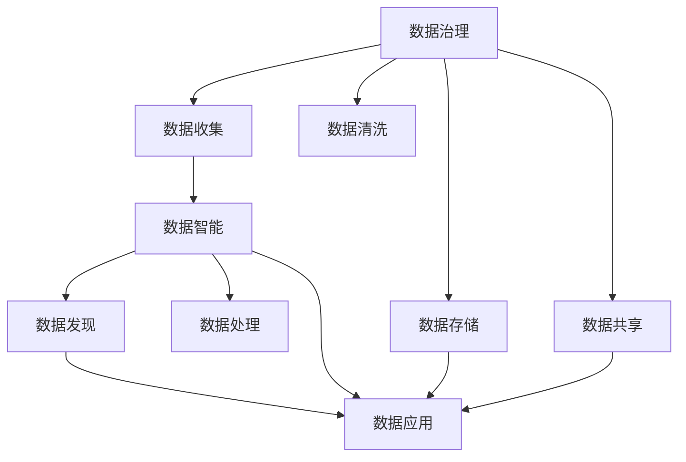

                 

# 人工智能创业数据管理的未来

## 1. 背景介绍

### 1.1 问题由来
在人工智能(AI)创业热潮中，数据管理和利用成为核心竞争力的关键。数据是AI算法的"粮食"，但如何高效、安全、可靠地管理和利用数据，却是一大难题。传统的数据管理方法如关系型数据库、数据仓库等，已无法满足AI时代大规模、高维度、实时性要求。本文聚焦于AI创业中的数据管理问题，旨在探索未来数据管理的解决方案。

### 1.2 问题核心关键点
AI创业数据管理主要关注以下几个关键点：
- **数据治理**：规范数据的收集、存储、清洗和共享流程，保障数据质量和一致性。
- **数据安全**：保护数据的隐私和安全性，避免数据泄露和滥用。
- **数据智能**：利用AI技术自动发现、处理和利用数据，提升数据价值。
- **数据隐私**：在数据共享和利用中遵守隐私保护法规，保护用户隐私。
- **数据基础设施**：搭建高效、稳定、可扩展的数据管理平台，支撑AI模型训练和应用。

### 1.3 问题研究意义
AI创业数据管理对于推动AI技术的落地应用、提升AI模型的效果、保护用户隐私等具有重要意义：

1. **提升AI模型效果**：高质量、丰富多样性的数据可以提升AI模型的泛化能力和表现。
2. **降低AI开发成本**：规范化、自动化数据管理可以大幅减少数据预处理和清洗的复杂度。
3. **保护用户隐私**：合理的数据隐私保护措施可以避免用户数据被滥用，提高用户信任。
4. **促进AI创新应用**：高效的数据治理和智能数据处理可以加速AI模型在更多领域的创新应用。
5. **构建数据基础设施**：高质量的数据基础设施是AI技术规模化落地的基础。

## 2. 核心概念与联系

### 2.1 核心概念概述

为更好地理解AI创业数据管理的核心概念，本节将介绍几个密切相关的核心概念：

- **数据治理**：通过制定数据标准、流程和技术，规范数据从收集到共享的全生命周期管理，保障数据质量和一致性。
- **数据安全**：保护数据免受未授权访问、泄露、篡改等威胁，保障数据的完整性和隐私。
- **数据智能**：利用AI技术自动发现数据中的模式和关系，提升数据的价值和利用效率。
- **数据隐私**：在数据收集、存储、处理和共享过程中遵守隐私保护法规，保护用户隐私。
- **数据基础设施**：包括数据存储、计算、传输、治理等环节，构建支撑AI应用的基础设施平台。

这些核心概念之间相互关联，共同构成了AI创业数据管理的完整体系。

### 2.2 概念间的关系

这些核心概念之间存在着紧密的联系，形成了AI创业数据管理的整体架构。我们可以通过以下Mermaid流程图来展示这些概念的关系：



这个流程图展示了大数据治理与数据智能、数据安全和数据隐私之间的关系：

1. **数据治理**：涉及数据收集、清洗、存储和共享等环节，是数据管理和应用的基础。
2. **数据智能**：通过对数据进行发现、处理和应用，提升数据的价值和利用效率。
3. **数据安全**：保护数据免受未授权访问、泄露、篡改等威胁，保障数据完整性和隐私。
4. **数据隐私**：在数据管理过程中遵守隐私保护法规，保护用户隐私。

这些概念共同构成了AI创业数据管理的核心框架，为其未来发展提供了重要指引。

## 3. 核心算法原理 & 具体操作步骤
### 3.1 算法原理概述

AI创业数据管理的核心算法主要围绕数据治理和数据智能两个方面展开。

- **数据治理算法**：包括数据标准化、数据清洗、数据同步、数据血缘追踪等技术，保障数据的一致性和可用性。
- **数据智能算法**：包括数据发现、数据增强、数据压缩、数据分类等技术，提升数据的利用效率和价值。

### 3.2 算法步骤详解

以下是对数据治理和数据智能算法步骤的详细讲解：

**数据治理算法步骤**：

1. **数据标准化**：通过制定统一的数据格式和命名规则，确保数据的可读性和一致性。
2. **数据清洗**：通过去除重复、缺失、异常值等噪声数据，保证数据的准确性和完整性。
3. **数据同步**：通过数据同步机制，实时更新多个数据源之间的数据，保持数据的最新状态。
4. **数据血缘追踪**：通过数据血缘追踪技术，记录数据流动的全生命周期，确保数据的可追溯性和可控性。

**数据智能算法步骤**：

1. **数据发现**：利用机器学习算法自动发现数据中的模式和关系，挖掘隐藏的知识。
2. **数据增强**：通过数据增强技术，生成更多的训练样本，提高模型的泛化能力。
3. **数据压缩**：通过数据压缩技术，减少数据存储和传输的资源消耗，提升效率。
4. **数据分类**：通过分类算法，将数据自动分类组织，便于存储和查询。

### 3.3 算法优缺点

AI创业数据管理算法具有以下优点：

1. **提升数据质量**：通过规范化、自动化的数据治理，大大提高了数据的准确性和完整性。
2. **降低开发成本**：自动化的数据清洗和处理流程，减少了人工干预和错误，提高了数据处理的效率。
3. **提高数据利用效率**：通过智能数据处理，发现数据中的潜在价值，提升了数据利用的深度和广度。

同时，这些算法也存在一些局限性：

1. **依赖标注数据**：数据治理和数据智能算法往往需要大量的标注数据来训练模型，标注数据的获取和处理成本较高。
2. **算法复杂性**：数据治理和数据智能算法涉及复杂的技术手段，开发和维护的难度较大。
3. **隐私保护风险**：自动化数据处理可能涉及数据的敏感信息，如何保护隐私是一个重要挑战。
4. **数据依赖性强**：算法的有效性高度依赖数据的质量和规模，数据量不足时效果有限。

尽管存在这些局限性，但就目前而言，基于数据治理和数据智能的算法仍然是大数据管理和利用的主流范式。未来相关研究的重点在于如何进一步降低数据处理的复杂度，提升数据处理的自动化水平，同时兼顾隐私保护和数据质量等因素。

### 3.4 算法应用领域

基于数据治理和数据智能的算法已经在诸多领域得到应用，例如：

- **金融风控**：通过数据治理规范交易数据，通过数据智能进行信用评估和风险控制。
- **医疗健康**：规范医疗数据，自动发现疾病相关模式，提升医疗诊断和治疗效率。
- **智能制造**：通过数据治理和智能处理，优化生产流程，提升制造效率和质量。
- **智能交通**：整合交通数据，自动生成交通流分析报告，优化交通管理。
- **智慧城市**：收集和管理城市数据，智能分析城市运行状态，提升城市管理水平。

除了上述这些经典应用外，数据治理和数据智能技术还被创新性地应用到更多场景中，如供应链管理、智能客服、精准营销等，为各行各业带来了新的突破。随着技术的不断发展，未来在更多领域将会有更多的应用案例。

## 4. 数学模型和公式 & 详细讲解  
### 4.1 数学模型构建

本节将使用数学语言对AI创业数据管理的算法原理进行更加严格的刻画。

记原始数据集为 $D=\{x_i\}_{i=1}^N$，其中 $x_i$ 为数据点，包括结构化、半结构化、非结构化等多种形式。

定义数据治理算法 $G$ 和数据智能算法 $I$，其中 $G$ 负责数据的规范化、清洗和同步，$I$ 负责数据的发现、增强和分类。

**数据治理模型**：
$$
G(D) = D' = \{y_i\}_{i=1}^N
$$
其中 $y_i$ 为治理后的数据点，满足规范化和一致性要求。

**数据智能模型**：
$$
I(D') = D'' = \{z_i\}_{i=1}^N
$$
其中 $z_i$ 为智能处理后的数据点，包括自动发现的知识和规则。

### 4.2 公式推导过程

以下我们以金融风控领域为例，推导数据治理和数据智能模型的具体应用。

**数据治理模型**：
假设原始交易数据 $D=\{x_i\}_{i=1}^N$ 中存在字段缺失、重复等问题，治理后得到的数据集 $D'=\{y_i\}_{i=1}^N$。

- **字段规范化**：将字段名称和类型统一规范，如将 "date" 统一转换为 "日期"。
- **字段清洗**：去除缺失、异常值，如将 "age" 字段缺失值替换为 "0"。
- **字段同步**：通过ETL（Extract, Transform, Load）流程，将多个数据源中的交易数据同步到一个标准的数据仓库中。

**数据智能模型**：
假设治理后的数据集 $D'$ 中包含交易记录、客户信息、信用评分等字段，智能处理后得到的数据集 $D''=\{z_i\}_{i=1}^N$。

- **数据发现**：通过机器学习算法（如KNN、决策树等）自动发现交易中的异常行为和潜在风险。
- **数据增强**：通过生成对抗网络（GAN）生成更多的交易记录，扩充训练样本。
- **数据分类**：通过分类算法（如K-means、SVM等）将交易记录自动分类，如分为正常交易、高风险交易等。

### 4.3 案例分析与讲解

以医疗健康领域的数据治理和智能处理为例：

**数据治理模型**：
- **字段规范化**：将各种医学记录格式统一转换为标准化的格式，如将 "day" 转换为 "日期"。
- **字段清洗**：去除不完整、错误的数据记录，如去除 "age" 字段缺失值。
- **字段同步**：通过数据同步工具，将电子病历、实验室检测数据、医疗影像等多源数据整合到统一的电子健康记录中。

**数据智能模型**：
- **数据发现**：利用机器学习算法自动发现疾病相关模式，如通过数据挖掘技术发现某种疾病的早期症状。
- **数据增强**：通过生成对抗网络生成更多的医学数据，扩充训练样本。
- **数据分类**：通过分类算法将疾病自动分类，如分为 "高血压"、"糖尿病" 等。

## 5. 项目实践：代码实例和详细解释说明
### 5.1 开发环境搭建

在进行数据管理和智能处理实践前，我们需要准备好开发环境。以下是使用Python进行PyTorch和Pandas开发的环境配置流程：

1. 安装Anaconda：从官网下载并安装Anaconda，用于创建独立的Python环境。

2. 创建并激活虚拟环境：
```bash
conda create -n pytorch-env python=3.8 
conda activate pytorch-env
```

3. 安装PyTorch：根据CUDA版本，从官网获取对应的安装命令。例如：
```bash
conda install pytorch torchvision torchaudio cudatoolkit=11.1 -c pytorch -c conda-forge
```

4. 安装Pandas：
```bash
pip install pandas
```

5. 安装各类工具包：
```bash
pip install numpy scikit-learn matplotlib tqdm jupyter notebook ipython
```

完成上述步骤后，即可在`pytorch-env`环境中开始数据管理和智能处理实践。

### 5.2 源代码详细实现

以下是一个简单的数据治理和智能处理的Python代码实现，假设我们有一份包含用户交易记录的数据集：

```python
import pandas as pd
import numpy as np

# 读取数据
data = pd.read_csv('transactions.csv')

# 数据清洗
data = data.dropna(subset=['date', 'amount', 'customer_id'])
data['amount'] = data['amount'].fillna(0)
data = data.drop_duplicates()

# 数据规范化
data['date'] = pd.to_datetime(data['date'])

# 数据同步
# 这里假设我们已有一个标准的数据仓库，将数据写入该数据仓库

# 数据智能处理
# 假设我们有一个预训练的模型，可以对交易记录进行异常检测和分类
from sklearn.ensemble import RandomForestClassifier
from sklearn.model_selection import train_test_split

# 将数据划分为训练集和测试集
train, test = train_test_split(data, test_size=0.2)

# 训练模型
model = RandomForestClassifier()
model.fit(train.drop('label', axis=1), train['label'])

# 在测试集上评估模型性能
accuracy = model.score(test.drop('label', axis=1), test['label'])
print(f"Model accuracy: {accuracy:.2f}")
```

### 5.3 代码解读与分析

让我们再详细解读一下关键代码的实现细节：

**数据读取和清洗**：
- `pd.read_csv('transactions.csv')`：使用Pandas库读取CSV格式的数据文件。
- `data = data.dropna(subset=['date', 'amount', 'customer_id'])`：去除缺失值。
- `data['amount'] = data['amount'].fillna(0)`：将缺失值替换为0。
- `data = data.drop_duplicates()`：去除重复记录。

**数据规范化**：
- `data['date'] = pd.to_datetime(data['date'])`：将日期字段转换为标准日期格式。

**数据同步**：
- 数据同步的具体实现会根据具体应用场景和数据仓库的接口有所不同，这里只是简单演示了将数据写入数据仓库的过程。

**数据智能处理**：
- `from sklearn.ensemble import RandomForestClassifier`：导入随机森林分类器。
- `train, test = train_test_split(data, test_size=0.2)`：将数据划分为训练集和测试集。
- `model = RandomForestClassifier()`：创建一个随机森林分类器。
- `model.fit(train.drop('label', axis=1), train['label'])`：使用训练集训练模型。
- `accuracy = model.score(test.drop('label', axis=1), test['label'])`：在测试集上评估模型性能。

这个简单的代码示例展示了如何通过数据治理和智能处理，将原始交易数据转换为可用、可靠的数据集，并训练出有效的分类模型。

## 6. 实际应用场景
### 6.1 金融风控

在金融风控领域，数据治理和智能处理技术可以大幅提升风险控制能力。具体而言，可以通过数据治理规范和整合交易数据，通过数据智能发现潜在风险行为，构建高效的风控模型。

以信用卡风控为例，通过数据治理技术将多源数据整合到一个标准的数据仓库中，通过数据智能技术自动发现高风险交易行为，构建随机森林、梯度提升树等模型进行风险预测和分类。模型的准确性和鲁棒性大幅提升，能够更有效地识别和防范信用卡欺诈行为。

### 6.2 医疗健康

在医疗健康领域，数据治理和智能处理技术可以提升医疗诊断和治疗效率。具体而言，可以通过数据治理规范和整合电子病历、实验室检测数据、医疗影像等多源数据，通过数据智能技术自动发现疾病相关模式，构建精准的诊断和治疗模型。

以糖尿病预测为例，通过数据治理技术将多源数据整合到一个标准的数据仓库中，通过数据智能技术自动发现糖尿病患者的早期症状，构建支持向量机、神经网络等模型进行糖尿病预测和分类。模型的准确性和泛化能力大幅提升，能够更有效地辅助医生进行疾病预测和治疗决策。

### 6.3 智能制造

在智能制造领域，数据治理和智能处理技术可以优化生产流程，提升制造效率和质量。具体而言，可以通过数据治理技术规范和整合生产数据、设备状态、人员信息等数据，通过数据智能技术自动发现生产中的异常行为，构建预测模型和优化算法。

以智能仓储为例，通过数据治理技术将多源数据整合到一个标准的数据仓库中，通过数据智能技术自动发现异常仓储行为，构建深度学习模型进行仓储优化。模型的预测和决策能力大幅提升，能够更有效地优化仓储管理，提升生产效率和减少成本。

### 6.4 未来应用展望

随着数据治理和智能处理技术的不断演进，未来在更多领域将会有更多的应用案例。

在智慧城市领域，数据治理和智能处理技术可以提升城市管理的自动化和智能化水平，构建更安全、高效的未来城市。通过数据治理规范和管理交通、环境、公共安全等数据，通过数据智能技术自动生成城市运行状态分析报告，优化交通管理、环境保护、公共安全等环节，提升城市管理水平。

在智能客服领域，数据治理和智能处理技术可以构建高效、智能的客服系统。通过数据治理规范和管理客户咨询数据，通过数据智能技术自动生成智能客服回复，提升客服响应速度和客户满意度。

在精准营销领域，数据治理和智能处理技术可以提升营销效果和客户体验。通过数据治理技术规范和管理客户数据，通过数据智能技术自动发现客户需求和行为模式，构建精准营销模型，提升营销效果和客户满意度。

## 7. 工具和资源推荐
### 7.1 学习资源推荐

为了帮助开发者系统掌握AI创业数据管理的理论基础和实践技巧，这里推荐一些优质的学习资源：

1. 《大数据治理与智能分析》系列博文：由大数据技术专家撰写，深入浅出地介绍了大数据治理和智能分析的基本概念和前沿技术。

2. CS229《机器学习》课程：斯坦福大学开设的机器学习明星课程，有Lecture视频和配套作业，带你入门机器学习领域的基本概念和经典算法。

3. 《Python数据科学手册》书籍：Python数据科学领域的经典入门书籍，全面介绍了Pandas、NumPy、Scikit-Learn等工具的使用，适合初学者阅读。

4. Kaggle竞赛：Kaggle是数据科学领域的竞赛平台，提供大量数据集和竞赛挑战，适合实践数据治理和智能处理技术。

5. UCI机器学习库：UCI是机器学习领域的数据集库，提供大量公开的数据集，适合进行数据治理和智能处理实验。

通过对这些资源的学习实践，相信你一定能够快速掌握AI创业数据管理的精髓，并用于解决实际的业务问题。

### 7.2 开发工具推荐

高效的开发离不开优秀的工具支持。以下是几款用于AI创业数据管理和智能处理开发的常用工具：

1. Python：作为数据科学领域的主流语言，Python具有简洁易用、生态丰富的特点，适合进行数据治理和智能处理开发。

2. PyTorch：基于Python的开源深度学习框架，灵活动态的计算图，适合快速迭代研究。

3. Pandas：Python的第三方数据处理库，提供高效的数据读写、清洗、分析功能，适合进行数据治理和智能处理。

4. Scikit-Learn：Python的第三方机器学习库，提供丰富的机器学习算法和工具，适合进行数据智能处理。

5. Apache Kafka：高吞吐量的分布式消息系统，适合进行大数据流处理和实时数据同步。

6. Apache Hadoop：开源的大数据处理框架，适合进行大规模数据存储和处理。

7. Apache Spark：快速的大数据处理引擎，支持大规模数据集的处理和分析。

合理利用这些工具，可以显著提升AI创业数据管理的开发效率，加快创新迭代的步伐。

### 7.3 相关论文推荐

AI创业数据管理的研究源于学界的持续研究。以下是几篇奠基性的相关论文，推荐阅读：

1. "Data Governance for Business Intelligence" 论文：提出了数据治理的基本概念和模型，奠定了数据治理理论基础。

2. "Data Intelligences and Data Mining" 论文：探讨了数据智能的基本概念和应用，推动了数据智能技术的发展。

3. "Data Privacy and Data Protection" 论文：讨论了数据隐私保护的基本原则和法律框架，为数据隐私保护提供了理论支持。

4. "Large-Scale Data Management and Analysis" 论文：介绍了大规模数据管理的技术手段，为数据治理和智能处理提供了实践经验。

5. "Data-Driven Analytics in AI" 论文：探讨了数据驱动的AI分析方法，推动了数据治理和智能处理技术在AI应用中的实践。

这些论文代表了大数据管理和利用的发展脉络。通过学习这些前沿成果，可以帮助研究者把握学科前进方向，激发更多的创新灵感。

除上述资源外，还有一些值得关注的前沿资源，帮助开发者紧跟AI创业数据管理的最新进展，例如：

1. arXiv论文预印本：人工智能领域最新研究成果的发布平台，包括大量尚未发表的前沿工作，学习前沿技术的必读资源。

2. 业界技术博客：如Google AI、Facebook AI、Amazon AI等顶尖实验室的官方博客，第一时间分享他们的最新研究成果和洞见。

3. 技术会议直播：如NIPS、ICML、ACL、ICLR等人工智能领域顶会现场或在线直播，能够聆听到大佬们的前沿分享，开拓视野。

4. GitHub热门项目：在GitHub上Star、Fork数最多的数据管理和智能处理相关项目，往往代表了该技术领域的发展趋势和最佳实践，值得去学习和贡献。

5. 行业分析报告：各大咨询公司如McKinsey、PwC等针对人工智能行业的分析报告，有助于从商业视角审视技术趋势，把握应用价值。

总之，对于AI创业数据管理的学习和实践，需要开发者保持开放的心态和持续学习的意愿。多关注前沿资讯，多动手实践，多思考总结，必将收获满满的成长收益。

## 8. 总结：未来发展趋势与挑战
### 8.1 总结

本文对AI创业数据管理的核心算法和操作步骤进行了全面系统的介绍。首先阐述了数据治理和数据智能的核心概念，明确了其对于推动AI技术落地应用的重要意义。其次，从原理到实践，详细讲解了数据治理和数据智能的数学原理和关键步骤，给出了数据管理和智能处理代码实例。同时，本文还广泛探讨了数据治理和数据智能技术在多个行业领域的应用前景，展示了其巨大的潜力。此外，本文精选了数据管理和智能处理技术的学习资源，力求为读者提供全方位的技术指引。

通过本文的系统梳理，可以看到，AI创业数据管理技术正在成为AI应用的重要组成部分，极大地提升了数据的质量和利用效率。随着技术的不断发展，未来在更多领域将会有更多的应用案例，推动AI技术的落地应用和产业升级。

### 8.2 未来发展趋势

展望未来，AI创业数据管理技术将呈现以下几个发展趋势：

1. **自动化水平提升**：数据治理和智能处理流程将更加自动化，通过自动化工具和算法，减少人工干预和错误，提升数据处理的效率和质量。

2. **数据来源多样化**：数据来源将更加多样化，包括社交媒体、物联网、云计算等新兴数据源，数据治理和智能处理技术需要适应更多类型的数据。

3. **数据隐私保护加强**：数据隐私保护法规将更加严格，数据治理和智能处理技术需要更好地保护用户隐私，遵守相关法规。

4. **数据智能应用深入**：数据智能技术将进一步深入应用，通过自然语言处理、图像识别、知识图谱等技术，提升数据的利用效率和价值。

5. **跨领域数据整合**：数据治理和智能处理技术需要更好地整合不同领域的数据，构建跨领域的数据平台，提升数据的通用性和可复用性。

6. **数据基础设施优化**：数据治理和智能处理技术需要更好地优化数据基础设施，包括数据存储、计算、传输等环节，提升系统的性能和稳定性。

这些趋势凸显了AI创业数据管理技术的广阔前景。这些方向的探索发展，必将进一步提升数据治理和智能处理的效果和效率，为AI技术落地应用提供更坚实的数据基础。

### 8.3 面临的挑战

尽管AI创业数据管理技术已经取得了显著进展，但在迈向更加智能化、普适化应用的过程中，仍面临诸多挑战：

1. **数据质量问题**：数据质量参差不齐，难以确保数据的准确性、一致性和完整性，是数据管理的重要难题。

2. **隐私保护风险**：数据处理过程中存在隐私泄露的风险，如何平衡数据利用和隐私保护是一大挑战。

3. **算法复杂性**：数据治理和智能处理算法涉及复杂的技术手段，开发和维护的难度较大。

4. **数据依赖性强**：算法的有效性高度依赖数据的质量和规模，数据量不足时效果有限。

5. **计算资源消耗大**：大规模数据处理和分析需要高计算资源，如何优化资源消耗，提升处理效率，是亟待解决的问题。

6. **标准化难度高**：不同行业、不同应用场景的数据标准不一致，数据治理和智能处理技术需要适应更多复杂的标准化需求。

7. **安全性有待提升**：数据处理过程中存在安全隐患，如何保障数据安全，防止数据篡改和泄露，是重要课题。

正视数据管理面临的这些挑战，积极应对并寻求突破，将是大数据治理和智能处理技术走向成熟的必由之路。相信随着学界和产业界的共同努力，这些挑战终将一一被克服，数据治理和智能处理技术必将在构建智能社会的进程中扮演重要角色。

### 8.4 研究展望

面对数据管理面临的挑战，未来的研究需要在以下几个方面寻求新的突破：

1. **数据标准化与互操作性**：研究如何构建统一的数据标准和互操作框架，促进不同数据源之间的数据共享和集成。

2. **自动化数据清洗与治理**：研究如何利用机器学习和自然语言处理技术，自动发现和处理数据中的异常和噪声，提升数据治理的效率和效果。

3. **分布式数据处理**：研究如何利用分布式计算技术，高效处理海量数据，提升数据处理的性能和可靠性。

4. **隐私保护技术**：研究如何更好地保护数据隐私，如差分隐私、联邦学习等技术

