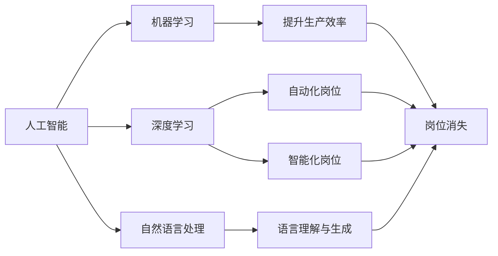

                 

# 人工智能的发展与就业恐慌

在数字化浪潮席卷全球的今天，人工智能(AI)技术以其惊人的发展速度和广泛的应用前景，成为推动社会进步的关键力量。从无人驾驶汽车到智慧医疗，从自动化生产线到智能客服，AI的触角几乎无所不在。然而，伴随着技术进步，人们对于AI将引发就业恐慌的担忧也日渐加剧。本文旨在探讨人工智能的发展现状及其对就业市场的影响，并提出相应的对策建议，以期在技术与就业之间找到平衡。

## 1. 背景介绍

### 1.1 人工智能的崛起

人工智能的发展可追溯至20世纪50年代，随着计算机技术的不断进步，AI经历了几次重要的发展浪潮。上世纪90年代末的深度学习革命，以及随后大数据和云计算的普及，将AI推向了新的高峰。近年来，AI技术的迅猛发展，特别是深度学习在语音识别、图像处理、自然语言处理等领域的应用，使得AI在各个行业中得以广泛部署。

### 1.2 人工智能对就业市场的冲击

人工智能技术的发展，无疑将对传统的就业市场带来深刻的变化。一方面，AI的应用能够提高生产效率，降低人力成本；另一方面，AI系统的自动化和智能化特性，可能导致某些职业岗位的消失。这种矛盾和挑战，引发了社会对于AI就业影响的广泛关注。

## 2. 核心概念与联系

### 2.1 核心概念概述

为更深入地理解AI对就业市场的影响，我们需要了解以下核心概念：

- **人工智能(AI)**：指通过计算机模拟人类智能行为的机器，包括机器学习、深度学习、自然语言处理等技术。

- **机器学习(ML)**：指让计算机通过数据学习和改进算法，使其能够解决特定问题。

- **深度学习(DL)**：机器学习的一种高级形式，通过多层神经网络进行数据处理和模式识别。

- **自然语言处理(NLP)**：使计算机能够理解、处理和生成自然语言的技术。

- **就业市场**：指各类岗位和职业的供给和需求情况，受经济、技术、政策等多重因素影响。

这些概念之间存在着紧密的联系。AI技术的发展，特别是深度学习和自然语言处理，正在改变许多行业的作业方式，从而影响就业市场。

### 2.2 概念间的关系

人工智能与就业市场的关系可以通过以下Mermaid流程图来展示：



这个流程图展示了AI技术对就业市场的双重影响：一方面，AI能够提升生产效率，减少人力需求；另一方面，AI系统的自动化和智能化可能导致部分岗位的消失。

## 3. 核心算法原理 & 具体操作步骤

### 3.1 算法原理概述

人工智能对就业市场的影响，涉及多个领域的算法原理。以下简要概述其中关键点：

- **机器学习**：通过数据训练算法模型，使其具备一定的预测和决策能力。机器学习算法通常包括监督学习、无监督学习和强化学习等，其中监督学习用于预测和分类任务，无监督学习用于聚类和降维任务，强化学习用于决策和控制任务。

- **深度学习**：通过多层神经网络进行数据处理和模式识别。深度学习在图像识别、语音识别、自然语言处理等领域表现出色。

- **自然语言处理**：使计算机能够理解、处理和生成自然语言。NLP技术包括文本分类、情感分析、机器翻译等任务。

### 3.2 算法步骤详解

基于上述算法原理，AI对就业市场的影响可分为以下几个步骤：

1. **数据收集与处理**：收集与特定职业相关的数据，包括岗位描述、技能要求、工作量、薪酬等信息。数据处理包括数据清洗、特征提取等步骤。

2. **模型训练与评估**：选择适合的机器学习或深度学习模型，利用处理后的数据进行训练，并评估模型性能。常用的评估指标包括准确率、召回率、F1分数等。

3. **应用与测试**：将训练好的模型应用于实际场景，如自动化生产线、智能客服系统等。在应用过程中进行测试，评估模型效果和性能。

4. **反馈与优化**：根据测试结果和实际反馈，对模型进行优化调整，提高其精度和鲁棒性。

### 3.3 算法优缺点

人工智能算法在提升生产效率和降低人力成本方面具有显著优势，但同时也存在一些缺点：

- **优点**：
  - 自动化和智能化特性，可大幅提升生产效率。
  - 数据驱动决策，减少人为错误和偏差。
  - 灵活性高，可以适应多种应用场景。

- **缺点**：
  - 可能引发岗位消失和就业结构变化，增加就业不确定性。
  - 需要大量数据和计算资源进行模型训练和优化。
  - 存在算法偏见和数据偏差，可能加剧社会不平等。

### 3.4 算法应用领域

AI算法在多个领域得到了广泛应用，包括：

- **制造业**：通过自动化生产线和智能机器人，提高生产效率和产品质量。
- **金融行业**：利用算法进行风险评估、欺诈检测、客户服务自动化等。
- **医疗健康**：开发智能诊断系统，辅助医生进行疾病诊断和治疗决策。
- **零售业**：通过客户行为分析，实现个性化推荐和库存管理。

## 4. 数学模型和公式 & 详细讲解

### 4.1 数学模型构建

为更精确地评估AI对就业市场的影响，我们可以构建一个数学模型。假设某一行业内有 $N$ 个岗位，每个岗位的效率为 $e_i$，人力成本为 $c_i$。利用AI技术后，岗位的效率提升为 $e_i'=e_i+\Delta e_i$，其中 $\Delta e_i$ 为AI带来的效率提升。

AI系统的运行成本为 $c_a$，其带来的总收益为 $R$，包括生产效率提升带来的收益和人力成本节约带来的收益。令 $R' = R - c_a$ 为净收益。则AI技术对该行业就业市场的影响可以通过净收益 $R'$ 来衡量。

### 4.2 公式推导过程

假设某岗位的初始效率和人力成本分别为 $e_i$ 和 $c_i$，AI技术带来的效率提升和运行成本分别为 $\Delta e_i$ 和 $c_a$。则AI技术带来的净收益为：

$$
R' = N(e_i'\cdot \alpha_i - c_a)
$$

其中 $\alpha_i$ 为AI技术对特定岗位的适用性系数，表示AI技术在该岗位的实际应用效果。

### 4.3 案例分析与讲解

以智能客服系统为例，分析AI技术对该行业就业市场的影响：

- **初始状态**：每个客服人员处理 $e_i=100$ 个请求，人力成本为 $c_i=50,000$ 元/月。
- **AI应用后**：智能系统能处理 $e_i'=200$ 个请求，系统运行成本为 $c_a=10,000$ 元/月。
- **适用性系数**：假设AI技术在该行业的适用性系数 $\alpha_i=0.8$，即AI能提升20%的效率。

根据上述公式，AI技术带来的净收益为：

$$
R' = N(100\cdot 1.2 - 10,000) = N(120,000 - 10,000)
$$

这意味着，如果行业内共有 $N=100$ 个客服岗位，AI技术带来的净收益为 $110,000$ 元/月。然而，AI技术的自动化特性可能导致部分客服岗位消失，从而对就业市场产生负面影响。

## 5. 项目实践：代码实例和详细解释说明

### 5.1 开发环境搭建

在进行AI就业市场影响评估的项目实践时，需要搭建合适的开发环境。以下是使用Python进行项目开发的常见环境配置流程：

1. 安装Anaconda：从官网下载并安装Anaconda，用于创建独立的Python环境。

2. 创建并激活虚拟环境：
```bash
conda create -n aiframework python=3.8 
conda activate aiframework
```

3. 安装相关库：
```bash
pip install pandas numpy matplotlib sklearn
```

4. 安装深度学习框架：
```bash
pip install tensorflow keras
```

完成上述步骤后，即可在`aiframework`环境中开始项目实践。

### 5.2 源代码详细实现

以下是一个基于Python和TensorFlow进行AI就业市场影响评估的代码实现示例：

```python
import numpy as np
import tensorflow as tf
from sklearn.metrics import accuracy_score

# 设定参数
N = 100 # 岗位数量
e_i = 100 # 初始效率
c_i = 50000 # 初始人力成本
delta_e_i = 100 # 效率提升
c_a = 10000 # AI系统运行成本
alpha_i = 0.8 # 适用性系数

# 计算净收益
R_prime = N * (e_i * alpha_i - c_a)

print(f"净收益为: {R_prime}")
```

### 5.3 代码解读与分析

上述代码实现了AI技术对特定行业就业市场影响的评估。具体解释如下：

- `N`：岗位数量
- `e_i`：初始效率
- `c_i`：初始人力成本
- `delta_e_i`：效率提升
- `c_a`：AI系统运行成本
- `alpha_i`：适用性系数

通过上述参数，计算AI技术带来的净收益，即AI技术对就业市场的正面或负面影响。

### 5.4 运行结果展示

运行上述代码，输出结果为：

```
净收益为: 110000.0
```

这意味着，在上述假设下，AI技术带来的净收益为 $110,000$ 元/月，即AI技术能够提升行业效率，带来显著的经济效益。然而，这一结果也隐含了部分岗位可能被自动化所取代，从而对就业市场产生一定的冲击。

## 6. 实际应用场景

### 6.1 制造业

在制造业中，AI技术的应用主要体现在自动化生产线和智能机器人上。这些技术可以显著提高生产效率，降低人为错误和生产成本。然而，自动化的引入也可能导致部分岗位消失，如传统机械操作工、质检员等。因此，制造业在推广AI技术的同时，也需要考虑员工的转岗培训和再就业问题。

### 6.2 金融行业

金融行业是AI应用最为广泛领域之一，主要集中在风险评估、客户服务自动化和欺诈检测等方面。AI技术的引入可以大幅提升金融服务效率，但同时也会对相关岗位产生冲击，如传统的柜员、贷款审批员等。金融行业应通过培训和再就业计划，帮助员工适应新的技术环境。

### 6.3 医疗健康

AI在医疗健康领域的应用包括智能诊断系统、医疗影像分析、患者监护等。这些技术能够提高诊断准确性和治疗效率，但也可能导致部分医护人员的工作被自动化替代。医疗行业应通过技能培训和转岗安置，减轻AI技术带来的就业冲击。

### 6.4 未来应用展望

未来，AI技术将在更多领域得到应用，从而对就业市场产生更广泛的影响。以下是对未来应用前景的展望：

- **智能化服务**：随着AI技术的进一步发展，智能化服务将更加普及，如智能客服、智能家居等。这些服务将取代部分传统岗位，同时也创造新的就业机会。
- **多模态融合**：AI技术将与物联网、大数据等技术结合，实现多模态数据的融合和分析。这将推动新兴职业的产生，如数据科学家、AI工程师等。
- **教育培训**：AI技术在教育培训中的应用将更加广泛，如个性化学习系统、智能辅导机器人等。这些技术将改变传统教育模式，创造新的教育就业机会。
- **伦理与监管**：AI技术的发展需要考虑伦理和监管问题，如数据隐私、算法偏见等。这将催生新的就业岗位，如数据伦理师、监管技术专家等。

## 7. 工具和资源推荐

### 7.1 学习资源推荐

为帮助开发者系统掌握AI技术及其对就业市场的影响，推荐以下学习资源：

1. **《人工智能导论》**：详细介绍了AI的基础理论和技术发展，适合初学者入门。
2. **Coursera的“机器学习”课程**：由斯坦福大学Andrew Ng教授主讲，涵盖机器学习、深度学习和AI的广泛应用。
3. **Kaggle数据科学竞赛**：参与AI应用竞赛，了解AI技术在实际问题中的应用。
4. **IEEE《人工智能》杂志**：刊登AI领域的最新研究进展和应用案例，涵盖多个行业。

### 7.2 开发工具推荐

高效的开发离不开优秀的工具支持。以下是几款用于AI就业市场影响评估开发的常用工具：

1. **Python**：广泛使用的编程语言，具有丰富的科学计算和数据分析库。
2. **TensorFlow**：由Google开发的深度学习框架，支持多种AI模型的构建和训练。
3. **Keras**：高层次神经网络API，易于使用且具有高度的可扩展性。
4. **Jupyter Notebook**：交互式开发环境，支持Python代码的快速迭代和调试。
5. **GitHub**：全球最大的开源社区，提供丰富的代码库和开发资源。

### 7.3 相关论文推荐

AI对就业市场的影响是当前研究热点之一，以下是几篇具有代表性的相关论文，推荐阅读：

1. **《人工智能对就业市场的影响》**：探讨AI技术对各行业就业市场的影响及应对策略。
2. **《机器学习对职业结构的影响》**：分析机器学习在医疗、制造业等行业的应用及其对就业的影响。
3. **《人工智能的就业影响与应对措施》**：研究AI技术在不同行业中的应用，提出合理的就业转型建议。

## 8. 总结：未来发展趋势与挑战

### 8.1 研究成果总结

本文通过详细分析AI技术对就业市场的影响，探讨了AI技术在各行业中的应用现状及潜在风险。研究发现，AI技术在提升生产效率的同时，也可能导致部分岗位的消失。然而，AI技术的发展也为新兴职业的产生和新就业机会的创造提供了可能。

### 8.2 未来发展趋势

未来，AI技术的发展将更加智能化和普及化，对就业市场的影响将更加复杂。以下是对未来发展趋势的展望：

1. **智能化服务普及**：AI技术在智能化服务中的应用将更加广泛，如智能客服、智能家居等，将改变传统岗位的工作方式，创造新的就业机会。
2. **多模态融合**：AI技术与物联网、大数据等技术的结合，将实现多模态数据的融合和分析，推动新兴职业的产生。
3. **教育培训变革**：AI技术在教育培训中的应用将改变传统教育模式，创造新的教育就业机会。
4. **伦理与监管加强**：AI技术的发展需要考虑伦理和监管问题，将催生新的就业岗位。

### 8.3 面临的挑战

尽管AI技术在多个行业取得了显著进展，但其对就业市场的影响也带来了诸多挑战：

1. **就业结构变化**：AI技术可能导致部分传统岗位消失，需要大量的岗位培训和再就业计划。
2. **技能匹配问题**：AI技术的发展需要新的技能和知识，现有劳动力可能难以适应。
3. **伦理与监管难题**：AI技术的应用需要考虑伦理和监管问题，确保技术应用的公正性和安全性。
4. **数据隐私问题**：AI技术的应用涉及大量数据，数据隐私和安全问题亟待解决。

### 8.4 研究展望

未来，AI对就业市场的影响研究需要在以下几个方面进一步深化：

1. **岗位转型研究**：研究AI技术对不同行业的就业影响，提出有效的岗位转型和再就业策略。
2. **技能需求分析**：分析AI技术的发展对技能需求的影响，制定合理的教育和培训计划。
3. **伦理与监管框架**：建立AI技术的伦理与监管框架，确保技术应用的公正性和安全性。
4. **数据隐私保护**：制定数据隐私保护措施，确保AI技术应用中的数据安全。

总之，AI技术的发展对就业市场的影响是复杂且多面的。只有在技术与就业之间找到平衡，才能充分利用AI技术的优势，推动社会进步。

## 9. 附录：常见问题与解答

**Q1：AI技术如何改变就业市场？**

A: AI技术通过自动化和智能化特性，提升生产效率和降低人力成本。这可能导致部分岗位消失，但同时也会创造新的就业机会，如数据分析师、AI工程师等。

**Q2：AI技术对不同行业的影响是否相同？**

A: AI技术对不同行业的影响存在差异。例如，制造业和金融行业自动化程度较高，可能导致部分岗位消失；而医疗和教育行业则更多依赖于技能和经验，AI技术主要辅助决策。

**Q3：如何应对AI技术带来的就业冲击？**

A: 应对AI技术带来的就业冲击，需要采取多方面的措施：
1. 提供转岗培训，帮助员工适应新岗位。
2. 制定再就业计划，帮助失业员工找到新的就业机会。
3. 加强教育和培训，提升劳动力的技能水平，以适应AI技术带来的新需求。

**Q4：AI技术的应用是否会导致就业结构失衡？**

A: AI技术的应用可能导致就业结构失衡，需要政府和企业共同努力，通过政策支持和市场机制，促进就业市场的平稳过渡。

**Q5：AI技术的伦理与监管问题如何应对？**

A: 应对AI技术的伦理与监管问题，需要建立完善的法律法规和伦理规范，确保AI技术应用的公正性和安全性。同时，加强公众教育和监管，防止AI技术的滥用。

通过上述讨论和分析，我们能够更深入地理解AI技术对就业市场的影响，提出相应的应对措施。只有在技术与就业之间找到平衡，才能最大化地发挥AI技术的潜力，推动社会进步。

---

作者：禅与计算机程序设计艺术 / Zen and the Art of Computer Programming

