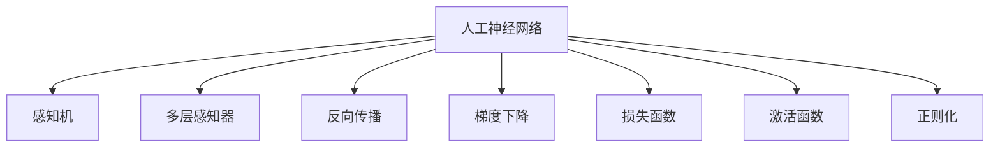
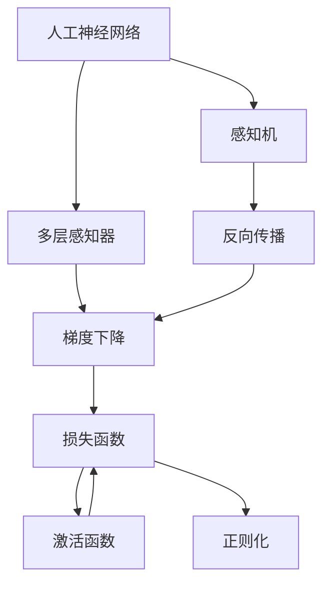
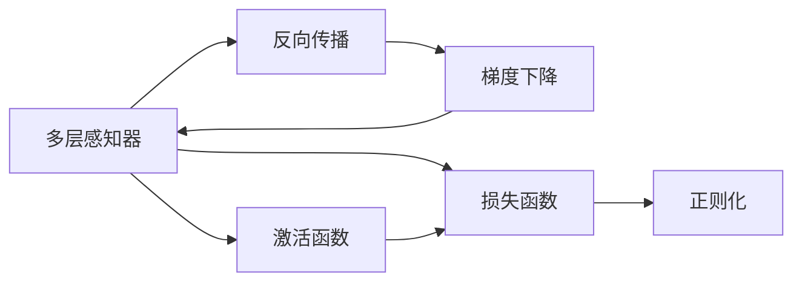
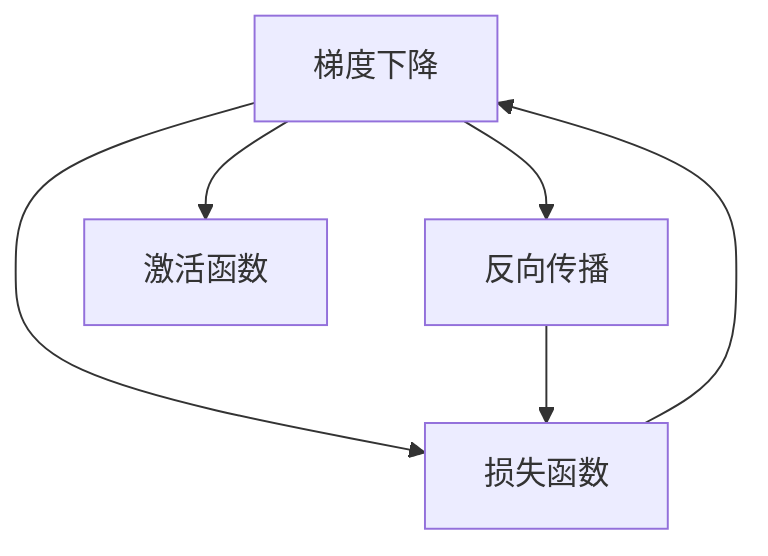
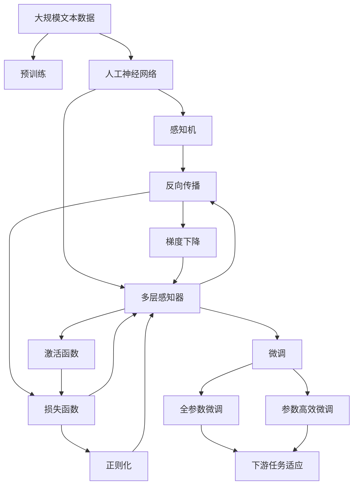

                 

# 人工神经网络的早期工作

> 关键词：人工神经网络, 感知机, 反向传播, 深度学习, 梯度下降, 多层感知器, 计算机视觉

## 1. 背景介绍

### 1.1 问题由来
人工神经网络（Artificial Neural Networks, ANN）是一种模拟人类大脑结构和功能的计算模型，最初由心理学领域的神经科学家提出，后来在人工智能和机器学习领域得到广泛应用。1943年，神经科学家Warren McCulloch和Walter Pitts发表了《A Logical Calculus of the Ideas Immanent in Nervous Activity》，提出了一种基于神经元连接的网络结构，被认为是人工神经网络的开端。本文将回顾人工神经网络的发展历程，尤其是早期的工作，包括感知机模型和反向传播算法。

### 1.2 问题核心关键点
人工神经网络的研究和发展历程中，几个核心关键点包括：
1. **感知机模型**：最早提出的一种二元分类模型，基于简单的感知单元，能够处理二元分类任务。
2. **反向传播算法**：一种基于梯度下降的优化算法，用于训练多层感知器，是深度学习的基础。
3. **多层感知器**：由多个感知单元组成的层次化模型，能够处理复杂的非线性映射。
4. **梯度下降法**：一种优化算法，用于最小化损失函数，是深度学习训练的核心。

### 1.3 问题研究意义
人工神经网络的早期工作为后来的深度学习发展奠定了基础，研究这些工作不仅有助于理解深度学习的基本原理，还能为未来的研究提供借鉴和启示。此外，人工神经网络在计算机视觉、自然语言处理、语音识别等领域的广泛应用，显示了其强大的功能和潜在的商业价值。

## 2. 核心概念与联系

### 2.1 核心概念概述

为更好地理解人工神经网络的早期工作，本节将介绍几个密切相关的核心概念：

- **人工神经网络（ANN）**：一种由多个感知单元组成的层次化网络，用于模拟人类大脑的结构和功能，实现复杂的模式识别和预测。

- **感知机（Perceptron）**：最早提出的一种二元分类模型，基于简单的感知单元，能够处理二元分类任务。

- **反向传播算法（Backpropagation）**：一种基于梯度下降的优化算法，用于训练多层感知器，是深度学习的基础。

- **多层感知器（Multilayer Perceptron, MLP）**：由多个感知单元组成的层次化模型，能够处理复杂的非线性映射。

- **梯度下降法（Gradient Descent）**：一种优化算法，用于最小化损失函数，是深度学习训练的核心。

- **损失函数（Loss Function）**：用于衡量模型预测结果与真实标签之间的差异，是训练过程中的关键指标。

- **激活函数（Activation Function）**：用于引入非线性因素，使得模型能够处理复杂的非线性关系。

- **正则化（Regularization）**：一种防止过拟合的技术，通过引入惩罚项，控制模型的复杂度。

这些核心概念之间的逻辑关系可以通过以下Mermaid流程图来展示：



这个流程图展示了大神经网络的几个核心概念及其之间的关系：

1. 人工神经网络是一种基于感知机的基础模型。
2. 多层感知器是人工神经网络的一种扩展，通过增加层次和单元数，能够处理更复杂的任务。
3. 反向传播算法是多层感知器训练的基础。
4. 梯度下降法是反向传播算法的核心，用于最小化损失函数。
5. 损失函数用于衡量模型预测结果与真实标签之间的差异。
6. 激活函数用于引入非线性因素。
7. 正则化用于防止模型过拟合。

这些概念共同构成了人工神经网络的早期工作框架，为其后续发展和应用提供了理论基础。

### 2.2 概念间的关系

这些核心概念之间存在着紧密的联系，形成了人工神经网络的工作框架。下面我通过几个Mermaid流程图来展示这些概念之间的关系。

#### 2.2.1 人工神经网络的学习范式



这个流程图展示了大神经网络的学习范式，即通过多层感知器利用反向传播算法进行梯度下降，最小化损失函数，引入激活函数和非线性因素，同时使用正则化技术防止过拟合。

#### 2.2.2 反向传播算法与多层感知器



这个流程图展示了反向传播算法与多层感知器之间的关系。多层感知器通过反向传播算法更新权重，最小化损失函数，同时使用激活函数和正则化技术。

#### 2.2.3 梯度下降与反向传播



这个流程图展示了梯度下降算法与反向传播算法之间的关系。梯度下降通过反向传播算法计算梯度，更新权重，同时使用激活函数。

### 2.3 核心概念的整体架构

最后，我们用一个综合的流程图来展示这些核心概念在大神经网络微调过程中的整体架构：



这个综合流程图展示了从预训练到微调，再到下游任务适应的大神经网络微调过程。人工神经网络首先在大规模文本数据上进行预训练，然后通过微调（包括全参数微调和参数高效微调）来适应下游任务。最后，通过引入激活函数和非线性因素，使用正则化技术防止过拟合，实现微调模型对下游任务的适应。

## 3. 核心算法原理 & 具体操作步骤
### 3.1 算法原理概述

人工神经网络的早期工作主要集中在感知机模型和反向传播算法的开发上。感知机是一种基于简单的感知单元的二元分类模型，而反向传播算法则是一种用于训练多层感知器的优化算法。

#### 3.1.1 感知机模型

感知机模型由一个或多个感知单元组成，每个单元接受输入并输出一个值。对于二元分类任务，输入为特征向量，输出为一个二元分类标签。感知机模型的公式为：

$$
y = \begin{cases}
1 & \text{if } \sum_{i=1}^n w_i x_i + b > 0 \\
0 & \text{if } \sum_{i=1}^n w_i x_i + b \leq 0
\end{cases}
$$

其中，$x_i$ 为输入特征向量，$w_i$ 为权重，$b$ 为偏置，$y$ 为输出标签。

感知机模型的学习过程是通过调整权重和偏置，使得模型在训练集上的误差最小化。误差函数通常定义为0-1损失函数，即：

$$
L(y, \hat{y}) = \begin{cases}
1 & \text{if } y \neq \hat{y} \\
0 & \text{if } y = \hat{y}
\end{cases}
$$

其中，$y$ 为真实标签，$\hat{y}$ 为模型预测的标签。

#### 3.1.2 反向传播算法

反向传播算法是一种基于梯度下降的优化算法，用于训练多层感知器。它通过计算损失函数对每个权重的梯度，反向传播到网络中，更新权重和偏置。反向传播算法的公式为：

$$
\frac{\partial L}{\partial w_i} = \frac{\partial L}{\partial y} \frac{\partial y}{\partial z} \frac{\partial z}{\partial w_i}
$$

其中，$L$ 为损失函数，$y$ 为输出层激活函数，$z$ 为输出层权重和偏置。

反向传播算法的核心在于计算损失函数对每个权重的梯度，然后通过梯度下降法更新权重和偏置。这个过程可以通过链式法则递归计算，具体步骤如下：

1. 前向传播：计算每个节点的激活值，直到输出层。
2. 计算误差：根据输出层激活值和真实标签，计算损失函数。
3. 反向传播：从输出层开始，计算每个节点的梯度，逐步传播到输入层。
4. 更新权重：使用梯度下降法更新每个权重，使得损失函数最小化。

### 3.2 算法步骤详解

人工神经网络的早期工作主要集中在感知机模型和反向传播算法的开发上。下面将详细介绍这两个算法的详细步骤。

#### 3.2.1 感知机模型的训练步骤

1. 初始化权重和偏置：随机初始化感知机模型的权重和偏置。
2. 前向传播：输入特征向量，计算输出标签。
3. 计算误差：根据输出标签和真实标签，计算误差。
4. 更新权重：调整权重和偏置，使得误差最小化。

具体步骤如下：

1. 初始化权重和偏置：$w \sim N(0, \sigma^2)$，$b \sim N(0, \sigma^2)$。
2. 前向传播：计算每个节点的激活值，直到输出层。
3. 计算误差：根据输出层激活值和真实标签，计算0-1损失函数。
4. 更新权重：使用梯度下降法更新每个权重，使得误差最小化。

#### 3.2.2 反向传播算法的训练步骤

1. 初始化权重和偏置：随机初始化多层感知器的权重和偏置。
2. 前向传播：输入特征向量，计算输出层激活值。
3. 计算误差：根据输出层激活值和真实标签，计算损失函数。
4. 反向传播：计算每个节点的梯度，逐步传播到输入层。
5. 更新权重：使用梯度下降法更新每个权重，使得损失函数最小化。

具体步骤如下：

1. 初始化权重和偏置：$w^{(l)} \sim N(0, \sigma^2)$，$b^{(l)} \sim N(0, \sigma^2)$。
2. 前向传播：计算每个节点的激活值，直到输出层。
3. 计算误差：根据输出层激活值和真实标签，计算损失函数。
4. 反向传播：从输出层开始，计算每个节点的梯度，逐步传播到输入层。
5. 更新权重：使用梯度下降法更新每个权重，使得损失函数最小化。

### 3.3 算法优缺点

人工神经网络的早期工作主要集中在感知机模型和反向传播算法的开发上。这些算法具有以下优缺点：

#### 3.3.1 感知机模型的优缺点

- **优点**：
  - 简单易用，易于实现。
  - 处理二元分类任务效果良好。
  - 算法简单，易于理解和实现。

- **缺点**：
  - 只能处理二元分类任务，无法处理多分类任务。
  - 无法处理复杂的非线性关系。
  - 对输入数据的特征选择和标准化要求较高。

#### 3.3.2 反向传播算法的优缺点

- **优点**：
  - 可以处理多层感知器，适应复杂非线性关系。
  - 算法简单，易于理解和实现。
  - 适用范围广，可以用于各种分类和回归任务。

- **缺点**：
  - 需要大量的训练数据，容易出现过拟合。
  - 计算复杂度高，需要大量的计算资源。
  - 对初始权重和偏置的初始化敏感，需要精心设计。

### 3.4 算法应用领域

人工神经网络的早期工作在计算机视觉、自然语言处理、语音识别等诸多领域得到了广泛应用，展示了其强大的功能和潜在的商业价值。

#### 3.4.1 计算机视觉

人工神经网络在计算机视觉领域有着广泛的应用，包括图像分类、目标检测、图像分割等任务。感知机模型和反向传播算法在早期计算机视觉研究中起到了重要作用。

#### 3.4.2 自然语言处理

自然语言处理（NLP）是人工智能领域的重要研究方向，包括文本分类、情感分析、机器翻译等任务。感知机模型和反向传播算法在早期NLP研究中起到了重要作用。

#### 3.4.3 语音识别

语音识别是人工智能领域的重要应用，包括语音转文字、语音识别等任务。感知机模型和反向传播算法在早期语音识别研究中起到了重要作用。

## 4. 数学模型和公式 & 详细讲解 & 举例说明

### 4.1 数学模型构建

人工神经网络的早期工作主要集中在感知机模型和反向传播算法的开发上。下面将详细介绍这两个算法的数学模型构建。

#### 4.1.1 感知机模型的数学模型

感知机模型是一种基于简单的感知单元的二元分类模型，其数学模型如下：

$$
y = \begin{cases}
1 & \text{if } \sum_{i=1}^n w_i x_i + b > 0 \\
0 & \text{if } \sum_{i=1}^n w_i x_i + b \leq 0
\end{cases}
$$

其中，$x_i$ 为输入特征向量，$w_i$ 为权重，$b$ 为偏置，$y$ 为输出标签。

#### 4.1.2 反向传播算法的数学模型

反向传播算法是一种用于训练多层感知器的优化算法，其数学模型如下：

$$
\frac{\partial L}{\partial w_i} = \frac{\partial L}{\partial y} \frac{\partial y}{\partial z} \frac{\partial z}{\partial w_i}
$$

其中，$L$ 为损失函数，$y$ 为输出层激活函数，$z$ 为输出层权重和偏置。

### 4.2 公式推导过程

以下我们将通过公式推导过程，详细讲解感知机模型和反向传播算法的数学原理。

#### 4.2.1 感知机模型的公式推导

感知机模型的公式推导如下：

1. 二元分类任务：
   - 输入为特征向量 $x = (x_1, x_2, ..., x_n)$。
   - 权重为 $w = (w_1, w_2, ..., w_n)$。
   - 偏置为 $b$。
   - 输出为 $y$。

2. 感知机模型的输出公式：
   $$
   y = \begin{cases}
   1 & \text{if } \sum_{i=1}^n w_i x_i + b > 0 \\
   0 & \text{if } \sum_{i=1}^n w_i x_i + b \leq 0
   \end{cases}
   $$

3. 感知机模型的误差函数：
   $$
   L(y, \hat{y}) = \begin{cases}
   1 & \text{if } y \neq \hat{y} \\
   0 & \text{if } y = \hat{y}
   \end{cases}
   $$

其中，$y$ 为真实标签，$\hat{y}$ 为模型预测的标签。

#### 4.2.2 反向传播算法的公式推导

反向传播算法的公式推导如下：

1. 输入为特征向量 $x = (x_1, x_2, ..., x_n)$。
2. 权重为 $w^{(l)}$。
3. 偏置为 $b^{(l)}$。
4. 激活函数为 $f^{(l)}$。
5. 输出为 $y$。

6. 损失函数为 $L$。

7. 反向传播算法的公式推导：
   - 输出层误差函数：
     - 对于二元分类任务：
       $$
       \frac{\partial L}{\partial y} = y - \hat{y}
       $$
     - 对于多分类任务：
       $$
       \frac{\partial L}{\partial y} = y - \hat{y}
       $$

   - 输出层梯度：
     - 对于二元分类任务：
       $$
       \frac{\partial L}{\partial z^{(l)}} = \frac{\partial L}{\partial y} \frac{\partial y}{\partial z^{(l)}}
       $$
     - 对于多分类任务：
       $$
       \frac{\partial L}{\partial z^{(l)}} = \frac{\partial L}{\partial y} \frac{\partial y}{\partial z^{(l)}}
       $$

   - 隐藏层梯度：
     - 对于二元分类任务：
       $$
       \frac{\partial L}{\partial w^{(l)}} = \frac{\partial L}{\partial z^{(l+1)}} \frac{\partial z^{(l+1)}}{\partial z^{(l)}} \frac{\partial z^{(l)}}{\partial w^{(l)}}
       $$
     - 对于多分类任务：
       $$
       \frac{\partial L}{\partial w^{(l)}} = \frac{\partial L}{\partial z^{(l+1)}} \frac{\partial z^{(l+1)}}{\partial z^{(l)}} \frac{\partial z^{(l)}}{\partial w^{(l)}}
       $$

其中，$z^{(l)}$ 为隐藏层的激活值，$w^{(l)}$ 为隐藏层的权重，$b^{(l)}$ 为隐藏层的偏置。

### 4.3 案例分析与讲解

本节通过几个具体案例，详细讲解感知机模型和反向传播算法的使用方法。

#### 4.3.1 感知机模型案例

假设我们有一个二元分类任务，特征向量为 $x = (x_1, x_2, x_3)$，权重为 $w = (w_1, w_2, w_3)$，偏置为 $b$，输出为 $y$。

1. 初始化权重和偏置：
   - $w \sim N(0, \sigma^2)$，$b \sim N(0, \sigma^2)$。

2. 前向传播：
   - 计算输出值：$y = \sum_{i=1}^3 w_i x_i + b$。

3. 计算误差：
   - 0-1损失函数：$L(y, \hat{y}) = 1 - y \hat{y}$。

4. 更新权重和偏置：
   - 使用梯度下降法更新权重和偏置：
     - $w \leftarrow w - \eta \nabla_{w} L(y, \hat{y})$
     - $b \leftarrow b - \eta \nabla_{b} L(y, \hat{y})$

其中，$\eta$ 为学习率，$\nabla_{w} L(y, \hat{y})$ 为损失函数对权重的梯度，$\nabla_{b} L(y, \hat{y})$ 为损失函数对偏置的梯度。

#### 4.3.2 反向传播算法案例

假设我们有一个多层感知器，输入为 $x = (x_1, x_2, x_3)$，权重为 $w^{(1)}$，$w^{(2)}$，$w^{(3)}$，激活函数为 $f^{(1)}$，$f^{(2)}$，$f^{(3)}$，输出为 $y$。

1. 初始化权重和偏置：
   - $w^{(1)} \sim N(0, \sigma^2)$，$b^{(1)} \sim N(0, \sigma^2)$。
   - $w^{(2)} \sim N(0, \sigma^2)$，$b^{(2)} \sim N(0, \sigma^2)$。
   - $w^{(3)} \sim N(0, \sigma^2)$，$b^{(3)} \sim N(0, \sigma^2)$。

2. 前向传播：
   - 计算隐藏层的激活值：$z^{(1)} = f^{(1)}(w^{(1)} x + b^{(1)})$。
   - 计算输出层的激活值：$z^{(2)} = f^{(2)}(w^{(2)} z^{(1)} + b^{(2)})$。
   - 计算输出：$y = f^{(3)}(w^{(3)} z^{(2)} + b^{(3)})$。

3. 计算误差：
   - 输出层的误差函数：$\frac{\partial L}{\partial y} = y - \hat{y}$。
   - 输出层的梯度：$\frac{\partial L}{\partial z^{(2)}} = \frac{\partial L}{\partial y} \frac{\partial y}{\partial z^{(2)}}$。
   - 隐藏层的梯度：$\frac{\partial L}{\partial z^{(1)}} = \frac{\partial L}{\partial z^{(2)}} \frac{\partial z^{(2)}}{\partial z^{(1)}}$。

4. 更新权重和偏置：
   - 使用梯度下降法更新权重和偏置：
     - $w^{(1)} \leftarrow w^{(1)} - \eta \nabla_{w^{(1)}} L(y, \hat{y})$
     - $b^{(1)} \leftarrow b^{(1)} - \eta \nabla_{b^{(1)}} L(y, \hat{y})$
     - $w^{(2)} \leftarrow w^{(2)} - \eta \nabla_{w^{(2)}} L(y, \hat{y})$
     - $b^{(2)} \leftarrow b^{(2)} - \eta \nabla_{b^{(2)}} L(y, \hat{y})$
     - $w^{(3)} \leftarrow w^{(3)} - \eta \nabla_{w^{(3)}} L(y, \hat{y})$
     - $b^{(3)} \leftarrow b^{(3)} - \eta \nabla_{b^{(3)}} L(y, \hat{y})$

其中，$\eta$ 为学习率，$\nabla_{w^{(1)}} L(y, \hat{y})$ 为损失函数对隐藏层权重的梯度，$\nabla_{b^{(1)}} L(y, \hat{y})$ 为损失函数对隐藏层偏置的梯度，$\nabla_{w^{(2)}} L(y, \hat{y})$ 为损失函数对输出层权重的梯度，$\nabla_{b^{(2)}} L(y, \hat{y})$ 为损失函数对输出层偏置的梯度，$\nabla_{w^{(3)}} L(y, \hat{y})$ 为损失函数对输出权重的梯度，$\nabla_{b^{(3)}} L(y, \hat{y})$ 为损失函数对输出偏置的梯度。

## 5. 项目实践：代码实例和详细解释说明

### 5.1 开发环境搭建

在进行人工神经网络的早期工作研究时，我们需要准备好相应的开发环境。以下是使用Python进行PyTorch开发的环境配置流程：

1. 安装Anaconda：从官网下载并安装Anaconda，用于创建独立的Python环境。

2. 创建并激活虚拟环境：
```bash
conda create -n pytorch-env python=3.8 
conda activate pytorch-env
```

3. 安装PyTorch：根据CUDA版本，从官网获取对应的安装命令。例如：
```bash
conda install pytorch torchvision torchaudio cudatoolkit=11.1 -c pytorch -c conda-forge
```

4. 安装Transformers库：
```bash
pip install transformers
```

5. 安装各类工具包：
```bash
pip install numpy pandas scikit-learn matplotlib tqdm jupyter notebook ipython
```

完成上述步骤后，即可在`pytorch-env`环境中开始人工神经网络的早期工作研究。

### 5.2 源代码详细实现

这里我们以感知机模型和反向传播算法为例，给出使用PyTorch实现这两个算法的Python代码实现。

#### 5.2.1 

