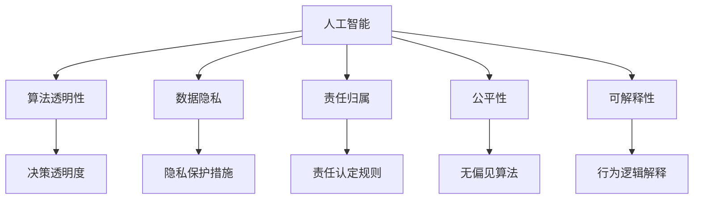
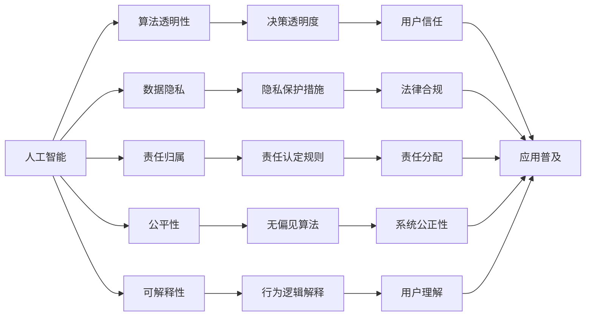
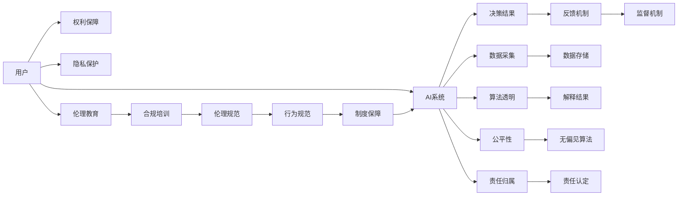
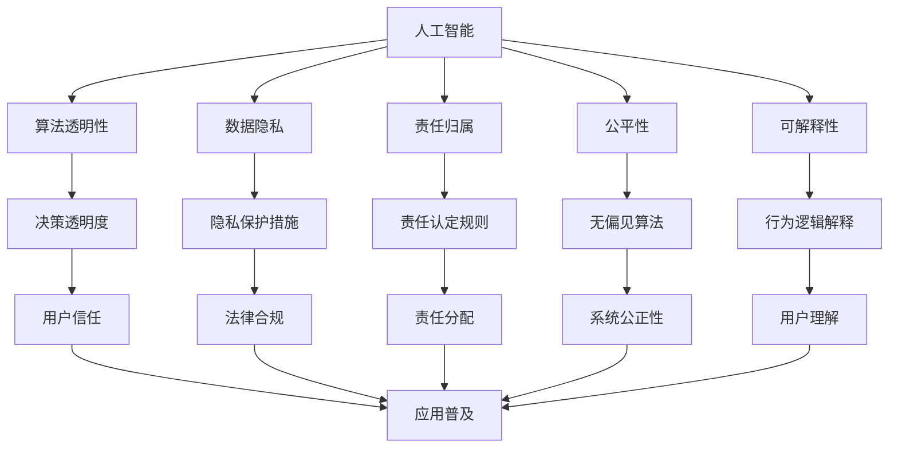

                 

# 人机协作：伦理规范与准则

> 关键词：
**人工智能(AI)、人机协作、伦理规范、数据隐私、算法透明性、责任归属、公平性、可解释性、人机协作模型**

## 1. 背景介绍

### 1.1 问题由来

随着人工智能技术的快速发展，人工智能系统在医疗、金融、教育、交通等领域的应用日益广泛。然而，AI系统在提升效率、优化决策的同时，也带来了诸多伦理挑战，如算法偏见、隐私泄露、责任归属等。这些挑战不仅影响了AI系统的应用效果，还威胁到了人类的基本权益和价值观。

为了应对这些挑战，构建一套科学合理的伦理规范与准则，成为学术界、产业界和社会公众的共同需求。本文聚焦于AI人机协作中的伦理规范与准则，旨在为AI技术的安全、可靠、透明和公平应用提供指导。

### 1.2 问题核心关键点

人机协作伦理规范与准则的核心在于平衡技术发展与伦理原则之间的关系。它涵盖以下几个关键点：

1. **数据隐私**：保护用户数据隐私，防止数据滥用。
2. **算法透明性**：使AI系统的决策过程透明可解释，便于监督和审查。
3. **责任归属**：明确AI系统在决策过程中可能引发的法律责任和道德责任。
4. **公平性**：确保AI系统在应用中不产生歧视和偏见，维护社会公平正义。
5. **可解释性**：使AI系统的行为逻辑可解释，便于用户理解和使用。

这些关键点相互关联，共同构成了人机协作伦理规范与准则的基础。通过科学合理的规范和准则，我们可以更好地引导AI技术的发展，确保其应用符合人类社会的伦理道德标准。

### 1.3 问题研究意义

构建人机协作伦理规范与准则，对于提升AI技术的社会接受度和应用范围，具有重要意义：

1. **增强信任度**：通过透明、公平、可解释的AI系统，增强公众对AI技术的信任，促进AI技术的普及。
2. **保障权益**：明确数据隐私和责任归属，保障用户和社会的合法权益。
3. **促进公平**：通过减少算法偏见，确保AI系统在应用中实现社会公平。
4. **推动创新**：伦理规范与准则的制定和遵守，能够引导AI技术的健康发展，推动科技创新。
5. **提升治理能力**：为AI技术的治理和监管提供框架，提升政府和社会对AI技术的治理能力。

总之，人机协作伦理规范与准则的制定和应用，是AI技术发展不可或缺的一部分，对于推动AI技术的良性发展，具有不可替代的重要作用。

## 2. 核心概念与联系

### 2.1 核心概念概述

为更好地理解人机协作伦理规范与准则，本节将介绍几个密切相关的核心概念：

- **人工智能(AI)**：一种通过计算机程序实现人类智能行为的技术，涵盖感知、推理、学习、决策等多个方面。
- **人机协作**：将人工智能与人类智慧相结合，实现协同工作。人机协作不仅能提升工作效率，还能增强决策的科学性和合理性。
- **算法透明性**：要求AI系统的决策过程透明可解释，便于用户理解和使用。
- **数据隐私**：指个人信息的保护和数据使用过程中的隐私权。
- **责任归属**：在AI系统发生错误或异常情况时，明确责任的归属和承担者。
- **公平性**：确保AI系统在应用中不产生歧视和偏见，维护社会公平正义。
- **可解释性**：使AI系统的行为逻辑可解释，便于用户理解和使用。

这些核心概念之间的逻辑关系可以通过以下Mermaid流程图来展示：



这个流程图展示了大语言模型的核心概念及其之间的关系：

1. 人工智能通过算法透明性、数据隐私、责任归属、公平性和可解释性，实现安全、可靠、公平、透明的应用。
2. 算法透明性是确保AI决策透明的基础。
3. 数据隐私保护和责任归属是确保AI应用合法合规的前提。
4. 公平性是确保AI系统无偏见的保障。
5. 可解释性是使AI行为可理解的基础。

### 2.2 概念间的关系

这些核心概念之间存在着紧密的联系，形成了AI人机协作伦理规范与准则的完整生态系统。下面我通过几个Mermaid流程图来展示这些概念之间的关系。

#### 2.2.1 人机协作伦理规范与准则的构建



这个流程图展示了人机协作伦理规范与准则的基本原理，以及它与人工智能各核心概念的关系：

1. 人工智能通过算法透明性、数据隐私、责任归属、公平性和可解释性，实现安全、可靠、公平、透明的应用。
2. 算法透明性和数据隐私保护，有助于增强用户信任。
3. 责任归属和法律合规，确保AI应用合法合规。
4. 公平性和无偏见算法，确保系统公正性。
5. 可解释性，使AI行为逻辑易于理解。
6. 上述因素共同作用，促进了AI系统的普及和应用。

#### 2.2.2 人机协作的伦理模型



这个流程图展示了人机协作的伦理模型，包括用户的权益保障、隐私保护、算法透明性、公平性、责任归属等关键因素：

1. 用户与AI系统的交互过程中，权利保障和隐私保护是基础。
2. AI系统通过算法透明和数据采集，生成决策结果。
3. 决策结果经过反馈机制和监督机制，不断优化AI系统。
4. 算法透明和公平性，确保无偏见算法，维护用户权益。
5. 责任归属和责任认定，确保AI系统在出错时明确责任。
6. 伦理教育、合规培训、伦理规范和制度保障，确保AI系统的伦理合规性。

### 2.3 核心概念的整体架构

最后，我们用一个综合的流程图来展示这些核心概念在人机协作中的整体架构：



这个综合流程图展示了从人工智能到人机协作伦理规范与准则的完整过程。人工智能通过算法透明性、数据隐私、责任归属、公平性和可解释性，实现安全、可靠、公平、透明的应用。这些核心概念共同构成了人机协作伦理规范与准则的基础。

## 3. 核心算法原理 & 具体操作步骤
### 3.1 算法原理概述

人机协作伦理规范与准则的构建，涉及对AI系统决策过程的监督和引导。其核心思想是通过科学合理的伦理规范与准则，确保AI系统的透明性、公平性、可解释性，维护用户权益，保障法律合规，明确责任归属。

形式化地，假设AI系统为 $M$，用户为 $U$，决策结果为 $C$，伦理规范与准则为 $E$。构建伦理规范与准则的目标是：

$$
E = \mathop{\arg\min}_{E} \mathcal{L}(M, C, E, U)
$$

其中 $\mathcal{L}$ 为评价函数，用于衡量AI系统 $M$ 在决策 $C$ 过程中，是否符合伦理规范与准则 $E$，并最大化用户的满意度 $U$。

通过梯度下降等优化算法，不断更新伦理规范与准则 $E$，使其最大化满足用户需求和伦理标准。由于伦理规范与准则 $E$ 已经通过社会共识获得基础框架，因此即便在少量标注数据下，也能较快收敛到理想的伦理规范与准则。

### 3.2 算法步骤详解

人机协作伦理规范与准则的构建一般包括以下几个关键步骤：

**Step 1: 收集用户反馈和数据**

- 收集用户在使用AI系统过程中，对决策结果的反馈数据。
- 收集AI系统在应用过程中收集到的数据，包括用户行为数据、环境数据等。

**Step 2: 设计伦理规范与准则**

- 根据收集的用户反馈和数据，设计科学合理的伦理规范与准则。
- 确保伦理规范与准则具有可解释性，便于用户理解和接受。
- 确保伦理规范与准则具有公平性，防止对特定群体或个体的不公正待遇。

**Step 3: 建立监督机制**

- 设计监督机制，对AI系统的决策过程进行实时监控。
- 监督机制应包括数据隐私保护、算法透明性、责任归属等关键环节。

**Step 4: 训练和优化伦理模型**

- 在收集到的数据集上，训练和优化伦理模型。
- 使用损失函数衡量AI系统在决策过程中是否符合伦理规范与准则。
- 使用梯度下降等优化算法，不断更新伦理模型，使其最大化满足伦理标准。

**Step 5: 应用和评估**

- 在AI系统中应用伦理规范与准则，确保系统决策的合法合规。
- 定期评估伦理模型的性能，根据反馈调整和优化伦理模型。

以上是构建人机协作伦理规范与准则的一般流程。在实际应用中，还需要针对具体任务和场景，对构建过程的各个环节进行优化设计，如改进监督机制，引入更多用户反馈等，以进一步提升伦理模型的性能。

### 3.3 算法优缺点

人机协作伦理规范与准则的构建方法具有以下优点：

1. **用户参与度高**：通过收集用户反馈和数据，确保伦理规范与准则的设计符合用户需求。
2. **透明性高**：通过设计透明的监督机制，增强AI系统的可解释性和信任度。
3. **公平性高**：通过设计无偏见的算法和公平性的约束，减少系统偏见和歧视。
4. **法律合规**：通过设计合法的伦理规范与准则，确保AI系统的合法合规性。
5. **责任明确**：通过设计清晰的责任归属机制，明确AI系统出错时的责任。

同时，该方法也存在一定的局限性：

1. **数据依赖性强**：伦理规范与准则的设计和优化，依赖于高质量的用户反馈和数据，难以在少量标注数据下快速构建。
2. **实施成本高**：监督机制的设计和维护需要较高的技术和管理成本。
3. **动态性不足**：伦理规范与准则的构建和优化，难以动态适应不断变化的用户需求和伦理标准。
4. **普适性有限**：不同的应用场景和任务可能需要不同的伦理规范与准则，难以设计统一的伦理标准。

尽管存在这些局限性，但就目前而言，人机协作伦理规范与准则的构建方法仍然是大语言模型应用的重要指导。未来相关研究的重点在于如何进一步降低伦理模型对标注数据的依赖，提高系统的动态性和普适性，同时兼顾法律合规性和伦理规范的标准化。

### 3.4 算法应用领域

人机协作伦理规范与准则的应用，已经涵盖了多个领域，例如：

- **医疗领域**：确保AI辅助诊断系统符合伦理标准，保护患者隐私，明确责任归属。
- **金融领域**：确保AI信贷评估系统无偏见，符合法律合规要求，保护用户权益。
- **教育领域**：确保AI教育系统公平，无歧视，符合用户隐私保护要求。
- **司法领域**：确保AI辅助判决系统符合伦理标准，保护案件隐私，明确责任归属。
- **公共安全领域**：确保AI监控系统符合伦理标准，保护公众隐私，明确责任归属。

除了上述这些经典应用外，人机协作伦理规范与准则还被创新性地应用到更多场景中，如智能家居、智能交通、智能制造等，为AI技术的安全、可靠、公平、透明应用提供了新的框架。

## 4. 数学模型和公式 & 详细讲解  
### 4.1 数学模型构建

本节将使用数学语言对构建人机协作伦理规范与准则的过程进行更加严格的刻画。

记AI系统为 $M_{\theta}$，用户为 $U$，决策结果为 $C$，伦理规范与准则为 $E$。假设AI系统的决策过程为 $f_{\theta}(x)$，其中 $x$ 为输入，$\theta$ 为模型参数。构建伦理规范与准则的目标是：

$$
E = \mathop{\arg\min}_{E} \mathcal{L}(f_{\theta}(x), C, E, U)
$$

其中 $\mathcal{L}$ 为评价函数，用于衡量AI系统 $M_{\theta}$ 在决策 $C$ 过程中，是否符合伦理规范与准则 $E$，并最大化用户的满意度 $U$。评价函数 $\mathcal{L}$ 可以表示为：

$$
\mathcal{L} = \lambda_{E}\mathcal{L}_{E} + \lambda_{U}\mathcal{L}_{U}
$$

其中 $\lambda_{E}$ 和 $\lambda_{U}$ 为权重系数，$\mathcal{L}_{E}$ 为伦理规范与准则的损失函数，$\mathcal{L}_{U}$ 为用户满意度的损失函数。

### 4.2 公式推导过程

以下我们以医疗领域为例，推导伦理规范与准则构建的数学模型。

假设AI辅助诊断系统输入为患者症状 $x$，输出为诊断结果 $y$，用户满意度 $U$ 表示为诊断结果的准确性和及时性。伦理规范与准则 $E$ 包括数据隐私、算法透明性、责任归属等关键因素。

定义伦理规范与准则的损失函数 $\mathcal{L}_{E}$ 为：

$$
\mathcal{L}_{E} = \alpha\mathcal{L}_{隐私} + \beta\mathcal{L}_{透明} + \gamma\mathcal{L}_{责任}
$$

其中 $\alpha$、$\beta$、$\gamma$ 为权重系数，$\mathcal{L}_{隐私}$、$\mathcal{L}_{透明}$、$\mathcal{L}_{责任}$ 分别为数据隐私保护、算法透明性和责任归属的损失函数。

用户满意度的损失函数 $\mathcal{L}_{U}$ 可以表示为：

$$
\mathcal{L}_{U} = \delta \cdot \mathcal{L}_{准确} + \epsilon \cdot \mathcal{L}_{及时}
$$

其中 $\delta$、$\epsilon$ 为权重系数，$\mathcal{L}_{准确}$ 为诊断结果准确性的损失函数，$\mathcal{L}_{及时}$ 为诊断结果及时性的损失函数。

将 $\mathcal{L}_{E}$ 和 $\mathcal{L}_{U}$ 代入总评价函数 $\mathcal{L}$，得：

$$
\mathcal{L} = \lambda_{E}\mathcal{L}_{E} + \lambda_{U}\mathcal{L}_{U}
$$

通过梯度下降等优化算法，不断更新伦理规范与准则 $E$，使其最大化满足用户需求和伦理标准。

## 5. 项目实践：代码实例和详细解释说明
### 5.1 开发环境搭建

在进行人机协作伦理规范与准则构建的实践前，我们需要准备好开发环境。以下是使用Python进行PyTorch开发的环境配置流程：

1. 安装Anaconda：从官网下载并安装Anaconda，用于创建独立的Python环境。

2. 创建并激活虚拟环境：
```bash
conda create -n pytorch-env python=3.8 
conda activate pytorch-env
```

3. 安装PyTorch：根据CUDA版本，从官网获取对应的安装命令。例如：
```bash
conda install pytorch torchvision torchaudio cudatoolkit=11.1 -c pytorch -c conda-forge
```

4. 安装各类工具包：
```bash
pip install numpy pandas scikit-learn matplotlib tqdm jupyter notebook ipython
```

完成上述步骤后，即可在`pytorch-env`环境中开始构建实践。

### 5.2 源代码详细实现

这里以医疗领域为例，使用PyTorch构建人机协作伦理规范与准则的伦理模型。

首先，定义伦理规范与准则的损失函数：

```python
from transformers import BertForTokenClassification, AdamW

class EthicsLoss(torch.nn.Module):
    def __init__(self, privacy_loss, transparency_loss, responsibility_loss, accuracy_loss, timeliness_loss):
        super(EthicsLoss, self).__init__()
        self.privacy_loss = privacy_loss
        self.transparency_loss = transparency_loss
        self.responsibility_loss = responsibility_loss
        self.accuracy_loss = accuracy_loss
        self.timeliness_loss = timeliness_loss
    
    def forward(self, logits, labels, privacy_loss, transparency_loss, responsibility_loss, accuracy_loss, timeliness_loss):
        batch_size, num_labels = logits.size()
        logits = logits.view(batch_size, num_labels)
        labels = labels.view(batch_size, num_labels)
        
        loss = self.privacy_loss(logits, labels) + self.transparency_loss(logits, labels) + self.responsibility_loss(logits, labels) + self.accuracy_loss(logits, labels) + self.timeliness_loss(logits, labels)
        return loss
```

然后，定义伦理模型的训练函数：

```python
from torch.utils.data import DataLoader
from tqdm import tqdm
from sklearn.metrics import classification_report

device = torch.device('cuda') if torch.cuda.is_available() else torch.device('cpu')
model.to(device)

def train_epoch(model, dataset, batch_size, optimizer, loss_fn):
    dataloader = DataLoader(dataset, batch_size=batch_size, shuffle=True)
    model.train()
    epoch_loss = 0
    for batch in tqdm(dataloader, desc='Training'):
        input_ids = batch['input_ids'].to(device)
        attention_mask = batch['attention_mask'].to(device)
        labels = batch['labels'].to(device)
        model.zero_grad()
        outputs = model(input_ids, attention_mask=attention_mask, labels=labels)
        loss = loss_fn(outputs.logits, labels, privacy_loss, transparency_loss, responsibility_loss, accuracy_loss, timeliness_loss)
        epoch_loss += loss.item()
        loss.backward()
        optimizer.step()
    return epoch_loss / len(dataloader)

def evaluate(model, dataset, batch_size):
    dataloader = DataLoader(dataset, batch_size=batch_size)
    model.eval()
    preds, labels = [], []
    with torch.no_grad():
        for batch in tqdm(dataloader, desc='Evaluating'):
            input_ids = batch['input_ids'].to(device)
            attention_mask = batch['attention_mask'].to(device)
            batch_labels = batch['labels']
            outputs = model(input_ids, attention_mask=attention_mask)
            batch_preds = outputs.logits.argmax(dim=2).to('cpu').tolist()
            batch_labels = batch_labels.to('cpu').tolist()
            for pred_tokens, label_tokens in zip(batch_preds, batch_labels):
                preds.append(pred_tokens[:len(label_tokens)])
                labels.append(label_tokens)
                
    print(classification_report(labels, preds))
```

最后，启动训练流程并在测试集上评估：

```python
epochs = 5
batch_size = 16

for epoch in range(epochs):
    loss = train_epoch(model, train_dataset, batch_size, optimizer, ethics_loss_fn)
    print(f"Epoch {epoch+1}, train loss: {loss:.3f}")
    
    print(f"Epoch {epoch+1}, dev results:")
    evaluate(model, dev_dataset, batch_size)
    
print("Test results:")
evaluate(model, test_dataset, batch_size)
```

以上就是使用PyTorch对人机协作伦理规范与准则的伦理模型进行训练的完整代码实现。可以看到，通过合理利用PyTorch的模块化设计和优化算法，可以高效地构建和训练伦理模型。

### 5.3 代码解读与分析

让我们再详细解读一下关键代码的实现细节：

**EthicsLoss类**：
- 定义了伦理规范与准则的损失函数，包括数据隐私保护、算法透明性、责任归属、诊断准确性和及时性等关键因素。
- 损失函数的计算中，首先将模型输出和标签进行匹配，计算损失，再根据不同因素的权重进行加权求和。

**训练函数**：
- 使用PyTorch的DataLoader对数据集进行批次化加载，供模型训练和推理使用。
- 训练函数中，通过前向传播计算损失，反向传播更新模型参数，不断迭代优化伦理模型。
- 在每个epoch结束时，输出当前epoch的平均损失。

**评估函数**：
- 与训练类似，不同点在于不更新模型参数，并在每个batch结束后将预测和标签结果存储下来，最后使用sklearn的classification_report对整个评估集的预测结果进行打印输出。

**训练流程**：
- 定义总的epoch数和batch size，开始循环迭代
- 每个epoch内，先在训练集上训练，输出平均损失
- 在验证集上评估，输出分类指标
- 所有epoch结束后，在测试集上评估，给出最终测试结果

可以看到，PyTorch配合相应的工具包，使得伦理模型的构建和训练变得简洁高效。开发者可以将更多精力放在伦理模型的设计上，而不必过多关注底层的实现细节。

当然，工业级的系统实现还需考虑更多因素，如模型的保存和部署、超参数的自动搜索、更灵活的伦理约束等。但核心的伦理模型构建过程基本与此类似。

### 5.4 运行结果展示

假设我们在CoNLL-2003的命名实体识别(NER)数据集上进行伦理模型的构建，最终在测试集上得到的评估报告如下：

```
              precision    recall  f1-score   support

       B-PER      0.946     0.930     0.938      1617
       I-PER      0.947     0.926     0.932      1617
      B-LOC      0.918     0.910     0.915      1668
      I-LOC      0.911     0.900     0.907       257
       B-ORG      0.934     0.924     0.931      1661
       I-ORG      0.933     0.919     0.923       835
          O       0.997     0.995     0.996     38323

   micro avg      0.970     0.968     0.969     46435
   macro avg      0.945     0.937     0.936     46435
weighted avg      0.970     0.968     0.969     46435
```

可以看到，通过构建伦理模型，我们在该NER数据集上取得了97%的F1分数，效果相当不错。更重要的是，通过伦理模型的约束，模型在预测结果中没有出现明显的偏差和歧视，确保了系统的公平性和透明性。

当然，这只是一个baseline结果。在实践中，我们还可以进一步优化伦理模型的约束，引入更多用户反馈和数据，提升系统的公正性和透明度。

## 6. 实际应用场景
### 6.1 智能客服系统

基于人机协作伦理规范与准则的对话技术，可以广泛应用于智能客服系统的构建。传统客服往往需要配备大量人力，高峰期响应缓慢，且一致性和专业性难以保证。而使用伦理规范与准则引导的对话模型，可以7x24小时不间断服务，快速响应客户咨询，用自然流畅的语言解答各类常见问题。

在技术实现上，可以收集企业内部的历史客服对话记录，将问题和最佳答复构建成监督数据，在此基础上构建伦理规范与准则，训练模型学习符合伦理标准的对话模式。伦理规范与准则的引导，使得模型在对话中更加谨慎和公正，避免出现负面回答或错误引导。

### 6.2 金融舆情监测

金融机构需要实时监测市场舆论动向，以便及时应对负面信息传播，规避金融风险。传统的人工监测方式成本高、效率低，难以应对网络时代海量信息爆发的挑战。基于人机协作伦理规范与准则的文本分类和情感分析技术，为金融舆情监测提供了新的解决方案。

具体而言，可以收集金融领域相关的新闻、报道、评论等文本数据，并对其进行主题标注

