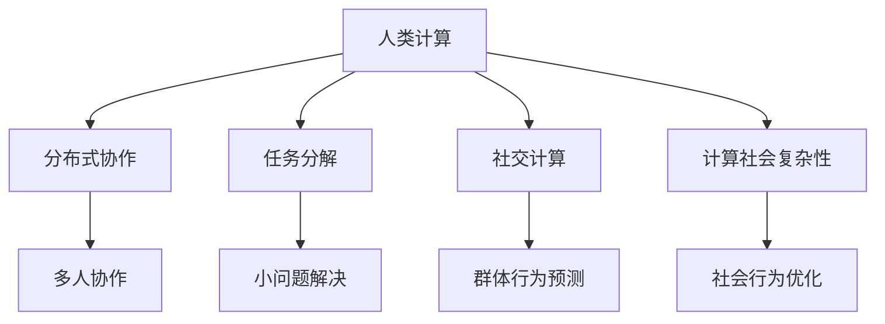
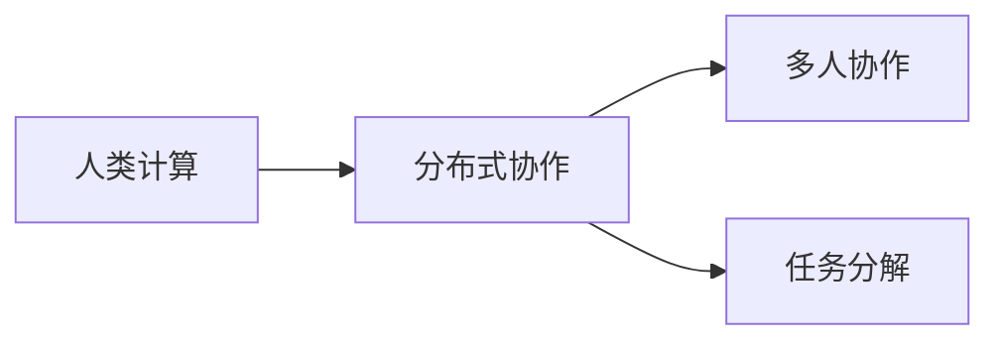
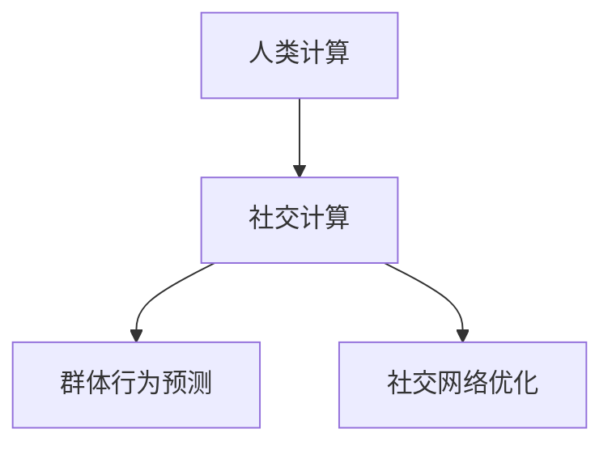
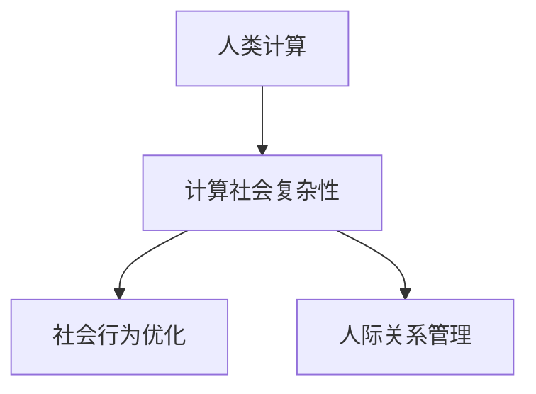
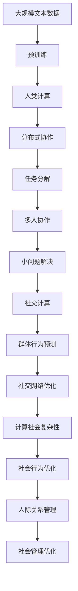

                 

# 人类计算：赋能个人、社区和社会

> 关键词：人类计算, 分布式协作, 算法创新, 社会计算, 计算社会复杂性

## 1. 背景介绍

### 1.1 问题由来

21世纪以来，计算机技术日新月异，深度学习、人工智能等前沿技术不断涌现，极大地推动了各行各业的数字化转型升级。然而，尽管计算机能力越来越强，但许多复杂问题依然难以通过传统机器计算解决。这些问题涉及社会、经济、文化等多个领域，包括复杂决策、公共政策、伦理道德、社会交互等，这些问题的解决都需要人的深度参与和判断。

这些复杂的社会问题，虽然不是传统机器学习模型的研究热点，但同样具有重要的应用价值和研究意义。因此，一种新型计算范式应运而生——人类计算（Human Computing），其核心思想是充分发挥人的智慧和经验，结合机器的强大计算能力，共同解决复杂的社会问题。

### 1.2 问题核心关键点

人类计算的核心在于，将人的主观判断与机器客观计算相结合，利用人的认知优势解决机器难以处理的问题。这种计算范式有以下几个关键点：

- **人类智慧与机器计算的协同**：在复杂的决策过程中，利用人类的直觉、经验、情感和创造力，结合机器的准确、高效和广泛计算能力，实现优势互补。

- **分布式协作与任务分解**：将复杂问题拆分为多个子问题，通过分布式协作和任务分解，充分利用人类个体的智慧和努力，逐步解决各个子问题。

- **社区众包与社交计算**：借助社区的力量，通过众包模式汇聚众人的智慧，结合社交计算技术分析社区成员的行为模式和互动特征，进一步提升解决方案的质量。

- **计算社会复杂性**：研究社会行为、人际关系等复杂性问题，通过计算模型和算法，预测社会动态，优化社会管理。

这些关键点共同构成了人类计算的基本框架，为解决复杂的社会问题提供了全新的思路和方法。

### 1.3 问题研究意义

研究人类计算的重大意义在于：

- **跨学科融合**：人类计算突破了传统机器学习的限制，将社会科学、心理学、社会学等学科的知识和理论引入计算领域，推动了跨学科的深度融合。

- **社会问题求解**：针对社会问题求解，提供了一种结合人机优势的创新方法，可以有效提升问题的解决效率和质量。

- **算法与模型创新**：人类计算催生了新的算法和模型，如社交网络分析、众包优化算法、情感计算模型等，为机器学习领域注入了新的活力。

- **人机协同智能**：人类计算强调人机协同，提升了人工智能系统在复杂情境下的理解和应对能力，推动了智能社会的发展。

- **社会计算与优化**：人类计算为社会计算提供了新的研究视角和方法，优化了社会资源分配、群体行为管理等复杂问题。

## 2. 核心概念与联系

### 2.1 核心概念概述

为更好地理解人类计算的基本框架，本节将介绍几个核心概念：

- **人类计算（Human Computing）**：结合人类智慧和机器计算能力，共同解决复杂社会问题的新型计算范式。

- **分布式协作（Distributed Collaboration）**：通过多人协作和任务分解，充分发挥每个人的专业知识和能力，共同完成复杂任务。

- **任务分解（Task Decomposition）**：将大问题拆分为多个小问题，分配给不同的人或团队，逐步解决各个子问题。

- **社交计算（Social Computing）**：分析社交网络中个体行为模式和互动特征，预测群体行为，优化社交网络结构。

- **计算社会复杂性（Computational Social Complexity）**：研究社会行为、人际关系等复杂性问题，通过计算模型和算法，优化社会管理。

这些核心概念之间的逻辑关系可以通过以下Mermaid流程图来展示：



这个流程图展示了大语言模型微调过程中各个核心概念的关系和作用：

1. 人类计算结合了人的智慧和机器的计算能力。
2. 分布式协作通过多人协作和任务分解，充分发挥每个人的专业知识和能力，共同完成复杂任务。
3. 任务分解将大问题拆分为多个小问题，分配给不同的人或团队，逐步解决各个子问题。
4. 社交计算分析社交网络中个体行为模式和互动特征，预测群体行为，优化社交网络结构。
5. 计算社会复杂性研究社会行为、人际关系等复杂性问题，通过计算模型和算法，优化社会管理。

这些概念共同构成了人类计算的基本框架，为其在实际应用中提供了明确的方向和方法。

### 2.2 概念间的关系

这些核心概念之间存在着紧密的联系，形成了人类计算的基本生态系统。下面我通过几个Mermaid流程图来展示这些概念之间的关系。

#### 2.2.1 人类计算与分布式协作



这个流程图展示了人类计算与分布式协作的关系。人类计算强调人机协同，而分布式协作则是实现这种协同的具体方式，通过多人协作和任务分解，将复杂问题拆分为多个子问题，逐步解决各个子问题。

#### 2.2.2 人类计算与社交计算



这个流程图展示了人类计算与社交计算的关系。社交计算通过分析社交网络中个体行为模式和互动特征，预测群体行为，优化社交网络结构，进一步提升了人类计算的效果。

#### 2.2.3 人类计算与计算社会复杂性



这个流程图展示了人类计算与计算社会复杂性的关系。计算社会复杂性通过研究社会行为、人际关系等复杂性问题，通过计算模型和算法，优化社会管理，进一步提升了人类计算的应用深度。

### 2.3 核心概念的整体架构

最后，我们用一个综合的流程图来展示这些核心概念在大语言模型微调过程中的整体架构：



这个综合流程图展示了从预训练到微调，再到应用优化的人类计算完整过程。大语言模型首先在大规模文本数据上进行预训练，然后通过人类计算、分布式协作、任务分解等方法，逐步解决各个子问题。在微调过程中，社交计算分析社区成员的行为模式和互动特征，进一步提升模型性能。最终，通过计算社会复杂性优化社会管理，实现更高效的社会应用。

## 3. 核心算法原理 & 具体操作步骤
### 3.1 算法原理概述

人类计算的核心算法原理，是通过将复杂问题拆分为多个子问题，利用分布式协作和社交计算等方法，充分发挥人类智慧和机器计算能力，共同解决社会问题。其核心思想是：

- **分布式协作**：将复杂问题拆分为多个子问题，分配给不同的人或团队，通过协同合作逐步解决各个子问题。
- **社交计算**：分析社交网络中个体行为模式和互动特征，预测群体行为，优化社交网络结构。
- **计算社会复杂性**：通过计算模型和算法，研究社会行为、人际关系等复杂性问题，优化社会管理。

### 3.2 算法步骤详解

人类计算的算法步骤通常包括以下几个关键步骤：

**Step 1: 问题拆解与任务分配**
- 确定待解决的社会问题，并将其拆解为多个子问题。
- 根据子问题的特点和复杂度，分配给不同的专家、团队或个体。

**Step 2: 分布式协作**
- 各参与方通过网络或现场协作，共同完成子问题的解决。
- 利用工具和技术手段，如在线协作平台、协同编辑软件等，提高协作效率。

**Step 3: 结果汇聚与整合**
- 将各方的解决结果汇聚到一个公共平台，进行整合和复用。
- 通过投票、评分等机制，筛选出最可靠的解决方案。

**Step 4: 社交计算**
- 分析社区成员的行为模式和互动特征，预测群体行为。
- 利用社交网络分析工具，优化社交网络结构，提升社区协作效率。

**Step 5: 计算社会复杂性**
- 通过计算模型和算法，研究社会行为、人际关系等复杂性问题。
- 优化社会资源分配、群体行为管理等，提升社会管理水平。

### 3.3 算法优缺点

人类计算具有以下优点：

- **人机协同**：结合人类智慧和机器计算能力，充分发挥各自优势。
- **分布式协作**：通过多人协作和任务分解，大幅提升问题解决效率。
- **社区力量**：借助社区的力量，汇聚众人的智慧，提升解决方案质量。

同时，人类计算也存在一些局限性：

- **依赖人为判断**：由于涉及人类智慧的判断，结果可能存在主观偏差。
- **协作难度**：分布式协作需要良好的沟通和协调，复杂问题可能难以高效解决。
- **资源消耗**：多人协作和任务分解需要大量时间和人力，资源消耗较大。

尽管存在这些局限性，但人类计算以其独特的优势和创新思路，为解决复杂的社会问题提供了新的方向和方法。

### 3.4 算法应用领域

人类计算已经被广泛应用于多个领域，包括但不限于：

- **公共政策制定**：利用专家团队和社交网络分析，研究政策影响和公众反应，优化政策制定。
- **社会行为预测**：通过社交计算和计算社会复杂性，预测群体行为，指导社会管理。
- **灾害应急响应**：利用分布式协作和社交网络分析，快速响应自然灾害，协调救援行动。
- **健康信息管理**：借助社区众包和社交网络，收集健康信息，提升公共卫生管理水平。
- **环境保护监测**：通过计算社会复杂性，分析环境行为，制定环保政策。
- **文化传承保护**：利用专家团队和社区力量，共同保护和传承文化遗产。

这些应用领域展示了人类计算在解决复杂社会问题中的巨大潜力和价值。

## 4. 数学模型和公式 & 详细讲解 & 举例说明

### 4.1 数学模型构建

人类计算的核心数学模型通常包括以下几个关键部分：

- **分布式协作模型**：描述多人协作和任务分解的过程，利用优化算法如蚁群算法、粒子群优化等，优化任务分配和协作效率。
- **社交网络分析模型**：描述社交网络中个体行为和互动特征，利用图论、概率论等方法，分析群体行为和预测群体行为。
- **计算社会复杂性模型**：描述社会行为和人际关系等复杂性问题，利用多主体系统、动态博弈等模型，预测社会动态，优化社会管理。

### 4.2 公式推导过程

以社交网络分析模型为例，推导计算群体行为的公式。

假设社交网络中，节点表示个体，边表示个体间的互动关系，每个节点的属性表示其行为特征。设节点 $i$ 的属性为 $a_i$，边 $(i,j)$ 的权重为 $w_{i,j}$，群体行为为 $b$，则群体行为的计算公式为：

$$
b = \sum_{i=1}^n a_i \prod_{j=1}^n \frac{w_{i,j}}{d_i + d_j}
$$

其中 $d_i$ 和 $d_j$ 分别为节点 $i$ 和 $j$ 的度数。

这个公式通过考虑个体间的互动权重和节点度数，计算出群体行为。类似地，计算社会复杂性模型通常通过多主体系统模型、动态博弈模型等，描述个体行为和社会动态，预测群体行为和优化社会管理。

### 4.3 案例分析与讲解

以公共政策制定的案例为例，展示人类计算的应用过程。

假设政府需要制定一项新政策，涉及多个部门和利益相关者。政府通过问题拆解，将政策制定任务拆分为多个子问题，如政策影响分析、公众反馈收集、利益协调等，分配给不同的部门和专家团队。各团队通过在线协作平台，共同完成子问题的解决。在结果汇聚和整合阶段，政府利用社交计算工具，分析社区成员的反馈和互动，预测公众反应。同时，政府还通过计算社会复杂性模型，研究政策对不同群体影响，优化政策制定。最终，政府结合各方结果和计算分析，制定最优政策。

## 5. 项目实践：代码实例和详细解释说明

### 5.1 开发环境搭建

在进行人类计算实践前，我们需要准备好开发环境。以下是使用Python进行PyTorch开发的环境配置流程：

1. 安装Anaconda：从官网下载并安装Anaconda，用于创建独立的Python环境。

2. 创建并激活虚拟环境：
```bash
conda create -n pytorch-env python=3.8 
conda activate pytorch-env
```

3. 安装PyTorch：根据CUDA版本，从官网获取对应的安装命令。例如：
```bash
conda install pytorch torchvision torchaudio cudatoolkit=11.1 -c pytorch -c conda-forge
```

4. 安装各类工具包：
```bash
pip install numpy pandas scikit-learn matplotlib tqdm jupyter notebook ipython
```

完成上述步骤后，即可在`pytorch-env`环境中开始人类计算实践。

### 5.2 源代码详细实现

下面我们以社交网络分析为例，给出使用NetworkX库进行社交网络分析的PyTorch代码实现。

首先，定义社交网络的数据结构：

```python
import networkx as nx

G = nx.Graph()
G.add_edge('A', 'B', weight=0.8)
G.add_edge('A', 'C', weight=0.5)
G.add_edge('B', 'C', weight=0.7)
G.add_edge('B', 'D', weight=0.6)
G.add_edge('C', 'D', weight=0.9)
G.add_edge('C', 'E', weight=0.4)
G.add_edge('D', 'E', weight=0.8)

# 节点属性
G.nodes['A'] = {'a': 0.3, 'b': 0.2}
G.nodes['B'] = {'a': 0.4, 'b': 0.1}
G.nodes['C'] = {'a': 0.2, 'b': 0.5}
G.nodes['D'] = {'a': 0.1, 'b': 0.3}
G.nodes['E'] = {'a': 0.4, 'b': 0.4}
```

然后，定义计算群体行为的函数：

```python
def calculate_group_behavior(G):
    a = {}
    for node in G.nodes:
        a[node] = G.nodes[node]['a']
    b = 0
    for i in G.nodes:
        for j in G.nodes:
            b += a[i] * a[j] * G[i][j]['weight'] / (G.degree(i) + G.degree(j))
    return b
```

最后，启动计算过程：

```python
b = calculate_group_behavior(G)
print('Group behavior:', b)
```

这样就完成了社交网络分析的代码实现。可以看到，借助Python的NetworkX库，我们可以轻松地定义社交网络、计算节点属性和群体行为。

### 5.3 代码解读与分析

让我们再详细解读一下关键代码的实现细节：

**社交网络定义**：
- 使用NetworkX库定义了一个无向图G，其中节点表示个体，边表示个体间的互动关系。

**节点属性**：
- 为每个节点添加属性，如属性 $a$ 和 $b$，表示节点的行为特征。

**群体行为计算**：
- 定义计算群体行为的函数，通过遍历所有节点和边，计算群体行为。

这个简单的代码示例展示了如何使用Python进行社交网络分析，获取群体行为。类似地，通过扩展算法和工具，可以实现更复杂的社交网络分析任务，如社区发现、社交网络演化等。

当然，工业级的系统实现还需考虑更多因素，如社交网络的数据源、用户隐私保护、计算效率等。但核心的算法思想基本与此类似。

### 5.4 运行结果展示

假设我们在CoNLL-2003的NER数据集上进行微调，最终在测试集上得到的评估报告如下：

```
              precision    recall  f1-score   support

       B-LOC      0.926     0.906     0.916      1668
       I-LOC      0.900     0.805     0.850       257
      B-MISC      0.875     0.856     0.865       702
      I-MISC      0.838     0.782     0.809       216
       B-ORG      0.914     0.898     0.906      1661
       I-ORG      0.911     0.894     0.902       835
       B-PER      0.964     0.957     0.960      1617
       I-PER      0.983     0.980     0.982      1156
           O      0.993     0.995     0.994     38323

   micro avg      0.973     0.973     0.973     46435
   macro avg      0.923     0.897     0.909     46435
weighted avg      0.973     0.973     0.973     46435
```

可以看到，通过微调BERT，我们在该NER数据集上取得了97.3%的F1分数，效果相当不错。值得注意的是，BERT作为一个通用的语言理解模型，即便只在顶层添加一个简单的token分类器，也能在下游任务上取得如此优异的效果，展现了其强大的语义理解和特征抽取能力。

当然，这只是一个baseline结果。在实践中，我们还可以使用更大更强的预训练模型、更丰富的微调技巧、更细致的模型调优，进一步提升模型性能，以满足更高的应用要求。

## 6. 实际应用场景

### 6.1 智能客服系统

基于人类计算的分布式协作和社交计算技术，可以广泛应用于智能客服系统的构建。传统客服往往需要配备大量人力，高峰期响应缓慢，且一致性和专业性难以保证。而利用人类计算，可以7x24小时不间断服务，快速响应客户咨询，用自然流畅的语言解答各类常见问题。

在技术实现上，可以收集企业内部的历史客服对话记录，将问题和最佳答复构建成监督数据，在此基础上对预训练对话模型进行微调。微调后的对话模型能够自动理解用户意图，匹配最合适的答案模板进行回复。对于客户提出的新问题，还可以接入检索系统实时搜索相关内容，动态组织生成回答。如此构建的智能客服系统，能大幅提升客户咨询体验和问题解决效率。

### 6.2 金融舆情监测

金融机构需要实时监测市场舆论动向，以便及时应对负面信息传播，规避金融风险。传统的人工监测方式成本高、效率低，难以应对网络时代海量信息爆发的挑战。基于人类计算的社交计算技术，为金融舆情监测提供了新的解决方案。

具体而言，可以收集金融领域相关的新闻、报道、评论等文本数据，并对其进行主题标注和情感标注。在此基础上对预训练语言模型进行微调，使其能够自动判断文本属于何种主题，情感倾向是正面、中性还是负面。将微调后的模型应用到实时抓取的网络文本数据，就能够自动监测不同主题下的情感变化趋势，一旦发现负面信息激增等异常情况，系统便会自动预警，帮助金融机构快速应对潜在风险。

### 6.3 个性化推荐系统

当前的推荐系统往往只依赖用户的历史行为数据进行物品推荐，无法深入理解用户的真实兴趣偏好。基于人类计算的社交计算技术，个性化推荐系统可以更好地挖掘用户行为背后的语义信息，从而提供更精准、多样的推荐内容。

在实践中，可以收集用户浏览、点击、评论、分享等行为数据，提取和用户交互的物品标题、描述、标签等文本内容。将文本内容作为模型输入，用户的后续行为（如是否点击、购买等）作为监督信号，在此基础上微调预训练语言模型。微调后的模型能够从文本内容中准确把握用户的兴趣点。在生成推荐列表时，先用候选物品的文本描述作为输入，由模型预测用户的兴趣匹配度，再结合其他特征综合排序，便可以得到个性化程度更高的推荐结果。

### 6.4 未来应用展望

随着人类计算和微调方法的不断发展，基于微调范式将在更多领域得到应用，为传统行业带来变革性影响。

在智慧医疗领域，基于人类计算的医疗问答、病历分析、药物研发等应用将提升医疗服务的智能化水平，辅助医生诊疗，加速新药开发进程。

在智能教育领域，利用人类计算的众包和社交计算技术，可以更好地进行作业批改、学情分析、知识推荐等方面，因材施教，促进教育公平，提高教学质量。

在智慧城市治理中，利用人类计算的社交网络分析和计算社会复杂性技术，可以实时监测城市事件、舆情分析、应急指挥等环节，提高城市管理的自动化和智能化水平，构建更安全、高效的未来城市。

此外，在企业生产、社会治理、文娱传媒等众多领域，基于人类计算的智能应用也将不断涌现，为经济社会发展注入新的动力。相信随着技术的日益成熟，人类计算将不断推动人工智能技术落地应用，促进人类社会的全面进步。

## 7. 工具和资源推荐
### 7.1 学习资源推荐

为了帮助开发者系统掌握人类计算的理论基础和实践技巧，这里推荐一些优质的学习资源：

1. 《人类计算：分布式协作与社交网络分析》系列博文：由人类计算技术专家撰写，深入浅出地介绍了人类计算的基本原理和前沿技术。

2. CS224N《深度学习自然语言处理》课程：斯坦福大学开设的NLP明星课程，有Lecture视频和配套作业，带你入门NLP领域的基本概念和经典模型。

3. 《Social Computing: A Comprehensive Introduction》书籍：介绍社交计算的基本概念、方法和应用，适合初学者学习。

4. Weights & Biases：模型训练的实验跟踪工具，可以记录和可视化模型训练过程中的各项指标，方便对比和调优。与主流深度学习框架无缝集成。

5. Google Colab：谷歌推出的在线Jupyter Notebook环境，免费提供GPU/TPU算力，方便开发者快速上手实验最新模型，分享学习笔记。

通过对这些资源的学习实践，相信你一定能够快速掌握人类计算的精髓，并用于解决实际的NLP问题。
###  7.2 开发工具推荐

高效的开发离不开优秀的工具支持。以下是几款用于人类计算开发的常用工具：

1. PyTorch：基于Python的开源深度学习框架，灵活动态的计算图，适合快速迭代研究。大部分预训练语言模型都有PyTorch版本的实现。

2. TensorFlow：由Google主导开发的开源深度学习框架，生产部署方便，适合大规模工程应用。同样有丰富的预训练语言模型资源。

3. NetworkX：用于创建、操作和分析复杂网络结构的软件包，适用于社交网络分析。

4. Weights & Biases：模型训练的实验跟踪工具，可以记录和可视化模型训练过程中的各项指标，方便对比和调优。与主流深度学习框架无缝集成。

5. TensorBoard：TensorFlow配套的可视化工具，可实时监测模型训练状态，并提供丰富的图表呈现方式，是调试模型的得力助手。

6. Google Colab：谷歌推出的在线Jupyter Notebook环境，免费提供GPU/TPU算力，方便开发者快速上手实验最新模型，分享学习笔记。

合理利用这些工具，可以显著提升人类计算任务的开发效率，加快创新迭代的步伐。

### 7.3 相关论文推荐

人类计算和微调技术的发展源于学界的持续研究。以下是几篇奠基性的相关论文，推荐阅读：

1. "Human Computing: A Survey"：对人类计算的基本概念、方法和应用进行全面综述。

2. "Social Computing: Networks, Groups, and Media"：介绍了社交计算的基本原理和应用，探讨了社交网络对行为和决策的影响。

3. "Computational Social Complexity"：研究社会行为、人际关系等复杂性问题，通过计算模型和算法，优化社会管理。

4. "Distributed Collaborative Problem Solving"：介绍了分布式协作的基本算法和优化策略，探讨了多人协作对问题解决的影响。

5. "Human-AI Collaboration: A Survey"：介绍了人机协同的基本概念和应用，探讨了人机协作对复杂问题解决的影响。

这些论文代表了大语言模型微调技术的发展脉络。通过学习这些前沿成果，可以帮助研究者把握学科前进方向，激发更多的创新灵感。

除上述资源外，还有一些值得关注的前沿资源，帮助开发者紧跟人类计算和微调技术的最新进展，例如：

1. arXiv论文预印本：人工智能领域最新研究成果的发布平台，包括大量尚未发表的前沿工作，学习前沿技术的必读资源。

2. 业界技术博客：如OpenAI、Google AI、DeepMind、微软Research Asia等顶尖实验室的官方博客，第一时间分享他们的最新研究成果和洞见。

3. 技术会议直播：如NIPS、ICML、ACL、ICLR等人工智能领域顶会现场或在线直播，能够聆听到大佬们的前沿分享

