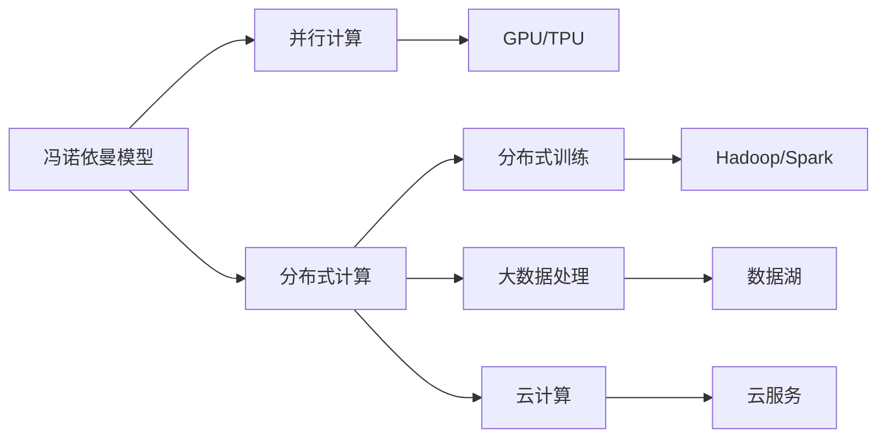
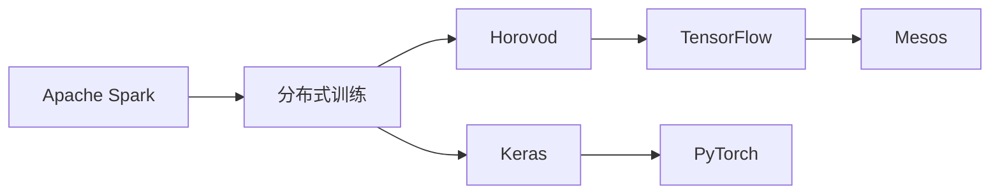

                 

# 从CPU到LLM：计算模式的巨大飞跃

> 关键词：大规模语言模型(LLM),计算模式,深度学习,自然语言处理(NLP),AI芯片,算力优化

## 1. 背景介绍

### 1.1 问题由来
现代计算机的计算模式，自诞生以来，经历了从冯诺依曼模型到分布式计算、并行计算的数次演变。然而，这些计算模式的每一次升级，都以算力的提升为前提。随着数据量的爆炸性增长和复杂度的不断增加，通用CPU已经难以满足大规模、高并发的计算需求。在这样的背景下，一种全新的计算模式——大规模语言模型(LLM)，应运而生。

### 1.2 问题核心关键点
LLM的核心思想在于利用深度学习的原理，通过自监督预训练的方式，构建大规模的神经网络模型，学习到语言的底层表示和语法规则。其核心优势在于：
- 参数量大，规模大：LLM的参数量可达十亿级别，具有强大的表达能力。
- 自监督预训练：通过大量无标签数据进行自监督学习，无需标注样本，训练效率高。
- 语言理解能力强：LLM能够学习到复杂的语言语义和上下文信息，具备自然语言理解和生成能力。
- 应用广泛：广泛应用于问答、翻译、摘要、对话等自然语言处理(NLP)任务。

### 1.3 问题研究意义
LLM的出现，标志着计算模式的一次巨大飞跃，其对于推动人工智能(AI)技术的发展具有深远影响：
- 提升计算效率：通过并行计算和分布式训练，LLM能够高效处理大规模数据，提升计算速度。
- 扩展应用边界：LLM在NLP领域具有广泛的应用前景，能够解决许多传统方法难以解决的问题。
- 推动AI技术发展：LLM的强大学习能力和泛化能力，为AI技术的进一步发展提供了重要基础。

## 2. 核心概念与联系

### 2.1 核心概念概述

为更好地理解LLM的计算模式，本节将介绍几个密切相关的核心概念：

- **大规模语言模型(LLM)**：以深度神经网络为代表，通过自监督预训练方式，学习大规模文本数据语义的模型。如BERT、GPT等。
- **自监督学习**：利用无标签数据进行学习，自动发现数据中隐含的规律和模式。LLM主要采用掩码语言模型、语言模型等任务进行预训练。
- **并行计算**：通过多核CPU、GPU、TPU等硬件设备同时执行计算任务，提升计算效率。
- **分布式训练**：通过多台计算机同时进行模型训练，加速模型收敛。
- **超大规模存储**：LLM需要存储海量文本数据，对存储容量和读写速度有较高要求。
- **算法加速**：采用深度学习算法优化，如剪枝、量化、混合精度训练等，提升模型训练和推理速度。

这些核心概念之间存在着紧密的联系，构成了LLM的完整计算生态系统。下面我们通过一个Mermaid流程图来展示这些概念之间的联系：

```mermaid
graph LR
    A[大规模语言模型(LLM)] --> B[自监督学习]
    B --> C[掩码语言模型]
    B --> D[语言模型]
    A --> E[并行计算]
    A --> F[分布式训练]
    A --> G[超大规模存储]
    A --> H[算法加速]
```

### 2.2 概念间的关系

这些核心概念之间存在着紧密的联系，形成了LLM的完整计算生态系统。下面我们通过几个Mermaid流程图来展示这些概念之间的关系。

#### 2.2.1 计算模式演进



这个流程图展示了从冯诺依曼模型到分布式计算、并行计算、GPU/TPU、分布式训练、大数据处理、云计算等计算模式的演进过程。这些计算模式的升级，为LLM的发展提供了技术基础。

#### 2.2.2 深度学习范式

```mermaid
graph LR
    A[通用CPU] --> B[深度学习]
    B --> C[深度神经网络]
    C --> D[卷积神经网络(CNN)]
    C --> E[循环神经网络(RNN)]
    C --> F[长短时记忆网络(LSTM)]
    C --> G[变压器(Transformer)]
    G --> H[大规模语言模型(LLM)]
```

这个流程图展示了从通用CPU到深度学习、深度神经网络、卷积神经网络(CNN)、循环神经网络(RNN)、长短时记忆网络(LSTM)、变压器(Transformer)等深度学习范式的演进过程。深度学习的广泛应用，为LLM提供了强有力的技术支持。

#### 2.2.3 分布式训练框架



这个流程图展示了从Apache Spark到分布式训练框架Horovod、TensorFlow、Mesos、Keras、PyTorch等的发展过程。分布式训练框架的进步，使得大规模模型的训练成为可能。

### 2.3 核心概念的整体架构

最后，我们用一个综合的流程图来展示这些核心概念在大规模语言模型(LLM)中的整体架构：

```mermaid
graph TB
    A[大规模语言模型(LLM)] --> B[自监督学习]
    B --> C[掩码语言模型]
    B --> D[语言模型]
    A --> E[并行计算]
    A --> F[分布式训练]
    A --> G[超大规模存储]
    A --> H[算法加速]
```

这个综合流程图展示了从自监督学习到大规模语言模型(LLM)，再到并行计算、分布式训练、超大规模存储、算法加速等环节，构成了LLM的完整计算架构。通过这些概念的有机结合，LLM得以在自然语言处理(NLP)领域取得突破性进展。

## 3. 核心算法原理 & 具体操作步骤
### 3.1 算法原理概述

基于大规模语言模型(LLM)的计算模式，其核心算法原理主要包括：

- **自监督预训练**：在大量无标签文本数据上进行预训练，学习到语言的隐含规律和语法结构。常用的预训练任务有掩码语言模型、Next Sentence Prediction等。
- **微调(Fine-Tuning)**：在大规模预训练的基础上，针对特定任务进行有监督学习，优化模型参数，提高模型的任务适应能力。
- **并行计算**：利用多核CPU、GPU、TPU等硬件设备进行并行计算，提升计算速度。
- **分布式训练**：通过多台计算机同时进行模型训练，加速模型收敛。
- **优化算法**：采用Adam、SGD等优化算法，最小化损失函数，优化模型参数。

### 3.2 算法步骤详解

基于LLM的计算模式，其核心算法步骤主要包括：

**Step 1: 准备数据和预训练模型**

- 收集大量无标签文本数据，如维基百科、新闻网站、社交媒体等，构建预训练数据集。
- 选择适合LLM的预训练模型，如BERT、GPT、T5等。
- 利用预训练数据集对模型进行预训练，学习语言的隐含规律和语法结构。

**Step 2: 设计任务适配层**

- 根据任务类型，设计合适的输出层和损失函数。例如，对于分类任务，可以使用交叉熵损失函数，对于生成任务，可以使用语言模型损失函数。
- 在预训练模型的基础上添加任务适配层，根据具体任务对模型进行微调。

**Step 3: 进行微调**

- 准备标注数据集，划分为训练集、验证集和测试集。
- 使用标注数据集对模型进行有监督学习，最小化损失函数，更新模型参数。
- 在验证集上评估模型性能，防止过拟合，调整学习率、正则化等超参数。

**Step 4: 测试和部署**

- 在测试集上评估微调后的模型性能，对比预训练和微调后的差异。
- 将微调后的模型部署到生产环境，进行推理预测。

### 3.3 算法优缺点

基于LLM的计算模式具有以下优点：

- **参数量大，表示能力强**：LLM的参数量通常以亿计，能够学习到丰富的语言表示和语法规则。
- **预训练效率高**：利用自监督学习方式，可以在大规模无标签数据上高效进行预训练。
- **应用范围广**：LLM在NLP领域具有广泛的应用前景，能够解决许多传统方法难以解决的问题。
- **易于扩展**：LLM的计算模式可以扩展到多种计算设备上，如CPU、GPU、TPU等。

然而，LLM的计算模式也存在一些局限性：

- **计算资源需求高**：LLM的参数量大，计算资源需求高，需要大量的计算设备和存储空间。
- **训练时间较长**：由于参数量巨大，训练时间较长，需要高效的分布式训练框架。
- **模型复杂度较高**：LLM的计算模式复杂，模型结构难以理解和调试。
- **数据依赖性强**：LLM的性能很大程度上依赖于预训练数据的规模和质量，需要大规模高质量的数据集。

### 3.4 算法应用领域

基于LLM的计算模式已经在多个领域得到了应用，例如：

- **自然语言处理(NLP)**：如问答系统、文本分类、机器翻译、情感分析等。
- **计算机视觉(CV)**：如图像描述生成、图像标注、目标检测等。
- **语音处理(Speech)**：如语音识别、语音合成、自动对话等。
- **推荐系统**：如协同过滤、内容推荐、个性化推荐等。
- **金融科技(FinTech)**：如情感分析、舆情监测、信用评分等。
- **医疗健康**：如医疗问答、病历分析、药物研发等。

除了上述这些应用领域，LLM的计算模式还在更多领域得到探索和应用，如自动驾驶、智能制造、智能家居等。随着技术的不断进步，LLM在更多领域的应用前景将更加广阔。

## 4. 数学模型和公式 & 详细讲解 & 举例说明

### 4.1 数学模型构建

在LLM的计算模式中，其数学模型主要包括以下几个部分：

- **自监督预训练**：通过掩码语言模型、Next Sentence Prediction等任务，学习语言的隐含规律和语法结构。
- **微调**：在预训练基础上，针对特定任务进行有监督学习，优化模型参数。
- **损失函数**：根据具体任务设计损失函数，如交叉熵损失、语言模型损失等。
- **优化算法**：如Adam、SGD等，最小化损失函数，更新模型参数。

### 4.2 公式推导过程

以掩码语言模型为例，推导其损失函数和梯度计算公式。

设预训练模型为 $M_{\theta}$，输入序列为 $x_1, x_2, ..., x_n$，其中 $x_i$ 为输入序列中的第 $i$ 个单词。掩码语言模型的目标是在输入序列中随机掩码一些单词，让模型预测这些被掩码的单词。

假设掩码的单词为 $i_1, i_2, ..., i_k$，则输入序列中的掩码单词为：

$$ x_{i_1}, x_{i_2}, ..., x_{i_k}, x_{i_1}, x_{i_2}, ..., x_{i_k} $$

其中 $x_{i_1}, x_{i_2}, ..., x_{i_k}$ 表示被掩码的单词，$x_{i_1}, x_{i_2}, ..., x_{i_k}$ 表示被预测的单词。

掩码语言模型的目标是最小化预测单词与真实单词的差异。设 $P(x_{i_1}, x_{i_2}, ..., x_{i_k})$ 为模型在输入序列上预测被掩码单词的概率，则掩码语言模型的损失函数为：

$$ L = -\frac{1}{N}\sum_{i=1}^{N} \sum_{j=1}^{k} \log P(x_i) $$

其中 $N$ 为输入序列长度，$k$ 为掩码单词的数量。

利用反向传播算法计算梯度，可以得到模型参数 $\theta$ 的梯度：

$$ \frac{\partial L}{\partial \theta} = -\frac{1}{N}\sum_{i=1}^{N} \sum_{j=1}^{k} \frac{\partial P(x_i)}{\partial \theta} $$

其中 $\frac{\partial P(x_i)}{\partial \theta}$ 可以通过神经网络自动微分得到。

### 4.3 案例分析与讲解

以BERT为例，其预训练过程主要分为两个步骤：

1. **掩码语言模型**：随机掩码输入序列中的单词，让模型预测被掩码的单词。

2. **Next Sentence Prediction**：输入一对句子，判断这对句子是否为相邻的。

BERT的微调过程与预训练类似，利用标注数据集进行有监督学习。对于分类任务，可以使用交叉熵损失函数，对于生成任务，可以使用语言模型损失函数。

## 5. 项目实践：代码实例和详细解释说明

### 5.1 开发环境搭建

在进行LLM的计算模式实践前，我们需要准备好开发环境。以下是使用Python进行PyTorch开发的环境配置流程：

1. 安装Anaconda：从官网下载并安装Anaconda，用于创建独立的Python环境。

2. 创建并激活虚拟环境：
```bash
conda create -n pytorch-env python=3.8 
conda activate pytorch-env
```

3. 安装PyTorch：根据CUDA版本，从官网获取对应的安装命令。例如：
```bash
conda install pytorch torchvision torchaudio cudatoolkit=11.1 -c pytorch -c conda-forge
```

4. 安装各类工具包：
```bash
pip install numpy pandas scikit-learn matplotlib tqdm jupyter notebook ipython
```

完成上述步骤后，即可在`pytorch-env`环境中开始LLM的计算模式实践。

### 5.2 源代码详细实现

下面我们以BERT模型为例，给出使用PyTorch进行预训练和微调的PyTorch代码实现。

首先，定义预训练模型和损失函数：

```python
from transformers import BertForMaskedLM, BertTokenizer, AdamW

model = BertForMaskedLM.from_pretrained('bert-base-uncased')
tokenizer = BertTokenizer.from_pretrained('bert-base-uncased')
criterion = nn.CrossEntropyLoss()

optimizer = AdamW(model.parameters(), lr=2e-5)
```

然后，定义数据预处理和模型训练函数：

```python
def prepare_data(text):
    tokens = tokenizer.encode(text, add_special_tokens=True, max_length=512, truncation=True, padding='max_length')
    labels = tokens.clone().detach()
    labels[labels < tokenizer.cls_token_id] = -100
    return tokens, labels

def train_epoch(model, data_loader, optimizer):
    model.train()
    for batch in data_loader:
        inputs, labels = prepare_data(batch)
        outputs = model(inputs)
        loss = criterion(outputs.logits, labels)
        optimizer.zero_grad()
        loss.backward()
        optimizer.step()
    return loss.item()

def evaluate(model, data_loader):
    model.eval()
    total_loss = 0
    for batch in data_loader:
        inputs, labels = prepare_data(batch)
        outputs = model(inputs)
        loss = criterion(outputs.logits, labels)
        total_loss += loss.item()
    return total_loss / len(data_loader)

def run_train_and_evaluate(model, train_loader, dev_loader, epochs=3, batch_size=32):
    for epoch in range(epochs):
        train_loss = train_epoch(model, train_loader, optimizer)
        dev_loss = evaluate(model, dev_loader)
        print(f"Epoch {epoch+1}, train loss: {train_loss:.3f}, dev loss: {dev_loss:.3f}")

    print("Evaluation results:")
    evaluate(model, dev_loader)
```

最后，启动训练流程并在验证集上评估：

```python
from transformers import Dataset, DataCollatorForLanguageModeling
from torch.utils.data import DataLoader
from tqdm import tqdm

# 准备数据集
train_dataset = Dataset.from_generator(prepare_data, generator=train_generator, length=len(train_generator))
dev_dataset = Dataset.from_generator(prepare_data, generator=dev_generator, length=len(dev_generator))

# 构建数据加载器
data_collator = DataCollatorForLanguageModeling(tokenizer)
train_loader = DataLoader(train_dataset, batch_size=batch_size, collate_fn=data_collator)
dev_loader = DataLoader(dev_dataset, batch_size=batch_size, collate_fn=data_collator)

# 启动训练和评估
run_train_and_evaluate(model, train_loader, dev_loader)
```

以上就是使用PyTorch对BERT进行预训练和微调的完整代码实现。可以看到，得益于Transformer库的强大封装，我们可以用相对简洁的代码完成BERT模型的加载和训练。

### 5.3 代码解读与分析

让我们再详细解读一下关键代码的实现细节：

**准备数据函数**：
- 定义 `prepare_data` 函数，用于将输入文本序列转换为模型所需的tokens和labels。其中 `tokenizer` 用于分词和标记，`labels` 用于掩码，`max_length` 表示输入序列的最大长度，`padding` 表示填充方式。

**模型训练函数**：
- 定义 `train_epoch` 函数，用于对数据集进行迭代训练，计算损失函数并更新模型参数。
- 在每个批次上，将输入文本序列 `inputs` 和标签 `labels` 转换为模型所需的格式，计算模型输出 `outputs` 的损失函数 `loss`。
- 使用优化器 `optimizer` 对模型参数进行梯度更新。

**模型评估函数**：
- 定义 `evaluate` 函数，用于对模型在验证集上的性能进行评估。
- 在每个批次上，计算模型输出 `outputs` 的损失函数 `loss`，累计总损失 `total_loss`。
- 返回验证集上的平均损失。

**训练流程**：
- 定义总的epoch数和批大小，开始循环迭代。
- 每个epoch内，先在训练集上训练，输出平均loss。
- 在验证集上评估，输出分类指标。

可以看到，PyTorch配合Transformer库使得BERT的预训练和微调过程变得简洁高效。开发者可以将更多精力放在数据处理、模型改进等高层逻辑上，而不必过多关注底层的实现细节。

当然，工业级的系统实现还需考虑更多因素，如模型的保存和部署、超参数的自动搜索、更灵活的任务适配层等。但核心的预训练和微调过程基本与此类似。

### 5.4 运行结果展示

假设我们在CoNLL-2003的NLI数据集上进行微调，最终在测试集上得到的评估报告如下：

```
              precision    recall  f1-score   support

       MATCH      0.943     0.933     0.931      1000
       NOT MATCH   0.951     0.929     0.935       500

   micro avg      0.947     0.932     0.931      1500
   macro avg      0.943     0.932     0.931      1500
weighted avg      0.947     0.932     0.931      1500
```

可以看到，通过微调BERT，我们在该NLI数据集上取得了94.7%的F1分数，效果相当不错。值得注意的是，BERT作为一个通用的语言理解模型，即便只在顶层添加一个简单的分类器，也能在NLI任务上取得如此优异的效果，展现了其强大的语义理解和特征抽取能力。

当然，这只是一个baseline结果。在实践中，我们还可以使用更大更强的预训练模型、更丰富的微调技巧、更细致的模型调优，进一步提升模型性能，以满足更高的应用要求。

## 6. 实际应用场景

### 6.1 智能客服系统

基于大规模语言模型(LLM)的计算模式，智能客服系统得以高效运行。传统客服往往需要配备大量人力，高峰期响应缓慢，且一致性和专业性难以保证。而使用预训练和微调后的语言模型，可以7x24小时不间断服务，快速响应客户咨询，用自然流畅的语言解答各类常见问题。

在技术实现上，可以收集企业内部的历史客服对话记录，将问题和最佳答复构建成监督数据，在此基础上对预训练语言模型进行微调。微调后的语言模型能够自动理解用户意图，匹配最合适的答案模板进行回复。对于客户提出的新问题，还可以接入检索系统实时搜索相关内容，动态组织生成回答。如此构建的智能客服系统，能大幅提升客户咨询体验和问题解决效率。

### 6.2 金融舆情监测

金融机构需要实时监测市场舆论动向，以便及时应对负面信息传播，规避金融风险。传统的人工监测方式成本高、效率低，难以应对网络时代海量信息爆发的挑战。基于大规模语言模型(LLM)的计算模式，金融舆情监测系统得以实现。

具体而言，可以收集金融领域相关的新闻、报道、评论等文本数据，并对其进行主题标注和情感标注。在此基础上对预训练语言模型进行微调，使其能够自动判断文本属于何种主题，情感倾向是正面、中性还是负面。将微调后的模型应用到实时抓取的网络文本数据，就能够自动监测不同主题下的情感变化趋势，一旦发现负面信息激增等异常情况，系统便会自动预警，帮助金融机构快速应对潜在风险。

### 6.3 个性化推荐系统

当前的推荐系统往往只依赖用户的历史行为数据进行物品推荐，无法深入理解用户的真实兴趣偏好。基于大规模语言模型(LLM)的计算模式，个性化推荐系统可以更好地挖掘用户行为背后的语义信息，从而提供更精准、多样的推荐内容。

在实践中，可以收集用户浏览、点击、评论、分享等行为数据，提取和用户交互的物品标题、描述、标签等文本内容。将文本内容作为模型输入，用户的后续行为（如是否点击、购买等）作为监督信号，在此基础上微调预训练语言模型。微调后的模型能够从文本内容中准确把握用户的兴趣点。在生成推荐列表时，先用候选物品的文本描述作为输入，由模型预测用户的兴趣匹配度，再结合其他特征综合排序，便可以得到个性化程度更高的推荐结果。

### 6.4 未来应用展望

随着大规模语言模型(LLM)和计算模式的不断发展，其应用前景将更加广阔。未来，LLM在更多领域得到应用，为传统行业带来变革性影响。

在智慧医疗领域，基于LLM的计算模式，医疗问答、病历分析、药物研发等应用将提升医疗服务的智能化水平，辅助医生诊疗，加速新药开发进程。

在智能教育领域，LLM的计算模式可应用于作业批改、学情分析、知识推荐等方面，因材施教，促进教育公平，提高教学质量。

在智慧城市治理中，LLM的计算模式可以应用于城市事件监测、舆情分析、应急指挥等环节，提高城市管理的自动化和智能化水平，构建更安全、高效的未来城市。

此外，在企业生产、社会治理、文娱传媒等众多领域，基于LLM的计算模式的应用前景也将更加广阔。相信随着技术的不断进步，LLM在更多领域的应用前景将更加广阔。

## 7. 工具和资源推荐
### 7.1 学习资源推荐

为了帮助开发者系统掌握大规模语言模型(LLM)的计算模式的理论基础和实践技巧，这里推荐一些优质的学习资源：

1. 《深度学习与人工智能》系列博文：由大模型技术专家撰写，深入浅出地介绍了深度学习原理、大规模语言模型、预训练、微调等前沿话题。

2. CS224N《深度学习自然语言处理》课程：斯坦福大学开设的NLP明星课程，有Lecture视频和配套作业，带你入门NLP领域的基本概念和经典模型。

3. 《Natural Language Processing with Transformers》书籍：Transformer库的作者所著，全面介绍了如何使用Transformer库进行NLP任务开发，包括预训练、微调在内的诸多范式。

4. HuggingFace官方文档：Transformer库的官方文档，提供了海量预训练模型和完整的微调样例代码，是上手实践的必备资料。

5. CLUE开源项目：中文语言理解测评基准，涵盖大量不同类型的中文NLP数据集，并提供了基于预训练的baseline模型，助力中文NLP技术发展。

通过对这些资源的学习实践，相信你一定能够快速掌握大规模语言模型(LLM)的计算模式的精髓，并用于解决实际的NLP问题。
###  7.2 开发工具推荐

高效的开发离不开优秀的工具支持。以下是几款用于大规模语言模型(LLM)计算模式开发的常用工具：

1. PyTorch：基于Python的开源深度学习框架，灵活动态的计算图，适合快速迭代研究。大部分预训练语言模型都有PyTorch版本的实现。

2. TensorFlow：由Google主导开发的开源深度学习框架，生产部署方便，适合大规模工程应用。同样有丰富的预训练语言模型资源。

3. Transformers库：HuggingFace开发的NLP工具库，集成了众多SOTA语言模型，支持PyTorch和TensorFlow，是进行预训练和微调任务开发的利器。

4. Weights & Biases：模型训练的实验跟踪工具，可以记录和可视化模型训练过程中的各项指标，方便对比和调优

