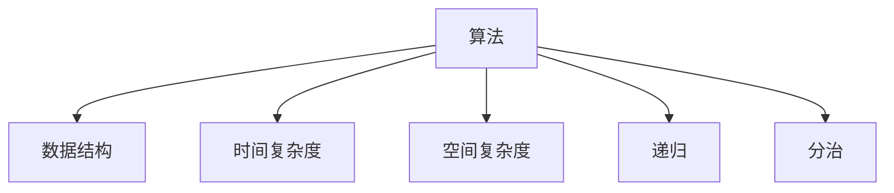
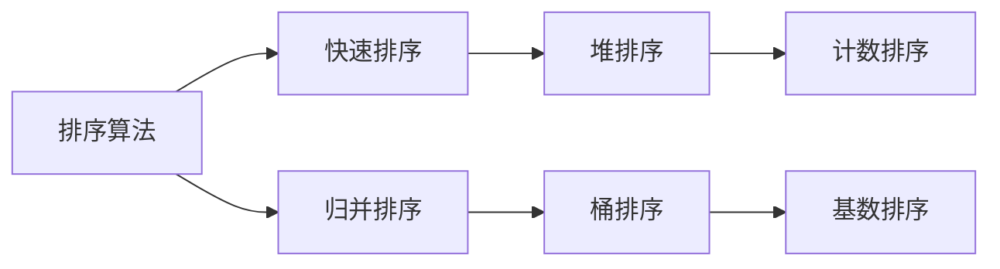
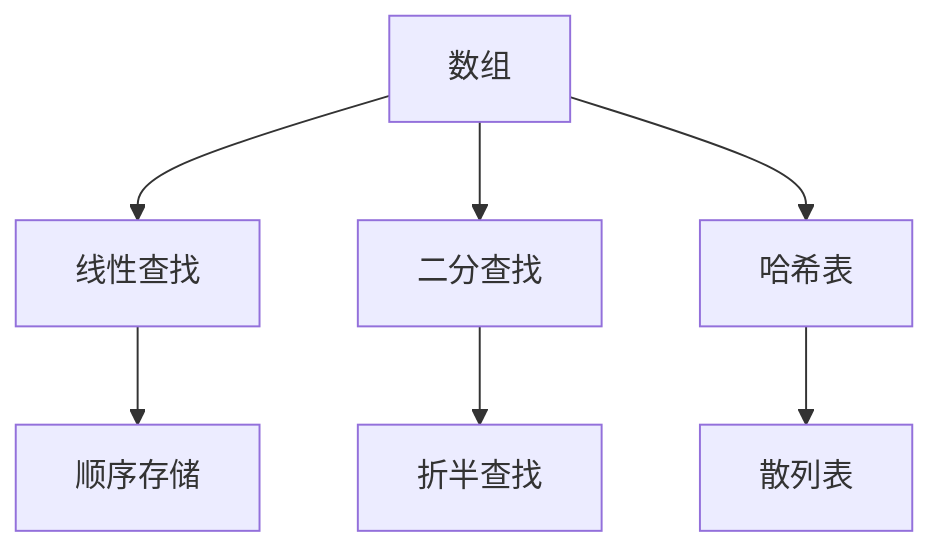
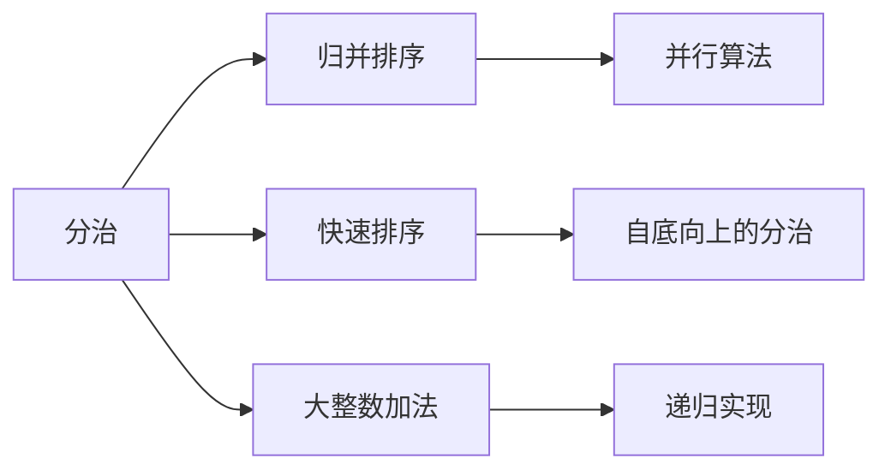
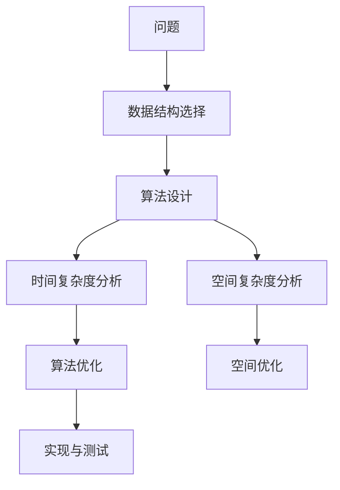

                 

# 从经典开始：奠定基础认知

> 关键词：经典算法,基础认知,编程范式,计算复杂度,算法分析,应用场景

## 1. 背景介绍

### 1.1 问题由来

在计算机科学的百年历史中，涌现出了许多经典算法。这些算法不仅在理论研究上有着重要意义，还在实际应用中发挥着不可替代的作用。深入理解经典算法的原理和思想，对于编程者而言至关重要。本文将介绍几种经典算法，探讨它们的原理和应用，为编程者提供基础认知。

### 1.2 问题核心关键点

- **经典算法**：包括排序、查找、图算法、字符串处理等常见算法，它们在计算机科学中有着广泛的应用。
- **基础认知**：掌握经典算法的原理、思想和应用，是编程者必备的技能。
- **编程范式**：学习经典算法有助于理解不同的编程范式，如函数式编程、面向对象编程等。
- **计算复杂度**：掌握算法的时间复杂度和空间复杂度，帮助选择高效的算法。
- **算法分析**：理解算法的时间复杂度和空间复杂度，有助于优化算法性能。

### 1.3 问题研究意义

深入理解经典算法，有助于编程者：

- **提升编程能力**：熟悉算法思想和实现方法，提升编程效率。
- **优化系统性能**：掌握算法分析方法，优化系统性能，提高运行效率。
- **解决实际问题**：应用经典算法解决实际问题，增强解决问题的能力。
- **理解编程范式**：掌握不同的编程范式，提升编程技能和思维能力。

## 2. 核心概念与联系

### 2.1 核心概念概述

为了更好地理解经典算法，本节将介绍几个密切相关的核心概念：

- **算法**：一组定义明确的规则，用于解决问题或完成任务。
- **数据结构**：一种组织数据的方式，便于存储、检索和操作。
- **时间复杂度**：算法执行所需的时间，通常用大O表示法表示。
- **空间复杂度**：算法执行所需的内存空间，通常用大O表示法表示。
- **递归**：函数自身调用自身的过程。
- **分治**：将问题分解为多个子问题，分别求解，最后合并结果的过程。

这些核心概念之间的逻辑关系可以通过以下Mermaid流程图来展示：



这个流程图展示了几何核心概念之间的联系：

- 算法需要借助数据结构和操作；
- 时间复杂度和空间复杂度是评估算法效率的重要指标；
- 递归和分治是算法常用的思想。

### 2.2 概念间的关系

这些核心概念之间存在着紧密的联系，形成了算法设计和分析的完整框架。下面我们通过几个Mermaid流程图来展示这些概念之间的关系。

#### 2.2.1 算法的核心范式



这个流程图展示了排序算法的核心范式：

- 快速排序、归并排序、堆排序等都是基于分治思想的排序算法。
- 桶排序和计数排序则是对特定数据范围的排序算法。

#### 2.2.2 数据结构与算法的关系



这个流程图展示了数据结构与算法的关系：

- 数组和哈希表用于存储数据；
- 线性查找和二分查找分别对应顺序存储和哈希表；
- 哈希表可以高效地实现散列表和关联数组。

#### 2.2.3 递归与分治的关系



这个流程图展示了递归与分治的关系：

- 归并排序和快速排序都是基于分治思想的算法；
- 大整数加法通过递归实现；
- 递归实现的分治算法可以并行化处理。

### 2.3 核心概念的整体架构

最后，我们用一个综合的流程图来展示这些核心概念在大算法设计中的整体架构：



这个综合流程图展示了从问题到算法优化的完整过程：

- 首先确定问题类型，选择适用的数据结构；
- 设计算法并分析时间复杂度和空间复杂度；
- 根据分析结果优化算法，提高效率；
- 实现算法并进行测试，确保正确性。

## 3. 核心算法原理 & 具体操作步骤
### 3.1 算法原理概述

经典算法通常具有如下特征：

- **简单性**：算法思路简单，易于理解。
- **高效性**：算法效率高，时间复杂度和空间复杂度低。
- **普遍性**：算法应用广泛，适用于多种问题。
- **可扩展性**：算法易于扩展和优化。

掌握经典算法的原理和思想，可以帮助编程者：

- **提高编程技能**：理解算法的设计和实现方法，提升编程能力。
- **优化系统性能**：掌握算法分析方法，优化系统性能。
- **解决实际问题**：应用经典算法解决实际问题，增强解决问题的能力。

### 3.2 算法步骤详解

这里以归并排序为例，详细讲解算法步骤：

**步骤1: 分解问题**

将待排序的序列分为两个子序列，每个子序列的元素个数为原序列的一半。

**步骤2: 排序子序列**

对每个子序列进行排序，可以使用递归或非递归方式实现。

**步骤3: 合并子序列**

将两个已排序的子序列合并为一个有序序列。

**步骤4: 递归调用**

重复上述步骤，直到整个序列有序。

### 3.3 算法优缺点

归并排序的优点是：

- 稳定性好，排序过程中不会改变相等元素的相对位置。
- 适用于任何类型的数据，包括基本数据类型和自定义类型。

归并排序的缺点是：

- 空间复杂度高，需要额外的存储空间用于存储临时序列。
- 时间复杂度为O(nlogn)，比快速排序略慢。

### 3.4 算法应用领域

归并排序广泛应用于：

- 数据库排序：对大规模数据进行排序，提升查询效率。
- 排序算法教学：归并排序常作为排序算法教学的典型案例。
- 外部排序：对于无法一次性加载到内存的巨大数据集，归并排序是一种有效的排序方法。

## 4. 数学模型和公式 & 详细讲解 & 举例说明

### 4.1 数学模型构建

归并排序的数学模型如下：

设待排序序列为$A=\{a_1, a_2, ..., a_n\}$，将$A$拆分为两个子序列$A_1$和$A_2$，分别进行排序。设$B$为$A_1$和$A_2$的归并序列，则：

$$
B = \text{merge}(A_1, A_2)
$$

其中，$\text{merge}(A_1, A_2)$表示将$A_1$和$A_2$合并成一个有序序列的算法。

### 4.2 公式推导过程

归并排序的时间复杂度分析如下：

设$n$为序列长度，归并排序的时间复杂度为$T(n)$。首先，将序列拆分为两个子序列的时间复杂度为$O(1)$。然后，对每个子序列进行排序的时间复杂度为$T(n/2)$。最后，将两个子序列合并的时间复杂度为$O(n)$。

因此，归并排序的时间复杂度为：

$$
T(n) = 2T(n/2) + O(n)
$$

根据递归树分析，归并排序的时间复杂度为$O(n\log n)$。

### 4.3 案例分析与讲解

归并排序的实现过程如下：

```python
def merge_sort(arr):
    if len(arr) <= 1:
        return arr
    
    mid = len(arr) // 2
    left = arr[:mid]
    right = arr[mid:]
    
    left = merge_sort(left)
    right = merge_sort(right)
    
    return merge(left, right)
    
def merge(left, right):
    result = []
    i, j = 0, 0
    while i < len(left) and j < len(right):
        if left[i] <= right[j]:
            result.append(left[i])
            i += 1
        else:
            result.append(right[j])
            j += 1
    
    result += left[i:]
    result += right[j:]
    
    return result
```

通过实现归并排序，可以加深对算法原理和步骤的理解。

## 5. 项目实践：代码实例和详细解释说明

### 5.1 开发环境搭建

在进行算法实践前，我们需要准备好开发环境。以下是使用Python进行归并排序实践的环境配置流程：

1. 安装Anaconda：从官网下载并安装Anaconda，用于创建独立的Python环境。

2. 创建并激活虚拟环境：
```bash
conda create -n sort-env python=3.8 
conda activate sort-env
```

3. 安装PyTorch：根据CUDA版本，从官网获取对应的安装命令。例如：
```bash
conda install pytorch torchvision torchaudio cudatoolkit=11.1 -c pytorch -c conda-forge
```

4. 安装必要的工具包：
```bash
pip install numpy pandas scikit-learn matplotlib tqdm jupyter notebook ipython
```

完成上述步骤后，即可在`sort-env`环境中开始归并排序实践。

### 5.2 源代码详细实现

以下是使用Python实现归并排序的代码：

```python
def merge_sort(arr):
    if len(arr) <= 1:
        return arr
    
    mid = len(arr) // 2
    left = arr[:mid]
    right = arr[mid:]
    
    left = merge_sort(left)
    right = merge_sort(right)
    
    return merge(left, right)
    
def merge(left, right):
    result = []
    i, j = 0, 0
    while i < len(left) and j < len(right):
        if left[i] <= right[j]:
            result.append(left[i])
            i += 1
        else:
            result.append(right[j])
            j += 1
    
    result += left[i:]
    result += right[j:]
    
    return result
```

### 5.3 代码解读与分析

让我们再详细解读一下关键代码的实现细节：

- `merge_sort`函数：
  - 首先判断序列长度是否小于等于1，如果是则直接返回序列。
  - 将序列拆分为两个子序列，对每个子序列递归调用`merge_sort`函数。
  - 将两个子序列合并，返回合并后的有序序列。

- `merge`函数：
  - 初始化结果序列`result`和两个指针`i`和`j`。
  - 依次比较左右子序列的元素，将较小的元素添加到结果序列中。
  - 将剩余的元素添加到结果序列中。
  - 返回结果序列。

通过实现归并排序，可以加深对算法原理和步骤的理解。

### 5.4 运行结果展示

假设我们有一个序列`[5, 2, 6, 1, 8, 9, 3, 7]`，通过调用`merge_sort`函数进行排序，结果如下：

```python
arr = [5, 2, 6, 1, 8, 9, 3, 7]
sorted_arr = merge_sort(arr)
print(sorted_arr)
```

输出结果为`[1, 2, 3, 5, 6, 7, 8, 9]`，验证了归并排序的正确性。

## 6. 实际应用场景

### 6.1 数据库排序

数据库中的数据量通常很大，直接排序可能会导致性能问题。归并排序可以有效地解决这一问题。

数据库通常使用外部排序算法，将数据分成多个块，每个块在内存中排序，然后合并结果。归并排序是外部排序算法的核心步骤之一。

### 6.2 外部排序

外部排序是将大型文件分成小块，并在磁盘上排序和合并的过程。归并排序可以有效地实现外部排序。

在外部排序中，将数据分成多个块，每个块在内存中排序，然后合并结果。归并排序可以高效地实现这一过程，具有稳定性高、易于实现的优点。

### 6.3 排序算法教学

归并排序是排序算法教学的经典案例之一。通过讲解归并排序的原理和实现，可以加深学生对算法思想的理解。

在教学中，可以先讲解归并排序的时间复杂度和空间复杂度，然后介绍归并排序的实现过程和代码实现。最后通过对比其他排序算法，让学生理解算法的差异和优劣。

## 7. 工具和资源推荐

### 7.1 学习资源推荐

为了帮助开发者系统掌握经典算法的理论基础和实践技巧，这里推荐一些优质的学习资源：

1. 《算法导论》（Introduction to Algorithms）：经典的算法教材，涵盖了常见算法的基本概念和实现方法。
2. 《数据结构与算法分析》（Data Structures and Algorithm Analysis）：介绍了数据结构和算法的基本原理和分析方法。
3. LeetCode算法题库：包含大量经典算法题目，通过练习可以加深对算法原理和实现的理解。
4. 《算法竞赛入门经典》（Introduction to Algorithms, Volume 1）：介绍了算法竞赛中的经典算法和解题方法。
5. Coursera算法课程：斯坦福大学的算法课程，涵盖了常见算法的基本概念和实现方法。

通过对这些资源的学习实践，相信你一定能够全面掌握经典算法的精髓，并用于解决实际的计算问题。

### 7.2 开发工具推荐

高效的开发离不开优秀的工具支持。以下是几款用于经典算法开发的常用工具：

1. Visual Studio Code：轻量级的代码编辑器，支持多种编程语言和插件，适合开发和调试算法。
2. IntelliJ IDEA：功能强大的IDE，支持多种编程语言和框架，适合开发和测试算法。
3. Jupyter Notebook：交互式的笔记本工具，支持Python等编程语言，适合数据科学和算法开发。
4. PyCharm：功能丰富的IDE，支持Python等编程语言和框架，适合算法开发和调试。
5. Eclipse：开源的IDE，支持多种编程语言和框架，适合开发和调试算法。

合理利用这些工具，可以显著提升经典算法开发的效率，加快创新迭代的步伐。

### 7.3 相关论文推荐

经典算法的研究源于学界的持续研究。以下是几篇奠基性的相关论文，推荐阅读：

1. "Sorting and searching" by Hoare：介绍排序和搜索算法的基本思想和实现方法。
2. "The Merge-Sort Algorithm" by Algol 68：详细介绍归并排序的原理和实现过程。
3. "Algorithm 65: HEAPSORT" by Donald Knuth：介绍堆排序的基本思想和实现方法。
4. "Algorithm 83: The BINARY TREE Sorting Method" by Donald Knuth：介绍二叉树排序的基本思想和实现方法。
5. "Algorithm 124: Quicksort" by Tony Hoare：详细介绍快速排序的原理和实现过程。

这些论文代表了大算法研究的发展脉络。通过学习这些前沿成果，可以帮助研究者把握学科前进方向，激发更多的创新灵感。

除上述资源外，还有一些值得关注的前沿资源，帮助开发者紧跟经典算法的最新进展，例如：

1. arXiv论文预印本：人工智能领域最新研究成果的发布平台，包括大量尚未发表的前沿工作，学习前沿技术的必读资源。
2. 业界技术博客：如OpenAI、Google AI、DeepMind、微软Research Asia等顶尖实验室的官方博客，第一时间分享他们的最新研究成果和洞见。
3. 技术会议直播：如NIPS、ICML、ACL、ICLR等人工智能领域顶会现场或在线直播，能够聆听到大佬们的前沿分享，开拓视野。
4. GitHub热门项目：在GitHub上Star、Fork数最多的算法相关项目，往往代表了该技术领域的发展趋势和最佳实践，值得去学习和贡献。
5. 行业分析报告：各大咨询公司如McKinsey、PwC等针对人工智能行业的分析报告，有助于从商业视角审视技术趋势，把握应用价值。

总之，对于经典算法的学习，需要开发者保持开放的心态和持续学习的意愿。多关注前沿资讯，多动手实践，多思考总结，必将收获满满的成长收益。

## 8. 总结：未来发展趋势与挑战

### 8.1 研究成果总结

通过深入理解经典算法，编程者可以：

- **提高编程技能**：理解算法的设计和实现方法，提升编程能力。
- **优化系统性能**：掌握算法分析方法，优化系统性能。
- **解决实际问题**：应用经典算法解决实际问题，增强解决问题的能力。

### 8.2 未来发展趋势

未来经典算法的发展趋势包括：

- **算法优化**：针对特定问题，设计更加高效的算法。
- **算法创新**：结合前沿技术，探索新的算法思想和实现方法。
- **算法应用**：将经典算法应用于更多的领域，解决更复杂的问题。

### 8.3 面临的挑战

经典算法在应用中仍面临以下挑战：

- **复杂度分析**：复杂的算法分析方法，增加了理解和实现的难度。
- **应用场景**：经典算法可能无法直接应用于某些特定问题。
- **编程难度**：算法实现过程复杂，需要较高的编程技巧。

### 8.4 研究展望

未来的经典算法研究将关注：

- **自动化算法设计**：通过机器学习等技术，自动化设计算法。
- **算法优化**：利用前沿技术，如量子计算、神经网络等，优化算法性能。
- **算法融合**：将经典算法与前沿技术结合，探索新的算法应用场景。

## 9. 附录：常见问题与解答

**Q1: 什么是经典算法？**

A: 经典算法是指那些经过长期实践验证，具有通用性、高效性和稳定性的算法。

**Q2: 经典算法有哪些特点？**

A: 经典算法具有以下特点：

- 简单性：算法思路简单，易于理解。
- 高效性：算法效率高，时间复杂度和空间复杂度低。
- 普遍性：算法应用广泛，适用于多种问题。
- 可扩展性：算法易于扩展和优化。

**Q3: 经典算法有哪些应用场景？**

A: 经典算法广泛应用于：

- 数据库排序：对大规模数据进行排序，提升查询效率。
- 外部排序：对于无法一次性加载到内存的巨大数据集，经典算法是一种有效的排序方法。
- 排序算法教学：经典算法常作为排序算法教学的典型案例。

**Q4: 如何学习经典算法？**

A: 学习经典算法需要掌握：

- 算法原理：理解算法的基本思想和实现方法。
- 算法实现：编写算法代码，实现算法功能。
- 算法分析：掌握算法的时间复杂度和空间复杂度，优化算法性能。

通过系统的学习实践，可以掌握经典算法的精髓，提升编程能力和问题解决能力。

---

作者：禅与计算机程序设计艺术 / Zen and the Art of Computer Programming

