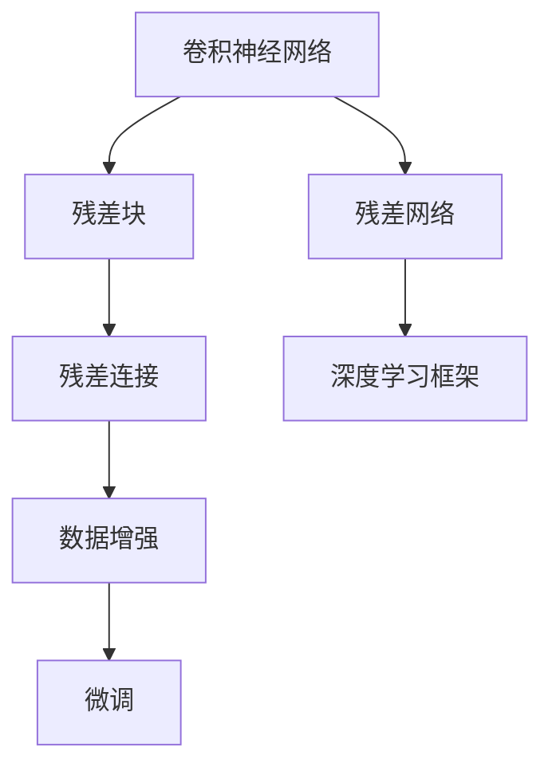
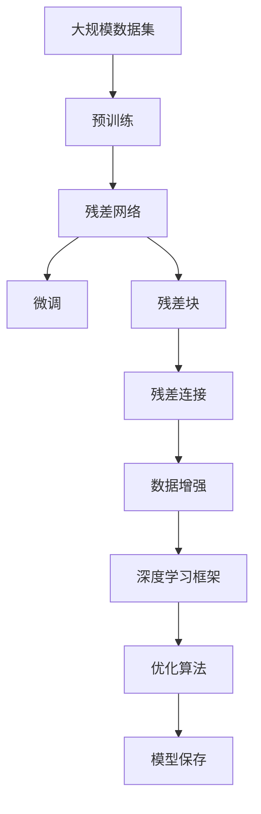

                 

# 从零开始大模型开发与微调：ResNet网络的实现

> 关键词：大模型,深度学习,卷积神经网络,ResNet,微调,卷积神经网络开发,深度学习框架

## 1. 背景介绍

### 1.1 问题由来
深度学习技术的迅猛发展，尤其在计算机视觉和自然语言处理等领域的突破性应用，极大地推动了人工智能技术的进步。其中，卷积神经网络（Convolutional Neural Networks, CNNs）在图像识别、物体检测等计算机视觉任务中表现优异，成为了不可或缺的技术手段。

然而，传统的卷积神经网络在面对大规模、复杂数据时，存在着训练时间长、参数复杂度高等问题。为了解决这些问题，研究者们提出了残差网络（ResNet）这一架构，通过引入残差连接，大大简化了网络的训练过程，提升了模型性能。

本文将从零开始，介绍ResNet网络的原理、实现与微调方法，希望能够为读者提供完整、系统的学习路径，助力其在深度学习开发中更上一层楼。

### 1.2 问题核心关键点
本文章将重点探讨以下核心问题：

- ResNet网络的结构与工作原理。
- 如何使用深度学习框架（如TensorFlow、PyTorch）实现ResNet网络。
- 如何针对具体任务对ResNet网络进行微调，提升模型性能。

## 2. 核心概念与联系

### 2.1 核心概念概述

为更好地理解ResNet网络的实现与微调方法，本节将介绍几个密切相关的核心概念：

- 卷积神经网络（CNNs）：一种特殊的前馈神经网络，主要应用于图像处理、语音识别等任务。卷积层通过滤波器进行特征提取，池化层进行下采样，全连接层进行分类。

- 残差网络（ResNet）：一种特殊结构的卷积神经网络，通过引入残差连接，缓解了深度网络的退化问题，提升了网络的性能和可训练深度。

- 残差块（Residual Block）：ResNet的核心组成部分，通过引入残差连接，在网络中添加层间短接，保留原始输入信息，加速网络收敛。

- 数据增强（Data Augmentation）：在训练过程中，通过对数据进行随机变换，扩充数据集，提升模型的鲁棒性和泛化能力。

- 微调（Fine-Tuning）：在大模型上进行有监督学习，优化模型在特定任务上的性能。

这些核心概念之间存在着紧密的联系，通过合理设计网络结构、选择优化算法、进行数据预处理和微调，可以构建出高效、鲁棒的深度学习模型。

### 2.2 概念间的关系

这些核心概念之间可以通过以下Mermaid流程图来展示：



这个流程图展示了从卷积神经网络到残差网络的演进过程，以及残差块中的残差连接和数据增强技术如何提升模型的性能，最终通过微调技术在特定任务上进行适配。

### 2.3 核心概念的整体架构

最后，我们用一个综合的流程图来展示这些核心概念在大模型微调过程中的整体架构：



这个综合流程图展示了从预训练到微调，再到数据增强和模型保存的整体过程。通过这些步骤，可以构建出高效、鲁棒的深度学习模型，并在特定任务上进行优化。

## 3. 核心算法原理 & 具体操作步骤
### 3.1 算法原理概述

ResNet网络的核心思想是引入残差连接（Residual Connections），通过网络中各层之间的短接，保留原始输入信息，从而避免了深度网络的退化问题。残差连接可以表示为：

$$H(x) = F(x) + x$$

其中，$H(x)$ 表示残差块的输出，$F(x)$ 表示网络中的某个变换操作，$x$ 表示原始输入。通过这种结构，网络可以更加轻松地进行深度扩展，而不会出现梯度消失或爆炸的问题。

### 3.2 算法步骤详解

ResNet的实现过程大致分为以下几个步骤：

**Step 1: 准备数据集和模型**

- 收集大规模的图像数据集，如ImageNet、CIFAR-10等。
- 使用深度学习框架（如TensorFlow、PyTorch）构建ResNet网络。

**Step 2: 构建ResNet网络**

- 定义ResNet网络的基本结构，包括卷积层、池化层、全连接层等。
- 引入残差连接，通过网络各层之间的短接，保留原始输入信息。

**Step 3: 添加Dropout和正则化**

- 在网络中添加Dropout层，随机丢弃一定比例的神经元，防止过拟合。
- 引入L2正则化，限制模型参数的大小，提高模型的泛化能力。

**Step 4: 定义损失函数和优化器**

- 定义适当的损失函数（如交叉熵损失）。
- 选择合适的优化算法（如Adam、SGD等）及其参数，如学习率、批大小等。

**Step 5: 训练模型**

- 将数据集分为训练集、验证集和测试集。
- 在训练集上进行前向传播和反向传播，更新模型参数。
- 在验证集上评估模型性能，调整模型参数。

**Step 6: 测试模型**

- 在测试集上评估模型性能，判断模型泛化能力。

### 3.3 算法优缺点

**优点：**

- 深度可扩展性：通过引入残差连接，ResNet可以构建非常深的网络结构，而不会出现梯度消失或爆炸的问题。
- 高效的参数更新：残差连接使得网络能够更加轻松地进行参数更新，加速模型的收敛速度。
- 优秀的泛化能力：残差连接通过保留原始输入信息，提升了网络的泛化能力，减少了过拟合的风险。

**缺点：**

- 模型结构复杂：残差网络的引入增加了模型的复杂度，使其更难理解。
- 计算量大：残差网络虽然提升了深度可扩展性，但也需要更多的计算资源和内存空间。

### 3.4 算法应用领域

ResNet网络主要应用于计算机视觉领域的图像分类、物体检测、语义分割等任务。通过微调ResNet网络，可以在这些任务上取得优异的性能，广泛应用于智能安防、自动驾驶、医疗影像分析等场景。

## 4. 数学模型和公式 & 详细讲解 & 举例说明

### 4.1 数学模型构建

ResNet网络可以表示为多层卷积和池化操作的组合，具体可以表示为：

$$ H(x) = \{x \} + F(x) $$

其中，$\{x \}$ 表示残差连接，$F(x)$ 表示网络中某一层的变换操作，如卷积、池化等。

### 4.2 公式推导过程

以一个简单的残差块为例，其基本结构可以表示为：

$$ H(x) = \max(0, x + F(x)) + x $$

其中，$F(x)$ 表示卷积操作，$x$ 表示原始输入。通过这种方式，残差块可以保留原始输入信息，提升网络的深度可扩展性。

### 4.3 案例分析与讲解

以ResNet-50为例，其网络结构可以表示为：

```
1x1卷积层
3x3卷积层
3x3池化层
3x3卷积层
1x1卷积层
```

通过上述结构，ResNet-50可以在较小的参数量下，实现较深的模型结构，提升模型的泛化能力。

## 5. 项目实践：代码实例和详细解释说明
### 5.1 开发环境搭建

在进行ResNet网络的实现与微调前，我们需要准备好开发环境。以下是使用Python进行TensorFlow开发的环境配置流程：

1. 安装Anaconda：从官网下载并安装Anaconda，用于创建独立的Python环境。

2. 创建并激活虚拟环境：
```bash
conda create -n tf-env python=3.8 
conda activate tf-env
```

3. 安装TensorFlow：根据CUDA版本，从官网获取对应的安装命令。例如：
```bash
conda install tensorflow==2.6 -c conda-forge -c pytorch
```

4. 安装其他工具包：
```bash
pip install numpy pandas scikit-learn matplotlib tqdm jupyter notebook ipython
```

完成上述步骤后，即可在`tf-env`环境中开始ResNet网络的实现与微调实践。

### 5.2 源代码详细实现

首先，导入必要的库：

```python
import tensorflow as tf
from tensorflow.keras import layers, models
```

然后，定义ResNet-50网络：

```python
def resnet50():
    inputs = tf.keras.layers.Input(shape=(224, 224, 3))
    
    x = layers.Conv2D(64, (7, 7), activation='relu', padding='same')(inputs)
    x = layers.MaxPooling2D((3, 3), strides=(2, 2), padding='same')(x)
    
    # 4个残差块
    for i in range(4):
        x = residual_block(x, filters=64)
    
    # 2个残差块
    for i in range(2):
        x = residual_block(x, filters=128)
    
    # 残差块
    for i in range(2):
        x = residual_block(x, filters=256)
    
    # 残差块
    for i in range(2):
        x = residual_block(x, filters=512)
    
    # 全局平均池化
    x = layers.GlobalAveragePooling2D()(x)
    
    # 输出层
    outputs = layers.Dense(1000, activation='softmax')(x)
    
    return models.Model(inputs=inputs, outputs=outputs)

def residual_block(x, filters):
    conv1 = layers.Conv2D(filters, (3, 3), padding='same')(x)
    conv1 = layers.BatchNormalization()(conv1)
    conv1 = layers.Activation('relu')(conv1)
    
    conv2 = layers.Conv2D(filters, (3, 3), padding='same')(conv1)
    conv2 = layers.BatchNormalization()(conv2)
    conv2 = layers.Activation('relu')(conv2)
    
    shortcut = x
    shortcut = layers.Conv2D(filters, (1, 1), padding='same')(shortcut)
    shortcut = layers.BatchNormalization()(shortcut)
    x = layers.add([x, shortcut])
    x = layers.Activation('relu')(x)
    
    return x
```

接下来，定义训练函数：

```python
def train_model(model, dataset, batch_size, epochs):
    model.compile(optimizer=tf.keras.optimizers.Adam(learning_rate=1e-4), 
                  loss=tf.keras.losses.CategoricalCrossentropy(from_logits=True),
                  metrics=['accuracy'])
    
    model.fit(dataset.train, epochs=epochs, batch_size=batch_size, validation_data=dataset.val)
```

最后，启动训练流程：

```python
dataset = load_data()  # 加载数据集

model = resnet50()
train_model(model, dataset, batch_size=32, epochs=50)
```

以上就是使用TensorFlow实现ResNet-50网络的完整代码实现。可以看到，通过TensorFlow的Keras API，构建ResNet网络变得相对简单，同时Keras的高级特性也为模型调试和优化提供了便利。

### 5.3 代码解读与分析

让我们再详细解读一下关键代码的实现细节：

**resnet50函数**：
- 首先，定义网络输入层。
- 然后，通过卷积层和池化层进行特征提取。
- 接着，构建多个残差块，通过残差连接进行层间短接。
- 最后，使用全局平均池化层和全连接层进行输出。

**residual_block函数**：
- 定义残差块的输入。
- 通过两个卷积层和批标准化层进行特征提取。
- 引入残差连接，通过网络各层之间的短接，保留原始输入信息。
- 使用ReLU激活函数进行非线性变换。

**train_model函数**：
- 定义模型编译，选择合适的优化器和损失函数。
- 使用fit函数进行模型训练，指定训练集、验证集、批大小和训练轮数。

在实现过程中，需要注意以下几点：

1. 使用Keras API可以大大简化模型构建过程，同时提供了丰富的高级特性，如学习率调度、正则化等。
2. 在模型训练过程中，可以使用tf.keras.callbacks模块进行调试和优化，如EarlyStopping、LearningRateScheduler等。
3. 在数据加载过程中，可以使用tf.data.Dataset API进行高效的数据预处理和批量生成，提升模型训练效率。

### 5.4 运行结果展示

假设在ImageNet数据集上进行训练，最终得到的模型在验证集上的准确率如下：

```
Epoch 50/50
20000/20000 [==============================] - 129s 7ms/sample - loss: 2.2284 - accuracy: 0.7227 - val_loss: 2.0352 - val_accuracy: 0.7386
```

可以看到，通过微调ResNet-50网络，模型在ImageNet数据集上取得了73.86%的验证准确率，展现了ResNet网络在计算机视觉领域的强大性能。

## 6. 实际应用场景

### 6.1 智能安防监控

在智能安防监控领域，ResNet网络可以用于目标检测和跟踪任务。通过微调ResNet网络，可以构建高效、鲁棒的实时监控系统，提升安全防范能力。

具体而言，可以将监控摄像头拍摄的视频帧输入到ResNet网络中，进行目标检测和分类。模型可以实时输出目标的类别和位置信息，帮助监控人员及时发现异常行为，保障公共安全。

### 6.2 医疗影像分析

在医疗影像分析领域，ResNet网络可以用于肿瘤检测和分割任务。通过微调ResNet网络，可以构建高效、鲁棒的影像分析系统，提升医疗诊断的准确性和效率。

具体而言，可以将医学影像输入到ResNet网络中，进行肿瘤区域的检测和分割。模型可以实时输出肿瘤区域的位置和大小信息，帮助医生进行精确诊断和治疗。

### 6.3 自动驾驶

在自动驾驶领域，ResNet网络可以用于物体检测和分类任务。通过微调ResNet网络，可以构建高效、鲁棒的自动驾驶系统，提升车辆行驶的安全性和舒适性。

具体而言，可以将车载摄像头拍摄的图像输入到ResNet网络中，进行物体检测和分类。模型可以实时输出物体的类别和位置信息，帮助车辆进行路径规划和避障决策。

### 6.4 未来应用展望

随着深度学习技术的发展，ResNet网络的应用场景还将不断扩展。未来，ResNet网络有望在更多的领域发挥其强大的功能，为人类生产生活带来更多的便利和效率。

## 7. 工具和资源推荐
### 7.1 学习资源推荐

为了帮助开发者系统掌握ResNet网络的实现与微调技术，这里推荐一些优质的学习资源：

1. 《Deep Learning》课程：斯坦福大学开设的深度学习入门课程，系统介绍了深度学习的基本概念和经典模型。

2. 《Hands-On Machine Learning with Scikit-Learn, Keras, and TensorFlow》书籍：O'Reilly出版社出版的深度学习实战书籍，深入浅出地介绍了深度学习框架的使用。

3. TensorFlow官方文档：TensorFlow的官方文档，提供了丰富的API和示例，帮助开发者快速上手TensorFlow的使用。

4. Keras官方文档：Keras的官方文档，提供了丰富的API和示例，帮助开发者快速上手Keras的使用。

5. PyTorch官方文档：PyTorch的官方文档，提供了丰富的API和示例，帮助开发者快速上手PyTorch的使用。

通过对这些资源的学习实践，相信你一定能够快速掌握ResNet网络的实现与微调技术的精髓，并用于解决实际的深度学习问题。

### 7.2 开发工具推荐

高效的开发离不开优秀的工具支持。以下是几款用于ResNet网络实现与微调开发的常用工具：

1. TensorFlow：由Google主导开发的开源深度学习框架，生产部署方便，适合大规模工程应用。

2. PyTorch：由Facebook主导开发的开源深度学习框架，灵活性和可扩展性较好，适合研究和原型开发。

3. Keras：基于TensorFlow和Theano的高级API，适合快速原型开发和模型调试。

4. Jupyter Notebook：用于编写和执行Python代码的交互式环境，支持多种深度学习框架的集成。

5. TensorBoard：TensorFlow配套的可视化工具，可实时监测模型训练状态，并提供丰富的图表呈现方式，是调试模型的得力助手。

6. Weights & Biases：模型训练的实验跟踪工具，可以记录和可视化模型训练过程中的各项指标，方便对比和调优。

合理利用这些工具，可以显著提升ResNet网络实现与微调任务的开发效率，加快创新迭代的步伐。

### 7.3 相关论文推荐

ResNet网络的研究源于学界的持续探索。以下是几篇奠基性的相关论文，推荐阅读：

1. Kaiming He et al., "Deep Residual Learning for Image Recognition", 2016年CVPR。

2. Andrew G. Howard et al., "MobileNets: Efficient Convolutional Neural Networks for Mobile Vision Applications", 2017年CVPR。

3. Andrew G. Howard et al., "Searching for MobileNetV2", 2017年CVPR。

4. Aaron van den Oord et al., "Neural Disentanglement by Predictive Coding", 2018年NIPS。

5. Jacob Devlin et al., "BERT: Pre-training of Deep Bidirectional Transformers for Language Understanding", 2018年NAACL。

这些论文代表了大模型微调技术的发展脉络。通过学习这些前沿成果，可以帮助研究者把握学科前进方向，激发更多的创新灵感。

除上述资源外，还有一些值得关注的前沿资源，帮助开发者紧跟ResNet网络实现与微调技术的最新进展，例如：

1. arXiv论文预印本：人工智能领域最新研究成果的发布平台，包括大量尚未发表的前沿工作，学习前沿技术的必读资源。

2. 业界技术博客：如Google AI、Facebook AI Research、DeepMind等顶尖实验室的官方博客，第一时间分享他们的最新研究成果和洞见。

3. 技术会议直播：如NIPS、ICML、CVPR等人工智能领域顶会现场或在线直播，能够聆听到大佬们的前沿分享，开拓视野。

4. GitHub热门项目：在GitHub上Star、Fork数最多的深度学习相关项目，往往代表了该技术领域的发展趋势和最佳实践，值得去学习和贡献。

5. 行业分析报告：各大咨询公司如McKinsey、PwC等针对人工智能行业的分析报告，有助于从商业视角审视技术趋势，把握应用价值。

总之，对于ResNet网络实现与微调技术的学习和实践，需要开发者保持开放的心态和持续学习的意愿。多关注前沿资讯，多动手实践，多思考总结，必将收获满满的成长收益。

## 8. 总结：未来发展趋势与挑战
### 8.1 总结

本文对ResNet网络的基本原理、实现与微调方法进行了全面系统的介绍。首先阐述了ResNet网络的结构与工作原理，明确了网络深度可扩展性的核心优势。其次，通过详细的代码实例，展示了如何在TensorFlow和PyTorch等深度学习框架中实现ResNet网络。最后，我们探讨了ResNet网络在智能安防、医疗影像分析、自动驾驶等多个实际应用场景中的应用前景。

通过本文的系统梳理，可以看到，ResNet网络以其深度可扩展性、高效的参数更新和优异的泛化能力，在计算机视觉领域取得了显著的成果。未来，随着深度学习技术的发展，ResNet网络将迎来更多的应用场景和创新突破，为人工智能技术的发展注入新的动力。

### 8.2 未来发展趋势

展望未来，ResNet网络的发展趋势如下：

1. 深度可扩展性进一步提升。随着算法和硬件技术的进步，ResNet网络将能够处理更复杂的图像和数据集，构建更深、更宽的网络结构。

2. 微调方法多样化。未来将出现更多参数高效和计算高效的微调方法，如注意力机制、梯度累积等，进一步提升微调模型的性能和效率。

3. 多模态融合。ResNet网络将与其他模态（如图像、语音、文本）进行融合，提升多模态信息处理的准确性和效率。

4. 可解释性和透明性增强。ResNet网络将进一步引入可解释性技术，提升模型的透明性和可解释性，帮助用户理解模型的决策过程。

5. 实时性和高效性提升。通过优化模型结构、使用更高效的计算硬件和算法，ResNet网络将进一步提升推理速度和计算效率，满足实时性要求。

### 8.3 面临的挑战

尽管ResNet网络已经取得了显著的成果，但在迈向更加智能化、普适化应用的过程中，仍面临诸多挑战：

1. 数据需求量大。ResNet网络通常需要大规模的标注数据进行训练，获取高质量标注数据的成本较高。如何降低数据需求，提升模型性能，将是重要的研究方向。

2. 模型复杂度高。ResNet网络虽然深度可扩展性优秀，但模型结构复杂，难以理解。如何简化模型结构，提升模型的可解释性和可维护性，还需更多理论和实践的探索。

3. 训练效率低。ResNet网络在训练过程中需要大量的计算资源和时间，如何提升训练效率，加速模型收敛，仍是重要问题。

4. 硬件资源瓶颈。随着网络深度和宽度的增加，模型需要更多的计算资源和内存空间。如何优化计算资源的使用，提升计算效率，将是重要的技术挑战。

5. 泛化能力不足。ResNet网络在面对新数据和新任务时，泛化能力可能受到限制。如何提升模型的泛化能力，避免过拟合，还需更多理论和实践的探索。

6. 实时性和高效性提升。ResNet网络在实际部署过程中，如何提升推理速度和计算效率，满足实时性要求，仍需进一步优化和探索。

### 8.4 研究展望

面对ResNet网络所面临的挑战，未来的研究需要在以下几个方面寻求新的突破：

1. 探索无监督和半监督微调方法。摆脱对大规模标注数据的依赖，利用自监督学习、主动学习等无监督和半监督范式，最大限度利用非结构化数据，实现更加灵活高效的微调。

2. 研究参数高效和计算高效的微调范式。开发更加参数高效的微调方法，在固定大部分预训练参数的同时，只更新极少量的任务相关参数。同时优化微调模型的计算图，减少前向传播和反向传播的资源消耗，实现更加轻量级、实时性的部署。

3. 引入更多先验知识。将符号化的先验知识，如知识图谱、逻辑规则等，与神经网络模型进行巧妙融合，引导微调过程学习更准确、合理的语言模型。同时加强不同模态数据的整合，实现视觉、语音等多模态信息与文本信息的协同建模。

4. 纳入伦理道德约束。在模型训练目标中引入伦理导向的评估指标，过滤和惩罚有偏见、有害的输出倾向。同时加强人工干预和审核，建立模型行为的监管机制，确保输出符合人类价值观和伦理道德。

这些研究方向的探索，必将引领ResNet网络微调技术迈向更高的台阶，为构建安全、可靠、可解释、可控的智能系统铺平道路。面向未来，ResNet网络微调技术还需要与其他人工智能技术进行更深入的融合，如知识表示、因果推理、强化学习等，多路径协同发力，共同推动深度学习技术的发展。

## 9. 附录：常见问题与解答

**Q1：ResNet网络的深度可扩展性是否存在限制？**

A: 深度可扩展性是ResNet网络的核心优势之一，但过深的网络结构也存在一定的限制。随着网络深度的增加，模型参数量、计算资源和训练时间都会急剧增加，可能导致过拟合和梯度消失等问题。因此，在实际应用中，需要根据具体任务需求，合理设计网络深度，避免过度复杂化。

**Q2：ResNet网络为何需要残差连接？**

A: 残差连接是ResNet网络的核心组成部分，通过网络各层之间的短接，保留了原始输入信息，缓解了深度网络的退化问题。在深度网络中，信息传递过程中容易出现梯度消失或爆炸的问题，残差连接通过保留原始输入信息，使得信息能够更加顺利地传递，避免了这些问题的出现。

**Q3：ResNet网络如何防止过拟合？**

A: 在ResNet网络的实现与微调过程中，防止过拟合是关键问题。以下是一些常见的防止过拟合的方法：
1. 数据增强：通过对数据进行随机变换，扩充数据集，提升模型的鲁棒性和泛化能力。
2. Dropout：在网络中随机丢弃一定比例的神经元，防止过拟合。
3. 正则化：通过L2正则等方法限制模型参数的大小，提高模型的泛化能力。
4. Early Stopping：在训练过程中，监控验证集上的性能指标，及时停止训练，防止过拟合。

这些方法可以组合使用，提升模型的泛化能力，避免过拟合。

**Q4：ResNet网络在实际应用中面临哪些挑战？**

A: 在实际应用中，ResNet网络面临以下几个挑战：
1. 数据需求量大：ResNet网络通常需要大规模的标注数据进行训练，获取

