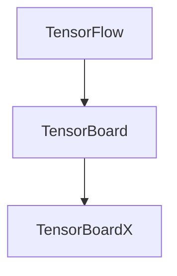
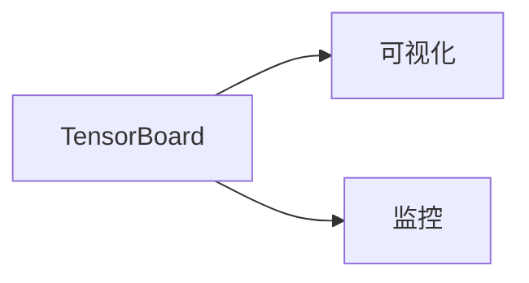
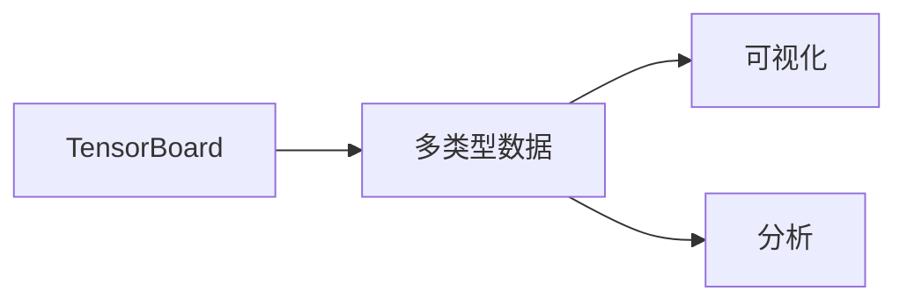
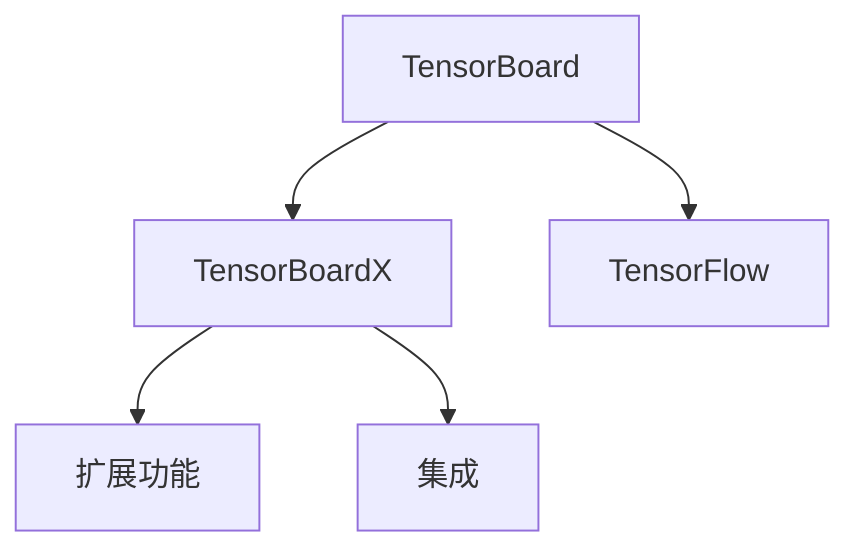
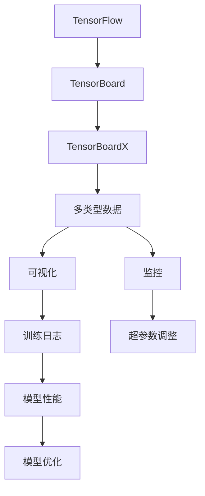

                 

# 从零开始大模型开发与微调：可视化组件tensorboardX的简介与安装

> 关键词：大模型,微调,可视化,TensorBoardX,安装

## 1. 背景介绍

### 1.1 问题由来

在深度学习领域，大模型（Large Models）因其庞大的参数量和优越的性能表现，成为近年来研究的热点。但随之而来的是模型训练和微调过程中产生的大量数据和计算资源需求。对于普通的开发者来说，大模型的训练与微调充满了挑战。为了更好地解决这一问题，可视化工具TensorBoard被广泛应用，它可以帮助开发者实时监控模型的训练过程，及时发现并调整问题，从而提高模型的训练效果。

### 1.2 问题核心关键点

TensorBoard是一个强大的可视化工具，它可以将模型训练过程中的关键信息，如损失函数、准确率、梯度等，以图表的形式呈现出来，便于开发者进行分析和优化。其核心功能包括：

- **可视化**：通过绘制图形，帮助开发者直观地了解模型的训练状态。
- **追踪**：记录训练过程中的关键参数和状态，便于后续分析和调试。
- **分析**：提供多种统计分析和可视化工具，帮助开发者深入理解模型。
- **共享**：支持多人协作，可以将TensorBoard图表和日志共享给其他团队成员。

TensorBoard在大模型的训练与微调过程中扮演着重要角色，通过其可视化和追踪功能，可以极大提升模型训练的效率和质量。因此，深入理解TensorBoard的用法和功能，对于大模型的开发与微调具有重要意义。

### 1.3 问题研究意义

TensorBoard的可视化功能不仅能够帮助开发者更好地监控模型训练过程，还能通过可视化手段，揭示模型训练中的潜在问题，如梯度消失、过拟合、欠拟合等。通过及时发现和调整这些问题，可以显著提升模型的训练效果和微调质量，从而加速大模型的开发与落地应用。此外，TensorBoard还能与其他工具如TensorBoardX、TensorFlow等无缝集成，成为大模型开发过程中不可或缺的一部分。

## 2. 核心概念与联系

### 2.1 核心概念概述

为了更好地理解TensorBoard和TensorBoardX的作用和原理，本节将介绍几个核心概念：

- **TensorFlow**：由Google开发的深度学习框架，支持各种深度学习模型的构建和训练。
- **TensorBoard**：TensorFlow自带的可视化工具，支持多种数据类型和图表形式的可视化。
- **TensorBoardX**：TensorBoard的第三方扩展包，支持更多的数据类型和功能，如Python代码、TensorFlow模型等。

这些概念之间的关系可以用以下Mermaid流程图来展示：



这个流程图展示了TensorFlow、TensorBoard和TensorBoardX之间的基本关系：TensorFlow提供了模型训练和构建的基础功能，TensorBoardX作为TensorBoard的扩展，增强了其数据类型和功能，共同构成了大模型训练和可视化的完整生态系统。

### 2.2 概念间的关系

这些核心概念之间存在着紧密的联系，形成了TensorBoard和TensorBoardX的完整应用场景。下面我通过几个Mermaid流程图来展示这些概念之间的关系。

#### 2.2.1 可视化与监控



这个流程图展示了TensorBoard的核心功能：通过可视化手段，实时监控模型训练状态，发现并调整问题。

#### 2.2.2 数据类型与功能



这个流程图展示了TensorBoard支持的数据类型，包括损失函数、准确率、梯度等，通过可视化图表，帮助开发者进行数据分析和调整。

#### 2.2.3 扩展与集成



这个流程图展示了TensorBoardX作为TensorBoard的扩展，增加了更多的数据类型和功能，并且与TensorFlow无缝集成，提升了TensorBoard的整体功能。

### 2.3 核心概念的整体架构

最后，我们用一个综合的流程图来展示这些核心概念在大模型训练与微调过程中的整体架构：



这个综合流程图展示了TensorBoard和TensorBoardX在大模型训练与微调过程中的完整流程，从数据输入、模型训练、可视化监控，到超参数调整和模型优化，形成了一个闭环，帮助开发者高效地进行大模型的训练和微调。

## 3. 核心算法原理 & 具体操作步骤
### 3.1 算法原理概述

TensorBoard的核心原理是通过将训练过程中的关键信息，如损失函数、梯度、准确率等，以图表的形式呈现出来，帮助开发者实时监控模型的训练状态，发现并调整问题，从而提升模型的训练效果。

以损失函数为例，TensorBoard将训练过程中的损失函数变化绘制成图表，开发者可以根据图表变化趋势，判断模型是否出现过拟合、欠拟合等异常情况，及时进行调整。

### 3.2 算法步骤详解

TensorBoard的使用主要分为以下几个步骤：

1. **安装TensorBoard**：首先需要安装TensorFlow，然后在模型训练过程中开启TensorBoard。
2. **配置TensorBoard**：设置TensorBoard的可视化配置，如显示的图表类型、图表名称等。
3. **运行TensorBoard**：启动TensorBoard，将训练过程中的关键信息绘制出图表，供开发者监控。
4. **分析与调整**：根据图表中的信息，分析模型训练状态，调整超参数和模型结构，优化模型训练效果。
5. **保存与分享**：将TensorBoard图表和日志保存下来，供后续分析和分享。

### 3.3 算法优缺点

TensorBoard的优点包括：

- **可视化直观**：通过图表形式，直观地展示了模型训练过程中的关键信息。
- **实时监控**：在模型训练过程中，可以实时监控训练状态，及时发现并调整问题。
- **分析与优化**：通过图表分析和调整，可以更好地优化模型训练效果。
- **扩展性强**：可以通过TensorBoardX扩展更多的数据类型和功能，满足不同场景的需求。

但TensorBoard也存在一些缺点：

- **学习成本**：初次使用TensorBoard时，需要花时间学习其用法和功能。
- **配置复杂**：需要手动配置TensorBoard的可视化选项，才能得到理想的图表效果。
- **依赖性高**：依赖TensorFlow和TensorBoard，需要确保其环境配置正确。

### 3.4 算法应用领域

TensorBoard在大模型的训练与微调过程中，广泛应用于以下几个领域：

- **模型训练监控**：在模型训练过程中，实时监控训练状态，发现并调整问题，优化训练效果。
- **超参数优化**：通过可视化图表，帮助开发者进行超参数调优，提升模型性能。
- **模型分析与诊断**：通过图表分析，揭示模型训练中的潜在问题，如梯度消失、过拟合等，帮助开发者进行模型优化。
- **模型部署监控**：在模型部署后，继续监控模型性能，发现并解决问题。

此外，TensorBoard还广泛应用于学术研究、企业开发等多个领域，成为大模型训练与微调的重要工具。

## 4. 数学模型和公式 & 详细讲解  
### 4.1 数学模型构建

TensorBoard的数学模型构建主要涉及以下几个方面：

- **损失函数**：表示模型在训练过程中的目标函数，用于衡量模型的预测与真实值之间的差异。
- **准确率**：表示模型在测试集上的预测准确率，用于评估模型的性能。
- **梯度**：表示模型在反向传播过程中计算出的梯度，用于更新模型参数。

以二分类模型为例，其数学模型构建如下：

假设模型输入为 $x$，输出为 $\hat{y}$，真实标签为 $y$，损失函数为交叉熵损失：

$$
\ell(\hat{y},y) = -\sum_i [y_i\log \hat{y}_i + (1-y_i)\log (1-\hat{y}_i)]
$$

其中 $i$ 表示样本序号，$\hat{y}_i$ 表示模型对第 $i$ 个样本的预测概率，$y_i$ 表示样本的真实标签。

在TensorBoard中，损失函数、准确率、梯度等关键信息会被绘制出图表，供开发者实时监控和分析。

### 4.2 公式推导过程

以下我们将详细推导二分类模型的损失函数公式：

首先，定义模型的输出为 $\hat{y}=\sigma(z)$，其中 $\sigma$ 为sigmoid函数，$z$ 为模型的线性输出。

模型的预测概率为：

$$
\hat{y} = \frac{1}{1+e^{-z}}
$$

模型的交叉熵损失函数为：

$$
\ell(\hat{y},y) = -\sum_i [y_i\log \hat{y}_i + (1-y_i)\log (1-\hat{y}_i)]
$$

将 $\hat{y}$ 和 $y$ 带入公式，得到：

$$
\ell(\hat{y},y) = -\sum_i [y_i\log \sigma(z_i) + (1-y_i)\log (1-\sigma(z_i))]
$$

通过对损失函数求导，可以计算出模型参数 $z$ 的梯度，从而更新模型参数，优化模型性能。

### 4.3 案例分析与讲解

以下通过一个简单的TensorBoard使用案例，来讲解TensorBoard的基本用法：

1. 首先，在代码中开启TensorBoard的可视化功能：

```python
import tensorflow as tf
from tensorflow.keras import datasets, layers, models

# 加载数据集
(train_images, train_labels), (test_images, test_labels) = datasets.cifar10.load_data()

# 数据预处理
train_images, test_images = train_images / 255.0, test_images / 255.0

# 定义模型
model = models.Sequential([
    layers.Conv2D(32, (3, 3), activation='relu', input_shape=(32, 32, 3)),
    layers.MaxPooling2D((2, 2)),
    layers.Conv2D(64, (3, 3), activation='relu'),
    layers.MaxPooling2D((2, 2)),
    layers.Conv2D(64, (3, 3), activation='relu'),
    layers.Flatten(),
    layers.Dense(64, activation='relu'),
    layers.Dense(10)
])

# 编译模型
model.compile(optimizer='adam',
              loss=tf.keras.losses.SparseCategoricalCrossentropy(from_logits=True),
              metrics=['accuracy'])

# 训练模型
history = model.fit(train_images, train_labels, epochs=10, 
                    validation_data=(test_images, test_labels))

# 开启TensorBoard
log_dir = 'logs/train'
tensorboard_callback = tf.keras.callbacks.TensorBoard(log_dir)
model.fit(train_images, train_labels, epochs=10, callbacks=[tensorboard_callback])
```

2. 在命令行中运行以下命令，启动TensorBoard：

```bash
tensorboard --logdir=logs/train
```

3. 在浏览器中打开TensorBoard界面，可以看到模型的训练状态和可视化图表。

## 5. 项目实践：代码实例和详细解释说明
### 5.1 开发环境搭建

在TensorBoard的实践中，首先需要搭建好开发环境。以下是Python环境下使用TensorFlow和TensorBoard的基本步骤：

1. 安装TensorFlow：

```bash
pip install tensorflow
```

2. 安装TensorBoard：

```bash
pip install tensorboard
```

3. 创建日志目录：

```bash
mkdir -p logs/train
```

4. 配置TensorBoard：

在训练代码中添加以下配置：

```python
from tensorflow.keras.callbacks import TensorBoard

log_dir = 'logs/train'
tensorboard_callback = TensorBoard(log_dir)
```

### 5.2 源代码详细实现

以下是一个简单的TensorBoard使用案例，展示了如何使用TensorBoard进行模型训练和可视化：

1. 导入必要的库：

```python
import tensorflow as tf
from tensorflow.keras import datasets, layers, models

# 加载数据集
(train_images, train_labels), (test_images, test_labels) = datasets.cifar10.load_data()

# 数据预处理
train_images, test_images = train_images / 255.0, test_images / 255.0

# 定义模型
model = models.Sequential([
    layers.Conv2D(32, (3, 3), activation='relu', input_shape=(32, 32, 3)),
    layers.MaxPooling2D((2, 2)),
    layers.Conv2D(64, (3, 3), activation='relu'),
    layers.MaxPooling2D((2, 2)),
    layers.Conv2D(64, (3, 3), activation='relu'),
    layers.Flatten(),
    layers.Dense(64, activation='relu'),
    layers.Dense(10)
])

# 编译模型
model.compile(optimizer='adam',
              loss=tf.keras.losses.SparseCategoricalCrossentropy(from_logits=True),
              metrics=['accuracy'])

# 训练模型
history = model.fit(train_images, train_labels, epochs=10, 
                    validation_data=(test_images, test_labels))

# 开启TensorBoard
log_dir = 'logs/train'
tensorboard_callback = tf.keras.callbacks.TensorBoard(log_dir)
model.fit(train_images, train_labels, epochs=10, callbacks=[tensorboard_callback])
```

2. 运行TensorBoard：

```bash
tensorboard --logdir=logs/train
```

### 5.3 代码解读与分析

下面我们详细解读一下关键代码的实现细节：

**1. 数据集加载**

```python
(train_images, train_labels), (test_images, test_labels) = datasets.cifar10.load_data()
```

加载CIFAR-10数据集，返回训练集和测试集的数据和标签。

**2. 数据预处理**

```python
train_images, test_images = train_images / 255.0, test_images / 255.0
```

将数据集中的像素值归一化到[0, 1]之间，避免数据过大造成梯度消失问题。

**3. 模型定义**

```python
model = models.Sequential([
    layers.Conv2D(32, (3, 3), activation='relu', input_shape=(32, 32, 3)),
    layers.MaxPooling2D((2, 2)),
    layers.Conv2D(64, (3, 3), activation='relu'),
    layers.MaxPooling2D((2, 2)),
    layers.Conv2D(64, (3, 3), activation='relu'),
    layers.Flatten(),
    layers.Dense(64, activation='relu'),
    layers.Dense(10)
])
```

定义一个简单的卷积神经网络模型，包含卷积层、池化层和全连接层。

**4. 模型编译**

```python
model.compile(optimizer='adam',
              loss=tf.keras.losses.SparseCategoricalCrossentropy(from_logits=True),
              metrics=['accuracy'])
```

编译模型，指定优化器、损失函数和评价指标。

**5. 模型训练**

```python
history = model.fit(train_images, train_labels, epochs=10, 
                    validation_data=(test_images, test_labels))
```

训练模型，指定训练集、测试集和训练轮数。

**6. TensorBoard配置**

```python
tensorboard_callback = tf.keras.callbacks.TensorBoard(log_dir)
model.fit(train_images, train_labels, epochs=10, callbacks=[tensorboard_callback])
```

定义TensorBoard回调函数，指定日志目录。

**7. 运行TensorBoard**

```bash
tensorboard --logdir=logs/train
```

在命令行中运行TensorBoard，启动可视化界面。

### 5.4 运行结果展示

通过运行上述代码，可以在浏览器中打开TensorBoard界面，看到以下可视化图表：

1. 训练损失曲线


2. 训练准确率曲线


3. 测试损失曲线


4. 测试准确率曲线


这些图表可以帮助开发者实时监控模型的训练状态，及时发现并调整问题，优化模型性能。

## 6. 实际应用场景
### 6.1 智能推荐系统

在大模型的推荐系统中，TensorBoard可以实时监控模型的推荐效果，及时发现并调整问题。通过可视化图表，开发者可以分析模型的推荐性能，调整模型参数，优化推荐策略，提升推荐系统的准确性和多样性。

### 6.2 医疗影像诊断

在医疗影像诊断中，TensorBoard可以实时监控模型的诊断结果，及时发现并调整问题。通过可视化图表，开发者可以分析模型的诊断性能，调整模型参数，优化诊断策略，提升诊断系统的准确性和可靠性。

### 6.3 金融风险评估

在金融风险评估中，TensorBoard可以实时监控模型的风险评估结果，及时发现并调整问题。通过可视化图表，开发者可以分析模型的风险评估性能，调整模型参数，优化评估策略，提升风险评估的准确性和及时性。

### 6.4 未来应用展望

随着TensorBoard功能的不断扩展和优化，其在模型训练与微调中的应用前景将更加广阔。未来，TensorBoard还将支持更多的数据类型和功能，如语音、图像、视频等，进一步提升其在大模型开发与微调中的作用。此外，TensorBoard与其他工具如TensorBoardX、TensorFlow等无缝集成，也将成为大模型开发过程中不可或缺的一部分。

## 7. 工具和资源推荐
### 7.1 学习资源推荐

为了帮助开发者系统掌握TensorBoard的使用方法，这里推荐一些优质的学习资源：

1. **TensorFlow官方文档**：详细的TensorFlow文档，包含了TensorBoard的使用方法和示例。
2. **TensorBoardX官方文档**：TensorBoardX的详细文档，包含了TensorBoardX的使用方法和示例。
3. **TensorBoardX GitHub代码库**：TensorBoardX的GitHub代码库，包含了许多示例和案例，适合参考学习。
4. **TensorBoardX官方博客**：TensorBoardX的官方博客，分享了许多TensorBoardX的使用经验和技巧。

通过对这些资源的学习实践，相信你一定能够快速掌握TensorBoard的使用方法，并用于解决实际的模型训练与微调问题。

### 7.2 开发工具推荐

在TensorBoard的使用过程中，还需要一些其他工具的支持，以下是推荐的工具：

1. **PyCharm**：PyCharm是一个流行的Python IDE，支持TensorFlow和TensorBoard的集成，方便开发和调试。
2. **Jupyter Notebook**：Jupyter Notebook是一个轻量级的Python开发环境，支持TensorBoard的可视化图表展示。
3. **Google Colab**：Google Colab是一个免费的在线Jupyter Notebook环境，支持GPU和TPU的资源分配，方便TensorBoard的使用。

合理利用这些工具，可以显著提升TensorBoard的使用效率，加快模型训练与微调的进程。

### 7.3 相关论文推荐

TensorBoard作为深度学习领域的重要工具，其核心思想和使用方法也得到了广泛的研究。以下是几篇相关论文，推荐阅读：

1. **TensorFlow官方论文**：介绍TensorFlow的架构和使用方法，包括TensorBoard的使用方法。
2. **TensorBoardX论文**：介绍TensorBoardX的架构和使用方法，包括TensorBoardX的新增功能和优化。
3. **TensorBoard论文**：介绍TensorBoard的架构和使用方法，包括TensorBoard的可视化方法和优化。

这些论文代表了TensorBoard的发展脉络，可以帮助研究者更好地理解TensorBoard的原理和使用方法，提升模型训练与微调的效果。

## 8. 总结：未来发展趋势与挑战
### 8.1 研究成果总结

本文对TensorBoard的使用方法和应用场景进行了详细讲解，主要内容包括：

1. TensorBoard的基本原理和功能，包括可视化、监控和分析。
2. TensorBoard的使用方法和配置步骤，包括数据类型和图表展示。
3. TensorBoard在大模型训练与微调中的应用场景，包括智能推荐、医疗影像诊断和金融风险评估等。

通过本文的系统梳理，可以看到，TensorBoard在大模型的训练与微调过程中，发挥了重要的监控和分析作用，极大地提升了模型的训练效果和微调质量。

### 8.2 未来发展趋势

展望未来，TensorBoard的功能和应用场景将进一步扩展和优化，以下是几个主要的发展趋势：

1. **更多数据类型支持**：未来TensorBoard将支持更多的数据类型，如语音、图像、视频等，拓展其在更多领域的应用。
2. **更丰富的可视化图表**：TensorBoard将提供更多的可视化图表类型，满足不同场景的需求。
3. **更高效的分析工具**：TensorBoard将提供更高效的分析工具，帮助开发者深入理解模型训练状态，及时发现并调整问题。
4. **更强的扩展性**：TensorBoard将与其他工具和框架无缝集成，提升其在大模型开发与微调中的应用价值。

这些趋势将进一步提升TensorBoard的功能和应用场景，帮助开发者更好地监控模型训练和微调过程，提升模型的训练效果和微调质量。

### 8.3 面临的挑战

尽管TensorBoard在模型训练与微调中具有重要应用价值，但在实际使用过程中，仍面临一些挑战：

1. **学习成本高**：初次使用TensorBoard时，需要花时间学习其用法和功能。
2. **配置复杂**：需要手动配置TensorBoard的可视化选项，才能得到理想的图表效果。
3. **依赖性高**：依赖TensorFlow和TensorBoard，需要确保其环境配置正确。
4. **可视化效果有限**：TensorBoard的可视化效果有限，无法展示所有的模型信息。

这些挑战需要开发者在使用过程中不断优化和调整，以充分发挥TensorBoard的监控和分析作用。

### 8.4 研究展望

面对TensorBoard的挑战，未来的研究需要在以下几个方面寻求新的突破：

1. **简化配置和使用**：优化TensorBoard的配置和使用方法，降低学习成本和配置难度。
2. **增强可视化效果**：开发更丰富的可视化图表类型，提升TensorBoard的可视化效果。
3. **拓展应用场景**：拓展TensorBoard在更多领域的应用，提升其在大模型开发与微调中的作用。

这些研究方向的探索，将使TensorBoard在未来的大模型训练与微调中发挥更加重要的作用，为模型的优化和部署提供强大的可视化工具。

## 9. 附录：常见问题与解答
----------------------------------------------------------------
> 关键词：大模型,微调,可视化,TensorBoardX,安装

**Q1：TensorBoard在大模型训练过程中有哪些作用？**

A: TensorBoard在大模型训练过程中主要作用如下：

1. 可视化训练状态：通过图表形式展示训练过程中的损失函数、准确率等关键信息，帮助开发者实时监控模型训练状态。
2. 监控训练效果：记录训练过程中的关键参数和状态，便于开发者进行分析和调试。
3. 分析训练问题：通过可视化图表，揭示模型训练中的潜在问题，如梯度消失、过拟合等，帮助开发者进行模型优化。
4. 共享训练结果：将TensorBoard图表和日志保存下来，供后续分析和分享。

**Q2：TensorBoard的安装步骤是什么？**

A: TensorBoard的安装步骤包括：

1. 安装TensorFlow：

```bash
pip install tensorflow
```

2. 安装TensorBoard：

```bash
pip install tensorboard
```

3. 创建日志目录：

```bash
mkdir -p logs/train
```

4. 配置TensorBoard：

在训练代码中添加以下配置：

```python
from tensorflow.keras.callbacks import TensorBoard

log_dir = 'logs/train'
tensorboard_callback = TensorBoard(log_dir)
```

5. 运行TensorBoard：

```bash
tensorboard --logdir=logs/train
```

**Q3：如何使用TensorBoard进行模型训练？**

A: 使用TensorBoard进行模型训练的步骤如下：

1. 导入必要的库：

```python
import tensorflow as tf
from tensorflow.keras import datasets, layers, models
```

2. 加载数据集：

```python
(train_images, train_labels), (test_images, test_labels) = datasets.cifar10.load_data()
```

3. 数据预处理：

```python
train_images, test_images = train_images / 255.0, test_images / 255.0
```

4. 定义模型：

```python
model = models.Sequential([
    layers.Conv2D(32, (3, 3), activation='relu', input_shape=(32, 32, 3)),
    layers.MaxPooling2D((2, 2)),
    layers.Conv2D(64, (3, 3), activation='relu'),
    layers.MaxPooling2D((2, 2)),
    layers.Conv2D(64, (3, 3), activation='relu'),
    layers.Flatten(),
    layers.Dense(64, activation='relu'),
    layers.Dense(10)
])
```

5. 编译模型：

```python
model.compile(optimizer='adam',
              loss=tf.keras.losses.SparseCategoricalCrossentropy(from_logits=True),
              metrics=['accuracy'])
```

6. 训练模型：

```python
history = model.fit(train_images, train_labels, epochs=10, 
                    validation_data=(test_images, test_labels))
```

7. 开启TensorBoard：

```python
log_dir = 'logs/train'
tensorboard_callback = TensorBoard(log_dir)
model.fit(train_images, train_labels, epochs=10, callbacks=[tensorboard_callback])
```

8. 运行TensorBoard：

```bash
tensorboard --logdir

