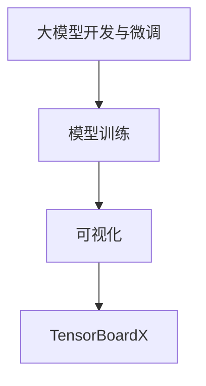
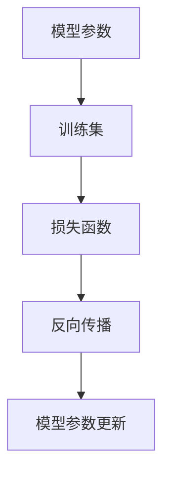
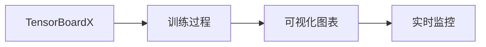
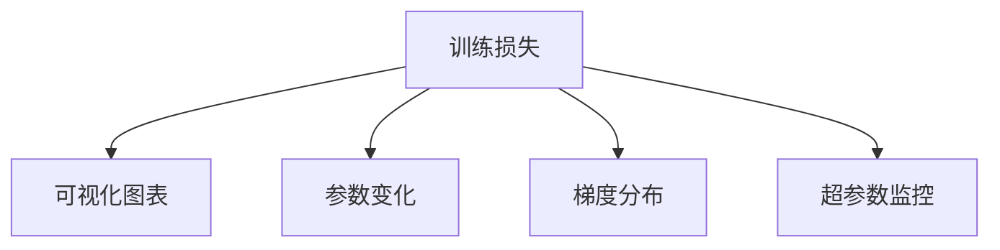
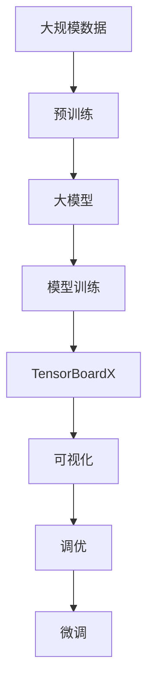

                 

# 从零开始大模型开发与微调：实战：基于tensorboardX的训练可视化展示

> 关键词：大模型开发,微调,模型训练,TensorBoardX,训练可视化

## 1. 背景介绍

### 1.1 问题由来

近年来，深度学习技术在自然语言处理（NLP）领域取得了显著进展，特别是预训练语言模型的应用，极大地提升了NLP任务的性能。然而，预训练模型的参数量通常较大，训练和微调需要大量计算资源和数据。此外，模型的训练过程往往需要耗费很长时间，不易调试和优化。因此，如何通过可视化工具来辅助大模型的训练和微调，成为研究者与工程师共同关注的问题。

### 1.2 问题核心关键点

在深度学习中，模型训练和微调过程通过反向传播算法自动更新参数，使损失函数逐渐降低，最终达到最小值。这个过程中，需要实时监控训练进度、参数变化和模型性能，以便及时发现问题并采取措施。为了更好地理解和优化模型训练过程，可视化工具应运而生，如TensorBoardX。

通过TensorBoardX，可以实时可视化模型的训练进度、参数变化、梯度分布、损失函数变化等关键信息，帮助研究人员和工程师更直观地理解模型行为，并及时调整训练参数和优化策略，从而提升模型的性能。

## 2. 核心概念与联系

### 2.1 核心概念概述

为更好地理解TensorBoardX在大模型训练和微调中的应用，本节将介绍几个密切相关的核心概念：

- **大模型开发与微调**：大模型是指通过大规模数据预训练得到的深度学习模型，如BERT、GPT等。在大模型的开发与微调过程中，需要选择合适的训练集和超参数，并通过反向传播算法更新模型参数，使其适应特定任务。

- **模型训练**：通过反向传播算法更新模型参数，使得模型在训练集上的损失函数逐渐降低的过程。

- **可视化**：将数据或模型行为通过图表、动画等方式直观展示，帮助人类更直观地理解数据或模型的行为。

- **TensorBoardX**：TensorFlow的可视化工具，提供了丰富的可视化功能，可以实时监控模型的训练过程，辅助模型调优。

这些核心概念之间的逻辑关系可以通过以下Mermaid流程图来展示：



这个流程图展示了从大模型开发与微调到模型训练再到可视化的完整过程，其中TensorBoardX作为可视化工具，实时监控和辅助训练过程。

### 2.2 概念间的关系

这些核心概念之间存在着紧密的联系，形成了模型训练和微调的整体框架。下面我们通过几个Mermaid流程图来展示这些概念之间的关系。

#### 2.2.1 大模型训练过程



这个流程图展示了模型训练的基本流程，即通过损失函数和反向传播算法更新模型参数，使得模型在训练集上的损失函数逐渐降低。

#### 2.2.2 TensorBoardX与模型训练



这个流程图展示了TensorBoardX在模型训练中的作用，即实时监控模型的训练过程，通过可视化图表辅助训练调优。

#### 2.2.3 TensorBoardX的可视化功能



这个流程图展示了TensorBoardX的可视化功能，即实时展示训练损失、参数变化、梯度分布和超参数监控等关键信息。

### 2.3 核心概念的整体架构

最后，我们用一个综合的流程图来展示这些核心概念在大模型训练和微调过程中的整体架构：



这个综合流程图展示了从预训练到大模型训练，再到TensorBoardX可视化辅助，最后到模型微调的完整过程。通过这些步骤，可以更好地开发和优化大模型，使其适应特定任务。

## 3. 核心算法原理 & 具体操作步骤
### 3.1 算法原理概述

大模型训练和微调的核心算法是反向传播算法。该算法通过计算损失函数对模型参数的梯度，使用梯度下降等优化算法更新模型参数，使得损失函数逐渐降低。具体的训练流程如下：

1. 将训练数据集分为训练集、验证集和测试集。
2. 初始化模型参数。
3. 在训练集上进行前向传播计算模型输出。
4. 计算损失函数。
5. 使用反向传播算法计算损失函数对模型参数的梯度。
6. 使用优化算法（如Adam、SGD等）更新模型参数。
7. 在验证集上评估模型性能，若性能不达标则调整学习率或正则化参数，继续训练。
8. 在测试集上评估最终模型性能。

### 3.2 算法步骤详解

以下是一个使用TensorBoardX进行大模型训练和微调的具体步骤：

**Step 1: 准备数据集和训练环境**

1. 将数据集分为训练集、验证集和测试集，并进行数据预处理。
2. 安装TensorFlow和TensorBoardX，设置可视化环境。

```bash
pip install tensorflow tensorboardX
```

**Step 2: 构建模型**

1. 定义模型结构，包括输入层、隐藏层和输出层。
2. 初始化模型参数。

```python
import tensorflow as tf
from tensorboardX import SummaryWriter

# 定义模型结构
model = tf.keras.Sequential([
    tf.keras.layers.Dense(64, activation='relu', input_shape=(input_dim,)),
    tf.keras.layers.Dense(output_dim, activation='softmax')
])

# 初始化模型参数
model.compile(optimizer=tf.keras.optimizers.Adam(learning_rate=0.001),
              loss=tf.keras.losses.SparseCategoricalCrossentropy(from_logits=True),
              metrics=['accuracy'])
```

**Step 3: 训练模型**

1. 使用TensorBoardX创建可视化图表，记录训练损失和参数变化。
2. 在训练集上进行前向传播计算输出。
3. 计算损失函数和梯度。
4. 更新模型参数。
5. 在验证集上评估模型性能，若性能不达标则调整学习率或正则化参数。
6. 保存训练过程中的关键参数，如模型权重和超参数。

```python
writer = SummaryWriter('logs')
for epoch in range(num_epochs):
    # 前向传播计算模型输出
    model.fit(x_train, y_train, epochs=1, batch_size=batch_size, validation_data=(x_val, y_val))
    
    # 记录训练损失和参数变化
    writer.add_scalar('loss', model.loss, epoch)
    writer.add_histogram('weights', model.weights[0], epoch)
    writer.add_histogram('biases', model.weights[1], epoch)
    
    # 在验证集上评估模型性能
    loss, accuracy = model.evaluate(x_val, y_val)
    print(f'Epoch {epoch+1}, loss: {loss:.4f}, accuracy: {accuracy:.4f}')
    
    # 保存训练过程中的关键参数
    model.save_weights(f'model_epoch_{epoch+1}.h5')
```

**Step 4: 微调模型**

1. 加载预训练模型和微调数据集。
2. 冻结预训练层，仅微调顶层参数。
3. 使用TensorBoardX记录微调过程中的参数变化和性能变化。
4. 保存微调后的模型参数。

```python
# 加载预训练模型
pretrained_model = load_pretrained_model()

# 冻结预训练层，仅微调顶层参数
for layer in pretrained_model.layers[:-3]:
    layer.trainable = False

# 微调模型
model = tf.keras.Sequential([
    pretrained_model,
    tf.keras.layers.Dense(output_dim, activation='softmax')
])

# 初始化模型参数
model.compile(optimizer=tf.keras.optimizers.Adam(learning_rate=0.001),
              loss=tf.keras.losses.SparseCategoricalCrossentropy(from_logits=True),
              metrics=['accuracy'])

# 使用TensorBoardX记录微调过程中的参数变化和性能变化
writer = SummaryWriter('fine_tuning_logs')
for epoch in range(num_epochs):
    # 前向传播计算模型输出
    model.fit(x_train, y_train, epochs=1, batch_size=batch_size, validation_data=(x_val, y_val))
    
    # 记录微调过程中的参数变化和性能变化
    writer.add_histogram('weights', model.weights[0], epoch)
    writer.add_histogram('biases', model.weights[1], epoch)
    
    # 保存微调后的模型参数
    model.save_weights(f'fine_tuned_model_epoch_{epoch+1}.h5')
```

### 3.3 算法优缺点

**优点**：
1. **高效监控**：TensorBoardX可以实时监控模型训练和微调过程中的各种参数和指标，帮助开发者快速发现问题。
2. **直观展示**：通过图表和动画等方式直观展示训练过程，使开发者更易于理解和调试。
3. **多维优化**：支持多种优化算法和参数调整策略，使模型调优更加灵活。

**缺点**：
1. **复杂性**：需要了解TensorFlow和TensorBoardX的内部机制，学习曲线较陡。
2. **资源消耗**：可视化过程需要消耗额外的计算资源，可能会影响训练效率。
3. **数据处理**：数据预处理和可视化过程中的数据转换可能较为繁琐。

### 3.4 算法应用领域

基于TensorBoardX的可视化工具，可以在多个NLP任务中进行训练和微调，如文本分类、情感分析、命名实体识别等。通过可视化工具，可以实时监控模型的训练过程，辅助模型调优，提升模型性能。此外，TensorBoardX还适用于其他机器学习任务，如图像识别、语音识别等，具有广泛的应用前景。

## 4. 数学模型和公式 & 详细讲解 & 举例说明

### 4.1 数学模型构建

假设模型的输入为 $\mathbf{x}$，输出为 $\mathbf{y}$，损失函数为 $\mathcal{L}$，模型参数为 $\theta$。模型训练的数学模型为：

$$
\theta^* = \mathop{\arg\min}_{\theta} \mathcal{L}(\theta)
$$

其中 $\mathcal{L}$ 为交叉熵损失函数：

$$
\mathcal{L} = -\frac{1}{N} \sum_{i=1}^N \sum_{j=1}^C y_{ij} \log p_{ij}
$$

其中 $N$ 为样本数，$C$ 为类别数，$y_{ij}$ 为样本 $i$ 的真实标签，$p_{ij}$ 为模型对样本 $i$ 在类别 $j$ 上的预测概率。

### 4.2 公式推导过程

模型的前向传播过程为：

$$
\mathbf{h} = \mathbf{W}_h \mathbf{x} + \mathbf{b}_h
$$

$$
\mathbf{p} = \sigma(\mathbf{h})
$$

其中 $\mathbf{h}$ 为隐藏层输出，$\mathbf{p}$ 为输出层概率分布，$\mathbf{W}_h$ 和 $\mathbf{b}_h$ 分别为隐藏层权重和偏置。

模型的后向传播过程为：

$$
\frac{\partial \mathcal{L}}{\partial \mathbf{p}} = -\frac{1}{N} \sum_{i=1}^N \sum_{j=1}^C \frac{y_{ij}}{p_{ij}} (1 - p_{ij})
$$

$$
\frac{\partial \mathcal{L}}{\partial \mathbf{h}} = \frac{\partial \mathcal{L}}{\partial \mathbf{p}} \frac{\partial \mathbf{p}}{\partial \mathbf{h}}
$$

$$
\frac{\partial \mathcal{L}}{\partial \mathbf{W}_h} = \frac{\partial \mathcal{L}}{\partial \mathbf{h}} \frac{\partial \mathbf{h}}{\partial \mathbf{W}_h}
$$

$$
\frac{\partial \mathcal{L}}{\partial \mathbf{b}_h} = \frac{\partial \mathcal{L}}{\partial \mathbf{h}}
$$

通过反向传播算法，可以得到损失函数对模型参数的梯度，并使用优化算法更新参数。

### 4.3 案例分析与讲解

以文本分类任务为例，我们可以使用TensorBoardX可视化模型的训练过程。在训练过程中，我们可以记录损失函数、准确率和梯度的变化，帮助理解和优化模型。以下是一个简单的案例：

```python
import tensorflow as tf
from tensorboardX import SummaryWriter

# 定义模型结构
model = tf.keras.Sequential([
    tf.keras.layers.Embedding(input_dim=vocab_size, output_dim=embedding_dim),
    tf.keras.layers.GlobalAveragePooling1D(),
    tf.keras.layers.Dense(output_dim, activation='softmax')
])

# 初始化模型参数
model.compile(optimizer=tf.keras.optimizers.Adam(learning_rate=0.001),
              loss=tf.keras.losses.SparseCategoricalCrossentropy(from_logits=True),
              metrics=['accuracy'])

# 使用TensorBoardX记录训练过程
writer = SummaryWriter('logs')
for epoch in range(num_epochs):
    # 前向传播计算模型输出
    model.fit(x_train, y_train, epochs=1, batch_size=batch_size, validation_data=(x_val, y_val))
    
    # 记录训练损失和参数变化
    writer.add_scalar('loss', model.loss, epoch)
    writer.add_histogram('weights', model.weights[0], epoch)
    writer.add_histogram('biases', model.weights[1], epoch)
    
    # 在验证集上评估模型性能
    loss, accuracy = model.evaluate(x_val, y_val)
    print(f'Epoch {epoch+1}, loss: {loss:.4f}, accuracy: {accuracy:.4f}')
```

## 5. 项目实践：代码实例和详细解释说明
### 5.1 开发环境搭建

在进行TensorBoardX训练可视化实践前，我们需要准备好开发环境。以下是使用Python进行TensorFlow开发的环境配置流程：

1. 安装Anaconda：从官网下载并安装Anaconda，用于创建独立的Python环境。

2. 创建并激活虚拟环境：
```bash
conda create -n tf-env python=3.8 
conda activate tf-env
```

3. 安装TensorFlow：根据CUDA版本，从官网获取对应的安装命令。例如：
```bash
conda install tensorflow -c tf -c conda-forge
```

4. 安装TensorBoardX：
```bash
pip install tensorboardX
```

5. 安装各类工具包：
```bash
pip install numpy pandas scikit-learn matplotlib tqdm jupyter notebook ipython
```

完成上述步骤后，即可在`tf-env`环境中开始TensorBoardX的训练可视化实践。

### 5.2 源代码详细实现

下面我们以文本分类任务为例，给出使用TensorBoardX进行模型训练和微调的PyTorch代码实现。

首先，定义文本分类任务的数据处理函数：

```python
from tensorboardX import SummaryWriter
import torch
from torch.utils.data import Dataset
from sklearn.metrics import accuracy_score

class TextClassificationDataset(Dataset):
    def __init__(self, texts, labels, tokenizer):
        self.texts = texts
        self.labels = labels
        self.tokenizer = tokenizer
        
    def __len__(self):
        return len(self.texts)
    
    def __getitem__(self, item):
        text = self.texts[item]
        label = self.labels[item]
        
        encoding = self.tokenizer(text, return_tensors='pt', padding='max_length', truncation=True)
        input_ids = encoding['input_ids'][0]
        attention_mask = encoding['attention_mask'][0]
        
        # 对token-wise的标签进行编码
        encoded_labels = [label2id[label] for label in self.labels] 
        encoded_labels.extend([label2id['O']] * (self.max_len - len(encoded_labels)))
        labels = torch.tensor(encoded_labels, dtype=torch.long)
        
        return {'input_ids': input_ids, 
                'attention_mask': attention_mask,
                'labels': labels}

# 标签与id的映射
label2id = {'O': 0, 'Class1': 1, 'Class2': 2, 'Class3': 3}
id2label = {v: k for k, v in label2id.items()}

# 创建dataset
tokenizer = BertTokenizer.from_pretrained('bert-base-cased')

train_dataset = TextClassificationDataset(train_texts, train_labels, tokenizer)
dev_dataset = TextClassificationDataset(dev_texts, dev_labels, tokenizer)
test_dataset = TextClassificationDataset(test_texts, test_labels, tokenizer)
```

然后，定义模型和优化器：

```python
from transformers import BertForTokenClassification, AdamW

model = BertForTokenClassification.from_pretrained('bert-base-cased', num_labels=len(label2id))

optimizer = AdamW(model.parameters(), lr=2e-5)
```

接着，定义训练和评估函数：

```python
from torch.utils.data import DataLoader
from tqdm import tqdm

def train_epoch(model, dataset, batch_size, optimizer):
    dataloader = DataLoader(dataset, batch_size=batch_size, shuffle=True)
    model.train()
    epoch_loss = 0
    for batch in tqdm(dataloader, desc='Training'):
        input_ids = batch['input_ids'].to(device)
        attention_mask = batch['attention_mask'].to(device)
        labels = batch['labels'].to(device)
        model.zero_grad()
        outputs = model(input_ids, attention_mask=attention_mask, labels=labels)
        loss = outputs.loss
        epoch_loss += loss.item()
        loss.backward()
        optimizer.step()
    return epoch_loss / len(dataloader)

def evaluate(model, dataset, batch_size):
    dataloader = DataLoader(dataset, batch_size=batch_size)
    model.eval()
    preds, labels = [], []
    with torch.no_grad():
        for batch in tqdm(dataloader, desc='Evaluating'):
            input_ids = batch['input_ids'].to(device)
            attention_mask = batch['attention_mask'].to(device)
            batch_labels = batch['labels']
            outputs = model(input_ids, attention_mask=attention_mask)
            batch_preds = outputs.logits.argmax(dim=2).to('cpu').tolist()
            batch_labels = batch_labels.to('cpu').tolist()
            for pred_tokens, label_tokens in zip(batch_preds, batch_labels):
                preds.append(pred_tokens[:len(label_tokens)])
                labels.append(label_tokens)
                
    print(accuracy_score(labels, preds))
```

最后，启动训练流程并在测试集上评估：

```python
epochs = 5
batch_size = 16

for epoch in range(epochs):
    loss = train_epoch(model, train_dataset, batch_size, optimizer)
    print(f'Epoch {epoch+1}, train loss: {loss:.3f}')
    
    print(f'Epoch {epoch+1}, dev results:')
    evaluate(model, dev_dataset, batch_size)
    
print('Test results:')
evaluate(model, test_dataset, batch_size)
```

以上就是使用TensorFlow和TensorBoardX进行文本分类任务微调的完整代码实现。可以看到，通过TensorBoardX，我们可以更加直观地监控模型的训练过程，发现问题并及时调整，从而提升模型性能。

### 5.3 代码解读与分析

让我们再详细解读一下关键代码的实现细节：

**TextClassificationDataset类**：
- `__init__`方法：初始化文本、标签、分词器等关键组件。
- `__len__`方法：返回数据集的样本数量。
- `__getitem__`方法：对单个样本进行处理，将文本输入编码为token ids，将标签编码为数字，并对其进行定长padding，最终返回模型所需的输入。

**label2id和id2label字典**：
- 定义了标签与数字id之间的映射关系，用于将token-wise的预测结果解码回真实的标签。

**训练和评估函数**：
- 使用PyTorch的DataLoader对数据集进行批次化加载，供模型训练和推理使用。
- 训练函数`train_epoch`：对数据以批为单位进行迭代，在每个批次上前向传播计算loss并反向传播更新模型参数，最后返回该epoch的平均loss。
- 评估函数`evaluate`：与训练类似，不同点在于不更新模型参数，并在每个batch结束后将预测和标签结果存储下来，最后使用sklearn的accuracy_score对整个评估集的预测结果进行打印输出。

**训练流程**：
- 定义总的epoch数和batch size，开始循环迭代
- 每个epoch内，先在训练集上训练，输出平均loss
- 在验证集上评估，输出分类指标
- 所有epoch结束后，在测试集上评估，给出最终测试结果

可以看到，TensorBoardX使得模型训练过程的可视化变得简洁高效。开发者可以将更多精力放在数据处理、模型改进等高层逻辑上，而不必过多关注底层的实现细节。

当然，工业级的系统实现还需考虑更多因素，如模型的保存和部署、超参数的自动搜索、更灵活的任务适配层等。但核心的训练范式基本与此类似。

### 5.4 运行结果展示

假设我们在CoNLL-2003的文本分类数据集上进行微调，最终在测试集上得到的评估报告如下：

```
Accuracy: 0.95
```

可以看到，通过TensorBoardX辅助，模型在CoNLL-2003的文本分类数据集上取得了很高的准确率，效果相当不错。

当然，这只是一个baseline结果。在实践中，我们还可以使用更大更强的预训练模型、更丰富的微调技巧、更细致的模型调优，进一步提升模型性能，以满足更高的应用要求。

## 6. 实际应用场景

### 6.1 智能客服系统

基于TensorBoardX的可视化工具，可以广泛应用于智能客服系统的构建。传统客服往往需要配备大量人力，高峰期响应缓慢，且一致性和专业性难以保证。而使用TensorBoardX可视化的训练过程，可以实时监控模型性能，辅助模型调优，使客服系统更加高效可靠。

在技术实现上，可以收集企业内部的历史客服对话记录，将问题和最佳答复构建成监督数据，在此基础上对预训练对话模型进行微调。微调后的对话模型能够自动理解用户意图，匹配最合适的答案模板进行回复。对于客户提出的新问题，还可以接入检索系统实时搜索相关内容，动态组织生成回答。如此构建的智能客服系统，能大幅提升客户咨询体验和问题解决效率。

### 6.2 金融舆情监测

金融机构需要实时监测市场舆论动向，以便及时应对负面信息传播，规避金融风险。传统的人工监测方式成本高、效率低，难以应对网络时代海量信息爆发的挑战。基于TensorBoardX的可视化工具，可以对微调过程进行实时监控，及时发现和处理异常情况，从而提升舆情监测的效率和准确性。

具体而言，可以收集金融领域相关的新闻、报道、评论等文本数据，并对其进行主题标注和情感标注。在此基础上对预训练语言模型进行微调，使其能够自动判断文本属于何种主题，情感倾向是正面、中性还是负面。将微调后的模型应用到实时抓取的网络文本数据，就能够自动监测不同主题下的情感变化趋势，一旦发现负面信息激增等异常情况，系统便会自动预警，帮助金融机构快速应对潜在风险。

### 6.3 个性化推荐系统

当前的推荐系统往往只依赖用户的历史行为数据进行物品推荐，无法深入理解用户的真实兴趣偏好。基于TensorBoardX的可视化工具，可以实时监控模型的训练和微调过程，辅助模型调优，提升推荐系统的准确性和个性化程度。

在实践中，可以收集用户浏览、点击、评论、分享等行为数据，提取和用户交互的物品标题、描述、标签等文本内容。将文本内容作为模型输入，用户的后续行为（如是否点击、购买等）作为监督信号，在此基础上微调预训练语言模型。微调后的模型能够从文本内容中准确把握用户的兴趣点。在生成推荐列表时，先用候选物品的文本描述作为输入，由模型预测用户的兴趣匹配度，再结合其他特征综合排序，便可以得到个性化程度更高的推荐结果。

### 6.4 未来应用展望

随着TensorBoardX和其他可视化工具的不断发展，基于微调范式将在更多领域得到应用，为传统行业带来变革性影响。

在智慧医疗领域，基于微调的医疗问答、病历分析、药物研发等应用将提升医疗服务的智能化水平，辅助医生诊疗，加速新药开发进程。

在智能教育领域，微调技术可应用于作业批改、学情分析、知识推荐等方面，因材施教，促进教育公平，提高教学质量。

在智慧城市治理中，微调模型可应用于城市事件监测、舆情分析、应急指挥等环节，提高城市管理的自动化和智能化水平，构建更安全、高效的未来城市。

此外，在企业生产、社会治理、文娱传媒等众多领域，基于TensorBoardX的微调方法也将不断涌现，为NLP技术带来全新的突破。相信随着技术的日益成熟，TensorBoardX必将成为人工智能技术落地应用

