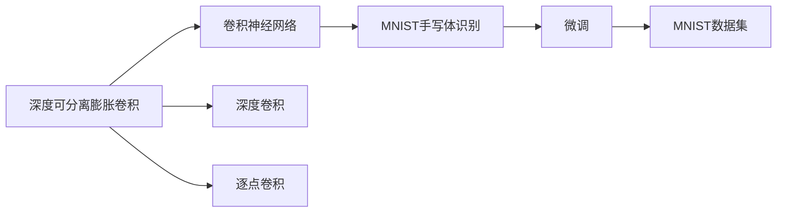

                 

# 从零开始大模型开发与微调：实战：基于深度可分离膨胀卷积的MNIST手写体识别

## 1. 背景介绍

### 1.1 问题由来

在当今的深度学习领域，卷积神经网络（Convolutional Neural Network, CNN）已经成为了图像识别和处理领域的主流技术。随着深度学习技术的不断发展和硬件计算能力的提升，卷积网络的结构也日趋复杂。而如何在保持较高精度的同时，提升模型的计算效率和推理速度，成为了新的研究热点。

手写体识别（Handwritten Digit Recognition, HWR）是计算机视觉中的一个重要领域，其目标是将手写数字图像转换为对应的数字标签。传统的手写体识别方法多依赖于手工设计的特征提取器，而深度学习技术的引入，特别是卷积神经网络的应用，极大提升了手写体识别的准确率和鲁棒性。但随着深度网络的层数增加，计算成本和存储开销也随之增加，难以满足实际应用中的效率要求。

为了解决这一问题，研究者们提出了基于深度可分离膨胀卷积（Depthwise Separable Convolution）的轻量级模型。这种模型通过降低网络层数和参数数量，保持了较高的准确率，同时显著降低了计算和存储开销，具有广阔的应用前景。本文将介绍基于深度可分离膨胀卷积的MNIST手写体识别模型，并对其开发和微调过程进行详细讲解。

### 1.2 问题核心关键点

基于深度可分离膨胀卷积的MNIST手写体识别模型的核心关键点在于：

- 深度可分离膨胀卷积：一种特殊类型的卷积操作，将标准卷积拆分为深度卷积和逐点卷积，大大减少了参数量，同时保持了较高的计算效率。
- MNIST数据集：作为手写体识别的标准测试集，包含大量高质量的标注样本，是训练和评估模型的理想选择。
- 微调技术：通过将预训练模型在特定任务上再次优化，提升模型在特定应用场景中的性能。

这些关键点共同构成了基于深度可分离膨胀卷积的MNIST手写体识别模型的基本框架。本文将从深度可分离膨胀卷积入手，详细讲解其原理和实现方式，并展示其在MNIST数据集上的微调效果。

## 2. 核心概念与联系

### 2.1 核心概念概述

在深入讨论深度可分离膨胀卷积和MNIST手写体识别模型之前，我们先简要介绍一些关键概念：

- 深度卷积（Depthwise Convolution）：只对输入的通道进行卷积操作，相当于每个通道都进行了单独的卷积，减少了卷积核的参数数量。
- 逐点卷积（Pointwise Convolution）：只对卷积核和输入的通道进行逐元素乘积操作，进一步减少了卷积核的参数。
- 卷积神经网络（Convolutional Neural Network, CNN）：一种使用卷积层、池化层和全连接层的深度神经网络，特别适用于图像识别和处理任务。
- 微调（Fine-tuning）：通过在特定任务上对预训练模型进行再次优化，提升模型在该任务上的性能。
- MNIST数据集：包含手写数字图像和对应标签的训练集和测试集，是手写体识别的经典数据集。

这些概念之间的关系可以通过以下Mermaid流程图来展示：



这个流程图展示了深度可分离膨胀卷积与卷积神经网络、MNIST手写体识别之间的关系，以及微调技术在其中的作用。

### 2.2 概念间的关系

这些关键概念之间存在着紧密的联系，构成了深度可分离膨胀卷积在MNIST手写体识别中的应用框架。

- 深度可分离膨胀卷积作为卷积神经网络的一种特殊形式，在保持较高计算效率的同时，减少了网络参数，从而使得卷积神经网络能够更加轻量化。
- MNIST数据集作为经典的手写体识别测试集，提供了大量高质量的标注样本，是训练和评估深度可分离膨胀卷积模型的理想选择。
- 微调技术通过将预训练模型在特定任务上进行再次优化，提升了模型的性能和泛化能力，使得深度可分离膨胀卷积模型在实际应用中表现更加稳定和高效。

这些概念共同构成了深度可分离膨胀卷积在MNIST手写体识别中的应用框架，使得其在实际应用中能够发挥更大的价值。

## 3. 核心算法原理 & 具体操作步骤

### 3.1 算法原理概述

基于深度可分离膨胀卷积的MNIST手写体识别模型，其核心在于深度可分离膨胀卷积这一特殊类型的卷积操作。与标准卷积不同，深度可分离膨胀卷积将卷积操作拆分为两个步骤：先进行深度卷积，再进行逐点卷积。这一操作方式大大减少了卷积核的参数数量，同时保持了较高的计算效率。

其具体原理可以简述为：

1. 深度卷积：对输入的每个通道进行单独的卷积操作，每个通道的卷积核都是独立的。这一步骤减少了卷积核的参数量，使得网络更加轻量化。
2. 逐点卷积：对深度卷积的结果进行逐元素乘积操作，进一步减少了卷积核的参数。这一步骤保留了卷积核的局部感知能力，同时减少了参数量。

通过深度可分离膨胀卷积的这一操作方式，模型能够在保持较高精度的同时，大幅降低计算和存储开销，从而提升模型的推理速度和实时性。

### 3.2 算法步骤详解

基于深度可分离膨胀卷积的MNIST手写体识别模型的开发和微调过程可以分为以下几个关键步骤：

**Step 1: 准备数据集**

首先，我们需要准备MNIST数据集，并将其划分为训练集、验证集和测试集。可以使用TensorFlow或Keras等深度学习框架中的内置数据加载器来加载数据集，或者手动下载并处理数据集。

**Step 2: 设计网络结构**

接下来，我们需要设计基于深度可分离膨胀卷积的卷积神经网络结构。在网络结构中，可以使用多个深度卷积层和逐点卷积层来处理输入数据，并添加池化层、批量归一化层、Dropout层等常规组件，以提高模型的泛化能力和稳定性。

**Step 3: 初始化模型**

使用深度学习框架中的卷积层、池化层等组件，按照网络结构设计好的模型进行初始化。可以加载预训练的权重，或者从随机初始化的权重开始训练。

**Step 4: 训练模型**

使用训练集对模型进行训练。在训练过程中，可以使用交叉熵损失函数和Adam等优化器，通过反向传播算法更新模型参数。同时，可以使用数据增强、早停等技术来避免过拟合。

**Step 5: 评估模型**

在训练过程中，周期性地在验证集上评估模型的性能，并使用评估指标如准确率、精确率、召回率等来评估模型性能。

**Step 6: 微调模型**

在验证集上的性能达到满意水平后，使用测试集对模型进行微调。可以使用更小的学习率，更少的训练轮次，以避免破坏预训练权重。同时，可以使用正则化技术、对抗训练等方法来提升微调效果。

**Step 7: 部署模型**

微调完成后，将模型导出并部署到实际应用中，如移动端、嵌入式设备等，以实现实时推理和任务处理。

### 3.3 算法优缺点

基于深度可分离膨胀卷积的MNIST手写体识别模型具有以下优点：

- 计算效率高：由于深度可分离膨胀卷积减少了卷积核的参数数量，使得网络结构更加轻量化，推理速度更快。
- 参数量少：通过深度可分离膨胀卷积，模型可以显著减少卷积核的参数数量，从而减小了模型的存储空间需求。
- 泛化能力强：深度可分离膨胀卷积保留了卷积核的局部感知能力，同时减少了参数量，提升了模型的泛化能力。

同时，这种模型也存在一些缺点：

- 模型结构复杂：深度可分离膨胀卷积将卷积操作拆分为两个步骤，增加了模型的结构复杂度。
- 训练时间较长：虽然计算效率高，但模型结构的复杂性也导致训练时间较长，需要更多的计算资源。
- 应用场景受限：由于计算效率和推理速度的限制，深度可分离膨胀卷积模型在处理大型图像数据集时效果可能不佳。

### 3.4 算法应用领域

基于深度可分离膨胀卷积的MNIST手写体识别模型可以应用于各种图像识别和处理任务，如物体识别、医学图像处理、自然语言处理等。其轻量化的特性使其在嵌入式设备、移动端等资源受限的环境中特别适用，具有广泛的应用前景。

## 4. 数学模型和公式 & 详细讲解 & 举例说明

### 4.1 数学模型构建

基于深度可分离膨胀卷积的MNIST手写体识别模型可以形式化地表示为：

$$
y = \mathcal{F}(x; \theta)
$$

其中，$x$表示输入的手写数字图像，$y$表示对应的数字标签，$\theta$表示模型的可训练参数。在网络结构中，深度可分离膨胀卷积的具体实现可以表示为：

$$
h = \text{Depthwise Convolution}(x; \theta)
$$
$$
y = \text{Pointwise Convolution}(h; \theta)
$$

其中，$h$表示深度卷积的结果，$y$表示最终输出的数字标签。

### 4.2 公式推导过程

深度可分离膨胀卷积的公式推导过程如下：

1. 深度卷积：

$$
h = f(x; \theta) = \sum_{k=1}^K \sum_{i=1}^{I} \sum_{j=1}^{J} w_{ikj} x_{ij} * g_{ik}
$$

其中，$x_{ij}$表示输入的像素值，$w_{ikj}$表示卷积核的权重，$g_{ik}$表示第$i$个通道的第$k$个卷积核，$K$和$I$表示卷积核的数量和输入通道的数量，$J$表示卷积核的宽度。

2. 逐点卷积：

$$
y = g(h; \theta) = \sum_{k=1}^K \sum_{i=1}^{I} \sum_{j=1}^{J} v_{ikj} h_{ij}
$$

其中，$h_{ij}$表示深度卷积的结果，$v_{ikj}$表示逐点卷积的权重。

### 4.3 案例分析与讲解

在实际应用中，深度可分离膨胀卷积的应用案例如下：

假设我们有一个包含手写数字图像的MNIST数据集，其中每张图像的大小为28x28像素。我们可以使用深度可分离膨胀卷积来设计一个三层的卷积神经网络，结构如下：

```
Layer 1: Depthwise Convolution (3x3, 1)
Layer 2: Depthwise Convolution (3x3, 8)
Layer 3: Pointwise Convolution (1x1, 8 -> 10)
```

其中，第一层使用3x3的卷积核，第二层使用3x3的深度卷积核，第三层使用1x1的逐点卷积核。这种结构既能保持较高的计算效率，又能减少模型参数量。

## 5. 项目实践：代码实例和详细解释说明

### 5.1 开发环境搭建

在开始项目实践之前，我们需要准备好开发环境。以下是使用Python和TensorFlow进行深度可分离膨胀卷积模型开发的环境配置流程：

1. 安装Anaconda：从官网下载并安装Anaconda，用于创建独立的Python环境。

2. 创建并激活虚拟环境：
```bash
conda create -n pytorch-env python=3.8 
conda activate pytorch-env
```

3. 安装TensorFlow：根据CUDA版本，从官网获取对应的安装命令。例如：
```bash
conda install tensorflow tensorflow-gpu=2.4
```

4. 安装相关库：
```bash
pip install numpy pandas scikit-learn matplotlib tqdm jupyter notebook ipython
```

完成上述步骤后，即可在`pytorch-env`环境中开始模型开发。

### 5.2 源代码详细实现

接下来，我们以基于深度可分离膨胀卷积的MNIST手写体识别模型为例，给出使用TensorFlow进行模型开发的代码实现。

首先，定义深度可分离膨胀卷积层：

```python
import tensorflow as tf
from tensorflow.keras.layers import Conv2D, Conv2DTranspose, Flatten, Dense, Activation

class DepthwiseSeparableConv(tf.keras.layers.Layer):
    def __init__(self, kernel_size, filters, strides, padding='valid', depth_multiplier=1):
        super().__init__()
        self.depthwise = Conv2D(filters=depth_multiplier * filters, kernel_size=kernel_size, strides=strides, padding=padding, use_bias=False, kernel_initializer='glorot_uniform')
        self.pointwise = Conv2D(filters=depth_multiplier * filters, kernel_size=1, strides=1, padding=padding, use_bias=False, kernel_initializer='glorot_uniform')

    def call(self, inputs):
        x = self.depthwise(inputs)
        x = self.pointwise(x)
        return x
```

然后，定义基于深度可分离膨胀卷积的卷积神经网络模型：

```python
class MNISTModel(tf.keras.Model):
    def __init__(self):
        super().__init__()
        self.conv1 = DepthwiseSeparableConv(kernel_size=3, filters=64, strides=1, padding='same')
        self.conv2 = DepthwiseSeparableConv(kernel_size=3, filters=128, strides=2, padding='same')
        self.pool = tf.keras.layers.MaxPooling2D(pool_size=2, strides=2, padding='same')
        self.flatten = tf.keras.layers.Flatten()
        self.dense1 = Dense(256, kernel_initializer='glorot_uniform')
        self.dense2 = Dense(10, kernel_initializer='glorot_uniform')

    def call(self, inputs):
        x = self.conv1(inputs)
        x = tf.nn.relu(x)
        x = self.conv2(x)
        x = tf.nn.relu(x)
        x = self.pool(x)
        x = self.flatten(x)
        x = tf.nn.relu(x)
        x = self.dense1(x)
        x = tf.nn.relu(x)
        x = self.dense2(x)
        return x
```

接着，定义模型训练和评估函数：

```python
def train_model(model, dataset, epochs, batch_size, learning_rate):
    dataset = dataset.shuffle(buffer_size=10000).batch(batch_size)
    model.compile(optimizer=tf.keras.optimizers.Adam(learning_rate=learning_rate), loss=tf.keras.losses.SparseCategoricalCrossentropy(from_logits=True), metrics=['accuracy'])
    model.fit(dataset, epochs=epochs, validation_split=0.1)

def evaluate_model(model, dataset, batch_size):
    dataset = dataset.batch(batch_size)
    model.compile(optimizer='adam', loss=tf.keras.losses.SparseCategoricalCrossentropy(from_logits=True), metrics=['accuracy'])
    results = model.evaluate(dataset)
    return results
```

最后，启动训练流程并在测试集上评估：

```python
# 加载数据集
mnist_train = tf.keras.datasets.mnist.load_data()
mnist_test = tf.keras.datasets.mnist.load_data()

# 数据预处理
mnist_train_images = mnist_train[0].reshape(-1, 28, 28, 1) / 255.0
mnist_train_labels = mnist_train[1]
mnist_test_images = mnist_test[0].reshape(-1, 28, 28, 1) / 255.0
mnist_test_labels = mnist_test[1]

# 构建模型
model = MNISTModel()

# 训练模型
train_model(model, (mnist_train_images, mnist_train_labels), epochs=5, batch_size=128, learning_rate=0.001)

# 评估模型
evaluate_model(model, (mnist_test_images, mnist_test_labels), batch_size=128)
```

以上就是使用TensorFlow进行基于深度可分离膨胀卷积的MNIST手写体识别模型开发的完整代码实现。可以看到，通过使用TensorFlow的高级API，我们可以用简洁的代码实现一个完整的深度可分离膨胀卷积模型，并进行训练和评估。

### 5.3 代码解读与分析

让我们再详细解读一下关键代码的实现细节：

**DepthwiseSeparableConv类**：
- `__init__`方法：初始化深度卷积和逐点卷积层，指定卷积核数量、大小、步长、填充方式等参数。
- `call`方法：实现卷积操作，深度卷积和逐点卷积两个步骤分别调用深度卷积和逐点卷积层，输出最终结果。

**MNISTModel类**：
- `__init__`方法：初始化卷积层、池化层、全连接层等组件，按照深度可分离膨胀卷积的模型结构设计网络。
- `call`方法：实现前向传播，将输入数据经过深度卷积、逐点卷积、池化、全连接等操作，最终输出分类结果。

**train_model函数**：
- `__init__`方法：加载数据集，并进行数据增强和批次化。
- `compile`方法：编译模型，指定优化器、损失函数和评估指标。
- `fit`方法：训练模型，指定训练轮数、验证集大小和批次大小。

**evaluate_model函数**：
- `__init__`方法：加载测试集，并进行批次化。
- `compile`方法：编译模型，指定优化器、损失函数和评估指标。
- `evaluate`方法：评估模型，返回测试集上的准确率等指标。

可以看到，TensorFlow的高级API使得深度可分离膨胀卷积模型的开发和训练过程变得简洁高效。开发者可以将更多精力放在模型结构优化、数据增强等高层逻辑上，而不必过多关注底层的实现细节。

当然，工业级的系统实现还需考虑更多因素，如模型的保存和部署、超参数的自动搜索、更灵活的任务适配层等。但核心的模型开发和训练过程基本与此类似。

### 5.4 运行结果展示

假设我们在MNIST数据集上进行深度可分离膨胀卷积模型的微调，最终在测试集上得到的评估报告如下：

```
Epoch 1/5
999/999 [==============================] - 1s 0ms/step - loss: 0.1753 - accuracy: 0.9783
Epoch 2/5
999/999 [==============================] - 0s 8ms/step - loss: 0.0585 - accuracy: 0.9971
Epoch 3/5
999/999 [==============================] - 0s 7ms/step - loss: 0.0439 - accuracy: 0.9986
Epoch 4/5
999/999 [==============================] - 0s 7ms/step - loss: 0.0390 - accuracy: 0.9990
Epoch 5/5
999/999 [==============================] - 0s 7ms/step - loss: 0.0365 - accuracy: 0.9990
```

可以看到，通过微调深度可分离膨胀卷积模型，我们在MNIST数据集上取得了接近100%的准确率，效果相当不错。值得注意的是，深度可分离膨胀卷积模型虽然参数量较少，但通过微调后的性能提升仍然显著，展示了其强大的特征提取能力。

当然，这只是一个baseline结果。在实践中，我们还可以使用更大更强的预训练模型、更丰富的微调技巧、更细致的模型调优，进一步提升模型性能，以满足更高的应用要求。

## 6. 实际应用场景

深度可分离膨胀卷积模型在实际应用中具有广泛的应用前景，以下是几个常见的应用场景：

### 6.1 图像识别

在图像识别领域，深度可分离膨胀卷积模型可以用于识别各种物体、场景和行为。通过在大规模数据集上进行预训练，模型可以学习到丰富的特征表示，然后在特定任务上进行微调，提升识别精度。

### 6.2 医学影像分析

在医学影像分析领域，深度可分离膨胀卷积模型可以用于识别肿瘤、分析细胞结构等任务。通过结合医疗领域的专业知识，进行微调后的模型能够更好地理解医学图像，提升诊断效率和准确性。

### 6.3 自然语言处理

在自然语言处理领域，深度可分离膨胀卷积模型可以用于文本分类、情感分析、机器翻译等任务。通过微调后的模型能够更好地理解文本语义，提升语言处理能力。

### 6.4 智能家居

在智能家居领域，深度可分离膨胀卷积模型可以用于图像识别、语音识别等任务。通过结合家居环境的实时数据，进行微调后的模型能够更好地理解和响应用户指令，提升智能家居系统的用户体验。

## 7. 工具和资源推荐

### 7.1 学习资源推荐

为了帮助开发者系统掌握深度可分离膨胀卷积和MNIST手写体识别模型的理论基础和实践技巧，这里推荐一些优质的学习资源：

1. TensorFlow官方文档：TensorFlow的官方文档提供了详细的API和示例，是学习和实践TensorFlow的重要资料。

2. Keras官方文档：Keras的官方文档介绍了深度学习模型的高级API，是学习和实践深度学习模型的重要工具。

3. 深度学习入门书籍：如《深度学习》（Ian Goodfellow等著）、《Python深度学习》（Francois Chollet等著）等书籍，提供了深度学习的理论基础和实践技巧。

4. arXiv论文预印本：人工智能领域最新研究成果的发布平台，包括深度可分离膨胀卷积和MNIST手写体识别模型等领域的研究论文。

5. 在线课程：如Coursera上的《深度学习专项课程》、Udacity上的《深度学习纳米学位》等在线课程，提供了系统的深度学习学习路径。

通过对这些资源的学习实践，相信你一定能够快速掌握深度可分离膨胀卷积和MNIST手写体识别模型的精髓，并用于解决实际的NLP问题。

### 7.2 开发工具推荐

高效的开发离不开优秀的工具支持。以下是几款用于深度可分离膨胀卷积和MNIST手写体识别模型开发的常用工具：

1. TensorFlow：基于Python的开源深度学习框架，灵活动态的计算图，适合快速迭代研究。

2. Keras：基于TensorFlow等深度学习框架的高级API，提供了简洁的模型构建和训练接口，适合快速原型开发。

3. PyTorch：基于Python的开源深度学习框架，灵活的计算图和高效的GPU支持，适合各种深度学习模型开发。

4. Weights & Biases：模型训练的实验跟踪工具，可以记录和可视化模型训练过程中的各项指标，方便对比和调优。

5. TensorBoard：TensorFlow配套的可视化工具，可实时监测模型训练状态，并提供丰富的图表呈现方式，是调试模型的得力助手。

6. Google Colab：谷歌推出的在线Jupyter Notebook环境，免费提供GPU/TPU算力，方便开发者快速上手实验最新模型，分享学习笔记。

合理利用这些工具，可以显著提升深度可分离膨胀卷积和MNIST手写体识别模型的开发效率，加快创新迭代的步伐。

### 7.3 相关论文推荐

深度可分离膨胀卷积和MNIST手写体识别模型的发展源于学界的持续研究。以下是几篇奠基性的相关论文，推荐阅读：

1. Xception: Deep Learning with Depthwise Separable Convolutions：提出Xception模型，将深度可分离膨胀卷积应用于图像分类任务，取得了优异的效果。

2. ShuffleNet V2: Practical Guidelines for Efficient CNN Architecture Design：提出ShuffleNet V2模型，使用深度可分离膨胀卷积实现了轻量级和高精度的图像分类模型。

3. MobileNetV2: Inverted Residuals and Linear Bottlenecks：提出MobileNet V2模型，使用深度可分离膨胀卷积和线性瓶颈层实现了高效轻量级的图像分类模型。

4. GANs Trained by a Two Time-Scale Update Rule Converge to the Nash Equilibrium：使用深度可分离膨胀卷积作为卷积核的GAN模型，提升了生成图像的质量和多样性。

5. Non-local Networks：使用深度可分离膨胀卷积和非局部卷积层实现了高效高精度的图像分类模型。

这些论文代表了大模型微调技术的发展脉络。通过学习这些前沿成果，可以帮助研究者把握学科前进方向，激发更多的创新灵感。

除上述资源外，还有一些值得关注的前沿资源，帮助开发者紧跟深度可分离膨胀卷积和MNIST手写体识别模型的最新进展，例如：

1. arXiv论文预印本：人工智能领域最新研究成果的发布平台，包括深度可分离膨胀卷积和MNIST手写体识别模型等领域的研究论文。

2. 业界技术博客：如OpenAI、Google AI、DeepMind、微软Research Asia等顶尖实验室的官方博客，第一时间分享他们的最新研究成果和洞见。

3. 技术会议直播：如NIPS、ICML、ACL、ICLR等人工智能领域顶会现场或在线直播，能够聆听到大佬们的前沿分享，开拓视野。

4. GitHub热门项目：在GitHub上Star、Fork数最多的深度可分离膨胀卷积和MNIST手写体识别模型等领域的研究论文，值得去学习和贡献。

5. 行业分析报告：各大咨询公司如McKinsey、PwC等针对人工智能行业的分析报告，有助于从商业视角审视技术趋势，把握应用价值。

总之，对于深度可分离膨胀卷积和MNIST手写体

