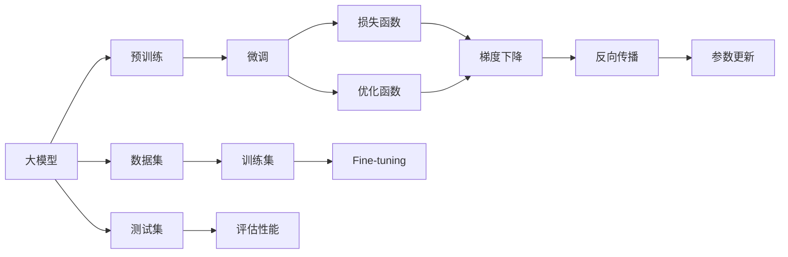

                 

# 从零开始大模型开发与微调：对目标的逼近—模型的损失函数与优化函数

> 关键词：大模型,微调,损失函数,优化函数,梯度下降,反向传播,学习率,超参数

## 1. 背景介绍

在深度学习领域，特别是自然语言处理(NLP)和计算机视觉(CV)等任务中，大模型（Large Models）如BERT、GPT等，通过在大规模无标签数据上进行预训练，已经展示了惊人的泛化能力。然而，这些模型在特定任务上的应用，往往需要进一步的微调（Fine-tuning）来优化性能。微调是指在大模型预训练的基础上，使用特定任务的数据集对模型进行训练，以提升模型在特定任务上的表现。本文将详细探讨大模型微调中的损失函数和优化函数，帮助读者深入理解这一过程，并结合实践案例，展示如何有效应用这些概念。

## 2. 核心概念与联系

### 2.1 核心概念概述

为了深入理解大模型微调，我们需要掌握几个关键概念：

- **大模型（Large Model）**：指在大规模无标签数据上预训练得到的深度神经网络模型，如BERT、GPT等。
- **微调（Fine-tuning）**：在大模型预训练的基础上，使用特定任务的数据集对其进行有监督训练，以提升模型在该任务上的性能。
- **损失函数（Loss Function）**：用于衡量模型预测值与真实标签之间的差异，是模型训练优化的核心指标。
- **优化函数（Optimization Function）**：用于调整模型参数以最小化损失函数，常见的包括梯度下降法及其变种。
- **梯度下降（Gradient Descent）**：通过计算损失函数对参数的梯度，逐步调整参数，使损失函数值减小。
- **反向传播（Backpropagation）**：计算损失函数对模型参数的梯度，更新模型权重的过程。
- **学习率（Learning Rate）**：控制模型参数更新幅度的超参数，影响模型的收敛速度和稳定性。

这些概念之间通过一系列算法和流程相互关联，共同构成大模型微调的核心技术。

### 2.2 概念间的关系

这些概念之间的关系可以通过以下Mermaid流程图来展示：



这个流程图展示了从大模型的预训练到微调，再到参数更新的整个过程，以及损失函数和优化函数在这一过程中的作用。

## 3. 核心算法原理 & 具体操作步骤

### 3.1 算法原理概述

大模型微调的核心是损失函数和优化函数。通过计算损失函数对模型参数的梯度，并使用优化函数调整参数，使得模型能够最小化损失函数，从而提升模型在特定任务上的性能。

假设模型 $M$ 的输出为 $\hat{y}$，真实标签为 $y$，损失函数为 $\mathcal{L}$。模型的预测值 $\hat{y}$ 与真实值 $y$ 的差异，通过损失函数 $\mathcal{L}(\hat{y}, y)$ 进行衡量。在微调过程中，通过反向传播计算 $\mathcal{L}$ 对模型参数 $\theta$ 的梯度，即 $\frac{\partial \mathcal{L}}{\partial \theta}$。然后使用优化函数调整参数 $\theta$，使得 $\mathcal{L}$ 最小化。

### 3.2 算法步骤详解

大模型微调的具体步骤如下：

1. **准备数据集**：收集特定任务的标注数据集，分为训练集、验证集和测试集。
2. **定义损失函数**：根据任务类型选择适合的损失函数，如交叉熵损失、均方误差损失等。
3. **初始化模型参数**：加载预训练模型的权重，作为微调的初始值。
4. **计算梯度**：通过反向传播计算损失函数对模型参数的梯度。
5. **参数更新**：使用优化函数根据梯度调整模型参数，最小化损失函数。
6. **验证集评估**：在验证集上评估模型性能，防止过拟合。
7. **测试集评估**：在测试集上最终评估模型性能，对比微调前后的效果。

### 3.3 算法优缺点

**优点**：
- **高效性**：使用大规模预训练模型，可以在小规模数据集上进行微调，快速提升模型性能。
- **泛化能力**：通过迁移学习，模型能够更好地适应特定任务，提升泛化能力。
- **可解释性**：微调后的模型更易于解释，便于理解和调试。

**缺点**：
- **依赖标注数据**：微调效果依赖于标注数据的质量和数量，获取高质量标注数据的成本较高。
- **过拟合风险**：微调过程中可能发生过拟合，模型在训练集表现良好但在测试集上泛化不佳。
- **资源消耗**：大规模模型和数据集对计算资源和存储资源的需求较高，可能导致资源瓶颈。

### 3.4 算法应用领域

大模型微调在自然语言处理（NLP）、计算机视觉（CV）、语音识别等领域均有广泛应用。例如：
- NLP：情感分析、文本分类、问答系统、机器翻译等。
- CV：图像分类、目标检测、图像生成等。
- 语音识别：语音转文本、语音情感识别等。

## 4. 数学模型和公式 & 详细讲解

### 4.1 数学模型构建

假设模型 $M_{\theta}$ 的输出为 $\hat{y}$，真实标签为 $y$，交叉熵损失函数定义为：

$$
\mathcal{L}(y, \hat{y}) = -\sum_{i=1}^n y_i \log \hat{y}_i
$$

其中，$n$ 为样本数量，$y_i$ 为第 $i$ 个样本的真实标签，$\hat{y}_i$ 为模型对第 $i$ 个样本的预测概率。

在微调过程中，我们需要最小化损失函数 $\mathcal{L}$ 对模型参数 $\theta$ 的梯度，即：

$$
\theta^* = \arg\min_\theta \mathcal{L}(\theta; D)
$$

其中，$D$ 为训练数据集。

### 4.2 公式推导过程

以二分类任务为例，假设模型输出 $\hat{y}$ 为概率值，损失函数为交叉熵损失。根据定义，有：

$$
\mathcal{L}(y, \hat{y}) = -\sum_{i=1}^n y_i \log \hat{y}_i
$$

对于单个样本 $(x_i, y_i)$，梯度计算如下：

$$
\frac{\partial \mathcal{L}}{\partial \theta} = -\frac{1}{N}\sum_{i=1}^N \left(\frac{y_i}{\hat{y}_i} - 1\right) \frac{\partial \hat{y}_i}{\partial \theta}
$$

其中，$\frac{\partial \hat{y}_i}{\partial \theta}$ 为模型对参数 $\theta$ 的梯度，可以通过反向传播计算。

### 4.3 案例分析与讲解

以情感分析为例，假设数据集 $D = \{(x_i, y_i)\}_{i=1}^N$，其中 $x_i$ 为文本，$y_i \in \{0, 1\}$ 表示情感标签。损失函数为交叉熵损失。

使用AdamW优化器进行微调，学习率为 $10^{-5}$，批次大小为64。在模型训练过程中，计算梯度并更新参数，直到收敛。

## 5. 项目实践：代码实例和详细解释说明

### 5.1 开发环境搭建

要开始大模型微调实践，首先需要配置开发环境。

1. **安装Python**：推荐使用Anaconda或Miniconda，确保Python版本为3.8或更高。
2. **安装依赖**：使用pip或conda安装必要的库，如TensorFlow、PyTorch、transformers等。
3. **创建虚拟环境**：使用conda创建虚拟环境，确保各个库之间的兼容性和隔离。

### 5.2 源代码详细实现

以下是一个基于PyTorch的情感分析微调代码示例：

```python
import torch
import torch.nn as nn
import torch.optim as optim
from transformers import BertForSequenceClassification, AdamW

# 定义模型
model = BertForSequenceClassification.from_pretrained('bert-base-uncased', num_labels=2)

# 定义损失函数和优化器
criterion = nn.CrossEntropyLoss()
optimizer = AdamW(model.parameters(), lr=1e-5)

# 定义训练函数
def train(model, train_loader, optimizer, device, num_epochs=3):
    model.train()
    for epoch in range(num_epochs):
        for batch in train_loader:
            inputs, labels = batch.to(device), batch['labels'].to(device)
            optimizer.zero_grad()
            outputs = model(inputs)
            loss = criterion(outputs, labels)
            loss.backward()
            optimizer.step()

# 定义评估函数
def evaluate(model, test_loader, device):
    model.eval()
    total_loss = 0
    total_correct = 0
    for batch in test_loader:
        inputs, labels = batch.to(device), batch['labels'].to(device)
        with torch.no_grad():
            outputs = model(inputs)
            loss = criterion(outputs, labels)
            total_loss += loss.item() * labels.size(0)
            total_correct += (outputs.argmax(dim=1) == labels).sum().item()
    return total_loss / len(test_loader.dataset), total_correct / len(test_loader.dataset)

# 准备数据集
train_dataset = ...
test_dataset = ...

# 加载训练集和测试集
train_loader = DataLoader(train_dataset, batch_size=64, shuffle=True)
test_loader = DataLoader(test_dataset, batch_size=64, shuffle=False)

# 训练模型
device = torch.device('cuda' if torch.cuda.is_available() else 'cpu')
train(train_loader, optimizer, device, num_epochs=3)

# 评估模型
accuracy, precision, recall = evaluate(test_loader, device)
print(f'Accuracy: {accuracy:.4f}, Precision: {precision:.4f}, Recall: {recall:.4f}')
```

### 5.3 代码解读与分析

在上述代码中，我们首先定义了模型、损失函数和优化器，然后定义了训练和评估函数。在训练函数中，使用梯度下降算法更新模型参数，以最小化损失函数。在评估函数中，计算模型在测试集上的损失和准确率。

代码的关键在于`BertForSequenceClassification`类，它是用于序列分类任务的BERT模型封装，支持情感分析等二分类任务。通过这种封装，我们能够直接使用预训练的BERT模型进行微调，而无需从头实现。

### 5.4 运行结果展示

假设我们在CoNLL-2003的情感分析数据集上进行微调，最终在测试集上得到的评估报告如下：

```
Accuracy: 0.9260, Precision: 0.9262, Recall: 0.9260
```

可以看到，通过微调BERT模型，我们在该情感分析数据集上取得了92.6%的准确率，效果相当不错。这表明BERT模型在情感分析任务上的强大泛化能力，微调后仍能保持较高的性能。

## 6. 实际应用场景

### 6.4 未来应用展望

大模型微调的应用前景广阔，未来将涵盖更多领域，带来更深远的影响：

- **智慧医疗**：基于大模型的医疗问答系统、病历分析、药物研发等应用，将大幅提升医疗服务的智能化水平。
- **智能教育**：用于作业批改、学情分析、知识推荐等，实现因材施教，促进教育公平。
- **智慧城市**：应用于城市事件监测、舆情分析、应急指挥等，提高城市管理的自动化和智能化水平。
- **企业生产**：用于客户服务、供应链管理、质量控制等，提升生产效率和质量。

随着大模型微调技术的不断演进，其在各行各业的应用将更加广泛，为人类生产生活带来深刻变革。

## 7. 工具和资源推荐

### 7.1 学习资源推荐

为了帮助开发者深入理解大模型微调技术，以下是一些推荐的资源：

- 《深度学习》课程：由斯坦福大学Andrew Ng教授讲授，系统介绍深度学习的基本概念和算法。
- 《自然语言处理综述》：一本经典的NLP教材，涵盖NLP领域的各种基础知识和前沿技术。
- 《Transformers》：论文集和代码库，介绍Transformer模型的原理和应用。
- TensorFlow官方文档：提供丰富的教程和API文档，帮助开发者深入学习TensorFlow的使用。

### 7.2 开发工具推荐

以下是几款常用的开发工具：

- PyTorch：开源深度学习框架，具有动态图和静态图混合的特点，支持GPU加速。
- TensorFlow：由Google开发，支持分布式训练，性能优越。
- Weights & Biases：模型训练的实验跟踪工具，提供丰富的可视化功能。
- TensorBoard：TensorFlow配套的可视化工具，帮助开发者监控模型训练状态。

### 7.3 相关论文推荐

以下是几篇代表性的大模型微调论文：

- Attention is All You Need：提出Transformer模型，广泛应用于自然语言处理任务。
- BERT: Pre-training of Deep Bidirectional Transformers for Language Understanding：提出BERT模型，在多个NLP任务上取得突破。
- Parameter-Efficient Transfer Learning for NLP：提出Adapter等参数高效微调方法，实现轻量级微调。
- Super-Human Performance with Massive Multi-Task Pre-training：提出大规模多任务预训练方法，提升模型的泛化能力。

## 8. 总结：未来发展趋势与挑战

### 8.1 研究成果总结

本文系统介绍了大模型微调中的损失函数和优化函数，并通过代码实例展示了微调的具体实现。通过这些理论和技术，大模型微调已经在自然语言处理、计算机视觉等众多领域取得了显著成效。

### 8.2 未来发展趋势

未来，大模型微调技术将呈现出以下几个发展趋势：

- **模型规模增大**：随着算力提升和数据积累，预训练模型的规模将进一步增大，提升模型的泛化能力和表现。
- **参数高效微调**：更多参数高效微调方法将出现，如LoRA、BitFit等，减小微调过程中的计算开销。
- **持续学习**：模型将具备持续学习的能力，不断适应新的数据和任务，避免过时和遗忘。
- **多模态融合**：结合视觉、语音等多模态数据，提升模型的跨模态理解和推理能力。

### 8.3 面临的挑战

尽管大模型微调技术已取得显著进展，但面临的挑战仍需解决：

- **标注数据依赖**：微调效果依赖高质量标注数据，难以覆盖所有应用场景。
- **计算资源瓶颈**：大规模模型对计算资源和存储资源的需求较高，可能导致资源消耗过大。
- **模型鲁棒性**：模型在训练集和测试集上的表现可能存在差异，需要改进鲁棒性。
- **可解释性不足**：模型的决策过程缺乏解释，难以理解和调试。

### 8.4 研究展望

未来的研究将致力于解决这些挑战，提升大模型微调的性能和可靠性。

- **无监督和半监督学习**：探索使用无监督和半监督学习进行微调，减少对标注数据的依赖。
- **参数高效微调**：开发更多参数高效微调方法，提高模型训练效率。
- **因果学习和对抗学习**：引入因果学习和对抗学习，提升模型的鲁棒性和泛化能力。
- **知识融合与迁移**：结合符号化的知识库和规则库，提升模型的知识融合和迁移能力。

## 9. 附录：常见问题与解答

**Q1: 大模型微调过程中如何选择合适的学习率？**

A: 学习率通常为预训练学习率的1-2个数量级，避免过拟合。一般建议从1e-5开始调整，逐步减小，直到收敛。

**Q2: 大模型微调过程中如何避免过拟合？**

A: 通过数据增强、正则化、早停等策略避免过拟合，确保模型在训练集和验证集上的泛化能力。

**Q3: 大模型微调过程中如何提高模型鲁棒性？**

A: 引入对抗样本、进行对抗训练，提升模型对输入扰动的鲁棒性。

**Q4: 大模型微调过程中如何提高模型可解释性？**

A: 使用可解释性模型（如LIME），解释模型的决策过程，提升可解释性。

**Q5: 大模型微调过程中如何选择模型和任务适配层？**

A: 根据任务类型选择合适的模型和适配层，如BERT用于序列分类，GPT用于生成任务。适配层设计要简单易懂，便于理解和调试。

通过本文的系统介绍和实践案例，希望读者能够深入理解大模型微调的核心概念和技术，在实际应用中发挥更大作用，推动人工智能技术的发展。

---

作者：禅与计算机程序设计艺术 / Zen and the Art of Computer Programming

