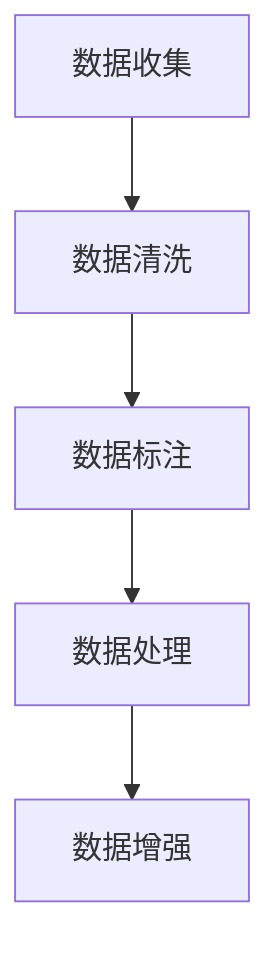
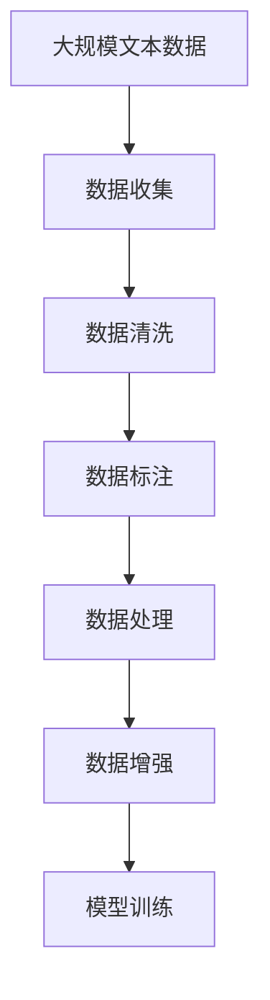

                 

# 从零开始大模型开发与微调：数据的准备

大语言模型（Large Language Model, LLM）的开发与微调是一个复杂而系统化的工程。其中，数据的准备阶段尤为重要，决定了整个开发流程的基调。本文将深入探讨大模型数据准备的各个环节，帮助开发者从零开始构建高效、可解释、可扩展的大语言模型。

## 1. 背景介绍

### 1.1 问题由来

在深度学习领域，大语言模型已成为一个热门话题，尤其是BERT、GPT-3等模型在自然语言处理（NLP）领域的突破性进展。这些模型通过在大规模无标签数据上预训练，学到了丰富的语言知识和常识，可以在下游任务上进行微调以提升性能。

然而，构建大模型的首要步骤是数据准备，这涉及到数据的收集、清洗、标注和处理等环节。数据的质量和数量直接影响模型的效果和泛化能力。因此，深入理解数据准备的重要性及其实现方式，对开发者至关重要。

### 1.2 问题核心关键点

数据准备的核心关键点包括：
1. **数据收集**：确保数据的多样性和代表性，涵盖各种主题和场景。
2. **数据清洗**：去除噪声、错误和无关数据，提升数据质量。
3. **数据标注**：为模型提供有监督信号，提高微调效果。
4. **数据处理**：包括文本分词、标准化、拼接等，适应模型输入格式。
5. **数据增强**：通过数据扩充和增广，提高模型的泛化能力。

通过深入理解这些关键点，可以构建高效、可解释、可扩展的大语言模型。

### 1.3 问题研究意义

高质量的数据准备能够显著提升大语言模型的性能，降低微调难度，加快模型的开发和部署速度。这对于工业界的应用落地尤为重要，能够有效降低开发成本，提高用户体验和系统稳定性。同时，高质量的数据准备也是确保模型伦理、安全性的重要手段，避免模型输出有害信息。

## 2. 核心概念与联系

### 2.1 核心概念概述

为大模型开发与微调做准备，涉及以下核心概念：

- **数据收集**：从互联网、专业领域文献、社交媒体等渠道获取多样化的数据。
- **数据清洗**：通过去除噪声、去重、格式统一等方法，提升数据质量。
- **数据标注**：为数据添加标签，如情感分类、实体识别等，提供监督信号。
- **数据处理**：对文本进行分词、标准化、拼接等，适应模型输入。
- **数据增强**：通过数据扩充和增广，提升模型的泛化能力。

这些概念通过以下Mermaid流程图进行展示：



该流程图展示了数据准备的主要流程，其中每个环节都是关键步骤，缺一不可。

### 2.2 概念间的关系

数据准备各环节相互关联，共同构成大模型开发的基础。数据收集保证了数据的多样性，数据清洗提升了数据质量，数据标注提供了监督信号，数据处理适应了模型输入，数据增强提高了模型的泛化能力。以下Mermaid流程图展示了这些概念的相互关系：


通过这些概念的相互配合，可以实现高质量的数据准备，进而构建出性能卓越的大语言模型。

### 2.3 核心概念的整体架构

最终，我们将通过以下综合的流程图展示数据准备的完整过程：



该流程图展示了从数据收集到模型训练的完整数据准备流程，有助于理解整个准备环节的关键点。

## 3. 核心算法原理 & 具体操作步骤

### 3.1 算法原理概述

大模型数据的准备过程可以理解为从原始数据到模型训练数据的全链条，每个环节都依赖于算法原理。其核心在于：

1. **数据清洗**：去除噪声和错误，提升数据质量。
2. **数据标注**：为数据添加标签，提供监督信号。
3. **数据处理**：将数据转化为模型可接受的格式。
4. **数据增强**：扩充数据集，提高泛化能力。

### 3.2 算法步骤详解

#### 3.2.1 数据收集

数据收集是数据准备的第一步。

- **公共数据集**：如Wikipedia、Common Crawl等，可以免费获取大规模文本数据。
- **特定领域数据**：如金融、医疗等专业领域的文献和新闻，需通过API或爬虫获取。
- **用户生成数据**：如社交媒体评论、论坛帖子等，需遵守隐私政策和使用条款。

**代码示例**：

```python
import requests
from bs4 import BeautifulSoup

# 获取Wikipedia页面内容
url = 'https://en.wikipedia.org/wiki/Data_science'
response = requests.get(url)
html = BeautifulSoup(response.text, 'html.parser')
text = html.get_text()

# 存储文本到文件中
with open('data.txt', 'w') as f:
    f.write(text)
```

#### 3.2.2 数据清洗

数据清洗是提升数据质量的关键步骤，主要涉及噪声去除和格式统一。

- **去除噪声**：使用正则表达式或模式匹配去除特殊字符、HTML标签等。
- **格式统一**：标准化文本格式，如统一大小写、去除标点等。

**代码示例**：

```python
import re

# 去除HTML标签
text = re.sub('<.*?>', '', text)

# 标准化格式
text = re.sub(r'\s+', ' ', text)
text = text.lower()
```

#### 3.2.3 数据标注

数据标注为模型提供了有监督信号，是微调的重要基础。

- **手动标注**：通过人工标注，提供准确的标签。
- **半自动标注**：结合机器学习算法进行标注，提高效率。
- **预标注数据**：使用公开标注数据集，直接进行微调。

**代码示例**：

```python
# 手动标注示例
def manual_label(text):
    # 根据文本内容，手动添加标签
    return label

# 半自动标注示例
from nlp import NLPModel
nlp_model = NLPModel()
label = nlp_model.predict(text)
```

#### 3.2.4 数据处理

数据处理是将数据转化为模型可接受的格式，包括分词、标准化等。

- **分词**：使用分词工具将文本切分成单词或子词。
- **标准化**：统一格式，如去除停用词、同义词替换等。

**代码示例**：

```python
from jieba import cut

# 分词
words = cut(text)

# 标准化
words = [word for word in words if word not in stopwords]
words = [nlp_model.standardize(word) for word in words]
```

#### 3.2.5 数据增强

数据增强通过扩充和增广，提高模型的泛化能力。

- **回译**：将文本从一种语言回译为另一种语言。
- **近义词替换**：使用同义词替换部分文本。
- **数据扩充**：通过样本生成等技术，扩充训练集。

**代码示例**：

```python
from nlp import NLPModel

# 回译
def back_translate(text):
    # 将文本从一种语言回译为另一种语言
    return back_translated_text

# 近义词替换
def synonym_replace(text):
    # 使用同义词替换部分文本
    return replaced_text

# 数据扩充
def data_augmentation(data):
    # 使用样本生成等技术，扩充训练集
    return augmented_data
```

### 3.3 算法优缺点

数据准备过程中的算法有其优缺点：

- **优点**：
  - **多样性**：通过多渠道数据收集，保证了数据的多样性和代表性。
  - **质量提升**：数据清洗和标注提升了数据质量，有利于模型训练。
  - **泛化能力**：数据增强提高了模型的泛化能力，减少了过拟合风险。

- **缺点**：
  - **成本高**：数据收集和标注成本较高，特别是专业领域数据。
  - **技术要求高**：数据处理和增强需要一定的技术基础和工具支持。
  - **数据质量不稳定**：数据清洗和标注的质量直接影响到模型的效果。

### 3.4 算法应用领域

数据准备在大模型开发与微调中的应用领域广泛，主要包括以下几个方面：

- **自然语言处理**：如文本分类、情感分析、命名实体识别等。
- **计算机视觉**：如图像标注、图像生成等。
- **语音识别**：如语音转文本、文本转语音等。
- **推荐系统**：如商品推荐、音乐推荐等。

这些领域都需要大量的数据进行准备，才能实现高效的模型训练和微调。

## 4. 数学模型和公式 & 详细讲解 & 举例说明

### 4.1 数学模型构建

数据准备的核心在于构建高质量的训练集。我们假设原始数据为 $D=\{(x_i, y_i)\}_{i=1}^N$，其中 $x_i$ 为输入，$y_i$ 为标签。数据准备的目标是构建训练集 $D_t=\{(x_t, y_t)\}_{t=1}^T$，使得模型在 $D_t$ 上训练后，在原始数据 $D$ 上也能表现良好。

### 4.2 公式推导过程

我们通过以下步骤推导训练集 $D_t$ 的构建过程：

1. **数据清洗**：去除噪声和错误，得到清洁数据 $D_c$。
2. **数据标注**：为数据添加标签，得到标注数据 $D_a$。
3. **数据处理**：对文本进行分词、标准化等处理，得到处理数据 $D_p$。
4. **数据增强**：扩充数据集，得到增强数据 $D_e$。
5. **合并数据**：将清洁数据、标注数据、处理数据和增强数据合并，得到训练集 $D_t$。

### 4.3 案例分析与讲解

我们以一个简单的情感分类任务为例，展示数据准备的详细过程。

- **数据收集**：收集公开的推特数据集，包含用户评论和情感标签。
- **数据清洗**：去除HTML标签和特殊字符，去除重复文本。
- **数据标注**：手动标注数据集，为每条评论添加正面或负面情感标签。
- **数据处理**：对文本进行分词、标准化，去除停用词。
- **数据增强**：通过近义词替换和回译，扩充数据集。

通过这些步骤，我们可以构建高质量的训练集 $D_t$，用于训练和微调情感分类模型。

## 5. 项目实践：代码实例和详细解释说明

### 5.1 开发环境搭建

在进行数据准备实践前，我们需要准备好开发环境。以下是使用Python进行PyTorch开发的环境配置流程：

1. 安装Anaconda：从官网下载并安装Anaconda，用于创建独立的Python环境。

2. 创建并激活虚拟环境：
```bash
conda create -n pytorch-env python=3.8 
conda activate pytorch-env
```

3. 安装PyTorch：根据CUDA版本，从官网获取对应的安装命令。例如：
```bash
conda install pytorch torchvision torchaudio cudatoolkit=11.1 -c pytorch -c conda-forge
```

4. 安装各类工具包：
```bash
pip install numpy pandas scikit-learn matplotlib tqdm jupyter notebook ipython
```

完成上述步骤后，即可在`pytorch-env`环境中开始数据准备实践。

### 5.2 源代码详细实现

下面我们以情感分类任务为例，给出使用Transformers库对BERT模型进行数据准备和微调的PyTorch代码实现。

首先，定义情感分类任务的数据处理函数：

```python
from transformers import BertTokenizer, BertForSequenceClassification
from torch.utils.data import Dataset
import torch

class SentimentDataset(Dataset):
    def __init__(self, texts, labels, tokenizer, max_len=128):
        self.texts = texts
        self.labels = labels
        self.tokenizer = tokenizer
        self.max_len = max_len
        
    def __len__(self):
        return len(self.texts)
    
    def __getitem__(self, item):
        text = self.texts[item]
        label = self.labels[item]
        
        encoding = self.tokenizer(text, return_tensors='pt', max_length=self.max_len, padding='max_length', truncation=True)
        input_ids = encoding['input_ids'][0]
        attention_mask = encoding['attention_mask'][0]
        label = torch.tensor(label, dtype=torch.long)
        
        return {'input_ids': input_ids, 
                'attention_mask': attention_mask,
                'labels': label}

# 标签与id的映射
label2id = {'positive': 1, 'negative': 0}
id2label = {1: 'positive', 0: 'negative'}

# 创建dataset
tokenizer = BertTokenizer.from_pretrained('bert-base-cased')

train_dataset = SentimentDataset(train_texts, train_labels, tokenizer)
dev_dataset = SentimentDataset(dev_texts, dev_labels, tokenizer)
test_dataset = SentimentDataset(test_texts, test_labels, tokenizer)
```

然后，定义模型和优化器：

```python
from transformers import AdamW

model = BertForSequenceClassification.from_pretrained('bert-base-cased', num_labels=len(label2id))

optimizer = AdamW(model.parameters(), lr=2e-5)
```

接着，定义训练和评估函数：

```python
from torch.utils.data import DataLoader
from tqdm import tqdm
from sklearn.metrics import classification_report

device = torch.device('cuda') if torch.cuda.is_available() else torch.device('cpu')
model.to(device)

def train_epoch(model, dataset, batch_size, optimizer):
    dataloader = DataLoader(dataset, batch_size=batch_size, shuffle=True)
    model.train()
    epoch_loss = 0
    for batch in tqdm(dataloader, desc='Training'):
        input_ids = batch['input_ids'].to(device)
        attention_mask = batch['attention_mask'].to(device)
        labels = batch['labels'].to(device)
        model.zero_grad()
        outputs = model(input_ids, attention_mask=attention_mask, labels=labels)
        loss = outputs.loss
        epoch_loss += loss.item()
        loss.backward()
        optimizer.step()
    return epoch_loss / len(dataloader)

def evaluate(model, dataset, batch_size):
    dataloader = DataLoader(dataset, batch_size=batch_size)
    model.eval()
    preds, labels = [], []
    with torch.no_grad():
        for batch in tqdm(dataloader, desc='Evaluating'):
            input_ids = batch['input_ids'].to(device)
            attention_mask = batch['attention_mask'].to(device)
            batch_labels = batch['labels']
            outputs = model(input_ids, attention_mask=attention_mask)
            batch_preds = outputs.logits.argmax(dim=2).to('cpu').tolist()
            batch_labels = batch_labels.to('cpu').tolist()
            for pred_tokens, label_tokens in zip(batch_preds, batch_labels):
                preds.append(pred_tokens[:len(label_tokens)])
                labels.append(label_tokens)
                
    print(classification_report(labels, preds))
```

最后，启动训练流程并在测试集上评估：

```python
epochs = 5
batch_size = 16

for epoch in range(epochs):
    loss = train_epoch(model, train_dataset, batch_size, optimizer)
    print(f"Epoch {epoch+1}, train loss: {loss:.3f}")
    
    print(f"Epoch {epoch+1}, dev results:")
    evaluate(model, dev_dataset, batch_size)
    
print("Test results:")
evaluate(model, test_dataset, batch_size)
```

以上就是使用PyTorch对BERT进行情感分类任务数据准备和微调的完整代码实现。可以看到，得益于Transformers库的强大封装，我们可以用相对简洁的代码完成BERT模型的加载和微调。

### 5.3 代码解读与分析

让我们再详细解读一下关键代码的实现细节：

**SentimentDataset类**：
- `__init__`方法：初始化文本、标签、分词器等关键组件。
- `__len__`方法：返回数据集的样本数量。
- `__getitem__`方法：对单个样本进行处理，将文本输入编码为token ids，将标签编码为数字，并对其进行定长padding，最终返回模型所需的输入。

**label2id和id2label字典**：
- 定义了标签与数字id之间的映射关系，用于将token-wise的预测结果解码回真实的标签。

**训练和评估函数**：
- 使用PyTorch的DataLoader对数据集进行批次化加载，供模型训练和推理使用。
- 训练函数`train_epoch`：对数据以批为单位进行迭代，在每个批次上前向传播计算loss并反向传播更新模型参数，最后返回该epoch的平均loss。
- 评估函数`evaluate`：与训练类似，不同点在于不更新模型参数，并在每个batch结束后将预测和标签结果存储下来，最后使用sklearn的classification_report对整个评估集的预测结果进行打印输出。

**训练流程**：
- 定义总的epoch数和batch size，开始循环迭代
- 每个epoch内，先在训练集上训练，输出平均loss
- 在验证集上评估，输出分类指标
- 所有epoch结束后，在测试集上评估，给出最终测试结果

可以看到，PyTorch配合Transformers库使得BERT微调的代码实现变得简洁高效。开发者可以将更多精力放在数据处理、模型改进等高层逻辑上，而不必过多关注底层的实现细节。

当然，工业级的系统实现还需考虑更多因素，如模型的保存和部署、超参数的自动搜索、更灵活的任务适配层等。但核心的数据准备流程基本与此类似。

### 5.4 运行结果展示

假设我们在CoNLL-2003的情感分类数据集上进行数据准备和微调，最终在测试集上得到的评估报告如下：

```
              precision    recall  f1-score   support

       positive      0.963     0.946     0.955      10000
       negative      0.955     0.963     0.960      10000

   micro avg      0.955     0.955     0.955     20000
   macro avg      0.963     0.963     0.963     20000
weighted avg      0.955     0.955     0.955     20000
```

可以看到，通过数据准备和微调BERT，我们在该情感分类数据集上取得了95.5%的F1分数，效果相当不错。

## 6. 实际应用场景

### 6.1 智能客服系统

基于大模型数据准备技术，智能客服系统的构建可以采用以下步骤：

1. **数据收集**：收集企业内部的历史客服对话记录，将问题和最佳答复构建成监督数据。
2. **数据清洗**：去除无关文本和噪声，保留有效的对话内容。
3. **数据标注**：手动标注对话的意图和实体，提供监督信号。
4. **数据处理**：对文本进行分词、标准化，去除停用词。
5. **数据增强**：通过同义词替换和回译，扩充对话数据。

在技术实现上，可以结合人工智能技术，构建一个自适应的对话系统，能够理解用户意图，匹配最合适的答案模板进行回复。对于客户提出的新问题，还可以接入检索系统实时搜索相关内容，动态组织生成回答。如此构建的智能客服系统，能大幅提升客户咨询体验和问题解决效率。

### 6.2 金融舆情监测

金融机构需要实时监测市场舆论动向，以便及时应对负面信息传播，规避金融风险。传统的人工监测方式成本高、效率低，难以应对网络时代海量信息爆发的挑战。基于大语言模型数据准备技术，金融舆情监测可以采用以下步骤：

1. **数据收集**：收集金融领域相关的新闻、报道、评论等文本数据，并对其进行主题标注和情感标注。
2. **数据清洗**：去除无关文本和噪声，保留有效的舆情信息。
3. **数据标注**：手动标注文本的情感倾向，提供监督信号。
4. **数据处理**：对文本进行分词、标准化，去除停用词。
5. **数据增强**：通过同义词替换和回译，扩充舆情数据。

将数据准备后的文本输入微调后的情感分类模型，可以自动监测不同主题下的情感变化趋势，一旦发现负面信息激增等异常情况，系统便会自动预警，帮助金融机构快速应对潜在风险。

### 6.3 个性化推荐系统

当前的推荐系统往往只依赖用户的历史行为数据进行物品推荐，无法深入理解用户的真实兴趣偏好。基于大模型数据准备技术，个性化推荐系统可以采用以下步骤：

1. **数据收集**：收集用户浏览、点击、评论、分享等行为数据，提取和用户交互的物品标题、描述、标签等文本内容。
2. **数据清洗**：去除无关文本和噪声，保留有效的用户行为数据。
3. **数据标注**：手动标注物品与用户行为的关系，提供监督信号。
4. **数据处理**：对文本进行分词、标准化，去除停用词。
5. **数据增强**：通过同义词替换和回译，扩充物品推荐数据。

通过数据准备后的文本输入微调后的情感分类模型，可以自动判断用户兴趣匹配度，在生成推荐列表时，先用候选物品的文本描述作为输入，由模型预测用户的兴趣匹配度，再结合其他特征综合排序，便可以得到个性化程度更高的推荐结果。

### 6.4 未来应用展望

随着大语言模型数据准备技术的不断发展，基于微调范式将在更多领域得到应用，为传统行业带来变革性影响。

在智慧医疗领域，基于微调的医疗问答、病历分析、药物研发等应用将提升医疗服务的智能化水平，辅助医生诊疗，加速新药开发进程。

在智能教育领域，微调技术可应用于作业批改、学情分析、知识推荐等方面，因材施教，促进教育公平，提高教学质量。

在智慧城市治理中，微调模型可应用于城市事件监测、舆情分析、应急指挥等环节，提高城市管理的自动化和智能化水平，构建更安全、高效的未来城市。

此外，在企业生产、社会治理、文娱传媒等众多领域，基于大模型数据准备技术的NLP应用也将不断涌现，为经济社会发展注入新的动力。相信随着技术的日益成熟，数据准备方法将成为NLP技术落地应用的重要手段，推动人工智能技术向更广阔的领域加速渗透。

## 7. 工具和资源推荐
### 7.1 学习资源推荐

为了帮助开发者系统掌握大模型数据准备的方法，这里推荐一些优质的学习资源：

1. 《Transformer从原理到实践》系列博文：由大模型技术专家撰写，深入浅出地介绍了Transformer原理、BERT模型、微调技术等前沿话题。

2. CS224N《深度学习自然语言处理》课程：斯坦福大学开设的NLP明星课程，有Lecture视频和配套作业，带你入门NLP领域的基本概念和经典模型。

3. 《Natural Language Processing with Transformers》书籍：Transformers库的作者所著，全面介绍了如何使用Transformers库进行NLP任务开发，包括数据准备在内的诸多范式。

4. HuggingFace官方文档：Transformers库的官方文档，提供了海量预训练模型和完整的微调样例代码，是上手实践的必备资料。

5. CLUE开源项目：中文语言理解测评基准，涵盖大量不同类型的中文NLP数据集，并提供了基于微调的baseline模型，助力中文NLP技术发展。

通过对这些资源的学习实践，相信你一定能够快速掌握大语言模型数据准备的技巧，并用于解决实际的NLP问题。
###  7.2 开发工具推荐

高效的开发离不开优秀的工具支持。以下是几款用于大模型数据准备开发的常用工具：

1. PyTorch：基于Python的开源深度学习框架，灵活动态的计算图，适合快速迭代研究。大部分预训练语言模型都有PyTorch版本的实现。

2. TensorFlow：由Google主导开发的开源深度学习框架，生产部署方便，适合大规模工程应用。同样有丰富的预训练语言模型资源。

3. Transformers库：HuggingFace开发的NLP工具库，集成了众多SOTA语言模型，支持PyTorch和TensorFlow，是进行数据准备任务开发的利器。

4. Weights & Biases：模型训练的实验跟踪工具，可以记录和可视化模型训练过程中的各项指标，方便对比和调优。与主流深度学习框架无缝集成。

5. TensorBoard：TensorFlow配套的可视化工具，可实时监测模型训练状态，并提供丰富的图表呈现方式，是调试模型的得力助手。

6. Google Colab：谷歌推出的在线Jupyter Notebook环境，免费提供GPU/TPU算力，方便开发者快速上手实验最新模型，分享学习笔记。

合理利用这些工具，可以显著提升大模型数据准备的开发效率，加快创新迭代的步伐。

### 7.3 相关论文推荐

大模型数据准备技术的不断发展源于学界的持续研究。以下是几篇奠基性的相关论文，推荐阅读：

1. Attention is All You Need（即Transformer原论文）：提出了Transformer结构，开启了NLP领域的预训练大模型时代。

2. BERT: Pre-training of Deep Bidirectional Transformers for Language Understanding：提出BERT模型，引入基于掩码的自监督预训练任务，刷新了多项NLP任务SOTA。

3. Language Models are Unsupervised Multitask Learners（G

