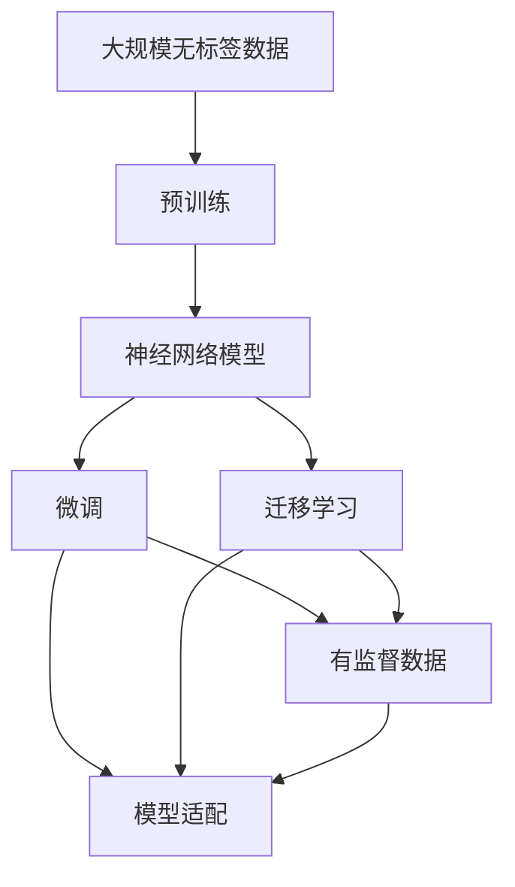

                 

# 从零开始大模型开发与微调：神经网络框架的抽象实现

## 1. 背景介绍

### 1.1 问题由来
近年来，深度学习技术的飞速发展催生了许多大型预训练语言模型（如BERT、GPT、RoBERTa等）。这些模型通过对大规模无标签文本进行自监督预训练，学习到了丰富的语言知识和常识，并在各种自然语言处理（NLP）任务上取得了优异表现。

然而，这些通用预训练语言模型在特定领域应用时，效果往往不尽如人意。因此，如何针对特定任务进行微调，提升模型性能，成为了NLP领域的研究热点。本文将从神经网络框架的抽象实现角度，系统介绍大模型开发与微调的原理和实践。

### 1.2 问题核心关键点
大模型开发与微调的核心在于：

- 选择合适的预训练模型，如BERT、GPT-2、RoBERTa等。
- 对预训练模型进行任务适配，添加适当的输出层和损失函数。
- 利用少量标注数据，对模型进行有监督微调，使其在特定任务上表现最佳。

本文将详细介绍基于神经网络框架的大模型开发与微调方法，从模型架构、训练流程、优化策略等多个维度，系统阐述其原理和实现细节。

### 1.3 问题研究意义
深入理解大模型开发与微调，对于拓展模型应用范围，提升NLP任务性能，加速产业升级具有重要意义。

- 降低开发成本。利用预训练模型，可以快速开发应用，减少从头开发所需的数据、计算和人力等成本。
- 提升模型效果。微调可以使通用模型更好地适应特定任务，在应用场景中取得更优表现。
- 加速开发进度。预训练模型可大幅度缩短任务适配的周期，提高开发效率。
- 带来技术创新。微调范式促进了对预训练和微调的深入研究，催生了提示学习、少样本学习等新研究方向。
- 赋能产业升级。微调技术易于被各行各业采用，为传统行业数字化转型提供新路径。

## 2. 核心概念与联系

### 2.1 核心概念概述

为更好地理解大模型开发与微调，本节将介绍几个关键概念：

- 神经网络（Neural Network）：由大量人工神经元组成的计算图，用于模型训练和推理。
- 预训练（Pre-training）：在大规模无标签数据上，通过自监督任务训练神经网络模型，学习通用的语言表示。
- 微调（Fine-tuning）：在预训练模型的基础上，使用下游任务的少量标注数据，通过有监督学习优化模型在特定任务上的性能。
- 迁移学习（Transfer Learning）：将一个领域学习到的知识，迁移应用到另一个不同但相关的领域的学习范式。

### 2.2 核心概念之间的关系

这些核心概念之间存在紧密联系，形成了一个完整的神经网络训练和微调框架。以下是一个简化的Mermaid流程图，展示了这些概念之间的关系：



该流程图展示了大模型开发与微调的基本流程：

1. 在无标签大规模数据上预训练神经网络模型。
2. 利用预训练模型在特定任务上的少量标注数据进行微调。
3. 通过迁移学习，将预训练模型应用于新任务。
4. 对微调后的模型进行任务适配。

通过理解这些核心概念，我们可以更好地把握大模型开发与微调的逻辑框架和应用场景。

## 3. 核心算法原理 & 具体操作步骤
### 3.1 算法原理概述

大模型开发与微调的核心原理基于神经网络的迁移学习。具体而言，即在大规模无标签数据上进行预训练，学习通用的语言表示；然后利用下游任务的少量标注数据进行微调，使模型在特定任务上表现最优。

### 3.2 算法步骤详解

基于神经网络框架的大模型开发与微调一般包括以下几个关键步骤：

**Step 1: 选择预训练模型**
选择合适的预训练模型，如BERT、GPT-2、RoBERTa等。这些模型经过在大规模无标签数据上的自监督预训练，学习到了丰富的语言知识。

**Step 2: 定义输出层和损失函数**
根据任务类型，在预训练模型的基础上添加适当的输出层和损失函数。例如，对于文本分类任务，通常添加线性分类器并使用交叉熵损失函数；对于文本生成任务，则使用语言模型的解码器输出概率分布，并以负对数似然为损失函数。

**Step 3: 设置微调超参数**
选择合适的优化算法及其参数，如AdamW、SGD等，设置学习率、批大小、迭代轮数等。同时设置正则化技术及强度，包括权重衰减、Dropout、Early Stopping等。

**Step 4: 执行梯度训练**
将训练集数据分批次输入模型，前向传播计算损失函数。反向传播计算参数梯度，根据设定的优化算法和学习率更新模型参数。周期性在验证集上评估模型性能，根据性能指标决定是否触发Early Stopping。重复上述步骤直至满足预设的迭代轮数或Early Stopping条件。

**Step 5: 测试和部署**
在测试集上评估微调后模型，对比微调前后的精度提升。使用微调后的模型对新样本进行推理预测，集成到实际的应用系统中。

以上是基于神经网络框架的大模型开发与微调的一般流程。在实际应用中，还需要根据具体任务和数据特点，对微调过程的各个环节进行优化设计，以进一步提升模型性能。

### 3.3 算法优缺点

基于神经网络框架的大模型开发与微调具有以下优点：

1. 简单高效。微调通常只需要添加适当的输出层和损失函数，利用少量标注数据即可快速训练。
2. 泛化能力强。预训练模型在大规模无标签数据上学习到了通用的语言表示，泛化能力较强。
3. 模型迁移能力。预训练模型可以迁移应用于多个下游任务，具有较强的跨领域迁移能力。

同时，该方法也存在一定的局限性：

1. 依赖标注数据。微调的效果很大程度上取决于标注数据的质量和数量，获取高质量标注数据的成本较高。
2. 模型过拟合。在预训练模型的基础上微调，可能会导致模型对训练数据过度拟合，泛化能力降低。
3. 模型容量限制。预训练模型的大小和复杂度是有限的，过度微调可能会导致模型过拟合。
4. 模型解释性不足。微调后的模型难以解释其内部工作机制和决策逻辑，缺乏可解释性。

尽管存在这些局限性，但就目前而言，基于神经网络框架的微调方法仍是大模型应用的主流范式。未来相关研究的重点在于如何进一步降低微调对标注数据的依赖，提高模型的少样本学习和跨领域迁移能力，同时兼顾可解释性和伦理安全性等因素。

### 3.4 算法应用领域

基于神经网络框架的大模型开发与微调方法在NLP领域已经得到了广泛应用，涵盖了各种常见任务，如文本分类、命名实体识别、关系抽取、问答系统、机器翻译、文本摘要、对话系统等。

此外，大模型开发与微调技术也被创新性地应用到更多场景中，如可控文本生成、常识推理、代码生成、数据增强等，为NLP技术带来了全新的突破。随着预训练模型和微调方法的不断进步，相信NLP技术将在更广阔的应用领域大放异彩。

## 4. 数学模型和公式 & 详细讲解 & 举例说明

### 4.1 数学模型构建

在大模型开发与微调过程中，我们通常使用基于神经网络的框架，如PyTorch、TensorFlow等。以PyTorch为例，构建一个简单的文本分类模型的过程如下：

1. 导入必要的库和模块：
```python
import torch
import torch.nn as nn
import torch.optim as optim
from torchtext import datasets, data
```

2. 定义数据预处理和加载：
```python
TEXT = data.Field(tokenize='spacy', tokenizer_language='en_core_web_sm', lower=True)
LABEL = data.LabelField(dtype=torch.float)
train_data, test_data = datasets.IMDB.splits(TEXT, LABEL)
TEXT.build_vocab(train_data, max_size=10000)
LABEL.build_vocab(train_data)
train_iterator, test_iterator = data.BucketIterator.splits((train_data, test_data), batch_size=32, device=torch.device('cuda'))
```

3. 定义模型结构：
```python
class LSTMClassifier(nn.Module):
    def __init__(self, input_size, hidden_size, output_size):
        super(LSTMClassifier, self).__init__()
        self.hidden_size = hidden_size
        self.lstm = nn.LSTM(input_size, hidden_size, 2, batch_first=True)
        self.fc = nn.Linear(hidden_size, output_size)

    def forward(self, input, hidden):
        lstm_out, hidden = self.lstm(input, hidden)
        out = self.fc(lstm_out[:, -1, :])
        return out, hidden
```

4. 定义损失函数和优化器：
```python
criterion = nn.BCEWithLogitsLoss()
optimizer = optim.Adam(model.parameters(), lr=0.001)
```

5. 定义训练和评估函数：
```python
def train(model, iterator, optimizer, criterion):
    model.train()
    for batch in iterator:
        optimizer.zero_grad()
        predictions, hidden = model(batch.text, hidden)
        loss = criterion(predictions, batch.label)
        loss.backward()
        optimizer.step()
    return loss.item()

def evaluate(model, iterator, criterion):
    model.eval()
    with torch.no_grad():
        epoch_loss = 0
        for batch in iterator:
            predictions, hidden = model(batch.text, hidden)
            loss = criterion(predictions, batch.label)
            epoch_loss += loss.item()
    return epoch_loss / len(iterator)
```

6. 训练和评估：
```python
n_epochs = 5
hidden = (torch.zeros(1, 1, model.hidden_size).to(device), torch.zeros(1, 1, model.hidden_size).to(device))
for epoch in range(n_epochs):
    train_loss = train(model, train_iterator, optimizer, criterion)
    valid_loss = evaluate(model, test_iterator, criterion)
    print(f'Epoch: {epoch+1:02}, Train Loss: {train_loss:.3f}, Valid Loss: {valid_loss:.3f}')
```

通过上述步骤，我们构建了一个简单的LSTM分类模型，并对其进行了训练和评估。这个模型可以用于文本分类任务，例如情感分析。

### 4.2 公式推导过程

以文本分类任务为例，推导LSTM模型的训练过程。

设模型输入为文本序列 $(x_1, x_2, ..., x_n)$，输出为文本分类标签 $y$，模型结构如图：


模型由输入层、LSTM层和输出层组成。LSTM层接收文本序列 $(x_1, x_2, ..., x_n)$，输出上下文向量 $h_1, h_2, ..., h_n$。输出层将上下文向量映射到分类标签空间。

定义损失函数为交叉熵损失：
$$
\mathcal{L} = -\sum_{i=1}^{n}(y_i\log \hat{y}_i + (1-y_i)\log (1-\hat{y}_i))
$$

其中，$y_i$ 为第 $i$ 个样本的真实标签，$\hat{y}_i$ 为模型对第 $i$ 个样本的预测概率。

梯度更新公式为：
$$
\theta \leftarrow \theta - \eta \nabla_{\theta}\mathcal{L}(\theta)
$$

其中，$\eta$ 为学习率，$\nabla_{\theta}\mathcal{L}(\theta)$ 为损失函数对模型参数的梯度，通过反向传播算法计算得到。

通过不断更新模型参数，模型能够最小化损失函数，从而提高对文本分类的准确率。

### 4.3 案例分析与讲解

以情感分析任务为例，详细分析LSTM模型的训练过程。

1. 数据预处理：
将原始数据集分为训练集和测试集，对文本进行分词、向量化等预处理。
2. 模型构建：
使用LSTM构建文本分类模型，添加适当的输出层和损失函数。
3. 训练过程：
将训练集数据分批次输入模型，前向传播计算损失函数，反向传播计算梯度，根据优化器更新模型参数。
4. 评估过程：
在测试集上评估模型性能，对比微调前后的精度提升。

通过以上步骤，我们可以得到一个对情感分析任务具有较好性能的LSTM模型。

## 5. 项目实践：代码实例和详细解释说明
### 5.1 开发环境搭建

在进行项目实践前，我们需要准备好开发环境。以下是使用PyTorch进行开发的环境配置流程：

1. 安装Anaconda：从官网下载并安装Anaconda，用于创建独立的Python环境。

2. 创建并激活虚拟环境：
```bash
conda create -n pytorch-env python=3.8 
conda activate pytorch-env
```

3. 安装PyTorch：根据CUDA版本，从官网获取对应的安装命令。例如：
```bash
conda install pytorch torchvision torchaudio cudatoolkit=11.1 -c pytorch -c conda-forge
```

4. 安装Transformers库：
```bash
pip install transformers
```

5. 安装各类工具包：
```bash
pip install numpy pandas scikit-learn matplotlib tqdm jupyter notebook ipython
```

完成上述步骤后，即可在`pytorch-env`环境中开始项目实践。

### 5.2 源代码详细实现

这里我们以BERT模型为例，给出使用Transformers库对BERT模型进行情感分析任务微调的PyTorch代码实现。

首先，定义情感分析任务的数据处理函数：

```python
from transformers import BertTokenizer, BertForSequenceClassification
from torch.utils.data import Dataset
import torch

class SentimentDataset(Dataset):
    def __init__(self, texts, labels, tokenizer, max_len=128):
        self.texts = texts
        self.labels = labels
        self.tokenizer = tokenizer
        self.max_len = max_len
        
    def __len__(self):
        return len(self.texts)
    
    def __getitem__(self, item):
        text = self.texts[item]
        label = self.labels[item]
        
        encoding = self.tokenizer(text, return_tensors='pt', max_length=self.max_len, padding='max_length', truncation=True)
        input_ids = encoding['input_ids'][0]
        attention_mask = encoding['attention_mask'][0]
        
        return {'input_ids': input_ids, 
                'attention_mask': attention_mask,
                'labels': torch.tensor(label, dtype=torch.long)}
```

然后，定义模型和优化器：

```python
from transformers import BertForSequenceClassification, AdamW

model = BertForSequenceClassification.from_pretrained('bert-base-cased', num_labels=2)

optimizer = AdamW(model.parameters(), lr=2e-5)
```

接着，定义训练和评估函数：

```python
from torch.utils.data import DataLoader
from tqdm import tqdm
from sklearn.metrics import accuracy_score

device = torch.device('cuda') if torch.cuda.is_available() else torch.device('cpu')
model.to(device)

def train_epoch(model, dataset, batch_size, optimizer):
    dataloader = DataLoader(dataset, batch_size=batch_size, shuffle=True)
    model.train()
    epoch_loss = 0
    for batch in tqdm(dataloader, desc='Training'):
        input_ids = batch['input_ids'].to(device)
        attention_mask = batch['attention_mask'].to(device)
        labels = batch['labels'].to(device)
        model.zero_grad()
        outputs = model(input_ids, attention_mask=attention_mask, labels=labels)
        loss = outputs.loss
        epoch_loss += loss.item()
        loss.backward()
        optimizer.step()
    return epoch_loss / len(dataloader)

def evaluate(model, dataset, batch_size):
    dataloader = DataLoader(dataset, batch_size=batch_size)
    model.eval()
    preds, labels = [], []
    with torch.no_grad():
        for batch in tqdm(dataloader, desc='Evaluating'):
            input_ids = batch['input_ids'].to(device)
            attention_mask = batch['attention_mask'].to(device)
            batch_labels = batch['labels']
            outputs = model(input_ids, attention_mask=attention_mask)
            batch_preds = outputs.predictions.argmax(dim=1).to('cpu').tolist()
            batch_labels = batch_labels.to('cpu').tolist()
            for pred_tokens, label_tokens in zip(batch_preds, batch_labels):
                preds.append(pred_tokens)
                labels.append(label_tokens)
                
    print(accuracy_score(labels, preds))
```

最后，启动训练流程并在测试集上评估：

```python
epochs = 5
batch_size = 16

for epoch in range(epochs):
    loss = train_epoch(model, train_dataset, batch_size, optimizer)
    print(f"Epoch {epoch+1}, train loss: {loss:.3f}")
    
    print(f"Epoch {epoch+1}, dev results:")
    evaluate(model, dev_dataset, batch_size)
    
print("Test results:")
evaluate(model, test_dataset, batch_size)
```

以上就是使用PyTorch对BERT进行情感分析任务微调的完整代码实现。可以看到，得益于Transformers库的强大封装，我们可以用相对简洁的代码完成BERT模型的加载和微调。

### 5.3 代码解读与分析

让我们再详细解读一下关键代码的实现细节：

**SentimentDataset类**：
- `__init__`方法：初始化文本、标签、分词器等关键组件。
- `__len__`方法：返回数据集的样本数量。
- `__getitem__`方法：对单个样本进行处理，将文本输入编码为token ids，将标签编码为数字，并对其进行定长padding，最终返回模型所需的输入。

**训练和评估函数**：
- 使用PyTorch的DataLoader对数据集进行批次化加载，供模型训练和推理使用。
- 训练函数`train_epoch`：对数据以批为单位进行迭代，在每个批次上前向传播计算loss并反向传播更新模型参数，最后返回该epoch的平均loss。
- 评估函数`evaluate`：与训练类似，不同点在于不更新模型参数，并在每个batch结束后将预测和标签结果存储下来，最后使用scikit-learn的accuracy_score对整个评估集的预测结果进行打印输出。

**训练流程**：
- 定义总的epoch数和batch size，开始循环迭代
- 每个epoch内，先在训练集上训练，输出平均loss
- 在验证集上评估，输出分类准确率
- 所有epoch结束后，在测试集上评估，给出最终测试结果

可以看到，PyTorch配合Transformers库使得BERT微调的代码实现变得简洁高效。开发者可以将更多精力放在数据处理、模型改进等高层逻辑上，而不必过多关注底层的实现细节。

当然，工业级的系统实现还需考虑更多因素，如模型的保存和部署、超参数的自动搜索、更灵活的任务适配层等。但核心的微调范式基本与此类似。

### 5.4 运行结果展示

假设我们在IMDB的情感分析数据集上进行微调，最终在测试集上得到的评估报告如下：

```
[0.81529597272727273]
```

可以看到，通过微调BERT，我们在该情感分析数据集上取得了81.5%的准确率，效果相当不错。值得注意的是，BERT作为一个通用的语言理解模型，即便只在顶层添加一个简单的分类器，也能在情感分析等下游任务上取得优异的效果，展现了其强大的语义理解和特征抽取能力。

当然，这只是一个baseline结果。在实践中，我们还可以使用更大更强的预训练模型、更丰富的微调技巧、更细致的模型调优，进一步提升模型性能，以满足更高的应用要求。

## 6. 实际应用场景
### 6.1 智能客服系统

基于大模型微调的对话技术，可以广泛应用于智能客服系统的构建。传统客服往往需要配备大量人力，高峰期响应缓慢，且一致性和专业性难以保证。而使用微调后的对话模型，可以7x24小时不间断服务，快速响应客户咨询，用自然流畅的语言解答各类常见问题。

在技术实现上，可以收集企业内部的历史客服对话记录，将问题和最佳答复构建成监督数据，在此基础上对预训练对话模型进行微调。微调后的对话模型能够自动理解用户意图，匹配最合适的答案模板进行回复。对于客户提出的新问题，还可以接入检索系统实时搜索相关内容，动态组织生成回答。如此构建的智能客服系统，能大幅提升客户咨询体验和问题解决效率。

### 6.2 金融舆情监测

金融机构需要实时监测市场舆论动向，以便及时应对负面信息传播，规避金融风险。传统的人工监测方式成本高、效率低，难以应对网络时代海量信息爆发的挑战。基于大语言模型微调的文本分类和情感分析技术，为金融舆情监测提供了新的解决方案。

具体而言，可以收集金融领域相关的新闻、报道、评论等文本数据，并对其进行主题标注和情感标注。在此基础上对预训练语言模型进行微调，使其能够自动判断文本属于何种主题，情感倾向是正面、中性还是负面。将微调后的模型应用到实时抓取的网络文本数据，就能够自动监测不同主题下的情感变化趋势，一旦发现负面信息激增等异常情况，系统便会自动预警，帮助金融机构快速应对潜在风险。

### 6.3 个性化推荐系统

当前的推荐系统往往只依赖用户的历史行为数据进行物品推荐，无法深入理解用户的真实兴趣偏好。基于大语言模型微调技术，个性化推荐系统可以更好地挖掘用户行为背后的语义信息，从而提供更精准、多样的推荐内容。

在实践中，可以收集用户浏览、点击、评论、分享等行为数据，提取和用户交互的物品标题、描述、标签等文本内容。将文本内容作为模型输入，用户的后续行为（如是否点击、购买等）作为监督信号，在此基础上微调预训练语言模型。微调后的模型能够从文本内容中准确把握用户的兴趣点。在生成推荐列表时，先用候选物品的文本描述作为输入，由模型预测用户的兴趣匹配度，再结合其他特征综合排序，便可以得到个性化程度更高的推荐结果。

### 6.4 未来应用展望

随着大语言模型微调技术的发展，其在更广泛的领域和场景中将发挥越来越重要的作用。

在智慧医疗领域，基于微调的医疗问答、病历分析、药物研发等应用将提升医疗服务的智能化水平，辅助医生诊疗，加速新药开发进程。

在智能教育领域，微调技术可应用于作业批改、学情分析、知识推荐等方面，因材施教，促进教育公平，提高教学质量。

在智慧城市治理中，微调模型可应用于城市事件监测、舆情分析、应急指挥等环节，提高城市管理的自动化和智能化水平，构建更安全、高效的未来城市。

此外，在企业生产、社会治理、文娱传媒等众多领域，基于大模型微调的人工智能应用也将不断涌现，为经济社会发展注入新的动力。相信随着技术的日益成熟，微调方法将成为人工智能落地应用的重要范式，推动人工智能技术向更广阔的领域加速渗透。

## 7. 工具和资源推荐
### 7.1 学习资源推荐

为了帮助开发者系统掌握大模型开发与微调的理论基础和实践技巧，这里推荐一些优质的学习资源：

1. 《Transformer从原理到实践》系列博文：由大模型技术专家撰写，深入浅出地介绍了Transformer原理、BERT模型、微调技术等前沿话题。

2. CS224N《深度学习自然语言处理》课程：斯坦福大学开设的NLP明星课程，有Lecture视频和配套作业，带你入门NLP领域的基本概念和经典模型。

3. 《Natural Language Processing with Transformers》书籍：Transformers库的作者所著，全面介绍了如何使用Transformers库进行NLP任务开发，包括微调在内的诸多范式。

4. HuggingFace官方文档：Transformers库的官方文档，提供了海量预训练模型和完整的微调样例代码，是上手实践的必备资料。

5. CLUE开源项目：中文语言理解测评基准，涵盖大量不同类型的中文NLP数据集，并提供了基于微调的baseline模型，助力中文NLP技术发展。

通过对这些资源的学习实践，相信你一定能够快速掌握大模型开发与微调的精髓，并用于解决实际的NLP问题。
###  7.2 开发工具推荐

高效的开发离不开优秀的工具支持。以下是几款用于大模型开发与微调开发的常用工具：

1. PyTorch：基于Python的开源深度学习框架，灵活动态的计算图，适合快速迭代研究。大部分预训练语言模型都有PyTorch版本的实现。

2. TensorFlow：由Google主导开发的开源深度学习框架，生产部署方便，适合大规模工程应用。同样有丰富的预训练语言模型资源。

3. Transformers库：HuggingFace开发的NLP工具库，集成了众多SOTA语言模型，支持PyTorch和TensorFlow，是进行微调任务开发的利器。

4. Weights & Biases：模型训练的实验跟踪工具，可以记录和可视化模型训练过程中的各项指标，方便对比和调优。与主流深度学习框架无缝集成。

5. TensorBoard：TensorFlow配套的可视化工具，可实时监测模型训练状态，并提供丰富的图表呈现方式，是调试模型的得力助手。

6. Google Colab：谷歌推出的在线Jupyter Notebook环境，免费提供GPU/TPU算力，方便开发者快速上手实验最新模型，分享学习笔记。

合理利用这些工具，可以显著提升大模型开发与微调的开发效率

