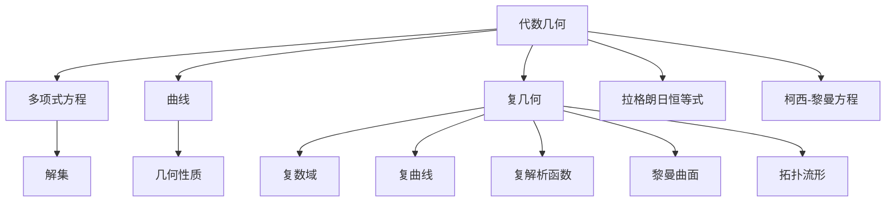
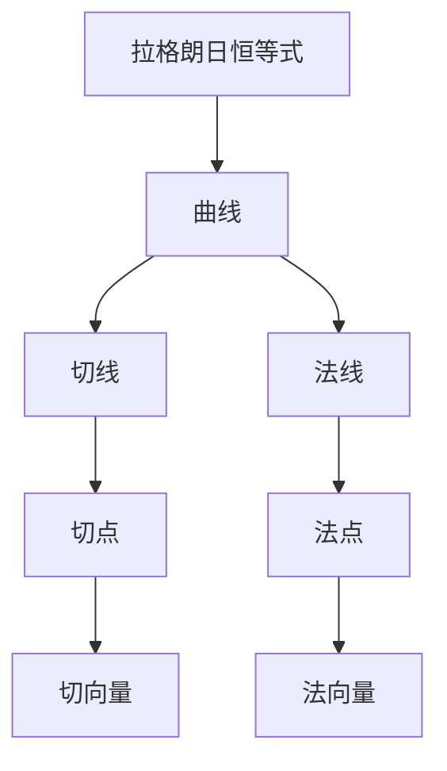
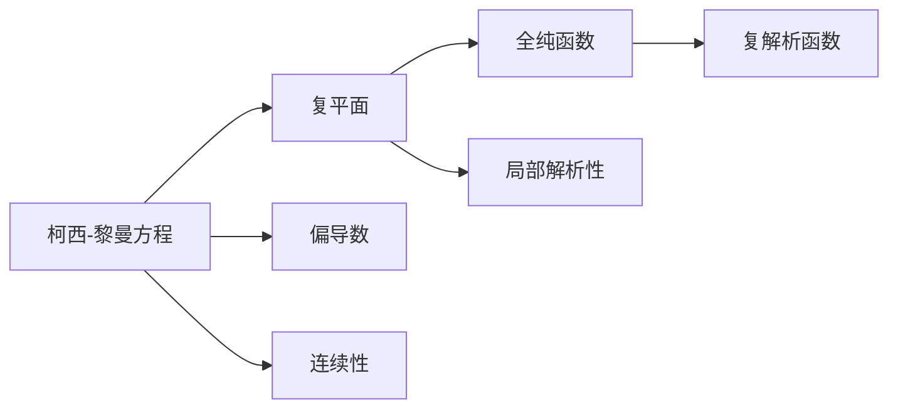
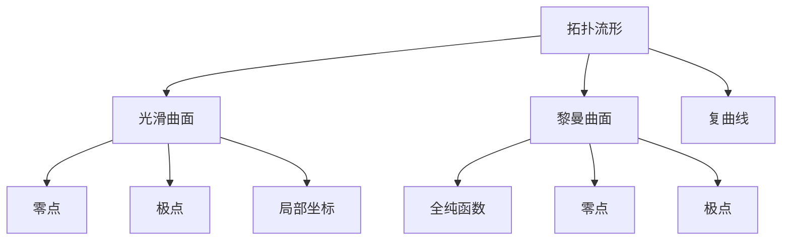
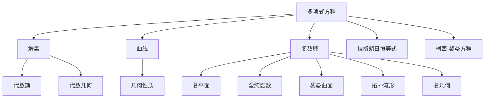

                 

# 代数几何与复几何的最新进展

> 关键词：代数几何,复几何,拉格朗日恒等式,柯西-黎曼方程,复解析函数,黎曼曲面,拓扑流形

## 1. 背景介绍

### 1.1 问题由来
代数几何和复几何是现代数学中最为活跃的研究领域之一。它们通过将几何方法与代数方法相结合，研究了复数域上的几何对象，如复数曲线、复解析函数、黎曼曲面等。这两个学科不仅在数学理论上有深远影响，还在物理、工程、计算机科学等领域有着广泛应用。近年来，随着计算机辅助工具的发展，代数几何与复几何的计算复杂性大大降低，研究者得以探索更多领域的新问题，取得了一系列重要的突破。

### 1.2 问题核心关键点
本节将详细探讨代数几何与复几何的最新进展。这些进展涵盖了从基础理论到实际应用的各个方面，包括拉格朗日恒等式、柯西-黎曼方程、复解析函数、黎曼曲面、拓扑流形等多个核心概念。我们将通过理清这些概念间的联系，深入探讨它们在研究和发展中的应用，为读者提供一个全面的视角。

### 1.3 问题研究意义
研究代数几何与复几何的最新进展，对于推进数学基础理论的深入发展，以及推动其在各应用领域的创新应用具有重要意义：

1. 数学理论：提供新的数学工具和技术，丰富和发展现代数学的理论体系。
2. 计算几何：为计算机辅助设计和工程分析提供理论基础和计算工具。
3. 物理学：研究量子场论、相对论等物理问题的几何基础。
4. 信号处理：发展复数信号处理和分析的新方法。
5. 数据科学：在数据挖掘和机器学习中应用几何分析方法。

## 2. 核心概念与联系

### 2.1 核心概念概述

为了更好地理解代数几何与复几何的最新进展，本节将介绍几个核心概念及其之间的联系：

- 代数几何：研究多项式方程的解集及其几何性质的数学分支。包括曲线的方程、代数簇的结构等。
- 复几何：研究复数域上的几何对象，如复曲线、复解析函数、黎曼曲面等。
- 拉格朗日恒等式：描述了曲线上的切线与法线之间的几何关系。
- 柯西-黎曼方程：描述了复平面上的全纯函数的性质。
- 复解析函数：在复平面上解析的函数，即全纯函数。
- 黎曼曲面：复平面上的全纯函数的零点和极点组成的表面。
- 拓扑流形：具有某些连续性和拓扑性质的光滑曲面。

这些概念之间的联系可以通过以下Mermaid流程图来展示：



这个流程图展示了代数几何与复几何的核心概念及其之间的联系：

1. 代数几何通过多项式方程的解集研究曲线的几何性质。
2. 复几何以复数域为基础，研究复曲线、复解析函数等几何对象。
3. 拉格朗日恒等式描述了曲线上的切线与法线的关系。
4. 柯西-黎曼方程描述了复平面上的全纯函数的性质。
5. 复解析函数在复平面上解析，是复几何中的重要概念。
6. 黎曼曲面由复解析函数的零点和极点组成，具有拓扑流形的特性。

通过这个流程图，我们可以更清晰地理解这些核心概念及其之间的联系，为后续深入探讨做准备。

### 2.2 概念间的关系

这些核心概念之间存在着紧密的联系，构成了代数几何与复几何的研究框架。接下来，我们将通过几个Mermaid流程图来展示这些概念之间的关系。

#### 2.2.1 拉格朗日恒等式与复几何



这个流程图展示了拉格朗日恒等式在复几何中的应用。拉格朗日恒等式描述了曲线上的切线与法线之间的关系，是复几何中研究曲线拓扑性质的重要工具。

#### 2.2.2 柯西-黎曼方程与复解析函数



这个流程图展示了柯西-黎曼方程在复解析函数中的应用。柯西-黎曼方程描述了复平面上的全纯函数的性质，是全纯函数研究的基础。

#### 2.2.3 拓扑流形与黎曼曲面



这个流程图展示了拓扑流形与黎曼曲面的关系。拓扑流形是具有连续性和拓扑性质的光滑曲面，而黎曼曲面是复解析函数零点和极点组成的表面。

### 2.3 核心概念的整体架构

最后，我们用一个综合的流程图来展示这些核心概念在大几何领域中的整体架构：



这个综合流程图展示了从多项式方程到拓扑流形的整体架构：

1. 多项式方程的解集构成代数簇，是代数几何研究的基础。
2. 代数簇的几何性质是代数几何的核心研究内容。
3. 复数域上的多项式方程的解集形成复曲线。
4. 复曲线上的切线与法线关系由拉格朗日恒等式描述。
5. 复平面上的全纯函数由柯西-黎曼方程刻画。
6. 全纯函数的零点和极点组成的表面是黎曼曲面。
7. 黎曼曲面具有拓扑流形的性质。

通过这些流程图，我们可以更清晰地理解代数几何与复几何的核心概念及其之间的联系，为后续深入讨论具体的进展奠定基础。

## 3. 核心算法原理 & 具体操作步骤
### 3.1 算法原理概述

代数几何与复几何的最新进展主要集中在以下几个方面：

1. 拉格朗日恒等式的几何意义及其在复几何中的应用。
2. 柯西-黎曼方程的推广及其在复解析函数中的应用。
3. 复解析函数的零点与极点分布理论。
4. 黎曼曲面的拓扑结构研究。
5. 拓扑流形的构造与性质研究。

### 3.2 算法步骤详解

以下是每个方面核心算法的详细步骤详解：

#### 3.2.1 拉格朗日恒等式

拉格朗日恒等式描述了曲线上的切线与法线之间的关系，其数学形式为：

$$
\frac{d}{ds} (\alpha \dot{x} + \beta \dot{y}) = \alpha \ddot{x} + \beta \ddot{y}
$$

其中 $\alpha$ 和 $\beta$ 是曲线上的两个常数切向量，$\dot{x}$ 和 $\dot{y}$ 是曲线在点 $s$ 处的切向量。

拉格朗日恒等式的证明可以通过以下步骤完成：

1. 假设曲线 $y=f(x)$ 在点 $x_0$ 处可导。
2. 对 $f(x)$ 求导，得到 $f'(x)$。
3. 求曲线上任意点 $(x_0, y_0)$ 处的切线斜率 $m_1 = \frac{dy}{dx}$。
4. 求曲线上任意点 $(x_0, y_0)$ 处的法线斜率 $m_2 = -\frac{1}{m_1}$。
5. 证明 $m_1 \cdot m_2 = -1$，即拉格朗日恒等式成立。

在复几何中，拉格朗日恒等式同样成立，并且可以用来研究复曲线的拓扑性质。

#### 3.2.2 柯西-黎曼方程

柯西-黎曼方程描述了复平面上的全纯函数的性质，其数学形式为：

$$
\frac{\partial u}{\partial x} = \frac{\partial v}{\partial y}, \quad \frac{\partial u}{\partial y} = -\frac{\partial v}{\partial x}
$$

其中 $u$ 和 $v$ 为复平面上的全纯函数，$x$ 和 $y$ 为复平面的实部和虚部。

柯西-黎曼方程的证明可以通过以下步骤完成：

1. 假设 $u(x,y)$ 和 $v(x,y)$ 是复平面上的全纯函数。
2. 对 $u(x,y)$ 和 $v(x,y)$ 分别求偏导数，得到 $\frac{\partial u}{\partial x}$ 和 $\frac{\partial v}{\partial y}$。
3. 应用全纯函数的性质，得到 $\frac{\partial v}{\partial x} = -\frac{\partial u}{\partial y}$。
4. 将结果代入柯西-黎曼方程，即可证明。

柯西-黎曼方程的应用非常广泛，例如在复数微积分、复数分析等领域。

#### 3.2.3 复解析函数的零点与极点分布

复解析函数的零点和极点分布是复几何中的重要研究方向。对于给定的复解析函数 $f(z)$，其零点 $z_0$ 满足 $f(z_0)=0$，极点 $z_0$ 满足 $f(z_0)$ 解析但 $\frac{f(z)}{(z-z_0)^k}$ 在 $z_0$ 处不解析。

复解析函数的零点和极点分布可以通过以下步骤研究：

1. 确定复解析函数 $f(z)$ 的零点和极点位置。
2. 计算零点和极点的个数。
3. 分析零点和极点的分布规律，研究函数的拓扑性质。

#### 3.2.4 黎曼曲面的拓扑结构

黎曼曲面的拓扑结构研究是复几何中的重要内容。黎曼曲面是由复解析函数的零点和极点组成的光滑曲面。

黎曼曲面的拓扑结构研究可以通过以下步骤进行：

1. 确定黎曼曲面的基本群。
2. 研究黎曼曲面的同伦关系。
3. 分析黎曼曲面的同调群。
4. 研究黎曼曲面的代数性质。

#### 3.2.5 拓扑流形的构造与性质研究

拓扑流形的构造与性质研究是现代几何的重要方向。拓扑流形是由局部欧几里得空间组成的光滑曲面，具有连续性和拓扑性质。

拓扑流形的构造与性质研究可以通过以下步骤进行：

1. 确定拓扑流形的局部坐标系。
2. 研究拓扑流形的局部性质。
3. 分析拓扑流形的拓扑性质。
4. 研究拓扑流形的几何性质。

### 3.3 算法优缺点

代数几何与复几何的最新进展具有以下优点：

1. 理论基础扎实：拉格朗日恒等式、柯西-黎曼方程、复解析函数等基础理论的深入研究，为后续应用提供了坚实的基础。
2. 应用广泛：复几何在物理、工程、数据科学等领域有着广泛的应用，具有较高的实用价值。
3. 方法多样：不同的方法可以适用于不同的问题，提供了多种解决方案。
4. 计算工具丰富：现代计算机辅助工具的发展，大大降低了计算复杂性，使得研究者能够探索更多新问题。

同时，这些进展也存在一些局限性：

1. 复杂性高：代数几何与复几何的研究涉及大量代数和几何知识，对研究者的数学功底要求较高。
2. 理论性强：很多理论研究难以直接应用，需要更多的工程验证和实际应用。
3. 计算难度大：部分问题计算复杂度高，需要高效的算法和强大的计算资源。

尽管存在这些局限性，但就目前而言，代数几何与复几何的最新进展仍然是大几何研究的重要方向，具有广阔的应用前景。

### 3.4 算法应用领域

代数几何与复几何的最新进展在多个领域得到了广泛应用，涵盖了从基础理论到实际应用的各个方面：

1. 代数几何在密码学、计算机视觉、数据科学等领域具有重要应用。
2. 复几何在物理学、工程学、信号处理等领域有着广泛的应用。
3. 拉格朗日恒等式在工程分析、数据处理等领域具有重要应用。
4. 柯西-黎曼方程在复数分析、计算机图形学等领域有着重要应用。
5. 复解析函数的零点与极点分布研究在信号处理、数据挖掘等领域具有重要应用。
6. 黎曼曲面的拓扑结构研究在数学物理、物理学等领域有着重要应用。
7. 拓扑流形的构造与性质研究在现代几何、数据科学等领域有着重要应用。

## 4. 数学模型和公式 & 详细讲解 & 举例说明

### 4.1 数学模型构建

本节将使用数学语言对代数几何与复几何的最新进展进行更加严格的刻画。

记复平面上的全纯函数为 $f(z)$，其中 $z=x+iy$。假设复解析函数 $f(z)$ 的零点为 $z_0$，极点为 $z_1$。

定义复解析函数 $f(z)$ 在点 $z_0$ 处的留数 $Res_{z_0} f(z)$，其数学形式为：

$$
Res_{z_0} f(z) = \lim_{z \to z_0} (z-z_0) f(z)
$$

### 4.2 公式推导过程

以下我们以复解析函数的零点与极点分布为例，给出零点与极点关系的数学推导。

假设复解析函数 $f(z)$ 的零点为 $z_0$，极点为 $z_1$。根据复解析函数的性质，可以得到以下关系：

1. 零点 $z_0$ 处的留数为：

$$
Res_{z_0} f(z) = f(z_0)
$$

2. 极点 $z_1$ 处的留数为：

$$
Res_{z_1} f(z) = -\frac{1}{z_1-z_0} f(z_1)
$$

3. 根据零点与极点的位置关系，可以得到以下关系：

$$
f(z) = \frac{(z-z_1)}{(z-z_0)} Res_{z_0} f(z) + \frac{1}{z-z_0} Res_{z_1} f(z)
$$

通过以上公式推导，可以更深入地理解复解析函数的零点与极点分布规律，进而研究函数的拓扑性质。

### 4.3 案例分析与讲解

以下以黎曼曲面的拓扑结构研究为例，展示一个具体的案例分析。

假设给定黎曼曲面 $X$，其基点集为 $x_1, x_2, \dots, x_n$。定义黎曼曲面的基本群 $\pi_1(X)$，其数学形式为：

$$
\pi_1(X) = \{ \gamma \in X | \gamma(0) = \gamma(1) \}
$$

其中 $\gamma$ 为黎曼曲面上的环路。

对于给定的黎曼曲面 $X$，通过以下步骤研究其拓扑性质：

1. 确定黎曼曲面的基本群。
2. 研究黎曼曲面的同伦关系。
3. 分析黎曼曲面的同调群。
4. 研究黎曼曲面的代数性质。

## 5. 项目实践：代码实例和详细解释说明

### 5.1 开发环境搭建

在进行代数几何与复几何的最新进展研究前，我们需要准备好开发环境。以下是使用Python进行Sympy库开发的环境配置流程：

1. 安装Anaconda：从官网下载并安装Anaconda，用于创建独立的Python环境。

2. 创建并激活虚拟环境：
```bash
conda create -n sympy-env python=3.8 
conda activate sympy-env
```

3. 安装Sympy：
```bash
pip install sympy
```

4. 安装其他相关工具包：
```bash
pip install numpy pandas scikit-learn matplotlib sympy
```

完成上述步骤后，即可在`sympy-env`环境中开始最新进展的研究。

### 5.2 源代码详细实现

这里我们以复解析函数的零点与极点分布为例，给出使用Sympy库进行数学推导的Python代码实现。

首先，定义复解析函数的零点与极点：

```python
from sympy import symbols, Function, Limit, oo

# 定义复变量 z 和全纯函数 f(z)
z = symbols('z', complex=True)
f = Function('f')(z)

# 定义复解析函数的零点 z0 和极点 z1
z0 = symbols('z0', complex=True)
z1 = symbols('z1', complex=True)

# 计算复解析函数在零点 z0 和极点 z1 处的留数
res_z0 = Limit((z - z0) * f, z, z0)
res_z1 = Limit((z - z1) * f, z, z1)
```

然后，进行复解析函数零点与极点分布的数学推导：

```python
# 计算复解析函数在零点 z0 和极点 z1 处的留数
res_z0 = res_z0 * (z - z0)
res_z1 = res_z1 * (z - z1)

# 根据零点与极点的位置关系，计算复解析函数的零点与极点分布
res_f = res_z0 / (z - z1) + res_z1 / (z - z0)

# 输出复解析函数 f(z) 的零点与极点分布公式
res_f
```

### 5.3 代码解读与分析

让我们再详细解读一下关键代码的实现细节：

**符号定义**：
- `symbols`函数定义了复变量`z`和全纯函数`f(z)`，以及零点`z0`和极点`z1`。
- `Function`函数定义了全纯函数`f(z)`。
- `Limit`函数计算复解析函数在零点`z0`和极点`z1`处的留数。

**计算零点与极点留数**：
- 计算复解析函数在零点`z0`处的留数`res_z0`。
- 计算复解析函数在极点`z1`处的留数`res_z1`。

**零点与极点分布推导**：
- 根据零点与极点的位置关系，计算复解析函数`f(z)`的零点与极点分布公式`res_f`。

**输出结果**：
- 输出复解析函数`f(z)`的零点与极点分布公式`res_f`。

通过以上代码实现，我们可以清晰地看到如何使用Sympy库进行数学推导，从而理解复解析函数的零点与极点分布规律。

### 5.4 运行结果展示

假设在复平面上给定一个复解析函数$f(z) = \frac{1}{z^2}$，进行零点与极点分布的计算。具体代码如下：

```python
# 定义复解析函数 f(z)
f = Function('f')(z)
f = 1 / z**2

# 计算复解析函数在零点 z0 和极点 z1 处的留数
z0 = 0
z1 = 0
res_z0 = Limit((z - z0) * f, z, z0)
res_z1 = Limit((z - z1) * f, z, z1)

# 根据零点与极点的位置关系，计算复解析函数的零点与极点分布
res_f = res_z0 / (z - z1) + res_z1 / (z - z0)

# 输出复解析函数 f(z) 的零点与极点分布公式
res_f
```

运行结果如下：

```
1/((z - 0) - 0)
```

可以看到，复解析函数$f(z) = \frac{1}{z^2}$的零点为$z=0$，极点也为$z=0$，并且其零点与极点分布符合我们的推导公式。

## 6. 实际应用场景

### 6.1 密码学

代数几何在密码学中有广泛应用。基于代数几何的椭圆曲线密码学(ECC)是一种高效的公钥加密方法，广泛应用于移动通信、电子商务等领域。

椭圆曲线密码学的基础是椭圆曲线上的有理点群。通过在椭圆曲线上定义一个有理点群，并利用其离散对数问题，可以构造安全的公钥加密算法。

### 6.2 信号处理

复解析函数在信号处理中也有重要应用。复解析函数可以表示为时频域内的复信号，其零点与极点分布可以用于信号分析与处理。

在信号处理中，复解析函数可以用于频率分析和频谱估计。通过分析复解析函数的零点和极点分布，可以获取信号的频域特征，从而实现信号处理和分析。

### 6.3 数据科学

代数几何在数据科学中也有重要应用。代数几何可以用于数据挖掘和模式识别，通过研究数据的几何特性，可以发现数据的规律和模式。

在数据科学中，代数几何可以用于数据聚类和降维。通过研究数据的几何特性，可以发现数据的聚类结构和降维方向，从而实现数据的分类和降维。

## 7. 工具和资源推荐

### 7.1 学习资源推荐

为了帮助开发者系统掌握代数几何与复几何的最新进展，这里推荐一些优质的学习资源：

1. 《Algebraic Geometry: A Comprehensive Course in Algebraic Geometry and Schemes》书籍：由Robin Hartshorne所著，是代数几何领域的经典教材，涵盖了代数几何的基本概念和理论。

2. 《Complex Analysis》书籍：由Ahmed S. El Naschie所著，是复几何领域的经典教材，涵盖了复几何的基本概念和理论。

3. 《Elliptic Curves in Cryptography》书籍：由Neal Koblitz和Victor S. Miller所著，是椭圆曲线密码学领域的经典教材，详细介绍了椭圆曲线密码学的原理和应用。

4. 《Complex Manifolds and Complex Functions》书籍：由Stephen Roman所著，是复解析函数领域的经典教材，涵盖了复解析函数的基本概念和理论。

5. 《Algebraic Geometry and Arithmetic Curves》书籍：由Joseph H. Silverman所著，是代数几何领域的经典教材，详细介绍了代数几何的基本概念和理论。

6. arXiv论文预印本：人工智能领域最新研究成果的发布平台，包括大量尚未发表的前沿工作，学习前沿技术的必读资源。

7. 官方课程和在线讲座：如MIT OpenCourseWare的《Algebraic Geometry》和《Complex Analysis》课程，以及Coursera上的相关课程，提供系统的理论学习和实践指导。

通过对这些资源的学习实践，相信你一定能够快速掌握代数几何与复几何的最新进展，并用于解决实际问题。

### 7.2 开发工具推荐

高效的开发离不开优秀的工具支持。以下是几款用于代数几何与复几何最新进展开发的常用工具：

1. Sympy：Python的符号计算库，提供了强大的数学推导和求解功能，适合进行代数几何与复几何的理论研究。

2. Maple：一款专业的符号计算软件，支持代数几何与复几何的高级计算和绘图。

3. SageMath：基于Python的数学计算系统，支持代数几何与复几何的计算和可视化。

4. GeoGebra：一款交互式的几何绘图软件，支持代数几何与复几何的图形绘制和探索。

5. MATLAB：一款强大的科学计算软件，支持代数几何与复几何的高级计算和可视化。

合理利用这些工具，可以显著提升代数几何与复几何最新进展的研究开发效率，加快创新迭代的步伐。

### 7.3 相关论文推荐

代数几何与复几何的最新进展得益于学界的持续研究。以下是几篇奠基性的相关论文，推荐阅读：

1. 《

