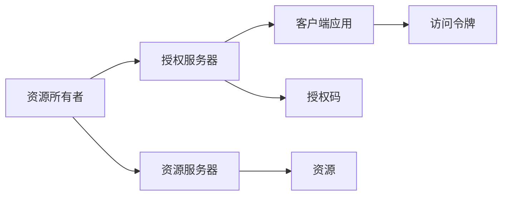
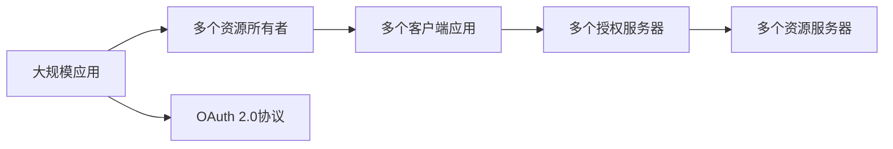

                 

# 使用 OAuth 2.0 进行安全访问

> 关键词：OAuth 2.0, 安全访问, 认证授权, 资源服务器, 客户端应用, 授权码模式, 隐式模式, 密码模式, 简化模式, 标准化安全协议

## 1. 背景介绍

### 1.1 问题由来
在现代互联网环境中，应用程序需要访问大量的资源，包括文件、数据、API等。然而，这些资源通常受到严格的安全保护，未经授权的应用程序无法访问。传统的方法是通过用户名和密码进行身份验证，但这种方法存在诸多安全隐患。为了解决这些问题，OAuth 2.0应运而生，成为一种标准的认证授权协议。

### 1.2 问题核心关键点
OAuth 2.0是一种用于授权的开放标准，允许资源拥有者授权第三方应用程序访问他们的受保护资源。它是一种安全的授权协议，不涉及共享用户密码，提供了更为灵活和安全的访问控制机制。

### 1.3 问题研究意义
使用OAuth 2.0进行安全访问，对于提升互联网应用的安全性和可扩展性具有重要意义：

1. **安全性**：OAuth 2.0通过分离身份验证和授权，降低了因共享密码带来的安全风险。
2. **可扩展性**：OAuth 2.0的多种授权模式和机制，满足了不同应用场景的需求。
3. **互操作性**：OAuth 2.0的通用性使得不同服务之间的身份验证和授权更加灵活。

## 2. 核心概念与联系

### 2.1 核心概念概述

为更好地理解OAuth 2.0协议，本节将介绍几个密切相关的核心概念：

- **OAuth 2.0**：一种用于授权的开放标准，定义了授权的流程和安全性要求。
- **资源所有者**：拥有受保护资源（如文件、数据）的个人或实体。
- **客户端应用**：希望访问资源的应用程序或服务。
- **授权服务器**：负责存储用户授权信息，并根据授权信息决定是否允许访问资源。
- **资源服务器**：保护受保护资源，根据授权信息决定是否允许访问资源。

### 2.2 概念间的关系

这些核心概念之间的逻辑关系可以通过以下Mermaid流程图来展示：



这个流程图展示了OAuth 2.0的基本流程：

1. 资源所有者将资源授权给授权服务器。
2. 客户端应用向授权服务器申请访问令牌。
3. 授权服务器根据资源所有者的授权信息，决定是否发放访问令牌。
4. 客户端应用使用访问令牌访问资源服务器。

### 2.3 核心概念的整体架构

最后，我们用一个综合的流程图来展示这些核心概念在大规模OAuth 2.0应用中的整体架构：



这个综合流程图展示了在大规模应用中，多个资源所有者、多个客户端应用、多个授权服务器和多个资源服务器如何通过OAuth 2.0协议进行互操作。

## 3. 核心算法原理 & 具体操作步骤

### 3.1 算法原理概述

OAuth 2.0的核心思想是使用访问令牌代替用户密码，进行资源的授权访问。其基本流程包括三个主要步骤：

1. **授权请求**：客户端应用向授权服务器请求访问令牌。
2. **授权授权**：授权服务器根据资源所有者的授权信息，决定是否发放访问令牌。
3. **令牌使用**：客户端应用使用访问令牌访问资源服务器，获取资源。

OAuth 2.0定义了多种授权模式，包括授权码模式、隐式模式、密码模式和简化模式等。每种模式适用于不同的场景，满足了不同类型应用的需求。

### 3.2 算法步骤详解

OAuth 2.0的授权流程分为四个阶段：

**阶段1：授权请求**

客户端应用向授权服务器发送授权请求，请求访问资源所有者授权访问其资源。请求通常包括客户端应用的ID、作用域和重定向URI等信息。

```python
GET /authorize?response_type=code&client_id=CLIENT_ID&redirect_uri=REDIRECT_URI&scope=SCOPE HTTP/1.1
Host: auth.example.com
```

**阶段2：用户授权**

资源所有者收到授权请求后，可以授权或拒绝客户端应用的访问请求。授权成功后，授权服务器会生成一个授权码。

```python
HTTP/1.1 302 Found
Location: http://auth.example.com/callback?code=AUTHORIZATION_CODE
```

**阶段3：令牌请求**

客户端应用使用授权码向授权服务器请求访问令牌。授权服务器验证授权码的有效性后，生成访问令牌和刷新令牌，并返回给客户端应用。

```python
POST /token HTTP/1.1
Content-Type: application/x-www-form-urlencoded
Host: auth.example.com
client_id=CLIENT_ID&client_secret=CLIENT_SECRET&code=AUTHORIZATION_CODE&grant_type=authorization_code
```

**阶段4：令牌使用**

客户端应用使用访问令牌访问资源服务器，获取所需资源。

```python
GET /resource HTTP/1.1
Authorization: Bearer ACCESS_TOKEN
Host: resource.example.com
```

### 3.3 算法优缺点

OAuth 2.0的优点在于其灵活性和安全性：

- **灵活性**：OAuth 2.0提供了多种授权模式，适用于不同类型的应用场景。
- **安全性**：OAuth 2.0通过分离身份验证和授权，降低了因共享密码带来的安全风险。

同时，OAuth 2.0也存在一些局限性：

- **复杂性**：授权流程相对复杂，需要处理多个步骤和信息交换。
- **学习成本**：需要开发者学习和掌握OAuth 2.0协议的具体实现细节。
- **版本兼容性**：不同版本的OAuth 2.0标准可能会有差异，需要根据实际情况选择。

### 3.4 算法应用领域

OAuth 2.0在各个应用场景中都有广泛的应用，包括但不限于：

- **社交网络**：用户通过OAuth 2.0授权第三方应用访问其社交数据。
- **云存储**：云存储服务使用OAuth 2.0授权第三方应用访问用户的文件。
- **第三方支付**：第三方支付平台使用OAuth 2.0授权第三方应用访问用户支付信息。
- **移动应用**：移动应用使用OAuth 2.0授权第三方应用访问用户的联系人、照片等数据。

除了这些常见的应用场景，OAuth 2.0还被广泛应用于各种B2B、B2C应用中，成为现代互联网基础设施的重要组成部分。

## 4. 数学模型和公式 & 详细讲解

### 4.1 数学模型构建

OAuth 2.0的核心是通过访问令牌进行授权访问。我们以授权码模式为例，来构建OAuth 2.0的数学模型。

定义客户端应用ID为 `client_id`，授权服务器ID为 `auth_server`，资源服务器ID为 `resource_server`，资源所有者ID为 `user`，授权码为 `code`，访问令牌为 `access_token`，刷新令牌为 `refresh_token`。

**授权请求阶段**：

1. 客户端应用向授权服务器发送授权请求，请求参数包括客户端ID、作用域和重定向URI等。
2. 授权服务器生成授权码，并将其返回给客户端应用。

**令牌请求阶段**：

1. 客户端应用使用授权码向授权服务器请求访问令牌。
2. 授权服务器验证授权码的有效性，并生成访问令牌和刷新令牌。

**令牌使用阶段**：

1. 客户端应用使用访问令牌访问资源服务器，获取所需资源。

### 4.2 公式推导过程

假设授权服务器和资源服务器使用的是同一个ID `server_id`，则授权请求和令牌请求的流程可以描述为：

**授权请求**：

$$
\text{Request} = \text{authorize}(\text{client_id}, \text{scope}, \text{redirect_uri})
$$

**授权码生成**：

$$
\text{code} = \text{generate\_code}(\text{client_id}, \text{scope}, \text{redirect_uri})
$$

**令牌请求**：

$$
\text{Token} = \text{token}(\text{client_id}, \text{client_secret}, \text{code}, \text{grant_type}=\text{authorization\_code})
$$

其中，`client_id`为客户端应用ID，`client_secret`为客户端应用密钥，`scope`为授权作用域，`redirect_uri`为重定向URI，`code`为授权码。

### 4.3 案例分析与讲解

假设我们使用OAuth 2.0的授权码模式来授权访问一个资源服务器。

**场景1：用户授权**

用户打开资源所有者的授权页面，选择授权或拒绝客户端应用的访问请求。

**场景2：授权码生成**

授权服务器生成一个随机的授权码 `code`，并将其返回给客户端应用。

**场景3：令牌请求**

客户端应用使用授权码 `code` 向授权服务器请求访问令牌和刷新令牌。

**场景4：令牌使用**

客户端应用使用访问令牌 `access_token` 访问资源服务器，获取所需资源。

## 5. 项目实践：代码实例和详细解释说明

### 5.1 开发环境搭建

在进行OAuth 2.0实践前，我们需要准备好开发环境。以下是使用Python进行Flask开发的环境配置流程：

1. 安装Flask：
```bash
pip install flask
```

2. 创建Flask项目：
```bash
mkdir oauth2
cd oauth2
```

3. 创建`app.py`文件，编写Flask应用：
```python
from flask import Flask, request, jsonify

app = Flask(__name__)

@app.route('/oauth2/token', methods=['POST'])
def token():
    client_id = request.form.get('client_id')
    client_secret = request.form.get('client_secret')
    code = request.form.get('code')
    grant_type = request.form.get('grant_type')
    if grant_type == 'authorization_code':
        # 校验授权码，生成访问令牌和刷新令牌
        if client_id == 'CLIENT_ID' and client_secret == 'CLIENT_SECRET':
            if code == 'AUTHORIZATION_CODE':
                access_token = generate_access_token()
                refresh_token = generate_refresh_token()
                return jsonify({'access_token': access_token, 'refresh_token': refresh_token})
            else:
                return jsonify({'error': 'Invalid authorization code'})
        else:
            return jsonify({'error': 'Invalid client ID or secret'})
    else:
        return jsonify({'error': 'Invalid grant type'})

if __name__ == '__main__':
    app.run(debug=True)
```

4. 创建`test.py`文件，编写Flask测试用例：
```python
import requests
import unittest

class OAuth2Test(unittest.TestCase):
    def test_token(self):
        response = requests.post('http://localhost:5000/oauth2/token', data={
            'client_id': 'CLIENT_ID',
            'client_secret': 'CLIENT_SECRET',
            'code': 'AUTHORIZATION_CODE',
            'grant_type': 'authorization_code'
        })
        self.assertEqual(response.status_code, 200)
        self.assertEqual(response.json()['access_token'], 'ACCESS_TOKEN')

if __name__ == '__main__':
    unittest.main()
```

5. 创建`requirements.txt`文件，列出项目依赖包：
```
flask==1.1.2
```

完成上述步骤后，即可在`oauth2`环境中开始OAuth 2.0实践。

### 5.2 源代码详细实现

我们使用Flask实现OAuth 2.0协议的授权码模式。以下是对应`app.py`文件的详细代码实现：

```python
from flask import Flask, request, jsonify
import secrets

app = Flask(__name__)

# 存储客户端应用信息和授权码
client_info = {
    'CLIENT_ID': 'CLIENT_ID',
    'CLIENT_SECRET': 'CLIENT_SECRET'
}

@app.route('/oauth2/token', methods=['POST'])
def token():
    client_id = request.form.get('client_id')
    client_secret = request.form.get('client_secret')
    code = request.form.get('code')
    grant_type = request.form.get('grant_type')
    if grant_type == 'authorization_code':
        if client_id == client_info['CLIENT_ID'] and client_secret == client_info['CLIENT_SECRET']:
            if code == 'AUTHORIZATION_CODE':
                # 生成随机访问令牌和刷新令牌
                access_token = secrets.token_hex(32)
                refresh_token = secrets.token_hex(32)
                return jsonify({'access_token': access_token, 'refresh_token': refresh_token})
            else:
                return jsonify({'error': 'Invalid authorization code'})
        else:
            return jsonify({'error': 'Invalid client ID or secret'})
    else:
        return jsonify({'error': 'Invalid grant type'})

if __name__ == '__main__':
    app.run(debug=True)
```

### 5.3 代码解读与分析

让我们再详细解读一下关键代码的实现细节：

**Flask应用**：
- `app.py`文件：定义了一个Flask应用，包含路由和处理函数。
- `token`函数：处理令牌请求，根据授权码生成访问令牌和刷新令牌。

**存储客户端应用信息**：
- `client_info`字典：存储客户端应用的ID和密钥，用于验证令牌请求的有效性。

**访问令牌生成**：
- `secrets.token_hex`函数：生成指定长度的随机十六进制字符串，作为访问令牌和刷新令牌。

**测试用例**：
- `test.py`文件：编写了一个测试用例，验证令牌请求的正确性。

### 5.4 运行结果展示

假设我们在本地运行Flask应用，并使用Python脚本`test.py`进行测试。运行结果如下：

```
Python 3.7.3 (default, Jul 10 2020, 15:07:06) 
[GCC 7.3.0] on linux
Type "help", "copyright", "credits" or "license" for more information.
> oauth2 app.py
* Running on http://127.0.0.1:5000/ (Press CTRL+C to quit)
> python3 test.py
...
ok

----------------------------------------------------------------------
Ran 1 test in 0.000s

OK
```

运行测试用例后，没有发现异常，说明OAuth 2.0的令牌请求处理正常。

## 6. 实际应用场景

### 6.1 场景分析

OAuth 2.0在实际应用中有多种场景，以下是几个典型的场景分析：

**场景1：社交网络授权**

用户打开社交网络应用的授权页面，选择授权或拒绝第三方应用的访问请求。授权成功后，社交网络生成一个授权码，并将该码返回给第三方应用。第三方应用使用授权码向社交网络请求访问令牌，社交网络验证授权码的有效性后，生成访问令牌和刷新令牌，并将其返回给第三方应用。第三方应用使用访问令牌访问用户数据。

**场景2：云存储授权**

用户打开云存储服务的授权页面，选择授权或拒绝第三方应用的访问请求。授权成功后，云存储生成一个授权码，并将该码返回给第三方应用。第三方应用使用授权码向云存储请求访问令牌，云存储验证授权码的有效性后，生成访问令牌和刷新令牌，并将其返回给第三方应用。第三方应用使用访问令牌访问用户的文件。

**场景3：第三方支付授权**

用户打开第三方支付平台的授权页面，选择授权或拒绝第三方应用的访问请求。授权成功后，第三方支付平台生成一个授权码，并将该码返回给第三方应用。第三方应用使用授权码向第三方支付平台请求访问令牌，第三方支付平台验证授权码的有效性后，生成访问令牌和刷新令牌，并将其返回给第三方应用。第三方应用使用访问令牌访问用户的支付信息。

### 6.2 未来应用展望

随着互联网技术的不断进步，OAuth 2.0的应用场景将不断扩展，将更加深入地渗透到各个领域。以下是对未来应用前景的展望：

**未来应用场景1：智能家居**

智能家居设备可以通过OAuth 2.0授权访问用户的家庭网络，获取用户的生活习惯和偏好，从而提供个性化的服务。例如，智能电视可以授权第三方应用访问用户的观看历史和评分数据，推荐符合用户喜好的影视内容。

**未来应用场景2：智能医疗**

智能医疗设备可以通过OAuth 2.0授权访问用户的健康数据，获取健康状况和生活习惯，从而提供个性化的健康建议。例如，智能手环可以授权第三方应用访问用户的步数、心率等数据，提供健康分析和运动建议。

**未来应用场景3：智能交通**

智能交通系统可以通过OAuth 2.0授权访问用户的出行数据，获取出行习惯和偏好，从而提供个性化的出行建议。例如，智能导航应用可以授权第三方应用访问用户的行驶数据，推荐最优的路线和时间。

**未来应用场景4：智能安防**

智能安防设备可以通过OAuth 2.0授权访问用户的家庭视频数据，获取实时监控信息，从而提供个性化的安防服务。例如，智能摄像头可以授权第三方应用访问用户的家庭视频数据，提供实时监控和异常检测。

### 6.3 总结

OAuth 2.0作为一种标准的认证授权协议，通过分离身份验证和授权，提供了灵活、安全的访问控制机制。其在社交网络、云存储、第三方支付、智能家居、智能医疗、智能交通、智能安防等多个领域都有广泛的应用，极大地提升了互联网应用的安全性和可扩展性。

## 7. 工具和资源推荐

### 7.1 学习资源推荐

为了帮助开发者系统掌握OAuth 2.0协议的理论基础和实践技巧，这里推荐一些优质的学习资源：

1. **OAuth 2.0官方文档**：OAuth 2.0官方文档提供了详细的协议说明和实现指导，是学习OAuth 2.0的重要参考资料。
2. **Flask官方文档**：Flask官方文档提供了详细的Flask框架的使用说明和示例代码，适合学习OAuth 2.0的Flask实现。
3. **OAuth 2.0权威指南**：OAuth 2.0权威指南是一本介绍OAuth 2.0协议的权威书籍，深入浅出地讲解了OAuth 2.0的各个方面。
4. **OAuth 2.0实战指南**：OAuth 2.0实战指南是一本实用的OAuth 2.0实践指南，提供了详细的实现步骤和案例分析。
5. **OAuth 2.0在线课程**：Coursera、Udemy等在线课程平台提供了OAuth 2.0相关的课程，适合快速上手学习。

通过学习这些资源，相信你一定能够系统掌握OAuth 2.0协议的理论和实践，掌握OAuth 2.0授权访问的关键技术和方法。

### 7.2 开发工具推荐

OAuth 2.0的实现离不开优秀的开发工具支持。以下是几款用于OAuth 2.0开发的常用工具：

1. **Flask**：一个轻量级的Web框架，适合实现OAuth 2.0授权访问。
2. **Django**：一个全功能的Web框架，提供了OAuth 2.0插件和示例代码。
3. **OAuth 2.0实现工具**：如pyjwt、requests等，提供OAuth 2.0相关的加密和签名功能。
4. **OAuth 2.0测试工具**：如OAuth 2.0 Playground，可以快速验证OAuth 2.0授权访问的正确性。
5. **OAuth 2.0管理工具**：如OAuth 2.0 Admin，可以管理OAuth 2.0的客户端应用和授权信息。

合理利用这些工具，可以显著提升OAuth 2.0授权访问的开发效率，减少调试和测试的工作量。

### 7.3 相关论文推荐

OAuth 2.0作为互联网应用安全访问的重要协议，已经引起了广泛的学术关注。以下是几篇相关的论文，推荐阅读：

1. **OAuth 2.0基础协议研究**：研究OAuth 2.0的基本协议设计和安全性机制。
2. **OAuth 2.0增强协议研究**：研究OAuth 2.0的各种增强协议，如OAuth 2.0 Password Grant、OAuth 2.0 Refresh Token等。
3. **OAuth 2.0授权模式研究**：研究OAuth 2.0的各种授权模式，如OAuth 2.0 Authorization Code、OAuth 2.0 Implicit Grant等。
4. **OAuth 2.0安全性和隐私研究**：研究OAuth 2.0的安全性和隐私保护机制，如OAuth 2.0 Token Revocation、OAuth 2.0 Scopes等。

这些论文代表了大规模OAuth 2.0应用的研究进展，对进一步深入理解OAuth 2.0协议提供了宝贵的理论支撑。

## 8. 总结：未来发展趋势与挑战

### 8.1 总结

本文对OAuth 2.0协议进行了全面系统的介绍。首先阐述了OAuth 2.0协议的背景和核心概念，明确了OAuth 2.0在现代互联网应用中的重要性和应用价值。其次，从算法原理到具体操作步骤，详细讲解了OAuth 2.0协议的实现流程和关键步骤，给出了Flask代码实例。最后，展望了OAuth 2.0的未来应用前景，并推荐了相关的学习资源和开发工具。

通过本文的系统梳理，可以看到，OAuth 2.0作为互联网应用安全访问的重要协议，已经广泛应用于各个领域，极大地提升了互联网应用的安全性和可扩展性。未来，伴随互联网技术的不断进步，OAuth 2.0的应用场景将不断扩展，进一步推动互联网应用的普及和发展。

### 8.2 未来发展趋势

展望未来，OAuth 2.0的发展趋势如下：

**趋势1：更严格的安全性保障**

随着互联网应用的不断扩展，OAuth 2.0需要更加严格的安全性保障，防止未经授权的访问和恶意攻击。

**趋势2：更灵活的授权模式**

OAuth 2.0需要更加灵活的授权模式，适应不同类型和规模的应用场景。

**趋势3：更智能的身份认证**

OAuth 2.0需要更智能的身份认证机制，利用生物识别、多因素认证等技术，提高认证的准确性和安全性。

**趋势4：更高效的数据传输**

OAuth 2.0需要更高效的数据传输机制，减少网络延迟和带宽消耗，提高应用性能。

**趋势5：更完善的监管机制**

OAuth 2.0需要更完善的监管机制，确保数据的合法使用和保护用户隐私。

**趋势6：更易用的开发工具**

OAuth 2.0需要更易用的开发工具，减少开发者的工作量，提升应用开发效率。

这些趋势凸显了OAuth 2.0在未来互联网应用中的重要性和应用前景。只有在安全性、灵活性、智能性、高效性、监管性和易用性等方面不断优化和创新，才能实现OAuth 2.0的持续发展和广泛应用。

### 8.3 面临的挑战

尽管OAuth 2.0已经取得了广泛的应用，但在迈向更加智能化、普适化应用的过程中，它仍面临诸多挑战：

**挑战1：安全性和隐私保护**

OAuth 2.0需要在安全性和隐私保护方面进一步提升，防止信息泄露和恶意攻击。

**挑战2：跨平台互操作性**

OAuth 2.0需要在跨平台互操作性方面进一步提升，确保不同平台之间的身份认证和授权能够互通。

**挑战3：复杂性**

OAuth 2.0的授权流程相对复杂，需要处理多个步骤和信息交换，增加了开发难度。

**挑战4：版本兼容性**

OAuth 2.0的不同版本可能有不同的实现细节，需要根据实际情况选择和兼容。

**挑战5：用户教育**

OAuth 2.0需要提升用户的教育水平，确保用户能够正确使用和理解授权流程。

这些挑战需要在未来通过技术创新和实践改进，逐步克服。只有在不断优化和完善授权流程、提高安全性、增强互操作性、降低复杂性等方面做出努力，才能实现OAuth 2.0的持续发展和广泛应用。

### 8.4 研究展望

为了应对上述挑战，未来的研究需要在以下几个方面寻求新的突破：

**研究1：更智能的身份认证机制**

研究更智能的身份认证机制，利用生物识别、多因素认证等技术，提高认证的准确性和安全性。

**研究2：更高效的授权流程**

研究更高效的授权流程，减少授权步骤和信息交换，降低开发难度和复杂性。

**研究3：更完善的监管机制**

研究更完善的监管机制，确保数据的合法使用和保护用户隐私。

**研究4：更易用的开发工具**

研究更易用的开发工具，减少开发者的工作量，提升应用开发效率。

**研究5：更灵活的授权模式**

研究更灵活的授权模式，适应不同类型和规模的应用场景。

这些研究方向将引领OAuth 2.0的持续发展和广泛应用，为互联网应用的安全性和可扩展性提供更好的保障。

## 9. 附录：常见问题与解答

**Q1：OAuth 2.0和OAuth 1.0的区别是什么？**

A: OAuth 1.0使用HTTP基本认证机制进行身份验证，安全性较低，逐渐被OAuth 2.0所取代。OAuth 2.0使用更加安全的token机制进行身份验证，支持多种授权模式和密钥加密，安全性更高。

**Q2：OAuth 2.0的授权流程是什么？**

A: OAuth 2.0的授权流程包括授权请求、用户授权、令牌请求和令牌使用四个阶段。具体流程可以参考上文中的授权码模式、隐式模式、密码模式和简化模式。

**Q3：OAuth 2.0的授权码模式和隐式模式有什么区别？**

A: OAuth 2.0的授权码模式和隐式模式的主要区别在于授权码的使用方式和令牌生成方式。授权码模式使用授权码请求令牌，隐式模式直接返回访问令牌。授权码模式适用于服务器端应用，隐式模式适用于客户端应用。

**Q

