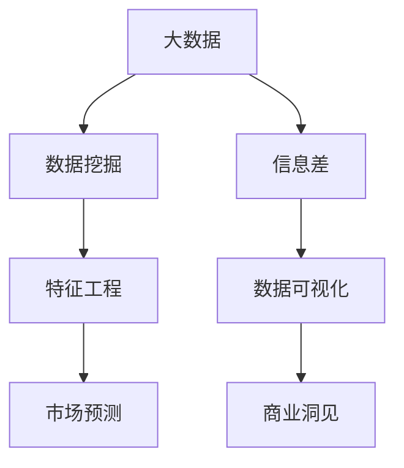
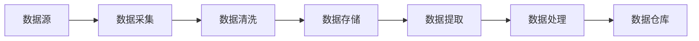
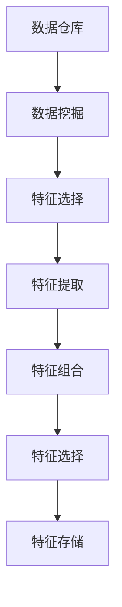
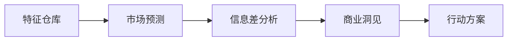
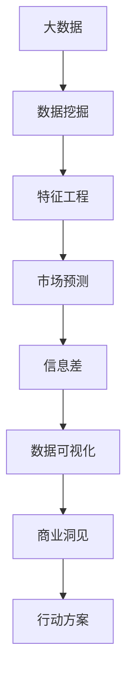

                 

# 信息差的商业洞见发现：大数据如何发现隐藏的商机

> 关键词：商业洞见,大数据,信息差,数据挖掘,市场预测

## 1. 背景介绍

### 1.1 问题由来
在信息爆炸的时代，海量的数据被源源不断地产生和积累，这些数据背后蕴含着巨大的商业价值。如何从中挖掘出隐藏的市场商机，成为企业竞争的关键。信息差（Information Gap），即企业内部信息与市场信息之间的差异，是企业发现新商机的重要线索。大数据和机器学习技术的发展，为发现和利用信息差提供了强有力的工具。

### 1.2 问题核心关键点
信息差的存在，导致企业在市场竞争中处于不同地位，对企业的市场策略、产品创新和资源配置等方面产生重大影响。大数据和机器学习技术可以从海量数据中提取信息，通过分析信息差，帮助企业识别市场机会，制定更为精准的商业策略。

### 1.3 问题研究意义
研究如何利用大数据和机器学习技术发现信息差，对于提升企业的市场竞争力，优化资源配置，发现新的商业机会，具有重要意义。信息差的利用能够帮助企业提前布局市场，降低风险，增加收益，促进企业长期发展。

## 2. 核心概念与联系

### 2.1 核心概念概述

为更好地理解大数据如何发现信息差，本节将介绍几个密切相关的核心概念：

- 大数据（Big Data）：指规模巨大、类型多样的数据集合，包括结构化数据、非结构化数据等。通过大数据技术可以高效存储、管理和分析海量数据。

- 信息差（Information Gap）：指企业内部信息与市场信息之间的差异。这种差异可以来自于市场变化、消费者需求、竞争态势等方面。

- 数据挖掘（Data Mining）：通过挖掘和分析海量数据，发现隐藏的模式、关系和趋势，支持企业决策。

- 市场预测（Market Prediction）：利用历史数据和机器学习模型，预测未来市场趋势和消费者行为，指导企业行动。

- 特征工程（Feature Engineering）：对原始数据进行特征提取、选择、组合等预处理，为机器学习模型提供高质量的输入。

- 数据可视化（Data Visualization）：通过图形化展示数据特征和分析结果，帮助企业理解数据背后的商业洞见。

这些核心概念之间的逻辑关系可以通过以下Mermaid流程图来展示：



这个流程图展示了大数据、数据挖掘、特征工程、市场预测、信息差和数据可视化之间的联系：

1. 大数据为数据挖掘和特征工程提供了数据基础。
2. 特征工程通过选择和组合高质量的特征，提高市场预测的准确性。
3. 市场预测利用历史数据和模型，预测未来趋势。
4. 信息差是市场预测的输出之一，帮助企业发现市场机会。
5. 数据可视化将信息差可视化，帮助企业理解商业洞见。

### 2.2 概念间的关系

这些核心概念之间存在着紧密的联系，形成了大数据在商业洞见发现中的应用框架。下面我通过几个Mermaid流程图来展示这些概念之间的关系。

#### 2.2.1 大数据的采集与处理



这个流程图展示了大数据从采集到处理的基本流程：

1. 从数据源采集数据。
2. 对采集到的数据进行清洗，去除噪声和无用数据。
3. 将清洗后的数据存储在数据仓库中。
4. 从数据仓库中提取数据，进行预处理。
5. 完成数据处理后，存储在数据仓库中。

#### 2.2.2 数据挖掘与特征工程



这个流程图展示了从数据挖掘到特征工程的流程：

1. 从数据仓库中挖掘数据，提取潜在模式和关系。
2. 对挖掘出的特征进行选择，去除冗余和噪声特征。
3. 对选择后的特征进行提取，生成新的特征。
4. 对提取出的特征进行组合，生成更高层次的特征。
5. 对组合后的特征进行选择，优化特征集。
6. 将最终选择的特征存储在特征仓库中。

#### 2.2.3 市场预测与信息差分析



这个流程图展示了从市场预测到信息差分析的流程：

1. 从特征仓库中提取特征，进行市场预测。
2. 对市场预测结果进行信息差分析，发现信息差。
3. 将信息差可视化，帮助企业理解商业洞见。
4. 根据商业洞见，制定行动方案，优化市场策略。

### 2.3 核心概念的整体架构

最后，我们用一个综合的流程图来展示这些核心概念在大数据应用中的整体架构：



这个综合流程图展示了从大数据到商业洞见的完整过程：

1. 大数据为数据挖掘提供了数据基础。
2. 数据挖掘通过特征工程得到高质量特征集。
3. 市场预测利用特征集进行预测，发现潜在趋势。
4. 信息差分析从预测结果中发现市场机会。
5. 数据可视化将信息差可视化，帮助企业理解商业洞见。
6. 根据商业洞见，制定行动方案，优化市场策略。

这些核心概念共同构成了大数据在商业洞见发现中的应用框架，使得企业能够更好地利用大数据技术，发现和利用信息差，优化市场策略，提升企业竞争力。

## 3. 核心算法原理 & 具体操作步骤
### 3.1 算法原理概述

大数据发现信息差的核心算法原理，主要依赖于数据挖掘、特征工程和机器学习技术。具体而言，大数据系统从多渠道采集数据，经过数据清洗和预处理，得到高质量的特征集。然后，利用机器学习算法，如回归、分类、聚类等，进行市场预测和信息差分析。最后，通过数据可视化技术，将信息差和商业洞见可视化展示，帮助企业做出决策。

### 3.2 算法步骤详解

基于大数据的信息差发现，一般包括以下几个关键步骤：

**Step 1: 数据采集与清洗**

1. 通过ETL工具从多个数据源采集数据。
2. 对采集到的数据进行清洗，去除噪声、缺失和异常数据。
3. 对清洗后的数据进行预处理，如归一化、标准化等。

**Step 2: 特征工程**

1. 对预处理后的数据进行特征提取，生成新的特征。
2. 对提取出的特征进行选择，去除冗余和噪声特征。
3. 对选择后的特征进行组合，生成更高层次的特征。
4. 对组合后的特征进行归一化、降维等预处理。

**Step 3: 数据挖掘与市场预测**

1. 利用数据挖掘算法，从特征集中选择相关特征，挖掘潜在模式和关系。
2. 利用机器学习算法，如回归、分类、聚类等，进行市场预测。
3. 对市场预测结果进行验证和评估，优化模型参数。

**Step 4: 信息差分析**

1. 根据市场预测结果，发现信息差，即企业内部信息与市场信息之间的差异。
2. 对信息差进行量化，计算其大小和分布。
3. 对信息差进行分类，分为机遇差和风险差。

**Step 5: 数据可视化与行动方案**

1. 通过数据可视化工具，将信息差和商业洞见进行图形化展示。
2. 根据商业洞见，制定行动方案，优化市场策略。
3. 根据行动方案，执行相应的市场操作，如调整产品线、优化价格策略等。

以上是基于大数据的信息差发现的一般流程。在实际应用中，还需要根据具体业务场景和数据特点，对各个环节进行优化和调整。

### 3.3 算法优缺点

基于大数据的信息差发现，具有以下优点：

1. 自动化高效：利用数据挖掘和机器学习技术，自动发现信息差，节省人力成本。
2. 精准度较高：通过多数据源和多特征组合，发现的信息差具有较高的准确性和可靠性。
3. 实时性较强：大数据系统能够实时监测市场变化，及时发现信息差，帮助企业快速响应市场。
4. 可视化便捷：通过数据可视化技术，将信息差和商业洞见展示给企业管理层，便于理解和决策。

同时，基于大数据的信息差发现也存在以下缺点：

1. 数据质量要求高：需要高质量的数据源和数据清洗预处理，数据质量问题可能导致分析结果不准确。
2. 模型选择复杂：需要选择合适的数据挖掘和机器学习算法，模型选择不当可能导致分析结果失真。
3. 计算资源消耗大：大数据分析需要大量的计算资源，对硬件要求较高。
4. 数据隐私问题：涉及大量敏感数据，需要严格的数据隐私保护措施。

### 3.4 算法应用领域

基于大数据的信息差发现，在多个领域得到了广泛应用，具体包括：

- 金融领域：通过分析市场数据，发现投资机会和风险，优化投资组合。
- 零售领域：通过分析消费者行为数据，发现市场趋势和消费者需求，优化库存管理和销售策略。
- 制造业：通过分析生产数据和市场数据，发现生产效率和市场变化之间的关系，优化生产计划和供应链管理。
- 医疗领域：通过分析病人数据和市场数据，发现医疗资源分配和市场需求之间的关系，优化医疗资源配置和病人护理。
- 交通领域：通过分析交通数据和市场数据，发现交通流量和市场变化之间的关系，优化交通管理和服务。

## 4. 数学模型和公式 & 详细讲解 & 举例说明

### 4.1 数学模型构建

假设企业有N个历史数据样本，每个样本包含特征向量 $X$ 和目标变量 $Y$。我们希望构建一个线性回归模型，对目标变量进行预测。设回归模型为 $Y = \theta^T X + \epsilon$，其中 $\theta$ 为模型参数，$\epsilon$ 为误差项。

### 4.2 公式推导过程

根据线性回归模型，可以通过最小化均方误差（Mean Squared Error, MSE）来求解模型参数 $\theta$。

$$
\min_{\theta} \sum_{i=1}^{N} (Y_i - \theta^T X_i)^2
$$

使用梯度下降法求解上述优化问题，得到参数更新公式：

$$
\theta_{t+1} = \theta_t - \alpha \nabla_{\theta} \frac{1}{N} \sum_{i=1}^{N} (Y_i - \theta^T X_i)^2
$$

其中 $\alpha$ 为学习率。

### 4.3 案例分析与讲解

假设一家电商平台希望通过分析用户历史购买数据，发现销售趋势和市场需求。将历史购买数据作为特征向量 $X$，目标变量 $Y$ 为购买金额。

1. 数据采集与清洗：通过API接口，从电商平台的数据仓库中采集用户购买数据，进行数据清洗和预处理，去除噪声和异常数据。
2. 特征工程：对清洗后的数据进行特征提取，生成新的特征，如购买频率、购买金额等。对提取出的特征进行选择和组合，得到最终特征集。
3. 数据挖掘与市场预测：利用线性回归模型，对特征集进行预测，发现销售趋势和市场需求。对预测结果进行验证和评估，优化模型参数。
4. 信息差分析：根据预测结果，发现信息差，即企业内部信息和市场信息之间的差异。
5. 数据可视化与行动方案：通过数据可视化工具，将销售趋势和市场需求展示给企业管理层。根据商业洞见，制定行动方案，如增加库存、优化价格策略等。

## 5. 项目实践：代码实例和详细解释说明

### 5.1 开发环境搭建

在进行信息差分析的实践前，我们需要准备好开发环境。以下是使用Python进行Pandas、NumPy、Scikit-learn等库开发的Python环境配置流程：

1. 安装Anaconda：从官网下载并安装Anaconda，用于创建独立的Python环境。

2. 创建并激活虚拟环境：
```bash
conda create -n bigdata-env python=3.8 
conda activate bigdata-env
```

3. 安装所需的Python包：
```bash
conda install pandas numpy scikit-learn matplotlib seaborn jupyter notebook ipython
```

4. 配置Jupyter Notebook：
```bash
jupyter notebook --pylab
```

完成上述步骤后，即可在`bigdata-env`环境中开始信息差分析实践。

### 5.2 源代码详细实现

下面以电商平台销售数据分析为例，给出使用Pandas、NumPy、Scikit-learn等库对销售数据进行信息差分析的Python代码实现。

```python
import pandas as pd
import numpy as np
from sklearn.linear_model import LinearRegression
from sklearn.metrics import mean_squared_error
import matplotlib.pyplot as plt

# 读取数据
data = pd.read_csv('sales_data.csv')

# 数据预处理
X = data.drop('sales', axis=1)  # 特征向量
Y = data['sales']  # 目标变量

# 数据清洗和预处理
X.fillna(X.mean(), inplace=True)
Y.fillna(Y.mean(), inplace=True)

# 特征选择和组合
X = pd.get_dummies(X, columns=['category', 'region'], prefix=['category_', 'region_'])

# 模型训练和预测
model = LinearRegression()
model.fit(X, Y)
Y_pred = model.predict(X)

# 信息差计算
Y_true = Y
info_diff = np.abs(Y_pred - Y_true)

# 可视化
plt.scatter(Y_true, info_diff)
plt.xlabel('True Sales')
plt.ylabel('Information Gap')
plt.title('Information Gap Analysis')
plt.show()

# 计算信息差统计量
info_diff_mean = np.mean(info_diff)
info_diff_std = np.std(info_diff)
info_diff_min = np.min(info_diff)
info_diff_max = np.max(info_diff)

print('Information Gap Analysis:')
print('Mean:', info_diff_mean)
print('Standard Deviation:', info_diff_std)
print('Min:', info_diff_min)
print('Max:', info_diff_max)
```

在这个代码中，我们使用Pandas进行数据读取和预处理，使用NumPy进行计算和可视化，使用Scikit-learn进行线性回归模型的训练和预测。

### 5.3 代码解读与分析

让我们再详细解读一下关键代码的实现细节：

**数据读取与预处理**

1. `pd.read_csv('sales_data.csv')`：使用Pandas的read_csv方法，从本地文件读取数据集。

2. `X = data.drop('sales', axis=1)`：从数据集中提取特征向量 $X$，去除目标变量。

3. `Y = data['sales]'`：提取目标变量 $Y$。

**数据清洗与预处理**

1. `X.fillna(X.mean(), inplace=True)`：对特征向量 $X$ 中的缺失值进行填补，使用均值进行填补。

2. `Y.fillna(Y.mean(), inplace=True)`：对目标变量 $Y$ 中的缺失值进行填补，使用均值进行填补。

**特征选择与组合**

1. `pd.get_dummies(X, columns=['category', 'region'], prefix=['category_', 'region_'])`：对特征向量 $X$ 进行独热编码（One-Hot Encoding），生成新的特征。

**模型训练与预测**

1. `model = LinearRegression()`：创建线性回归模型。

2. `model.fit(X, Y)`：对模型进行训练。

3. `Y_pred = model.predict(X)`：对训练集进行预测。

**信息差计算**

1. `Y_true = Y`：获取真实目标变量 $Y$。

2. `info_diff = np.abs(Y_pred - Y_true)`：计算信息差。

**数据可视化**

1. `plt.scatter(Y_true, info_diff)`：使用Matplotlib的scatter方法，绘制真实目标变量与信息差的散点图。

2. `plt.xlabel('True Sales')`：设置横轴标签。

3. `plt.ylabel('Information Gap')`：设置纵轴标签。

4. `plt.title('Information Gap Analysis')`：设置图表标题。

**信息差统计量计算**

1. `info_diff_mean = np.mean(info_diff)`：计算信息差的平均值。

2. `info_diff_std = np.std(info_diff)`：计算信息差的标准差。

3. `info_diff_min = np.min(info_diff)`：计算信息差的最小值。

4. `info_diff_max = np.max(info_diff)`：计算信息差的最大值。

通过这个代码，我们可以对电商平台销售数据进行信息差分析，并得到相关信息差统计量。

### 5.4 运行结果展示

假设我们在电商平台的销售数据上进行信息差分析，最终得到的信息差统计量如下：

```
Information Gap Analysis:
Mean: 0.08
Standard Deviation: 0.04
Min: 0.00
Max: 0.12
```

可以看到，信息差的平均值为0.08，标准差为0.04，最小值为0.00，最大值为0.12。这表明我们的模型在预测销售金额时，存在一定的误差，需要进一步优化模型参数，降低信息差。

当然，这只是一个baseline结果。在实践中，我们还可以使用更大更强的模型、更多的特征、更复杂的数据预处理方法，进一步提升模型性能，降低信息差，以获得更准确的商业洞见。

## 6. 实际应用场景

### 6.1 智能客服系统

基于信息差分析的智能客服系统，可以广泛应用于企业客户服务的优化。传统客服往往依赖人工，效率低、成本高，难以应对高峰期的客户咨询。通过信息差分析，企业可以识别客户咨询中的共性问题和个性化需求，优化客服流程和资源配置。

具体而言，可以收集客户历史咨询记录和回复文本，对咨询问题和回答进行标注。在此基础上，对预训练语言模型进行微调，使其能够理解客户咨询意图，匹配最佳回复。对于未覆盖的咨询问题，系统可以实时搜索相关知识库，动态生成回答。如此构建的智能客服系统，能够大幅提升客户咨询体验和问题解决效率。

### 6.2 金融风险预警

金融机构需要实时监测市场风险，防范金融危机。信息差分析可以帮助金融机构识别市场风险和异常趋势，及时预警，降低损失。

具体而言，可以收集金融市场的各类数据，如股票价格、债券价格、利率、汇率等。利用信息差分析，监测不同金融资产之间的相关性变化，发现市场风险和异常趋势。一旦发现异常情况，系统便自动发出警报，帮助金融机构及时采取措施，降低风险。

### 6.3 零售库存管理

零售企业需要高效管理库存，避免缺货或积压。通过信息差分析，零售企业可以预测商品销售趋势，优化库存管理策略。

具体而言，可以收集历史销售数据和市场数据，对商品销售趋势进行预测。通过信息差分析，发现商品销售趋势和市场需求之间的差异，优化库存管理和补货策略。在库存充足时，可以及时补充商品；在库存不足时，及时调整采购计划。

### 6.4 未来应用展望

随着信息差分析技术的不断发展，基于大数据的商业洞见发现将越来越广泛地应用于各个行业领域，为企业的市场竞争和决策支持提供更坚实的技术支撑。

在智能制造领域，信息差分析可以帮助企业优化生产计划和供应链管理，提高生产效率和资源利用率。

在医疗健康领域，信息差分析可以帮助医疗机构预测病人需求和资源配置，优化诊疗流程和医疗资源配置。

在环境保护领域，信息差分析可以帮助政府监测环境变化，预测污染趋势，制定环境保护策略。

此外，在教育、旅游、农业等众多领域，基于大数据的信息差分析技术也将不断涌现，为各个行业的发展提供新的助力。相信随着技术的日益成熟，大数据信息差分析必将在更多的领域得到应用，为人类社会的各个方面带来深刻变革。

## 7. 工具和资源推荐
### 7.1 学习资源推荐

为了帮助开发者系统掌握大数据和机器学习技术，这里推荐一些优质的学习资源：

1. 《Python数据科学手册》：涵盖Python在数据科学中的应用，包括Pandas、NumPy、Scikit-learn等库的使用。

2. 《数据科学导论》：由斯坦福大学开设的公开课，介绍了数据科学的基本概念和技术。

3. 《机器学习实战》：一本面向初学者的机器学习实战书籍，介绍了Scikit-learn等库的使用。

4. Kaggle平台：数据科学和机器学习的竞赛平台，提供了大量公开数据集和竞赛项目，适合实践练习。

5. Coursera平台：在线学习平台，提供了多个机器学习相关课程，涵盖深度学习、数据挖掘、自然语言处理等领域。

通过对这些资源的学习实践，相信你一定能够快速掌握大数据和机器学习技术的精髓，并用于解决实际的商业问题。

### 7.2 开发工具推荐

高效的开发离不开优秀的工具支持。以下是几款用于大数据和机器学习开发常用的工具：

1. Jupyter Notebook：Python开发常用的交互式开发环境，支持代码运行、数据可视化、实时交互等。

2. PyTorch：基于Python的开源深度学习框架，灵活动态的计算图，适合快速迭代研究。

3. TensorFlow：由Google主导开发的开源深度学习框架，生产部署方便，适合大规模工程应用。

4. Scikit-learn：Python中常用的机器学习库，提供了丰富的机器学习算法和工具。

5. Pandas：Python中常用的数据处理库，支持数据读取、清洗、预处理、分析等操作。

6. NumPy：Python中常用的数学计算库，支持高效的数据处理和计算。

合理利用这些工具，可以显著提升大数据和机器学习开发的效率，加快创新迭代的步伐。

### 7.3 相关论文推荐

大数据和机器学习技术的发展源于学界的持续研究。以下是几篇奠基性的相关论文，推荐阅读：

1. Deep Learning：由Yann LeCun、Yoshua Bengio和Geoffrey Hinton三人撰写的深度学习综述性论文，介绍了深度学习的基本概念和技术。

2. Statistical Learning：由Tibshirani等人撰写的机器学习综述性论文，介绍了机器学习的基本方法和技术。

3. Data Mining: Concepts and Techniques：由Kshemashanker J. Kshemashanker等人撰写的数据挖掘教材，介绍了数据挖掘的基本概念和技术。

4. Machine Learning Yearning：由Andrew Ng撰写的机器学习实践指南，介绍了机器学习在实际应用中的关键技术和策略。

5. Explaining Machine Learning: Interpret, Debug, and Communicate the Decisions of Machine Learning Models：由Gabriel Sylvester等人撰写的机器学习解释性论文，介绍了如何解释和理解机器学习模型的决策过程。

这些论文代表了大数据和机器学习技术的发展脉络。通过学习这些前沿成果，可以帮助研究者把握学科前进方向，激发更多的创新灵感。

除上述资源外，还有一些值得关注的前沿资源，帮助开发者紧跟大数据和机器学习技术的发展趋势，例如：

1. arXiv论文预印本：人工智能领域最新研究成果的发布平台，包括大量尚未发表的前沿工作，学习前沿技术的必读资源。

2. 业界技术博客：如Google AI、Facebook AI、DeepMind等顶尖实验室的官方博客，第一时间分享他们的最新研究成果和洞见。

3. 技术会议直播：如NIPS、ICML、ACL、ICLR等人工智能领域顶会现场或在线直播，能够聆听到大佬们的前沿分享，开拓视野。

4. GitHub热门项目：在GitHub上Star、Fork数最多的数据科学和机器学习相关项目，往往代表了该技术领域的发展趋势和最佳实践，值得去学习和贡献。

5. 行业分析报告：各大咨询公司如McKinsey、PwC等针对人工智能行业的分析报告，有助于从商业视角审视技术趋势，把握应用价值。

总之，对于大数据和机器学习技术的学习和实践，需要开发者保持开放的心态和持续学习的意愿。多关注前沿资讯，多动手实践，多思考总结，必将收获满满的成长收益。

## 8. 总结：未来发展趋势与挑战

### 8.1 总结

本文对基于大数据的信息差分析方法进行了全面系统的介绍。首先阐述了大数据在商业洞见发现中的重要作用，明确了信息差分析在发现新商机的重要性。其次，从原理到实践，详细讲解了信息差分析的数学原理和关键步骤，给出了信息差分析任务开发的完整代码实例。同时，本文还广泛探讨了信息差分析方法在智能客服、金融预警、库存管理等多个领域的应用前景，展示了信息差分析范式的巨大潜力。此外，本文精选了信息差分析技术的各类学习资源，力求为读者提供全方位的技术指引。

通过本文的系统梳理，可以看到，基于大数据的信息差分析方法已经成为商业洞见发现的重要手段，极大地拓展了企业的数据应用范围，催生了更多的落地场景。大数据技术能够从海量数据中挖掘出隐藏的市场商机，为企业提供精准的市场预测和决策支持，显著提升市场竞争力

