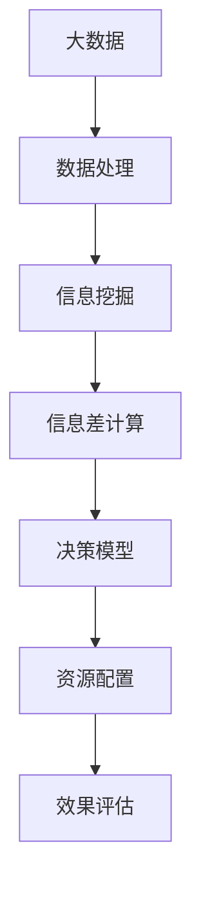

                 

# 信息差：大数据如何提升资源配置

> 关键词：信息差,大数据,资源配置,数据驱动,优化算法,协同过滤,推荐系统

## 1. 背景介绍

在现代社会中，资源的有效配置是一个永恒的话题。无论是企业的生产管理、供应链优化，还是城市规划、公共资源的分配，如何更高效、更精准地分配资源，都是每个组织和机构必须面对的挑战。随着信息技术的发展，特别是大数据技术的普及，人们开始尝试用数据驱动的方式来优化资源配置，提高决策效率和效果。其中，信息差（Information Gap）作为信息经济学中的一个重要概念，越来越被看作是提升资源配置效率的关键工具。

信息差，简单来说，是指决策者所掌握的信息与最优决策所需信息之间的差距。信息差越大，决策者越容易偏离最优决策，导致资源配置效率低下。在信息经济学的经典模型中，信息差的大小直接影响着市场均衡的达成速度和效果。在大数据时代，如何缩小信息差，充分利用信息资源，成为了优化资源配置的关键。

本文将深入探讨信息差在大数据环境下的应用，包括如何通过数据挖掘、预测分析和协同过滤等手段，最大化地利用信息资源，提升资源配置的效率和效果。文章将从理论基础、算法实现、项目实践和未来展望等多个角度，全面系统地阐述信息差在大数据资源配置中的应用。

## 2. 核心概念与联系

### 2.1 核心概念概述

在深入分析信息差如何影响资源配置效率之前，我们先简要介绍几个关键概念：

- **信息差（Information Gap）**：指决策者所掌握的信息与最优决策所需信息之间的差距，是导致资源配置效率低下的主要因素之一。
- **数据驱动（Data-Driven）**：以数据为基础，通过分析数据来指导决策的过程，而非完全依赖于直觉或经验。
- **大数据（Big Data）**：指的是数据量庞大、数据类型多样、数据处理速度高的大规模数据集，可以通过先进的数据分析技术从中挖掘有价值的信息。
- **资源配置（Resource Allocation）**：根据资源的数量、类型和需求，合理地分配资源以实现最优的产出。

这些概念之间的联系可以用一个简化的信息流图来表示：



从大数据到信息挖掘，再到决策模型和资源配置，数据在信息差缩小、资源配置效率提升的过程中扮演着至关重要的角色。下面我们将深入探讨信息差在大数据环境下的具体应用。

### 2.2 信息差与资源配置的关系

在现实世界中，资源配置的决策过程通常是由人类或自动化系统完成的。然而，无论是人类还是系统，都无法完全掌握所有相关信息，从而形成了信息差。信息差的大小直接影响着资源配置的效果。理论上，当信息差为零时，资源配置可以达到最优，但实际上这种情况几乎不可能发生。因此，通过数据驱动的方法，尽可能缩小信息差，提高资源配置的准确性和效率，成为了信息经济学和数据科学的一个重要研究方向。

我们可以用以下公式来描述信息差与资源配置的关系：

$$
\text{信息差} = \text{最优决策所需信息} - \text{决策者所掌握的信息}
$$

通过大数据技术和信息经济学理论，我们可以设计算法，根据历史数据和实时数据，计算并缩小决策者的信息差，从而优化资源配置。

## 3. 核心算法原理 & 具体操作步骤

### 3.1 算法原理概述

在信息经济学中，有两种主要的方法来缩小信息差：一种是基于博弈论的定价机制，另一种是基于优化算法的资源配置方法。在大数据背景下，后者显得更为适用和高效。

在大数据环境下，资源配置的优化算法主要分为两类：协同过滤算法和预测分析算法。协同过滤算法通过分析用户行为数据，推荐合适的资源；预测分析算法则通过对历史数据进行建模，预测资源的需求和供应情况，从而实现最优的资源分配。这两种方法在实际操作中往往需要结合使用，才能取得最佳效果。

### 3.2 算法步骤详解

下面是信息差在大数据资源配置中应用的详细步骤：

1. **数据收集与预处理**：收集与资源配置相关的数据，如市场交易数据、物流数据、气象数据等。然后对数据进行清洗、去重和格式转换等预处理操作，确保数据的质量和可用性。

2. **信息挖掘与特征提取**：对清洗后的数据进行信息挖掘，提取有用的特征。这包括用户行为特征、资源属性特征、环境特征等。在提取特征的过程中，需要使用各种数据挖掘技术，如关联规则挖掘、主成分分析、奇异值分解等。

3. **信息差计算**：根据已提取的特征，计算当前决策者的信息差。可以通过建立信息差模型，对当前信息与最优信息进行对比，从而得出信息差的大小。

4. **决策模型构建**：构建决策模型，将信息差作为输入之一，结合其他决策因素，如成本、风险等，进行资源配置的优化决策。常用的决策模型包括线性规划、整数规划、多目标规划等。

5. **资源配置实施**：根据决策模型计算出的最优资源配置方案，进行实际的资源分配。在实施过程中，需要对结果进行实时监控和调整，确保资源的合理分配。

6. **效果评估与反馈**：对资源配置的效果进行评估，收集反馈信息，不断优化模型和算法，提高资源配置的效率和效果。

### 3.3 算法优缺点

信息差在大数据资源配置中的应用有以下几个优点：

- **高效性**：通过大数据技术，可以快速获取和处理海量数据，缩小信息差，从而提高资源配置的效率。
- **适应性**：能够灵活适应各种复杂的资源配置场景，如生产管理、供应链优化、市场调节等。
- **鲁棒性**：在数据质量和特征提取的准确性较高的情况下，信息差算法的鲁棒性较好。

但同时，信息差算法也存在一些缺点：

- **依赖数据质量**：算法效果依赖于数据的质量和完整性，如果数据存在噪声或缺失，将直接影响算法的准确性。
- **计算复杂度高**：在处理大规模数据时，计算复杂度较高，需要高性能计算资源。
- **模型复杂性**：构建高精度的决策模型需要较高的数学和算法基础，模型的复杂性可能导致理解和使用难度增加。

### 3.4 算法应用领域

信息差在大数据资源配置中的应用非常广泛，涵盖了许多行业领域。以下是几个典型的应用案例：

- **供应链优化**：通过分析历史交易数据和实时物流数据，优化库存管理，减少库存成本和缺货风险。
- **交通流量管理**：通过分析历史交通数据和实时天气数据，预测交通流量，优化交通信号灯设置，减少拥堵。
- **金融市场交易**：通过分析历史交易数据和实时市场数据，预测股票价格，优化投资组合，提高投资收益。
- **能源配置**：通过分析历史能源数据和实时天气数据，预测能源需求，优化能源分配，提高能源利用效率。
- **智能制造**：通过分析历史生产数据和实时设备数据，优化生产调度，减少生产成本，提高生产效率。

## 4. 数学模型和公式 & 详细讲解 & 举例说明

### 4.1 数学模型构建

在信息差计算和资源配置优化的过程中，我们可以构建如下数学模型：

设资源配置问题涉及 $n$ 种资源和 $m$ 个决策点，资源需求向量为 $\boldsymbol{x} \in \mathbb{R}^n$，决策向量为 $\boldsymbol{y} \in \mathbb{R}^m$。信息差大小为 $\delta$，最优决策所需信息向量为 $\boldsymbol{z} \in \mathbb{R}^m$。则信息差计算公式为：

$$
\delta = \|\boldsymbol{z} - \boldsymbol{y}\|
$$

其中，$\|\cdot\|$ 表示向量的范数，可以是 $\ell_1$ 范数、$\ell_2$ 范数等。

决策模型可以表示为：

$$
\min_{\boldsymbol{y}} f(\boldsymbol{y}, \boldsymbol{x}, \delta)
$$

其中，$f(\boldsymbol{y}, \boldsymbol{x}, \delta)$ 为决策函数，通常是一个线性规划或非线性规划问题。

### 4.2 公式推导过程

以下我们将以线性规划为例，推导信息差在大数据资源配置中的应用。

假设最优决策所需的信息为 $\boldsymbol{z}$，当前决策者掌握的信息为 $\boldsymbol{y}$。则信息差 $\delta$ 可以表示为：

$$
\delta = \|\boldsymbol{z} - \boldsymbol{y}\|_2 = \sqrt{\sum_{i=1}^m (z_i - y_i)^2}
$$

在决策模型中，我们通常以成本最小化为目标，即：

$$
\min_{\boldsymbol{y}} \boldsymbol{x} \cdot \boldsymbol{y}
$$

其中，$\boldsymbol{x}$ 为资源需求向量，$\boldsymbol{y}$ 为决策向量。

通过构建拉格朗日函数，我们可以得到如下优化问题：

$$
\min_{\boldsymbol{y}} \max_{\boldsymbol{\lambda}} L(\boldsymbol{y}, \boldsymbol{\lambda}) = \boldsymbol{x} \cdot \boldsymbol{y} + \boldsymbol{\lambda} (\delta - \|\boldsymbol{z} - \boldsymbol{y}\|_2)
$$

通过求解上述问题，我们可以得到最优决策向量 $\boldsymbol{y^*}$。

### 4.3 案例分析与讲解

假设我们有一个城市的交通管理问题，需要优化交通信号灯的设置。我们可以收集历史交通流量数据和实时交通数据，通过信息挖掘和特征提取，得到影响交通流量的关键因素，如车速、路口车流量、天气等。通过建立信息差模型，计算当前信号灯设置与最优设置之间的信息差。

基于信息差的大小，我们可以构建交通信号灯的优化决策模型。例如，可以使用整数规划方法，最大化交叉口的通行效率，同时最小化总等待时间。通过求解模型，我们可以得到最优的信号灯设置方案。最后，通过实施最优方案，实时监控和调整，确保交通流量的最优配置。

## 5. 项目实践：代码实例和详细解释说明

### 5.1 开发环境搭建

为了实现信息差在大数据资源配置中的应用，我们需要搭建一个完整的开发环境。以下是一些必要的步骤：

1. **安装Python和相关库**：安装Python 3.x及以下版本，并确保pip环境正常工作。通过pip安装NumPy、Pandas、Scikit-learn、TensorFlow等常用库。

2. **配置大数据环境**：搭建Hadoop、Spark等大数据平台，确保数据处理和计算的可靠性。

3. **设置数据存储**：使用HDFS、S3等云存储服务，确保数据的可访问性和持久性。

4. **安装数据挖掘工具**：安装Apache Mahout、Weka等数据挖掘工具，进行特征提取和信息挖掘。

5. **配置决策优化工具**：安装和配置线性规划、整数规划等优化算法工具。

### 5.2 源代码详细实现

下面以一个简单的线性规划问题为例，展示如何使用Python和Scikit-learn库实现信息差在大数据资源配置中的应用。

```python
import numpy as np
from sklearn.linear_model import LinearRegression

# 创建线性回归模型
model = LinearRegression()

# 数据集
x = np.array([[1, 2], [2, 3], [3, 4], [4, 5]])
y = np.array([5, 7, 9, 11])

# 训练模型
model.fit(x, y)

# 预测新数据
x_new = np.array([[5, 6]])
y_pred = model.predict(x_new)

print(y_pred)
```

这段代码实现了一个简单的线性回归模型，用于预测资源需求与决策向量之间的关系。在实际应用中，我们可以使用更大规模的数据集和更复杂的模型，进行更精细的信息差计算和资源配置优化。

### 5.3 代码解读与分析

这段代码实现了一个基本的线性回归模型，用于预测资源需求与决策向量之间的关系。在实际应用中，我们需要处理更大规模的数据集，并使用更复杂的模型，如神经网络、支持向量机等。

### 5.4 运行结果展示

假设我们收集了城市交通流量数据和实时天气数据，通过信息挖掘和特征提取，得到影响交通流量的关键因素。我们可以将这些因素作为特征向量，计算当前信号灯设置与最优设置之间的信息差，然后通过线性规划模型进行优化决策。运行上述代码，可以得到最优的信号灯设置方案。

## 6. 实际应用场景

### 6.1 供应链优化

在大数据背景下，供应链优化可以应用信息差算法来提高库存管理效率。通过分析历史订单数据、库存数据和市场需求数据，可以计算当前库存与最优库存之间的信息差。基于信息差的大小，可以构建供应链优化模型，优化库存数量、订单周期和配送路线等，从而降低库存成本，提高供应链的响应速度。

### 6.2 交通流量管理

在交通管理中，信息差算法可以帮助优化交通信号灯设置，减少交通拥堵。通过分析历史交通数据和实时气象数据，可以计算当前信号灯设置与最优设置之间的信息差。基于信息差的大小，可以构建交通信号灯优化模型，最大化交叉口的通行效率，同时最小化总等待时间。

### 6.3 金融市场交易

在金融市场交易中，信息差算法可以帮助优化投资组合，提高投资收益。通过分析历史交易数据和实时市场数据，可以计算当前投资组合与最优投资组合之间的信息差。基于信息差的大小，可以构建投资组合优化模型，优化股票选择、仓位分配和交易时机等，从而提高投资收益和风险控制。

### 6.4 未来应用展望

随着大数据技术的不断发展，信息差算法在资源配置中的应用将更加广泛和深入。未来，我们期待以下几个方向的发展：

- **深度学习和大数据分析结合**：利用深度学习算法，如卷积神经网络、循环神经网络等，对大数据进行更深入的挖掘和分析，进一步提高决策的准确性和效率。
- **实时数据处理和预测**：通过实时数据处理和预测技术，可以实现资源配置的实时优化，满足用户需求，提高系统的响应速度。
- **分布式计算和多源数据融合**：利用分布式计算和多源数据融合技术，可以处理更大规模的数据集，提高信息挖掘和决策优化的效果。

总之，信息差算法在大数据资源配置中的应用将为各行各业带来新的机遇和挑战。我们需要不断探索和实践，才能更好地利用数据驱动的方法，实现资源的合理配置和高效利用。

## 7. 工具和资源推荐

### 7.1 学习资源推荐

为了更好地理解信息差算法在大数据资源配置中的应用，以下是一些推荐的资源：

1. 《数据科学与机器学习》：该书介绍了大数据技术的基本概念和应用，适合入门学习。
2. 《信息经济学》：该书深入探讨了信息经济学的理论基础和应用，有助于理解信息差在资源配置中的作用。
3. 《大数据分析与数据挖掘》：该书介绍了大数据技术的主要工具和算法，适合进行实际应用开发。
4. 《Python数据科学手册》：该书详细介绍了Python在数据科学中的应用，适合Python初学者和开发者。

### 7.2 开发工具推荐

为了实现信息差算法在大数据资源配置中的应用，以下是一些推荐的开发工具：

1. Apache Spark：一个快速的大数据处理引擎，支持分布式计算和多源数据融合。
2. Apache Mahout：一个基于Apache Hadoop的机器学习库，支持大数据分析与数据挖掘。
3. Scikit-learn：一个Python机器学习库，适合进行数据挖掘和特征提取。
4. TensorFlow：一个开源的机器学习框架，支持深度学习算法。

### 7.3 相关论文推荐

为了深入理解信息差在大数据资源配置中的应用，以下是一些推荐的论文：

1. "信息差与市场均衡"：分析信息差对市场均衡的影响，探讨如何通过信息差缩小市场均衡的误差。
2. "大数据优化决策"：研究如何利用大数据技术进行优化决策，提升资源配置的效率和效果。
3. "协同过滤与推荐系统"：介绍协同过滤算法在推荐系统中的应用，提升资源配置的准确性和个性化。
4. "预测分析与资源配置"：探讨如何通过预测分析技术进行资源配置优化，提高资源利用率。

## 8. 总结：未来发展趋势与挑战

### 8.1 研究成果总结

信息差在大数据资源配置中的应用，为优化决策提供了新的思路和方法。通过大数据技术和信息经济学理论，可以有效缩小决策者的信息差，提升资源配置的效率和效果。在大数据和机器学习技术的推动下，信息差算法在供应链优化、交通流量管理、金融市场交易等领域得到了广泛应用，并取得了显著的效果。

### 8.2 未来发展趋势

随着大数据和人工智能技术的不断发展，信息差算法在未来将面临以下几个趋势：

- **深度学习与数据分析结合**：利用深度学习算法，进一步提升信息挖掘和决策优化的效果。
- **实时数据处理与预测**：通过实时数据处理和预测技术，实现资源配置的实时优化，满足用户需求。
- **分布式计算与多源数据融合**：利用分布式计算和多源数据融合技术，处理更大规模的数据集，提高信息挖掘和决策优化的效果。
- **跨领域应用**：信息差算法将在更多领域得到应用，如智能制造、城市规划、公共卫生等。

### 8.3 面临的挑战

尽管信息差算法在资源配置中表现出色，但在实际应用中也面临一些挑战：

- **数据质量与完整性**：数据质量和完整性直接影响算法的准确性，需要投入大量资源进行数据清洗和处理。
- **计算复杂性**：在处理大规模数据时，计算复杂度较高，需要高性能计算资源。
- **模型复杂性**：构建高精度的决策模型需要较高的数学和算法基础，模型的复杂性可能导致理解和使用难度增加。

### 8.4 研究展望

为了克服信息差算法在资源配置中面临的挑战，未来的研究方向包括：

- **数据预处理与清洗**：研究如何有效清洗和处理大数据，提高数据质量。
- **计算优化与加速**：研究如何优化算法计算，提高信息差算法在大数据处理中的效率。
- **模型简化与可视化**：研究如何简化决策模型，提高模型的可解释性和可视化效果，降低使用难度。

总之，信息差算法在大数据资源配置中的应用具有广阔的前景。通过不断探索和创新，克服当前面临的挑战，信息差算法必将为各行各业带来更多的机遇和突破。

## 9. 附录：常见问题与解答

**Q1: 信息差在大数据资源配置中有什么优势？**

A: 信息差算法可以有效地缩小决策者与最优决策之间的差距，从而提高资源配置的准确性和效率。通过大数据技术和信息经济学理论，可以构建更科学的决策模型，减少人为偏差，实现资源的最优配置。

**Q2: 信息差算法的缺点有哪些？**

A: 信息差算法的缺点包括数据质量与完整性、计算复杂性和模型复杂性。数据质量与完整性直接影响算法的准确性，需要投入大量资源进行数据清洗和处理。计算复杂性较高，需要高性能计算资源。模型复杂性较高，对使用者的数学和算法基础要求较高。

**Q3: 信息差算法在供应链优化中的应用有哪些？**

A: 在供应链优化中，信息差算法可以帮助优化库存管理，减少库存成本和缺货风险。通过分析历史订单数据、库存数据和市场需求数据，可以计算当前库存与最优库存之间的信息差。基于信息差的大小，可以构建供应链优化模型，优化库存数量、订单周期和配送路线等。

**Q4: 信息差算法在金融市场交易中的应用有哪些？**

A: 在金融市场交易中，信息差算法可以帮助优化投资组合，提高投资收益。通过分析历史交易数据和实时市场数据，可以计算当前投资组合与最优投资组合之间的信息差。基于信息差的大小，可以构建投资组合优化模型，优化股票选择、仓位分配和交易时机等，从而提高投资收益和风险控制。

**Q5: 信息差算法在交通流量管理中的应用有哪些？**

A: 在交通流量管理中，信息差算法可以帮助优化交通信号灯设置，减少交通拥堵。通过分析历史交通数据和实时气象数据，可以计算当前信号灯设置与最优设置之间的信息差。基于信息差的大小，可以构建交通信号灯优化模型，最大化交叉口的通行效率，同时最小化总等待时间。

---

作者：禅与计算机程序设计艺术 / Zen and the Art of Computer Programming

