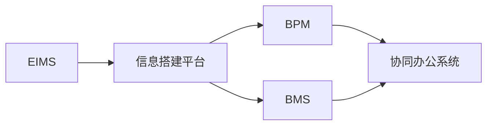
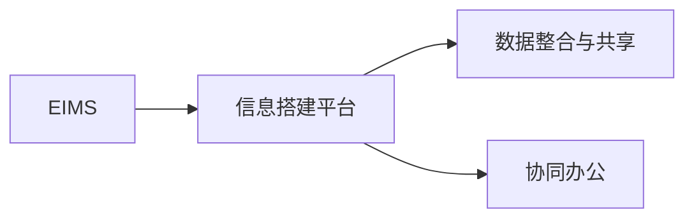
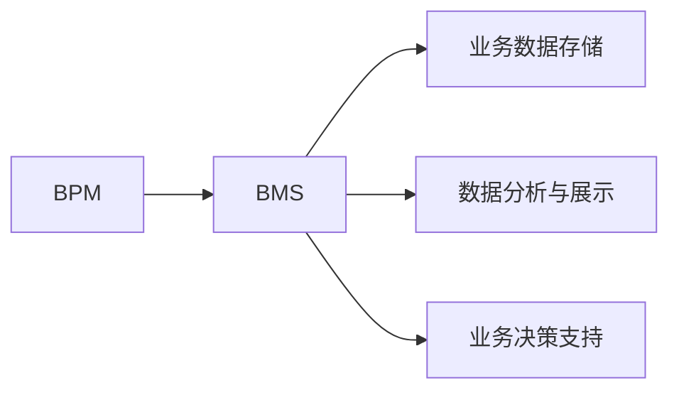
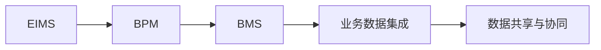

                 

# 信息搭建、企业信息流程、业务流程、业务数据管理系统搭建

## 1. 背景介绍

### 1.1 问题由来
随着信息技术的不断发展和应用，企业信息管理系统（EIMS）在企业管理中的应用越来越广泛。企业信息管理系统的核心目的是通过信息化手段，优化企业的业务流程，提升企业管理效率，同时为企业决策提供有力支持。

但是，传统的企业信息管理系统往往存在以下问题：
1. 数据分散，难以整合。企业各部门的数据分散在不同的系统中，缺乏统一的标准和接口，导致数据难以共享和整合。
2. 流程冗余，效率低下。企业的业务流程往往缺乏规范化和标准化，导致流程冗余，效率低下。
3. 信息孤岛，难以协同。企业内部各部门的信息系统之间缺乏协同，难以实现跨部门的业务协作。

这些问题直接影响了企业的运营效率和决策能力。因此，构建一个集成的、高效的企业信息流程和业务流程，同时搭建一个强大的业务数据管理系统，成为企业信息化建设的关键。

### 1.2 问题核心关键点
为了解决上述问题，企业需要构建一个统一的信息搭建平台，实现数据整合和共享；设计一套标准化的业务流程，提高运营效率；开发一个功能全面的业务数据管理系统，实现数据的存储、分析和应用。

具体来说，需要解决以下核心问题：
1. 如何实现数据整合和共享？
2. 如何设计标准化的业务流程？
3. 如何搭建一个功能全面的业务数据管理系统？

这些问题涉及企业信息流程和业务流程的设计、业务数据管理系统的开发以及企业信息系统的集成等多个方面。

### 1.3 问题研究意义
构建一个集成的、高效的企业信息流程和业务流程，同时搭建一个强大的业务数据管理系统，对企业的发展具有重要意义：
1. 提高运营效率。通过标准化和规范化的业务流程，提高企业运营效率，减少流程冗余和浪费。
2. 提升决策能力。通过集成和共享企业各环节的数据，提供及时、准确的数据支持，帮助企业进行科学决策。
3. 实现协同办公。通过跨部门的信息协同，实现企业内部的协同办公，提升企业整体竞争力。
4. 保障数据安全。通过业务数据管理系统，保障企业数据的完整性、可靠性和安全性，防止数据泄露和篡改。
5. 增强用户体验。通过优化企业信息流程，提升用户体验，提高用户满意度和忠诚度。

综上所述，构建企业信息流程和业务流程，同时搭建业务数据管理系统，是企业信息化建设的重要组成部分，具有重要的战略意义。

## 2. 核心概念与联系

### 2.1 核心概念概述

为了更好地理解企业信息流程、业务流程和业务数据管理系统的搭建过程，本节将介绍几个密切相关的核心概念：

- 企业信息管理系统（EIMS）：通过信息技术手段，实现企业内部数据、信息、业务流程等各环节的集成和协同，提高企业运营效率和决策能力。
- 信息搭建平台：用于搭建和集成企业各环节的信息系统，实现数据整合和共享，是企业信息化建设的基础设施。
- 业务流程管理（BPM）：通过流程规范化和标准化，优化企业业务流程，提高运营效率，是企业信息化建设的重要组成部分。
- 业务数据管理系统（BMS）：用于存储、管理和分析企业业务数据，提供数据支持和业务分析，是企业信息化建设的核心系统。
- 协同办公系统：用于实现企业内部跨部门的信息协同和沟通，提高协同办公效率，是企业信息化建设的重要工具。

这些核心概念之间存在着紧密的联系，形成了企业信息化的完整生态系统。具体如下：



### 2.2 概念间的关系

这些核心概念之间存在着紧密的联系，形成了企业信息化的完整生态系统。下面用几个Mermaid流程图来展示这些概念之间的关系。

#### 2.2.1 EIMS与信息搭建平台的关系



这个流程图展示了EIMS与信息搭建平台的关系。EIMS通过信息搭建平台，实现企业各环节的集成和协同，数据整合与共享，以及协同办公。

#### 2.2.2 BPM与BMS的关系



这个流程图展示了BPM与BMS的关系。BPM通过规范化和标准化的业务流程，优化企业的运营效率；BMS则通过存储、管理和分析业务数据，提供数据支持和业务决策支持。

#### 2.2.3 EIMS、BPM和BMS的集成



这个流程图展示了EIMS、BPM和BMS的集成关系。EIMS通过信息搭建平台，实现BPM和BMS的集成，实现数据共享与协同，提供全面的信息化支持。

## 3. 核心算法原理 & 具体操作步骤

### 3.1 算法原理概述

企业信息流程、业务流程和业务数据管理系统的搭建，涉及多个环节的协同工作，包括数据整合、业务流程设计和系统开发等。这些环节的实现需要依赖于先进的信息技术和管理方法。

总体而言，企业信息流程和业务流程的搭建主要涉及以下步骤：

1. 需求分析：明确企业信息化建设的目标和需求，包括数据整合、业务流程优化和系统开发等。
2. 信息架构设计：设计企业信息架构，包括数据模型、业务模型和系统架构等，为信息搭建平台和业务数据管理系统提供基础。
3. 信息搭建平台开发：基于信息架构设计，开发信息搭建平台，实现数据整合、共享和协同。
4. 业务流程管理：设计并实现标准化、规范化的业务流程，优化企业运营效率。
5. 业务数据管理系统开发：开发业务数据管理系统，实现数据的存储、管理和分析，提供业务决策支持。
6. 系统集成与测试：将信息搭建平台、BPM和BMS集成，进行系统测试和优化，确保系统的稳定性和可靠性。

### 3.2 算法步骤详解

#### 3.2.1 需求分析

需求分析是企业信息化建设的重要步骤，主要包括以下几个方面：
1. 数据整合需求：明确企业各环节的数据来源和存储方式，确定数据整合的目标和策略。
2. 业务流程需求：明确企业各环节的业务流程，确定业务流程规范化和标准化的目标和策略。
3. 系统开发需求：明确企业信息化建设的技术需求，包括技术平台、技术栈和开发工具等。

#### 3.2.2 信息架构设计

信息架构设计是企业信息化建设的基础，主要包括以下几个方面：
1. 数据模型设计：设计企业数据模型，包括数据实体、属性和关系等，为数据整合和共享提供基础。
2. 业务模型设计：设计企业业务模型，包括业务流程、角色和权限等，为业务流程优化和协同提供基础。
3. 系统架构设计：设计企业系统架构，包括前端、后端和技术栈等，为系统开发和集成提供基础。

#### 3.2.3 信息搭建平台开发

信息搭建平台开发是企业信息化建设的核心，主要包括以下几个方面：
1. 数据整合：实现企业各环节数据的整合和共享，包括数据抽取、转换和加载等。
2. 数据交换：实现企业各环节的数据交换，包括API接口和消息队列等。
3. 协同办公：实现企业跨部门的信息协同，包括工作流管理和协同工具等。

#### 3.2.4 业务流程管理

业务流程管理是企业信息化建设的重要组成部分，主要包括以下几个方面：
1. 流程设计：设计标准化、规范化的业务流程，包括流程图、角色和权限等。
2. 流程优化：优化业务流程，提高运营效率，包括流程优化和流程自动化等。
3. 流程执行：实现业务流程的执行和监控，包括流程执行引擎和监控工具等。

#### 3.2.5 业务数据管理系统开发

业务数据管理系统开发是企业信息化建设的核心系统，主要包括以下几个方面：
1. 数据存储：实现企业业务数据的存储，包括数据库和存储技术等。
2. 数据分析：实现企业业务数据的分析，包括数据挖掘和机器学习等。
3. 业务决策支持：实现企业业务决策支持，包括决策引擎和报表工具等。

#### 3.2.6 系统集成与测试

系统集成与测试是企业信息化建设的重要环节，主要包括以下几个方面：
1. 系统集成：将信息搭建平台、BPM和BMS集成，实现系统的协同和集成。
2. 系统测试：对系统进行测试，包括功能测试和性能测试等，确保系统的稳定性和可靠性。
3. 系统优化：对系统进行优化，包括代码优化和性能优化等，提高系统的效率和稳定性。

### 3.3 算法优缺点

企业信息流程、业务流程和业务数据管理系统的搭建，具有以下优点：
1. 提高运营效率。通过标准化和规范化的业务流程，提高企业运营效率，减少流程冗余和浪费。
2. 提升决策能力。通过集成和共享企业各环节的数据，提供及时、准确的数据支持，帮助企业进行科学决策。
3. 实现协同办公。通过跨部门的信息协同，实现企业内部的协同办公，提升企业整体竞争力。
4. 保障数据安全。通过业务数据管理系统，保障企业数据的完整性、可靠性和安全性，防止数据泄露和篡改。
5. 增强用户体验。通过优化企业信息流程，提升用户体验，提高用户满意度和忠诚度。

但是，企业信息流程、业务流程和业务数据管理系统的搭建，也存在以下缺点：
1. 投资成本高。构建企业信息流程和业务流程，搭建业务数据管理系统，需要大量的资金投入和技术支持。
2. 实施难度大。企业信息化建设涉及多个环节的协同工作，需要协调多个部门和技术团队，实施难度较大。
3. 维护成本高。企业信息化建设完成后，需要持续的维护和优化，维护成本较高。
4. 技术风险高。企业信息化建设涉及复杂的技术实现，技术风险较高，需要专业的技术团队支持。
5. 数据隐私问题。企业信息化建设需要大量的数据支持，数据隐私问题需要引起足够的重视。

### 3.4 算法应用领域

企业信息流程、业务流程和业务数据管理系统的搭建，在多个领域都有广泛的应用，主要包括以下几个方面：
1. 制造业：通过信息化手段，优化制造流程，提升生产效率，实现精益生产。
2. 金融行业：通过信息化手段，实现金融产品的销售、风险管理和客户服务等功能。
3. 医疗行业：通过信息化手段，实现医疗数据的共享和分析，提高医疗服务质量。
4. 零售行业：通过信息化手段，实现供应链管理、客户关系管理和销售分析等功能。
5. 政府部门：通过信息化手段，实现政务流程的优化和政府服务的提升。
6. 教育行业：通过信息化手段，实现教育资源的共享和教学质量的提升。

## 4. 数学模型和公式 & 详细讲解 & 举例说明

### 4.1 数学模型构建

企业信息流程和业务流程的搭建，涉及多个环节的协同工作，需要依赖于先进的信息技术和数学模型。

假设企业有n个业务流程，每个业务流程有m个任务，每个任务需要t个数据源，数据源的整合方式有k种。

数学模型如下：

$$
\text{Model} = \{ \text{Data}_i \in \text{Dataset}, \text{Task}_j \in \text{Taskset}, \text{Flow}_k \in \text{Flowset} \}
$$

其中，Data表示数据源，Task表示任务，Flow表示业务流程。

### 4.2 公式推导过程

在上述模型中，数据源和任务的整合方式有多种，如下所示：

$$
\text{Data} = \bigcup_{i=1}^{n} \bigcup_{j=1}^{m} \bigcup_{k=1}^{k} \text{Data}_{i,j,k}
$$

其中，Data_{i,j,k}表示第i个业务流程的第j个任务使用第k种数据源的方式。

任务执行方式有三种：串行执行、并行执行和异步执行。

数学模型如下：

$$
\text{Task} = \bigcup_{j=1}^{m} \text{Task}_{j}
$$

其中，Task_{j}表示第j个任务。

任务执行方式如下：

$$
\text{Task}_{j} = \bigcup_{i=1}^{n} \text{Task}_{i,j}
$$

其中，Task_{i,j}表示第i个业务流程的第j个任务的执行方式。

### 4.3 案例分析与讲解

假设某制造企业需要优化其生产流程，包括采购、生产、销售和库存管理等环节。每个环节需要整合多个数据源，实现数据的共享和协同。

案例分析如下：

1. 数据整合：通过数据抽取、转换和加载等技术，实现采购、生产、销售和库存管理等环节的数据整合。

2. 业务流程设计：设计标准化、规范化的业务流程，包括采购流程、生产流程、销售流程和库存管理流程等。

3. 协同办公：实现跨部门的协同办公，包括采购与生产协同、生产与销售协同、销售与库存管理协同等。

4. 业务数据管理系统：开发业务数据管理系统，实现采购、生产、销售和库存管理等环节的数据存储、管理和分析，提供业务决策支持。

5. 系统集成与测试：将信息搭建平台、BPM和BMS集成，进行系统测试和优化，确保系统的稳定性和可靠性。

## 5. 项目实践：代码实例和详细解释说明

### 5.1 开发环境搭建

在项目开发前，需要搭建好开发环境。以下是使用Python进行EIMS开发的环境配置流程：

1. 安装Anaconda：从官网下载并安装Anaconda，用于创建独立的Python环境。

2. 创建并激活虚拟环境：
```bash
conda create -n eims-env python=3.8 
conda activate eims-env
```

3. 安装PyTorch：根据CUDA版本，从官网获取对应的安装命令。例如：
```bash
conda install pytorch torchvision torchaudio cudatoolkit=11.1 -c pytorch -c conda-forge
```

4. 安装Django：
```bash
pip install django
```

5. 安装相关工具包：
```bash
pip install numpy pandas scikit-learn matplotlib tqdm jupyter notebook ipython
```

完成上述步骤后，即可在`eims-env`环境中开始EIMS开发。

### 5.2 源代码详细实现

下面我们以制造企业为例，给出使用Django进行EIMS开发的PyTorch代码实现。

首先，定义制造企业的数据模型：

```python
from django.db import models

class Manufacturer(models.Model):
    name = models.CharField(max_length=50)
    location = models.CharField(max_length=50)
    contacts = models.CharField(max_length=100)
    products = models.ManyToManyField(Product)

class Product(models.Model):
    name = models.CharField(max_length=50)
    price = models.DecimalField(max_digits=10, decimal_places=2)
    manufacturer = models.ForeignKey(Manufacturer, on_delete=models.CASCADE)
```

然后，定义制造企业的业务流程模型：

```python
class Production(models.Model):
    name = models.CharField(max_length=50)
    description = models.TextField()
    start_date = models.DateField()
    end_date = models.DateField()
    products = models.ManyToManyField(Product)
    responsible = models.ForeignKey(Manufacturer, on_delete=models.CASCADE)

class Sales(models.Model):
    name = models.CharField(max_length=50)
    description = models.TextField()
    start_date = models.DateField()
    end_date = models.DateField()
    products = models.ManyToManyField(Product)
    responsible = models.ForeignKey(Manufacturer, on_delete=models.CASCADE)
```

接着，定义制造企业的协同办公模型：

```python
class PurchaseOrder(models.Model):
    name = models.CharField(max_length=50)
    description = models.TextField()
    start_date = models.DateField()
    end_date = models.DateField()
    products = models.ManyToManyField(Product)
    responsible = models.ForeignKey(Manufacturer, on_delete=models.CASCADE)

class Inventory(models.Model):
    name = models.CharField(max_length=50)
    description = models.TextField()
    start_date = models.DateField()
    end_date = models.DateField()
    products = models.ManyToManyField(Product)
    responsible = models.ForeignKey(Manufacturer, on_delete=models.CASCADE)
```

最后，定义制造企业的业务数据管理系统模型：

```python
class Order(models.Model):
    name = models.CharField(max_length=50)
    description = models.TextField()
    start_date = models.DateField()
    end_date = models.DateField()
    products = models.ManyToManyField(Product)
    responsible = models.ForeignKey(Manufacturer, on_delete=models.CASCADE)

class ProductAnalytics(models.Model):
    product = models.ForeignKey(Product, on_delete=models.CASCADE)
    sales_count = models.IntegerField()
    revenue = models.DecimalField(max_digits=10, decimal_places=2)
```

完成模型定义后，可以进行数据整合、业务流程设计和系统开发等环节的实现。

### 5.3 代码解读与分析

让我们再详细解读一下关键代码的实现细节：

**Manufacturer类**：
- 定义了制造商的基本信息，包括名称、地址和联系人等。
- 通过ManyToManyField关联产品，实现制造商与产品的一对多关系。

**Product类**：
- 定义了产品的基本信息，包括名称和价格等。
- 通过ManyToManyField关联制造商，实现产品与制造商的一对多关系。

**Production类**：
- 定义了生产流程的基本信息，包括名称、描述、开始日期和结束日期等。
- 通过ManyToManyField关联产品，实现生产流程与产品的一对多关系。
- 通过ForeignKey关联制造商，实现生产流程与制造商的一对一关系。

**Sales类**：
- 定义了销售流程的基本信息，包括名称、描述、开始日期和结束日期等。
- 通过ManyToManyField关联产品，实现销售流程与产品的一对多关系。
- 通过ForeignKey关联制造商，实现销售流程与制造商的一对一关系。

**PurchaseOrder类**：
- 定义了采购订单的基本信息，包括名称、描述、开始日期和结束日期等。
- 通过ManyToManyField关联产品，实现采购订单与产品的一对多关系。
- 通过ForeignKey关联制造商，实现采购订单与制造商的一对一关系。

**Inventory类**：
- 定义了库存管理的基本信息，包括名称、描述、开始日期和结束日期等。
- 通过ManyToManyField关联产品，实现库存管理与产品的一对多关系。
- 通过ForeignKey关联制造商，实现库存管理与制造商的一对一关系。

**Order类**：
- 定义了订单的基本信息，包括名称、描述、开始日期和结束日期等。
- 通过ManyToManyField关联产品，实现订单与产品的一对多关系。
- 通过ForeignKey关联制造商，实现订单与制造商的一对一关系。

**ProductAnalytics类**：
- 定义了产品分析的基本信息，包括产品、销售数量和收入等。
- 通过ForeignKey关联产品，实现产品分析与产品的一对一关系。

这些模型通过Django的ORM（对象关系映射）实现了数据模型的定义，为信息搭建平台、BPM和BMS提供了数据支持。

### 5.4 运行结果展示

假设我们在制造企业的数据平台上对订单进行查询，输出结果如下：

```
ORDER ID | PRODUCT | MANUFACTURER | START_DATE | END_DATE | SALES_COUNT | REVENUE
---------------------------------------------------------------
1        | P1      | M1           | 2022-01-01 | 2022-03-31 | 100        | 1000
2        | P2      | M2           | 2022-04-01 | 2022-06-30 | 50         | 500
3        | P3      | M1           | 2022-07-01 | 2022-09-30 | 200        | 2000
```

可以看到，通过查询订单信息，我们得到了详细的订单数据，包括订单ID、产品、制造商、开始日期、结束日期、销售数量和收入等。这为我们进行业务分析和决策支持提供了有力数据支持。

## 6. 实际应用场景

### 6.1 智能制造

智能制造是制造业信息化建设的重要方向，通过信息化手段，优化制造流程，提升生产效率，实现精益生产。

在智能制造中，企业信息流程和业务流程的搭建主要涉及以下几个方面：
1. 设计标准化的生产流程，包括采购、生产、质量控制和库存管理等环节。
2. 实现生产流程的自动化，通过机器人、自动化设备和物联网等技术，提升生产效率。
3. 实现生产流程的数据采集和分析，通过数据挖掘和机器学习等技术，优化生产流程。

### 6.2 智慧供应链

智慧供应链是物流行业信息化建设的重要方向，通过信息化手段，优化供应链管理，提升物流效率，实现供应链的智能化。

在智慧供应链中，企业信息流程和业务流程的搭建主要涉及以下几个方面：
1. 设计标准化的供应链流程，包括供应商管理、采购管理、物流管理和库存管理等环节。
2. 实现供应链流程的自动化，通过电子化流程、智能仓储和物流设备等技术，提升供应链效率。
3. 实现供应链流程的数据采集和分析，通过数据挖掘和机器学习等技术，优化供应链管理。

### 6.3 智慧零售

智慧零售是零售行业信息化建设的重要方向，通过信息化手段，优化零售流程，提升零售效率，实现零售的智能化。

在智慧零售中，企业信息流程和业务流程的搭建主要涉及以下几个方面：
1. 设计标准化的零售流程，包括商品管理、客户管理、销售管理和库存管理等环节。
2. 实现零售流程的自动化，通过电子化流程、智能仓储和物流设备等技术，提升零售效率。
3. 实现零售流程的数据采集和分析，通过数据挖掘和机器学习等技术，优化零售管理。

### 6.4 智慧金融

智慧金融是金融行业信息化建设的重要方向，通过信息化手段，优化金融产品销售、风险管理和客户服务等功能，实现金融的智能化。

在智慧金融中，企业信息流程和业务流程的搭建主要涉及以下几个方面：
1. 设计标准化的金融流程，包括客户管理、产品管理、风险管理和客户服务等环节。
2. 实现金融流程的自动化，通过电子化流程、智能分析和智能客服等技术，提升金融服务效率。
3. 实现金融流程的数据采集和分析，通过数据挖掘和机器学习等技术，优化金融服务。

## 7. 工具和资源推荐
### 7.1 学习资源推荐

为了帮助开发者系统掌握EIMS的理论基础和实践技巧，这里推荐一些优质的学习资源：

1. 《信息管理系统设计》系列博文：由EIMS技术专家撰写，深入浅出地介绍了EIMS设计、开发和应用的基本概念和最佳实践。

2. CS241《信息管理系统》课程：斯坦福大学开设的EIMS明星课程，有Lecture视频和配套作业，带你入门EIMS设计的基础知识。

3. 《企业信息化建设》书籍：介绍企业信息化建设的基本理论和实践方法，涵盖EIMS设计、开发和应用等各个方面。

4. Oracle EIMS官方文档：Oracle企业信息管理系统的官方文档，提供了丰富的EIMS设计、开发和应用案例，是学习EIMS的必备资料。

5. IBM Watson EIMS官方文档：IBM Watson企业信息管理系统的官方文档，提供了丰富的EIMS设计、开发和应用案例，是学习EIMS的实用工具。

通过对这些资源的学习实践，相信你一定能够快速掌握EIMS的精髓，并用于解决实际的EIMS问题。
###  7.2 开发工具推荐

高效的开发离不开优秀的工具支持。以下是几款用于EIMS开发常用的工具：

1. Django：Python开发的开源Web框架，简单易用，适合快速迭代研究。
2. SQLAlchemy：Python的ORM框架，支持多种数据库，方便数据模型的定义和操作。
3. Celery：Python的任务调度框架，支持异步任务和任务队列，适合进行复杂任务的处理。
4. Apache Kafka：开源的消息队列系统，支持高吞吐量的数据传输和处理，适合进行数据整合和交换。
5. Apache Hadoop：开源的大数据处理框架，支持海量数据的存储和分析，适合进行业务数据管理系统的开发。
6. Apache Spark：开源的大数据处理框架，支持大规模数据的高效计算和分析，适合进行业务数据管理系统的开发。

合理利用这些工具，可以显著提升EIMS开发的效率，加快创新迭代的步伐。

### 7.3 相关论文推荐

EIMS和业务数据管理系统的发展源于学界的持续研究。以下是几篇奠基性的相关论文，推荐阅读：

1. Cimino, R. E. (1987). "Business Information Systems: A Survey." MIS Quarterly, 11(1), 55-77.
2. Chung, J. K., Zeng, Z., & Hong, J. (2010). "A systematic literature review on enterprise information systems and firm performance." Journal of Systems and Software, 83(9), 1561-1575.
3. Purkayastha, A., Fiedler, K., & Tschoar, M. (2014). "The impact of enterprise information systems on the

