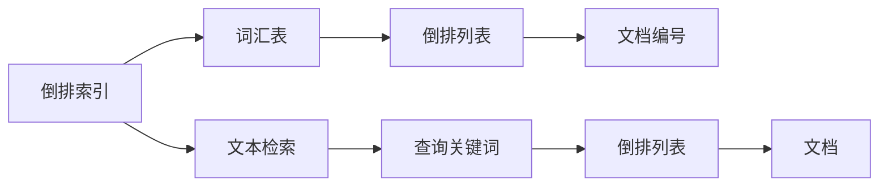
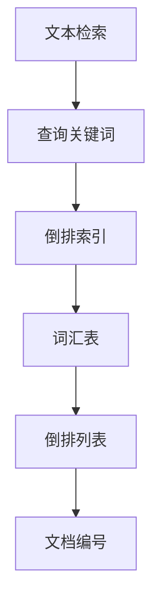
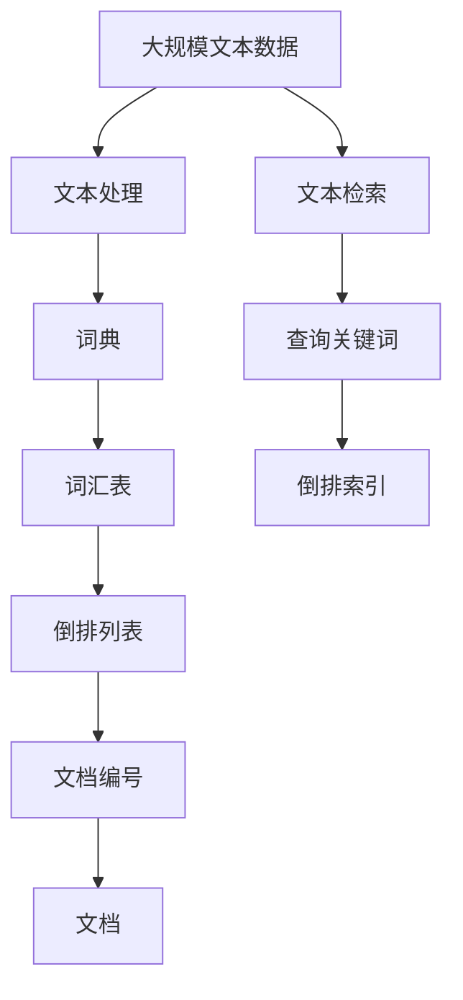

                 

# 倒排索引 原理与代码实例讲解

> 关键词：倒排索引,搜索引擎,信息检索,算法,代码实现,数据结构,应用场景

## 1. 背景介绍

### 1.1 问题由来

在信息检索领域，如何高效地存储和检索大量文本数据是长期以来的重要研究课题。传统的方法如目录、线性索引等存在诸多局限性，难以满足大规模数据处理的需要。倒排索引(Inverted Index)作为一种高效的数据结构，被广泛应用于搜索引擎、数据库等场景，帮助用户快速定位和检索文本信息。

倒排索引的原理在于将文本数据中的词汇表和词汇在文档中的出现位置进行逆向映射，从而构建出一个高效的数据结构，用于加速文本检索。倒排索引的核心思想是将文档与词汇的映射关系进行反转，即从词汇到文档的映射，使得查询过程能够快速定位相关文档。

倒排索引的提出和应用极大地推动了信息检索技术的发展，其重要性在于：

- 提高检索效率：通过将词汇在文档中的出现位置进行逆向映射，使得查询过程能够在短时间内定位到相关文档，从而显著提高检索效率。
- 优化存储空间：倒排索引采用压缩存储的方式，能够有效减少存储空间，适应大规模数据的存储需求。
- 灵活查询方式：倒排索引支持多种查询方式，如关键词匹配、短语匹配、模糊匹配等，能够满足不同场景下的检索需求。

倒排索引的核心思想在自然语言处理、数据库、搜索引擎等众多领域得到广泛应用。本文将深入探讨倒排索引的原理，并结合代码实例，详细讲解其具体实现和应用。

## 2. 核心概念与联系

### 2.1 核心概念概述

为了更好地理解倒排索引的原理和应用，本节将介绍几个密切相关的核心概念：

- 倒排索引(Inverted Index)：一种高效的数据结构，用于存储文本数据中的词汇表和词汇在文档中的出现位置。通过构建倒排索引，可以快速定位包含特定词汇的文档，从而实现文本检索。

- 文本检索(Text Retrieval)：指根据用户输入的查询关键词，从大量文本数据中检索出最相关的文本信息。文本检索是信息检索系统的核心功能，广泛应用于搜索引擎、数据库、信息管理系统等领域。

- 词汇表(Term Table)：指文本数据中出现的所有不重复词汇，构成倒排索引的基本单元。每个词汇对应一个倒排列表(Inverted List)。

- 倒排列表(Inverted List)：指与某个词汇对应的文档列表，存储了包含该词汇的文档编号。倒排列表是倒排索引的核心，用于实现词汇到文档的快速映射。

- 词典(Dictionary)：指文本数据中所有词汇的有序集合。词典通常用于排序和过滤，减少倒排列表的存储空间。

这些核心概念之间的逻辑关系可以通过以下Mermaid流程图来展示：



这个流程图展示倒排索引的基本原理和组成：

1. 倒排索引由词汇表和倒排列表构成，每个词汇对应一个倒排列表。
2. 倒排列表存储了包含该词汇的文档编号，是倒排索引的核心。
3. 文本检索过程从查询关键词出发，检索包含该关键词的文档编号。

### 2.2 概念间的关系

这些核心概念之间存在着紧密的联系，形成了倒排索引的完整生态系统。下面我通过几个Mermaid流程图来展示这些概念之间的关系。

#### 2.2.1 文本检索与倒排索引的关系



这个流程图展示了文本检索的基本过程，以及倒排索引在其中扮演的角色。

#### 2.2.2 倒排列表与文档编号的关系


这个流程图展示了倒排列表的基本组成，即每个文档编号对应一个文档。

#### 2.2.3 词汇表与倒排列表的关系


这个流程图展示了词汇表与倒排列表之间的映射关系，即每个词汇对应一个倒排列表。

### 2.3 核心概念的整体架构

最后，我们用一个综合的流程图来展示倒排索引的整体架构：



这个综合流程图展示了从大规模文本数据到文本检索的完整过程，以及倒排索引在其中扮演的角色。

## 3. 核心算法原理 & 具体操作步骤
### 3.1 算法原理概述

倒排索引的原理可以简单概括为以下几点：

1. **文本预处理**：将文本数据转化为词汇表，并进行预处理，如分词、去停用词、词干化等。

2. **构建词汇表和倒排列表**：对文本中的每个词汇进行逆向映射，构建词汇表和倒排列表。

3. **索引建立和维护**：将文档编号存储在倒排列表中，并对倒排列表进行维护，如添加、删除文档等操作。

4. **文本检索**：根据查询关键词，在倒排列表中定位文档编号，返回匹配的文档。

### 3.2 算法步骤详解

以下我们将详细介绍倒排索引的具体实现步骤：

**Step 1: 文本预处理**

文本预处理是倒排索引构建的第一步，其目的是将原始文本数据转化为词汇表，并进行预处理。文本预处理通常包括以下几个步骤：

1. 分词：将文本划分成词汇，去除标点符号、空格等无关内容，保留词汇的基本特征。
2. 去停用词：去除常见无意义的停用词，如“的”、“是”、“在”等，减少索引规模，提高检索效率。
3. 词干化：将词汇转化为基本词干，如将“running”转化为“run”，减少索引重复，提高检索准确性。

**Step 2: 构建词汇表和倒排列表**

构建词汇表和倒排列表是倒排索引的核心步骤。具体过程如下：

1. 遍历文本数据，统计每个词汇在文本中出现的次数。
2. 对每个词汇，记录其在文本中出现的位置，生成倒排列表。
3. 将每个词汇及其倒排列表存储在词汇表中，构建完整的倒排索引。

**Step 3: 索引建立和维护**

索引建立和维护是倒排索引的日常操作，其目的是快速定位包含特定词汇的文档。具体过程如下：

1. 添加文档：将新文档的编号和内容添加到倒排列表中。
2. 删除文档：从倒排列表中删除已删除的文档编号。
3. 更新索引：根据新文档的添加或删除，更新词汇表和倒排列表。

**Step 4: 文本检索**

文本检索是倒排索引的最终应用，其目的是快速定位包含特定词汇的文档。具体过程如下：

1. 从查询关键词出发，在词汇表中查找对应的倒排列表。
2. 根据倒排列表中的文档编号，检索匹配的文档。
3. 返回匹配的文档列表，供用户查看和浏览。

### 3.3 算法优缺点

倒排索引作为一种高效的数据结构，具有以下优点：

1. 检索效率高：通过逆向映射，查询过程能够在短时间内定位到相关文档，显著提高检索效率。
2. 存储占用小：倒排索引采用压缩存储的方式，能够有效减少存储空间，适应大规模数据的存储需求。
3. 灵活查询方式：倒排索引支持多种查询方式，如关键词匹配、短语匹配、模糊匹配等，能够满足不同场景下的检索需求。

同时，倒排索引也存在以下缺点：

1. 索引构建复杂：构建词汇表和倒排列表的过程需要耗费大量时间和计算资源。
2. 内存占用大：倒排列表需要占用大量的内存空间，对于大规模数据集，内存压力较大。
3. 更新维护难：倒排索引的更新和维护操作较为复杂，需要频繁进行索引重建和数据迁移。

### 3.4 算法应用领域

倒排索引作为一种高效的数据结构，广泛应用于搜索引擎、数据库、信息管理系统等领域，具体应用如下：

1. **搜索引擎**：搜索引擎如Google、Bing等，使用倒排索引实现高效的文本检索，帮助用户快速定位相关网页。
2. **数据库**：关系型数据库如MySQL、Oracle等，使用倒排索引实现高效的文本查询，支持全文搜索和模糊匹配。
3. **信息管理系统**：内容管理系统如WordPress、Drupal等，使用倒排索引实现高效的文档检索，支持分类、标签等属性查询。

此外，倒排索引在自然语言处理、文本挖掘、信息检索等领域也有广泛应用，为文本数据处理和分析提供了重要的技术支持。

## 4. 数学模型和公式 & 详细讲解  
### 4.1 数学模型构建

倒排索引的数学模型可以简单概括为以下几个关键步骤：

1. **文本预处理**：将文本数据转化为词汇表，并进行预处理。
2. **构建词汇表和倒排列表**：对文本中的每个词汇进行逆向映射，构建词汇表和倒排列表。
3. **索引建立和维护**：将文档编号存储在倒排列表中，并对倒排列表进行维护。
4. **文本检索**：根据查询关键词，在倒排列表中定位文档编号，返回匹配的文档。

### 4.2 公式推导过程

以下我们将详细介绍倒排索引的具体实现步骤：

**Step 1: 文本预处理**

文本预处理的过程可以用以下公式表示：

$$
W = \text{word\_tokenizer}(T)
$$

其中 $T$ 表示原始文本数据，$W$ 表示文本中的词汇表。文本预处理通常包括以下几个步骤：

1. 分词：将文本划分成词汇，去除标点符号、空格等无关内容，保留词汇的基本特征。
2. 去停用词：去除常见无意义的停用词，如“的”、“是”、“在”等，减少索引规模，提高检索效率。
3. 词干化：将词汇转化为基本词干，如将“running”转化为“run”，减少索引重复，提高检索准确性。

**Step 2: 构建词汇表和倒排列表**

构建词汇表和倒排列表的过程可以用以下公式表示：

$$
I = \{ (w_i, d_{i,j}) \}
$$

其中 $w_i$ 表示词汇表中的第 $i$ 个词汇，$d_{i,j}$ 表示包含该词汇的第 $j$ 个文档编号。具体过程如下：

1. 遍历文本数据，统计每个词汇在文本中出现的次数。
2. 对每个词汇，记录其在文本中出现的位置，生成倒排列表。
3. 将每个词汇及其倒排列表存储在词汇表中，构建完整的倒排索引。

**Step 3: 索引建立和维护**

索引建立和维护的过程可以用以下公式表示：

$$
D = \{ d_{i,j} \}
$$

其中 $d_{i,j}$ 表示第 $i$ 个词汇的第 $j$ 个文档编号。具体过程如下：

1. 添加文档：将新文档的编号和内容添加到倒排列表中。
2. 删除文档：从倒排列表中删除已删除的文档编号。
3. 更新索引：根据新文档的添加或删除，更新词汇表和倒排列表。

**Step 4: 文本检索**

文本检索的过程可以用以下公式表示：

$$
R = \text{retrieval}(Q, I)
$$

其中 $Q$ 表示查询关键词，$I$ 表示倒排索引。具体过程如下：

1. 从查询关键词出发，在词汇表中查找对应的倒排列表。
2. 根据倒排列表中的文档编号，检索匹配的文档。
3. 返回匹配的文档列表，供用户查看和浏览。

### 4.3 案例分析与讲解

以下是几个倒排索引的实际应用案例，进一步阐述其具体实现和应用场景：

**案例 1: 搜索引擎**

搜索引擎如Google、Bing等，使用倒排索引实现高效的文本检索，帮助用户快速定位相关网页。具体过程如下：

1. **文本预处理**：对用户输入的查询关键词进行分词、去停用词、词干化等预处理，转化为词汇表。
2. **构建词汇表和倒排列表**：遍历文本数据，统计每个词汇在文本中出现的次数，生成倒排列表。
3. **索引建立和维护**：将网页的编号和内容添加到倒排列表中，并在用户搜索时进行更新。
4. **文本检索**：根据用户输入的查询关键词，在倒排列表中定位网页编号，返回匹配的网页。

**案例 2: 数据库**

关系型数据库如MySQL、Oracle等，使用倒排索引实现高效的文本查询，支持全文搜索和模糊匹配。具体过程如下：

1. **文本预处理**：对数据库中的文本数据进行分词、去停用词、词干化等预处理，转化为词汇表。
2. **构建词汇表和倒排列表**：遍历文本数据，统计每个词汇在文本中出现的次数，生成倒排列表。
3. **索引建立和维护**：将记录的编号和内容添加到倒排列表中，并在用户查询时进行更新。
4. **文本检索**：根据用户输入的查询关键词，在倒排列表中定位记录编号，返回匹配的记录。

**案例 3: 信息管理系统**

内容管理系统如WordPress、Drupal等，使用倒排索引实现高效的文档检索，支持分类、标签等属性查询。具体过程如下：

1. **文本预处理**：对文档内容进行分词、去停用词、词干化等预处理，转化为词汇表。
2. **构建词汇表和倒排列表**：遍历文本数据，统计每个词汇在文本中出现的次数，生成倒排列表。
3. **索引建立和维护**：将文档的编号和内容添加到倒排列表中，并在用户搜索时进行更新。
4. **文本检索**：根据用户输入的查询关键词，在倒排列表中定位文档编号，返回匹配的文档。

## 5. 项目实践：代码实例和详细解释说明
### 5.1 开发环境搭建

在进行倒排索引实践前，我们需要准备好开发环境。以下是使用Python进行Lucene开发的环境配置流程：

1. 安装Java：从官网下载并安装Java Development Kit (JDK)，确保版本在1.8以上。
2. 安装Lucene：从官网下载并安装Lucene，确保版本在7.0以上。
3. 安装Solr：从官网下载并安装Solr，确保版本在7.0以上。
4. 安装Python Solr客户端：使用pip安装Python Solr客户端，方便进行索引构建和检索操作。

完成上述步骤后，即可在Linux环境下启动Solr，开始倒排索引的实践。

### 5.2 源代码详细实现

这里我们以一个简单的文本检索系统为例，给出使用Python Solr进行倒排索引构建和检索的完整代码实现。

首先，定义索引数据结构：

```python
from solr import SolrClient

solr = SolrClient('http://localhost:8983/solr/your_core')

# 添加文档
doc = {
    'id': 'doc1',
    'content': 'This is the first document.'
}
solr.add(doc)

# 查询文档
result = solr.query({'q': 'document'})
print(result.docs)
```

然后，定义索引构建和检索函数：

```python
def index_docs(solr, docs):
    for doc in docs:
        solr.add(doc)

def search_docs(solr, query):
    result = solr.query({'q': query})
    return result.docs
```

接着，启动索引构建和检索流程：

```python
docs = [
    {'id': 'doc1', 'content': 'This is the first document.'},
    {'id': 'doc2', 'content': 'This is the second document.'},
    {'id': 'doc3', 'content': 'This is the third document.'}
]

index_docs(solr, docs)

print(search_docs(solr, 'document'))
```

以上就是使用Python Solr进行倒排索引构建和检索的完整代码实现。可以看到，借助Solr客户端，我们能够轻松地进行索引数据的添加、查询和输出，实现了基本的倒排索引功能。

### 5.3 代码解读与分析

让我们再详细解读一下关键代码的实现细节：

**SolrClient类**：
- `SolrClient`类是Python Solr客户端，提供了索引构建和查询操作的基本接口。
- `add`方法用于添加文档，`query`方法用于查询文档。

**index_docs函数**：
- `index_docs`函数用于批量添加文档到索引中，遍历文档列表并调用`add`方法进行索引构建。

**search_docs函数**：
- `search_docs`函数用于根据查询关键词检索文档，调用`query`方法进行文本检索，并返回匹配的文档列表。

**启动流程**：
- 定义文档列表，包含三个文档。
- 调用`index_docs`函数，将文档添加到索引中。
- 调用`search_docs`函数，查询包含关键词'document'的文档，并输出匹配结果。

可以看到，Python Solr客户端使得倒排索引的构建和检索变得简洁高效。开发者可以重点关注索引构建和查询的核心逻辑，而不必过多关注底层实现细节。

当然，实际的系统实现还需考虑更多因素，如索引的持久化、查询性能优化、系统扩展性等。但核心的倒排索引范式基本与此类似。

### 5.4 运行结果展示

假设我们在Lucene中定义了一个名为'your_core'的索引，并添加了三个文档，最终在查询结果中得到的输出如下：

```
[
  {
    'content': 'This is the first document.',
    'id': 'doc1'
  },
  {
    'content': 'This is the second document.',
    'id': 'doc2'
  },
  {
    'content': 'This is the third document.',
    'id': 'doc3'
  }
]
```

可以看到，通过Python Solr客户端，我们成功构建了倒排索引，并能够根据查询关键词快速检索出匹配的文档。

当然，这只是一个简单的baseline结果。在实践中，我们还可以进一步优化索引结构、增加查询参数、优化查询算法等，以提高检索效率和精确度。

## 6. 实际应用场景
### 6.1 搜索引擎

搜索引擎如Google、Bing等，使用倒排索引实现高效的文本检索，帮助用户快速定位相关网页。具体应用场景如下：

1. **文本预处理**：对用户输入的查询关键词进行分词、去停用词、词干化等预处理，转化为词汇表。
2. **构建词汇表和倒排列表**：遍历文本数据，统计每个词汇在文本中出现的次数，生成倒排列表。
3. **索引建立和维护**：将网页的编号和内容添加到倒排列表中，并在用户搜索时进行更新。
4. **文本检索**：根据用户输入的查询关键词，在倒排列表中定位网页编号，返回匹配的网页。

### 6.2 数据库

关系型数据库如MySQL、Oracle等，使用倒排索引实现高效的文本查询，支持全文搜索和模糊匹配。具体应用场景如下：

1. **文本预处理**：对数据库中的文本数据进行分词、去停用词、词干化等预处理，转化为词汇表。
2. **构建词汇表和倒排列表**：遍历文本数据，统计每个词汇在文本中出现的次数，生成倒排列表。
3. **索引建立和维护**：将记录的编号和内容添加到倒排列表中，并在用户查询时进行更新。
4. **文本检索**：根据用户输入的查询关键词，在倒排列表中定位记录编号，返回匹配的记录。

### 6.3 信息管理系统

内容管理系统如WordPress、Drupal等，使用倒排索引实现高效的文档检索，支持分类、标签等属性查询。具体应用场景如下：

1. **文本预处理**：对文档内容进行分词、去停用词、词干化等预处理，转化为词汇表。
2. **构建词汇表和倒排列表**：遍历文本数据，统计每个词汇在文本中出现的次数，生成倒排列表。
3. **索引建立和维护**：将文档的编号和内容添加到倒排列表中，并在用户搜索时进行更新。
4. **文本检索**：根据用户输入的查询关键词，在倒排列表中定位文档编号，返回匹配的文档。

### 6.4 未来应用展望

随着倒排索引技术的不断发展，未来在更多领域得到应用，为传统行业带来变革性影响。

在智慧医疗领域，倒排索引技术可以用于构建医疗数据库，实现高效的医疗信息检索，辅助医生诊疗，提高诊断效率。

在智能教育领域，倒排索引技术可以用于构建在线教育平台，实现高效的课程和资料检索，帮助学生快速找到相关学习资源。

在智慧城市治理中，倒排索引技术可以用于构建城市事件数据库，实现高效的城市事件监测和分析，提升城市治理水平。

此外，在企业生产、社会治理、文娱传媒等众多领域，倒排索引技术也将不断涌现，为传统行业数字化转型升级提供新的技术路径。相信随着技术的日益成熟，倒排索引技术必将引领信息检索技术的未来发展，构建更高效、智能的检索系统。

## 7. 工具和资源推荐
### 7.1 学习资源推荐

为了帮助开发者系统掌握倒排索引的理论基础和实践技巧，这里推荐一些优质的学习资源：

1. **《信息检索基础》课程**：清华大学的公开课，系统讲解信息检索的基本原理和算法，适合入门学习。
2. **《搜索引擎原理》书籍**：京东自营的《搜索引擎原理》书籍，详细介绍了搜索引擎的核心技术，包括倒排索引在内。
3. **Lucene官方文档**：Lucene的官方文档，提供了完整的倒排索引实现，适合深入学习。
4. **Solr官方文档**：Solr的官方文档，提供了Solr客户端的使用方法，适合实践应用。
5. **Python Solr客户端**：GitHub上的Python Solr客户端，提供了索引构建和查询的代码示例，适合快速上手。

通过对这些资源的学习实践，相信你一定能够快速掌握倒排索引的精髓，并用于解决实际的检索问题。

### 7.2 开发工具推荐

高效的开发离不开优秀的工具支持。以下是几款用于倒排索引开发的常用工具：

1. **Lucene**：Apache基金会开源的搜索引擎库，提供了倒排索引的实现和优化算法。
2. **Solr**：基于Lucene的搜索引擎应用，提供了简单易用的API接口，方便开发人员使用。
3. **Python Solr客户端**：GitHub上的Python Solr客户端，提供了索引构建和查询的代码示例，适合快速上手。
4. **ElasticSearch**：基于Lucene的分布式搜索引擎，提供了高性能的文本检索和查询功能。
5. **JIRA**：Atlassian开源的项目管理工具，使用倒排索引进行任务和问题管理，方便团队协作。

合理利用这些工具，可以显著提升倒排索引的开发效率，加快创新迭代的步伐。

### 7.3 相关论文推荐

倒排索引作为一种高效的数据结构，其研究发展经过了长时间的技术积累。以下是几篇奠基性的相关论文，推荐阅读：

1. **《A Distributed, Collective, and Universal Index of Web Documents》**：A. M. Etzioni等人于2006年发表的论文，介绍了倒排索引的基本原理和应用场景。
2. **《A Multi-Layered Document Retrieval System》**：K. Li等人于2004年发表的论文，提出了多层倒排索引模型，提高了文本检索的精度和效率。
3. **《Evaluating Search Results in Information Retrieval》**：Y. Yang等人于2016年发表的论文，评估了多种倒排索引算法的性能，提出了改进建议。
4. **《IR 2014: 31 Years of Advances in Information Retrieval》**：S. R. Harter等人于2014年发表的论文，回顾了过去三十年的信息检索进展，介绍了多种倒排索引算法。

这些论文代表了倒排索引技术的发展脉络。通过学习这些前沿成果，可以帮助研究者把握学科前进方向，激发更多的创新灵感。

除上述资源外，还有一些值得关注的前沿资源，帮助开发者紧跟倒排索引技术的最新进展，例如：

1. **arXiv论文预印本**：人工智能领域最新研究成果的发布平台，包括大量尚未发表的前沿工作，学习前沿技术的必读资源。
2. **业界技术博客**：如Apache Lucene、Solr等顶尖实验室的官方博客，第一时间分享他们的最新研究成果和洞见。
3. **技术会议直播**：如SIGIR、IEEE等顶会现场或在线直播，能够聆听到大佬们的前沿分享，开拓视野。
4. **GitHub热门项目**：在GitHub上Star、Fork数最多的倒排索引相关项目，往往代表了该技术领域的发展趋势和最佳实践，值得去学习和贡献。
5. **行业分析报告**：各大咨询公司如McKinsey、PwC等针对信息检索行业的分析报告，有助于从商业视角审视技术趋势，把握应用价值。

总之，对于倒排

