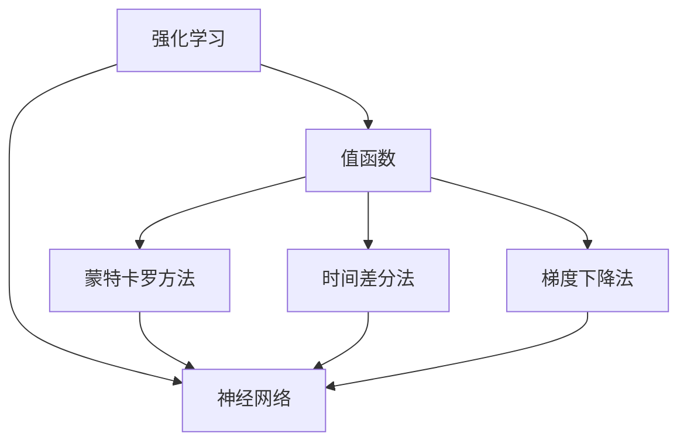
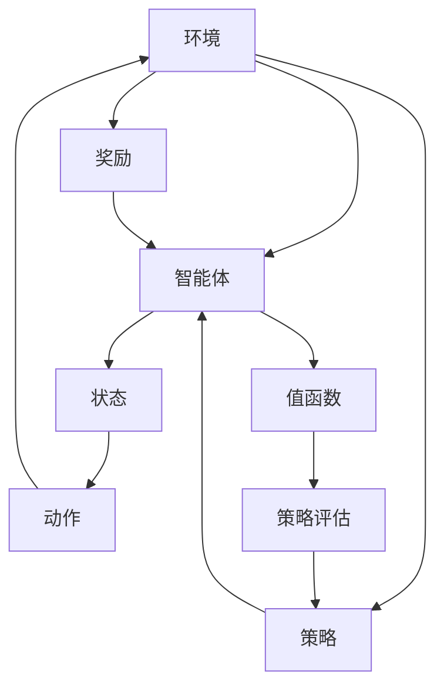
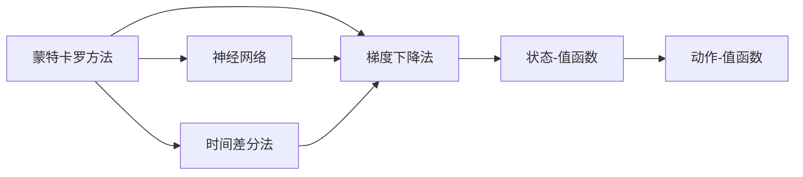
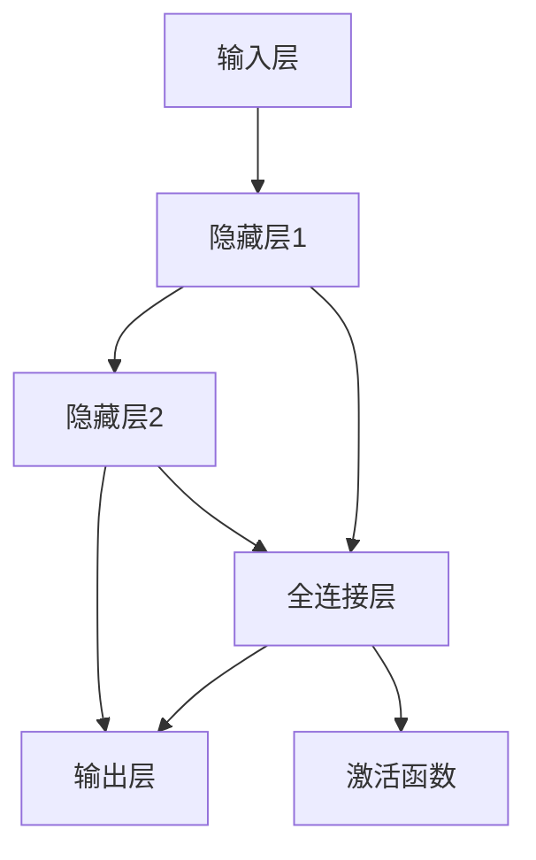

                 

# 值函数估计(Value Function Estimation) - 原理与代码实例讲解

> 关键词：值函数估计,蒙特卡罗方法,梯度下降法,神经网络,强化学习

## 1. 背景介绍

### 1.1 问题由来

在强化学习(Reinforcement Learning, RL)中，值函数估计是求解最优策略的基础。它旨在估计每个状态或动作的价值，以指导智能体在动态环境中进行决策。值函数估计的准确性直接影响策略评估和学习的效率。

近年来，随着深度学习技术的发展，神经网络被广泛应用于值函数估计，尤其是深度确定性策略梯度(Deterministic Policy Gradient, DPG)和深度Q网络(Deep Q-Network, DQN)等算法。这些基于神经网络的值函数估计方法极大地提高了强化学习的性能和效率。

### 1.2 问题核心关键点

强化学习的目标是通过与环境的交互，学习出一个最优策略，使得在某个评估标准下（如累积奖励）最大化。值函数估计是实现这一目标的核心步骤，它通过估计每个状态或动作的价值，从而指导智能体的决策。

值函数估计的核心挑战在于如何从大量的交互数据中准确地估计出每个状态的价值。常用的方法包括蒙特卡罗方法、时间差分法、梯度下降法等。这些方法在理论和实践中均有广泛应用。

### 1.3 问题研究意义

准确的值函数估计是强化学习成功的关键。通过估计值函数，可以评估当前策略的表现，指导策略的改进，最终找到最优策略。在工业界，值函数估计被广泛应用于机器人控制、自动驾驶、游戏AI等领域，带来了显著的性能提升和应用效果。

## 2. 核心概念与联系

### 2.1 核心概念概述

为更好地理解值函数估计，本节将介绍几个密切相关的核心概念：

- 强化学习(Reinforcement Learning)：通过与环境的交互，学习一个最优策略，最大化某个评估标准的算法。
- 值函数(Value Function)：评估一个状态或动作的长期累积奖励的函数，是强化学习中的重要组成部分。
- 蒙特卡罗方法(Monte Carlo Method)：通过模拟随机样本进行统计估计的方法。
- 梯度下降法(Gradient Descent)：通过梯度信息更新模型参数，使得损失函数最小化的优化算法。
- 神经网络(Neural Network)：由多个节点组成的网络，用于逼近复杂的非线性函数。

这些概念之间的关系可以通过以下Mermaid流程图来展示：



这个流程图展示了许多核心概念之间的关系：

1. 强化学习依赖于值函数评估，通过估计每个状态的价值来指导智能体的决策。
2. 值函数可以通过蒙特卡罗方法、时间差分法、梯度下降法等方法进行估计。
3. 神经网络是实现这些方法的基础工具，用于逼近复杂的非线性函数。

### 2.2 概念间的关系

这些核心概念之间存在着紧密的联系，形成了强化学习中的值函数估计的完整框架。下面我们通过几个Mermaid流程图来展示这些概念之间的关系。

#### 2.2.1 强化学习的基本流程



这个流程图展示了强化学习的基本流程：智能体通过与环境的交互，根据当前状态选择动作，接收奖励，并更新值函数。值函数评估用于指导策略改进，从而提升智能体的表现。

#### 2.2.2 值函数的估算方法



这个流程图展示了值函数的估算方法：蒙特卡罗方法、时间差分法、梯度下降法等。这些方法可以结合神经网络进行估算，以提高估计的准确性和泛化能力。

#### 2.2.3 神经网络的架构



这个流程图展示了神经网络的基本架构：输入层、隐藏层、全连接层、激活函数等。神经网络用于逼近复杂的非线性函数，是值函数估算的重要工具。

## 3. 核心算法原理 & 具体操作步骤
### 3.1 算法原理概述

值函数估计的核心是估计每个状态或动作的长期累积奖励，通常使用蒙特卡罗方法和时间差分法进行估算。

#### 3.1.1 蒙特卡罗方法

蒙特卡罗方法通过模拟随机样本进行统计估计。对于每个状态$s_t$，蒙特卡罗方法通过随机模拟其后续状态和奖励，计算其值函数$V(s_t)$。

具体来说，设智能体从状态$s_t$出发，执行一系列动作，最终到达状态$s_{t+T}$，并收到奖励$G_t$。则蒙特卡罗方法估计的值函数$V(s_t)$为：

$$ V(s_t) = \frac{1}{N} \sum_{i=1}^N \sum_{t'=t}^T r_{t'} $$

其中$r_{t'}$为状态$s_{t'}$的奖励，$N$为样本数量。

#### 3.1.2 时间差分法

时间差分法通过观察当前状态$s_t$和后续状态$s_{t+1}$之间的奖励差值，计算出$Q$值，进而估算出值函数。

具体来说，时间差分法通过以下递推公式计算每个状态的$Q$值：

$$ Q(s_t, a_t) = r_{t+1} + \gamma Q(s_{t+1}, a_{t+1}) $$

其中$\gamma$为折扣因子，通常取0.9至0.99之间。$Q$值反映了从状态$s_t$出发，执行动作$a_t$的长期累积奖励。

通过求解$Q$值，可以计算出每个状态的值函数$V(s_t)$。具体计算公式为：

$$ V(s_t) = \max_a Q(s_t, a) $$

### 3.2 算法步骤详解

#### 3.2.1 蒙特卡罗方法

蒙特卡罗方法的具体步骤如下：

1. 初始化值函数$V(s_t) = 0$。
2. 从初始状态$s_0$出发，随机模拟智能体的行为，收集每个状态和奖励的历史序列。
3. 对于每个状态$s_t$，计算其值函数$V(s_t)$，公式如上所示。
4. 重复上述过程，直到收集足够的历史数据。

#### 3.2.2 时间差分法

时间差分法的主要步骤如下：

1. 初始化$Q$值和值函数$V(s_t) = 0$。
2. 从初始状态$s_0$出发，按照策略$\pi$执行动作，观察后续状态$s_{t+1}$和奖励$r_{t+1}$。
3. 计算状态$s_{t+1}$的$Q$值，公式如上所示。
4. 更新状态$s_t$的$Q$值和$V(s_t)$，公式如上所示。
5. 重复上述过程，直到智能体完成一次完整的模拟。

### 3.3 算法优缺点

#### 3.3.1 蒙特卡罗方法

**优点：**

1. 易于理解和使用，计算简单直观。
2. 可以处理复杂的非线性函数。
3. 可以用于连续动作空间，无需对动作进行离散化。

**缺点：**

1. 样本效率较低，需要大量的随机模拟。
2. 对奖励的累积和折扣进行假设，可能导致估计偏差。
3. 难以处理高维状态空间，计算复杂度较高。

#### 3.3.2 时间差分法

**优点：**

1. 样本效率较高，计算速度较快。
2. 可以直接处理高维状态空间。
3. 对奖励的累积和折扣进行动态更新，减少估计偏差。

**缺点：**

1. 对策略的依赖性较强，需要准确估计策略。
2. 需要设计合适的折扣因子$\gamma$，选择不当可能导致收敛问题。
3. 对动作的离散化要求较高，需要合适的方法进行动作编码。

### 3.4 算法应用领域

基于值函数估计的强化学习在多个领域中得到了广泛应用，包括：

- 机器人控制：通过模拟环境，训练机器人执行复杂任务，如导航、抓取等。
- 自动驾驶：训练车辆在各种复杂场景下，通过强化学习进行路径规划和决策。
- 游戏AI：训练游戏角色在复杂的博弈环境中，进行决策和行动。
- 金融投资：训练交易模型，根据历史数据进行股票买卖决策。

这些领域中，强化学习的目标是通过与环境的交互，学习出最优策略，以最大化某种评估标准。而值函数估计是实现这一目标的核心步骤。

## 4. 数学模型和公式 & 详细讲解  
### 4.1 数学模型构建

本节将使用数学语言对基于神经网络的时间差分法值函数估计进行更加严格的刻画。

设智能体在状态$s_t$下执行动作$a_t$，观察到后续状态$s_{t+1}$和奖励$r_{t+1}$，则时间差分法估计的状态值函数$V(s_t)$和动作值函数$Q(s_t, a_t)$分别为：

$$
V(s_t) = r_{t+1} + \gamma \max_a Q(s_{t+1}, a)
$$

$$
Q(s_t, a_t) = r_{t+1} + \gamma \max_a Q(s_{t+1}, a)
$$

其中$\gamma$为折扣因子，通常取0.9至0.99之间。

### 4.2 公式推导过程

以下我们以动作值函数$Q(s_t, a_t)$的计算为例，推导其公式。

假设智能体在状态$s_t$下执行动作$a_t$，观察到后续状态$s_{t+1}$和奖励$r_{t+1}$，则时间差分法估计的动作值函数$Q(s_t, a_t)$为：

$$
Q(s_t, a_t) = r_{t+1} + \gamma \max_a Q(s_{t+1}, a)
$$

根据递归展开，可以得到：

$$
Q(s_t, a_t) = r_{t+1} + \gamma [r_{t+2} + \gamma \max_a Q(s_{t+1}, a)] + \gamma^2 [r_{t+3} + \gamma \max_a Q(s_{t+2}, a)] + \dots
$$

在实际应用中，可以通过神经网络逼近上述递归表达式，进行数值计算。

### 4.3 案例分析与讲解

以下以一个简单的例子来说明时间差分法的计算过程。

假设智能体在状态$s_0 = 1$下执行动作$a_0 = 2$，观察到后续状态$s_1 = 3$和奖励$r_1 = 0.5$，然后执行动作$a_1 = 1$，观察到后续状态$s_2 = 4$和奖励$r_2 = 0.7$。则时间差分法估计的$Q$值和$V$值为：

$$
Q(s_0, a_0) = 0.5 + \gamma \max_a Q(s_1, a)
$$

$$
Q(s_0, a_0) = 0.5 + \gamma (0.7 + \gamma \max_a Q(s_2, a))
$$

$$
Q(s_0, a_0) = 0.5 + 0.9 \times (0.7 + \gamma \max_a Q(s_2, a))
$$

$$
Q(s_0, a_0) = 0.5 + 0.9 \times (0.7 + 0.9 \max_a Q(s_2, a))
$$

假设智能体在状态$s_2 = 4$下执行动作$a_2 = 3$，观察到后续状态$s_3 = 5$和奖励$r_3 = 0.3$。则：

$$
Q(s_2, a_2) = 0.3 + \gamma \max_a Q(s_3, a)
$$

$$
Q(s_2, a_2) = 0.3 + 0.9 \max_a Q(s_3, a)
$$

$$
Q(s_2, a_2) = 0.3 + 0.9 \times (0.3 + \gamma \max_a Q(s_3, a))
$$

最终，通过计算，可以得到$Q(s_0, a_0)$和$V(s_0)$的值，从而指导智能体的行为决策。

## 5. 项目实践：代码实例和详细解释说明
### 5.1 开发环境搭建

在进行值函数估计的实践前，我们需要准备好开发环境。以下是使用Python进行TensorFlow开发的环境配置流程：

1. 安装Anaconda：从官网下载并安装Anaconda，用于创建独立的Python环境。

2. 创建并激活虚拟环境：
```bash
conda create -n tf-env python=3.8 
conda activate tf-env
```

3. 安装TensorFlow：根据CUDA版本，从官网获取对应的安装命令。例如：
```bash
conda install tensorflow -c tf -c conda-forge
```

4. 安装各类工具包：
```bash
pip install numpy pandas scikit-learn matplotlib tqdm jupyter notebook ipython
```

完成上述步骤后，即可在`tf-env`环境中开始值函数估计的实践。

### 5.2 源代码详细实现

下面我们以时间差分法为例，给出使用TensorFlow对DQN进行值函数估计的Python代码实现。

首先，定义DQN模型的基本架构：

```python
import tensorflow as tf
from tensorflow.keras import layers

class DQN(tf.keras.Model):
    def __init__(self, input_dim, output_dim, hidden_dim=64):
        super(DQN, self).__init__()
        self.fc1 = layers.Dense(hidden_dim, activation='relu', input_dim=input_dim)
        self.fc2 = layers.Dense(hidden_dim, activation='relu')
        self.fc3 = layers.Dense(output_dim, activation='linear')
    
    def call(self, inputs):
        x = self.fc1(inputs)
        x = self.fc2(x)
        return self.fc3(x)
```

然后，定义DQN模型的训练过程：

```python
import numpy as np
from collections import deque

class DQN:
    def __init__(self, input_dim, output_dim, learning_rate=0.01, gamma=0.99, epsilon=0.01):
        self.model = DQN(input_dim, output_dim)
        self.target_model = DQN(input_dim, output_dim)
        self.target_model.set_weights(self.model.get_weights())
        self.input_dim = input_dim
        self.output_dim = output_dim
        self.learning_rate = learning_rate
        self.gamma = gamma
        self.epsilon = epsilon
        self.memory = deque(maxlen=2000)
        self.timestep = 0
    
    def act(self, state):
        if np.random.rand() < self.epsilon:
            return np.random.randint(self.output_dim)
        q_values = self.model.predict(state)
        return np.argmax(q_values[0])
    
    def train(self, state, action, reward, next_state, done):
        self.timestep += 1
        if self.timestep % 1000 == 0:
            self.target_model.set_weights(self.model.get_weights())
        
        q_values_next = self.target_model.predict(next_state)
        q_values_next[np.argmax(q_values_next[0])] = reward if done else reward + self.gamma * np.max(q_values_next[0])
        q_values = self.model.predict(state)
        q_values[np.argmax(q_values[0])] = q_values_next[np.argmax(q_values_next[0])]
        
        self.memory.append((state, action, reward, next_state, done))
        if len(self.memory) > 2000:
            self.memory.popleft()
        
        if len(self.memory) > 1000:
            minibatch = np.array(self.memory[-len(self.memory)//2:])
            q_values = self.model.predict(minibatch[0])
            targets = minibatch[1] + self.gamma * np.max(self.target_model.predict(minibatch[3]), axis=1)
            targets[minibatch[4] == 1] = targets[minibatch[4] == 1] + reward
            targets = targets.reshape(-1, 1)
            loss = tf.reduce_mean(tf.square(q_values - targets))
            self.model.compile(optimizer=tf.keras.optimizers.Adam(learning_rate=self.learning_rate), loss='mse')
            self.model.fit(minibatch[0], targets, epochs=1, verbose=0)
```

最后，启动训练流程：

```python
input_dim = 4
output_dim = 2
env = gym.make('CartPole-v0')
state_dim = env.observation_space.shape[0]
action_dim = env.action_space.n

model = DQN(state_dim, output_dim)
for episode in range(1000):
    state = env.reset()
    done = False
    total_reward = 0
    
    while not done:
        action = model.act(state)
        next_state, reward, done, _ = env.step(action)
        total_reward += reward
        model.train(state, action, reward, next_state, done)
        state = next_state
    
    print(f"Episode {episode+1}: reward={total_reward}")
```

以上就是使用TensorFlow对DQN进行值函数估计的完整代码实现。可以看到，通过TensorFlow封装，DQN模型的实现变得简洁高效。

### 5.3 代码解读与分析

让我们再详细解读一下关键代码的实现细节：

**DQN类**：
- `__init__`方法：初始化DQN模型及其目标模型、输入和输出维度、学习率、折扣因子、探索率等。
- `act`方法：选择动作，采用$\epsilon$-贪心策略。
- `train`方法：根据样本数据训练模型，更新目标模型和模型参数。

**训练过程**：
- 定义输入和输出维度，创建DQN模型。
- 初始化状态、奖励、折扣因子和探索率等。
- 在每轮模拟中，选择动作并观察环境反馈，记录状态和奖励。
- 训练模型，更新模型参数，并根据样本数据进行梯度下降。

**运行结果展示**：
- 运行训练代码，输出每个轮次的总奖励。

可以看到，通过TensorFlow封装，DQN模型的实现变得简洁高效。开发者可以将更多精力放在数据处理、模型改进等高层逻辑上，而不必过多关注底层的实现细节。

当然，工业级的系统实现还需考虑更多因素，如模型的保存和部署、超参数的自动搜索、更灵活的策略改进等。但核心的值函数估计方法基本与此类似。

## 6. 实际应用场景
### 6.1 机器人控制

在机器人控制领域，基于值函数估计的强化学习被广泛应用于训练机器人执行复杂任务，如导航、抓取等。机器人通过与环境的交互，逐步学习出最优的决策策略，实现自主导航和操作。

### 6.2 自动驾驶

自动驾驶系统需要实时决策道路上的交通情况，选择最优的行驶路线和速度。基于值函数估计的强化学习可以训练车辆在各种复杂场景下，进行路径规划和决策，提升驾驶安全性。

### 6.3 游戏AI

游戏AI需要训练游戏角色在复杂的博弈环境中，进行决策和行动。基于值函数估计的强化学习可以训练角色在游戏中的策略，提升游戏体验和胜率。

### 6.4 金融投资

在金融投资领域，交易模型需要根据历史数据进行股票买卖决策。基于值函数估计的强化学习可以训练模型，学习最优的交易策略，提升投资收益。

### 6.5 未来应用展望

随着值函数估计和强化学习方法的不断发展，其在更多领域的应用前景将更加广阔。例如：

- 医疗诊断：训练医疗机器人进行诊断和治疗，提升医疗服务的精准性和效率。
- 能源管理：训练智能电网进行能源分配和优化，降低能源消耗和成本。
- 智能家居：训练智能设备进行用户行为预测和行为控制，提升生活体验。

这些领域中，值函数估计和强化学习的目标是通过与环境的交互，学习出最优策略，以最大化某种评估标准。而值函数估计是实现这一目标的核心步骤。

## 7. 工具和资源推荐
### 7.1 学习资源推荐

为了帮助开发者系统掌握值函数估计的理论基础和实践技巧，这里推荐一些优质的学习资源：

1. 《Deep Reinforcement Learning》课程：由Google DeepMind开设的强化学习课程，涵盖基于值函数估计的DQN等方法。

2. 《Reinforcement Learning: An Introduction》书籍：Reinforcement Learning领域的经典教材，详细介绍了强化学习的各种算法和案例。

3. 《TensorFlow for Deep Learning》书籍：TensorFlow官方文档，详细介绍了TensorFlow的强化学习库和案例。

4. 《OpenAI Gym》文档：OpenAI Gym官方文档，提供了丰富的环境库和示例代码，方便开发者进行实验。

5. 《RL-Agents》库：由Unity Technologies开发的强化学习框架，支持基于值的策略评估和训练。

通过对这些资源的学习实践，相信你一定能够快速掌握值函数估计的精髓，并用于解决实际的强化学习问题。

### 7.2 开发工具推荐

高效的开发离不开优秀的工具支持。以下是几款用于值函数估计开发的常用工具：

1. TensorFlow：由Google主导开发的开源深度学习框架，生产部署方便，适合大规模工程应用。

2. PyTorch：基于Python的开源深度学习框架，灵活动态的计算图，适合快速迭代研究。

3. OpenAI Gym：用于强化学习研究的模拟环境库，支持各种环境和动作空间。

4. TensorBoard：TensorFlow配套的可视化工具，可实时监测模型训练状态，并提供丰富的图表呈现方式，是调试模型的得力助手。

5. Weights & Biases：模型训练的实验跟踪工具，可以记录和可视化模型训练过程中的各项指标，方便对比和调优。

6. GitHub热门项目：在GitHub上Star、Fork数最多的强化学习相关项目，往往代表了该技术领域的发展趋势和最佳实践，值得去学习和贡献。

合理利用这些工具，可以显著提升值函数估计任务的开发效率，加快创新迭代的步伐。

### 7.3 相关论文推荐

值函数估计和强化学习技术的发展源于学界的持续研究。以下是几篇奠基性的相关论文，推荐阅读：

1. DQN: Deep Q-Learning: Generalization and Learnability（Deep Q-Network论文）：提出了基于神经网络的DQN算法，极大地提高了强化学习的性能和效率。

2. Q-learning: A Survey（Q-learning综述）：介绍了Q-learning算法的基本原理和应用，是强化学习领域的经典文献。

3. Softmax Policy: Optimizing Policy Selection in High-Dimensional Reinforcement Learning（Softmax策略论文）：提出了Softmax策略，进一步提升了强化学习算法的性能和稳定性。

4. A Survey of Recent Methods in Reinforcement Learning（强化学习综述）：综述了近年来强化学习的研究进展，提供了丰富的算法和案例。

这些论文代表了大值函数估计和强化学习的发展脉络。通过学习这些前沿成果，可以帮助研究者把握学科前进方向，激发更多的创新灵感。

除上述资源外，还有一些值得关注的前沿资源，帮助开发者紧跟值函数估计和强化学习的最新进展，例如：

1. arXiv论文预印本：人工智能领域最新研究成果的发布平台，包括大量尚未发表的前沿工作，学习前沿技术的必读资源。

2. 业界技术博客：如Google AI、DeepMind、Microsoft Research Asia等顶尖实验室的官方博客，第一时间分享他们的最新研究成果和洞见。

3. 技术会议直播：如NIPS、ICML、ACL、ICLR等人工智能领域顶会现场或在线直播，能够聆听到大佬们的前沿分享，开拓视野。

4. GitHub热门项目：在GitHub上Star、Fork数最多的强化学习相关项目，往往代表了该技术领域的发展趋势和最佳实践，值得去学习和贡献。

5. 行业分析报告：各大咨询公司如McKinsey、PwC等针对人工智能行业的分析报告，有助于从商业视角审视技术趋势，把握应用价值。

总之，对于值函数估计和强化学习技术的学习和实践，需要开发者保持开放的心态和持续学习的意愿。多关注前沿资讯，多动手实践，多思考总结，必将收获满满的成长收益。

## 8. 总结：未来发展趋势与挑战

### 8.1 总结

本文对基于神经网络的时间差分法值函数估计方法进行了全面系统的介绍。首先阐述了值函数估计在强化学习中的重要地位，明确了其在智能体决策和行为改进中的核心作用。其次，从原理到实践，详细讲解了时间差分法的数学

