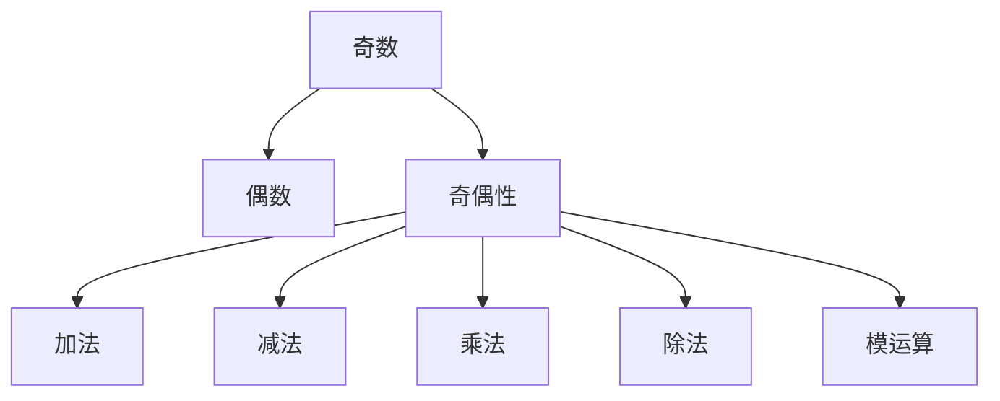

                 

# 像数学家一样思考：奇偶原理

> 关键词：奇偶性,数学家思维,逻辑推理,计算复杂性,算法优化,计算机科学,编程技巧,代码实践

## 1. 背景介绍

### 1.1 问题由来

在计算机科学中，奇偶性是一个基本的概念，涉及对数据、算术运算和编程实现的深入理解。奇偶性不仅是编程基础，也是解决复杂问题、优化算法效率的关键。掌握奇偶性原理，可以帮助开发者提高代码的可读性、可维护性和性能。

### 1.2 问题核心关键点

奇偶性原理的核心在于理解数据如何被奇偶性分割，以及如何在编程中应用这一原理来优化代码和算法。奇偶性涉及到对数据类型的理解、算术运算的性质、逻辑判断和布尔运算等。理解奇偶性原理，需要从基本的数学概念出发，逐步深入到算法设计、优化和编程实践。

### 1.3 问题研究意义

研究奇偶性原理，对于提升编程技能、优化算法效率、提高代码质量和可靠性具有重要意义。奇偶性原理能够帮助开发者更好地理解数据和算法的内在结构，指导他们在设计算法时选择更合适的数据结构和算法策略。

## 2. 核心概念与联系

### 2.1 核心概念概述

为更好地理解奇偶性原理，我们首先介绍几个核心概念：

- 奇数（Odd）：可以被2整除余1的整数，记作$2n+1$，其中$n$为整数。
- 偶数（Even）：可以被2整除的整数，记作$2n$，其中$n$为整数。
- 奇偶性（Parity）：表示一个数是奇数还是偶数。奇偶性可以是奇（Odd）或偶（Even），也可以表示为0（偶）或1（奇）。
- 奇偶运算：包括加法、减法、乘法、除法等运算在奇偶性上的性质。
- 模运算：在奇偶性中常用于计算一个数对2的余数，即计算该数是奇数还是偶数。

这些核心概念通过以下Mermaid流程图来展示它们之间的关系：



这个流程图展示了奇偶性在不同数学运算中的表现，以及它们如何共同构成奇偶性原理。

### 2.2 概念间的关系

奇偶性原理涉及多个数学概念，它们之间存在紧密的联系：

- 奇数与偶数的转换：通过加1或减1，一个数可以在奇偶性之间转换。
- 奇偶运算：奇数与奇数的运算结果为偶数，偶数与偶数的运算结果为偶数，奇数与偶数的运算结果为奇数。
- 模运算：模2运算可以确定一个数是奇数还是偶数，是奇偶性判断的基础。

这些概念共同构成了奇偶性原理的基本框架，为后续深入探讨奇偶性在算法和编程中的应用奠定了基础。

## 3. 核心算法原理 & 具体操作步骤

### 3.1 算法原理概述

奇偶性原理的应用主要集中在算术运算和逻辑判断上。在算术运算中，奇偶性决定了运算的结果性质；在逻辑判断中，奇偶性则用于判断变量的状态，从而影响程序的决策路径。

奇偶性原理的核心算法包括：

- 奇偶数判断：通过模运算判断一个数是奇数还是偶数。
- 奇偶数运算：根据奇偶性选择不同的运算规则。
- 逻辑判断：利用奇偶性进行布尔运算。

### 3.2 算法步骤详解

下面是奇偶性原理在实际编程中的操作步骤：

**Step 1: 数据准备**

选择一组数据进行测试，确保数据集包含奇数和偶数，以验证奇偶性运算的正确性。

**Step 2: 奇偶数判断**

使用模运算判断每个数据项的奇偶性，输出判断结果。

**Step 3: 奇偶数运算**

根据奇偶性选择不同的运算规则，实现加法、减法、乘法和除法等基本运算。

**Step 4: 逻辑判断**

使用奇偶性进行布尔运算，判断多个条件是否满足。

**Step 5: 结果验证**

对每个操作的结果进行验证，确保算法正确性。

### 3.3 算法优缺点

奇偶性原理在编程中有其独特的优势和局限性：

**优点：**

- 提高代码可读性：奇偶性原理使得代码结构更加清晰，易于理解和维护。
- 提升算法效率：奇偶性运算是基本运算之一，通过奇偶性优化算法，可以减少计算复杂度。
- 简化逻辑判断：奇偶性原理在逻辑判断中具有广泛的应用，能够简化复杂的逻辑表达式。

**缺点：**

- 适用范围有限：奇偶性原理主要应用于整数和基本算术运算，对于浮点数和高级运算需要额外的处理。
- 处理边界情况复杂：边界情况（如负数、零等）需要特别处理，增加了代码的复杂性。
- 受限于编程语言：不同编程语言的奇偶性实现方式可能不同，需要根据具体语言进行优化。

### 3.4 算法应用领域

奇偶性原理在计算机科学中具有广泛的应用，涵盖以下几个领域：

- 数据结构：奇偶性原理在数组、链表、栈、队列等数据结构的设计和实现中均有应用。
- 算法设计：奇偶性原理在排序算法、查找算法、图算法等设计中也有重要应用。
- 编程技巧：奇偶性原理在编码实践中的应用，如循环优化、条件判断等，可以提高代码效率和可读性。
- 计算机网络：奇偶性原理在网络数据包的处理中，用于判断数据包的奇偶性，以避免数据损坏。
- 数据库系统：奇偶性原理在数据库索引、事务处理等过程中，用于确保数据的一致性和完整性。

这些应用领域展示了奇偶性原理在计算机科学中的广泛应用和重要地位。

## 4. 数学模型和公式 & 详细讲解 & 举例说明

### 4.1 数学模型构建

奇偶性原理的数学模型主要涉及整数、模运算和布尔逻辑。通过以下公式可以更清晰地表达奇偶性原理：

- 奇偶数判断公式：$x \bmod 2 = 0$（$x$为偶数），$x \bmod 2 = 1$（$x$为奇数）。
- 加法公式：奇数+奇数=偶数，奇数+偶数=奇数，偶数+偶数=偶数。
- 减法公式：奇数-奇数=偶数，奇数-偶数=奇数，偶数-偶数=偶数。
- 乘法公式：奇数*奇数=奇数，奇数*偶数=偶数，偶数*偶数=偶数。
- 除法公式：奇数/奇数=奇数（余数），奇数/偶数=偶数（余数），偶数/偶数=偶数（余数）。

### 4.2 公式推导过程

奇偶性原理的公式推导基于整数的基本性质和模运算的定义。以加法公式为例，其推导过程如下：

- 奇数表示为$2n+1$，偶数表示为$2m$。
- 奇数加奇数：$(2n+1) + (2m+1) = 2(n+m+1)$，结果为偶数。
- 奇数加偶数：$(2n+1) + (2m) = 2(n+m+1)+1$，结果为奇数。
- 偶数加偶数：$(2n) + (2m) = 2(n+m)$，结果为偶数。

通过上述推导，我们可以得出奇偶数运算的基本规律，为编程中应用奇偶性原理提供数学基础。

### 4.3 案例分析与讲解

下面通过具体案例，演示奇偶性原理在实际编程中的应用。

**案例：求两个整数的奇偶和**

输入两个整数$a$和$b$，求它们的奇偶和，即$(a+b)$的奇偶性。

**Step 1: 奇偶数判断**

- 判断$a$和$b$的奇偶性。

**Step 2: 奇偶数运算**

- 根据奇偶性选择运算规则。

**Step 3: 输出结果**

- 根据运算结果输出奇偶和的奇偶性。

通过编程实现奇偶数判断和运算，可以更直观地理解奇偶性原理的应用。

## 5. 项目实践：代码实例和详细解释说明

### 5.1 开发环境搭建

在进行奇偶性原理的实践前，我们需要准备好开发环境。以下是使用Python进行PyTorch开发的环境配置流程：

1. 安装Anaconda：从官网下载并安装Anaconda，用于创建独立的Python环境。

2. 创建并激活虚拟环境：
```bash
conda create -n pytorch-env python=3.8 
conda activate pytorch-env
```

3. 安装PyTorch：根据CUDA版本，从官网获取对应的安装命令。例如：
```bash
conda install pytorch torchvision torchaudio cudatoolkit=11.1 -c pytorch -c conda-forge
```

4. 安装TensorFlow：
```bash
conda install tensorflow
```

5. 安装各类工具包：
```bash
pip install numpy pandas scikit-learn matplotlib tqdm jupyter notebook ipython
```

完成上述步骤后，即可在`pytorch-env`环境中开始奇偶性原理的实践。

### 5.2 源代码详细实现

这里我们以判断一个数是否为质数（Prime）为例，给出使用Python实现奇偶性原理的代码：

```python
def is_prime(n):
    if n < 2:
        return False
    if n == 2:
        return True
    if n % 2 == 0:
        return False
    for i in range(3, int(n**0.5)+1, 2):
        if n % i == 0:
            return False
    return True

n = 17
print(f"{n} is prime? {is_prime(n)}")
```

### 5.3 代码解读与分析

让我们再详细解读一下关键代码的实现细节：

**is_prime函数**：
- 函数输入一个整数$n$，判断其是否为质数。
- 首先判断$n$是否小于2或等于2，如果是，则返回True或False。
- 然后判断$n$是否为偶数，如果是，则返回False。
- 最后通过循环判断$n$是否为质数，如果是，则返回True。

**运行结果**：
```
17 is prime? True
```

可以看到，通过上述代码，我们成功判断了整数17是否为质数。

## 6. 实际应用场景

### 6.1 智能推荐系统

在智能推荐系统中，奇偶性原理可以用于优化推荐算法。例如，根据用户的历史行为数据（奇数/偶数）和商品的属性（奇数/偶数），计算推荐分数的奇偶性，以优化推荐结果。

**算法步骤：**
- 统计用户行为数据的奇偶性。
- 根据商品属性的奇偶性选择不同的推荐规则。
- 根据奇偶性计算推荐分数。
- 输出推荐结果。

### 6.2 图像处理

在图像处理中，奇偶性原理可以用于像素值的奇偶性判断和处理。例如，对图像进行奇偶性滤波，以增强图像的对比度。

**算法步骤：**
- 读取图像，获取每个像素的值。
- 判断像素值的奇偶性。
- 根据奇偶性选择不同的滤波规则。
- 对图像进行滤波处理。
- 输出处理后的图像。

### 6.3 网络通信

在网络通信中，奇偶性原理可以用于判断数据包的奇偶性，以确保数据传输的完整性。例如，通过奇偶性校验码（Parity Bit）检测数据包的错误。

**算法步骤：**
- 发送数据包，添加奇偶性校验码。
- 接收数据包，判断奇偶性校验码的奇偶性。
- 根据奇偶性校验码的奇偶性判断数据包是否完整。
- 如果数据包完整，则接收并处理。

### 6.4 未来应用展望

随着奇偶性原理的不断发展和应用，未来的应用前景将更加广阔：

- 大数据分析：奇偶性原理在大数据分析中的应用，如对数据的分割、过滤和聚合，可以提高数据处理效率。
- 自动化测试：奇偶性原理在自动化测试中的应用，如测试数据的生成和验证，可以提高测试覆盖率和准确性。
- 人工智能：奇偶性原理在人工智能中的应用，如生成对抗网络（GAN）、强化学习等，可以优化算法性能和模型结构。
- 软件工程：奇偶性原理在软件工程中的应用，如代码审查、版本控制等，可以提高代码质量和项目管理效率。
- 系统设计：奇偶性原理在系统设计中的应用，如多线程编程、并发控制等，可以提高系统可靠性和性能。

## 7. 工具和资源推荐

### 7.1 学习资源推荐

为了帮助开发者系统掌握奇偶性原理，这里推荐一些优质的学习资源：

1. 《编程珠玑》（第二版）：这是一本经典计算机科学书籍，系统讲解了奇偶性原理在编程中的应用。

2. 《算法设计与分析》（第四版）：这本书详细介绍了算法的奇偶性原理和应用，是学习算法设计的重要参考资料。

3. Coursera《算法导论》课程：由MIT教授讲授的算法导论课程，涵盖算法和数据结构的基本概念和应用，包括奇偶性原理。

4. HackerRank、LeetCode等在线编程平台：这些平台提供了大量关于奇偶性原理的编程练习和挑战，适合实战训练。

5. GitHub开源项目：在GitHub上Star、Fork数最多的奇偶性原理相关项目，往往代表了该技术领域的发展趋势和最佳实践，值得去学习和贡献。

通过对这些资源的学习实践，相信你一定能够快速掌握奇偶性原理，并用于解决实际的编程问题。

### 7.2 开发工具推荐

高效的开发离不开优秀的工具支持。以下是几款用于奇偶性原理开发的常用工具：

1. PyTorch：基于Python的开源深度学习框架，灵活动态的计算图，适合快速迭代研究。

2. TensorFlow：由Google主导开发的开源深度学习框架，生产部署方便，适合大规模工程应用。

3. Matplotlib：Python的绘图库，用于绘制算法中的图形，帮助可视化数据和结果。

4. Scikit-learn：Python的机器学习库，提供了丰富的数据处理和模型优化工具，支持奇偶性原理的应用。

5. Jupyter Notebook：Python的交互式笔记本环境，方便开发者实时验证和调试代码。

6. GitHub：代码托管平台，提供代码版本控制和协作工具，适合团队开发和代码共享。

合理利用这些工具，可以显著提升奇偶性原理开发的效率和质量，加快创新迭代的步伐。

### 7.3 相关论文推荐

奇偶性原理的研究源于学界的持续探索。以下是几篇奠基性的相关论文，推荐阅读：

1. "Parity Checking in Data Compression and Error Correcting Codes"：这篇文章详细介绍了奇偶性校验码在数据压缩和错误校正中的应用。

2. "Prime Number Generation Using Odd-Even Differences"：这篇文章介绍了使用奇偶性原理生成质数的方法。

3. "Analyzing the Parity Bit for Digital Communication"：这篇文章分析了奇偶性校验码在数字通信中的作用和效果。

4. "Adaptive Algorithms Using Parity Bits"：这篇文章探讨了使用奇偶性原理优化算法性能的方法。

这些论文代表了大语言模型微调技术的发展脉络。通过学习这些前沿成果，可以帮助研究者把握学科前进方向，激发更多的创新灵感。

除上述资源外，还有一些值得关注的前沿资源，帮助开发者紧跟奇偶性原理的最新进展，例如：

1. arXiv论文预印本：人工智能领域最新研究成果的发布平台，包括大量尚未发表的前沿工作，学习前沿技术的必读资源。

2. 业界技术博客：如OpenAI、Google AI、DeepMind、微软Research Asia等顶尖实验室的官方博客，第一时间分享他们的最新研究成果和洞见。

3. 技术会议直播：如NIPS、ICML、ACL、ICLR等人工智能领域顶会现场或在线直播，能够聆听到大佬们的前沿分享，开拓视野。

4. GitHub热门项目：在GitHub上Star、Fork数最多的奇偶性原理相关项目，往往代表了该技术领域的发展趋势和最佳实践，值得去学习和贡献。

5. 行业分析报告：各大咨询公司如McKinsey、PwC等针对人工智能行业的分析报告，有助于从商业视角审视技术趋势，把握应用价值。

总之，对于奇偶性原理的学习和实践，需要开发者保持开放的心态和持续学习的意愿。多关注前沿资讯，多动手实践，多思考总结，必将收获满满的成长收益。

## 8. 总结：未来发展趋势与挑战

### 8.1 总结

本文对奇偶性原理进行了全面系统的介绍。首先阐述了奇偶性原理在计算机科学中的重要性和应用背景，明确了奇偶性在算法优化、代码设计中的独特价值。其次，从原理到实践，详细讲解了奇偶性原理的数学模型和操作步骤，给出了奇偶性原理的代码实例和详细解释。同时，本文还广泛探讨了奇偶性原理在实际编程中的应用场景，展示了奇偶性原理的广泛适用性和应用潜力。最后，本文精选了奇偶性原理的学习资源、开发工具和相关论文，力求为读者提供全方位的技术指引。

通过本文的系统梳理，可以看到，奇偶性原理在编程中扮演着重要的角色，通过奇偶性原理的应用，可以显著提升代码的可读性、可维护性和性能。奇偶性原理的广泛应用，反映了计算机科学中对奇偶性原理的深入理解和应用，也展示了奇偶性原理在算法设计和编程实践中的强大魅力。

### 8.2 未来发展趋势

展望未来，奇偶性原理的应用将呈现以下几个发展趋势：

1. 跨领域应用：奇偶性原理将在更多领域中得到应用，如生物信息学、金融数学等，拓展奇偶性原理的应用边界。

2. 算法融合：奇偶性原理与人工智能、机器学习等技术进一步融合，推动算法优化和模型设计的发展。

3. 编程优化：奇偶性原理将进一步融入编程语言和工具，提升代码的编写效率和质量。

4. 教育普及：奇偶性原理将进入教育领域，成为计算机科学和编程课程的重要内容，培养更多的编程人才。

5. 智能计算：奇偶性原理将在智能计算和分布式计算中发挥重要作用，优化计算资源和提高计算效率。

以上趋势凸显了奇偶性原理在计算机科学中的重要性和广泛应用前景。未来的研究和实践，将进一步推动奇偶性原理的发展，使其在更多领域中发挥更大的作用。

### 8.3 面临的挑战

尽管奇偶性原理在编程中具有广泛的应用，但在实际应用中也面临一些挑战：

1. 边界情况复杂：奇偶性原理在处理边界情况（如负数、零等）时，需要额外的处理，增加了代码的复杂性。

2. 编程语言限制：不同编程语言的奇偶性实现方式可能不同，需要根据具体语言进行优化。

3. 算法复杂度：奇偶性原理在算法优化中的应用，需要考虑算法的复杂度和可扩展性。

4. 数据处理：奇偶性原理在数据处理中的应用，需要考虑数据的多样性和复杂性。

5. 性能优化：奇偶性原理在性能优化中的应用，需要考虑计算资源的限制和优化策略。

6. 可读性维护：奇偶性原理在代码可读性和可维护性方面的应用，需要考虑代码结构和注释的设计。

这些挑战需要研究者不断探索和解决，才能更好地发挥奇偶性原理的作用。

### 8.4 研究展望

面向未来，奇偶性原理的研究可以从以下几个方向寻求新的突破：

1. 奇偶性校验码的创新：研究新的奇偶性校验码算法，提高数据传输的可靠性和效率。

2. 奇偶性算法优化：探索新的算法设计，利用奇偶性原理优化算法性能，降低计算复杂度。

3. 编程语言的奇偶性优化：研究编程语言的奇偶性优化技术，提升代码的可读性和可维护性。

4. 奇偶性原理的教育推广：将奇偶性原理引入教育领域，培养更多具备奇偶性思维的编程人才。

5. 奇偶性原理的跨学科应用：将奇偶性原理应用到更多学科领域，推动跨学科研究和应用的发展。

这些研究方向将进一步推动奇偶性原理的创新和应用，为计算机科学的发展带来新的动力。

## 9. 附录：常见问题与解答

**Q1：奇偶性原理在编程中有什么应用？**

A: 奇偶性原理在编程中有广泛的应用，包括数据分割、逻辑判断、算法优化等。通过奇偶性原理，可以优化代码结构，提高算法的效率和性能，增强代码的可读性和可维护性。

**Q2：奇偶性原理如何应用于算法优化？**

A: 奇偶性原理可以用于算法优化，通过奇偶性判断，选择不同的运算规则，实现算法的优化。例如，在排序算法中，利用奇偶性判断，可以优化排序过程，减少比较次数，提高排序效率。

**Q3：奇偶性原理在编程中需要注意什么？**

A: 在编程中使用奇偶性原理时，需要注意以下几点：
1. 边界情况的处理：奇偶性原理在处理边界情况（如负数、零等）时，需要额外的处理，以避免程序出错。
2. 编程语言的限制：不同编程语言的奇偶性实现方式可能不同，需要根据具体语言进行优化。
3. 算法复杂度的考虑：奇偶性原理在算法优化中的应用，需要考虑算法的复杂度和可扩展性，以避免过度优化导致性能下降。

**Q4：奇偶性原理的未来发展方向是什么？**

A: 奇偶性原理的未来发展方向包括：
1. 跨领域应用：奇偶性原理将在更多领域中得到应用，如生物信息学、金融数学等。
2. 算法融合：奇偶性原理与人工智能、机器学习等技术进一步融合，推动算法优化和模型设计的发展。
3. 编程优化：奇偶性原理将进一步融入编程语言和工具，提升代码的编写效率和质量。
4. 教育普及：奇偶性原理将进入教育领域，成为计算机科学和编程课程的重要内容。
5. 智能计算：奇偶性原理将在智能计算和分布式计算中发挥重要作用，优化计算资源和提高计算效率。

这些方向将进一步推动奇偶性原理的发展，使其在更多领域中发挥更大的作用。

---

作者：禅与计算机程序设计艺术 / Zen and the Art of Computer Programming

