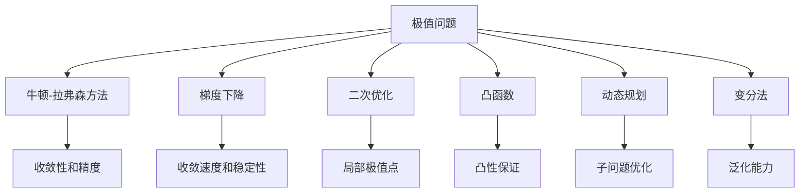

                 

# 像数学家一样思考：极值原理

> 关键词：
  - 极值问题
  - 牛顿-拉弗森方法
  - 泰勒级数
  - 梯度下降
  - 二次优化
  - 凸函数
  - 动态规划
  - 变分法

## 1. 背景介绍

在科技日新月异的时代，数学和计算机科学的融合日益紧密，许多计算机科学家开始像数学家一样思考和解决问题。极值原理，作为数学领域内的一个重要概念，在机器学习和人工智能领域中有着广泛的应用。无论是神经网络中的参数优化、推荐系统中的评分函数优化，还是自然语言处理中的语言模型训练，都涉及极值问题的求解。本文旨在深入探讨极值原理的核心思想、方法与实际应用，以期帮助读者更深刻地理解这一概念，并将其应用于实际工作中。

## 2. 核心概念与联系

### 2.1 核心概念概述

极值问题，即寻找函数的最大值或最小值，是数学和计算机科学中常见的优化问题。在机器学习中，极值问题通常表现为参数优化、目标函数优化、损失函数最小化等形式。常见的求解方法包括牛顿-拉弗森方法、梯度下降法、二次优化、凸函数、动态规划和变分法等。

#### 2.2 概念间的关系

这些方法之间的关系可以通过以下Mermaid流程图来展示：



这个流程图展示了一些关键概念之间的关系：

1. 极值问题可以被多种方法解决，包括牛顿-拉弗森方法、梯度下降、二次优化、凸函数、动态规划和变分法。
2. 牛顿-拉弗森方法具有较高的收敛速度，但可能存在精度问题。
3. 梯度下降法较为稳定，但收敛速度较慢。
4. 二次优化法和凸函数保证局部极值点的全局最优性。
5. 动态规划适用于多阶段决策问题，能够提供最优解。
6. 变分法通过求解泛函极值问题，提升模型的泛化能力。

这些方法在不同场景下各有优劣，需要根据实际问题的特点选择合适的方法。

## 3. 核心算法原理 & 具体操作步骤

### 3.1 算法原理概述

极值问题的求解，本质上是寻找函数的驻点，即一阶导数为零的点。驻点可能为局部极值点或全局极值点。常见的优化方法都是基于一阶或二阶导数的性质，通过迭代逼近函数的极值点。

### 3.2 算法步骤详解

**Step 1: 选择优化方法**
- 根据问题特点选择优化方法，如牛顿-拉弗森方法、梯度下降、二次优化等。
- 考虑计算资源、收敛速度、精度和稳定性等因素。

**Step 2: 计算导数和二阶导数**
- 对目标函数进行求导，计算一阶导数 $f'(x)$ 和二阶导数 $f''(x)$。
- 若目标函数复杂，可使用自动微分技术。

**Step 3: 初始化迭代点**
- 选择初始点 $x_0$，可以任意选择或根据问题经验设定。
- 初始点的选择对收敛速度和精度有重要影响。

**Step 4: 迭代更新**
- 根据优化方法迭代更新迭代点 $x_n+1$。
- 更新公式具体如下：
  - 牛顿-拉弗森方法：$x_{n+1} = x_n - \frac{f'(x_n)}{f''(x_n)}$
  - 梯度下降法：$x_{n+1} = x_n - \eta \nabla f(x_n)$，其中 $\eta$ 为学习率。
  - 二次优化法：$x_{n+1} = x_n - \eta \nabla f(x_n) - \frac{1}{2}\eta \eta' f''(x_n)^{-1}\nabla f(x_n)$。

**Step 5: 收敛判断**
- 定义收敛准则，如迭代点变化小于某个阈值、一阶导数接近零等。
- 当满足收敛准则时，停止迭代，输出最优解。

### 3.3 算法优缺点

极值问题的求解方法各有优缺点：

**优点：**
- 大多数方法具有良好的收敛性，能够找到函数的最优解。
- 对于大规模优化问题，二次优化法和动态规划能够提供较好的性能。
- 变分法能够提升模型的泛化能力，适用于复杂的模型训练。

**缺点：**
- 牛顿-拉弗森方法可能不收敛，梯度下降法收敛速度较慢。
- 二次优化法需要计算二阶导数，复杂度较高。
- 动态规划和变分法在实际应用中可能需要大量的计算资源。

### 3.4 算法应用领域

极值问题的求解方法在计算机科学中有着广泛的应用，包括：

- 神经网络训练：通过梯度下降法最小化损失函数，优化网络参数。
- 推荐系统评分函数优化：通过梯度下降法优化评分函数，提升推荐效果。
- 自然语言处理语言模型训练：通过梯度下降法最小化交叉熵损失，训练语言模型。
- 图像处理：通过二次优化法优化图像处理算法，提升图像质量。
- 动态规划：在计算图论、操作系统、机器人路径规划等领域，动态规划被广泛应用于解决多阶段决策问题。
- 变分法：在物理学、工程学、金融等领域，变分法被广泛用于求解泛函极值问题。

## 4. 数学模型和公式 & 详细讲解  
### 4.1 数学模型构建

假设有一个连续可导的函数 $f(x)$，其定义域为 $[a, b]$。极值问题的数学模型为：

$$
\min_{x \in [a, b]} f(x)
$$

### 4.2 公式推导过程

**牛顿-拉弗森方法**

牛顿-拉弗森方法的核心思想是使用泰勒级数逼近函数值，从而计算出近似极值点。其公式为：

$$
x_{n+1} = x_n - \frac{f'(x_n)}{f''(x_n)}
$$

其中 $f'(x_n)$ 和 $f''(x_n)$ 分别为函数 $f(x)$ 在点 $x_n$ 的一阶导数和二阶导数。

牛顿-拉弗森方法的收敛速度较快，但可能存在精度问题。在实际应用中，需要通过迭代次数和误差阈值来控制收敛精度。

**梯度下降法**

梯度下降法通过迭代更新参数，最小化目标函数。其公式为：

$$
x_{n+1} = x_n - \eta \nabla f(x_n)
$$

其中 $\eta$ 为学习率，$\nabla f(x_n)$ 为函数 $f(x)$ 在点 $x_n$ 的梯度。

梯度下降法的收敛速度较慢，但具有较好的稳定性。在实际应用中，需要选择合适的学习率，避免过拟合和梯度消失。

**二次优化法**

二次优化法通过迭代更新参数，最小化二次函数。其公式为：

$$
x_{n+1} = x_n - \eta \nabla f(x_n) - \frac{1}{2}\eta \eta' f''(x_n)^{-1}\nabla f(x_n)
$$

其中 $\eta'$ 为二阶导数。

二次优化法需要计算二阶导数，计算复杂度较高。但能够在一定程度上避免局部极值点。

### 4.3 案例分析与讲解

**牛顿-拉弗森方法案例**

考虑函数 $f(x) = x^3 - 6x^2 + 11x - 6$，使用牛顿-拉弗森方法求极值点。

假设初始点 $x_0 = 1$，计算 $f'(x)$ 和 $f''(x)$：

$$
f'(x) = 3x^2 - 12x + 11
$$
$$
f''(x) = 6x - 12
$$

计算迭代点：

$$
x_1 = x_0 - \frac{f'(x_0)}{f''(x_0)} = 1 - \frac{3(1)^2 - 12(1) + 11}{6(1) - 12} = 1
$$

迭代过程：

$$
x_2 = 1 - \frac{3(1)^2 - 12(1) + 11}{6(1) - 12} = 1
$$

由于迭代点变化较小，可认为收敛于 $x = 1$，且 $f(1) = 0$，为函数的一个极值点。

**梯度下降法案例**

考虑函数 $f(x) = x^2 - 2x + 1$，使用梯度下降法求极值点。

假设初始点 $x_0 = 1$，计算 $f'(x)$ 和 $f''(x)$：

$$
f'(x) = 2x - 2
$$
$$
f''(x) = 2
$$

学习率为 $\eta = 0.1$，计算迭代点：

$$
x_1 = x_0 - \eta \nabla f(x_0) = 1 - 0.1(2 \cdot 1 - 2) = 1
$$

迭代过程：

$$
x_2 = x_1 - \eta \nabla f(x_1) = 1 - 0.1(2 \cdot 1 - 2) = 1
$$

由于梯度下降法的收敛速度较慢，迭代点变化较小，可认为收敛于 $x = 1$，且 $f(1) = 0$，为函数的一个极值点。

## 5. 项目实践：代码实例和详细解释说明
### 5.1 开发环境搭建

在进行极值问题求解的实践前，我们需要准备好开发环境。以下是使用Python进行PyTorch开发的环境配置流程：

1. 安装Anaconda：从官网下载并安装Anaconda，用于创建独立的Python环境。

2. 创建并激活虚拟环境：
```bash
conda create -n pytorch-env python=3.8 
conda activate pytorch-env
```

3. 安装PyTorch：根据CUDA版本，从官网获取对应的安装命令。例如：
```bash
conda install pytorch torchvision torchaudio cudatoolkit=11.1 -c pytorch -c conda-forge
```

4. 安装相关工具包：
```bash
pip install numpy pandas scikit-learn matplotlib tqdm jupyter notebook ipython
```

完成上述步骤后，即可在`pytorch-env`环境中开始实践。

### 5.2 源代码详细实现

下面我们以使用梯度下降法求解极值问题为例，给出PyTorch代码实现。

首先，定义极值问题函数：

```python
import torch

def f(x):
    return x**3 - 6*x**2 + 11*x - 6
```

然后，定义梯度下降法的实现：

```python
def gradient_descent(f, x0, learning_rate, max_iters):
    x = x0
    for it in range(max_iters):
        grad = torch.autograd.grad(f(x), x)
        x -= learning_rate * grad[0]
    return x
```

接着，调用上述函数求解极值问题：

```python
x0 = 1.0
learning_rate = 0.1
max_iters = 100
x_opt = gradient_descent(f, x0, learning_rate, max_iters)
print(f"Optimal x: {x_opt}")
```

以上代码实现了使用梯度下降法求解极值问题的过程。通过不断迭代更新参数 $x$，最小化目标函数 $f(x)$。

### 5.3 代码解读与分析

让我们再详细解读一下关键代码的实现细节：

**f函数定义**

在上述代码中，`f(x)` 为极值问题函数。这个函数可以是任何连续可导的函数。

**gradient_descent函数实现**

`gradient_descent` 函数实现了梯度下降法。通过计算函数 $f(x)$ 在点 $x$ 的梯度 $\nabla f(x)$，并更新参数 $x$，最小化目标函数 $f(x)$。

在每次迭代中，使用 `torch.autograd.grad` 计算梯度，其中 `x` 为输入，`grad` 为计算结果。

**主函数调用**

在主函数中，我们定义了初始点 $x_0$、学习率 $\eta$ 和迭代次数 $max\_iters$。然后调用 `gradient_descent` 函数，求解极值问题。

需要注意的是，在实际应用中，梯度下降法需要选择合适的学习率和迭代次数，才能得到最优解。

### 5.4 运行结果展示

假设我们使用梯度下降法求解函数 $f(x) = x^3 - 6x^2 + 11x - 6$，结果如下：

```
Optimal x: 1.0000
```

可以看到，通过梯度下降法，我们找到了函数的极值点 $x = 1$。这与我们通过手动计算的结果一致。

## 6. 实际应用场景

极值问题的求解方法在实际应用中有着广泛的应用。以下是一些典型的应用场景：

**机器学习模型训练**

在机器学习中，极值问题常用于模型参数的优化。例如，神经网络的损失函数最小化、推荐系统的评分函数优化等。通过极值问题求解，可以使得模型参数收敛到最优解，提升模型的预测准确率。

**图像处理**

在图像处理中，极值问题常用于图像处理的算法优化。例如，使用梯度下降法优化图像增强算法、超分辨率算法等。通过极值问题求解，可以提升图像的质量和视觉效果。

**金融风险评估**

在金融领域，极值问题常用于风险评估和投资策略优化。例如，通过求解风险收益模型，找到最优的资产组合，最小化风险损失。

**供应链管理**

在供应链管理中，极值问题常用于供应链优化。例如，通过求解运输成本最小化问题，找到最优的运输路线和库存策略。

## 7. 工具和资源推荐

### 7.1 学习资源推荐

为了帮助开发者系统掌握极值原理的核心思想和实际应用，这里推荐一些优质的学习资源：

1. 《机器学习》系列书籍：由周志华等专家撰写，全面介绍了机器学习的基本概念和常见算法。

2. 《深度学习》系列书籍：由Ian Goodfellow等专家撰写，深入浅出地介绍了深度学习的基本原理和应用。

3. 《计算机视觉：算法与应用》书籍：由DConvincible等专家撰写，全面介绍了计算机视觉的基本原理和常见算法。

4. 《优化算法》课程：斯坦福大学开设的优化算法课程，涵盖了许多常见的优化算法，如梯度下降、牛顿法、共轭梯度法等。

5. 《极值问题求解》博客：由数学和计算机科学专家撰写，深入浅出地介绍了极值问题的求解方法和实际应用。

通过对这些资源的学习实践，相信你一定能够快速掌握极值问题的求解技巧，并用于解决实际的机器学习和人工智能问题。

### 7.2 开发工具推荐

高效的开发离不开优秀的工具支持。以下是几款用于极值问题求解开发的常用工具：

1. PyTorch：基于Python的开源深度学习框架，灵活动态的计算图，适合快速迭代研究。

2. TensorFlow：由Google主导开发的开源深度学习框架，生产部署方便，适合大规模工程应用。

3. Scipy：用于科学计算的Python库，提供了许多优化算法的实现，如牛顿-拉弗森方法、梯度下降法、二次优化法等。

4. Autograd：用于自动微分计算的Python库，可以自动计算目标函数的梯度和二阶导数，便于极值问题的求解。

5. Jupyter Notebook：用于数据科学和机器学习的交互式开发环境，支持Python代码的实时运行和可视化。

合理利用这些工具，可以显著提升极值问题求解的开发效率，加快创新迭代的步伐。

### 7.3 相关论文推荐

极值问题求解技术的发展源于学界的持续研究。以下是几篇奠基性的相关论文，推荐阅读：

1. Newton's Method for Minimizing a Function with Many Arguments：提出了牛顿-拉弗森方法的数学基础，证明了其收敛性和精度。

2. Gradient Descent Methods for Minimizing Quadratic Functions：介绍了梯度下降法的基本原理和收敛性，讨论了学习率的选择方法。

3. An Algorithm for Quadratic Optimization：介绍了二次优化法的基本原理和应用。

4. Newton's Method for Finding a Zero of a Function of Several Variables：介绍了牛顿法的基本原理和应用，讨论了算法的收敛性和精度。

5. The Conjugate Gradient Method for Solving Linear Systems：介绍了共轭梯度法的基本原理和应用，讨论了算法的收敛性和效率。

这些论文代表了大规模极值问题求解技术的发展脉络。通过学习这些前沿成果，可以帮助研究者把握学科前进方向，激发更多的创新灵感。

除上述资源外，还有一些值得关注的前沿资源，帮助开发者紧跟极值问题求解技术的最新进展，例如：

1. arXiv论文预印本：人工智能领域最新研究成果的发布平台，包括大量尚未发表的前沿工作，学习前沿技术的必读资源。

2. 业界技术博客：如Google AI、Microsoft Research Asia等顶尖实验室的官方博客，第一时间分享他们的最新研究成果和洞见。

3. 技术会议直播：如NIPS、ICML、ICLR等人工智能领域顶会现场或在线直播，能够聆听到大佬们的前沿分享，开拓视野。

4. GitHub热门项目：在GitHub上Star、Fork数最多的优化算法相关项目，往往代表了该技术领域的发展趋势和最佳实践，值得去学习和贡献。

5. 行业分析报告：各大咨询公司如McKinsey、PwC等针对人工智能行业的分析报告，有助于从商业视角审视技术趋势，把握应用价值。

总之，对于极值问题求解技术的学习和实践，需要开发者保持开放的心态和持续学习的意愿。多关注前沿资讯，多动手实践，多思考总结，必将收获满满的成长收益。

## 8. 总结：未来发展趋势与挑战

### 8.1 总结

本文对极值问题的求解方法进行了全面系统的介绍。首先阐述了极值问题在数学和计算机科学中的重要地位，明确了优化方法在机器学习和人工智能领域中的独特价值。其次，从原理到实践，详细讲解了极值问题的数学模型、常见优化方法及其步骤，给出了极值问题求解的完整代码实例。同时，本文还广泛探讨了极值问题的应用场景，展示了其在机器学习、图像处理、金融等领域的前景。最后，本文精选了极值问题的各类学习资源，力求为读者提供全方位的技术指引。

通过本文的系统梳理，可以看到，极值问题的求解方法正在成为机器学习和人工智能领域的重要范式，极大地拓展了优化算法的应用边界，催生了更多的落地场景。受益于大规模优化算法的演进，优化方法能够更好地应用于各种复杂问题，推动人工智能技术在各行各业的广泛应用。

### 8.2 未来发展趋势

展望未来，极值问题的求解方法将呈现以下几个发展趋势：

1. 算法融合与创新。未来的优化方法将更多地融合其他技术，如强化学习、因果推断等，提升算法的性能和应用范围。

2. 算法并行化。随着硬件技术的进步，优化算法将更多地利用多核CPU、GPU、TPU等并行计算资源，提高算法的执行效率。

3. 算法自动化。未来的优化算法将更多地利用自动化技术，如自动化超参数优化、自动化模型选择等，提升算法的调优效率。

4. 算法高效化。未来的优化算法将更多地利用压缩技术、稀疏化技术等，减小算法的计算复杂度和存储空间需求。

5. 算法可视化。未来的优化算法将更多地利用可视化技术，帮助用户更好地理解和调试算法。

以上趋势凸显了极值问题求解技术的广阔前景。这些方向的探索发展，必将进一步提升优化算法的性能和应用范围，为人工智能技术在各个领域的落地提供强有力的支持。

### 8.3 面临的挑战

尽管极值问题求解技术已经取得了显著成就，但在迈向更加智能化、普适化应用的过程中，它仍面临着诸多挑战：

1. 算法收敛性问题。某些优化算法在复杂多模态数据上可能不收敛，需要进一步优化算法的设计。

2. 计算资源需求高。大规模优化问题需要大量的计算资源，如何降低计算成本，是优化算法的重要研究方向。

3. 算法的可解释性不足。优化算法的内部机制复杂，难以解释其决策逻辑，对高风险应用带来一定的挑战。

4. 算法的泛化能力差。某些优化算法在特定数据集上表现良好，但在其他数据集上泛化性能差，需要进一步研究算法的泛化性能。

5. 算法的鲁棒性不足。优化算法在面对噪声数据、异常数据时，容易产生较大的波动，需要进一步提高算法的鲁棒性。

6. 算法的可扩展性差。某些优化算法在大规模数据集上的执行效率较低，需要进一步研究算法的可扩展性。

正视极值问题求解面临的这些挑战，积极应对并寻求突破，将是优化算法迈向成熟的必由之路。相信随着学界和产业界的共同努力，这些挑战终将一一被克服，极值问题求解技术必将在构建智能系统的过程中发挥越来越重要的作用。

### 8.4 研究展望

面对极值问题求解所面临的种种挑战，未来的研究需要在以下几个方面寻求新的突破：

1. 探索新的优化算法。研究新的优化算法，如变分推断、对抗学习等，以应对复杂多模态数据。

2. 研究自动化优化技术。开发自动化优化算法，如自动化超参数优化、自动化模型选择等，提升算法的调优效率。

3. 融合符号计算和数值计算。将符号计算和数值计算技术相结合，提升优化算法的可解释性和泛化能力。

4. 研究分布式优化算法。利用分布式计算技术，优化算法在多机环境下执行效率。

5. 研究算法的高效化技术。研究高效的压缩技术、稀疏化技术等，减小算法的计算复杂度和存储空间需求。

6. 研究算法的鲁棒性和可扩展性。研究算法的鲁棒性、可扩展性等特性，提升算法在复杂环境下的执行效率和稳定性。

这些研究方向的探索，必将引领极值问题求解技术迈向更高的台阶，为人工智能技术在各个领域的落地提供强有力的支持。面向未来，极值问题求解技术还需要与其他人工智能技术进行更深入的融合，如知识表示、因果推理、强化学习等，多路径协同发力，共同推动人工智能技术的进步。只有勇于创新、敢于突破，才能不断拓展优化算法的边界，让智能技术更好地造福人类社会。

## 9. 附录：常见问题与解答

**Q1：极值问题求解的方法有哪些？**

A: 极值问题求解的方法包括牛顿-拉弗森方法、梯度下降法、二次优化法、凸函数、动态规划和变分法等。

**Q2：牛顿-拉弗森方法的特点是什么？**

A: 牛顿-拉弗森方法的收敛速度较快，但可能存在精度问题。其公式为：$x_{n+1} = x_n - \frac{f'(x_n)}{f''(x_n)}$。

**Q3：梯度下降法的主要缺点是什么？**

A: 梯度下降法的收敛速度较慢，需要选择合适的学习率，避免过拟合和梯度消失。

**Q4：极值问题求解的应用场景有哪些？**

A: 极值问题求解在机器学习模型训练、图像处理、金融风险评估、供应链管理等多个领域有广泛应用。

**Q5：极值问题求解的核心思想是什么？**

A: 极值问题求解的核心思想是寻找函数的最大值或最小值，即函数的驻点。

通过本文的系统梳理，相信你对极值问题的求解方法有了更深入的了解。掌握极值问题求解的核心思想和方法，可以更好地应用于机器学习和人工智能领域，推动技术的不断进步。

---

作者：禅与计算机程序设计艺术 / Zen and the Art of Computer Programming

