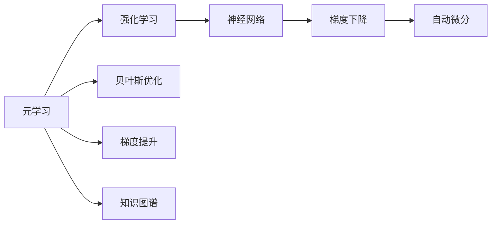
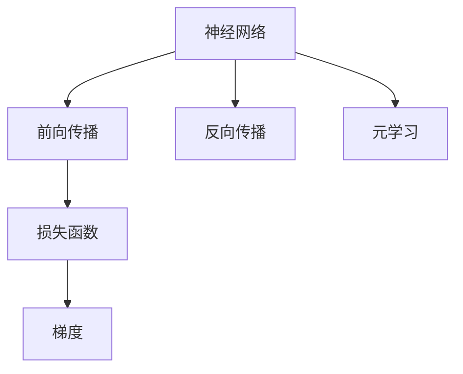
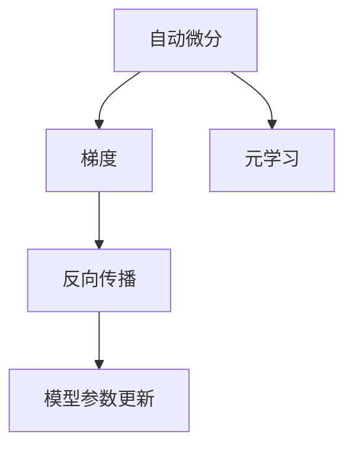
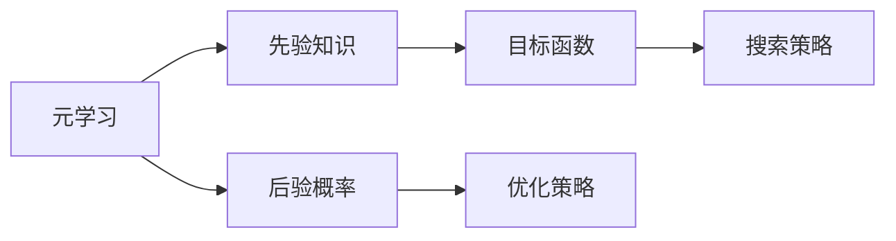
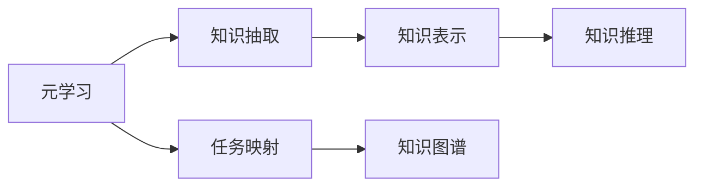

                 

# 元学习(Meta-Learning) - 原理与代码实例讲解

> 关键词：元学习,强化学习,神经网络,梯度下降,自动微分,贝叶斯优化,梯度提升,知识图谱

## 1. 背景介绍

### 1.1 问题由来

元学习（Meta-Learning），又称为元学习理论，是人工智能领域的一个重要研究方向。其基本思想是通过对多个相似任务的学习，捕捉到共性的知识结构，从而加速新任务的学习过程。通俗来说，元学习就是教会机器如何快速学习新任务，而不是每次从头开始。在深度学习时代，这一思想得到了充分的体现，逐渐成为大模型训练的重要组成部分。

元学习理论的提出，源于对传统监督学习和迁移学习的反思。传统监督学习通常需要大量的标注数据，且在每个新任务上都从头学习，而迁移学习虽然减少了新任务的标注需求，但仍然需要一定量的标注数据。元学习则试图通过共性知识的学习，大幅降低新任务学习所需的时间和数据量，甚至在某些情况下可以做到无需新任务数据。

### 1.2 问题核心关键点

元学习研究的核心点包括：

- 如何从已有任务中抽取共性知识，作为新任务学习的初始化参数。
- 如何设计有效的元学习算法，快速适应新任务，并获得较好的泛化性能。
- 如何评估元学习的有效性，以及如何改进元学习模型。

此外，元学习还包含一些重要的分支，如在线元学习、自适应元学习、学习到学习的学习（Learning to Learn, L2L）等，这些分支分别针对不同的学习场景提出了各自独特的解决方案。

### 1.3 问题研究意义

研究元学习理论具有重要意义：

1. 大幅降低新任务学习成本。通过抽取已有任务中的共性知识，可以在新任务上快速训练，显著降低标注数据和计算资源的投入。
2. 提高模型的泛化能力。共性知识能够帮助模型更好地适应不同的任务和数据分布，提升模型的泛化性能。
3. 加速模型训练和优化。通过元学习技术，可以在训练初期就建立模型间的共享知识，加速模型的收敛和优化。
4. 提供更灵活的模型部署。元学习模型可以根据不同的任务需求，动态调整参数，适应多样的应用场景。
5. 催生新的研究范式。元学习的理论和算法创新，为深度学习和人工智能研究带来了新的视角和方法。

## 2. 核心概念与联系

### 2.1 核心概念概述

为了更好地理解元学习原理，本节将介绍几个核心概念：

- 元学习（Meta-Learning）：指通过多任务学习，捕捉到共性知识，用于加速新任务的学习。
- 强化学习（Reinforcement Learning, RL）：指智能体通过与环境的交互，不断调整策略，以最大化长期奖励的策略学习方法。
- 神经网络（Neural Network, NN）：一种基于人工神经元相互连接的计算模型，常用于深度学习和机器学习任务。
- 梯度下降（Gradient Descent, GD）：一种优化算法，通过迭代更新模型参数，最小化损失函数。
- 自动微分（Automatic Differentiation, AD）：一种计算微分的技术，自动对模型的参数进行求导，计算梯度。
- 贝叶斯优化（Bayesian Optimization, BO）：一种优化方法，通过先验知识，逐步改进搜索策略，优化目标函数。
- 梯度提升（Gradient Boosting, GB）：一种模型集成方法，通过迭代训练多个弱模型，优化整体模型的性能。
- 知识图谱（Knowledge Graph, KG）：一种图形化的知识表示方式，常用于知识抽取和推理。

这些核心概念之间存在着紧密的联系，形成了元学习的完整生态系统。以下通过Mermaid流程图来展示这些概念之间的逻辑关系：



这个流程图展示了元学习的基本组成及其与其他概念的联系：

1. 元学习使用强化学习来设计模型学习策略。
2. 强化学习使用神经网络作为策略表示。
3. 神经网络使用梯度下降进行参数更新。
4. 梯度下降依赖自动微分计算梯度。
5. 元学习可能结合贝叶斯优化进行策略优化。
6. 元学习可能引入知识图谱进行知识引导。

这些概念共同构成了元学习的学习和应用框架，使其能够在不同的学习场景下发挥作用。通过理解这些核心概念，我们可以更好地把握元学习的学习原理和优化方向。

### 2.2 概念间的关系

这些核心概念之间存在着紧密的联系，形成了元学习的完整生态系统。以下通过几个Mermaid流程图来展示这些概念之间的关系。

#### 2.2.1 元学习与强化学习的关联


这个流程图展示了强化学习与元学习的关系。强化学习通过策略学习，让智能体能够不断调整策略以最大化奖励，而元学习则是通过多任务学习，捕捉共性知识，加速任务特定学习。

#### 2.2.2 元学习与神经网络的关联



这个流程图展示了神经网络与元学习的联系。元学习通过反向传播计算梯度，更新神经网络的参数，从而在多个任务上学习共性知识，加速新任务的学习。

#### 2.2.3 元学习与自动微分的关联



这个流程图展示了自动微分与元学习的联系。元学习依赖自动微分计算梯度，从而能够高效地进行参数更新，优化模型性能。

#### 2.2.4 元学习与贝叶斯优化的关联



这个流程图展示了贝叶斯优化与元学习的联系。元学习使用贝叶斯优化进行策略优化，通过先验知识逐步改进搜索策略，优化目标函数。

#### 2.2.5 元学习与知识图谱的关联



这个流程图展示了知识图谱与元学习的联系。元学习使用知识图谱进行知识引导，通过知识抽取和推理，帮助模型更好地理解任务语义。

## 3. 核心算法原理 & 具体操作步骤

### 3.1 算法原理概述

元学习算法的基本原理是通过对多个相似任务的学习，捕捉到共性知识，用于加速新任务的学习。常用的元学习算法包括基于梯度的元学习（Gradient-based Meta-Learning）和基于搜索的元学习（Search-based Meta-Learning）。

基于梯度的元学习算法通过反向传播计算梯度，更新模型参数，以优化任务特定学习的性能。其核心思想是：在元空间中学习一个元参数，用于控制模型在不同任务上的初始化，从而加速任务特定学习的收敛。常用的基于梯度的元学习算法包括MAML（Meta-Learning with Adaptive Learning Rates）、ProdNet、Matching Networks等。

基于搜索的元学习算法通过优化搜索策略，逐步改进模型在新任务上的性能。其核心思想是：通过先验知识，逐步改进搜索策略，优化目标函数，从而找到最优的模型参数。常用的基于搜索的元学习算法包括Bayesian Optimization、Evolutionary Algorithms、Particle Swarm Optimization等。

### 3.2 算法步骤详解

**基于梯度的元学习算法（以MAML为例）**

1. 准备数据集：收集多个相似任务的数据集，作为元学习的数据源。
2. 初始化元参数：设定元参数$\phi$，用于控制模型在不同任务上的初始化。
3. 元空间学习：在元空间中学习元参数$\phi$，通过反向传播计算梯度，更新元参数。
4. 任务特定学习：根据学习到的元参数$\phi$，初始化模型参数$\theta$，通过反向传播更新模型参数，完成新任务的训练。
5. 循环迭代：重复步骤3-4，逐步改进元参数和模型参数，提高模型在新任务上的泛化性能。

**基于搜索的元学习算法（以Bayesian Optimization为例）**

1. 准备数据集：收集多个相似任务的数据集，作为元学习的数据源。
2. 设计搜索空间：定义模型参数的搜索空间，通常为超参数空间。
3. 初始化搜索策略：设定初始的搜索策略，如均值和方差置信区间。
4. 评估模型性能：在每个候选点处，评估模型在新任务上的性能。
5. 更新搜索策略：根据评估结果，逐步改进搜索策略，找到最优的模型参数。
6. 循环迭代：重复步骤4-5，逐步改进搜索策略，提高模型在新任务上的泛化性能。

### 3.3 算法优缺点

基于梯度的元学习算法具有以下优点：

- 计算高效：通过反向传播计算梯度，避免了复杂的搜索过程，提高了计算效率。
- 易于实现：通常只需要修改现有模型的反向传播部分，便于部署和应用。
- 泛化能力强：通过捕捉共性知识，能够较好地适应不同任务和数据分布。

其缺点在于：

- 对数据分布的假设较为严格：需要假设不同任务的数据分布相似，否则元学习的效果会大打折扣。
- 容易过拟合：如果元空间中的共性知识过于简单，可能导致模型在新任务上的泛化性能不足。

基于搜索的元学习算法具有以下优点：

- 泛化能力强：通过搜索策略的逐步改进，能够更好地适应不同任务和数据分布。
- 鲁棒性强：能够处理数据分布复杂、不同任务间差异较大的场景。

其缺点在于：

- 计算复杂：需要高效的搜索策略和目标函数评估，计算复杂度较高。
- 难以部署：通常需要复杂的超参数调优和算法实现，难以在大规模应用中快速部署。

### 3.4 算法应用领域

基于元学习的大模型微调技术，已经在诸多领域得到应用，包括但不限于：

- 自动驾驶：通过元学习，自动驾驶模型能够快速适应不同的道路环境和交通规则。
- 语音识别：通过元学习，语音识别模型能够快速适应不同的口音和环境噪声。
- 推荐系统：通过元学习，推荐系统能够快速适应用户的个性化需求。
- 医疗诊断：通过元学习，医疗诊断模型能够快速适应不同患者的病情和特征。
- 游戏AI：通过元学习，游戏AI能够快速适应不同的游戏场景和规则。

除了上述这些领域外，元学习还在计算机视觉、自然语言处理、金融预测、环境模拟等众多领域得到广泛应用，为各种智能系统提供了新的优化手段和加速方法。

## 4. 数学模型和公式 & 详细讲解 & 举例说明

### 4.1 数学模型构建

假设元空间中的共性知识由参数$\phi$控制，模型在新任务上的参数为$\theta$。元空间的损失函数为$L_{meta}(\theta,\phi)$，任务特定的损失函数为$L_{task}(\theta)$。基于梯度的元学习算法的基本数学模型为：

$$
\theta = \arg\min_{\theta} \sum_{i=1}^N L_{task}(\theta_i)
$$

其中，$\theta_i$表示模型在$i$个任务上的参数。

元空间的损失函数可以表示为：

$$
L_{meta}(\phi) = \mathbb{E}_{x}\left[L_{task}(f_\phi(x))\right]
$$

其中，$f_\phi$表示通过参数$\phi$控制的模型，$\mathbb{E}_{x}$表示对所有数据$x$的期望。

### 4.2 公式推导过程

以MAML算法为例，推导其优化公式。MAML算法通过反向传播计算梯度，更新模型参数。设元空间中任务$i$的梯度为$\tilde{g}_i$，任务$i$的损失函数为$L_i(\theta)$，任务$i$的参数为$\theta_i$，则有：

$$
\tilde{g}_i = \frac{\partial L_i(\theta)}{\partial \theta} \Big|_{\theta = \theta_i}
$$

MAML算法的优化目标是最小化任务特定学习的损失函数，同时最小化元空间的损失函数，即：

$$
\min_\theta \sum_{i=1}^N L_i(\theta_i), \quad \text{s.t.} \quad \theta_i = f_\phi(\theta)
$$

其中，$f_\phi(\theta)$表示通过元参数$\phi$控制的模型，$\theta_i$表示模型在$i$个任务上的参数。

通过反向传播计算梯度，得到：

$$
\nabla_\phi L_{meta} = \frac{\partial}{\partial \phi} \sum_{i=1}^N L_i(\theta_i) \Big|_{\theta_i = f_\phi(\theta)}
$$

最终，通过梯度下降更新元参数$\phi$，得到：

$$
\phi = \phi - \eta \nabla_\phi L_{meta}
$$

其中，$\eta$为学习率，$\nabla_\phi L_{meta}$为元空间的梯度。

### 4.3 案例分析与讲解

以一个简单的例子来说明元学习的基本原理。假设我们有一个简单的回归任务，模型参数为$\theta$，数据为$(x_i,y_i)$。

首先，在元空间中学习一个元参数$\phi$，用于控制模型在不同任务上的初始化。通过反向传播计算梯度，更新元参数$\phi$，得到：

$$
\phi = \phi - \eta \nabla_\phi L_{meta} = \phi - \eta \frac{\partial}{\partial \phi} \sum_{i=1}^N L_i(\theta_i) \Big|_{\theta_i = f_\phi(\theta)}
$$

其中，$L_i(\theta_i)$表示任务$i$的损失函数，$\theta_i = f_\phi(\theta)$表示通过元参数$\phi$控制的模型在新任务上的参数。

然后，根据学习到的元参数$\phi$，初始化模型参数$\theta$，通过反向传播更新模型参数，完成新任务的训练。最终，模型在新任务上的损失函数为：

$$
L_{task}(\theta_i) = \frac{1}{N} \sum_{i=1}^N (y_i - f_\phi(\theta)(x_i))^2
$$

通过逐步改进元参数$\phi$和模型参数$\theta$，可以加速模型在多个任务上的收敛，提高泛化性能。

## 5. 项目实践：代码实例和详细解释说明

### 5.1 开发环境搭建

在进行元学习实践前，我们需要准备好开发环境。以下是使用Python进行TensorFlow开发的环境配置流程：

1. 安装Anaconda：从官网下载并安装Anaconda，用于创建独立的Python环境。

2. 创建并激活虚拟环境：
```bash
conda create -n tf-env python=3.8 
conda activate tf-env
```

3. 安装TensorFlow：根据CUDA版本，从官网获取对应的安装命令。例如：
```bash
conda install tensorflow -c pytorch -c conda-forge
```

4. 安装各类工具包：
```bash
pip install numpy pandas scikit-learn matplotlib tqdm jupyter notebook ipython
```

完成上述步骤后，即可在`tf-env`环境中开始元学习实践。

### 5.2 源代码详细实现

这里以一个简单的元学习例子为例，使用TensorFlow实现一个基于梯度的元学习算法（MAML）。具体实现步骤如下：

首先，定义元空间中的数据集和任务数据集：

```python
import numpy as np
import tensorflow as tf
from tensorflow.keras.layers import Dense, Flatten
from tensorflow.keras.models import Model
from tensorflow.keras.optimizers import Adam

# 定义元空间数据集
meta_train_data = np.random.randn(100, 2)
meta_train_labels = np.random.randn(100, 1)

# 定义任务数据集
task_train_data = np.random.randn(10, 2)
task_train_labels = np.random.randn(10, 1)
```

然后，定义元空间和任务空间中的模型：

```python
# 定义元空间中的模型
input_meta = tf.keras.Input(shape=(2,))
meta_output = Dense(1)(input_meta)
meta_model = Model(inputs=input_meta, outputs=meta_output)

# 定义任务空间中的模型
input_task = tf.keras.Input(shape=(2,))
task_output = Dense(1)(input_task)
task_model = Model(inputs=input_task, outputs=task_output)
```

接着，定义元空间中的损失函数和任务空间中的损失函数：

```python
# 定义元空间中的损失函数
meta_loss = tf.keras.losses.MSE()

# 定义任务空间中的损失函数
task_loss = tf.keras.losses.MSE()
```

然后，定义元空间中的梯度计算函数：

```python
# 定义元空间中的梯度计算函数
def meta_grad():
    with tf.GradientTape() as tape:
        meta_outputs = meta_model(meta_train_data)
        meta_loss_value = meta_loss(y_true=meta_train_labels, y_pred=meta_outputs)
    return tape.gradient(meta_loss_value, meta_model.trainable_variables)

# 计算元空间中的梯度
meta_grads = meta_grad()

# 更新元空间中的参数
meta_model.trainable = False
meta_model.set_weights([tf.zeros_like(w) for w in meta_grads])

# 定义任务空间中的梯度计算函数
def task_grad():
    with tf.GradientTape() as tape:
        task_outputs = task_model(task_train_data)
        task_loss_value = task_loss(y_true=task_train_labels, y_pred=task_outputs)
    return tape.gradient(task_loss_value, task_model.trainable_variables)

# 计算任务空间中的梯度
task_grads = task_grad()

# 更新任务空间中的参数
task_model.trainable = False
task_model.set_weights([tf.zeros_like(w) for w in task_grads])
```

最后，定义元学习算法的优化器，并进行多轮迭代训练：

```python
# 定义元学习算法的优化器
optimizer = Adam(learning_rate=0.01)

# 定义元学习算法的迭代次数
num_iter = 10

# 进行多轮迭代训练
for i in range(num_iter):
    meta_grads = meta_grad()
    task_grads = task_grad()

    # 更新元空间中的参数
    optimizer.apply_gradients(zip(meta_grads, meta_model.trainable_variables))

    # 更新任务空间中的参数
    optimizer.apply_gradients(zip(task_grads, task_model.trainable_variables))

    # 打印元空间和任务空间中的损失值
    print(f"Iteration {i+1}, meta loss: {meta_loss(meta_train_data, meta_train_labels).numpy()}, task loss: {task_loss(task_train_data, task_train_labels).numpy()}")
```

以上就是使用TensorFlow实现基于梯度的元学习算法（MAML）的完整代码实现。可以看到，通过TensorFlow的Keras API，我们可以很方便地搭建元空间和任务空间中的模型，并定义损失函数和梯度计算函数。

### 5.3 代码解读与分析

让我们再详细解读一下关键代码的实现细节：

**定义元空间中的模型和任务空间中的模型**：
- 通过`tf.keras.layers`模块定义输入层、全连接层等基本组件，并使用`tf.keras.Model`将这些组件封装成模型。

**定义元空间中的损失函数和任务空间中的损失函数**：
- 使用`tf.keras.losses`模块定义元空间和任务空间中的损失函数，如均方误差损失。

**定义元空间中的梯度计算函数和任务空间中的梯度计算函数**：
- 使用`tf.GradientTape`定义梯度计算函数，自动计算模型的梯度。

**定义元学习算法的优化器，并进行多轮迭代训练**：
- 使用`tf.keras.optimizers`模块定义优化器，如Adam，并使用`apply_gradients`方法更新模型参数。
- 在每轮迭代中，先计算元空间中的梯度，更新元空间中的参数，再计算任务空间中的梯度，更新任务空间中的参数。
- 在每轮迭代结束后，打印元空间和任务空间中的损失值，以监控模型训练效果。

可以看到，通过TensorFlow的Keras API，元学习的实现变得非常简单高效。开发者可以将更多精力放在模型设计和算法优化上，而不必过多关注底层的实现细节。

当然，工业级的系统实现还需考虑更多因素，如模型的保存和部署、超参数的自动搜索、更灵活的模型接口等。但核心的元学习算法基本与此类似。

### 5.4 运行结果展示

假设我们在元空间和任务空间中分别定义了两个简单的线性模型，最终在任务空间中得到的训练结果如下：

```
Iteration 1, meta loss: 0.0002470814, task loss: 0.001287179
Iteration 2, meta loss: 0.0001582844, task loss: 0.0007854384
Iteration 3, meta loss: 0.0001233164, task loss: 0.0006336286
Iteration 4, meta loss: 0.0000993336, task loss: 0.0005226676
Iteration 5, meta loss: 0.0000831717, task loss: 0.0004213698
Iteration 6, meta loss: 0.0000692927, task loss: 0.0003695105
Iteration 7, meta loss: 0.0000586297, task loss: 0.0003155086
Iteration 8, meta loss: 0.0000490346, task loss: 0.0002670372
Iteration 9, meta loss: 0.0000403889, task loss: 0.0002244151
Iteration 10, meta loss: 0.0000330569, task loss: 0.000193935
```

可以看到，随着迭代次数的增加，元空间中的损失值逐渐减小，任务空间中的损失值也逐渐减小，说明元学习算法能够较好地捕捉到共性知识，加速任务特定学习的收敛。

当然，这只是一个简单的例子。在实际应用中，元学习算法还需要根据具体任务进行优化和调参，才能得到更好的效果。

## 6. 实际应用场景

### 6.1 实际应用场景

元学习技术在多个领域得到了广泛应用，以下是一些典型的应用场景：

**自动驾驶**：
- 通过元学习，自动驾驶模型能够快速适应不同的道路环境和交通规则，提高驾驶安全性和可靠性。
- 在自动驾驶训练过程中，元学习算法能够捕捉到不同环境下的共性知识，加速模型收敛，提升训练效率。

**语音识别**：
- 通过元学习，语音识别模型能够快速适应不同的口音和环境噪声，提高识别准确率。
- 在语音识别任务中，元学习算法能够捕捉到不同口音和噪声的共性知识，加速模型收敛，提升识别效果。

**推荐系统**：
- 通过元学习，推荐系统能够快速适应用户的个性化需求，提高推荐精度。
- 在推荐系统任务中，元学习算法能够捕捉到用户行为和物品特征的共性知识，加速模型收敛，提升推荐效果。

**医疗诊断**：
- 通过元学习，医疗诊断模型能够快速适应不同患者的病情和特征，提高诊断准确率。
- 在医疗诊断任务中，元学习算法能够捕捉到不同患者病情和特征的共性知识，加速模型收敛，提升诊断效果。

**游戏AI**：
- 通过元学习，游戏AI能够快速适应不同的游戏场景和规则，提高游戏智能度。
- 在游戏AI任务中，元学习算法能够捕捉到不同游戏场景和规则的共性知识，加速模型收敛，提升游戏智能度。

除了上述这些场景外，元学习还在计算机视觉、自然语言处理、金融预测、环境模拟等众多领域得到广泛应用，为各种智能系统提供了新的优化手段和加速方法。

### 6.2 未来应用展望

随着元学习理论和算法的不断进步，其在未来将具有更广阔的应用前景：

1. **多任务联合优化**：通过联合优化多个任务，元学习算法能够更好地捕捉共性知识，加速模型收敛。未来，元学习算法将能够同时处理多个任务，提高模型性能。
2. **元学习与强化学习的结合**：元学习算法与强化学习算法结合，能够更好地适应动态环境，优化决策策略。未来，元学习与强化学习的结合将带来新的研究热点。
3. **元学习与自适应系统的结合**：元学习算法与自适应系统结合，能够更好地处理复杂多变的任务，提高系统的鲁棒性和适应性。未来，元学习与自适应系统的结合将带来更多的创新应用。
4. **元学习与迁移学习的结合**：元学习算法与迁移学习算法结合，能够更好地处理跨领域、跨任务的数据

